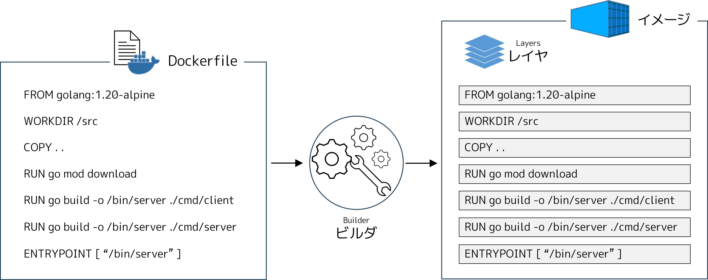
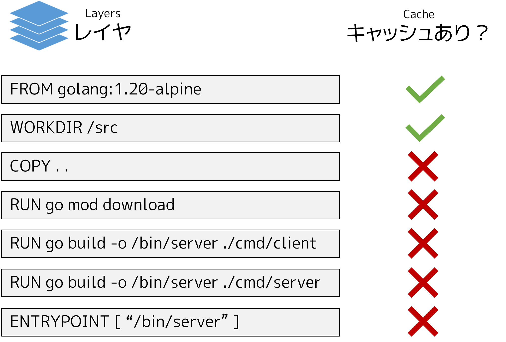

.. -*- coding: utf-8 -*-
.. URL: https://docs.docker.com/build/layers/
   doc version: 24.0
      https://github.com/docker/docs/blob/main/build/guide/layers.md
.. check date: 2023/07/26
.. Commits on Apr 25, 2023 da6586c498f34c0edac3171a48468a0f26aa0182
.. -----------------------------------------------------------------------------

.. Build with Docker
.. _build with Docker:

========================================
レイヤ
========================================

.. sidebar:: 目次

   .. contents:: 
       :depth: 2
       :local:　

.. The order of Dockerfile instructions matter. A Docker build consists of a series of ordered build instructions. Each instruction in a Dockerfile roughly translates to an image layer. The following diagram illustrates how a Dockerfile translates into a stack of layers in a container image.

Dockerfile 命令の順番は重要です。Docker は構築命令の順番に従い、構築を構成します。Dockerfile 内の各命令は、 :ruby:`イメージ レイヤ <image layer>` に大ざっぱに相当します。以下の図が示すのは、Dockerfile がどのようにしてコンテナ内のレイヤ層の積み重なりに変換されるかです。

.. Cached layers
.. _cached-layers:

キャッシュされたレイヤ
==============================

.. When you run a build, the builder attempts to reuse layers from earlier builds. If a layer of an image is unchanged, then the builder picks it up from the build cache. If a layer has changed since the last build, that layer, and all layers that follow, must be rebuilt.

構築を実行するとき、 :ruby:`ビルダ <builder>` は以前に構築したレイヤを再利用しようとします。イメージのレイヤが変更されていない場合は、ビルダは :ruby:`構築キャッシュ <build cache>` からキャッシュを取り出します。最後の構築からレイヤに変更がある場合は、対象レイヤと以降のレイヤをすべて再構築されます。

.. The Dockerfile from the previous section copies all project files to the container (COPY . .) and then downloads application dependencies in the following step (RUN go mod download). If you were to change any of the project files, that would invalidate the cache for the COPY layer. It also invalidates the cache for all of the layers that follow.

前のセクションにある Dockerfile は、全てのプロジェクトファイルをコンテナにコピーします（ ``COPY . .`` ）。それから、続くステップでアプリケーションの依存関係をダウンロードします（ ``RUN go mod download`` ）。プロジェクトのファイルに変更があれば、 ``COPY`` レイヤのキャッシュが無効になります。また、以降に続く、全てのレイヤに対するキャッシュも無効になります。

.. The current order of the Dockerfile instruction make it so that the builder must download the Go modules again, despite none of the packages having changed since last time.

現在の Dockerfile にある命令の順番では、ビルダは Go モジュールをダウンロードする必要があります。前回の構築時からパッケージは何も変わっていないのにもかかわらずです。

.. Update the instruction order
.. _update-the-instruction-order:

命令の順番を変える
====================

.. You can avoid this redundancy by reordering the instructions in the Dockerfile. Change the order of the instructions so that downloading and installing dependencies occurs before you copy the source code over to the container. That way, the builder can reuse the “dependencies” layer from the cache, even when you make changes to your source code.

Dockerfile 内の命令の順番を変えれば、この余計な冗長性を避けられます。ソースコードをコンテナへと渡す前に、ダウンロードと依存関係のインストールをするように命令の順番を変えます。この方法により、ソースコードに変更があったとしても、ビルダがキャッシュから「依存関係」のレイヤを再利用できるようになります。

.. Go uses two files, called go.mod and go.sum, to track dependencies for a project. These files are to Go, what package.json and package-lock.json are to JavaScript. For Go to know which dependencies to download, you need to copy the go.mod and go.sum files to the container. Add another COPY instruction before RUN go mod download, this time copying only the go.mod and go.sum files.

Go は ``go.mod`` と ``go.sum`` と呼ばれる2つのファイルを使い、プロジェクトの依存関係を追跡します。これらのファイルは Go にとって、JavaScript における ``package.json`` と ``package-lock.json`` にあたります。Go がダウンロードすべき依存関係を分かるようにするには、 ``go.mod`` と ``go.sum`` ファイルをコンテナ内にコピーする必要があります。 ``RUN go mod download`` の前に、今回は ``go.mod`` と ``go.sum`` ファイルのみコピーする別の ``COPY`` 命令を追加します。

.. code-block:: diff

     # syntax=docker/dockerfile:1
     FROM golang:{{site.example_go_version}}-alpine
     WORKDIR /src
   - COPY . .
   + COPY go.mod go.sum .
     RUN go mod download
   + COPY . .
     RUN go build -o /bin/client ./cmd/client
     RUN go build -o /bin/server ./cmd/server
     ENTRYPOINT [ "/bin/server" ]

.. Now if you edit the application code, building the image won’t cause the builder to download the dependencies each time. The COPY . . instruction appears after the package management instructions, so the builder can reuse the RUN go mod download layer.

これでアプリケーションのコードを変更したとしても、イメージの構築時に毎回ビルダが依存関係をダウンロードしなくなります。 ``COPY . .`` 命令はパッケージ管理命令の後にあるため、ビルダは ``RUN go mod download`` レイヤを再利用できます。

.. image:: ./images/reordered-layers.png
   :width: 70%
   :alt: 並び替え

.. Summary

まとめ
==========

.. Ordering your Dockerfile instructions appropriately helps you avoid unnecessary work at build time.

Dockerfile に書く命令の順番を適切にしておけば、構築時に不要な処理を防ぐのに役立ちます。

.. Related information:

関連情報：

..  Optimizing builds with cache
    Dockerfile best practices

* :doc:`キャッシュで構築を最適化 </build/cache/index>`
* :doc:`Dickerfile ベストプラクティス </develop/develop-images/dockerfile_best-practices>`

次のステップ
====================

.. The next section shows how you can make the build run faster, and make the resulting output smaller, using multi-stage builds.

次のセクションでは、構築を速くし、最終出力を小さくするため、マルチステージビルドを使う方法を見ていきます。

.. raw:: html

   

      <a href="multi-stage.html" class="btn btn-neutral float-left">マルチステージ </a>
   

----

.. seealso::

   Layers
      https://docs.docker.com/build/guide/layers/

