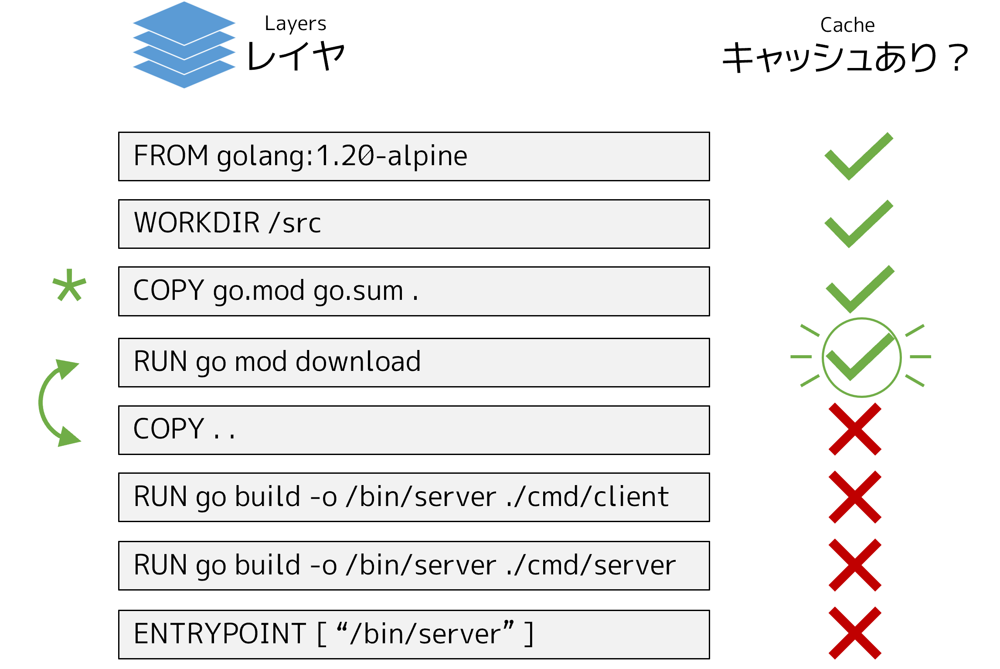

.. -*- coding: utf-8 -*-
.. URL: https://docs.docker.com/build/guide/multi-stage/
   doc version: 24.0
      https://github.com/docker/docs/blob/main/build/guide/multi-stage.md
.. check date: 2023/07/29
.. Commits on Apr 25, 2023 da6586c498f34c0edac3171a48468a0f26aa0182
.. -----------------------------------------------------------------------------

.. Build with Docker
.. _build with Docker:

========================================
レイヤ
========================================

.. sidebar:: 目次

   .. contents:: 
       :depth: 2
       :local:　

.. This section explores multi-stage builds. There are two main reasons for why you’d want to use multi-stage builds:

このセクションはマルチステージビルドを見ていきます。マルチステージビルドを何故使うかには、主に2つの理由があります。

..  They allow you to run build steps in parallel, making your build pipeline faster and more efficient.
    They allow you to create a final image with a smaller footprint, containing only what’s needed to run your program.

* 構築ステップを並列に実行できるので、構築パイプラインをより速くより効率的にできる。
* プログラムを実行するために必要なものだけを含む、形跡が最小の最終イメージを作成できる。

.. In a Dockerfile, a build stage is represented by a FROM instruction. The Dockerfile from the previous section doesn’t leverage multi-stage builds. It’s all one build stage. That means that the final image is bloated with resources used to compile the program.

Dockerfile 内では ``FROM`` 命令によって :ruby:`構築ステージ <build stage>` を表します。前のセクションにある Dockerfile では、マルチステージビルドを活用していませんでした。先ほどは、すべて1つの構築ステージでした。つまり、最終イメージはプログラムのコンパイルに使われたリソースで膨れあがっています。

.. code-block:: bash

   $ docker build --tag=buildme .
   $ docker images buildme
   REPOSITORY   TAG       IMAGE ID       CREATED         SIZE
   buildme      latest    c021c8a7051f   5 seconds ago   150MB

.. The program compiles to executable binaries, so you don’t need Go language utilities to exist in the final image.

.. Add stages
.. _build-add-stages:

ステージの追加
====================

.. Using multi-stage builds, you can choose to use different base images for your build and runtime environments. You can copy build artifacts from the build stage over to the runtime stage.

.. Modify the Dockerfile as follows. This change creates another stage using a minimal scratch image as a base. In the final scratch stage, the binaries built in the previous stage are copied over to the filesystem of the new stage.

.. Summary

まとめ
==========

.. Ordering your Dockerfile instructions appropriately helps you avoid unnecessary work at build time.

Dockerfile に書く命令の順番を適切にしておけば、構築時に不要な処理を防ぐのに役立ちます。

.. Related information:

関連情報：

..  Optimizing builds with cache
    Dockerfile best practices

* :doc:`キャッシュで構築を最適化 </build/cache/index>`
* :doc:`Dickerfile ベストプラクティス </develop/develop-images/dockerfile_best-practices>`

次のステップ
====================

.. The next section shows how you can make the build run faster, and make the resulting output smaller, using multi-stage builds.

次のセクションでは、構築を速くし、最終出力を小さくするため、マルチステージビルドを使う方法を見ていきます。

.. raw:: html

   

      <a href="multi-stage.html" class="btn btn-neutral float-left">マルチステージ </a>
   

----

.. seealso::

   Multi-stage
       https://docs.docker.com/build/guide/multi-stage/

