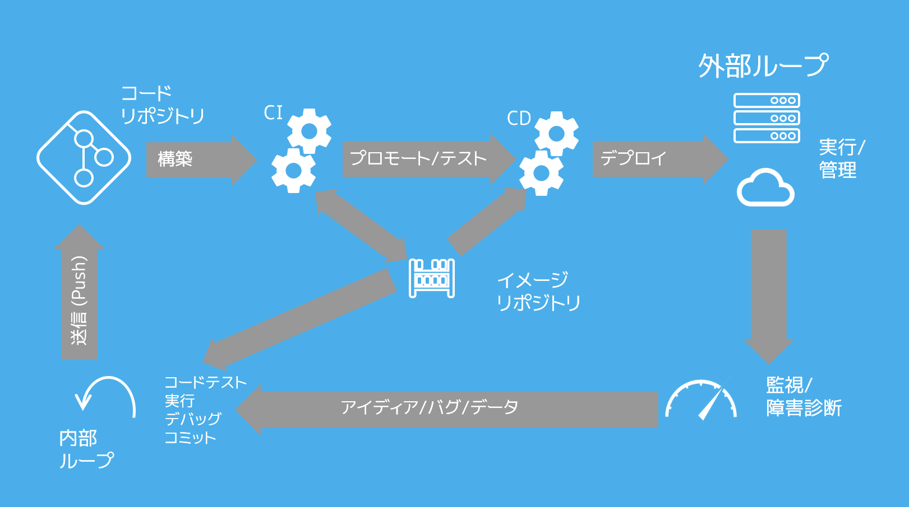

.. -*- coding: utf-8 -*-
.. URL: https://docs.docker.com/ci-cd/best-practices/
   doc version: 20.10
      https://github.com/docker/docker.github.io/blob/master/ci-cd/best-practices.md
.. check date: 2022/09/20
.. Commits on Feb 23, 2022 77f5bef236f7707cf9523b7414d1c693bebec70f
.. -----------------------------------------------------------------------------

.. Best practices for using Docker Hub for CI/CD
.. _best-practices-for-using-docker-hub-for-ci-cd:

==================================================
CI/CD のために Docker Hub を使うベストプラクティス
==================================================

.. sidebar:: 目次

   .. contents:: 
       :depth: 2
       :local:

.. According to the 2020 Jetbrains developer survey , 44% of developers are now using some form of continuous integration and deployment with Docker containers. We understand that a large number of developers have got this set up using Docker Hub as their container registry for part of their workflow. This guide contains some best practices for doing this and provides guidance on how to get started.

`2020 Jetbrains 開発者調査 <https://www.jetbrains.com/lp/devecosystem-2020/>`_ によると、現在、開発者の 44% が継続的インテグレーションと開発に Docker コンテナを使っています。これは、ワークフローの一部であるコンテナ レジストリとして、 Docker Hub を多くの開発者らが利用しているものと理解しています。このガイドで扱うのは、ワークフローのいくつかのベストプラクティスと、始め方の手引きです。

.. We have also heard feedback that given the changes Docker introduced relating to network egress and the number of pulls for free users, that there are questions around the best way to use Docker Hub as part of CI/CD workflows without hitting these limits. This guide covers best practices that improve your experience and uses a sensible consumption of Docker Hub which mitigates the risk of hitting these limits, and contains tips on how to increase the limits depending on your use case.

また、私たちは `Docker が導入したネットワーク :ruby:`出力帯域 <egress>` と free ユーザに対する取得数の変更 <https://www.docker.com/blog/scaling-docker-to-serve-millions-more-developers-network-egress/>`_ に関連するフィードバックも耳にしています。ここでは、これらの制限にあたることなく、 CI/CD ワークフローの一部として Docker Hub を使うベストな方法に関連する疑問も扱います。このガイドでは扱うベストプラクティスには、それら制限にあたる危険性を回避しながら、Docker Hub の体験や合理的な使い方の改善についてや、各々の利用例によっては制限の増やし方に関する助言も含みます。

.. Inner and outer loops
.. _inner-and-outer-loops:

内部と外部のループ
====================

.. To get started, one of the most important things when working with Docker and any CI/CD is to understand when you need to test with the CI, and when you can do this locally. At Docker, we think about how developers work in terms of their inner loop (code, build, run, test) and their outer loop (push changes, CI build, CI test, deployment).

始めるにあたり、CI でテストが必要な場合や、CI をローカルでする場合に、Docker とあらゆる CI/CD とが、どのようにして動作するかの理解が最も重要です。Docker では、 :ruby:`内部ループ <inner loop>` の視点（コードを書き、構築し、実行し、テストする）と :ruby:`外部ループ <outer loop>` の視点（変更を push 、 CI で構築し、 CI でテストし、デプロイする）で、開発者がどのようにして働くかを考えました。

.. Before you think about optimizing your CI/CD, it is important to think about your inner loop and how it relates to the outer loop (the CI). We know that most users don’t prefer ‘debugging through the CI’. Therefore, it is better if your inner loop and outer loop are as similar as possible. We recommend that you run unit tests as part of your docker build command by adding a target for them in your Dockerfile. This way, as you are making changes and rebuilding locally, you can run the same unit tests you would run in the CI on your local machine using a simple command.

CI/CD の最適化を考える前に、自分の内部ループと、それが外部ループとの関係（CI そのもの）について考えるのは重要です。大部分のユーザは「CI を通したデバッグ」を好まないと私たちは知っています。つまり、内部ループと外部ループを可能な限り似せるのが、より良いです。私たちは、ユニットテストを ``docker build`` コマンドの一部として行うよう、それらの対象を Dockerfile 内にいれるのを推奨します。この方法によって、ローカルで変更や再構築ができるのと同様に、シンプルなコマンドを使って、ローカルマシン上の CI 内で同じユニットテストを実行できるでしょう。

.. The blog post Go development with Docker is a great example of how you can use tests in your Docker project and re-use them in the CI. This also creates a shorter feedback loop on issues and reduces the amount of pulls and builds your CI needs to do.

ブログ投稿 `Go development with Docker <https://www.docker.com/blog/tag/go-env-series/>`_ には、Docker プロジェクト内でテストを利用し、それらを CI で再利用するための素晴らしい例があります。また、イシュー（issue）に基づく短いフィードバックループも作成しており、CI が必要とする pull と構築の量を減らしています。

.. Optimizing CI/CD deployments
.. _optimizing-ci-cd-deployments:

CI/CD デプロイの最適化
==============================

.. Once you get into your actual outer loop and Docker Hub, there are a few things you can do to get the most of your CI and deliver the fastest Docker experience.

いったん、実際の外部ループと Docker Hub に入れば、CI を最大限活用して、より速い Docker 体験をもたらすためにできることがいくつかあります。

.. First and foremost, stay secure. When you are setting up your CI, ensure you are using a Docker Hub access token, rather than your password.

第一かつ最も重要なのは、安全の維持です。CI をセットアップする時は、パスワードではなく、 Docker Hub のアクセストークンを確実に使ってください。

..     Note
    You can create new access tokens from your Security page on Docker Hub.

.. note::

   Docker Hub 上の `セキュリティ <https://hub.docker.com/settings/security>`_ ページから、新しい :ruby:`アクセス トークン <access token>` を作成できます。

.. Once you have created access tokens and have added it to a secrets store on your platform, you need to consider when to push and pull in your CI/CD, along with where from, depending on the change you are making.

アクセストークンを作成し、プラットフォーム上のシークレットストアに追加したら、変更が発生した時に、いつ自分の CI/CD に push や pull するか、どこから行うかの検討が必要です。

.. The first thing you can do to reduce the build time and reduce your number of calls is make use of the build cache to reuse layers you have already pulled. You can do this on many platforms by using buildX (buildkits) caching functionality and whatever cache your platform provides. For example, see Optimizing the GitHub Actions workflow using build cache.

第一にできるのは、構築回数を減らし、呼び出す回数の現象であり、そのために **構築キャッシュ（build cache）** を使って既に取得済みのレイヤーを再利用します。buildX（buildkits）のキャッシュ機能を使えば、多くのプラットフォームでこれが行えるようになり、どこでもプラットフォームが提供するものをキャッシュできます。例として、 :ref:`構築キャッシュを使った GitHub Actions ワークフローの最適化 <github-actions-optimizing-the-workflow>` をご覧ください。

.. The other change you may want to make is only have your release images go to Docker Hub. This would mean setting up functions to push your PR images to a more local image store to be quickly pulled and tested, rather than promoting them all the way up to production.

他の変更としては、 Docker Hub に持っていくのはリリースイメージのみにします。つまり、 PullRequest で push したイメージをローカルに保存し、より速く pull してテストする機能をセットアップするのを意味するものであり、すべてを本番環境に持っていくわけではありません。

.. Next steps

次のステップ
====================

.. We know there are a lot more tips and tricks for using Docker in CI. However, we think these are some of the important things, considering the Docker Hub rate limits.

CI で Docker を使うにあたり、多くの助言やコツがあるのを知りました。しかしながら、ある種の重要な項目である :doc:`Docker Hub のレート制限（rate limits）</docker-hub/download-rate-limit>` を検討します。

..  Note
    If you are still experiencing issues with pull limits after you are authenticated, you can consider upgrading to a Docker subscription.

.. note::

   認証後に、 pull 制限の問題を既に経験している場合は、 `Docker サブスクリプション <https://www.docker.com/pricing>`_ へのアップグレードをご検討ください。

.. For information on how to configure GitHub Actions CI/CD pipeline, see Configure GitHub Actions.

GitHub Actions CI/CD パイプラインの設定方法に関する情報は、 :doc:`GitHub Actions の設定 <github-actions>` をご覧ください。

.. seealso::

   Best practices for using Docker Hub for CI/CD
      https://docs.docker.com/ci-cd/best-practices/

