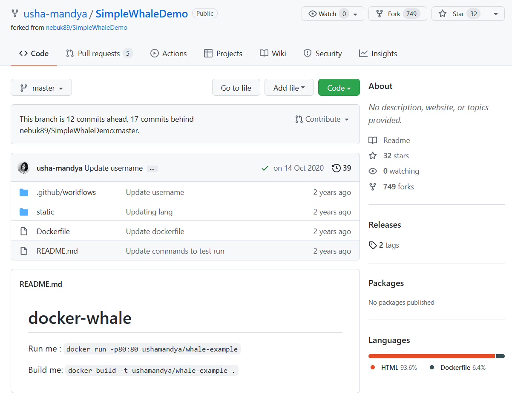

.. -*- coding: utf-8 -*-
.. URL: https://docs.docker.com/ci-cd/github-actions/
   doc version: 20.10
      https://github.com/docker/docker.github.io/blob/master/ci-cd/github-actions.md
.. check date: 2022/04/26
.. Commits on Feb 28, 2022 5e03b90d842947f7e2e8234dd9e80c9c3a98465d
.. -----------------------------------------------------------------------------

.. Configure GitHub Actions
.. _configure-github-actions:

==================================================
GitHub Actions の設定
==================================================

.. sidebar:: 目次

   .. contents:: 
       :depth: 2
       :local:

.. This page guides you through the process of setting up a GitHub Action CI/CD pipeline with Docker. Before setting up a new pipeline, we recommend that you take a look at Ben’s blog on CI/CD best practices.

このページでは、 Docker を使った GitHub Action CI/CD パイプラインの設定手順を説明します。新しいパイプラインを設定する前に、CI/CD のベストプラクティスに関する `Ben 氏のブログ <https://www.docker.com/blog/best-practices-for-using-docker-hub-for-ci-cd/>`_ をご覧いただくのを推奨します。

.. This guide contains instructions on how to:

このガイドで扱う手順は、以下の方法です。

..  Use a sample Docker project as an example to configure GitHub Actions.
    Set up the GitHub Actions workflow.
    Optimize your workflow to reduce build time.
    Push only specific versions to Docker Hub.

1. GitHub Actions を設定するための例として、サンプルの Docker プロジェクトを使う
2. GitHub Actions ワークフローを設定する
3. 構築回数を減らすようワークフローを最適化
4. 特定のバージョンのみ Docker Hub に送信

.. Set up a Docker project
.. _github-actions-set-up-a-docker-project:
Docker プロジェクトのセットアップ
========================================

.. Let’s get started. This guide uses a simple Docker project as an example. The SimpleWhaleDemo repository contains a Nginx alpine image. You can either clone this repository, or use your own Docker project.

それでは始めましょう。このガイドでは例としてシンプルな Docker プロジェクトを使います。 `SimpleWhaleDemo <https://github.com/usha-mandya/SimpleWhaleDemo>`_ リポジトリには、 Nginx alpine イメージを含みます。このリポジトリをクローンするか、自分の Docker プロジェクトを使います。

.. Before we start, ensure you can access Docker Hub from any workflows you create. To do this:

はじめる前に、作成するワークフローから `Docker Hub <https://hub.docker.com/>` へアクセスできるようにします。そのためには、以下の作業をします。

(以下TBD)

.. seealso::

   Configure GitHub Actions
      https://docs.docker.com/ci-cd/github-actions/

