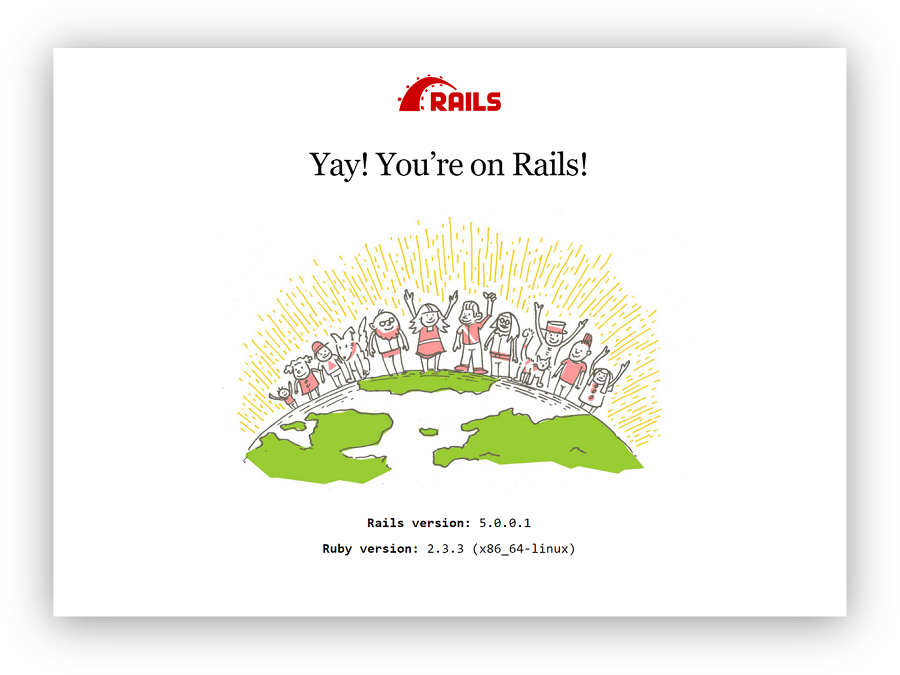

.. -*- coding: utf-8 -*-
.. URL: https://docs.docker.com/compose/rails/
.. SOURCE: https://github.com/docker/compose/blob/master/docs/rails.md
   doc version: 1.11
      https://github.com/docker/compose/commits/master/docs/rails.md
.. check date: 2016/04/28
.. Commits on Mar 28, 2016 93901ec4805b0a72ba71ae910d3214e4856cd876
.. ----------------------------------------------------------------------------

.. title: "Quickstart: Compose and Rails"

=================================================
クィックスタート: Compose と Rails
=================================================

.. sidebar:: 目次

   .. contents:: 
       :depth: 3
       :local:

.. This Quickstart guide will show you how to use Docker Compose to set up and run
   a Rails/PostgreSQL app. Before starting, you'll need to have [Compose
   installed](install.md).

このクィックスタートガイドでは Docker Compose を使って、簡単な Rails/PostgreSQL アプリを設定し実行する手順を示します。
はじめるには :doc:`Compose のインストール <install>` が必要です。

.. ### Define the project

プロジェクトの定義
-------------------

.. Start by setting up the four files you'll need to build the app. First, since
   your app is going to run inside a Docker container containing all of its
   dependencies, you'll need to define exactly what needs to be included in the
   container. This is done using a file called `Dockerfile`. To begin with, the
   Dockerfile consists of:

アプリのビルドに必要となる 4 つのファイルを作るところから始めます。
まずアプリケーションは、その依存パッケージも含め、すべてを Docker コンテナの内部にて実行するようにします。
そこでコンテナ内に含めるものが何であるのかは、正確に定義する必要があります。
これを行うのが ``Dockerfile`` というファイルです。
まずは Dockerfile を以下のようにします。

..  FROM ruby:2.3.3
    RUN apt-get update -qq && apt-get install -y build-essential libpq-dev nodejs
    RUN mkdir /myapp
    WORKDIR /myapp
    ADD Gemfile /myapp/Gemfile
    ADD Gemfile.lock /myapp/Gemfile.lock
    RUN bundle install
    ADD . /myapp

.. code-block:: dockerfile

   FROM ruby:2.3.3
   RUN apt-get update -qq && apt-get install -y build-essential libpq-dev nodejs
   RUN mkdir /myapp
   WORKDIR /myapp
   ADD Gemfile /myapp/Gemfile
   ADD Gemfile.lock /myapp/Gemfile.lock
   RUN bundle install
   ADD . /myapp

.. That'll put your application code inside an image that will build a container
   with Ruby, Bundler and all your dependencies inside it. For more information on
   how to write Dockerfiles, see the [Docker user
   guide](/engine/tutorials/dockerimages.md#building-an-image-from-a-dockerfile)
   and the [Dockerfile reference](/engine/reference/builder.md).

上の設定はイメージ内部にアプリケーション・コードを置きます。
そして Ruby、Bundler などの依存パッケージすべてをコンテナ内部においてビルドします。
Dockerfile の記述方法の詳細は :ref:`Docker ユーザ・ガイド <building-an-image-from-a-dockerfile>` や :doc:`Dockerfile リファレンス </engine/reference/builder>` を参照してください。

.. Next, create a bootstrap `Gemfile` which just loads Rails. It'll be overwritten
   in a moment by `rails new`.

次にブートストラップを行うファイル ``Gemfile`` を生成して、Rails をロードできるようにします。
このファイルは ``rails new`` を行ったタイミングで書き換わります。

..  source 'https://rubygems.org'
    gem 'rails', '5.0.0.1'

.. code-block:: ruby

   source 'https://rubygems.org'
   gem 'rails', '5.0.0.1'

.. You'll need an empty `Gemfile.lock` in order to build our `Dockerfile`.

空のファイル ``Gemfile.lock`` を生成して ``Dockerfile`` のビルドができるようにします。

..  touch Gemfile.lock

.. code-block:: bash

   touch Gemfile.lock

.. Finally, `docker-compose.yml` is where the magic happens. This file describes
   the services that comprise your app (a database and a web app), how to get each
   one's Docker image (the database just runs on a pre-made PostgreSQL image, and
   the web app is built from the current directory), and the configuration needed
   to link them together and expose the web app's port.

最後に ``docker-compose.yml`` が取りまとめてくれます。
このファイルには、データベースとウェブという 2 つのアプリを含んだサービスが定義されています。
そしてそれぞれの Docker イメージをどう作るかが示されています。
（データベースは既存の PostgreSQL イメージにより動作します。
ウェブアプリはカレントディレクトリ内に生成されます。）
また、リンクによってそれを結び合わせることが設定されていて、ウェブ・アプリのポートは外部に公開されています。

..  version: '3'
    services:
      db:
        image: postgres
      web:
        build: .
        command: bundle exec rails s -p 3000 -b '0.0.0.0'
        volumes:
          - .:/myapp
        ports:
          - "3000:3000"
        depends_on:
          - db

.. code-block:: yaml

   version: '3'
   services:
     db:
       image: postgres
     web:
       build: .
       command: bundle exec rails s -p 3000 -b '0.0.0.0'
       volumes:
         - .:/myapp
       ports:
         - "3000:3000"
       depends_on:
         - db
   
.. >**Tip**: You can use either a `.yml` or `.yaml` extension for this file.

.. tip::

   このファイルの拡張子は ``.yml`` と ``.yaml`` のどちらでも構いません。

.. ### Build the project

プロジェクトのビルド
---------------------

.. With those four files in place, you can now generate the Rails skeleton app
   using [docker-compose run](/compose/reference/run/):

ここまでの 4 つのファイルを使って :doc:`docker-compose run </compose/reference/run>` を実行し、Rails アプリのひながたを生成します。

..  docker-compose run web rails new . --force --database=postgresql

.. code-block:: bash

   docker-compose run web rails new . --force --database=postgresql

.. First, Compose will build the image for the `web` service using the
   `Dockerfile`. Then it will run `rails new` inside a new container, using that
   image. Once it's done, you should have generated a fresh app.

最初に Compose は ``Dockerfile`` を用いて ``web`` サービスに対するイメージをビルドします。
そしてこのイメージを利用して、新たに生成されたコンテナ内にて ``rails new`` を実行します。
処理が完了すれば、できたてのアプリが生成されているはずです。

.. List the files.

ファイル一覧を見てみます。

.. ```shell
   $ ls -l
   total 64
   -rw-r--r--   1 vmb  staff   222 Jun  7 12:05 Dockerfile
   -rw-r--r--   1 vmb  staff  1738 Jun  7 12:09 Gemfile
   -rw-r--r--   1 vmb  staff  4297 Jun  7 12:09 Gemfile.lock
   -rw-r--r--   1 vmb  staff   374 Jun  7 12:09 README.md
   -rw-r--r--   1 vmb  staff   227 Jun  7 12:09 Rakefile
   drwxr-xr-x  10 vmb  staff   340 Jun  7 12:09 app
   drwxr-xr-x   8 vmb  staff   272 Jun  7 12:09 bin
   drwxr-xr-x  14 vmb  staff   476 Jun  7 12:09 config
   -rw-r--r--   1 vmb  staff   130 Jun  7 12:09 config.ru
   drwxr-xr-x   3 vmb  staff   102 Jun  7 12:09 db
   -rw-r--r--   1 vmb  staff   211 Jun  7 12:06 docker-compose.yml
   drwxr-xr-x   4 vmb  staff   136 Jun  7 12:09 lib
   drwxr-xr-x   3 vmb  staff   102 Jun  7 12:09 log
   drwxr-xr-x   9 vmb  staff   306 Jun  7 12:09 public
   drwxr-xr-x   9 vmb  staff   306 Jun  7 12:09 test
   drwxr-xr-x   4 vmb  staff   136 Jun  7 12:09 tmp
   drwxr-xr-x   3 vmb  staff   102 Jun  7 12:09 vendor
   
   ```

.. code-block:: bash

   $ ls -l
   total 64
   -rw-r--r--   1 vmb  staff   222 Jun  7 12:05 Dockerfile
   -rw-r--r--   1 vmb  staff  1738 Jun  7 12:09 Gemfile
   -rw-r--r--   1 vmb  staff  4297 Jun  7 12:09 Gemfile.lock
   -rw-r--r--   1 vmb  staff   374 Jun  7 12:09 README.md
   -rw-r--r--   1 vmb  staff   227 Jun  7 12:09 Rakefile
   drwxr-xr-x  10 vmb  staff   340 Jun  7 12:09 app
   drwxr-xr-x   8 vmb  staff   272 Jun  7 12:09 bin
   drwxr-xr-x  14 vmb  staff   476 Jun  7 12:09 config
   -rw-r--r--   1 vmb  staff   130 Jun  7 12:09 config.ru
   drwxr-xr-x   3 vmb  staff   102 Jun  7 12:09 db
   -rw-r--r--   1 vmb  staff   211 Jun  7 12:06 docker-compose.yml
   drwxr-xr-x   4 vmb  staff   136 Jun  7 12:09 lib
   drwxr-xr-x   3 vmb  staff   102 Jun  7 12:09 log
   drwxr-xr-x   9 vmb  staff   306 Jun  7 12:09 public
   drwxr-xr-x   9 vmb  staff   306 Jun  7 12:09 test
   drwxr-xr-x   4 vmb  staff   136 Jun  7 12:09 tmp
   drwxr-xr-x   3 vmb  staff   102 Jun  7 12:09 vendor

.. If you are running Docker on Linux, the files `rails new` created are owned by
   root. This happens because the container runs as the root user. If this is the
   case, change the ownership of the new files.

Linux 上で Docker を利用している場合、``rails new`` により生成されたファイルの所有者は root になります。
これはコンテナが root ユーザにより実行されているためです。
この場合は、生成されたファイルの所有者を以下のように変更してください。

.. ```shell
   sudo chown -R $USER:$USER .
   ```
.. code-block:: bash

   sudo chown -R $USER:$USER .

.. If you are running Docker on Mac or Windows, you should already have ownership
   of all files, including those generated by `rails new`.

Docker on Mac あるいは Docker on Windows を利用している場合、``rails new`` により生成されたファイルも含め、すべてのファイルに対しての所有権は、正しく設定されているはずです。

.. Now that you’ve got a new Gemfile, you need to build the image again. (This, and
   changes to the `Gemfile` or the Dockerfile, should be the only times you’ll need
   to rebuild.)

ここに新たな Gemfile が作成されたので、イメージを再ビルドすることが必要です。
（再ビルドが必要になるのは、今の時点、あるいは一般的には ``Gemfile`` や Dockerfile を修正したときだけです。）

..  docker-compose build

.. code-block:: bash

   docker-compose build


.. ### Connect the database

データベースの接続設定
-----------------------

.. The app is now bootable, but you're not quite there yet. By default, Rails
   expects a database to be running on `localhost` - so you need to point it at the
   `db` container instead. You also need to change the database and username to
   align with the defaults set by the `postgres` image.

アプリは実行可能ですが、実行するのはまだです。
デフォルトで Rails は ``localhost`` において実行されているデータベースを用います。
したがってここでは ``db`` コンテナを用いるように書き換える必要があります。
また ``postgres`` イメージにおいて設定されているデフォルトのデータベース名、ユーザ名を変更することも必要です。

.. Replace the contents of `config/database.yml` with the following:

``config/database.yml`` の記述内容を以下のように書き換えます。

.. ```none
   default: &default
     adapter: postgresql
     encoding: unicode
     host: db
     username: postgres
     password:
     pool: 5
   
   development:
     <<: *default
     database: myapp_development
   
   
   test:
     <<: *default
     database: myapp_test
   ```
.. code-block:: yaml

   default: &default
     adapter: postgresql
     encoding: unicode
     host: db
     username: postgres
     password:
     pool: 5
   
   development:
     <<: *default
     database: myapp_development
   
   
   test:
     <<: *default
     database: myapp_test

.. You can now boot the app with [docker-compose up](/compose/reference/up/):

:doc:`docker-compose up </compose/reference/up>` によりアプリを起動します。

..  docker-compose up

.. code-block:: bash

   docker-compose up

.. If all's well, you should see some PostgreSQL output, and then—after a few
   seconds—the familiar refrain:

正常に動作すれば、PostgreSQL による出力が確認できるはずです。
そしてすぐに、いつもの出力が続きます。

.. code-block:: bash

   Starting rails_db_1 ...
   Starting rails_db_1 ... done
   Recreating rails_web_1 ...
   Recreating rails_web_1 ... done
   Attaching to rails_db_1, rails_web_1
   db_1   | LOG:  database system was shut down at 2017-06-07 19:12:02 UTC
   db_1   | LOG:  MultiXact member wraparound protections are now enabled
   db_1   | LOG:  database system is ready to accept connections
   db_1   | LOG:  autovacuum launcher started
   web_1  | => Booting Puma
   web_1  | => Rails 5.0.0.1 application starting in development on http://0.0.0.0:3000
   web_1  | => Run `rails server -h` for more startup options
   web_1  | Puma starting in single mode...
   web_1  | * Version 3.9.1 (ruby 2.3.3-p222), codename: Private Caller
   web_1  | * Min threads: 5, max threads: 5
   web_1  | * Environment: development
   web_1  | * Listening on tcp://0.0.0.0:3000
   web_1  | Use Ctrl-C to stop

.. Finally, you need to create the database. In another terminal, run:

最後にデータベースを生成することが必要です。
別の端末から以下を実行します。

..  docker-compose run web rake db:create

.. code-block:: bash

   docker-compose run web rake db:create

.. Here is an example of the output from that command:

コマンドから出力される結果は、たとえば以下のようになります。

.. ```none
   vmb at snapair in ~/sandbox/rails
   $ docker-compose run web rake db:create
   Starting rails_db_1 ... done
   Created database 'myapp_development'
   Created database 'myapp_test'
   ```
.. code-block:: bash

   vmb at snapair in ~/sandbox/rails
   $ docker-compose run web rake db:create
   Starting rails_db_1 ... done
   Created database 'myapp_development'
   Created database 'myapp_test'

.. ### View the Rails welcome page!

Rails の「ようこそ」ページの確認
---------------------------------

.. That's it. Your app should now be running on port 3000 on your Docker daemon.

以上です。
Docker デーモンを通じて、アプリがポート 3000 番を使って実行されています。

.. On Docker for Mac and Docker for Windows, go to `http://localhost:3000` on a web
   browser to see the Rails Welcome.

Docker Desktop for Mac や Docker Desktop for Windows の場合は、ウェブ・ブラウザから ``http://localhost:3000`` にアクセスすれば Rails のようこそページを確認できます。

.. If you are using [Docker Machine](/machine/overview.md), then `docker-machine ip
   MACHINE_VM` returns the Docker host IP address, to which you can append the port
   (`<Docker-Host-IP>:3000`).

:doc:`Docker Machine </machine/overview>` を利用している場合は、``docker-machine ip MACHINE_VM`` を実行すると Docker ホストの IP アドレスを得ることができます。
これにポート番号をつけて利用します。
（``<Docker-Host-IP>:3000`` ）

.. 



.. ### Stop the application

アプリケーションの停止
-----------------------

.. To stop the application, run [docker-compose down](/compose/reference/down/) in
   your project directory. You can use the same terminal window in which you
   started the database, or another one where you have access to a command prompt.
   This is a clean way to stop the application.

アプリケーションを停止するには、プロジェクト・ディレクトリにおいて :doc:`docker-compose down </compose/reference/down>` を実行します。
この場合に用いる端末画面は、データベースを起動したときと同じものを用いるか、あるいはコマンド・プロンプトにアクセスできる別画面であっても構いません。
これがアプリケーションを適切に停止する方法です。

.. ```none
   vmb at snapair in ~/sandbox/rails
   $ docker-compose down
   Stopping rails_web_1 ... done
   Stopping rails_db_1 ... done
   Removing rails_web_run_1 ... done
   Removing rails_web_1 ... done
   Removing rails_db_1 ... done
   Removing network rails_default
   
   ```
.. code-block:: bash

   vmb at snapair in ~/sandbox/rails
   $ docker-compose down
   Stopping rails_web_1 ... done
   Stopping rails_db_1 ... done
   Removing rails_web_run_1 ... done
   Removing rails_web_1 ... done
   Removing rails_db_1 ... done
   Removing network rails_default
   

.. You can also stop the application with `Ctrl-C` in the same shell in which you
   executed the `docker-compose up`.  If you stop the app this way, and attempt to
   restart it, you might get the following error:

アプリケーションの停止はまた、``docker-compose up`` を実行したシェルにおいて ``Ctrl-C`` を入力することでも実現できます。
ただしこの方法で停止した場合に、さらに再起動しようとすると、以下のようなエラーが発生するかもしません。

.. ```none
   web_1 | A server is already
   running. Check /myapp/tmp/pids/server.pid.
   ```
.. code-block:: bash

   web_1 | A server is already
   running. Check /myapp/tmp/pids/server.pid.

.. To resolve this, delete the file `tmp/pids/server.pid`, and then re-start the
   application with `docker-compose up`.

このエラーを解決するには、``tmp/pids/server.pid`` を削除してから、再び ``docker-compose up`` を実行すれば、アプリケーションを再起動することができます。

.. ### Restart the application

アプリケーションの再起動
-------------------------

.. To restart the application:

アプリケーションを再起動するには、以下を実行します。

.. 1. Run `docker-compose up` in the project directory.
   2. Run this command in another terminal to restart the database: `docker-compose run web rake db:create`

1. プロジェクト・ディレクトリにて ``docker-compose up`` を実行します。
2. 以下のコマンドを別の端末から実行して、データベースを再起動します。
   ``docker-compose run web rake db:create``

.. ### Rebuild the application

アプリケーションの再ビルド
---------------------------

.. If you make changes to the Gemfile or the Compose file to try out some different
   configurations, you will need to rebuild. Some changes will require only
   `docker-compose up --build`, but a full rebuild requires a re-run of
   `docker-compose run web bundle install` to sync changes in the `Gemfile.lock` to
   the host, followed by `docker-compose up --build`.

Gemfile や Compose ファイルを編集して、いろいろと別の設定とした場合には、再ビルドが必要になります。
変更内容によっては ``docker-compose up --build`` だけで済む場合もあります。
しかし完全に再ビルドを行うには、``docker-compose run web bundle install`` を再度実行して、ホストにおける ``Gemfile.lock`` の変更と同期を取ることが必要になります。
その後に ``docker-compose up --build`` を実行します。

.. Here is an example of the first case, where a full rebuild is not necessary.
   Suppose you simply want to change the exposed port on the local host from `3000`
   in our first example to `3001`. Make the change to the Compose file to expose
   port `3000` on the container through a new port, `3001`, on the host, and save
   the changes:

以下に示すのは前者、つまり完全な再ビルドは必要としない例です。
ローカルホスト側の公開ポートを ``3000`` から ``3001`` に変更する場合を取り上げます。
Compose ファイルにおいて、コンテナ側にて ``3000`` としているポートを新たなポート ``3001`` に変更します。
そしてこの変更を保存します。

.. ```none
   ports: - "3001:3000"
   ```
.. code-block:: yaml

   ports: - "3001:3000"

.. Now, rebuild and restart the app with `docker-compose up --build`, then restart
   the database: `docker-compose run web rake db:create`.

再ビルドとアプリの再起動は ``docker-compose up --build`` により行います。
そしてデータベースの再起動は ``docker-compose run web rake db:create`` を実行します。

.. Inside the container, your app is running on the same port as before `3000`, but
   the Rails Welcome is now available on `http://localhost:3001` on your local
   host.

コンテナ内部において、アプリはそれまでと変わらないポート ``3000`` で稼動していますが、ローカルホスト上から Rails ようこそページにアクセスするのは ``http://localhost:3001`` となります。


.. ## More Compose documentation

Compose ドキュメント
==============================

..
    User guide
    Installing Compose
    Getting Started
    Get started with Django
    Get started with WordPress
    Command line reference
    Compose file reference

* :doc:`ユーザガイド <index>`
* :doc:`/compose/install`
* :doc:`/compose/gettingstarted`
* :doc:`/compose/django`
* :doc:`/compose/wordpress`
* :doc:`/compose/reference/index`
* :doc:`/compose/compose-file`

.. seealso:: 

   Quickstart: Compose and Rails
      https://docs.docker.com/compose/rails/

