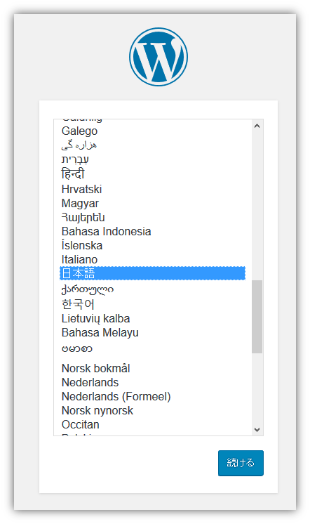
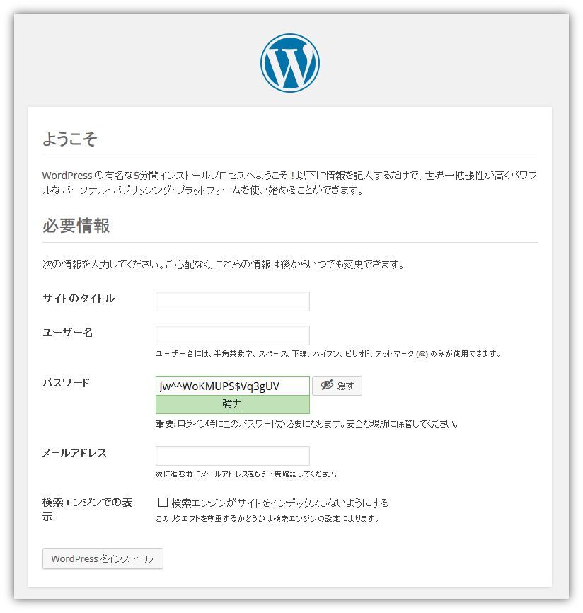

.. -*- coding: utf-8 -*-
.. URL: https://docs.docker.com/compose/wordpress/
.. SOURCE: https://github.com/docker/compose/blob/master/docs/wordpress.md
   doc version: 1.11
      https://github.com/docker/compose/commits/master/docs/wordpress.md
.. check date: 2016/04/28
.. Commits on Apr 9, 2016 4192a009da5cbae5c811b3b965e4ecb4572c95f6
.. ----------------------------------------------------------------------------

.. Quickstart Guide: Docker Compose and WordPress

=====================================================
クイックスタート・ガイド：Docker Compose と Wordpress
=====================================================

.. sidebar:: 目次

   .. contents:: 
       :depth: 3
       :local:

.. You can use Docker Compose to easily run WordPress in an isolated environment built with Docker containers. This quick-start guide demonstrates how to use Compose to set up and run WordPress. Before starting, you’ll need to have Compose installed.

Docker Compose を使えば、Docker コンテナで構築した WordPress の独立した環境を簡単に実行できます。このクイックスタート・ガイドでは、Compose のセットアップ方法と WordPress の実行方法を紹介します。事前に :doc:`Compose のインストール </compose/install>` が必要です。

.. Define the project

プロジェクトの定義
====================

..    Create an empty project directory.

1. プロジェクト用の空のディレクトリを作成します。

..    You can name the directory something easy for you to remember. This directory is the context for your application image. The directory should only contain resources to build that image.

覚えやすい名前のディレクトリを作成します。このディレクトリがアプリケーション・イメージの内容（コンテクスト）となるものです。ディレクトリには、イメージ構築に関するリソースのみ置くべきです。

.. This project directory will contain a docker-compose.yaml file which will be complete in itself for a good starter wordpress project.

プロジェクト用ディレクトリには ``docker-compose.yml`` ファイルを置きます。このファイル自身が wordpress プロジェクトの良いスタートを切ります。

.. Change directories into your project directory.

2. ディレクトリをプロジェクト用ディレクトリに変更します。

.. For example, if you named your directory my_wordpress:

たとえば、ディレクトリ名が ``my_wordpress`` の場合は：

.. code-block:: bash

   $ cd my-wordpress/

.. Create a docker-compose.yml file that will start your Wordpress blog and a separate MySQL instance with a volume mount for data persistence:

3. ``docker-compose.yml`` ファイルを作成します。このファイルは ``wordpress`` ブログと ``MySQL`` インスタンスを個別に起動します。 ``MySQL`` インスタンスはデータを保持するためにボリュームをマウントします。

.. code-block:: yaml

   version: '2'
   services:
     db:
       image: mysql:5.7
       volumes:
         - "./.data/db:/var/lib/mysql"
       restart: always
       environment:
         MYSQL_ROOT_PASSWORD: wordpress
         MYSQL_DATABASE: wordpress
         MYSQL_USER: wordpress
         MYSQL_PASSWORD: wordpress
   
     wordpress:
       depends_on:
         - db
       image: wordpress:latest
       links:
         - db
       ports:
         - "8000:80"
       restart: always
       environment:
         WORDPRESS_DB_HOST: db:3306
         WORDPRESS_DB_PASSWORD: wordpress

.. NOTE: The folder ./.data/db will be automatically created in the project directory alongside the docker-compose.yml which will persist any updates made by wordpress to the database.

.. note::

   ``docker-compose.yml`` があるプロジェクトのディレクトリ内に  ``./.data/db`` ディレクトリを自動的に作成します。wordpress がデータベースに対して更新したあらゆるデータは、このディレクトリで保持します。

.. Build the project

プロジェクトの構築
====================

.. Now, run docker-compose up -d from your project directory.

あとは、プロジェクト用ディレクトリで ``docker-compose up -d`` を実行します。

.. This pulls the needed images, and starts the wordpress and database containers, as shown in the example below.

必要なイメージを取得し、wordpress とデータベースのコンテナを起動します。次のように画面に表示します。

.. code-block:: bash

   $ docker-compose up -d
   Creating network "my_wordpress_default" with the default driver
   Pulling db (mysql:5.7)...
   5.7: Pulling from library/mysql
   efd26ecc9548: Pull complete
   a3ed95caeb02: Pull complete
   ...
   Digest: sha256:34a0aca88e85f2efa5edff1cea77cf5d3147ad93545dbec99cfe705b03c520de
   Status: Downloaded newer image for mysql:5.7
   Pulling wordpress (wordpress:latest)...
   latest: Pulling from library/wordpress
   efd26ecc9548: Already exists
   a3ed95caeb02: Pull complete
   589a9d9a7c64: Pull complete
   ...
   Digest: sha256:ed28506ae44d5def89075fd5c01456610cd6c64006addfe5210b8c675881aff6
   Status: Downloaded newer image for wordpress:latest
   Creating my_wordpress_db_1
   Creating my_wordpress_wordpress_1

.. Bring up WordPress in a web browser

.. _bring-up-wordpress-in-a-web-browser:

ウェブ・ブラウザで WordPress を開く
========================================

.. If you're using Docker Machine, then docker-machine ip MACHINE_VM gives you the machine address and you can open http://MACHINE_VM_IP:8000 in a browser.

:doc:`Docker Machine </machine/index>` を使っている場合は、 ``docker-machine ip マシン名`` を実行するとマシンの IP アドレスを表示します。そしてブラウザで ``http://マシンのIP:8000`` を開きます。

.. At this point, WordPress should be running on port 8000 of your Docker Host, and you can complete the "famous five-minute installation" as a WordPress administrator.

この時点では WordPress は Docker ホスト上のポート 8000 で動作しています。そして、WordPress の管理者にとっては「有名な５分間のインストール」を行うだけです。

.. NOTE: The Wordpress site will not be immediately available on port 8000 because the containers are still being initialized and may take a couple of minutes before the first load.

.. note::

   WordPress のサイトはポート 8000 で即時利用可能になりません。なぜなら、初回読み込み時にはコンテナの初期化のために２~３分ほど必要な場合があるためです。

   

.. More Compose documentation

Compose の更なるドキュメント
==============================

..
    User guide
    Installing Compose
    Getting Started
    Get started with Django
    Get started with Rails
    Command line reference
    Compose file reference

* :doc:`ユーザガイド <index>`
* :doc:`/compose/install`
* :doc:`/compose/gettingstarted`
* :doc:`/compose/django`
* :doc:`/compose/rails`
* :doc:`/compose/reference/index`
* :doc:`/compose/compose-file`

.. seealso:: 

   Quickstart: Docker Compose and WordPress
      https://docs.docker.com/compose/wordpress/

