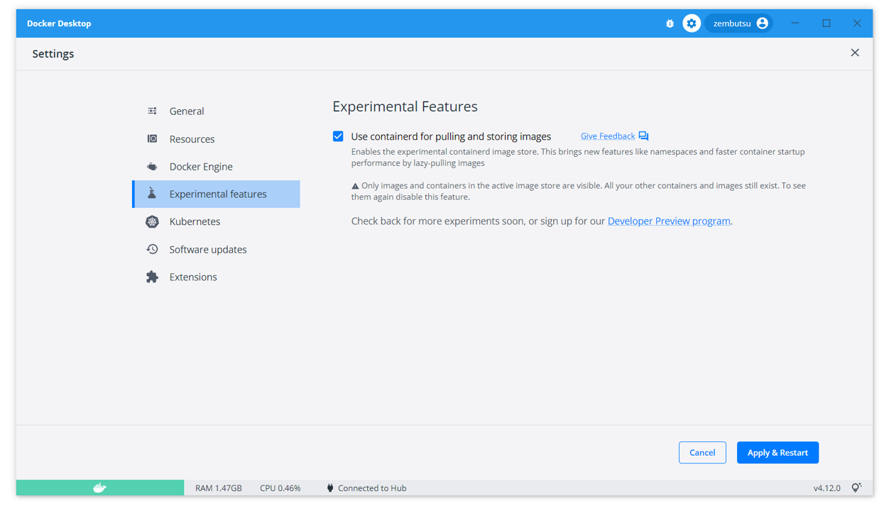
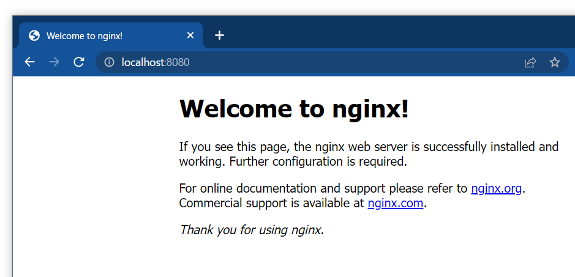
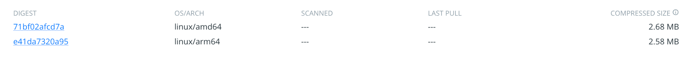

.. -*- coding: utf-8 -*-
.. URL: https://docs.docker.com/desktop/containerd/
   doc version: 20.10
      https://github.com/docker/docker.github.io/blob/master/desktop/containerd/index.md
.. check date: 2022/09/19
.. Commits on Sep 1, 2022 779ac7a157cbabea92cf629c2e84a6ccb139c40f
.. -----------------------------------------------------------------------------

.. Containerd Image Store (Beta)
.. _containerd-image-store-beta:

=======================================
Containerd イメージストア (Beta)
=======================================

.. sidebar:: 目次

   .. contents::
       :depth: 3
       :local:

.. This page provides information about the ongoing integration of containerd for image and file system management in the Docker Engine.

このページは、 Docker Engine 内でのイメージとファイルシステム管理のため、現在進行中の ``containerd`` との統合についての情報を提供します。

..  Beta
    The Dev Environments feature is currently in Beta. We recommend that you do not use this in production environments.

.. note::

   **ベータ**
   
   Dev Environments 機能は現時点では `ベータ <https://docs.docker.com/release-lifecycle/#beta>`_ です。プロダクション環境での利用を推奨しません。

.. Enabling the Containerd image store feature
.. _containerd-enabling-the-containerd-image-store-feature:

Containerd イメージ保管機能の有効化
========================================

.. The Containerd Image Store beta feature is switched off by default.

Containerd Image Store ベータ機能は、デフォルトでは無効化されています。

.. To enable this feature:

この機能を有効にするには：

..  Navigate to Settings, or Preferences if you’re a Mac user.
    Select the Experimental features tab.
    Next to Use containerd for pulling and storing images, select the checkbox.

1. **Settings** に移動するか、 Mac ユーザは **Preferences** に移動します。
2. **Experimental** タブを選びます。
3. **Use containerd for pulling and storing images** の横にあるチェックボックスを選びます。

.. To disable this feature, clear the Use containerd for pulling and storing images checkbox.

この機能を無効化するには、 **Use containerd for pulling and storing images** の横にあるチェックボックスをクリアします。

.. Simple usage examples
.. _containerd-simple-usage-examples:

シンプルな使用例
====================

.. Show server and storage driver version
.. _containerd-show-server-and-storage-driver-version:

サーバとストレージドライバのバージョンを表示
--------------------------------------------------

.. code-block:: bash

   $ docker info
   Client:
    Context:    default
    Debug Mode: false
    Plugins:
     buildx: Docker Buildx (Docker Inc., v0.9.1)
     compose: Docker Compose (Docker Inc., v2.10.2)
     extension: Manages Docker extensions (Docker Inc., v0.2.9)
     sbom: View the packaged-based Software Bill Of Materials (SBOM) for an image (Anchore Inc., 0.6.0)
     scan: Docker Scan (Docker Inc., v0.19.0)
   
   Server:
    Containers: 0
     Running: 0
     Paused: 0
     Stopped: 0
    Images: 0
    Server Version: 22.06.0-beta.0-372-gd3bb8227ce.m
    Storage Driver: stargz
     driver-type: io.containerd.snapshotter.v1
    Logging Driver: json-file
    Cgroup Driver: cgroupfs
    Cgroup Version: 2
    Plugins:
     Volume: local
     Network: bridge host ipvlan macvlan null overlay
     Log: awslogs fluentd gcplogs gelf journald json-file local logentries splunk syslog
    Swarm: inactive
    Runtimes: runc io.containerd.runc.v2
    Default Runtime: runc
    Init Binary: docker-init
    containerd version: 9cd3357b7fd7218e4aec3eae239db1f68a5a6ec6
    runc version: v1.1.4-0-g5fd4c4d
    init version: de40ad0
    Security Options:
     seccomp
      Profile: builtin
     cgroupns
    Kernel Version: 5.10.124-linuxkit
    Operating System: Docker Desktop
    OSType: linux
    Architecture: aarch64
    CPUs: 5
    Total Memory: 7.653GiB
    Name: docker-desktop
    ID: f4d28427-96df-404c-b47b-647fe5138e2a
    Docker Root Dir: /var/lib/docker
    Debug Mode: false
    HTTP Proxy: http.docker.internal:3128
    HTTPS Proxy: http.docker.internal:3128
    No Proxy: hubproxy.docker.internal
    Registry: https://index.docker.io/v1/
    Labels:
    Experimental: false
    Insecure Registries:
     hubproxy.docker.internal:5000
     127.0.0.0/8
    Live Restore Enabled: false

.. Run a simple container
.. _containerd-run-a-simple-container:

シンプルなコンテナを実行
------------------------------

.. code-block:: bash

   $ docker run --rm hello-world
   
   Unable to find image 'hello-world:latest' locally
   7d246653d051: Download complete
   432f982638b3: Download complete
   46331d942d63: Download complete
   7050e35b49f5: Downloading [>                                                  ]       0B/3.208kB
   
   Hello from Docker!
   This message shows that your installation appears to be working correctly.
   ...

.. Run the container
.. _containerd-run-the-container:

コンテナの実行
====================

.. Run the container specifying port settings:

ポート指定の設定をしてコンテナを起動：

.. code-block:: bash

   $ docker run -p 8080:80 -d nginx
   
   Unable to find image 'nginx:latest' locally
   b95a99feebf7: Download complete
   91d5b6827ff7: Download complete
   fc5ec3f147e4: Download complete
   5b1423465504: Download complete
   1cdde8b981f2: Download complete
   6c0b05f215c0: Download complete
   004f1937a10a: Download complete
   fd61d71c75fe: Download complete
   717bf61a04cf: Download complete
   8b6a7e0df8edbe91dfa77716a5e84ca28348f44f545a0d34c70a8987c56e63e0

.. Confirm the NGINX container is running:
.. _containerd-confirm-the-nginx-container-is-running:

NGINX コンテナの実行状況を確認します：

.. code-block:: bash

   $ docker ps
   CONTAINER ID   IMAGE     COMMAND                  CREATED         STATUS         PORTS                  NAMES
   93b4d60dfd08   nginx     "/docker-entrypoint.…"   3 seconds ago   Up 3 seconds   0.0.0.0:8080->80/tcp   stoic_mccarthy

.. You can also check from the browser that NGINX is running:

ブラウザからも NGINX の実行状況を確認できます。

.. Building multi-platform images
.. _containerd-building-multi-platform-images:

マルチプラットフォーム対応イメージの構築
========================================

.. Sample Dockerfile:

Dockerfile のサンプル：

.. code-block:: bash

   FROM alpine
   
   ENTRYPOINT ["echo", "hello friends"]

.. Build a multi-platform image:

マルチプラットフォーム対応イメージの構築：

.. code-block:: bash

   $ docker buildx build --platform linux/amd64,linux/arm64 -t <username>/hello-friends .
   [+] Building 0.7s (7/7)
   FINISHED
   
    => [internal] load .dockerignore                                                                                                                           0.0s
    => => transferring context: 2B                                                                                                                             0.0s
    => [internal] load build definition from Dockerfile                                                                                                        0.0s
    => => transferring dockerfile: 88B                                                                                                                         0.0s
    => [linux/arm64 internal] load metadata for docker.io/library/alpine:latest                                                                                0.6s
    => [linux/amd64 internal] load metadata for docker.io/library/alpine:latest                                                                                0.6s
    => [linux/amd64 1/1] FROM docker.io/library/alpine@sha256:bc41182d7ef5ffc53a40b044e725193bc10142a1243f395ee852a8d9730fc2ad                                 0.0s
    => => resolve docker.io/library/alpine@sha256:bc41182d7ef5ffc53a40b044e725193bc10142a1243f395ee852a8d9730fc2ad                                             0.0s
    => CACHED [linux/arm64 1/1] FROM docker.io/library/alpine@sha256:bc41182d7ef5ffc53a40b044e725193bc10142a1243f395ee852a8d9730fc2ad                          0.0s
    => => resolve docker.io/library/alpine@sha256:bc41182d7ef5ffc53a40b044e725193bc10142a1243f395ee852a8d9730fc2ad                                             0.0s
    => exporting to image                                                                                                                                      0.0s
    => => exporting layers                                                                                                                                     0.0s
    => => exporting manifest sha256:71bf02afcd7a791c268aa935027f1dc05238f5b5017d755d0fd6d9c71c1b79b9                                                           0.0s
    => => exporting config sha256:f1edbf6b99d22831f9312ab2b8b7642a904c614000bb8369ed673848f4f03578                                                             0.0s
    => => exporting manifest sha256:e41da7320a956163128d77ad69c8109af4799b41bd2e8e660bc6f01136b67f45                                                           0.0s
    => => exporting config sha256:4a5580ab8335432cf6cea7ff695f177d120fa2c9aa4002525025888e3cae16ee                                                             0.0s
    => => exporting manifest list sha256:339d089b539c950268de1edeef9652584e16efa51ea2c84ee586d3143b97234d                                                      0.0s
    => => naming to docker.io/<username>/hello-friends:latest                                                                                              0.0s
    => => unpacking to docker.io/<username>/hello-friends:latest

.. Run multi-platform image:

マルチプラットフォーム対応イメージの実行：

.. code-block:: bash

   $ docker run <username>/hello-friends

マルチプラットフォーム対応イメージの送信：

.. code-block:: bash

   $ docker push <username>/hello-friends
   Using default tag: latest
   f1edbf6b99d2: Pushed
   213ec9aee27d: Pushed
   71bf02afcd7a: Pushed
   e41da7320a95: Pushed
   339d089b539c: Pushed
   4a5580ab8335: Pushed
   9b18e9b68314: Pushed

.. View Tags on DockerHub to see multi-platform result:

Docker Hub でマルチプラットフォーム対応のタグを確認：

.. Containerd Image Store Release Notes
.. _containerd-image-store-release-notes:

Containerd Image Store リリースノート
========================================

(2022-09-01)  

.. The Containerd Image Store is shipped as a [Beta](../../release-lifecycle.md/#beta) feature on Docker Desktop 4.12.0.
Containerd Image Store は Docker Desktop 4.12.0 では `ベータ <https://docs.docker.com/release-lifecycle/#beta>`_ 機能として提供されています。

.. _containerd-release-note-new:

新規
----------

.. Initial implementation of the Docker commands: run, commit, build, push, load, search and save.

Docker コマンドの初期実装は、 ``run`` 、 ``commit`` 、 ``build`` 、 ``push`` 、 ``load`` 、 ``search`` 、 ``save`` です。

.. _containerd-release-note-known-issues:

既知の問題
----------

.. The Containerd Image Store feature requires Buildx version 0.9.0 or newer.
    On Docker Desktop for Linux (DD4L), validate if your locally installed version meets this requirement. 

* Containerd Image Store 機能は Buildx バージョン 0.9.0 以上が必要です。

  * Docker Desktop for Linux (DD4L) では、ローカルにインストール済みのバージョンがこの要件を満たすかどうか確認してください。
  
     .. note::
     
        古いバージョンをインストールしている場合、 Docker デーモンはエラー **Multiple platforms feature is currently not supported for docker driver. Please switch to a different driver** を表示します。
        Buildx の新しいバージョンをインストールするには、 `Docker Buildx 手動ダウンロード <https://docs.docker.com/build/buildx/install/#manual-download>`_ にある手順をご覧ください。

.. The Containerd Image Store feature and Kubernetes cluster support in Docker Desktop 4.12.0 are incompatible at the moment. Disable the Containerd Image Store feature if you are using the Kubernetes from Docker Desktop.

* Containerd Image Store 機能と Kubernetes クラスタのサポートは、 Docker Desktop 4.12.0 の段階では互換性がありません。Docker Desktop で Kubernetes を使う場合は、 Containerd Image Store 機能を無効化してください。

.. Feedback
.. _containerd-feedback:

フィードバック
====================

.. Thanks for trying the new features available with containerd.

``containerd`` と利用可能な新機能をお試しいただき、ありがとうございます。

.. We’d love to hear from you! Please feel free to provide us feedback or report any bugs you may find through the issues tracker on the feedback form.

どんな話でも聞きたいです！ 私たちに自由にフィードバックいただくか、問題が見つかり報告する場合は、 `フィードバックフォーム <https://dockr.ly/3PODIhD>`_ の issue トラッカーをご覧ください。

.. seealso::

   Containerd Image Store (Beta)
      https://docs.docker.com/desktop/containerd/

