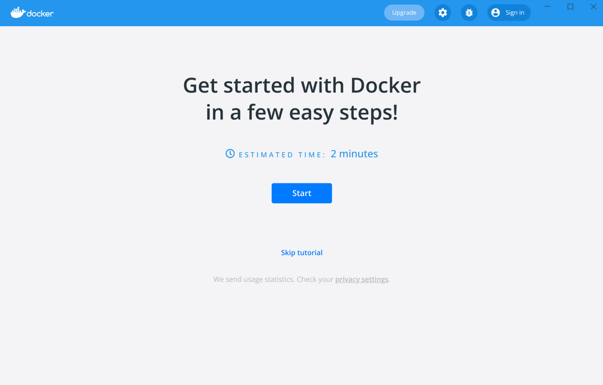

.. -*- coding: utf-8 -*-
.. URL: https://docs.docker.com/desktop/get-started/
   doc version: 20.10
      https://github.com/docker/docker.github.io/blob/master/desktop/get-started.md
.. check date: 2022/09/12
.. Commits on Sep 7, 2022 cbbb9f1fac9289c0d2851584010559f8f03846f0
.. -----------------------------------------------------------------------------

.. |whale| image:: ./images/whale-x.png
      :width: 50%

.. Sign in and get started
.. _sign-in-and-get-started:

=======================================
サインインと始め方
=======================================

.. sidebar:: 目次

   .. contents::
       :depth: 3
       :local:

.. Quick Start Guide
.. _desktop-quick-start-guide:

クイックスタートガイド
==============================

.. Once Docker Desktop is installed, the Quick Start Guide launches. It includes a simple exercise to build an example Docker image, run it as a container, push and save the image to Docker Hub.

Docker Desktop をインストールしたら、クイックスタートガイドが起動します。これには簡単な練習が入っており、 Docker イメージ例の構築、コンテナとしてイメージの実行、そしてイメージを保存して Docker Hub に送信します。

.. To run the Quick Start Guide on demand, select whale menu and then choose Quick Start Guide.

必要な時にクイックスタートガイドを実行するには、 |whale| をクリックし、 **Quick Start Guide** を選びます。

.. For a more detailed guide, see Get started.

ガイドの詳細については、 :doc:`導入ガイド </get-started/index>` をご覧ください。

.. Sign in to Docker Desktop
.. _sign-in-to-docker-desktop:
Docker Desktop にサインイン
==============================

.. We recommend that you authenticate using the Sign in/Create ID option in the top-right corner of Docker Desktop.

認証のために私たちが推奨するのは、 Docker Dekstop の画面右上の角にある **Sign in/Create ID** オプションの使用です。

.. Once logged in, you can access your Docker Hub repositories directly from Docker Desktop.

ログインを済ませると、自分の Docker Hub リポジトリに Docker Desktop から直接アクセスできます。

.. Authenticated users get a higher pull rate limit compared to anonymous users. For example, if you are authenticated, you get 200 pulls per 6 hour period, compared to 100 pulls per 6 hour period per IP address for anonymous users. For more information, see Download rate limit.

匿名ユーザと比較し、認証済みのユーザは高い :ruby:`ダウンロード率制限 <pull rate limit>` を得られます。たとえば、認証済みであれば6時間あたり 200 :ruby:`ダウンロード <pull>` できるのに対し、匿名ユーザは IP アドレスごとに6時間あたり 100 :ruby:`ダウンロード <pull>` になります。詳しい情報は、 :doc:`ダウンロード率制限 </docker-hub/download-rate-limit>` をご覧ください。

.. In large enterprises where admin access is restricted, administrators can create a registry.json file and deploy it to the developers’ machines using a device management software as part of the Docker Desktop installation process. Enforcing developers to authenticate through Docker Desktop also allows administrators to set up guardrails using features such as Image Access Management which allows team members to only have access to Trusted Content on Docker Hub, and pull only from the specified categories of images. For more information, see Configure registry.json to enforce sign-in.

管理用のアクセスが制限されているような大企業では、管理者は registry.json ファイルを作成すると、 Docker Desktop のインストール過程の一部としてデバイス管理ソフトウェアを使い、開発者のマシンにそのファイルをデプロイできます。開発者に認証を強制するため、 Docker Desktop は :doc:`イメージアクセス管理（Image Access Management） </docker-hub/image-access-management>` といった機能を使うようなガードレールを管理者がセットアップできるようにします。これにより、許可されたチームのメンバのみが、 Docker Hub 上の信頼できるコンテンツ（Trusted Content）にアクセスし、指定したイメージのカテゴリからのみ :ruby:`取得 <pull>` できるようにします。詳しい情報は、 :doc:`サインインを強制するよう registry.json を設定 </docker-hub/configure-sign-in>` をご覧ください。

.. Two-factor authentication:
.. _desktop-two-factor-authentication:

:ruby:`二要素認証 <Two-factor authentication>`
--------------------------------------------------

.. Docker Desktop enables you to sign into Docker Hub using two-factor authentication. Two-factor authentication provides an extra layer of security when accessing your Docker Hub account.

Docker Desktop は Docker Hub へ二要素認証でサインインできるようにします。Docker Hub アカウントでアクセスする時、二要素認証はセキュリティの追加レイヤーを提供します。

.. You must enable two-factor authentication in Docker Hub before signing into your Docker Hub account through Docker Desktop. For instructions, see Enable two-factor authentication for Docker Hub.

Docker Desktopで Docker Hub アカウントでサインインする前に、 Docker Hub で二要素認証を有効化する必要があります。手順は :doc:`DOcker Hub で二要素認証を有効化 </docker-hub/2fa>` をご覧ください。

.. After you have enabled two-factor authentication:

二要素認証を有効化したあとは、

..    Go to the Docker Desktop menu and then select Sign in / Create Docker ID.

1. Docker Desktop メニューに移動し、 **Sign in / Create Docker ID** を選択

..    Enter your Docker ID and password and click Sign in.

2. Docker ID とパスワードを入力し、 **Sign in** をクリック

..    After you have successfully signed in, Docker Desktop prompts you to enter the authentication code. Enter the six-digit code from your phone and then click Verify.

3. サインインに成功すると、 Docker Desktop は authentication code（認証コード）の入力を求めてきます。電話に送られた６ケタのコードを入力し、 **Verify** をクリックします。

.. Credentials management for Linux users
.. _credentials-management-for-linux-users:
Linux ユーザのための証明書情報管理
----------------------------------------

.. Docker Desktop relies on pass to store credentials in gpg2-encrypted files. Before signing in to Docker Hub from the Docker Dashboard or the Docker menu, you must initialize pass. Docker Desktop displays a warning if you’ve not initialized pass.

Docker Desktop は gpg2 暗号化ファイルの証明書を保管するため、 ``pass`` に依存します。Docker ダッシュボード や Docker メニューから Docker Hub にサインインする前に、 ``pass`` の初期化が必要です。 Docker Desktop は ``pass`` が初期化されていい場合、警告を表示します。

.. You can intialize pass by using a gpg key. To generate a gpg key, run:

gpg キーを使って pass を初期化できます。 gpg キーを作成するには、次のように実行します。

.. code-block:: bash

   $ gpg --generate-key
   ...
   GnuPG needs to construct a user ID to identify your key.
   
   Real name: Molly
   Email address: molly@example.com
   You selected this USER-ID:
       "Molly <molly@example.com>"
   
   Change (N)ame, (E)mail, or (O)kay/(Q)uit? O
   ...
   pub   rsa3072 2022-03-31 [SC] [expires: 2024-03-30]
         7865BA9185AFA2C26C5B505669FC4F36530097C2
   uid                      Molly <molly@example.com>
   sub   rsa3072 2022-03-31 [E] [expires: 2024-03-30]

.. To initialize pass, run:
``pass`` を初期化するには、次のように実行します。

.. code-block:: bash

   molly@ubuntu:~$ pass init 7865BA9185AFA2C26C5B505669FC4F36530097C2
   mkdir: created directory '/home/molly/.password-store/'
   Password store initialized for 7865BA9185AFA2C26C5B505669FC4F36530097C2

.. Once pass is initialized, you can sign in on the Docker Dashboard and pull your private images. When credentials are used by the Docker CLI or Docker Desktop, a user prompt may pop up for the password you set during the gpg key generation.

``pass`` の初期化後は、 Docker ダッシュボード上からサインインできるようになり、自分のプライベートイメージをダウンロードできます。証明書を Docker CLI や Docker Desktop で作成した場合、入力プロンプトがポップアップしますので、 gpg キー生成時に設定したパスワードを設定します。

.. code-block:: bash

   $ docker pull molly/privateimage
   Using default tag: latest
   latest: Pulling from molly/privateimage
   3b9cc81c3203: Pull complete 
   Digest: sha256:3c6b73ce467f04d4897d7a7439782721fd28ec9bf62ea2ad9e81a5fb7fb3ff96
   Status: Downloaded newer image for molly/privateimage:latest
   docker.io/molly/privateimage:latest

.. seealso::

   Sign in and get started
      https://docs.docker.com/desktop/get-started/
