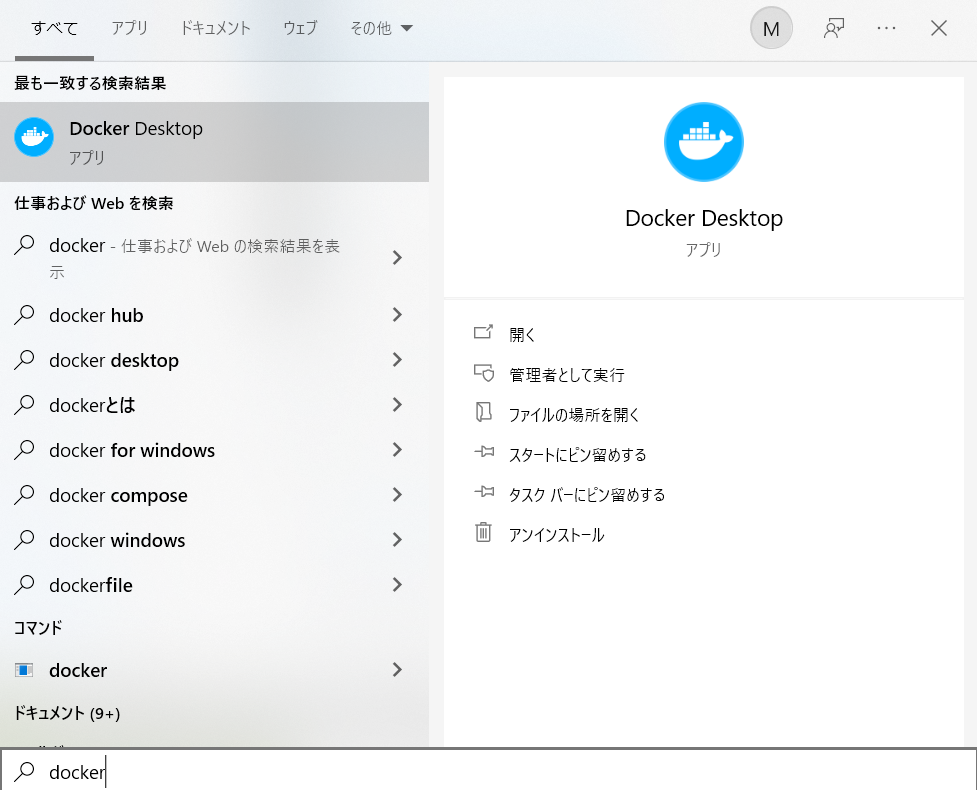

.. -*- coding: utf-8 -*-
.. URL: https://docs.docker.com/desktop/install/windows-install/
   doc version: 19.03
      https://github.com/docker/docker.github.io/blob/master/docker-for-win/install.md
   doc version: 20.10
      https://github.com/docker/docker.github.io/blob/master/desktop/install/windows-install.md
.. check date: 2022/09/10
.. Commits on Sep 7, 2022 cbbb9f1fac9289c0d2851584010559f8f03846f0
.. -----------------------------------------------------------------------------

.. Install Docker Desktop on Windows
.. _-nstall-docker-desktop-on-windows:

=======================================
Windows に Docker Desktop をインストール
=======================================

.. sidebar:: 目次

   .. contents::
       :depth: 3
       :local:

..
    Docker Desktop terms
    Commercial use of Docker Desktop in larger enterprises (more than 250 employees OR more than $10 million USD in annual revenue) requires a paid subscription.

.. note:: **Docker Desktop 利用条件**

   大企業（従業員が 251 人以上、または、年間収入が 1,000 万米ドル以上 ）における Docker Desktop の商用利用には、有料サブスクリプション契約が必要です。

.. Welcome to Docker Desktop for Windows. This page contains information about Docker Desktop for Windows system requirements, download URL, instructions to install and update Docker Desktop for Windows.

Docker Desktop for Windows へようこそ。このページには、 Docker Desktop for Windows のシステム要件、ダウンロード URL 、Docker Desktop for Windows のインストールと更新の手順の情報を含みます。

.. information

   **Docker Desktop for Windows のダウンロード**
   
   * `Docker Desktop for Windows <https://desktop.docker.com/win/main/amd64/Docker%20Desktop%20Installer.exe>`_

.. For checksums, see Release notes

チェックサムについては、 :doc:`リリースノート <release-notes>` をご覧ください。

.. System Requirements
.. _win-system-requirements:
システム要件
====================

.. Your Windows machine must meet the following requirements to successfully install Docker Desktop.

Docker Desktop を正しくインストールするには、Windows マシンが以下の要件を満たす必要があります。

.. _win-system-requirements-wsl2:
* **WSL2 バックエンド**

..
    Windows 11 64-bit: Home or Pro version 21H2 or higher, or Enterprise or Education version 21H2 or higher.
    Windows 10 64-bit: Home or Pro 21H1 (build 19043) or higher, or Enterprise or Education 20H2 (build 19042) or higher.
    Enable the WSL 2 feature on Windows. For detailed instructions, refer to the Microsoft documentation.
    The following hardware prerequisites are required to successfully run WSL 2 on Windows 10 or Windows 11:
        64-bit processor with Second Level Address Translation (SLAT)
        4GB system RAM
        BIOS-level hardware virtualization support must be enabled in the BIOS settings. For more information, see Virtualization.
    Download and install the Linux kernel update package.

  * Windows 11 64ビット： Home か Pro バージョン 21H2 以上、Enterprise か Education バージョン 21H2 以上
  * Windows 10 64ビット： Home か Pro 21H1（ビルド 19043）以上、Enterprise か Education 20H2 （ビルド 19042）以上
  * Windows 上では WSL 2 機能を有効化。詳しい手順は `マイクロソフトのドキュメント <https://docs.microsoft.com/ja-jp/windows/wsl/install>`_ を参照
  * Windows 10 と Windows 11 で WSL 2 の実行が成功するには、以下のハードウェア要件が必要：

    *  64 ビットのプロセッサで `SLAT （第 2 レベルのアドレス変換 、Second Level Address Translation <http://en.wikipedia.org/wiki/Second_Level_Address_Translation>`_ 対応プロセッサ
    * 4GB のシステムメモリ
    * BIOS レベルのハードウェア仮想化のサポートが、BIOS 設定で有効化さている。詳細は :ref:`仮想化 <win-virtualization-must-be-enabled>` を参照

  * `Linux カーネル更新プログラム パッケージ <https://docs.microsoft.com/ja-jp/windows/wsl/install-manual#step-4---download-the-linux-kernel-update-package>`_ のダウンロードとインストール

.. _win-system-requirements-hyper-v:
* **Hyper-V と Windows コンテナー**

  * Windows 11 64ビット： Home か Pro バージョン 21H2 以上、Enterprise か Education バージョン 21H2 以上
  * Windows 10 64ビット： Home か Pro 21H1（ビルド 19043）以上、Enterprise か Education 20H2 （ビルド 19042）以上
  * Windows 10 と Windows 11 Home は、では :ref:`WSL 2 バックエンド <win-system-requirements-wsl2>` のシステム要件を参照
  * Hyper-V と Windows コンテナー機能を必ず有効化
  * Windows 10 でクライアント Hyper-V の実行が成功するには、以下のハードウェア要件が必要：

    *  64 ビットのプロセッサで `SLAT （第 2 レベルのアドレス変換 、Second Level Address Translation <http://en.wikipedia.org/wiki/Second_Level_Address_Translation>`_ 対応プロセッサ
    * 4GB のシステムメモリ
    * BIOS レベルのハードウェア仮想化のサポートが、BIOS 設定で有効化さている。詳細は :ref:`仮想化 <win-virtualization-must-be-enabled>` を参照

.. Docker only supports Docker Desktop on Windows for those versions of Windows 10 that are still within Microsoft’s servicing timeline.

.. note::

   Docker による Windows 用 Docker Desktop のサポートは、Microsoft の Windows 各オペレーティングシステムに対するサポート期間に基づきます。

.. Containers and images created with Docker Desktop are shared between all user accounts on machines where it is installed. This is because all Windows accounts use the same VM to build and run containers. Note that it is not possible to share containers and images between user accounts when using the Docker Desktop WSL 2 backend.

Docker Desktop で作成したコンテナやイメージは、インストールしたマシン上の全ユーザ間で共有です。これは、すべての Windows アカウントが同じ仮想マシンでコンテナを構築・実行するからです。ただし、Docker Desktop WSL2 バックエンドを使用する場合は、ユーザ間でコンテナやイメージの共有ができないのでご注意ください。

.. Running Docker Desktop inside a VMware ESXi or Azure VM is supported for Docker Business customers. It requires enabling nested virtualization on the hypervisor first. For more information, see Running Docker Desktop in a VM or VDI environment.

Docker ビジネス利用者のために、 VMware ESXi や Azure VM 内での Docker Desktop 実行がサポートされています。そのためには、まず :ruby:`ネスト化した仮想化 <nested virtualization>` の有効化が必要です。詳しい情報は :doc:`VM または VDI 環境内で Docker Desktop を実行 </desktop/vm-vdi>` をご覧ください。

.. About Windows containers
.. _win-about-windows-containers:

Windows コンテナーについて
--------------------------------------------------

.. attention::

    訳者注：Linux と Windows では、 container （コンテナ）に対する詳細な機能・概念・実装が異なります。そのため、この翻訳内では通常「container」を「コンテナ」と翻訳していますが、「Windows」の機能としての「container」を明示・限定したい場合に「Windows コンテナー」と記載します。

.. Looking for information on using Windows containers?

Windows コンテナーの情報をお探しですか？

..    Switch between Windows and Linux containers describes how you can toggle between Linux and Windows containers in Docker Desktop and points you to the tutorial mentioned above.
    Getting Started with Windows Containers (Lab) provides a tutorial on how to set up and run Windows containers on Windows 10, Windows Server 2016 and Windows Server 2019. It shows you how to use a MusicStore application with Windows containers.
    Docker Container Platform for Windows articles and blog posts on the Docker website.

*  :ref:`switch-between-windows-and-linux-containers` では、Docker Desktop での Linux と Windows コンテナー間の切り替え方を説明し、上の方でチュートリアルに言及しています。
* `Getting Started with Windows Containers (Lab) <https://github.com/docker/labs/blob/master/windows/windows-containers/README.md>`_ では、セットアップと Windows コンテナを実行するためのチュートリアルを提供しています。対象は Windows 10、Windows Server 2016、Windows Server 2019 です。そちらでは Windows コンテナで MusicStore アプリケーションを扱う方法を説明します。
* Windows 用 Docker コンテナ・プラットフォームについては、 Docker ウェブサイト上の `記事やブログ投稿 <https://www.docker.com/microsoft/>`_ をご覧ください。

..    Note
    To run Windows containers, you need Windows 10 or Windows 11 Professional or Enterprise edition. Windows Home or Education editions will only allow you to run Linux containers.

.. note::

   Windows コンテナーを実行するには、Windows 10 か、 Windows 11 Professional または Enterprise Edition が必要です。Windows Home や Education Edition では Linux コンテナしか実行できません。

.. Install Docker Desktop on Windows
.. _install-docker-desktop-on-windows:
Windows に Docker Desktop をインストール
==================================================

.. Install interactively
.. _win-install-interactively:
対話形式でインストール
------------------------------

..    Double-click Docker Desktop Installer.exe to run the installer.

1. **Docker Desktop Installer.exe** をダブルクリックし、インストーラを起動します。

   ..    If you haven’t already downloaded the installer (Docker Desktop Installer.exe), you can get it from Docker Hub. It typically downloads to your Downloads folder, or you can run it from the recent downloads bar at the bottom of your web browser.

   もしもまだインストーラ（ :code:`Docker Desktop Installer.exe` ）をダウンロードしていなければ、 `Docker Hub <https://hub.docker.com/editions/community/docker-ce-desktop-windows/>`_ から取得できます。ダウンロードは通常「ダウンロード」フォルダ内か、ウェブブラウザ上のダウンロードバーに表示される最近ダウンロードした場所です。

.. When prompted, ensure the Use WSL 2 instead of Hyper-V option on the Configuration page is selected or not depending on your choice of backend.

2. 確認画面が出たら、 **Use WSL 2 instead of Hyper-V** （Hyper-V の代わりに WSL 2 を使う）のオプションが、設定ページで選択されているかどうかを確認します。あるいは、必要に応じてバックエンドを選択します。

   .. If your system only supports one of the two options, you will not be able to select which backend to use.
  システムが２つのオプションのうち片方しかサポートしていなければ、私用するバックエンドを選択できません。

..    Follow the instructions on the installation wizard to authorize the installer and proceed with the install.

3. インストール ウィザードの指示に従い、利用規約（ライセンス）を承諾し、インストーラに権限を与えてインストールを進めます。

..    When the installation is successful, click Close to complete the installation process.

4. インストールに成功したら、 **Close** （閉じる）をクリックしてインストールを終了します。

..    If your admin account is different to your user account, you must add the user to the docker-users group. Run Computer Management as an administrator and navigate to  Local Users and Groups > Groups > docker-users. Right-click to add the user to the group. Log out and log back in for the changes to take effect.

5. 管理者（admin）アカウントと使用中のアカウントが異なる場合、 **docker-users** グループにユーザを追加する必要があります。（Windows の） **コンピュータの管理** を管理者として起動し、 **ローカル ユーザーとグループ > グループ > docker-users**  を右クリックし、対象ユーザをグループに追加します。ログアウト後に戻ってくると、設定が有効になっています。

.. Install from the command line
.. _win-install-from-the-command-line:
コマンドラインからインストール
------------------------------

.. After downloading Docker Desktop Installer.exe, run the following command in a terminal to install Docker Desktop:

``Docker Desktop Installer.exe`` をダウンロード後、 Docker Desktop をインストールするには、ターミナルで以下のコマンドを実行します。

.. code-block:: bash

   "Docker Desktop Installer.exe" install

.. If you’re using PowerShell you should run it as:

PowerShell を使う場合は、次のように実行します。

.. code-block:: bash

   Start-Process '.\win\build\Docker Desktop Installer.exe' -Wait install

.. If using the Windows Command Prompt:

Windows コマンドプロンプトを使う場合は、このようにします。

.. code-block:: bash

   start /w "" "Docker Desktop Installer.exe" install

.. The install command accepts the following flags:

インストールのコマンドは、以下のフラグに対応します。

..  --quiet: suppresses information output when running the installer
    --accept-license: accepts the Docker Subscription Service Agreement now, rather than requiring it to be accepted when the application is first run
    --no-windows-containers: disables Windows containers integration
    --allowed-org=<org name>: requires the user to sign in and be part of the specified Docker Hub organization when running the application
    --backend=<backend name>: selects the backend to use for Docker Desktop, hyper-v or wsl-2 (default)

* ``--quiet`` ：インストーラの実行時、情報の表示を抑える
* ``--accept-license`` ：アプリケーションの初回実行時に `Docker Subscription Service Agreement（ Docker サブスクリプション サービス 使用許諾）`_ の承諾を求めるのではなく、直ちに承諾する
* ``-no-windows-containers`` ：Windows コンテナー統合を無効化する
* ``--allowed-org=<org name>`` ：アプリケーションの実行時に、指定した Docker Hub organization に所属するユーザとしてのサインインを必要とする
* ``--backend=<backend name>`` ：Docker Desktop が使用するバックエンドを選択。 ``hyper-v`` または ``wsl-2`` （デフォルト）

.. If your admin account is different to your user account, you must add the user to the docker-users group:

管理者アカウントとユーザアカウントが異なる場合、ユーザを **docker-users** グループに追加する必要があります。

.. code-block:: bash

   net localgroup docker-users <user> /add

.. Start Docker Desktop
.. _win-start-docker-desktop:
Docker Desktop のスタート
==================================================

.. Docker Desktop does not start automatically after installation. To start Docker Desktop:

インストール後の Docker Desktop は、自動的に起動できません。Docker Desktop を開始するには、以下の手順を進めます。 

.. The Docker menu (whale menu) displays the Docker Subscription Service Agreement window. It includes a change to the terms of use for Docker Desktop.

2. Docker メニュー（ |whale| ）は Docker :ruby:`サブスクリプション サービス使用許諾 <Subscription Service Agreement>` ウインドウを表示します。これには Docker Desktop の利用許諾変更の情報が加わっています。

   要点の概要はこちらです：

   * Docker Desktop は、 :ruby:`中小企業 <small businesses>` （従業員 250 人未満、かつ、年間売上高が 1,000 万米ドル未満）、個人利用、教育、非商用オープンソースプロジェクトは無料です。
   * それ以外の場合は、サブスクリプションの支払が必要です。
   * 行政機関もサブスクリプションの支払が必要です。
   * Docker Pro、 Team、Business サブスクリプションには、 Docker Desktop の :ruby:`商業的利用 <commercial use>` を含みます。

.. Click the checkbox to indicate that you accept the updated terms and then click Accept to continue. Docker Desktop starts after you accept the terms.

3. 更新した使用許諾を承諾して進むには、表示されているチェックボックスをクリックし、 **Accept** をクリックします。 使用許諾を承諾した後、 Docker Desktop は起動します。

   .. important::
   
      .. If you do not agree to the terms, the Docker Desktop application will close and you can no longer run Docker Desktop on your machine. You can choose to accept the terms at a later date by opening Docker Desktop.
      
      使用許諾に同意しなければ、 Docker Desktop アプリケーションは終了し、以後マシン上で Docker Dekstop を起動しないようようにします。後日、 Docker Desktop を開いた時、使用許諾を承諾するかどうか選択できます。

   .. For more information, see Docker Desktop License Agreement. We recommend that you also read the Blog and FAQs to learn how companies using Docker Desktop may be affected.
   詳しい情報は、 `Docker Subscription Service Agreement（ Docker サブスクリプション サービス 使用許諾）`_ をご覧ください。また、 `ブログ <https://www.docker.com/blog/updating-product-subscriptions/>`_ と `FAQ <https://www.docker.com/pricing/faq>`_ を読むのもお勧めします。

.. Updates
.. _win-updates:
更新（アップデート）
====================

.. When an update is available, Docker Desktop displays an icon on the Docker menu to indicate the availability of a newer version. Additionally, the Software Updates section in Settings (Preferences on Mac) also notifies you of any updates available to Docker Desktop. You can choose to download the update right away, or click the Release Notes option to learn what’s included in the updated version.

更新が利用可能になると、 Docker Desktop は Docker メニューで新しいバージョンが利用可能になったと知らせてくれます。また、 **Settings** （ Mac 版では **Preferences** ）にある **Software Update** の部分からも、Docker Desktop の更新が利用可能だと分かります。直ちに更新をダウンロードするか、あるいは、 **Release Notes** （リリースノート）オプションで更新版で何が導入されたのか分かります。

.. Starting with Docker Desktop 4.2.0, the option to turn off the automatic check for updates is available for users on all Docker subscriptions, including Docker Personal and Docker Pro. For more information, see Software Updates.

Docker Desktop 4.2.0 以降、Docker Professional と Docker Pro を含むすべての Docker サブスクリプション利用者は、自動更新の有効化と無効化を選べるオプションが導入されています。詳しい情報は、 :ref:`ソフトウェア更新 <mac-software-updates>` をご覧ください。

.. Click Download update When you are ready to download the update. This downloads the update in the background. After downloading the update, click Update and restart from the Docker menu. This installs the latest update and restarts Docker Desktop for the changes to take effect.

ダウンロードと更新の準備が整っていれば、 **Download update** （更新のダウンロード）をクリックします。このダウンロードと更新はバックグラウンドで行います。更新のダウンロードが終われば、 Docker メニューから **Update and Restart** （更新と再起動）をクリックします。これで最新の更新版がインストールされ、Docker の再起動で変更が有効になります。

.. When Docker Desktop starts, it displays the Docker Subscription Service Agreement window. Read the information presented on the screen to understand how the changes impact you. Click the checkbox to indicate that you accept the updated terms and then click Accept to continue.

Docker Desktop を起動したら、Docker Subscription Service Agreement ウインドウが開きます。画面上に表示された情報を読み、どのような影響を受けるか確認します。更新された使用許諾を承諾する場合は、チェックボックスにクリックし、それから続けるには **Accept** をクリックします。

.. important::

   使用許諾に同意しなければ、 Docker Desktop アプリケーションは終了し、以後マシン上で Docker Dekstop を起動しないようようにします。後日、 Docker Desktop を開いた時、使用許諾を承諾するかどうか選択できます。

.. Docker Desktop starts after you accept the terms.

使用許諾を承諾した後、 Docker Desktop が起動します。

.. Uninstall Docker Desktop
.. _win-uninstall-docker-desktop:
Docker Desktop のアンインストール
==================================================

.. To uninstall Docker Desktop from your Windows machine:

Windows マシンから Docker Desktop をアンインストールするには、

..    From the Windows Start menu, select Settings > Apps > Apps & features.
    Select Docker Desktop from the Apps & features list and then select Uninstall.
    Click Uninstall to confirm your selection.

1. Windows の **スタート** メニューから、 **設定** > **アプリ** > **アプリと機能** を選びます。
2. **アプリと機能** の一覧から **Docker Desktop**  を選択し、 **アンインストール** をクリックします。
3. 選択したのを確認の後、 **アンインストール** をクリックします。

.. Uninstalling Docker Desktop destroys Docker containers, images, volumes, and other Docker related data local to the machine, and removes the files generated by the application. Refer to the back up and restore data section to learn how to preserve important data before uninstalling.

.. important::

   Docker Desktop のアンインストールは、ローカルのマシンにある Docker コンテナ、イメージ、ボリューム、 Docker 関連のデータ破棄し、アプリケーションによって作成された全てのファイルも破棄します。アンインストール前に重要なデータを保持する方法については、 :doc:`バックアップと修復 </desktop/backup-and-restore>` を参照ください。

.. Where to go next
.. _win-install-where-to-go-next:

次はどこへ行きますか
==================================================

..    Docker Desktop for Apple silicon for detailed information about Docker Desktop for Apple silicon.
    Troubleshooting describes common problems, workarounds, how to run and submit diagnostics, and submit issues.
    FAQs provide answers to frequently asked questions.
    Release notes lists component updates, new features, and improvements associated with Docker Desktop releases.
    Get started with Docker provides a general Docker tutorial.
    Back up and restore data provides instructions on backing up and restoring data related to Docker.

* :doc:`Docker Desktop for Apple silicon </desktop/mac/apple-silicon>` は、Apple silicon 用 Docker Desktop に関する詳細情報です。
* :doc:`トラブルシューティング </desktop/troubleshoot/overview>` は一般的な問題、回避方法、統計情報の送信方法、問題報告の仕方があります。
* :doc:`FAQs </desktop/faqs/general>` は、よく見受けられる質問と回答があります。
* :doc:`リリースノート </desktop/release-notes>` は Docker Desktop  リリースに関連する更新コンポーネント、新機能、改良の一覧があります。
* :doc:`Docker の始め方 </get-started/index>` は一般的な Docker チュートリアルです。
* :doc:`バックアップと修復 </desktop/backup-and-restore>` は Docker 関連データのバックアップと修復手順です。

.. seealso::

   Install Docker Desktop on Windows
      https://docs.docker.com/desktop/install/windows-install/
