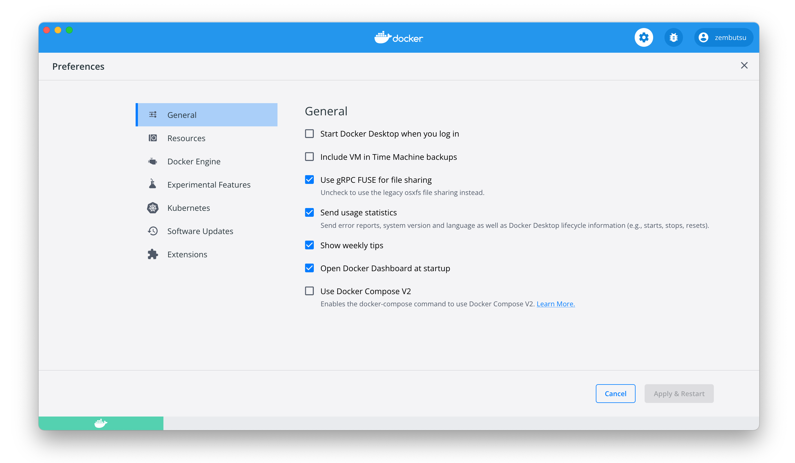
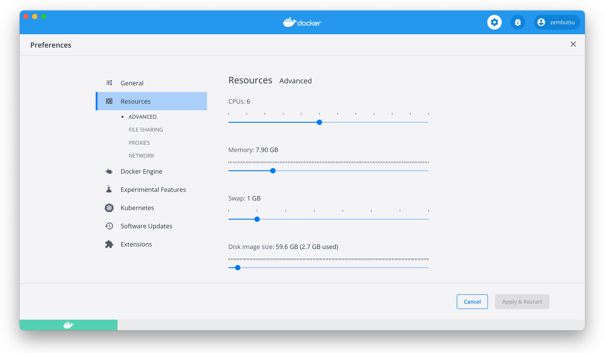

.. -*- coding: utf-8 -*-
.. URL: https://docs.docker.com/desktop/mac/
   doc version: 19.03
      https://github.com/docker/docker.github.io/blob/master/docker-for-mac/index.md
   doc version: 20.10
      https://github.com/docker/docker.github.io/blob/master/desktop/mac/index.md
.. check date: 2022/05/08
.. Commits on May 3, 2022 4848a0d14739d6a115a397131f116bfe8d00b072
.. -----------------------------------------------------------------------------

.. |whale| image:: ./images/whale-x.png
      :width: 50%

.. Docker Desktop for Mac user manual
.. _docker-desktop-for-mac-user-manual:

========================================
Docker Desktop for Mac 利用者マニュアル
========================================

.. sidebar:: 目次

   .. contents:: 
       :depth: 3
       :local:

.. Welcome to Docker Desktop! The Docker Desktop for Mac user manual provides information on how to configure and manage your Docker Desktop settings.

Docker Desktop へようこそ！ Docker Desktop for Mac 利用者マニュアルは、Docker Desktop 設定の調整と管理方法についての情報を提供します。

.. For information about Docker Desktop download, system requirements, and installation instructions, see Install Docker Desktop.

Docker Desktop のダウンロード、システム要件、インストール手順については、  :doc:`Docker Desktop のインストール <install>` を御覧ください。

.. Preferences
.. _docker-desktop-for-mac-preferences:

Preferences （設定）
==============================

.. The Docker Preferences menu allows you to configure your Docker settings such as installation, updates, version channels, Docker Hub login, and more.

Docker **Preferences** （設定）メニューは Docker の設定を調整できます。たとえば、インストール、更新、バージョンのチャンネル、 Docker Hub ログイン等です。

.. Choose the Docker menu whale menu > Preferences from the menu bar and configure the runtime options described below.

メニューバーの Docker メニュー（ |whale| ） > **Preference** （設定）を選択すると、以下で説明している実行時のオプションを調整できます。

.. General
.. _mac-general:

General（一般的な設定）
------------------------------

.. On the General tab, you can configure when to start Docker and specify other settings:

設定画面の **General** タブでは、Docker の起動や他の設定を調整できます。

..    Start Docker Desktop when you log in: Automatically starts Docker Desktop when you open your session.

* **Start Docker when you log in** ：セッションの開始時、自動的に Docker Desktop を起動します。

..    Include VM in Time Machine backups: Select this option to back up the Docker Desktop virtual machine. This option is disabled by default.

* **Include VM in Time Machine backups** （タイムマシン バックアップに仮想マシンを含める）：このオプションを選択すると、Docker Desktop 仮想マシンをバックアップします。このオプションは、デフォルトでは無効です。

.. Use gRPC FUSE for file sharing: Clear this check box to use the legacy osxfs file sharing instead.

* **Use gRPC FUSE for file sharing** （ファイル共有に gRPC FUSE を使用）：このチェックボックスをクリアすると、代わりに古い osxfs ファイル共有を使います。

..    Send usage statistics: Docker Desktop sends diagnostics, crash reports, and usage data. This information helps Docker improve and troubleshoot the application. Clear the check box to opt out.

* **Send usage statics** （利用統計情報の送信）： デフォルトでは、Docker Desktop は診断情報・クラッシュ報告・利用データを送信します。この情報は、 Docker の改善やアプリケーションの問題解決に役立ちます。止めるにはチェックボックスを空にします。Docker は定期的に更なる情報を訊ねるかもしれません。

.. Show weekly tips: Displays useful advice and suggestions about using Docker.

* **Show Weekly tips** ：Docker の使い方に役立つアドバイスや提案を表示します。

.. Open Docker Desktop dashboard at startup: Automatically opens the dashboard when starting Docker Desktop.

* **Open Docker Desktop dashboard at startup** ：Docker Desktop の起動時に、ダッシュボードを自動的に開きます。

.. Use Docker Compose V2: Select this option to enable the docker-compose command to use Docker Compose V2. For more information, see Docker Compose V2.

* **Use Docker Compose V2** ：このオプションを選択すると、 ``docker-compose`` コマンドが Docker Compose V2 を使えるようにします。詳しい情報は :doc:`Docker Compose V2 <compose-v2-and-the-new-docker-compose-command>` をご覧ください。

.. Resources:
.. _mac-resources:
Resources（リソース）
------------------------------

.. The Resources tab allows you to configure CPU, memory, disk, proxies, network, and other resources.

**Resources** （リソース）タブでは、CPU 、メモリ、ディスク、プロキシ、ネットワーク、その他のリソースを設定できます。

.. Advanced
.. _mac-resources-advanced:
ADVANCED（高度な設定）
^^^^^^^^^^^^^^^^^^^^^^^^^^^^^^

.. On the Advanced tab, you can limit resources available to Docker.

**Advanced** タブでは、 Docker が利用できるリソースを制限します。

.. Advanced settings are:

Advanced 設定とは、

.. CPUs: By default, Docker Desktop is set to use half the number of processors available on the host machine. To increase processing power, set this to a higher number; to decrease, lower the number.

* **CPUs** （CPU）：デフォルトでは、 ホストマシン上で利用可能なプロセッサ数の半分を、Docker Desktop が使います。処理能力を向上するには、この値を高くします。減らすには、数値を低くします。

.. Memory: By default, Docker Desktop is set to use 2 GB runtime memory, allocated from the total available memory on your Mac. To increase the RAM, set this to a higher number. To decrease it, lower the number.

* **Memory** （メモリ）：デフォルトでは、 マシン上で利用可能な全メモリから `2` GB の実行メモリを使用する設定です。RAM を増やすには、この値を高くします。減らすには、値を低くします。

.. Swap: Configure swap file size as needed. The default is 1 GB.

* **Swap** （スワップ）: 必要になるスワップファイル容量を設定します。デフォルトは 1 GB です。

.. Disk image size: Specify the size of the disk image.

* **Disk image size** （ディスクイメージ容量）：ディスクイメージの容量を指定します。

.. Disk image location: Specify the location of the Linux volume where containers and images are stored.

* **Disk image location** （ディスクイメージの場所）：Linux ボリュームの場所を指定します。ここにコンテナとイメージが置かれます。

.. You can also move the disk image to a different location. If you attempt to move a disk image to a location that already has one, you get a prompt asking if you want to use the existing image or replace it.

また、ディスクイメージは別の場所に移動できます。ディスクイメージの指定先に既にイメージがある場合は、既存のイメージを使うか置き換えるか訊ねる画面を表示します。

.. FILE SHARING
.. _mac-preferences-file-sharing:

FILE SHARING（ファイル共有）
^^^^^^^^^^^^^^^^^^^^^^^^^^^^^^
.. 
.. Use File sharing to allow local directories on the Mac to be shared with Linux containers. This is especially useful for editing source code in an IDE on the host while running and testing the code in a container. By default the /Users, /Volume, /private, /tmp and /var/folders directory are shared. If your project is outside this directory then it must be added to the list. Otherwise you may get Mounts denied or cannot start service errors at runtime.

Linux コンテナと共有したいローカルのディレクトリを選択します。これはホスト上の IDE を用い、コンテナ内でコードの実行やテストをしている場合、ソースコードの編集に特に役立ちます。デフォルトでは ``/Users`` 、 ``/Volume`` 、``/private`` 、 ``/tmp`` 、``/var/folders``  ディレクトリが共有されます。プロジェクトがこのディレクトリ外であれば、必ずこのリストに追加する必要があります。そうしなければ、 ``Mounts denied`` （マウント拒否）や ``cannot start serice``  （サービスを開始できない）エラーが実行時に出るでしょう。

.. File share settings are:

ファイル共有を設定するには：

..    Add a Directory: Click + and navigate to the directory you want to add.

* **Add a Directory（ディレクトリの追加）** ： `+` をクリックし、追加したいディレクトリを選択します。

.. Remove a Directory: Click - next to the directory you want to remove

* **Remove a Directory（ディレクトリの削除）** ：削除したいディレクトリの横にある `-` をクリックします。

..    Apply & Restart makes the directory available to containers using Docker’s bind mount (-v) feature.

* **Apply & Restart** （適用と再起動）によって、対象ディレクトリが Docker の :ruby:`バインド マウント <bind mount>` （ `-v` ）機能で利用できるようになります。

..    Tips on shared folders, permissions, and volume mounts

.. note::

   **共有フォルダ上でのパーミッションとボリューム マウントの tips**

   ..     Share only the directories that you need with the container. File sharing introduces overhead as any changes to the files on the host need to be notified to the Linux VM. Sharing too many files can lead to high CPU load and slow filesystem performance.
   * コンテナ内で必要とするディレクトリのみ共有できます。ファイル共有は、あらゆる変更をホスト上の Linux VM に対して通知する必要があるため、オーバーヘッドを招きます。多くのファイル共有によって、高い CPU 負荷とファイルシステム性能の低下を引き起こす可能性があります。

   ..     Shared folders are designed to allow application code to be edited on the host while being executed in containers. For non-code items such as cache directories or databases, the performance will be much better if they are stored in the Linux VM, using a data volume (named volume) or data container.

   * 共有フォルダとは、実行しているコンテナ内から、ホスト上にあるアプリケーションのコードを編集できるように設計されています。そのため、キャッシュ用のディレクトリや、データベースのようなソースコード以外の場合には、Linux VM に保管される :doc:`データ ボリューム </storage/volumes>` （ :ruby:`名前付きボリューム <named volume>` ）や :doc:`データ コンテナ </storage/volumes>` を使うほうが、パフォーマンスが良くなります。

   ..     If you share the whole of your home directory into a container, MacOS may prompt you to give Docker access to personal areas of your home directory such as your Reminders or Downloads.

   * コンテナ内に自分のホーム ディレクトリ全体を共有しようとすると、 MacOS はリマインダやダウンロードといったホームディレクトリ上の個人データエリアへのアクセスを、 Docker に許可するかどうか確認を求めます。

   ..     By default, Mac file systems are case-insensitive while Linux is case-sensitive. On Linux, it is possible to create 2 separate files: test and Test, while on Mac these filenames would actually refer to the same underlying file. This can lead to problems where an app works correctly on a Mac (where the file contents are shared) but fails when run in Linux in production (where the file contents are distinct). To avoid this, Docker Desktop insists that all shared files are accessed as their original case. Therefore, if a file is created called test, it must be opened as test. Attempts to open Test will fail with the error No such file or directory. Similarly, once a file called test is created, attempts to create a second file called Test will fail. For more information, see Volume mounting requires file sharing for any project directories outside of /Users.)

   * Linux のファイルシステは :ruby:`大文字と小文字を区別する <case-sensitive>` のに対し、 Mac のファイルシステムはデフォルトでは :ruby:`大文字と小文字を区別しません <case-insensitive>` 。Linux 上では ``test`` と ``Test`` という２つのファイルを作成できますが、 Mac の場合は、これらファイル名を使うと、どちらも元になっている同じファイルにを参照します。これにより、Mac 上では（ファイル内容を共有していると）アプリケーションが正しく動かないよう問題を引き起こす可能性があり、 Linux の本番環境では（ファイル対象が明確に異なるため）障害になるでしょう。これを避けるため、 Docker Desktop は共有している全てのファイルを、オリジナルの大文字か小文字かにもどづいて関連づけます。そのため、 ``test`` という名前のファイルを作成すると、必ず ``test`` として開かれます。 ``Test`` を開こうとしても、 ``No such file or directory`` のエラーになります。同様に、まず ``test`` という名前でファイルを作成すると、次に ``Test`` という名前でファイルを作成しようとしても失敗します。詳しい情報は、 :ref:`/Users ディレクトリ外でファイル共有が必要なボリュームのマウント <volume-mounting-requires-file-sharing-for-any-project-directories-outside-of-users>` をご覧ください。

.. PROXIES
.. _mac-preferences-proxies:

PROXIES（プロキシ）
^^^^^^^^^^^^^^^^^^^^^^^^^^^^^^

.. Docker Desktop detects HTTP/HTTPS Proxy Settings from macOS and automatically propagates these to Docker. For example, if you set your proxy settings to http://proxy.example.com, Docker uses this proxy when pulling containers.

Docker Desktop は、HTTP/HTTPS プロキシ設定を調整し、自動的に Docker に対して情報を伝達（ :ruby:`プロパゲート <propagate>` ）します。例えば、 ``http://proxy.example.com`` に対してプロキシ設定をすると、Docker はコンテナの取得時にこのプロキシを使います。

.. If you want to configure proxies manually, turn on the Manual proxy configuration setting.

プロキシを手動で設定したい場合は、 **Manual proxy configuration** （手動プロキシ設定）を有効にします。

.. Your proxy settings, however, will not be propagated into the containers you start. If you wish to set the proxy settings for your containers, you need to define environment variables for them, just like you would do on Linux, for example:

プロキシを設定しても、コンテナを開始するまで情報は伝わりません。コンテナにプロキシ設定を指定したい場合は、環境変数を使って指定します。Linux であれば、次のようにします。

.. code-block:: bash

   $ docker run -e HTTP_PROXY=http://proxy.example.com:3128 alpine env
   
   PATH=/usr/local/sbin:/usr/local/bin:/usr/sbin:/usr/bin:/sbin:/bin
   HOSTNAME=b7edf988b2b5
   TERM=xterm
   HOME=/root
   HTTP_PROXY=http://proxy.example.com:3128

.. For more information on setting environment variables for running containers, see Set environment variables.

実行中のコンテナに対し、環境変数を設定する詳しい情報は、 :ref:`環境変数の設定 <docker_run-set-environment-variable>` をご覧ください。

.. Network
.. _mac-preferences-network:

NETWORK （ネットワーク）
^^^^^^^^^^^^^^^^^^^^^^^^^^^^^^
.. You can configure Docker Desktop networking to work on a virtual private network (VPN). Specify a network address translation (NAT) prefix and subnet mask to enable Internet connectivity.

Docker Desktop のネットワーク機能を、仮想プライベート ネットワーク（VPN）でも機能するように設定できます。インターネットとの疎通を有効にするには、ネットワーク アドレス変換（NAT）プリフィックスとサブネットマスクを設定します。

.. Docker Engine
.. _mac-docker-engine:
Docker :ruby:`Engine <エンジン>`
----------------------------------------

.. The Docker Engine page allows you to configure the Docker daemon to determine how your containers run.

Docker Engine のページでは、Docker デーモンの設定や、どのようにしてコンテナを実行するかを決められます。

.. Type a JSON configuration file in the box to configure the daemon settings. For a full list of options, see the Docker Engine dockerd commandline reference.

デーモンの設定をするには、テキストボックス内に JSON 形式の設定ファイルとして入力します。オプションの一覧については、 Docker Engine の :doc:`dockerd コマンドライン・リファレンス </engine/reference/commandline/dockerd>` を御覧ください。

.. Click Apply & Restart to save your settings and restart Docker Desktop.

**Apply & Restart** （適用と再起動）をクリックし、設定を保存して Docker Desktop を再起動します。

.. Experimental Features
.. _mac-experimental-features:
Experimental Features（実験的機能）
----------------------------------------

.. On the Experimental Features page, you can specify whether or not to enable experimental features.

**Experimental Features** （実験的機能）のページでは、experimental features（実験的機能）を有効にするかどうかを指定できます。

.. Experimental features provide early access to future product functionality. These features are intended for testing and feedback only as they may change between releases without warning or can be removed entirely from a future release. Experimental features must not be used in production environments. Docker does not offer support for experimental features.

実験的機能は、今後提供する機能を先行利用できます。各機能は、テストやフィードバックを意図した、参考程度のものです。そのため、リリース時までに警告が出たり、今後のリリースでは削除されたりする場合があります。本番向けの環境では、実験的機能を決して使わないでください。Docker は実験的機能に対するサポートを提供していません。

.. Enable the new Apple Virtualization framework
.. _enable-the-new-apple-virtualization-framework:
新しい Apple Virtualization framework を有効化
--------------------------------------------------

.. Select Use the new Virtualization framework to allow Docker Desktop to use the new virtualization.framework instead of the ‘hypervisor.framework’. Ensure to reset your Kubernetes cluster when you enable the new Virtualization framework for the first time.

**Use the new Virtualization framework** （新しい Apple Virtualization framework を有効化）を選ぶと、 Docker Desktop は ``hypervisor.framework`` の代わりに、新しい ``virtualization.framework`` を使います。新しい仮想化フレームワークを有効化すると、初回は Kubernetes クラスタが確実にリセットされます。

.. Enable VirtioFS
.. _enable-virtiofs:
VirtioFS の有効化
--------------------

.. Docker Desktop for Mac lets developers use a new experimental file-sharing implementation called virtiofS; the current default is gRPC-FUSE. virtiofs has been found to significantly improve file sharing performance on macOS. For more details, see our blog post Speed boost achievement unlocked on Docker Desktop 4.6 for Mac.

Docker Desktop for Mac は、 `virtiofs <https://virtio-fs.gitlab.io/>`_ と呼ばれる新しい実験的ファイル共有実装を、開発者が使えるようにしています。つまり、現時点でのデフォルトは gRPC-FUSE です。virtiofs は macOS 上でファイル共有パフォーマンスを著しく改善するのが分かっています。詳細はブログ投稿 `Speed boost achievement unlocked on Docker Desktop 4.6 for Mac. <https://www.docker.com/blog/speed-boost-achievement-unlocked-on-docker-desktop-4-6-for-mac/>` をご覧ください。

.. To enable virtioFS:

virtioFS を有効化するには：

..    Verify that you are on the following macOS version:
        macOS 12.2 or later (for Apple Silicon)
        macOS 12.3 or later (for Intel)

1. macOS が以下のバージョンかどうかを確認

   * macOS 12.2 以上（Apple Silicon の場合）
   * macOS 12.3 以上（Intel の場合）

..    Select Enable VirtioFS accelerated directory sharing to enable virtioFS.

2. virtioFS を有効化するには **Enable VirtioFS accelerated directory sharing** を選ぶ

..    Click Apply & Restart.

3. **Apply & Restart** をクリック

.. Kubernetes
.. _mac-kubernetes:

Kubernetes
--------------------

.. Docker Desktop includes a standalone Kubernetes server that runs on your Mac, so that you can test deploying your Docker workloads on Kubernetes. To enable Kubernetes support and install a standalone instance of Kubernetes running as a Docker container, select Enable Kubernetes.

Docker Desktop には :ruby:`単独 <standalone>` の Kubernetes サーバが入っています。Kubernetes は Mac ホスト上で実行できますので、Kubernetes 上に Docker ワークロードを試験的にデプロイできます。Kubernetes サポートの有効化と、Docker コンテナとして Kubernetes のスタンドアロン インスタンスをインストールかつ実行するには、 **Enable Kubernetes** を選びます。

..    Select Show system containers (advanced) to view internal containers when using Docker commands.

* Docker コマンドを使って内部コンテナを表示するには、 **Show system containers (advanced)** を選択

..    Select Reset Kubernetes cluster to delete all stacks and Kubernetes resources. For more information, see Kubernetes.

* すべてのスタックと Kubernetes を削除するには、 **Reset Kubernetes cluster** を選択。詳しい情報は :doc:`Kubernetes </desktop/kubernetes>` を参照

..    Click Apply & Restart for your changes to take effect.

* 変更を反映するには、 **Apply & Restart** をクリック

.. Reset
.. mac-preference-reset:

リセット
--------------------

..    Reset and Restart options
..    On Docker Desktop Mac, the Restart Docker Desktop, Reset to factory defaults, and other reset options are available from the Troubleshoot menu.

.. note::

   **リセットと再起動オプション** 
   
   Docker Desktop Mac では、 **Troubleshoot** （トラブルシュート）のメニュー上から、 **Restart Docker Desktop** （Dockerデスクトップの再起動）と **Reset to factory defaults** （初期値にリセットする）オプションを利用できます。

.. For information about the reset options, see Logs and Troubleshooting.

詳しい情報は :doc:`troubleshoot` をご覧ください。

.. Software Updates
.. _mac-software-updates:
Software Updates （ソフトウェア更新）
========================================

.. The Software Updates section notifies you of any updates available to Docker Desktop. When there’s a new update, you can choose to download the update right away, or click the Release Notes option to learn what’s included in the updated version.

**Software Updates** （ソフトウェア更新）セクションは、Docker Desktop で利用可能な更新バージョンを通知します。新しい更新があれば選択肢があります。すぐにダウンロードと更新をするか、あるいは、 **Release Notes** （リリースノート）のオプションで更新版で何が入ったのかを確認します。

..    Disable automatic check for updates
    Starting with Docker Desktop 4.2.0, the option to turn off the automatic check for updates is available for users on all Docker subscriptions, including Docker Personal and Docker Pro. Update to Docker Desktop 4.2.0 to start using this feature.

.. important::

   **自動更新の確認が無効化**
   
   Docker Personal と Docker Pro を含む、全ての Docker サブスクリプションの利用者を対象に、 Docker Desktop 4.2.0 から、更新の自動確認オプションをオフにできるようになりました。この機能を使うには、 :doc:`Docker Desktop 4.2 </desktop/mac/release-notes>` に更新してください。

.. Turn off the check for updates by clearing the Automatically check for updates check box. This disables notifications in the Docker menu and also the notification badge that appears on the Docker Dashboard. To check for updates manually, select the Check for updates option in the Docker menu.

チェックボックス **Automatically check for updates** をクリアすると、自動更新の確認をしません。無効化の通知は、 Docker メニューと、 Docker ダッシュボード上の通知バッジからも分かります。手動で更新を確認するには、 Docker メニューから **Check for updates** オプションを選びます。

.. To allow Docker Desktop to automatically download new updates in the background, select Always download updates. This downloads newer versions of Docker Desktop when an update becomes available. After downloading the update, click Apply and Restart to install the update. You can do this either through the Docker menu or in the Updates section in the Docker Dashboard.

Docker Desktop の新しい更新の自動ダウンロードを、バックグラウンドで行いたい場合は、 **Always download updates** を選びます。これは、Docker の更新版が利用可能になると、新しいバージョンをダウンロードします。この設定をするには、 Docker メニューだけでなく、 Docker ダッシュボードの **Updates** セクションからも行えます。

.. Dashboard
.. _mac-dashboard:

Dashboard （ダッシュボード）
==============================

.. The Docker Dashboard enables you to interact with containers and applications and manage the lifecycle of your applications directly from your machine. The Dashboard UI shows all running, stopped, and started containers with their state. It provides an intuitive interface to perform common actions to inspect and manage containers and existing Docker Compose applications. For more information, see Docker Dashboard.

Docker ダッシュボードを通して、マシン上にあるコンテナとアプリケーションを用いる、アプリケーションのライフサイクルと管理をやりとりできます。ダッシュボードの UI を通して見えるのは、全ての実行中、停止中、開始中のコンテナと状態です。直感的なインターフェースを通して、コンテナや Docker Compose アプリケーションに対する調査と管理といった共通動作が行えます。より詳しい情報は、 :doc:`Docker ダッシュボード </desktop/dashboard/>` をご覧ください。

.. Add TLS certificates
.. _mac-add-tls-certificates:

TLS 証明書の追加
====================

.. You can add trusted Certificate Authorities (CAs) (used to verify registry server certificates) and client certificates (used to authenticate to registries) to your Docker daemon.

Docker デーモンが、レジストリ・サーバ証明書と **クライアント証明書** の検証用に、信頼できる **認証局(CA; Certificate Authorities)** を追加してレジストリを認証できます。

.. Add custom CA certificates (server side)
.. _mac-add-custom-ca-certificates-server-side:
カスタム CA 証明書の追加（サーバ側）
----------------------------------------

.. All trusted CAs (root or intermediate) are supported. Docker Desktop creates a certificate bundle of all user-trusted CAs based on the Mac Keychain, and appends it to Moby trusted certificates. So if an enterprise SSL certificate is trusted by the user on the host, it is trusted by Docker Desktop.

全ての信頼できうる（ルート及び中間）証明局（CA）をサポートしています。Docker Desktop は Mac キーチェーン上にある全ての信頼できうる証明局の情報に基づき、全てのユーザが信頼する CAの証明書バンドルを作成します。また、Moby の信頼できる証明書にも適用します。そのため、エンタープライズ SSL 証明書がホスト上のユーザによって信頼されている場合は、Docker Desktop からも信頼されます。

.. To manually add a custom, self-signed certificate, start by adding the certificate to the macOS keychain, which is picked up by Docker Desktop. Here is an example:

任意の、自己証明した証明書を主導で追加するには、macOS キーチェン上に証明書を追加し、Docker Desktop が扱えるようにします。以下は例です：

.. code-block:: bash

   $ sudo security add-trusted-cert -d -r trustRoot -k /Library/Keychains/System.keychain ca.crt

.. Or, if you prefer to add the certificate to your own local keychain only (rather than for all users), run this command instead:

あるいは、（全てのユーザに対してではなく）自身のローカルキーチェーンのみ追加したい場合は、代わりにこちらのコマンドを実行します。

.. code-block:: bash

   $ security add-trusted-cert -d -r trustRoot -k ~/Library/Keychains/login.keychain ca.crt

.. See also, Directory structures for certificates.

また、 :ref:`mac-directory-structures-for-certificates` もご覧ください。

..    Note: You need to restart Docker Desktop after making any changes to the keychain or to the ~/.docker/certs.d directory in order for the changes to take effect.

.. note::

   キーチェーンに対する何らかの変更をするか、 :code:`~/.docker/certs.d` ディレクトリ内の変更を有効にするには、 Docker Desktop の再起動が必要です。

.. For a complete explanation of how to do this, see the blog post Adding Self-signed Registry Certs to Docker & Docker Desktop for Mac.

以上の設定方法に関する完全な説明は `Adding Self-signed Registry Certs to Docker & Docker Desktop for Mac <http://container-solutions.com/adding-self-signed-registry-certs-docker-mac/>`_ のブログ投稿をご覧ください。

.. Add client certificates
.. _mac-add-client-certificates:
クライアント証明書の追加
------------------------------

.. You can put your client certificates in ~/.docker/certs.d/<MyRegistry>:<Port>/client.cert and ~/.docker/certs.d/<MyRegistry>:<Port>/client.key.

自分のクライアント証明書を :code:`~/.docker/certs.d/<MyRegistry>:<Port>/client.cert` と :code:`~/.docker/certs.d/<MyRegistry>:<Port>/client.key` に追加できます。

.. When the Docker Desktop application starts, it copies the ~/.docker/certs.d folder on your Mac to the /etc/docker/certs.d directory on Moby (the Docker Desktop xhyve virtual machine).

Docker Desktop ・アプリケーションの開始時に、 Mac システム上の :code:`~/.docker/certs.d` フォルダを Moby 上（Docker Desktop が稼働する :code:`xhyve` 上の仮想マシン）の `/etc/docker/certs.d` ディレクトリにコピーします。

..        You need to restart Docker Desktop after making any changes to the keychain or to the ~/.docker/certs.d directory in order for the changes to take effect.
..        The registry cannot be listed as an insecure registry (see Docker Engine. Docker Desktop ignores certificates listed under insecure registries, and does not send client certificates. Commands like docker run that attempt to pull from the registry produce error messages on the command line, as well as on the registry.

.. hint::

   * キーチェーンに対する何らかの変更をするか、 :code:`~/.docker/certs.d` ディレクトリ内の変更を有効にするには、 Docker Desktop の再起動が必要です。
   * レジストリは *insecure* （安全ではない）レジストリとして表示されません（ :ref:`mac-docker-engine` をご覧ください ）。Docker Desktop は安全ではないレジストリにある証明書を無視します。そして、クライアント証明書も送信しません。 :code:`docker run` のようなレジストリから取得するコマンドは、コマンドライン上でもレジストリでもエラーになるメッセージが出ます。

.. Directory structures for certificates
.. _mac-directory-structures-for-cerficates:
認証情報のディレクトリ構造
------------------------------

.. If you have this directory structure, you do not need to manually add the CA certificate to your Mac OS system login:

次のディレクトリ構造の場合、Mac OS システムログインのため、CA 証明書を手動で追加する必要はありません。

.. code-block:: bash

   /Users/<user>/.docker/certs.d/
   └── <MyRegistry>:<Port>
      ├── ca.crt
      ├── client.cert
      └── client.key

.. The following further illustrates and explains a configuration with custom certificates:

以下は、カスタム証明書を設定例と説明を追加したものです：

.. code-block:: bash

   /etc/docker/certs.d/        <-- Certificate directory
   └── localhost:5000          <-- Hostname:port
      ├── client.cert          <-- Client certificate
      ├── client.key           <-- Client key
      └── ca.crt               <-- Certificate authority that signed
                                   the registry certificate

.. You can also have this directory structure, as long as the CA certificate is also in your keychain.

あるいは、CA 証明書が自分のキーチェンにあれば、次のようなディレクトリ構造にもできます。

.. code-block:: bash

   /Users/<user>/.docker/certs.d/
   └── <MyRegistry>:<Port>
       ├── client.cert
       └── client.key

.. To learn more about how to install a CA root certificate for the registry and how to set the client TLS certificate for verification, see Verify repository client with certificates in the Docker Engine topics.

認証用にクライアント TLS 証明書を設定する方法を学ぶには、Docker エンジンの記事 :doc:`証明書でリポジトリ・クライアントを確認する </engine/security/certificates>`_ を御覧ください。

.. Install shell completion
.. _mac-install-shell-completion:
シェル補完のインストール
==============================

.. Docker Desktop comes with scripts to enable completion for the docker and docker-compose commands. The completion scripts may be found inside Docker.app, in the Contents/Resources/etc/ directory and can be installed both in Bash and Zsh.

Docker Desktop には、 :code:`docker` と :code:`docker-compose`  のコマンド補完を有効化するスクリプトがあります。補完スクリプトは  :code:`Docker.app` 内の :code:`Contents/Resources/etc` ディレクトリ内にあり、 Bash と Zsh の両方にインストールできます。

.. Bash
.. _mac-bash:
Bash
----------

.. Bash has built-in support for completion To activate completion for Docker commands, these files need to be copied or symlinked to your bash_completion.d/ directory. For example, if you installed bash via Homebrew:

Bash は `補完のサポートを内蔵 <https://www.debian-administration.org/article/316/An_introduction_to_bash_completion_part_1`_ しています。Docker コマンドの補完をできるようにするには、 :code:`bash_completion.d/` ディレクトリ内に各ファイルをコピーしたり symlink を作成必要があります。たとえば、 `Homebrew <http://brew.sh/`_ 経由で bash をインストールするには、以下のようにします。

.. code-block:: bash

   etc=/Applications/Docker.app/Contents/Resources/etc
   ln -s $etc/docker.bash-completion $(brew --prefix)/etc/bash_completion.d/docker
   ln -s $etc/docker-compose.bash-completion $(brew --prefix)/etc/bash_completion.d/docker-compose

.. Add the following to your ~/.bash_profile:

以下を自分の :code:`~/.bash_profile` に追加します：

.. code-block:: bash

   [ -f /usr/local/etc/bash_completion ] && . /usr/local/etc/bash_completion

.. OR

あるいは

.. code-block:: bash

   if [ -f $(brew --prefix)/etc/bash_completion ]; then
   . $(brew --prefix)/etc/bash_completion
   fi

.. Zsh
.. _mac-zsh:
Zsh
----------

.. In Zsh, the completion system takes care of things. To activate completion for Docker commands, these files need to be copied or symlinked to your Zsh site-functions/ directory. For example, if you installed Zsh via Homebrew:

Zsh では、 `補完システム <http://zsh.sourceforge.net/Doc/Release/Completion-System.html>`_ の管理が必要です。Docker コマンドに対する補完を有効化するには、自分の Zsh :code:`site-functions/` ディレクトリに各ファイルをコピーするか symlink する必要があります。以下は `Homebrew <http://brew.sh/>`_  を経由して Zsh をインストールします：

.. code-block:: bash

   etc=/Applications/Docker.app/Contents/Resources/etc
   ln -s $etc/docker.zsh-completion /usr/local/share/zsh/site-functions/_docker
   ln -s $etc/docker-compose.zsh-completion /usr/local/share/zsh/site-functions/_docker-compose

.. Fish-Shell
.. _mac-fish-shell:
Fish-Shell
----------

.. Fish-shell also supports tab completion completion system. To activate completion for Docker commands, these files need to be copied or symlinked to your Fish-shell completions/ directory.

Fish-shell もまた、タブ補完による `補完システム <https://fishshell.com/docs/current/#tab-completion>`_ をサポートしています。Docker コマンドに対する補完を有効化するには、各ファイルを自分の Fish-shell の :code:`completions` ディレクトリにコピーするか symlink する必要があります。

.. Create the completions directory:

:code:`completions`  ディレクトリを作成します：

.. code-block:: bash

   mkdir -p ~/.config/fish/completions

.. Now add fish completions from docker.

次に docker から fish completions を追加します。

.. code-block:: bash

   ln -shi /Applications/Docker.app/Contents/Resources/etc/docker.fish-completion ~/.config/fish/completions/docker.fish
   ln -shi /Applications/Docker.app/Contents/Resources/etc/docker-compose.fish-completion ~/.config/fish/completions/docker-compose.fish

.. Docker Hub
.. _mac-docker-hub:
Docker Hub
==========

.. Select Sign in /Create Docker ID from the Docker Desktop menu to access your Docker Hub account. Once logged in, you can access your Docker Hub repositories and organizations directly from the Docker Desktop menu.

Docker Desktop メニューから **Sign in / Create Docker ID** を選ぶと、 `Docker Hub <https://hub.docker.com/>`_ アカウントにアクセスできます。ログインすると、自分の Docker Hub リポジトリや organizations ディレクトリに、Docker Desktop メニューからアクセスできます。

.. For more information, refer to the following Docker Hub topics:

詳しい情報は、以下の :doc:`Docker Hub トピック </docker-hub/index>` を参照ください。

..  Organizations and Teams in Docker Hub
    Builds

* :doc:`Docker Hub の Organizations と Teams  <orgz>`
* :doc:`Builds </docker-hub/builds>`

.. Two-factor authentication
.. _mac-two-factor-authentication:
:ruby:`二要素認証 <two-factor authentication>`
--------------------------------------------------

.. Docker Desktop enables you to sign into Docker Hub using two-factor authentication. Two-factor authentication provides an extra layer of security when accessing your Docker Hub account.

Docker Desktop は Docker Hub へ二要素認証でサインインできるようにします。Docker Hub アカウントでアクセスする時、二要素認証はセキュリティの追加レイヤーを提供します。

.. You must enable two-factor authentication in Docker Hub before signing into your Docker Hub account through Docker Desktop. For instructions, see Enable two-factor authentication for Docker Hub.

Docker Desktopで Docker Hub アカウントでサインインする前に、 Docker Hub で二要素認証を有効化する必要があります。手順は :doc:`DOcker Hub で二要素認証を有効化 </docker-hub/2fa>` をご覧ください。

.. After you have enabled two-factor authentication:

二要素認証を有効化したあとは、

..    Go to the Docker Desktop menu and then select Sign in / Create Docker ID.

1. Docker Desktop メニューに移動し、 **Sign in / Create Docker ID** を選択

..    Enter your Docker ID and password and click Sign in.

2. Docker ID とパスワードを入力し、 **Sign in** をクリック

..    After you have successfully signed in, Docker Desktop prompts you to enter the authentication code. Enter the six-digit code from your phone and then click Verify.

3. サインインに成功すると、 Docker Desktop は authentication code（認証コード）の入力を求めてきます。電話に送られた６ケタのコードを入力し、 **Verify** をクリックします。

.. image:: ./images/desktop-mac-2fa.png
   :width: 60%
   :alt: Docker Desktop 二要素認証

.. After you have successfully authenticated, you can access your organizations and repositories directly from the Docker Desktop menu.

認証に成功すると、Docker Desktop メニューから、直接自分の organization と リポジトリにアクセスできます。

.. Pause/Resume
:ruby:`一時停止 <pause>` / :ruby:`再開 <resume>`
==================================================

.. Starting with the Docker Desktop 4.2 release, you can pause your Docker Desktop session when you are not actively using it and save CPU resources on your machine. When you pause Docker Desktop, the Linux VM running Docker Engine is paused, the current state of all your containers are saved in memory, and all processes are frozen. This reduces the CPU usage and helps you retain a longer battery life on your laptop. You can resume Docker Desktop when you want by clicking the Resume option.

Docker Desktop 4.2 リリースから、Docker Desktop をアクティブに使っていない時、 Docker Desktop のセッションを :ruby:`一時停止 <pause>` し、マシン上の CPU リソースを抑えます。Docker Desktop を一時停止すると、 Docker Engine を実行している Linux VM が一時停止され、メモリ上に保存されている現在のコンテナ状態すべてと、すべてのプロセスを凍結します。これにより、 CPU 使用率を減らし、ノート PC のバッテリー寿命を長く維持します。 Resume（再開）オプションをクリックすると、Docker Desktop は再開します。

.. From the Docker menu, select whale menu > Pause to pause Docker Desktop.

Docker メニュー ( |whale| ) から、 **Pause** を選択して Docker Desktop を一時停止します。

.. image:: ./images/menu/prefs.png
   :width: 60%
   :alt: Docker のメニュー項目

.. Docker Desktop now displays the paused status on the Docker menu and on the Containers / Apps, Images, Volumes, and Dev Environment screens on the Docker Dashboard. You can still access the Preferences and the Troubleshoot menu from the Dashboard when you’ve paused Docker Desktop.

これで Docker Desktop は、 Docker メニュー上で一時停止（paused）と表示され、 Docker ダッシュボード上の **Containers** 、 **Images** 、 **Volumes** 、 **Dev Environment** 画面も一時停止と表示します。Docker Desktop を一時停止している状態でも、ダッシュボードの **Preferences** と **Troubleshoot** メニューにアクセスできます。

.. Select whale menu > Resume to resume Docker Desktop.

Docker Desktop を再開するには、 |whale| > **Resume** を選択します。

..    Note
    When Docker Desktop is paused, running any commands in the Docker CLI will automatically resume Docker Desktop.

.. note::

   Docker Desktop を一時停止すると、Docker CLI で実行されたあらゆるコンテナも、 Docker Desktop によって自動的に一時停止されます。

.. Give feedback and get help
.. _mac-give-feedback-and-get-help:
フィードバックやヘルプを得るには
========================================

.. To get help from the community, review current user topics, join or start a discussion, log on to our Docker Desktop for Mac forum.

コミュニティからのヘルプを得たり、現在のユーザートピックを見たり、ディスカッションに参加・開始するには `Docker Desktop for Mac forum <https://forums.docker.com/c/docker-for-mac>`_ にログオンください。

.. To report bugs or problems, log on to Docker Desktop for Mac issues on GitHub, where you can review community reported issues, and file new ones. See Logs and Troubleshooting for more details.

バグや問題の報告をするには、 `GitHub の Mac issues <https://github.com/docker/for-mac/issues>`_  にログオンし、そこでコミュニティに報告された報告を見たり、新しい課題を追加できます。詳細は [ログとトラブルシューティング] をご覧ください。

.. For information about providing feedback on the documentation or update it yourself, see Contribute to documentation.

ドキュメントのに対するフェイードバックの提供や、自分自身で更新する方法は、 :doc:`コントリビュート </opensource/toc>` のドキュメントをご覧ください。

.. Where to go next

次は何をしますか
====================

..    Try out the walkthrough at Get Started.

* :doc:`始めましょう </get-started/index>` を一通り試しましょう。

..    Dig in deeper with Docker Labs example walkthroughs and source code.

* `Docker Labs <https://github.com/docker/labs/>`_  の例を通したりソースコードを深く掘り下げましょう。

..    For a summary of Docker command line interface (CLI) commands, see Docker CLI Reference Guide.

* Docker コマンドライン・インターフェース（CLI）コマンドのまとめについては、 :doc:`Docker CLI リファレンスガイド </engine/api>` をご覧ください。

..    Check out the blog post, What’s New in Docker 17.06 Community Edition (CE).

* `What's New in Docker 17.06 Community Edition (CE) <https://blog.docker.com/2017/07/whats-new-docker-17-06-community-edition-ce/>`_ のブログ記事をご覧ください。

.. seealso:: 

   Docker Desktop for Mac user manual
      https://docs.docker.com/desktop/mac/

