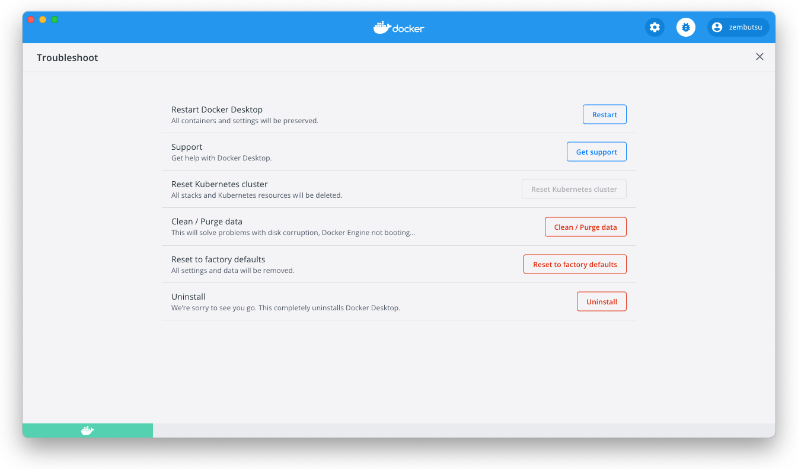

.. -*- coding: utf-8 -*-
.. URL: https://docs.docker.com/desktop/mac/troubleshoot/
   doc version: 19.03
      https://github.com/docker/docker.github.io/blob/master/docker-for-mac/troubleshoot.md
   doc version: 20.10
      https://github.com/docker/docker.github.io/blob/master/desktop/mac/troubleshoot.md
.. check date: 2022/05/08
.. Commits on Apr 20-, 2022 46b902e20a6248820e3ae94638b6c7895c20895e
.. -----------------------------------------------------------------------------

.. |whale| image:: ./images/whale-x.png
      :scale: 50%

.. Logs and troubleshooting
.. _mac-logs-and-troubleshooting:

==================================================
ログとトラブルシューティング
==================================================

.. sidebar:: 目次

   .. contents:: 
       :depth: 3
       :local:

.. Did you know that Docker Desktop offers support for developers on a paid Docker subscription (Pro, Team, or Business)? Upgrade now to benefit from Docker Support. Click here to learn more.

.. hint:

   Docker Desktop は開発者をサポートする Docker サブスクリプション（Pro、Team、Business）を提供しているのをご存じでしょうか。アップグレードによって Docker サポートのメリットを得られます。詳細は :ruby:`こちら<mac-troubleshoot-support>` をご覧ください。
   
   * `今すぐアップグレード <https://www.docker.com/pricing>`_ 

.. This page contains information on how to diagnose and troubleshoot Docker Desktop issues, request Docker Desktop support, send logs and communicate with the Docker Desktop team, use our forums and Success Center, browse and log issues on GitHub, and find workarounds for known problems.

このページに含む情報は、どのようにして原因を追及し、問題を解決し、Docker Desktop のサポート要求、ログを送信し、Docker Desktop のチームとやりとりし、フォーラムやナレッジ・ハブで使ったり、GitHub 上で問題を見たり記録したり、既知の問題に対する回避策を発見する方法です。

.. Troubleshoot
.. _docker-mac-trobuleshoot:

トラブルシュート
==================================================

.. Choose whale menu > Troubleshoot from the menu bar to see the troubleshoot options.

メニューバーにある Docker のアイコン |whale|  > **Troubleshoot** を選択し、トラブルシュートのオプションを表示します。

.. The Troubleshoot page contains the following options:

トラブルシュートのページには、以下のオプションを含みます。

..    Restart Docker Desktop: Select to restart Docker Desktop.

* **Restart Docker Desktop** （Docker Desktop の再起動）：選択すると、Docker Desktop を再起動します。

.. Support: Users with a paid Docker subscription can use this option to send a support request. Other users can use this option to diagnose any issues in Docker Desktop. For more information, see Diagnose and feedback and Support.

* **Support** ：有償 Docker サブスクリプション利用者は、このオプションを使ってサポートリクエストを送信できます。他の利用者がこのオプションを使うと、Docker Desktop 上のあらゆる問題を診断します。診断に関する詳細情報は、 :ref:`mac-diagnose-problems-send-feedback-and-create-github-issues` をご覧ください。

..    Reset Kubernetes cluster: Select this option to delete all stacks and Kubernetes resources. For more information, see Kubernetes.

* **Reset Kubernetes cluster** （Kubernetes クラスタのリセット）：このオプションを選択すると、全てのスタックと Kubernetes リソースを削除します。詳しい情報は :ref:`Kubernetes <mac-kubernetes>` をご覧ください。

.. Clean / Purge data: This option resets all Docker data without a reset to factory defaults. Selecting this option results in the loss of existing settings.

* **Clean / Purge data** （データ除去 / 削除）：設定などを初期値のデフォルトに戻さず、全ての Docker データをリセットします。このオプションを選択した結果、既存の設定は消滅します。

..    Reset to factory defaults: Choose this option to reset all options on Docker Desktop to their initial state, the same as when Docker Desktop was first installed.

* **Reset to factory defaults** （初期値のデフォルトにリセット）：このオプションを選択すると、Docker Desktop の全てのオプションを初期値にリセットし、Docker Desktop が始めてインストールされたのと同じ状態にします。

..    Uninstall: Choose this option to remove Docker Desktop from your system.

* **Uninstall** （アンインストール）：このオプションを選択すると、システム上から Docker Desktop を削除します。

..    Uninstall Docker Desktop from the command line

..    To uninstall Docker Desktop from a terminal, run: <DockerforMacPath> --uninstall. If your instance is installed in the default location, this command provides a clean uninstall:

.. note:: **コマンドラインから Docker Desktop のアンインストール**

   ターミナルから Docker Desktop をアンインストールするには、 :code:`<DockerforMacのパス> --uninstall` を実行します。実態がデフォルトの場所へインストールしている場合は、このコマンドの実行によってクリーンにアンインストールできます。
   
   .. code-block:: bash
   
      $ /Applications/Docker.app/Contents/MacOS/Docker --uninstall
       Docker is running, exiting...
       Docker uninstalled successfully. You can move the Docker application to the trash.
   
   ..    You might want to use the command-line uninstall if, for example, you find that the app is non-functional, and you cannot uninstall it from the menu.
   コマンドラインでアンインストールを試みようとする時は、先の例とは異なり、アプリを機能的に見つけられないため、メニュー上からはアンインストールできません。

.. Diagnose and feedback
.. _mac-diagnose-and-feedbak:
診断とフィードバック
=======================================================

.. In-app diagnostics
.. _mac-in-app-diagnostics:

アプリ内診断
--------------------------------------------------

.. If you encounter problems for which you do not find solutions in this documentation, on Docker Desktop issues on GitHub, or the Docker Desktop forum, we can help you troubleshoot the log data. Before reporting an issue, we recommend that you read the information provided on this page to fix some common known issues.

.. If you encounter problems for which you do not find solutions in this documentation, on Docker Desktop issues on GitHub, or the Docker Desktop forum, we can help you troubleshoot the log data.

発生した問題が、このページ内のドキュメントで解決できない場合は、 `GitHub の Docker Desktop <https://github.com/docker/for-mac/issues>`_ や `Docker Desktop for Mac forum <https://forums.docker.com/c/docker-for-mac>`_ で、ログデータのトラブルシュートに役立つ可能性があります。issue を報告する前に、いくつかの一般的に知られた問題を修正するため、このページが提供する情報を読むのをお勧めします。

.. Docker Desktop offers support for users with a paid Docker subscription. If you are experiencing any issues with Docker Desktop, follow the instructions in this section to send a support request to Docker Support.

.. note::

   Docker Desktop は有償 Docker サブスクリプションの利用者にサポートを提供しています。Docker Desktop を使っていて何らかの問題が発生したら、以下のセクションの手順に従って、Docker サポートにサポートリクエストを送信してください。

.. Before you get started, we recommend that you sign into your Docker Desktop application and your Docker Hub account.

はじめる前に、Docker Desktop アプリケーションに自分の `Docker Hub <https://hub.docker.com/>`_ アカウントでサインインしておくのを推奨します。

.. Choose whale menu > Troubleshoot.

1. メニュー |whale| > **Troubleshoot** を選択します。

.. Optional: Sign into Docker Desktop. In addition, ensure you are signed into your Docker account.

2. オプション： Docker Desktop にサインイン。加えて、自分の `Docker アカウント <https://hub.docker.com/>`_ で入っているのを確認します。

.. Click Get support. This opens the in-app Support page and starts collecting the diagnostics. Diagnose & Feedback

3. **Get support** をクリック。これはアプリ内の **Support** ページを開き、診断情報の収集を開始します。

   .. image:: ./images/diagnose-support.png
      :scale: 60%
      :alt: 診断とフィードバック

.. When the diagnostics collection process is complete, click Upload to get a Diagnostic ID.

4. 診断情報の収集が終われば、 **Upload to get a Diagnostic ID** をクリックします。

.. When the diagnostics have been uploaded, Docker Desktop prints a diagnostic ID. Copy this ID.

5. 診断情報のアップロードが完了すると、 Docker Desktop は Diagnostic ID（診断 ID）を表示します。この ID をコピーします。

.. If you have a paid Docker subscription, click Contact Support. This opens the Docker Desktop support form. Fill in the information required and add the ID you copied earlier to the Diagnostics ID field. Click Submit to request Docker Desktop support.

6. 有償 Docker サブスクリプションを持っている場合は、 **Contact Support** をクリック。これは `Docker Desktop サポート <https://hub.docker.com/support/desktop/>`_ フォームを開きます。必要な情報を入力し、Diagnostics ID フィールドには先ほどコピーした ID を入れます。Docker Desktop サポートをリクエストするには **Submit** をクリックします。

   ..    Note
      You must be signed in to Docker Desktop using your Pro, Team, or Business tier credentials to access the support form. For information on what’s covered as part of Docker Desktop support, see Support.

   .. note::
   
      サポートフォームにアクセスするには、Docker Desktop に Pro、Team、Business いずれかの認証賞情報でサインインしている必要があります。Docker Desktop サポートで扱う情報については、 :ref:`サポート <mac-troubleshoot-support>` をご覧ください。

.. If you don’t have a paid Docker subscription, you can click Upgrade to benefit from Docker Support to upgrade your existing account. Alternatively, click Report a Bug to open a new Docker Desktop issue on GitHub. This opens Docker Desktop for Mac on GitHub in your web browser in a ‘New issue’ template. Complete the information required and ensure you add the diagnostic ID you copied earlier. Click submit new issue to create a new issue.

7. 有償 Docker サブスクリプションが無い場合、既存のアカウントをアップグレードするために **Upgrade to benefit from Docker Support** がクリック出来ます。あるいは、 **Report a Bug** をクリックし、GitHub に新しい Docker Desktop の issue を開きます。これは、GitHub 上の Docker Desktop `for Mac <https://github.com/docker/for-mac/issues/>`_ をブラウザで開き、「New issue」テンプレートを使います。必要情報を入力し、先ほどコピーした診断 ID を追加します。新しい issue を作成するには **submit new issue** をクリックします。

.. Diagnosing from the terminal
.. _diagnosing-from-the-terminal:

ターミナルから診断
--------------------------------------------------

.. In some cases, it is useful to run the diagnostics yourself, for instance, if Docker Desktop cannot start.

例えば Docker Desktop for Mac が開始できないなど、場合によっては自分での診断実行が役立つ場合もあります。

.. First, locate the com.docker.diagnose tool. If you have installed Docker Desktop in the Applications directory, then it is located at /Applications/Docker.app/Contents/MacOS/com.docker.diagnose.

まず :code:`com.docker.diagnose` を探します。大抵は :code:`/Applications/Docker.app/Contents/MacOS/com.docker.diagnose` 
にあるでしょう。

.. To create and upload diagnostics, run:

診断の作成とアップロードをするには、次のコマンドを実行します：

.. code-block:: bash

   $ /Applications/Docker.app/Contents/MacOS/com.docker.diagnose gather -upload

.. After the diagnostics have finished, you should have the following output, containing your diagnostics ID:

診断が終了したら、以下のように診断 ID を含む出力になります。

.. code-block:: bash

   Diagnostics Bundle: /tmp/B8CF8400-47B3-4068-ADA4-3BBDCE3985D9/20190726143610.zip
   Diagnostics ID:     B8CF8400-47B3-4068-ADA4-3BBDCE3985D9/20190726143610 (uploaded)
   Diagnostics Bundle: /tmp/BE9AFAAF-F68B-41D0-9D12-84760E6B8740/20190905152051.zip
   Diagnostics ID:     BE9AFAAF-F68B-41D0-9D12-84760E6B8740/20190905152051 (uploaded)

.. The diagnostics ID (here BE9AFAAF-F68B-41D0-9D12-84760E6B8740/20190905152051) is composed of your user ID (BE9AFAAF-F68B-41D0-9D12-84760E6B8740) and a timestamp (20190905152051). Ensure you provide the full diagnostics ID, and not just the user ID.

診断 ID （ここでは BE9AFAAF-F68B-41D0-9D12-84760E6B8740/20190905152051）にはユーザ ID （BE9AFAAF-F68B-41D0-9D12-84760E6B8740）とタイムスタンプ（20190905152051）が合わさっています。診断 ID 全体を見て、ユーザ ID のみではないことを確認します。

.. To view the contents of the diagnostic file, run:

診断ファイルの内容を表示するには、次のように実行します。

.. code-block:: bash

   $ open /tmp/BE9AFAAF-F68B-41D0-9D12-84760E6B8740/20190905152051.zip

.. If you have a paid Docker subscription, open the Docker Desktop support form. Fill in the information required and add the ID to the Diagnostics ID field. Click Submit to request Docker Desktop support.

有償 Docker サブスクリプションを持っている場合は、 **Contact Support** をクリック。これは `Docker Desktop サポート <https://hub.docker.com/support/desktop/>`_ フォームを開きます。必要な情報を入力し、Diagnostics ID フィールドには先ほどコピーした ID を入れます。Docker Desktop サポートをリクエストするには **Submit** をクリックします。

.. Self-diagnose tool
.. _mac-self-diagnose-tool:
:ruby:`自己診断ツール <self-diagnose tool>`
--------------------------------------------------

.. Docker Desktop contains a self-diagnose tool which helps you to identify some common problems. Before you run the self-diagnose tool, locate com.docker.diagnose. If you have installed Docker Desktop in the Applications directory, then the self-diagnose tool will be located at /Applications/Docker.app/Contents/MacOS/com.docker.diagnose.

Docker Desktop には、共通する問題を確認するのに役立つ自己診断ツールが入っています。自己診断ツールを実行する前に、 ``com.docker.diagnose`` を探します。アプリケーションのディレクトリ内に Docker Desktop をインストールしている場合は、自己診断ツールの場所は ``/Applications/Docker.app/Contents/MacOS/com.docker.diagnose`` です。

.. To run the self-diagnose tool, run:

自己診断ツールを実行するには、次のように実行します。

.. code-block:: bash

   $ /Applications/Docker.app/Contents/MacOS/com.docker.diagnose check

.. The tool runs a suite of checks and displays PASS or FAIL next to each check. If there are any failures, it highlights the most relevant at the end of the report.

ツールはチェックの一式を実行し、それぞれのチェックごとに **PASS** か **FAIL** を表示します。何らかのエラーがあれば、レポートの最後で最も関連する情報をハイライトで表示します。

..    Feedback
    Let us know your feedback on the self-diagnose tool by creating an issue in the for-mac GitHub repository.

.. note::

   **フィードバック**
   
   自己診断ツールのフィードバックを、 GitHub の `for-mac <https://github.com/docker/for-mac/issues>`_ リポジトリで issue を作成して教えてください。

.. Check the logs
.. _mac-check-the-logs:

ログの確認
==================================================

.. In addition to using the diagnose and feedback option to submit logs, you can browse the logs yourself.

診断とフィードバックオプションによるログ送信だけでなく、自分自身でログを確認できます。

.. In a terminal
.. _mac-in-a-terminal:

ターミナル上で
--------------------------------------------------

.. To watch the live flow of Docker Desktop logs in the command line, run the following script from your favorite shell.

コマンドライン上で Docker Desktop ログのライブフロー（live flow）を表示するには、任意のシェルで以下のスクリプトを実行します。

.. code-block:: bash

   $ pred='process matches ".*(ocker|vpnkit).*" || (process in {"taskgated-helper", "launchservicesd", "kernel"} && eventMessage contains[c] "docker")'
   $ /usr/bin/log stream --style syslog --level=debug --color=always --predicate "$pred"

.. Alternatively, to collect the last day of logs (1d) in a file, run:

あるいは、直近1日のログ（ :code:`1d` ） をファイルに集めるには、次の様に実行します。

.. code-block:: bash

   $ /usr/bin/log show --debug --info --style syslog --last 1d --predicate "$pred" >/tmp/logs.txt

.. In the Console app
.. _mac-in-the-console-app:

アプリケーション上で
--------------------------------------------------

.. Macs provide a built-in log viewer, named “Console”, which you can use to check Docker logs.

Mac には "Console" という内蔵ログビュアーがあります。これを使って Docker のログを確認できます。

.. The Console lives in /Applications/Utilities; you can search for it with Spotlight Search.

Console は :code:`/Applications/Utilities` にあります。これはスポットライト検索で見つけられます。

.. To read the Docker app log messages, type docker in the Console window search bar and press Enter. Then select ANY to expand the drop-down list next to your docker search entry, and select Process.

Docker アプリのログ・メッセージを読むには、 Console ウインドウの検索バーで :code:`docker` と入力し、エンターを押します。それから `ANY` を選択肢、ドロップダウンリストを展開し、その横にある :code:`docker` と検索語を入力し、 `Press` を押します。

.. Mac Console search for Docker app

.. You can use the Console Log Query to search logs, filter the results in various ways, and create reports.

Console ログクエリを使ってログを検索でき、様々な方法で結果をフィルだしたり、レポートを作成したりできます。

.. Troubleshooting
.. _mac-troubleshooting:
トラブルシューティング
==================================================

.. Make sure certificates are set up correctly
.. _mac-make-sure-certificates-are-set-up-correctly:
間違いなく正しく証明書をセットアップする
--------------------------------------------------

.. Docker Desktop ignores certificates listed under insecure registries, and does not send client certificates to them. Commands like docker run that attempt to pull from the registry produces error messages on the command line, for example:

Docker Desktop は安全ではないレジストリ（insecure registry）上にある証明書を無視します。また、そちらに対してクライアント証明書も送りません。 :code:`docker run` のようなコマンドでは、レジストリからの取得（pull）を試みても、次のようなコマンドライン上のエラーメッセージを表示します。

.. code-block:: bash

   Error response from daemon: Get http://192.168.203.139:5858/v2/: malformed HTTP response "\x15\x03\x01\x00\x02\x02"

.. As well as on the registry. For example:

レジストリ側でも同様にエラーが出ます。こちらが例です。

.. code-block:: bash

   2019/06/20 18:15:30 http: TLS handshake error from 192.168.203.139:52882: tls: client didn't provide a certificate
   2019/06/20 18:15:30 http: TLS handshake error from 192.168.203.139:52883: tls: first record does not look like a TLS handshake

.. For more about using client and server side certificates, see Adding TLS certificates in the Getting Started topic.

クライアントとサーバ側証明書の使用に関しては、導入ガイドのトピックにある :ref:`mac-add-tls-certificates` をご覧ください。

.. Volume mounting requires file sharing for any project directories outside of /Users
.. _mac-volume-mounting-requires-file-sharing:
`/Users` 以外のプロジェクト ディレクトリをファイル共有するため、ボリュームのマウントが必要な場合
------------------------------------------------------------------------------------------------------------------------

.. If you are using mounted volumes and get runtime errors indicating an application file is not found, access to a volume mount is denied, or a service cannot start, such as when using Docker Compose, you might need to enable file sharing.

:doc:`Docker Compose </compose/gettingstarted>` 等を使う場合、もしもマウント・ボリュームを使用していて、実行時にアプリケーション・ファイルが見つからない、ボリューム・マウントへのアクセスが拒否、サービスが起動できないなどのエラーが出る時は、 :ref:`ファイル共有 <mac-preferences-file-sharing>` を有効化する必要があるかもしれません。

.. Volume mounting requires shared drives for projects that live outside of the /Users directory. Go to whale menu > Preferences > Resources > File sharing and share the drive that contains the Dockerfile and volume.

:code:`/Users` ディレクトリの外をボリュームマウントするには、プロジェクトに対してドライブ共有する必要があります。 |whale| ** > Preferences > Resources > File sharing**  に移動し、Dockerfile とボリュームを含むドライブを共有します。

.. Incompatible CPU detected
.. _mac-incompatible-cpu-detected:

互換性がない CPU の検出
--------------------------------------------------

.. Docker Desktop requires a processor (CPU) that supports virtualization and, more specifically, the Apple Hypervisor framework. Docker Desktop is only compatible with Mac systems that have a CPU that supports the Hypervisor framework. Most Macs built in 2010 and later support it,as described in the Apple Hypervisor Framework documentation about supported hardware:

Docker Desktop が必要なのは、仮想化をサポートしているプロセッサ（CPU）と、とりわけ  `Apple Hypervisor framework <https://developer.apple.com/documentation/hypervisor>`_ です。 Docker Desktop が適合するのは、このハイパーバイザ・フレームワークをサポートしている CPU を搭載する Mac システムのみです。多くの Mac は 2010 年以降、最近まで製造されたものであり、サポートしています。詳細は Apple Hypervisor Framework ドキュメントにサポートしているハードウェアの情報があります。

.. Generally, machines with an Intel VT-x feature set that includes Extended Page Tables (EPT) and Unrestricted Mode are supported.

`一般的に、Intel VT-x 機能ががセットされたマシンには、Extended Page Table (EPT) と Unrestricted モードがサポートされています。`

.. To check if your Mac supports the Hypervisor framework, run the following command in a terminal window.

自分の Mac が Hypervisor frametowk をサポートしているかどうか確認するには、ターミナルウインドウ上で以下のコマンドを実行します。

.. code-block:: bash

   sysctl kern.hv_support

.. If your Mac supports the Hypervisor Framework, the command prints kern.hv_support: 1.

もしも Mac がハイパーバイザ・フレームワークをサポートしていたら、コマンドの結果は :code:`kern.hv_support: 1` です。

.. If not, the command prints kern.hv_support: 0.

もしサポートしていなければ、コマンドの結果は :code:`kern.hv_support: 0` です。

.. See also, Hypervisor Framework Reference in the Apple documentation, and Docker Desktop Mac system requirements.

また、Apple のドキュメント `Hypervisor Framework Reference <https://developer.apple.com/library/mac/documentation/DriversKernelHardware/Reference/Hypervisor/>`_ と Docker Desktop :ref:`Mac システム要件 <mac-system-requirements>` をご覧ください。

.. Workarounds for common problems

.. _mac-workarounds-for-common-problems:

共通する問題の回避策
----------------------------------------

..    If Docker Desktop fails to install or start properly on Mac:
        Make sure you quit Docker Desktop before installing a new version of the application (whale menu > Quit Docker Desktop). Otherwise, you get an “application in use” error when you try to copy the new app from the .dmg to /Applications.
        Restart your Mac to stop / discard any vestige of the daemon running from the previously installed version.
        Run the uninstall commands from the menu.

* Mac で Docker Desktop のインストールに失敗するか、適切に起動しない：
   * アプリケーションの新しいバージョンをインストールする前に、Docker Desktop を確実に終了しておきます（鯨アイコン > **Quit Docker Desktop** ）。そうしなければ、新しいアプリケーションを :code:`.dmg`  から :code:`/Applications` にコピーしようとしても、 "アプリケーションが使用中です" とエラーが出ます。
   * 以前にインストールしたバージョンが動作していたデーモンの停止と、その痕跡を無くすために、 Mac の再起動をします。
   * メニューからアンインストールのコマンドを実行します。

..    If docker commands aren’t working properly or as expected, you may need to unset some environment variables, to make sure you are not using the legacy Docker Machine environment in your shell or command window. Unset the DOCKER_HOST environment variable and related variables.
        If you use bash, use the following command: unset ${!DOCKER_*}
        For other shells, unset each environment variable individually as described in Setting up to run Docker Desktop on Mac in Docker Desktop on Mac vs. Docker Toolbox.

* もし :code:`docker` コマンドが適切または期待通りに動作しない場合は、シェルまたはコマンド画面で古い Docker Machine 環境を使用していないことを確認し、いくつかの環境変数を削除する必要があるかもしれません。 :code:`DOCKER_HOST` 環境変数と関連する変数をアンセットします。
   * bash を使用中であれば、次のコマンドを実行します： :code:`unset ${!DOCKER_*}` 
   * それ以外のシェルでは、各環境変数を :doc:`docker-toolbox` の :ref:`setting-up-to-run-docker-desktop-on-mac` に書いてある手順に従い、個々にアンセットします。

..    Network connections fail if the macOS Firewall is set to “Block all incoming connections”. You can enable the firewall, but bootpd must be allowed incoming connections so that the VM can get an IP address.

* macOS ファイアウォールを「外部からの接続を全てブロック」（Block all incoming connections）に設定している場合、ネットワーク通信に失敗します。ファイアウォールは有効化できますが、仮想マシンが IP アドレスを取得できるようにするため、 :code:`bootpd` に対して外部からの接続（incoming connections）を許可する必要があります。

..    For the hello-world-nginx example, Docker Desktop must be running to get to the web server on http://localhost/. Make sure that the Docker icon is displayed on the menu bar, and that you run the Docker commands in a shell that is connected to the Docker Desktop Engine (not Engine from Toolbox). Otherwise, you might start the webserver container but get a “web page not available” error when you go to localhost. For more information on distinguishing between the two environments, see Docker Desktop on Mac vs. Docker Toolbox.

* :code:`hello-world-nginx` を例に挙げると、 Docker Desktop は :code:`http://localhost/` 上のウェブサーバに到達する必要があります。メニューバーに Docker アイコンが表示されているのを確認し、それからシェル上で Docker コマンドを実行し、Docker Desktop Engine に接続しているかどうかを確認します（Toolbox 上の Engine ではありません）。そうでなければ、ウェブサーバ用コンテナの起動はできますが、 :code:`localhost` に移動しても「ウェブページが表示できません」とエラーが出るでしょう。2つの環境間の区別に関する情報は :doc:`docker-toolbox` をご覧ください。

..    If you see errors like Bind for 0.0.0.0:8080 failed: port is already allocated or listen tcp:0.0.0.0:8080: bind: address is already in use:
        These errors are often caused by some other software on the Mac using those ports.
        Run lsof -i tcp:8080 to discover the name and pid of the other process and decide whether to shut the other process down, or to use a different port in your docker app.

* :code:`Bind for 0.0.0.0:8080 failed: port is already allocated` （ポートが既に割り当て済みです）や :code:`listen tcp tcp:0.0.0.0:8080: bind: address is already in use` のようなエラーが出る場合は：
   * Mac 上の他のソフトウェアによって対象ポートが既に利用されているため、エラーが起こる場合があります。
   * :code:`lsof -i tcp:8080` を実行し、他のプロセスの名前と pid を確認し、他のプロセスを停止するかどうかを決めます。あるいは、docker アプリケーションが他のポートを使うようにします。

.. Known issues
.. _mac-known-issues:

既知の問題
==================================================

.. The following issues are seen when using the virtualization.framework experimental feature:
    Some VPN clients can prevent the VM running Docker from communicating with the host, preventing Docker Desktop starting correctly. See docker/for-mac#5208.
    This is an interaction between vmnet.framework (as used by virtualization.framework) and the VPN clients.
    Some container disk I/O is much slower than expected. See docker/for-mac#5389. Disk flushes are particularly slow due to the need to guarantee data is written to stable storage on the host. We have also observed specific performance problems when using the virtualization.framework on Intel chips on MacOS Monterey.
    This is an artifact of the new virtualization.framework.
    The Linux Kernel may occasionally crash. Docker now detects this problem and pops up an error dialog offering the user the ability to quickly restart Linux.
    We are still gathering data and testing alternate kernel versions.

* ``virtualization.framework`` 実験的機能を使用時、以下の問題が見受けられます。

  * いくつかの VPN クライアントは、ホスト上から VM で動作している Docker への通信を阻止できるため、 Docker Desktop を正しい起動を妨げます。 `docker/for-mac#5208 <https://github.com/docker/for-mac/issues/5208>`_ をご覧ください。

    これは ``vmnet.framework`` （ ``virtualization.fremework`` によって使われます）と VPN クライアント間の相互干渉によるものです。

  * いくつかのコンテナのディスク I/O が予想よりも遅くなります。 `docker/for-mac#5389 <https://github.com/docker/for-mac/issues/5389>`_ をご覧ください。特にディスクの :ruby:`フラッシュ <flush>` は遅くなります。これは、ホスト上の安定したストレージ上に、データを確実に書き込む必要があるためです。他にも分かっているのは、 Intel チップ上の MacOS Monterery で ``virtualization.fremework`` 利用時に、パフォーマンス上の問題があります。

    これは新しい ``virtualization.fremework`` 技術による副作用です。

  * Linux Kernel が時々クラッシュする可能性があります。Docker は現在この問題を検出でき、利用者に対して素早く Linux を再起動できるようにエラーダイアログ画面をポップアップします。

    現在もデータを収集中であり、代替 kernel のバージョンを試験中です。

..    IPv6 is not (yet) supported on Docker Desktop.

* IPv6 は（まだ） Docker Desktop 上ではサポートされていません。

.. On Apple silicon in native arm64 containers, older versions of libssl such as debian:buster, ubuntu:20.04, and centos:8 will segfault when connected to some TLS servers, for example, curl https://dl.yarnpkg.com. The bug is fixed in newer versions of libssl in debian:bullseye, ubuntu:21.04, and fedora:35.

* Apple silicon 上のネイティブな ``arm64`` コンテナで、 ``debian:buster`` や ``ubuntu:20.04``や ``centos:8`` のように、 ``libssl`` の古いバージョンを使っている場合は、 ``curl https://dl.yarnpkg.com`` のように、いくつかのTLS サーバへの接続を試みるとセグメンテーション違反になります。このバグは、 ``debian:bullseye`` ・ ``ubuntu:21.04`` ・ ``fedora:35`` に含まれる ``libssl`` の新しいバージョンで修正済みです。

..    You might encounter errors when using docker-compose up with Docker Desktop (ValueError: Extra Data). We’ve identified this is likely related to data and/or events being passed all at once rather than one by one, so sometimes the data comes back as 2+ objects concatenated and causes an error.

* Docker Desktop で :code:`docker-compose up`  の実行時にエラーが出るかもしれません（  :code:`ValueError: Extra Data` ）。この現象が発生するのは、関連するデータのイベントが１つ１つ処理されるのではなく、一度にすべて処理されるためです。そのため、２つ以上のオブジェクトが連続して戻るようなデータがあれば、まれにエラーを引き起こします。

..    Force-ejecting the .dmg after running Docker.app from it can cause the whale icon to become unresponsive, Docker tasks to show as not responding in the Activity Monitor, and for some processes to consume a large amount of CPU resources. Reboot and restart Docker to resolve these issues.

* :code:`Docker.app` の実行後、 :code:`.dmg` を強制イジェクトすると、鯨のアイコンが反応しなくなります。また、アクティビティモニタでは、いくつかのプロセスが CPU リソースの大部分を消費してしまい、Docker が無反応なように見えます。この問題を解決するには、リブートして Docker を再起動します。

..    Docker does not auto-start on login even when it is enabled in whale menu > Preferences. This is related to a set of issues with Docker helper, registration, and versioning.

* Docker を |whale| > Preferences でログイン時に自動起動を設定しても、有効にならない場合があります。これは Docker ヘルパー、登録、バージョンに関連する一連の問題です。

..    Docker Desktop uses the HyperKit hypervisor (https://github.com/docker/hyperkit) in macOS 10.10 Yosemite and higher. If you are developing with tools that have conflicts with HyperKit, such as Intel Hardware Accelerated Execution Manager (HAXM), the current workaround is not to run them at the same time. You can pause HyperKit by quitting Docker Desktop temporarily while you work with HAXM. This allows you to continue work with the other tools and prevent HyperKit from interfering.

* macOS 10.10 Yosemite 以降では、Docker Desktop は :code:`HyperKit` ハイパーバイザ（ https://github.com/docker/hyperkit ）を使います。`Intel Hardware Accelerated Execution Manager (HAXM) <https://software.intel.com/en-us/android/articles/intel-hardware-accelerated-execution-manager/>`_ のような :code:`HyperKit` と競合するようなツールで開発を行っている場合、同時に両者を実行するための回避策は、現時点ではありません。一時的に Docker Desktop を終了して :code:`HyperKit` を停止すると、 HAXM を利用できます。これにより :code:`HyperKit` による干渉を防ぎながら、他のツールも利用し続けることができます。

..    If you are working with applications like Apache Maven that expect settings for DOCKER_HOST and DOCKER_CERT_PATH environment variables, specify these to connect to Docker instances through Unix sockets. For example:

* `Apache Maven <https://maven.apache.org/>`_ のようなアプリケーションを使っている場合に、 :code:`DOCKER_HOST ` と :code:`DOCKER_CERT_PATH` 環境変数をそれぞれ設定し、Docker に対して Unix ソケットを通して接続するように設定を試みる場合があります。その場合は、次のようにします。

.. code-block:: bash

    export DOCKER_HOST=unix:///var/run/docker.sock

..    There are a number of issues with the performance of directories bind-mounted with osxfs. In particular, writes of small blocks, and traversals of large directories are currently slow. Additionally, containers that perform large numbers of directory operations, such as repeated scans of large directory trees, may suffer from poor performance. Applications that behave in this way include:
        rake
        ember build
        Symfony
        Magento
        Zend Framework
        PHP applications that use Composer to install dependencies in a vendor folder

* :code:`osxfs` ではディレクトリのバインド・マウントによる性能上の問題がいくつかあります。とくに、小さなブロックへの書き込みと、大きなディレクトリの再帰的な表示です。さらに、大きなディレクトリ階層を繰り返しスキャンするような、コンテナが非常に多いディレクトリの操作をすると、乏しいパフォーマンスに陥る可能性があります。このような挙動となりうるアプリケーションには：

   * :code:`rake`
   * :code:`ember build`
   * Symfony
   * Magento
   * Zend Framework
   * PHP アプリケーションのうち、 `Composer <https://getcomposer.org/>`_ で :code:`vendor` フォルダに依存関係をインストールする場合
   この挙動を回避するには、ベンダーまたはサードパーティ ライブラリ Docker ボリュームの中に入れ、 `osxfs` マウントの外で一時的にファイルシステム処理を行うようにします。そして、 Unison や :code:`rsync` のようなサードパーティ製ツールを使い、コンテナのディレクトリとバインド マウントしたディレクトリ間を同期します。私たちは数々の技術を用いながら性能改善にアクティブに取り組んでいます。詳細を学ぶには、 `ロードマップ上のトピック <https://github.com/docker/roadmap/issues/7>`_ をご覧ください。

.. Support
.. _mac-support:
サポート
==========

.. This section contains instructions on how to get support, and covers the scope of Docker Desktop support.

このセクションでは、サポートを得る手順と、 Docker Desktop のサポート範囲を扱います。

.. This feature requires a paid Docker subscription
.. Docker Desktop offers support for developers subscribed to a Pro, Team, or a Business tier. Upgrade now to benefit from Docker Support.

.. note::

   **この機能は有償 Docker サブスクリプションが必要です**
   
   Docker Desktop は Pro、Team、Business を契約している開発者向けにサポートを提供します。Docker サポートの利点を得るには、いますぐアップグレードしましょう。
   
   `いますぐアップグレード <https://www.docker.com/pricing>`_ 

.. How do I get Docker Desktop support?
.. _mac-how-do-i-get-docker-desktop-support:
Docker Desktop のサポートを得るには
----------------------------------------

.. If you have a paid Docker subscription, please raise a ticket through Docker Desktop support.

有償 Docker サブスクリプションがあれば、 `Docker Desktop support <https://hub.docker.com/support/desktop/>`_ を通してチケットを上げてください。

.. Docker Community users can get support through our Github repos for-win and for-mac, where we respond on a best-effort basis.

Docker Community 利用者は、 Github リポジトリ for-win と for-mac を通してサポートを得られますが、対応は基本的にベストエフォートです。

.. What support can I get?
.. _mac-what-support-can-i-get:
何のサポートを得られるのか
----------------------------------------

.. If you have a paid Docker subscription, you can request for support on the following types of issues:

有償 Docker サブスクリプションを持っていれば、以下の種類の問題に対するサポートを要求できます。

..  Desktop upgrade issues
    Desktop installation issues
        Installation crashes
        Failure to launch Docker Desktop on first run
    Usage issues
        Crash closing software
        Docker Desktop not behaving as expected
    Configuration issues
    Basic product ‘how to’ questions

* Desktop アップグレードの問題
* Desktop インストールの問題

  * インストールのクラッシュ
  * Docker Desktop 初回実行時のエラー

* 利用に関係する問題

  * クラッシュによってソフトウェアが閉じる
  * Docker Desktop が期待通りの挙動をしない

* 設定に関する問題
* 基本的なプロダクトの「使い方」の質問

.. What is not supported?
.. _mac-what-is-not-supported:
何がサポートされないか
------------------------------

.. Docker Desktop excludes support for the following types of issues:

Docker Desktop のサポートから、以下の種類の問題は対象外です。

..  Use on or in conjunction with hardware or software other than that specified in the applicable documentation
    Running on unsupported operating systems, including beta/preview versions of operating systems
    Running containers of a different architecture using emulation
    Support for the Docker engine, Docker CLI, or other bundled Linux components
    Support for Kubernetes
    Features labeled as experimental
    System/Server administration activities
    Supporting Desktop as a production runtime
    Scale deployment/multi-machine installation of Desktop
    Routine product maintenance (data backup, cleaning disk space and configuring log rotation)
    Third-party applications not provided by Docker
    Altered or modified Docker software
    Defects in the Docker software due to hardware malfunction, abuse, or improper use
    Any version of the Docker software other than the latest version
    Reimbursing and expenses spent for third-party services not provided by Docker
    Docker Support excludes training, customization, and integration

* ドキュメントで対象としていないハードウェアやソフトウェアに関連する使い方
* サポートしていないオペレーティングシステム上での実行で、オペレーティングシステムのベータもしくはプレビューバージョンも含む
* エミュレーションを使用し、異なるアーキテクチャのコンテナを実行
* Docker Engine、 Docker CLI 、あるいは他に同梱されている Linux コンポーネントに対するサポート
* Kubernetes サポート
* 実験的と表記されている機能
* システムやサーバ管理の取り組み
* 本番環境での Desktop 実行に関するサポート
* Desktop をスケールするデプロイや複数マシンへのインストール
* 定期的なプロダクトのメンテナンス（データバックアップ、ディスク容量をあけたり、ログローテーションの設定）
* Docker によって知恵教されていないサードパーティ製アプリケーション
* Docker ソフトウェアの改変や編集
* ハードウェア故障、不正利用、不適切な利用による Docker ソフトウェアの不具合
* 最新バージョンではない、あらゆる古いバージョンの Docker ソフトウェア
* Docker が提供していないサードパーティ製サービスに対する補償や費用請求
* Docker サポートから、トレーニング、カスタマイズ、インテグレーションは除外

.. What versions are supported?
.. _mac-what-versions-are-supported:
どのバージョンがサポート対象ですか？
----------------------------------------

.. We currently only offer support for the latest version of Docker Desktop. If you are running an older version, you may be asked to upgrade before we investigate your support request.

現在サポートを提供しているのは、 Docker Desktop の最新バージョンのみです。古いバージョンを実行している場合は、私たちに調査のサポートリクエストを送る前に、最新バージョンへのアップグレードを確認ください。

.. How many machines can I get support for Docker Desktop on?
Docker Desktop のサポートを何台まで受けられますか？
------------------------------------------------------------

.. As a Pro user you can get support for Docker Desktop on a single machine. As a Team, you can get support for Docker Desktop for the number of machines equal to the number of seats as part of your plan.

Pro の利用者であれば、1台のマシン上の Docker Desktop にサポートを得られます。Team であれば、プランの一部として、契約数と同等の数の Docker Desktop のサポートが得られます。

.. What OS’s are supported?
.. _mac-what-oss-are-supported:
どの OS がサポートされますか？
----------------------------------------

.. Docker Desktop is available for Mac and Windows. The supported version information can be found on the following pages:

Docker Desktop は Mac と Windows 上で利用できます。サポート対象のバージョン情報は、以下のページで確認できます。

..  Mac system requirements
    Windows system requirements

* :ref:`Mac システム動作条件 <mac-system-requirements>` 
* :ref:`Windows システム動作条件 <win-system-requirements>` 

.. Can I run Docker Desktop on Virtualized hardware?
.. _mac-can-i-run-docker-desktop-on-virtualized-hardware:
仮想化ハードウェア上で Docker Desktop は実行できますか？
----------------------------------------------------------------------

.. No, currently this is unsupported and against the terms of use.

いいえ、現時点ではサポート外で、利用規約は適用されません。

.. seealso:: 

   Logs and troubleshooting
      https://docs.docker.com/docker-for-mac/troubleshoot/
