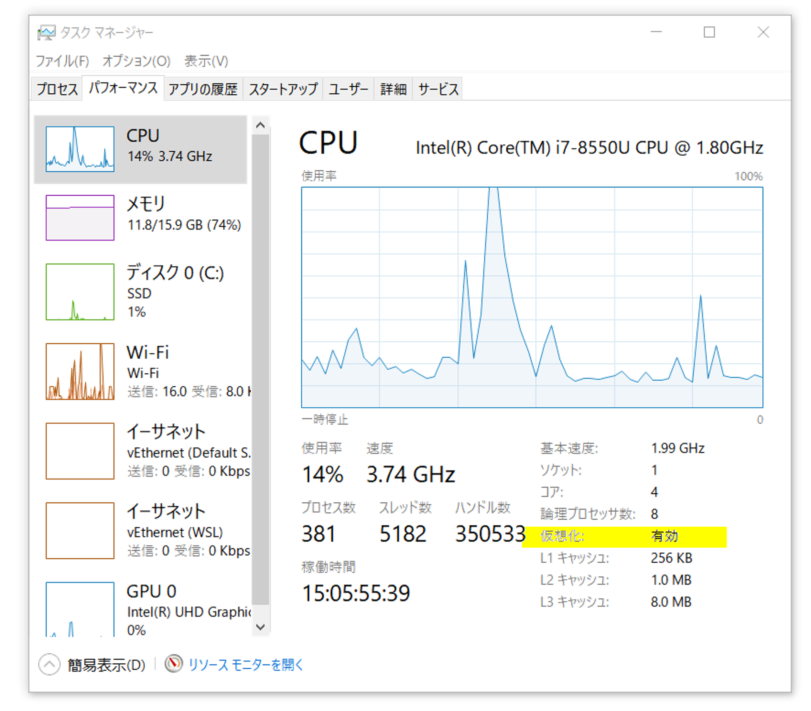

.. H-*- coding: utf-8 -*-
.. URL: https://docs.docker.com/desktop/troubleshoot/topics/
   doc version: 20.10
      https://github.com/docker/docker.github.io/blob/master/desktop/troubleshoot/topics.md
.. check date: 2022/09/17
.. Commits on Aug 24, 2022 9888da23c38fd374ded908e0d50bf1aa45eeef4d
.. -----------------------------------------------------------------------------

.. |whale| image:: /desktop/install/images/whale-x.png
      :width: 50%

.. Troubleshoot topics
.. _desktop-troubleshoot-topics:

==================================================
トラブルシュートのトピック
==================================================

.. sidebar:: 目次

   .. contents:: 
       :depth: 3
       :local:

.. Topics for all platforms
.. _desktop-topics-for-all-platforms:

全プラットフォーム対象のトピック
========================================

.. Make sure certificates are set up correctly
.. desktop-make-sure-certificates-are-set-up-correctly:

証明書を適切にセットアップしているか確認
--------------------------------------------------

.. Docker Desktop ignores certificates listed under insecure registries, and does not send client certificates to them. Commands like docker run that attempt to pull from the registry produces error messages on the command line, for example:

Docker Desktop は :ruby:`安全ではないレジストリ <insecure registry>` 上にある証明書を無視します。また、そちらに対してクライアント証明書も送りません。 ``docker run`` のようなコマンドでは、レジストリからの取得（pull）を試みても、次のようなコマンドライン上のエラーメッセージを表示します。

.. code-block:: bash

   Error response from daemon: Get http://192.168.203.139:5858/v2/: malformed HTTP response "\x15\x03\x01\x00\x02\x02"

.. As well as on the registry. For example:

レジストリ側でも同様にエラーが出ます。こちらが例です。

.. code-block:: bash

   2017/06/20 18:15:30 http: TLS handshake error from 192.168.203.139:52882: tls: client didn't provide a certificate
   2017/06/20 18:15:30 http: TLS handshake error from 192.168.203.139:52883: tls: first record does not look like a TLS handshake

.. Topics for Linux and Mac
.. _desktop-topics-for-linux-and-mac:

Linux と Mac 版のトピック
==============================

.. Volume mounting requires file sharing for any project directories outside of $HOME
.. _desktop-volume-mounting-requires-file-sharing-for-any-project-directories-outside-of-homE:

``$HOME`` 以外のプロジェクト ディレクトリをファイル共有するため、ボリュームのマウントが必要な場合
------------------------------------------------------------------------------------------------------------------------

.. If you are using mounted volumes and get runtime errors indicating an application file is not found, access to a volume mount is denied, or a service cannot start, such as when using Docker Compose, you might need to enable file sharing.

:doc:`Docker Compose </compose/gettingstarted>` 等を使う場合、もしもマウント ボリュームを使用していて、実行時にアプリケーション ファイルが見つからない、ボリューム マウントへのアクセスが拒否、サービスが起動できないなどのエラーが出る時は、 :ref:`ファイル共有 <desktop-preferences-file-sharing>` を有効化する必要があるかもしれません。

.. Volume mounting requires shared drives for projects that live outside of the /home/<user> directory. From Settings, select Resources and then File sharing. Share the drive that contains the Dockerfile and volume.

``/home/<user>`` ディレクトリの外をボリューム マウントするには、プロジェクトに対する共有ドライブが必要です。 **Settings** から **Resources** を選び、 **File sharing** をクリックします。Dockerfile とボリュームを含むドライブを共有します。

.. Topics for Mac
.. _desktop-topis-for-mac:

Mac 版のトピック
====================

.. Incompatible CPU detected
.. _desktop-incompatible-cpu-detected:

互換性がない CPU の検出
--------------------------------------------------

.. Docker Desktop requires a processor (CPU) that supports virtualization and, more specifically, the Apple Hypervisor framework. Docker Desktop is only compatible with Mac systems that have a CPU that supports the Hypervisor framework. Most Macs built in 2010 and later support it,as described in the Apple Hypervisor Framework documentation about supported hardware:

Docker Desktop が必要なのは、仮想化をサポートしているプロセッサ（CPU）と、とりわけ  `Apple Hypervisor framework <https://developer.apple.com/documentation/hypervisor>`_ です。 Docker Desktop が適合するのは、このハイパーバイザ・フレームワークをサポートしている CPU を搭載する Mac システムのみです。多くの Mac は 2010 年以降、最近まで製造されたものであり、サポートしています。詳細は Apple Hypervisor Framework ドキュメントにサポートしているハードウェアの情報があります。

.. Generally, machines with an Intel VT-x feature set that includes Extended Page Tables (EPT) and Unrestricted Mode are supported.

`一般的に、Intel VT-x 機能ががセットされたマシンには、Extended Page Table (EPT) と Unrestricted モードがサポートされています。`

.. To check if your Mac supports the Hypervisor framework, run the following command in a terminal window.

自分の Mac が Hypervisor frametowk をサポートしているかどうか確認するには、ターミナルウインドウ上で以下のコマンドを実行します。

.. code-block:: bash

   $ sysctl kern.hv_support

.. If your Mac supports the Hypervisor Framework, the command prints kern.hv_support: 1.

もしも Mac がハイパーバイザ・フレームワークをサポートしていたら、コマンドの結果は :code:`kern.hv_support: 1` です。

.. If not, the command prints kern.hv_support: 0.

もしサポートしていなければ、コマンドの結果は :code:`kern.hv_support: 0` です。

.. See also, Hypervisor Framework Reference in the Apple documentation, and Docker Desktop Mac system requirements.

また、Apple のドキュメント `Hypervisor Framework Reference <https://developer.apple.com/library/mac/documentation/DriversKernelHardware/Reference/Hypervisor/>`_ と Docker Desktop :ref:`Mac システム要件 <mac-system-requirements>` をご覧ください。

.. Topics for Windows
.. _desktop-topics-for-windows:

Windows 版のトピック
====================

.. Volumes
.. _desktop-topic-windows-volumes:

ボリューム
----------

.. Permissions errors on data directories for shared volumes
.. _desktop-topics-windows-permissions-errors-on-data-directories-for-shared-volumes:

共有ボリュームにおける、データ ディレクトリ上の権限（permission）エラー
^^^^^^^^^^^^^^^^^^^^^^^^^^^^^^^^^^^^^^^^^^^^^^^^^^^^^^^^^^^^^^^^^^^^^^^^^^^^^^^^

.. Docker Desktop sets permissions on shared volumes to a default value of 0777 (read, write, execute permissions for user and for group).

Docker Desktop は :ref:`共有ボリューム <win-preferences-file-sharing>` 上の権限（パーミッション）をデフォルトで :code:`0777` （ :code:`ユーザ` 及び :code:`グループ` に対して、 :code:`読み込み` ・ :code:`書き込み` ・ :code:`実行` の権限）に設定します。

.. The default permissions on shared volumes are not configurable. If you are working with applications that require permissions different from the shared volume defaults at container runtime, you need to either use non-host-mounted volumes or find a way to make the applications work with the default file permissions.

共有ボリューム上におけるデフォルトの権限は、変更できません。もしも、アプリケーションの動作上、デフォルトの共有ボリューム上でコンテナ実行時に異なる権限が必要となる場合は、ホストをマウントしないボリュームを使用するか、アプリケーション側が初期設定の権限で動作する設定を見つける必要があります。

.. See also, Can I change permissions on shared volumes for container-specific deployment requirements? in the FAQs.

また、 :ref:`can-i-change-permissions-on-shared-volumes-for-container-specific-deployment-requirements` もご覧ください。

.. Volume mounting requires shared drives for Linux containers
.. _desktop-topics-windows-volume-mounting-requires-shared-drives-for-linux-containers:

共有ドライブ上へのボリューム マウントが Linux コンテナに必要です
^^^^^^^^^^^^^^^^^^^^^^^^^^^^^^^^^^^^^^^^^^^^^^^^^^^^^^^^^^^^^^^^^^^^^^^^^^^^^^^^

.. If you are using mounted volumes and get runtime errors indicating an application file is not found, access is denied to a volume mount, or a service cannot start, such as when using Docker Compose, you might need to enable shared folders.

マウント ボリュームを使用中に、アプリケーション ファイルが見つからないというランタイム エラーが表示される場合は、ボリューム マウントに対するアクセスが拒否されているか、あるいは、 :doc:` Docker Compose </compose/gettingstarted>` などを使っていてサービスが開始できない場合には、  :ref:`共有フォルダ <<win-preferences-file-sharing>` の有効化が必要でしょう。

.. With the Hyper-V backend, mounting files from Windows requires shared folders for Linux containers. Click whale menu and then Settings > Shared Folders and share the folder that contains the Dockerfile and volume.

Hyper-V バックエンドで、Windows から Linux コンテナにボリュームをマウントするには、共有フォルダが必要です。Docker アイコンをクリックし、それから **Settings > Shared Folders** を選び、Dockerfile と ボリュームを置くためのフォルダを共有します。

.. Support for symlinks
.. _desktop-topics-windows-support-for-simlinks:

シンボリックリンク（symlinks）のサポート
^^^^^^^^^^^^^^^^^^^^^^^^^^^^^^^^^^^^^^^^^^^^^^^^^^

.. Symlinks work within and across containers. To learn more, see How do symlinks work on Windows? in the FAQs.

シンボリックリンクはコンテナ間および横断して機能します。詳しく学ぶには、 FAQ の :ref:`how-do-symlinks-work-on-windows` をご覧ください。

.. Avoid unexpected syntax errors, use Unix style line endings for files in containers
.. _desktop-topics-windows-avoid-unexpected-syntax-errors,-use-unix-style-line-endings-for-files-in-containers:

予期しない構文エラー（unexpected syntax error）を避けるため、コンテナ内でファイルの行末を unix 風にする
^^^^^^^^^^^^^^^^^^^^^^^^^^^^^^^^^^^^^^^^^^^^^^^^^^^^^^^^^^^^^^^^^^^^^^^^^^^^^^^^^^^^^^^^^^^^^^^^^^^^^^^^^

.. Any file destined to run inside a container must use Unix style \n line endings. This includes files referenced at the command line for builds and in RUN commands in Docker files.

コンテナ内で実行するあらゆるファイルは、 Unix 風の行末 :code:`\n` を使う必要があります。これをファイルに含むのは、ビルド用のコマンドラインや Dockerfile における RUN 命令で参照するからです。

.. Docker containers and docker build run in a Unix environment, so files in containers must use Unix style line endings: \n, not Windows style: \r\n. Keep this in mind when authoring files such as shell scripts using Windows tools, where the default is likely to be Windows style line endings. These commands ultimately get passed to Unix commands inside a Unix based container (for example, a shell script passed to /bin/sh). If Windows style line endings are used, docker run fails with syntax errors.

Docker コンテナと :code:`docker build` の実行は Unix 環境のため、コンテナ内のファイルは Unix 風の行末 :code:`\n` を使うのが必須です。 Window 風の :code:`\r\n` ではありません。シェルスクリプトのようなファイルを作成するときは、Windows ツールを使うとデフォルトで Windows 風の行末になるので、気に留めておいてください。各コマンドは、最終的には Unix をベースするコンテナ内の Unix コマンドに渡されます（例えば、シェルスクリプトは :code:`/bin/sh` に渡されます）。もしも Windows 風の行末が用いられると、 :code:`docker run` は構文エラーになり失敗します。

.. For an example of this issue and the resolution, see this issue on GitHub: Docker RUN fails to execute shell script.

この問題と解決方法の例は、GitHub 上の issue を御覧ください：  `Docker RUN でシェルスクリプトの実行に失敗する（英語） <https://github.com/moby/moby/issues/24388)>`_ 

.. Path conversion on Windows
.. _desktop-topics-windows-path-conversion-on-windows:

Windows 上でのパス変換
^^^^^^^^^^^^^^^^^^^^^^^^^^^^^^

.. On Linux, the system takes care of mounting a path to another path. For example, when you run the following command on Linux:

Linux 上では、マウントしているパスを、他のパスへと管理しています。たとえば、Linux 上で以下のコマンドを実行するとします。

.. code-block:: bash

   $ docker run --rm -ti -v /home/user/work:/work alpine

.. It adds a /work directory to the target container to mirror the specified path.

これは対象のコンテナに ``/work`` ディレクトリを追加し、指定したパスの内容をミラーします。

.. However, on Windows, you must update the source path. For example, if you are using the legacy Windows shell (cmd.exe), you can use the following command:

しかしながら、Windows 上では、元のパス（ソース パス）を変更する必要があります。たとえば、レガシーの Windows シェル（ ``cmd.exe`` ）を使っている場合、以下のコマンドが使えます。

.. code-block:: bash

   $ docker run --rm -ti -v C:\Users\user\work:/work alpine

.. This starts the container and ensures the volume becomes usable. This is possible because Docker Desktop detects the Windows-style path and provides the appropriate conversion to mount the directory.

これはコンテナを起動し、ボリュームを利用可能な状態にします。Docker Desktop は Windows 形式のパスを見つけると、ディレクトリをマウントするため、適切に変換する場合があります。

.. Docker Desktop also allows you to use Unix-style path to the appropriate format. For example:

Docker Desktop でも適切な形式で Unix 風のパスを指定できます。例：

.. code-block:: bash

   $ docker run --rm -ti -v /c/Users/user/work:/work alpine ls /work

.. Working with Git Bash
.. _desktop-topics-windows-working-with-git-bash:

Git Bash で動かす
^^^^^^^^^^^^^^^^^^^^^^^^^^^^^^

.. Git Bash (or MSYS) provides Unix-like environment on Windows. These tools apply their own preprocessing on the command line. For example, if you run the following command in Git Bash, it gives an error:

.. code-block:: bash

   $ docker run --rm -ti -v C:\Users\user\work:/work alpine
   docker: Error response from daemon: mkdir C:UsersUserwork: Access is denied.

.. This is because the \ character has a special meaning in Git Bash. If you are using Git Bash, you must neutralize it using \\:

エラーになるのは、 Git Bush では ``\`` 記号が特別な意味を持つためです。Bit Bash を使う場合は、無効化する ``\\`` を使う必要があります。

.. code-block:: bash

   $ docker run --rm -ti -v C:\\Users\\user\\work:/work alpine

.. Also, in scripts, the pwd command is used to avoid hardcoding file system locations. Its output is a Unix-style path.

また、スクリプト内で ``pwd`` コマンドを使う場合は、ファイルシステムの場所をハードコーディングしないように使われます。出力は Unix 風のパスです。

.. code-block:: bash

   $ pwd
   /c/Users/user/work

.. Combined with the $() syntax, the command below works on Linux, however, it fails on Git Bash.

``$()`` 構文を組み合わせる場合、 Linux では以下のコマンドは動作しますが、 Git Bash では失敗します。

.. code-block:: bash

   $ docker run --rm -ti -v $(pwd):/work alpine
   docker: Error response from daemon: OCI runtime create failed: invalid mount {Destination:\Program Files\Git\work Type:bind Source:/run/desktop/mnt/host/c/Users/user/work;C Options:[rbind rprivate]}: mount destination \Program Files\Git\work not absolute: unknown.

.. You can work around this issue by using an extra /

この問題に対応するには、追加の ``/`` を使います。

.. code-block:: bash

   $ docker run --rm -ti -v /$(pwd):/work alpine

.. Portability of the scripts is not affected as Linux treats multiple / as a single entry. Each occurence of paths on a single line must be neutralized.

Linux は複数の ``/`` を１つの入力として扱うため、スクリプトの互換性には影響ありません。１行でパスを扱う場合は、無効化する必要があります。

.. code-block:: bash

   $ docker run --rm -ti -v /$(pwd):/work alpine ls /work
   ls: C:/Program Files/Git/work: No such file or directory

.. In this example, The $(pwd) is not converted because of the preceding ‘/’. However, the second ‘/work’ is transformed by the POSIX layer before passing it to Docker Desktop. You can also work around this issue by using an extra /.

この例では、 ``/`` が先にあるため、  ``$(pwd)`` は変換されません。ですが、２つめの ``/work`` は Docker Desktop で処理する前に、 POSIX レイヤーによって変換されます。これを正しく動作するには、 ``/`` を追加します。

.. code-block:: bash

   $ docker run --rm -ti -v /$(pwd):/work alpine ls //work

.. To verify whether the errors are generated from your script, or from another source, you can use an environment variable. For example:

スクリプトや他のソースでエラーが発生する場合、どこか原因かを確認するには、環境変数が使えます。例：

.. code-block:: bash

   $ MSYS_NO_PATHCONV=1 docker run --rm -ti -v $(pwd):/work alpine ls /work

.. It only expects the environment variable here. The value doesn’t matter.

ここでは、環境変数そのものを想定しています。（環境変数の）値は関係ありません。

.. In some cases, MSYS also transforms colons to semicolon. Similar conversions can also occur when using ~ because the POSIX layer translates it to a DOS path. MSYS_NO_PATHCONV also works in this case.

場合によっては、 MSYS もコロンをセミコロンに変換します。 ``~`` を使う時、 POSIX レイヤーが DOS のパスに変更する時に発生する状況と似ています。この場合、 ``MSYS_NO_PATHCONV`` も動作します。

.. Virtualization
.. _desktop-topics-windows-virtualization:

仮想化
--------------------

.. Your machine must have the following features for Docker Desktop to function correctly:

Docker Desktop を正しく機能するには、マシンには以下の機能が必要です。

.. WSL 2 and Windows Home
.. _.. _desktop-topics-wsl-2-and-windows-home:

WSL 2 と Windows Home
^^^^^^^^^^^^^^^^^^^^^^^^^^^^^^

..   Virtual Machine Platform
    Windows Subsystem for Linux
    Virtualization enabled in the BIOS
    Hypervisor enabled at Windows startup

1. 仮想マシン プラットフォーム
2. `Linux 用 Windows サブシステム (WSL) <https://docs.microsoft.com/ja-jp/windows/wsl/install>`_ 
3. `BIOS で仮想化を有効 <https://bce.berkeley.edu/enabling-virtualization-in-your-pc-bios.html>`_
4. Windows 起動時にハイパーバイザーを有効化

.. Hyper-V
.. _desktop-topics-windows-hyper-v:

Hyper-V
^^^^^^^^^^^^^^^^^^^^^^^^^^^^^^^^^^^^^^^^^^^^^^^^^^

.. On Windows 10 Pro or Enterprise, you can also use Hyper-V with the following features enabled:

Windows 10 Pro や Enterprise では、以下の機能を有効にして Hyper-V も使えます。

..    Hyper-V installed and working
    Virtualization enabled in the BIOS

1. `Hyper-V <https://docs.microsoft.com/ja-jp/windows-server/virtualization/hyper-v/hyper-v-technology-overview>`_ をインストールして、動作させる
2. `BIOS で仮想化の有効化 <https://bce.berkeley.edu/enabling-virtualization-in-your-pc-bios.html>`_ 
3. Windows 起動時にハイパーバイザーを有効化

.. image:: ../images/hyperv-enabled.png
   :width: 60%
   :alt: Windows 機能の Hyper-V

.. Docker Desktop requires Hyper-V as well as the Hyper-V Module for Windows Powershell to be installed and enabled. The Docker Desktop installer enables it for you.

Docker Desktop をインストールして有効化するには、 Hyper-V と同様に Windows Powershell 用 Hyper-V モジュールも必要です。Docker Desktop インストーラは、これらを有効化します。

.. Docker Desktop also needs two CPU hardware features to use Hyper-V: Virtualization and Second Level Address Translation (SLAT), which is also called Rapid Virtualization Indexing (RVI). On some systems, Virtualization must be enabled in the BIOS. The steps required are vendor-specific, but typically the BIOS option is called Virtualization Technology (VTx) or something similar. Run the command systeminfo to check all required Hyper-V features. See Pre-requisites for Hyper-V on Windows 10 for more details.

また、Docker Desktop は Hyper-V を使うために2つの CPU 機能を使います。すなわち、仮想化と  Rapid Virtualization Indexing (RVI) とも呼ばれる Second Level Address Translation (SLAT) です。同じシステムの BIOS 上で、Virtualization （仮想化）の有効化が必須です。必要な手順はベンダによって異なりますが、典型的な BIOS オプションは :code:`Virtualization Technology (VTx)` と呼ばれるものか、似たようなものです。Hyper-V 機能が必要とする全てを確認するには、 :code:`systeminfo` コマンドを実行します。詳細は `Windows 10 Hyper-V のシステム要件 <https://docs.microsoft.com/ja-jp/virtualization/hyper-v-on-windows/reference/hyper-v-requirements>`_ を御覧ください。

.. To install Hyper-V manually, see Install Hyper-V on Windows 10. A reboot is required after installation. If you install Hyper-V without rebooting, Docker Desktop does not work correctly.

Hyper-V を手動でインストールするには、 `Windows 10 上に Hyper-V をインストールする <https://msdn.microsoft.com/en-us/virtualization/hyperv_on_windows/quick_start/walkthrough_install>`_ を御覧ください。インストール後は再起動が必要です。Hyper-V をインストールしても再起動をしないと、 Docker Desktop は正しく動作しません。

.. From the start menu, type Turn Windows features on or off and press enter. In the subsequent screen, verify that Hyper-V is enabled:

スタートメニューから、 **Windows 機能の有効化又は無効化** を入力し、エンターを押します。以下の画面のようになっていると、Hyper-V は有効です。

.. Virtualization must be enabled
.. _desktop-topics-virtualization-must-be-enabled:

仮想化の有効化が必須
^^^^^^^^^^^^^^^^^^^^^^^^^^^^^^^^^^^^^^^^^^^^^^^^^^

.. In addition to Hyper-V or WSL 2, virtualization must be enabled. Check the Performance tab on the Task Manager:

:ref:`Hyper-V <win-troubleshoot-hyper-v>` や :doc:`WSL 2 <wsl>` を追加するには、仮想化の有効化が必要です。タスクマネージャー上のパフォーマンス タブをクリックします。

.. If you manually uninstall Hyper-V, WSL 2 or disable virtualization, Docker Desktop cannot start. See Unable to run Docker for Windows on Windows 10 Enterprise.

もしも Hyper-V を手動でアンインストールするか、仮想化を無効にしたら、Docker Desktop は起動できません。 [Windows 10 Enterprise では Docker for Windows を実行できません（英語）](https://github.com/docker/for-win/issues/74) を御覧ください。

.. Hypervisor enabled at Windows startup
.. _desktop-topics-hypervisor-enabled-at-windows-startup:

Windows のスタートアップでハイパーバイザを有効化
^^^^^^^^^^^^^^^^^^^^^^^^^^^^^^^^^^^^^^^^^^^^^^^^^^

.. If you have completed the steps described above and are still experiencing Docker Desktop startup issues, this could be because the Hypervisor is installed, but not launched during Windows startup. Some tools (such as older versions of Virtual Box) and video game installers disable hypervisor on boot. To reenable it:

前述の手順を全て実施しても Docker Desktop の起動に問題が出ている場合は、ハイパーバイザーはインストールされているものの、Windows のスタートアップ（起動処理）中に起動できていない可能性があります。同様のツール（Virtual Box の古いバージョン）やビデオゲームのインストーラが、起動時にハイパーバイザーを無効化します。再度、有効化するには、次の手順をします。

..  Open an administrative console prompt.
    Run bcdedit /set hypervisorlaunchtype auto.
    Restart Windows.

1. 管理者としてコマンドプロンプトを開く。
2. ``bcdedit /set hypervisorlaunchtype auto`` を実行
3. Windows 再起動

.. You can also refer to the Microsoft TechNet article on Code flow guard (CFG) settings.

また、 `Microsoft TechNet の記事 <https://social.technet.microsoft.com/Forums/en-US/ee5b1d6b-09e2-49f3-a52c-820aafc316f9/hyperv-doesnt-work-after-upgrade-to-windows-10-1809?forum=win10itprovirt>`_ にある Code flow guard (CFG) 設定もご覧ください。

.. Windows containers and Windows Server
.. _desktop-topics-windows-containers-and-windows-server:

Windows コンテナーと Windows Server
--------------------------------------------------

.. Docker Desktop is not supported on Windows Server. If you have questions about how to run Windows containers on Windows 10, see Switch between Windows and Linux containers.

Windows Server 上での Docker Desktop はサポート外です。Windows 10 上で Windows コンテナの実行に関する疑問があれば、 :ref:`switch-between-windows-and-linux-containers` を御覧ください。

.. A full tutorial is available in docker/labs on Getting Started with Windows Containers.

`docker/labs  <https://github.com/docker/labs>`_ の `Getting Started with Windows Container <https://github.com/docker/labs/blob/master/windows/windows-containers/README.md>`_ に全てのチュートリアルがあります。
.. 
.. You can install a native Windows binary which allows you to develop and run Windows containers without Docker Desktop. However, if you install Docker this way, you cannot develop or run Linux containers. If you try to run a Linux container on the native Docker daemon, an error occurs:

ネイティブな Windows バイナリをインストールしたら、Windows Desktop がなくても Windows コンテナの開発と実行が可能です。しかし、この方法で Docker をインストールしたら、Linux コンテナの開発と実行ができません。もしもネイティブな Docker デーモンで Linux コンテナの実行を試みても、次のようなエラーが発生します。

.. code-block:: bash

   C:\Program Files\Docker\docker.exe:
    image operating system "linux" cannot be used on this platform.
    See 'C:\Program Files\Docker\docker.exe run --help'.

.. Networking issues
.. _desktop-topics-windows-networking-issues:
ネットワーク機能の問題
------------------------------

.. IPv6 is not (yet) supported on Docker Desktop.

Docker Desktop は（まだ） IPv6 をサポートしていません。

.. seealso::

   Troubleshoot topics
      https://docs.docker.com/desktop/troubleshoot/topics/
