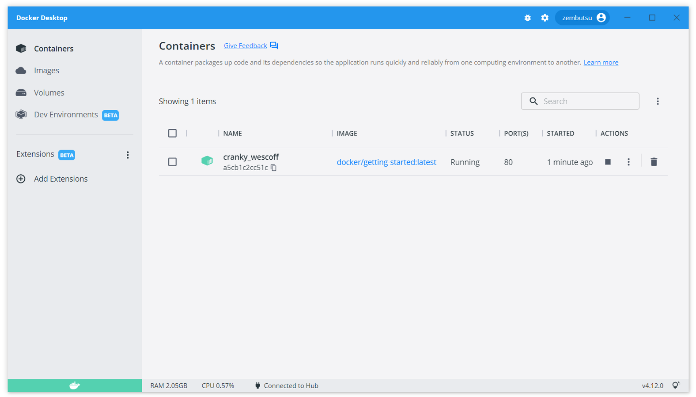

.. -*- coding: utf-8 -*-
.. URL: https://docs.docker.com/desktop/use-desktop/
   doc version: 20.10
      https://github.com/docker/docker.github.io/blob/master/desktop/use-desktop/index.md
.. check date: 2022/09/14
.. Commits on Sep 9, 2022 cbbb9f1fac9289c0d2851584010559f8f03846f0
.. -----------------------------------------------------------------------------

.. |whale| image:: /desktop/install/images/whale-x.png
      :scale: 50%

.. Overview
.. _docker-desktop-overview:

=======================================
概要
=======================================

.. When you open Docker Desktop, the Docker Dashboard displays.

Docker Desktop を開くと、 Docker ダッシュボードが表示されます。

.. The Containers view provides a runtime view of all your containers and applications. It allows you to interact with containers and applications, and manage the lifecycle of your applications directly from your machine. This view also provides an intuitive interface to perform common actions to inspect, interact with, and manage your Docker objects including containers and Docker Compose-based applications. For more information, see Explore running containers and applications.

**Containers** では、コンテナとアプリケーションすべての実行状況を表示します。ここではコンテナやアプリケーションとやりとりできるようになり、アプリケーションのライフサイクルをマシン上から直接管理できます。また、直感的な操作画面を通して、コンテナを含む Docker オブジェクトや Docker Compose をベースとしたアプリケーションをの調査や管理ができるようになります。詳しい情報は、 :doc:`実行中のコンテナとアプリケーションを見渡す <container>` をご覧ください。

.. The Images view displays a list of your Docker images and allows you to run an image as a container, pull the latest version of an image from Docker Hub, and inspect images. It also displays a summary of the vulnerability scanning report using Snyk. In addition, the Images view contains clean-up options to remove unwanted images from the disk to reclaim space. If you are logged in, you can also see the images you and your organization have shared on Docker Hub. For more information, see Explore your images.

**Images** では、Docker イメージを一覧表示し、コンテナとしてのイメージ実行や、Docker Hub から最新版のイメージの取得、イメージの調査ができるようにします。また Synk を使った脆弱性検査の概要も表示します。加えて、 **Images** の表示領域には、不要なイメージを削除してディスク容量を確保するため、クリーンアップするオプションもあります。ログインしている場合は、 Docker Hub 上で自分や組織が共有しているイメージも表示します。詳しい情報は :doc:`イメージを見渡す <images>` をご覧ください。

.. The Volumes view displays a list of volumes and allows you to easily create and delete volumes and see which ones are being used. For more information, see Explore volumes.

**Volumes**  ではボリュームを一覧表示し、ボリュームを簡単に作成や削除できるようにし、どのボリュームが使われているかを表示します。詳しい情報は :doc:`ボリュームを見渡す <volumes>` をご覧ください。

.. In addition, the Docker Dashboard allows you to:

さらに、 Docker ダッシュボードでは以下のことが可能です；

..  Easily navigate to the Preferences (Settings in Windows) menu to configure Docker Desktop preferences. Select the Preferences or Settings icon in the Dashboard header.
    Access the Troubleshoot menu to debug and perform restart operations. Select the Troubleshoot icon in the Dashboard header.

* Docker Desktop を調整し、 **Preferences** （Windows では Settings）メニューに簡単に辿り着ける。
* **Troubleshoot** メニューにアクセスしデバッグと再起動処理を行う。ダッシュボードの見出しにある **Troubleshoot** アイコンを選ぶ。

.. The Whale menu
.. _the-whale-menu:
鯨のメニュー
====================

.. Docker Desktop also provides an easy-access tray icon that appears in the taskbar and is reffered to as the Whale menu whale menu.

Docker Desktop は、タスクバー内にあるトレイアイコンからも簡単にアクセスでき、そのためには鯨のメニュー |whale| を辿ります。

.. To display the Whale menu, right-click on the whale menu icon. It displays the following options:

鯨のメニューを表示するには、 |whale| アイコンを右クリックします。以下のオプションが表示されます。

..  Dashboard. This takes you to the Docker Dashboard.
    Sign in/Create Dock Id
    Settings. Takes you to the Settings, or Preferences is you use a macOS.
    Switch to Windows containers
    About Docker Desktop. Contains information on the versions you are running, and links to the Subscription Service Agreement for example.
    Documentation
    Quick Start Guide. Launches the Quick Start Guide.
    Docker Hub
    Extensions
    Kubernetes
    Pause
    Restart
    Quit Docker Desktop

* **Dashboard** （ダッシュボード）
* **Sign in/Create Dock Id** （サインイン/Docker ID作成）
* **Settings** （設定）
* **Switch to Windows containers** （Windows コンテナーに切り替え）
* **About Docker Desktop** （ Docker Desktop について）
* **Documentation** （ドキュメント）
* **Quick Start Guide** （クイックスタートガイド）
* **Extensions** （拡張機能）
* **Kubernetes** 
* **Pause** （一次停止）
* **Restart** （再起動）
* **Quit Docker Desktop** （Docker Desktop を終了）

.. seealso::

   Overview
      https://docs.docker.com/desktop/use-desktop/
