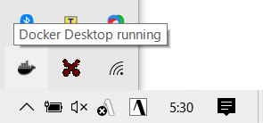
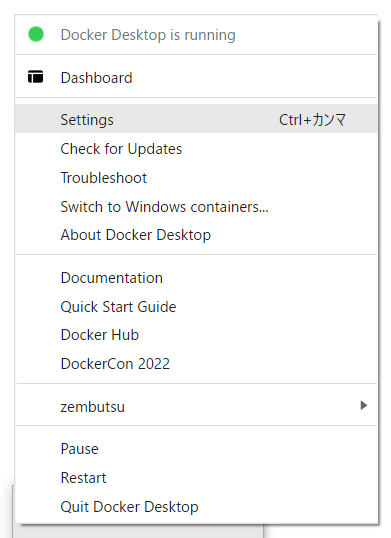
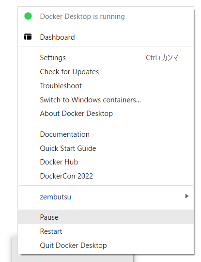

.. -*- coding: utf-8 -*-
.. URL: https://docs.docker.com/desktop/windows/
   doc version: 19.03
      https://github.com/docker/docker.github.io/blob/master/docker-for-win/index.md
   doc version: 20.10
      https://github.com/docker/docker.github.io/blob/master/desktop/windows/index.md
.. check date: 2022/05/14
.. Commits on May 5, 2022 303b29c726282ad5606d6589be7935c2abd68ab7
.. -----------------------------------------------------------------------------

.. Docker Desktop for Windows user manual
.. _docker-desktop-for-windows-user-manual:

==================================================
Docker Desktop for Windows 利用者マニュアル
==================================================

.. sidebar:: 目次

   .. contents:: 
       :depth: 3
       :local:

.. Welcome to Docker Desktop!

Docker Desktop へようこそ！

.. Welcome to Docker Desktop! The Docker Desktop for Windows user manual provides information on how to configure and manage your Docker Desktop settings.

Docker Desktop へようこそ！ Docker Desktop for Windows 利用者マニュアルは、Docker Desktop 設定の調整と管理方法についての情報を提供します。

.. For information about Docker Desktop download, system requirements, and installation instructions, see Install Docker Desktop.

Docker Desktop のダウンロード、システム要件、インストール手順については、  :doc:`Docker Desktop のインストール <install>` を御覧ください。

.. Settings
.. _docker-desktop-for-win-settings:

Settings （設定）
==============================

.. The Docker Desktop menu allows you to open the Docker Dashboard, run the Quick Start Guide, configure your Docker settings such as installation, updates, version channels, Docker Hub login, and more.

**Docker Desktop** のメニューは、Docker Dashboard を開いたり、クイックスタートガイドの起動、Docker の設定を調整できます。たとえば、インストール、更新、バージョンのチャンネル、 Docker Hub ログイン等です。

.. This section explains the configuration options accessible from the Settings dialog.

このセクションでは **Settings** （設定）画面から設定できるオプションを説明します。

..    Open the Docker Desktop menu by clicking the Docker icon in the Notifications area (or System tray):

1.　Docker Desktop のメニューを開くには、通知エリア（又はシステムトレイ）にある Docker アイコンをクリックします。

..    Showing hidden apps in the taskbar

2.　設定画面から **Settings** （設定）を選びます。

..    Select Settings to open the Settings dialog:

.. General
.. _win-general:
General（一般的な設定）
------------------------------

.. On the General tab, you can configure when to start Docker and specify other settings.

設定画面の **General** タブでは、Docker の起動や他の設定を調整できます。

.. image:: ./images/settings-general.png
   :scale: 60%
   :alt: 設定

.. Start Docker when you log in: Select this option to automatically start Docker Desktop when you log into your Windows machine.

* **Start Docker when you log in** ：このオプションを選択すると、Windows マシンへのログイン時、自動的に Docker Desktop を起動します。

.. Expose daemon on tcp://localhost:2375 without TLS - Click this option to enable legacy clients to connect to the Docker daemon. You must use this option with caution as exposing the daemon without TLS can result in remote code execution attacks.

* **Expose daemon on tcp://localhost:2357 without TLS** ：古い（レガシーの）クライアントが Docker デーモンに接続できるようにするには、このオプションを有効化します。このオプションを使う場合は注意が必要です。TLS なしでデーモンを公開する場合は、リモートからのコード実行攻撃をもたらす可能性があるためです。

.. Use the WSL 2 based engine: WSL 2 provides better performance than the legacy Hyper-V backend. For more information, see Docker Desktop WSL 2 backend.

* **Use the WSL 2 based engine** （WSL 2 基盤の Engine を使う）：WSL2 は以前の Hyper-V バックエンドより良いパフォーマンスを提供します。詳しい情報は :doc:`Docker Desktop WSL 2 バックエンド <wsl>` をご覧ください。

.. Send usage statistics: By default, Docker Desktop sends diagnostics, crash reports, and usage data. This information helps Docker improve and troubleshoot the application. Clear the check box to opt out. Docker may periodically prompt you for more information.

* **Send usage statics** - デフォルトでは、Docker Desktop は診断情報・クラッシュ報告・利用データを送信します。この情報は、 Docker の改善やアプリケーションの問題解決に役立ちます。止めるにはチェックボックスを空にします。Docker は定期的に更なる情報を訊ねるかもしれません。

.. Show weekly tips: Displays useful advice and suggestions about using Docker.

* **Show Weekly tips** ：Docker の使い方に役立つアドバイスや提案を表示します。

.. Open Docker Desktop dashboard at startup: Automatically opens the dashboard when starting Docker Desktop.

* **Open Docker Desktop dashboard at startup** ：Docker Desktop の起動時に、ダッシュボードを自動的に開きます。

.. Use Docker Compose V2: Select this option to enable the docker-compose command to use Docker Compose V2. For more information, see Docker Compose V2.

* **Use Docker Compose V2** ：このオプションを選択すると、 ``docker-compose`` コマンドが Docker Compose V2 を使えるようにします。詳しい情報は :doc:`Docker Compose V2 <compose-v2-and-the-new-docker-compose-command>` をご覧ください。

.. Resources:
.. _win-resources:
Resources（リソース）
------------------------------

.. The Resources tab allows you to configure CPU, memory, disk, proxies, network, and other resources. Different settings are available for configuration depending on whether you are using Linux containers in WSL 2 mode, Linux containers in Hyper-V mode, or Windows containers.

**Resources** （リソース）タブでは、CPU 、メモリ、ディスク、プロキシ、ネットワーク、その他のリソースを設定できます。どのような項目が設定可能かについては、 WSL 2 モードで Linux コンテナを使うか、 Hyper-V モードで Linux コンテナを使うか、 Windows コンテナーを使うかにより異なります。

.. Advanced
.. _mac-resources-advanced:
ADVANCED（高度な設定）
^^^^^^^^^^^^^^^^^^^^^^^^^^^^^^

..  Note
    The Advanced tab is only available in Hyper-V mode, because Windows manages the resources in WSL 2 mode and Windows container mode. In WSL 2 mode, you can configure limits on the memory, CPU, and swap size allocated to the WSL 2 utility VM.

.. note::

   Advanced タブは Hyper-V モードでのみ利用できます。これは Windows が WSL 2 モードと Windows コンテナー モードのリソースを管理するからです。 WSL 2 モードで設定するには、 `WSL 2 が使う仮想マシン <https://docs.microsoft.com/ja-jp/windows/wsl/wsl-config#configure-global-options-with-wslconfig>`_ に対してメモリ、CPU、スワップの割り当てを制限できます。

.. On the Advanced tab, you can limit resources available to Docker.

**Advanced** タブでは、 Docker が利用できるリソースを制限します。

.. CPUs: By default, Docker Desktop is set to use half the number of processors available on the host machine. To increase the processing power, set this to a higher number. To decrease the processing power, set this to a lower number.

- **CPUs** （CPU）: デフォルトでは、 ホスト マシン上で利用可能なプロセッサ数の半分を、Docker Desktop が使います。処理性能を向上するには、この値を高くします。処理性能を減らすには、数値を低くします。

.. Memory: By default, Docker Desktop is set to use 2 GB runtime memory, allocated from the total available memory on your machine. To increase the RAM, set this to a higher number. To decrease the RAM, lower the number.

- **Memory** （メモリ）: デフォルトでは、 マシン上で利用可能な全メモリから `2` GB の実行メモリを使用する設定です。RAM を増やすには、この値を高くします。減らすには、値を低くします。

.. Swap: Configure swap file size as needed. The default is 1 GB.

- **Swap** （スワップ）: 必要になるスワップ ファイル容量を設定します。デフォルトは 1 GB です。

.. Disk image size: Specify the size of the disk image.

- **Disk image size** （ディスク イメージ容量）: ディスク イメージの容量を指定します。

.. Disk image location: Specify the location of the Linux volume where containers and images are stored.

- **Disk image location** （ディスク イメージの場所）: Linux ボリュームの場所を指定します。ここにコンテナとイメージを置きます。

.. You can also move the disk image to a different location. If you attempt to move a disk image to a location that already has one, you get a prompt asking if you want to use the existing image or replace it.

また、ディスク イメージは別の場所に移動できます。ディスク イメージの指定先に既にイメージがある場合は、既存のイメージを使うか置き換えるか訊ねる画面を表示します。

.. FILE SHARING
.. _win-preferences-file-sharing:

FILE SHARING（ファイル共有）
^^^^^^^^^^^^^^^^^^^^^^^^^^^^^^

..  Note
    The Advanced tab is only available in Hyper-V mode, because Windows manages the resources in WSL 2 mode and Windows container mode. In WSL 2 mode, you can configure limits on the memory, CPU, and swap size allocated to the WSL 2 utility VM.

.. note::

   Advanced タブは Hyper-V モードでのみ利用できます。これは Windows が WSL 2 モードと Windows コンテナー モードのリソースを管理するからです。 WSL 2 モードで設定するには、 `WSL 2 が使う仮想マシン <https://docs.microsoft.com/ja-jp/windows/wsl/wsl-config#configure-global-options-with-wslconfig>`_ に対してメモリ、CPU、スワップの割り当てを制限できます。

.. Use File sharing to allow local directories on Windows to be shared with Linux containers. This is especially useful for editing source code in an IDE on the host while running and testing the code in a container. Note that configuring file sharing is not necessary for Windows containers, only Linux containers. If a directory is not shared with a Linux container you may get file not found or cannot start service errors at runtime. See Volume mounting requires shared folders for Linux containers.

Linux コンテナと共有したいローカルのディレクトリを選択します。ファイル共有は Linux コンテナ内でボリュームをマウントするために必要であり、Windows コンテナ－用ではありません。 :ref:`Linux コンテナ <switch-between-windows-and-linux-containers>` では、Dockerfile とボリュームを保管するための場所として、ドライブの共有が必要です。指定がなければ、実行時に :code:`file not found` （ファイルが見つかりません）や :code:`cannot start service` （サービスを開始できません）のエラーが出ます。詳しくは :ref:`volume-mounting-requires-shared-drives-for-linux-containers` を御覧ください。

.. File share settings are:

ファイル共有設定では：

..  Add a Directory: Click + and navigate to the directory you want to add.
    Apply & Restart makes the directory available to containers using Docker’s bind mount (-v) feature.

* **Add a Directory** （ディレクトリ追加）： ``+`` をクリックし、追加したいディレクトリを指定します。
* **Apply & Restart** （適用と再起動）：コンテナで Docker の バインド マウント（ ``-v`` ）機能を有効にします。

..    Tips on shared drives, permissions, and volume mounts

.. tip::

   **共有ドライブ、権限、ボリューム・マウントに役立つ情報**

   .. Share only the directories that you need with the container. File sharing introduces overhead as any changes to the files on the host need to be notified to the Linux VM. Sharing too many files can lead to high CPU load and slow filesystem performance.
   * コンテナが必要なディレクトリのみ共有できます。ファイル共有によって、ホスト上のファイルに対するあらゆる変更をLinux 仮想マシンに対して通知する必要があるため、（パフォーマンスの）オーバーヘッドを招く可能があります。非常に多くのファイル共有は、高い CPU 負荷とファイルシステム性能の低下を引き起こす可能性があります。

   .. Shared folders are designed to allow application code to be edited on the host while being executed in containers. For non-code items such as cache directories or databases, the performance will be much better if they are stored in the Linux VM, using a data volume (named volume) or data container.
   * Shared folder（共有フォルダ）とはコンテナの実行時、ホスト上にあるアプリケーションのコードを編集できるようにするための設計です。キャッシュ ディレクトリやデータベースのようなコード以外のものは、 :doc:`データ ボリューム </storage/volume>` （名前付きボリューム）や :doc:`データ コンテナ </storage/volume>` を使う方が、 Linux 仮想マシンに保管するよりもパフォーマンスは向上するでしょう。
   
   .. Docker Desktop sets permissions to read/write/execute for users, groups and others 0777 or a+rwx. This is not configurable. See Permissions errors on data directories for shared volumes.
   * Docker Desktop はユーザ、グループ、その他に対する読み込み／書き込み／実行権限を `0777 あるいは a+rwx <http://permissions-calculator.org/decode/0777/>`_  に設定します。これは調整できません。詳細は :ref:`共有ボリュームでのデータディレクトリ上のパーミッション エラー <win-permissions-errors-on-data-directories-for-shared-volumes>` を御覧ください。
   
   .. Windows presents a case-insensitive view of the filesystem to applications while Linux is case-sensitive. On Linux, it is possible to create two separate files: test and Test, while on Windows these filenames would actually refer to the same underlying file. This can lead to problems where an app works correctly on a developer Windows machine (where the file contents are shared) but fails when run in Linux in production (where the file contents are distinct). To avoid this, Docker Desktop insists that all shared files are accessed as their original case. Therefore if a file is created called test, it must be opened as test. Attempts to open Test will fail with “No such file or directory”. Similarly once a file called test is created, attempts to create a second file called Test will fail.
   * Linux が大文字小文字を区別している場合に限り、Windows はアプリケーションが見えるファイルシステムで大文字小文字を区別できるように表示します。Linux 上では :code:`test` と :code:`Test` という2つの異なるファイルを作成できますが、Windows 上では各ファイルは実際には同じファイルが基になります。これは開発者の Windows マシン上では（コンテンツを共有している場合に）アプリケーションの動作に問題を引き起こす可能性がある程度です。しかし、プロダクションにおける Linux では問題が発生するでしょう（ファイルが明確に識別されるため）。これを避けるためには、Docker Desktop に対して全ての共有ファイルをオリジナル通りにアクセスするよう要求します。つまり、 :code:`test` というファイルを作成したら、必ず :code:`test`  で開くようにします。 :code:`Test`  というファイルを開こうとしても、 "No such file or directry" となり失敗します。似たようなものとして、 :code:`test` というファイルを作成し、その次に :code:`Test` ファイルを作成しようとしても失敗します。

.. Shared folders on demand
.. _win-shared-folders-on-demand:

Shared folders on demand（オンデマンド共有フォルダ）
^^^^^^^^^^^^^^^^^^^^^^^^^^^^^^^^^^^^^^^^^^^^^^^^^^^

.. You can share a folder “on demand” the first time a particular folder is used by a container.

個々のマウントが必要な場合、初回に "オンデマンド" でコンテナが使うフォルダを共有できます。

.. If you run a Docker command from a shell with a volume mount (as shown in the example below) or kick off a Compose file that includes volume mounts, you get a popup asking if you want to share the specified folder

シェルでボリューム・マウント（以下に例があります）する Docker コマンドの実行時や、Compose ファイルで立ち上げ時にボリュームのマウントがあれば、特定のフォルダを共有するかどうか訊ねるポップアップが現れます。

.. You can select to Share it, in which case it is added to your Docker Desktop Shared Folders list and available to containers. Alternatively, you can opt not to share it by selecting Cancel.

**Share it** （共有する）を選択でき、Docker Desktop の「共有フォルダ一覧」にあるいずれかを、コンテナで利用可能になります。あるいは、共有したくない場合には **Cancel** （中止）を選べます。

.. Shared drive on demand

.. PROXIES
.. _win-preferences-proxies:
PROXIES（プロキシ）
^^^^^^^^^^^^^^^^^^^^^^^^^^^^^^

.. Docker Desktop detects the HTTP/HTTPS proxy settings and automatically propagates these to Docker. For example, if you set your proxy settings to http://proxy.example.com, Docker uses this proxy when pulling containers.

Docker Desktop は、HTTP/HTTPS プロキシ設定を調整し、自動的に Docker に対して情報を伝達（ :ruby:`プロパゲート <propagate>` ）します。例えば、 ``http://proxy.example.com`` に対してプロキシ設定をすると、Docker はコンテナの取得時にこのプロキシを使います。

.. Your proxy settings, however, will not be propagated into the containers you start. If you wish to set the proxy settings for your containers, you need to define environment variables for them, just like you would do on Linux, for example:

プロキシを設定しても、コンテナを開始するまで情報は伝わりません。コンテナにプロキシ設定を指定したい場合は、環境変数を使って指定します。Linux であれば、次のようにします。

.. code-block:: bash

   $ docker run -e HTTP_PROXY=http://proxy.example.com:3128 alpine env
   
   PATH=/usr/local/sbin:/usr/local/bin:/usr/sbin:/usr/bin:/sbin:/bin
   HOSTNAME=b7edf988b2b5
   TERM=xterm
   HOME=/root
   HTTP_PROXY=http://proxy.example.com:3128

.. For more information on setting environment variables for running containers, see Set environment variables.

実行中のコンテナに対し、環境変数を設定する詳しい情報は、 :ref:`環境変数の設定 <docker_run-set-environment-variable>` をご覧ください。

.. Network
.. _win-preferences-network:

Network （ネットワーク）
^^^^^^^^^^^^^^^^^^^^^^^^^^^^^^

..  Note
    The Network tab is not available in the Windows container mode because Windows manages networking.

.. note::

   Windows コンテナー モードでは Windows がネットワーク機能を管理するため、 Network タブを利用できません。

.. You can configure Docker Desktop networking to work on a virtual private network (VPN). Specify a network address translation (NAT) prefix and subnet mask to enable Internet connectivity.

Docker Desktop のネットワーク機能を、仮想プライベート ネットワーク（VPN）でも機能するように設定できます。インターネットとの疎通を有効にするには、ネットワーク アドレス変換（NAT）プリフィックスとサブネットマスクを設定します。

.. WSL Integration
.. _win-wsl-integration:
WSL Integration
^^^^^^^^^^^^^^^^^^^^

.. In WSL 2 mode, you can configure which WSL 2 distributions will have the Docker WSL integration.

WSL 2 モードでは、Docker WSL :ruby:`統合機能 <integration>` で、どの WSL2 ディストリビューションを使うか設定できます。

.. By default, the integration will be enabled on your default WSL distribution. To change your default WSL distro, run wsl --set-default <distro name>. (For example, to set Ubuntu as your default WSL distro, run wsl --set-default ubuntu).

デフォルトでは、統合機能はデフォルトの WSL ディストリビューションを使います。デフォルトの WSL ディストリビューションを変更するには、 ``wsl --set-default <distro name>`` のように実行します。（たとえば、デフォルトの WSL ディストリビューションとして Ubuntu を指定するには、 ``wsl --set-default ubuntu`` を実行します）。

.. You can also select any additional distributions you would like to enable the WSL 2 integration on.

また、WSL 2 統合機能上で利用可能な、追加ディストリビューションも選択できます。

.. For more details on configuring Docker Desktop to use WSL 2, see Docker Desktop WSL 2 backend.

Docker Desktop 上で WSL 2 を利用する設定の詳細は、 :doc:`Docker Desktop WSL 2 バックエンド <wsl>` をご覧ください。

.. Docker Engine
.. _win-docker-engine:
Docker :ruby:`Engine エンジン`
----------------------------------------

.. The Docker Engine page allows you to configure the Docker daemon to determine how your containers run.

Docker Engine のページでは、Docker デーモンの設定や、どのようにしてコンテナを実行するかを決められます。

.. Type a JSON configuration file in the box to configure the daemon settings. For a full list of options, see the Docker Engine dockerd commandline reference.

デーモンの設定をするには、テキストボックス内に JSON 形式の設定ファイルとして入力します。オプションの一覧については、 Docker Engine の :doc:`dockerd コマンドライン・リファレンス </engine/reference/commandline/dockerd>` を御覧ください。

.. Click Apply & Restart to save your settings and restart Docker Desktop.

**Apply & Restart** （適用と再起動）をクリックし、設定を保存して Docker Desktop を再起動します。

.. Command Line

.. _win-command-line:

Command Line （コマンドライン）
----------------------------------------

.. On the Command Line page, you can specify whether or not to enable experimental features.

コマンドラインのページでは、experimental features（実験的機能）を有効にするかどうかを指定できます。

.. On both Docker Desktop Edge and Stable releases, you can toggle the experimental features on and off. If you toggle the experimental features off, Docker Desktop uses the current generally available release of Docker Engine.

Docker Desktop  Edge と Stable リリースのいずれでも、実験的機能の有効化と無効化を切り替えできます。実験的機能を無効化すると、Docker Desktop は現時点の Docker エンジン安定版リリースを使います。

.. Experimental features
.. _win-desktop-experimental-features:
Experimental features
^^^^^^^^^^^^^^^^^^^^^^^^^^^^^^

.. Experimental features provide early access to future product functionality. These features are intended for testing and feedback only as they may change between releases without warning or can be removed entirely from a future release. Experimental features must not be used in production environments. Docker does not offer support for experimental features.

実験的機能は、今後提供する機能を先行利用できます。各機能は、テストやフィードバックを意図した、参考程度のものです。そのため、リリース時までに警告が出たり、今後のリリースでは削除されたりする場合があります。本番向けの環境では、実験的機能を決して使わないでください。Docker は実験的機能に対するサポートを提供していません。

.. For a list of current experimental features in the Docker CLI, see Docker CLI Experimental features.

現在の Docker CLI にある実験的機能一覧は、 `Docker CLI 実験的機能 <https://github.com/docker/cli/blob/master/experimental/README.md>`_ をご覧ください。

.. Run docker version to verify whether you have enabled experimental features. Experimental mode is listed under Server data. If Experimental is true, then Docker is running in experimental mode, as shown here:

実験的機能が有効かどうかを確認するには、 :code:`docker version` を実行します。実験的モードは :code:`Server` データ下の一覧に状態があります。もしも以下のように :code:`Experimental` （実験的）が :code:`true` （真）であれば、Docker は実験的モードで動作しています。（  :code:`false` であれば、実験的機能なオフです）

.. code-block:: bash

   > docker version
   
   Client: Docker Engine - Community
    Version:           19.03.1
    API version:       1.40
    Go version:        go1.12.5
    Git commit:        74b1e89
    Built:             Thu Jul 25 21:18:17 2019
    OS/Arch:           darwin/amd64
    Experimental:      true
   
   Server: Docker Engine - Community
    Engine:
     Version:          19.03.1
     API version:      1.40 (minimum version 1.12)
     Go version:       go1.12.5
     Git commit:       74b1e89
     Built:            Thu Jul 25 21:17:52 2019
     OS/Arch:          linux/amd64
     Experimental:     true
    containerd:
     Version:          v1.2.6
     GitCommit:        894b81a4b802e4eb2a91d1ce216b8817763c29fb
    runc:
     Version:          1.0.0-rc8
     GitCommit:        425e105d5a03fabd737a126ad93d62a9eeede87f
    docker-init:
     Version:          0.18.0
     GitCommit:        fec3683

.. Kubernetes
.. _win-kubernetes:
Kubernetes
--------------------

..     Note
    The Kubernetes tab is not available in Windows container mode.

.. note::

   Windows コンテナー モードでは、 Kuberentes タブを利用できません。

.. Docker Desktop includes a standalone Kubernetes server that runs on your Windows machine, so that you can test deploying your Docker workloads on Kubernetes. To enable Kubernetes support and install a standalone instance of Kubernetes running as a Docker container, select Enable Kubernetes.

Docker Desktop には Windows マシン上で動作する、単独で実行可能な Kubernetes サーバを内蔵しています。そのため、 Docker ワークロードを Kubernetes 上へ試験的にデプロイできます。Kubernetes サポートの有効化や、 Docker コンテナとして Kubernetes のスタンドアロン インスタンスをインストールするには、 **Enable Kubernetes** を選択します。

..    For more about using the Kubernetes integration with Docker Desktop, see Deploy on Kubernetes.

Docker Desktop で Kubernetes 統合機能を使うための詳しい情報は、 :doc:`Kubernetes 上にデプロイ <kubernetes>` をご覧ください。

.. Software Updates
.. _win-software-update:
Software Updates （ソフトウェア更新）
----------------------------------------

.. The Software Updates section notifies you of any updates available to Docker Desktop. When there’s a new update, you can choose to download the update right away, or click the Release Notes option to learn what’s included in the updated version.

**Software Updates** （ソフトウェア更新）セクションは、Docker Desktop で利用可能な更新バージョンを通知します。新しい更新があれば選択肢があります。すぐにダウンロードと更新をするか、あるいは、 **Release Notes** （リリースノート）のオプションで更新版で何が入ったのかを確認します。

..    Disable automatic check for updates
    Starting with Docker Desktop 4.2.0, the option to turn off the automatic check for updates is available for users on all Docker subscriptions, including Docker Personal and Docker Pro. Update to Docker Desktop 4.2.0 to start using this feature.

.. important::

   **自動更新の確認が無効化**
   
   Docker Personal と Docker Pro を含む、全ての Docker サブスクリプションの利用者を対象に、 Docker Desktop 4.2.0 から、更新の自動確認オプションをオフにできるようになりました。この機能を使うには、 :doc:`Docker Desktop 4.2 </desktop/windows/release-notes>` に更新してください。

.. Turn off the check for updates by clearing the Automatically Check for Updates check box. This disables notifications in the Docker menu and also the notification badge that appears on the Docker Dashboard. To check for updates manually, select the Check for updates option in the Docker menu.

チェックボックス **Automatically check for updates** をクリアすると、自動更新の確認をしません。無効化の通知は、 Docker メニューと、 Docker ダッシュボード上の通知バッジからも分かります。手動で更新を確認するには、 Docker メニューから **Check for updates** オプションを選びます。

.. To allow Docker Desktop to automatically download new updates in the background, select Always download updates. This downloads newer versions of Docker Desktop when an update becomes available. After downloading the update, click Apply and Restart to install the update. You can do this either through the Docker menu or in the Updates section in the Docker Dashboard.

Docker Desktop の新しい更新の自動ダウンロードを、バックグラウンドで行いたい場合は、 **Always download updates** を選びます。これは、Docker の更新版が利用可能になると、新しいバージョンをダウンロードします。この設定をするには、 Docker メニューだけでなく、 Docker ダッシュボードの **Updates** セクションからも行えます。

.. Dashboard
.. _win-dashboard:
ダッシュボード
====================

Docker ダッシュボードを通して、マシン上にあるコンテナとアプリケーションを用いる、アプリケーションのライフサイクルと管理をやりとりできます。ダッシュボードの UI を通して見えるのは、全ての実行中、停止中、開始中のコンテナと状態です。直感的なインターフェースを通して、コンテナや Docker Compose アプリケーションに対する調査と管理といった共通動作が行えます。より詳しい情報は、 :doc:`Docker ダッシュボード </desktop/dashboard/>` をご覧ください。

.. Add TLS certificates
.. _win-add-tls-certificates:
TLS 証明書の追加
====================

.. You can add trusted Certificate Authorities (CAs) (used to verify registry server certificates) and client certificates (used to authenticate to registries) to your Docker daemon.

Docker デーモンが、レジストリ・サーバ証明書とクライアント証明書の検証用に、信頼できる認証局(CA; Certificate Authorities)を追加してレジストリを認証できます。

.. Reset
.. _win-preference-reset:
リセット
----------

.. The Restart Docker Desktop and Reset to factory defaults options are now available on the Troubleshoot menu. For information, see Logs and Troubleshooting.

**Restart Docker Desktop** と **Reset to factory defaults** オプションは **Troubleshoot** メニューから利用できます。詳しい情報は :doc:`ログとトラブルシューティング <troubleshoot>` をご覧ください。

.. Troubleshoot
.. _win-desktop-troubleshoot:
トラブルシュート
--------------------

.. Visit our Logs and Troubleshooting guide for more details.

詳細は :doc:`ログとトラブルシューティング <troubleshoot>`: ガイドを御覧ください。

.. Log on to our Docker Desktop for Windows forum to get help from the community, review current user topics, or join a discussion.

`Docker Desktop  for Windows フォーラム（英語） <https://forums.docker.com/c/docker-for-windows>`_ にログオンしたら、コミュニティからの手助けを得たり、利用者のトピックを参照したり、議論に参加できます。

.. Log on to Docker Desktop for Windows issues on GitHub to report bugs or problems and review community reported issues.

`GitHub 上の Docker Desktop for Windows issues（英語） <https://github.com/docker/for-win/issues>`_ にログオンし、バグや問題の報告や、コミュニティに報告された問題を参照できます。

.. For information about providing feedback on the documentation or update it yourself, see Contribute to documentation.

ドキュメントに対するフィードバックの仕方や自分で更新するには `ドキュメント貢献（英語） <https://docs.docker.com/opensource/>`_ を御覧ください。

.. Switch between Windows and Linux containers
.. _switch-between-windows-and-linux-containers:
Windows と Linux コンテナとの切り替え
========================================

.. From the Docker Desktop menu, you can toggle which daemon (Linux or Windows) the Docker CLI talks to. Select Switch to Windows containers to use Windows containers, or select Switch to Linux containers to use Linux containers (the default).

Docker Desktop のメニューから、Docker CLI が通信するデーモン（Linux か Windows）を切り替えできます。 **Switch to Windows containers** （Windows コンテナーへ切り替え）を選ぶと Windows コンテナーを使います。又は、 **Switch to Linux containers** （Linux コンテナへ切り替え）を選ぶと Linux コンテナを使います（こちらがデフォルト）。

.. For more information on Windows containers, refer to the following documentation:

Windows コンテナに関する詳しい情報は、以下のドキュメントを参照ください。

..    Microsoft documentation on Windows containers.

* `Windows とコンテナー <https://docs.microsoft.com/ja-jp/virtualization/windowscontainers/about/>`_ にあるマイクロソフトのドキュメント

..    Build and Run Your First Windows Server Container (Blog Post) gives a quick tour of how to build and run native Docker Windows containers on Windows 10 and Windows Server 2016 evaluation releases.

* `Build and Run Your First Windows Server Container (ブログ投稿） <https://blog.docker.com/2016/09/build-your-first-docker-windows-server-container/>`_ では、Windows 10 と Windows Server 2016 evaluation リリースで、ネイティブな Docker Windows コンテナーを構築・実行するクイック ツアーを提供しています。

..    Getting Started with Windows Containers (Lab) shows you how to use the MusicStore application with Windows containers. The MusicStore is a standard .NET application and, forked here to use containers, is a good example of a multi-container application.

* `Getting Start with Windows Containers(Lab)（英語） <https://github.com/docker/labs/blob/master/windows/windows-containers/README.md>`_ では、 `MusicStore <https://github.com/aspnet/MusicStore/blob/dev/README.md>`_ の Windows コンテナー アプリケーションの使い方を紹介します。MusicStore は標準的な .NET アプリケーションであり、  `コンテナ－を使うものをコチラからフォーク <https://github.com/friism/MusicStore>`_ できます。これは複数コンテナー アプリケーションの良い例です。

..    To understand how to connect to Windows containers from the local host, see Limitations of Windows containers for localhost and published ports

* ローカルホストから Windows コンテナーに対して接続する方法を理解するには、 :ref:`Windows からコンテナーに接続したい <i-want-to-connect-to-a-container-from-windows>` をご覧ください。

..    Settings dialog changes with Windows containers
..    When you switch to Windows containers, the Settings dialog only shows those tabs that are active and apply to your Windows containers:

..    General
    Proxies
    Daemon
    Reset

.. tips::

   **Windows コンテナ－での設定ダイアログ変更について** 
   
   Windows コンテナ－に切り替えると、設定ダイアログは WIndows コンテナ－に対して適用できる、以下のタブのみ表示します。
   
   * General
   * Proxies
   * Daemon
   * Reset

.. If you set proxies or daemon configuration in Windows containers mode, these apply only on Windows containers. If you switch back to Linux containers, proxies and daemon configurations return to what you had set for Linux containers. Your Windows container settings are retained and become available again when you switch back.

Windows コンテナ－ モードでプロキシやデーモンの設定を行っても、それらが適用されるのは Windows コンテナ－に対してのみです。Linux コンテナに設定を切り戻すと、プロキシとデーモンの設定は Linux コンテナ用に設定していたものに戻ります。Windows コンテナ－の設定は保持されていますので、再び切り替えると Windows コンテナー向けの設定で利用できます。

.. Dashboard
.. _win-dashboard:

ダッシュボード
====================

.. The Docker Desktop Dashboard enables you to interact with containers and applications and manage the lifecycle of your applications directly from your machine. The Dashboard UI shows all running, stopped, and started containers with their state. It provides an intuitive interface to perform common actions to inspect and manage containers and existing Docker Compose applications. For more information, see Docker Desktop Dashboard.

Docker Desktop ダッシュボードを通して、マシン上にあるコンテナとアプリケーションを用いる、アプリケーションのライフサイクルと管理をやりとりできます。ダッシュボードの UI を通して見えるのは、全ての実行中、停止中、開始中のコンテナと状態です。直感的なインターフェースを通して、コンテナや Docker Compose アプリケーションに対する調査と管理といった共通動作が行えます。より詳しい情報は、 :doc:`Docker Desktop ダッシュボード </desktop/dashboard/>` をご覧ください。

.. Docker Hub
.. _win-docker-hub:

Docker Hub
====================

.. Select Sign in /Create Docker ID from the Docker Desktop menu to access your Docker Hub account. Once logged in, you can access your Docker Hub repositories and organizations directly from the Docker Desktop menu.

自分の `Docker Hub <https://hub.docker.com/>`_  アカウントでアクセスするには、Docker Desktop のメニューから **Sing in/Create Docker ID ** （サインイン/Docker ID 作成）を選びます。一度ログインしておけば、Docker Desktop のメニューから Docker Hub リポジトリに直接アクセス可能になります。

.. For more information, refer to the following Docker Hub topics:

詳しい情報は、以下の :doc:`Docker Hub 記事 </docker-hub/toc) をご覧ください。

..    Organizations and Teams in Docker Hub
    Builds

* :doc:`/docker-hub/orgs`
* :doc:`/docker-hub/builds`

.. Two-factor authentication

.. _win-two-factor-authentication:

二要素認証
--------------------

.. Docker Desktop enables you to sign into Docker Hub using two-factor authentication. Two-factor authentication provides an extra layer of security when accessing your Docker Hub account.

Docker Desktop では、Docker Hub へのログインに二要素認証（Two-factor authentication）を有効化できます。二要素認証は Docker Hub アカウントにアクセスするとき、追加のセキュリティ段階を提供します。

.. You must enable two-factor authentication in Docker Hub before signing into your Docker Hub account through Docker Desktop. For instructions, see Enable two-factor authentication for Docker Hub.

Docker Hub での二要素認証を有効化する前に、Docker Desktop を通して Docker Hub アカウントにサインインする必要があります。手順は :doc:`Docker Hub で二要素認証を有効にする </docker-hub/2fa>` をご覧ください。

.. After you have enabled two-factor authentication:

二要素認証を有効化した後、

..   Go to the Docker Desktop menu and then select Sign in / Create Docker ID.

1. Docker Desktop のメニューから「 **Sign in / Create Docker ID** 」を選択。

..    Enter your Docker ID and password and click Sign in.

2. Docker ID とパスワードを入力し、 **Sign in** （サインイン）をクリック。

..    After you have successfully signed in, Docker Desktop prompts you to enter the authentication code. Enter the six-digit code from your phone and then click Verify.

3. サインインに成功した後、 Docker Desktop で認証コード（authentication code）の入力を求める画面が開きます。電話に届いた6桁のコードを入力し、 **Verify** （確認）をクリックします。

.. Docker Desktop 2FA

.. After you have successfully authenticated, you can access your organizations and repositories directly from the Docker Desktop menu.

認証に成功すると、Docker Desktop メニューから、直接自分の organization と リポジトリにアクセスできます。

.. Pause/Resume
:ruby:`一時停止 <pause>` / :ruby:`再開 <resume>`
==================================================

.. Starting with the Docker Desktop 4.2 release, you can pause your Docker Desktop session when you are not actively using it and save CPU resources on your machine. When you pause Docker Desktop, the Linux VM running Docker Engine is paused, the current state of all your containers are saved in memory, and all processes are frozen. This reduces the CPU usage and helps you retain a longer battery life on your laptop. You can resume Docker Desktop when you want by clicking the Resume option.

Docker Desktop 4.2 リリースから、Docker Desktop をアクティブに使っていない時、 Docker Desktop のセッションを :ruby:`一時停止 <pause>` し、マシン上の CPU リソースを抑えます。Docker Desktop を一時停止すると、 Docker Engine を実行している Linux VM が一時停止され、メモリ上に保存されている現在のコンテナ状態すべてと、すべてのプロセスを凍結します。これにより、 CPU 使用率を減らし、ノート PC のバッテリー寿命を長く維持します。 Resume（再開）オプションをクリックすると、Docker Desktop は再開します。

..     Note
    The Pause/Resume feature is currently not available in the Windows containers mode.

.. note::

   現在 Windows コンテナー モードでは、 Pause/Resume 機能を利用できません。

.. To pause Docker Desktop, right-click the Docker icon in the notifications area (or System tray) and then click Pause.

Docker Desktop を :ruby:`一時停止 <pause>` するには、通知エリア（あるいはシステム トレイ）にある Docker アイコンを右クリックし、 **Pause** をクリックします。

.. Docker Desktop now displays the paused status on the Docker menu and on the Containers / Apps, Images, Volumes, and Dev Environment screens on the Docker Dashboard. You can still access the Preferences and the Troubleshoot menu from the Dashboard when you’ve paused Docker Desktop.

これで Docker Desktop は、 Docker メニュー上で一時停止（paused）と表示され、 Docker ダッシュボード上の **Containers** 、 **Images** 、 **Volumes** 、 **Dev Environment** 画面も一時停止と表示します。Docker Desktop を一時停止している状態でも、ダッシュボードの **Preferences** と **Troubleshoot** メニューにアクセスできます。

.. Select whale menu > Resume to resume Docker Desktop.

Docker Desktop を再開するには、 |whale| > **Resume** を選択します。

..    Note
    When Docker Desktop is paused, running any commands in the Docker CLI will automatically resume Docker Desktop.

.. note::

   Docker Desktop を一時停止すると、Docker CLI で実行されたあらゆるコンテナも、 Docker Desktop によって自動的に一時停止されます。

.. Add TLS certificates
.. _win-add-tls-certificates:

TLS 証明書の追加
====================

.. You can add trusted Certificate Authorities (CAs) to your Docker daemon to verify registry server certificates, and client certificates, to authenticate to registries.

Docker デーモンが、レジストリ・サーバ証明書と **クライアント証明書** の検証用に、信頼できる **認証局(CA; Certificate Authorities)** を追加してレジストリを認証できます。

.. Add custom CA certificates (server side)
.. _win-add-custom-ca-certificates-server-side:
どのようにして任意の CA 証明書を追加できますか？
--------------------------------------------------

.. Docker Desktop supports all trusted Certificate Authorities (CAs) (root or intermediate). Docker recognizes certs stored under Trust Root Certification Authorities or Intermediate Certification Authorities.

Docker Desktop は全ての信頼できうる（ルート及び中間）証明局（CA）をサポートしています。証明書が信頼できるルート認証局や中間認証局の配下にあるかどうか、Docker は識別します。

.. Docker Desktop creates a certificate bundle of all user-trusted CAs based on the Windows certificate store, and appends it to Moby trusted certificates. Therefore, if an enterprise SSL certificate is trusted by the user on the host, it is trusted by Docker Desktop.

Docker Desktop は Windows 証明局ストアに基づき、全てのユーザが信頼する CAの証明書バンドルを作成します。また、Moby の信頼できる証明書にも適用します。そのため、エンタープライズ SSL 証明書がホスト上のユーザによって信頼されている場合は、Docker Desktop からも信頼されます。

.. To learn more about how to install a CA root certificate for the registry, see Verify repository client with certificates in the Docker Engine topics.

レジストリに対する CA ルート証明書のインストール方法について学ぶには、Docker エンジン記事の :doc:`証明書でリポジトリ・クライアントを認証する </engine/security/certificates>` を御覧ください。

.. Add client certificates
.. _win-add-client-certificates:
どのようにしてクライアント証明書を追加しますか？
--------------------------------------------------

.. You can put your client certificates in ~/.docker/certs.d/<MyRegistry>:<Port>/client.cert and ~/.docker/certs.d/<MyRegistry>:<Port>/client.key.

自分のクライアント証明書を :code:`~/.docker/certs.d/<MyRegistry>:<Port>/client.cert` と :code:`~/.docker/certs.d/<MyRegistry>:<Port>/client.key` に追加できます。

.. When the Docker Desktop application starts, it copies the ~/.docker/certs.d folder on your Windows system to the /etc/docker/certs.d directory on Moby (the Docker Desktop virtual machine running on Hyper-V).

Docker Desktop ・アプリケーションの開始時に、 Windows システム上の :code:`~/.docker/certs.d` フォルダを Moby 上（Docker Desktop が稼働する Hyper-V 上の仮想マシン）の `/etc/docker/certs.d` ディレクトリにコピーします。

.. You need to restart Docker Desktop after making any changes to the keychain or to the ~/.docker/certs.d directory in order for the changes to take effect.

キーチェーンに対する何らかの変更をするか、 :code:`~/.docker/certs.d` ディレクトリ内の変更を有効にするには、 Docker Desktop の再起動が必要です。

.. The registry cannot be listed as an insecure registry (see Docker Daemon). Docker Desktop ignores certificates listed under insecure registries, and does not send client certificates. Commands like docker run that attempt to pull from the registry produce error messages on the command line, as well as on the registry.

レジストリは *insecure* （安全ではない）レジストリとして表示されません（ :ref:`win-docker-engine` をご覧ください ）。Docker Desktop は安全ではないレジストリにある証明書を無視します。そして、クライアント証明書も送信しません。 :code:`docker run` のようなレジストリから取得するコマンドは、コマンドライン上でもレジストリでもエラーになるメッセージが出ます。

.. To learn more about how to set the client TLS certificate for verification, see Verify repository client with certificates in the Docker Engine topics.

認証用にクライアント TLS 証明書を設定する方法を学ぶには、Docker エンジンの記事 :doc:`証明書でリポジトリ・クライアントを確認する </engine/security/certificates>` を御覧ください。

.. Where to go next
次はどこへ行きますか
====================

..    Try out the walkthrough at Get Started.

* :doc:`導入ガイド </get-started/index>` を一通り試しましょう。

..    Dig in deeper with Docker Labs example walkthroughs and source code.

* `Docker Labs <https://github.com/docker/labs/>`_  の例を通し、りソースコードを深く掘り下げましょう。

.. Refer to the Docker CLI Reference Guide.

* :doc:`Docker CLI リファレンス ガイド </engine/reference/commandline/cli>` をご覧ください。

.. seealso:: 

   Docker Desktop for Windows user manual
      https://docs.docker.com/desktop/windows/
