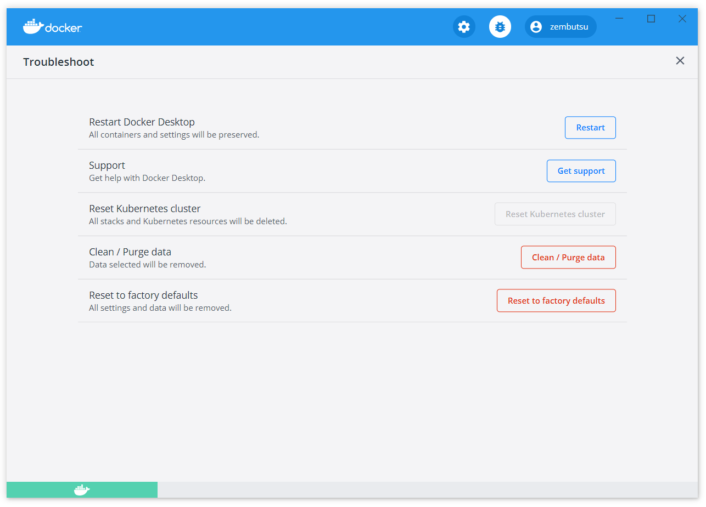
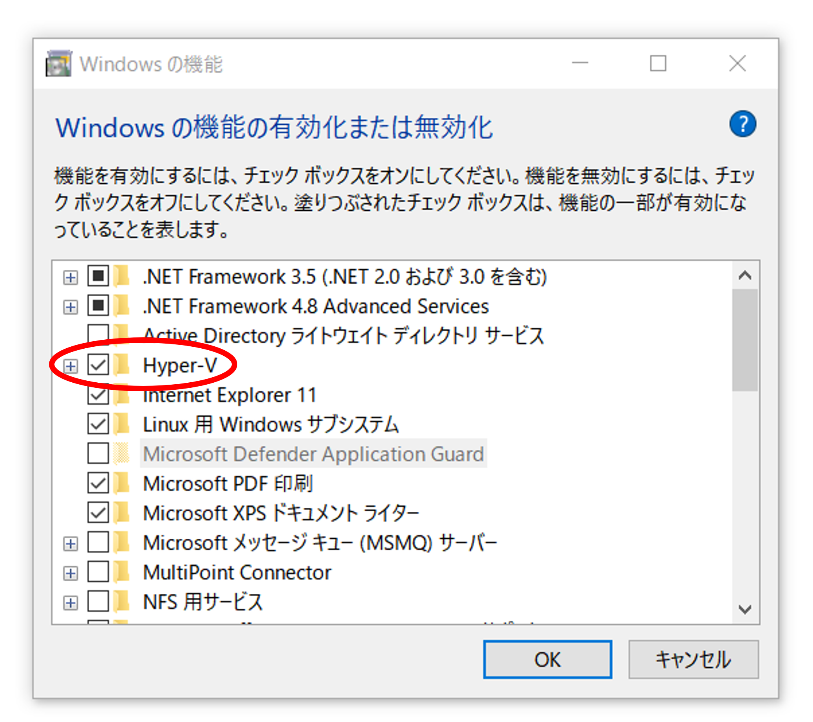

.. -*- coding: utf-8 -*-
.. URL: https://docs.docker.com/desktop/windows/troubleshoot/
   doc version: 19.03
      https://github.com/docker/docker.github.io/blob/master/docker-for-windows/troubleshoot.md
   doc version: 20.10
      https://github.com/docker/docker.github.io/blob/master/desktop/windows/troubleshoot.md
.. check date: 2022/05/14
.. Commits on Apr 20 2022 46b902e20a6248820e3ae94638b6c7895c20895e
.. -----------------------------------------------------------------------------

.. |whale| image:: ./images/whale-x.png
      :width: 50%

.. Logs and troubleshooting
.. _win-logs-and-troubleshooting:

==================================================
ログとトラブルシューティング
==================================================

.. sidebar:: 目次

   .. contents:: 
       :depth: 3
       :local:

.. Did you know that Docker Desktop offers support for developers on a paid Docker subscription (Pro, Team, or Business)? Upgrade now to benefit from Docker Support. Click here to learn more.

.. hint:

   Docker Desktop は開発者をサポートする Docker サブスクリプション（Pro、Team、Business）を提供しているのをご存じでしょうか。アップグレードによって Docker サポートのメリットを得られます。詳細は :ruby:`こちら<mac-troubleshoot-support>` をご覧ください。
   
   * `今すぐアップグレード <https://www.docker.com/pricing>`_ 

.. This page contains information on how to diagnose and troubleshoot Docker Desktop issues, request Docker Desktop support, send logs and communicate with the Docker Desktop team, use our forums and Success Center, browse and log issues on GitHub, and find workarounds for known problems.

このページに含む情報は、どのようにして原因を追及し、問題を解決し、Docker Desktop のサポート要求、ログを送信し、Docker Desktop のチームとやりとりし、フォーラムやナレッジ・ハブで使ったり、GitHub 上で問題を見たり記録したり、既知の問題に対する回避策を発見する方法です。

.. Troubleshoot
.. _docker-win-trobuleshoot:

トラブルシュート
==================================================

.. Choose whale menu > Troubleshoot from the menu bar to see the troubleshoot options.

メニューバーにある Docker のアイコン |whale| > **Troubleshoot** を選択し、トラブルシュートのオプションを表示します。

.. The Troubleshoot page contains the following options:

トラブルシュートのページには、以下のオプションを含みます。

..    Restart Docker Desktop: Select to restart Docker Desktop.

* **Restart Docker Desktop** （Docker Desktop の再起動）: 選択すると、Docker Desktop を再起動します。

.. Support: Users with a paid Docker subscription can use this option to send a support request. Other users can use this option to diagnose any issues in Docker Desktop. For more information, see Diagnose and feedback and Support.

* **Support** ：有償 Docker サブスクリプション利用者は、このオプションを使ってサポートリクエストを送信できます。他の利用者がこのオプションを使うと、Docker Desktop 上のあらゆる問題を診断します。診断に関する詳細情報は、 :ref:`win-diagnose-and-feedback` をご覧ください。

..    Reset Kubernetes cluster: Select this option to delete all stacks and Kubernetes resources. For more information, see Kubernetes.

* **Reset Kubernetes cluster** （Kubernetes クラスタのリセット）: このオプションを選択すると、全てのスタックと Kubernetes リソースを削除します。詳しい情報は :ref:`Kubernetes <win-kubernetes>` を御覧ください。

.. Clean / Purge data: This option resets all Docker data without a reset to factory defaults. Selecting this option results in the loss of existing settings.

.. Clean / Purge data: Select this option to delete container and image data. Choose whether you’d like to delete data from Hyper-V, WSL 2, or Windows Containers and then click Delete to confirm.

* **Clean / Purge data** （データ除去 / 削除）：設定などを初期値のデフォルトに戻さず、全ての Docker データをリセットします。 Hyper-V 、 WSL 2 、 Windows コンテナーから、削除したいものを選び、確認してから **Delete** をクリックします。

..    Reset to factory defaults: Choose this option to reset all options on Docker Desktop to their initial state, the same as when Docker Desktop was first installed.

* **Reset to factory defaults** （初期値のデフォルトにリセット）: このオプションを選択すると、Docker Desktop の全てのオプションを初期値にリセットし、Docker Desktop が始めてインストールされたのと同じ状態にします。

.. Diagnose and feedback
.. _win-diagnose-and-feedback:
診断とフィードバック
=======================================================

.. In-app diagnostics
.. _win-in-app-diagnostics:

アプリ内診断
--------------------------------------------------

.. If you experience issues for which you do not find solutions in this documentation, on Docker Desktop for Windows issues on GitHub, or the Docker Desktop for Windows forum, we can help you troubleshoot the log data. Before reporting an issue, we recommend that you read the information provided on this page to fix some common known issues.

発生した問題が、このページ内のドキュメントで解決できない場合は、 `GitHub の Docker Desktop <https://github.com/docker/for-mac/issues>`_ や `Docker Desktop for Mac forum <https://forums.docker.com/c/docker-for-mac>`_ で、ログデータのトラブルシュートに役立つ可能性があります。issue を報告する前に、いくつかの一般的に知られた問題を修正するため、このページが提供する情報を読むのをお勧めします。

.. Choose whale menu > Troubleshoot.

1. メニュー |whale| > **Troubleshoot** を選択します。

.. Optional: Sign into Docker Desktop. In addition, ensure you are signed into your Docker account.

2. オプション： Docker Desktop にサインイン。加えて、自分の `Docker アカウント <https://hub.docker.com/>`_ で入っているのを確認します。

.. Click Get support. This opens the in-app Support page and starts collecting the diagnostics. Diagnose & Feedback

3. **Get support** をクリック。これはアプリ内の **Support** ページを開き、診断情報の収集を開始します。

   .. image:: ./images/diagnose-support.png
      :width: 60%
      :alt: 診断とフィードバック

.. When the diagnostics collection process is complete, click Upload to get a Diagnostic ID.

4. 診断情報の収集が終われば、 **Upload to get a Diagnostic ID** をクリックします。

.. When the diagnostics have been uploaded, Docker Desktop prints a diagnostic ID. Copy this ID.

5. 診断情報のアップロードが完了すると、 Docker Desktop は Diagnostic ID（診断 ID）を表示します。この ID をコピーします。

.. If you have a paid Docker subscription, click Contact Support. This opens the Docker Desktop support form. Fill in the information required and add the ID you copied earlier to the Diagnostics ID field. Click Submit to request Docker Desktop support.

6. 有償 Docker サブスクリプションを持っている場合は、 **Contact Support** をクリック。これは `Docker Desktop サポート <https://hub.docker.com/support/desktop/>`_ フォームを開きます。必要な情報を入力し、Diagnostics ID フィールドには先ほどコピーした ID を入れます。Docker Desktop サポートをリクエストするには **Submit** をクリックします。

   ..    Note
      You must be signed in to Docker Desktop using your Pro, Team, or Business tier credentials to access the support form. For information on what’s covered as part of Docker Desktop support, see Support.

   .. note::
   
      サポートフォームにアクセスするには、Docker Desktop に Pro、Team、Business いずれかの認証賞情報でサインインしている必要があります。Docker Desktop サポートで扱う情報については、 :ref:`サポート <mac-troubleshoot-support>` をご覧ください。

.. If you don’t have a paid Docker subscription, you can click Upgrade to benefit from Docker Support to upgrade your existing account. Alternatively, click Report a Bug to open a new Docker Desktop issue on GitHub. This opens Docker Desktop for Mac on GitHub in your web browser in a ‘New issue’ template. Complete the information required and ensure you add the diagnostic ID you copied earlier. Click submit new issue to create a new issue.

7. 有償 Docker サブスクリプションが無い場合、既存のアカウントをアップグレードするために **Upgrade to benefit from Docker Support** がクリック出来ます。あるいは、 **Report a Bug** をクリックし、GitHub に新しい Docker Desktop の issue を開きます。これは、GitHub 上の Docker Desktop `for Mac <https://github.com/docker/for-mac/issues/>`_ をブラウザで開き、「New issue」テンプレートを使います。必要情報を入力し、先ほどコピーした診断 ID を追加します。新しい issue を作成するには **submit new issue** をクリックします。

.. Diagnosing from the terminal
.. _win-diagnosing-from-the-terminal:

ターミナルから診断
--------------------------------------------------

.. On occasions it is useful to run the diagnostics yourself, for instance if Docker Desktop for Windows cannot start.

例えば Docker Desktop for Windows が開始できないなど、場合によっては自分での診断実行が役立つ場合もあります。

.. First locate the com.docker.diagnose, that should be in C:\Program Files\Docker\Docker\resources\com.docker.diagnose.exe.

まず :code:`com.docker.diagnose` を探します。大抵は :code:`C:\Program Files\Docker\Docker\resources\com.docker.diagnose.exe` 
にあるでしょう。

.. To create and upload diagnostics, run:

診断の作成とアップロードをするには、次のコマンドを実行します：

.. code-block:: bash

   PS C:\> & "C:\Program Files\Docker\Docker\resources\com.docker.diagnose.exe" gather -upload

.. After the diagnostics have finished, you should have the following output, containing your diagnostics ID:

診断が終了したら、以下のように診断 ID を含む出力になります。

.. code-block:: bash

   Diagnostics Bundle: C:\Users\User\AppData\Local\Temp\CD6CF862-9CBD-4007-9C2F-5FBE0572BBC2\20180720152545.zip
   Diagnostics ID:     CD6CF862-9CBD-4007-9C2F-5FBE0572BBC2/20180720152545 (uploaded)

.. If you have a paid Docker subscription, open the Docker Desktop support form. Fill in the information required and add the ID to the Diagnostics ID field. Click Submit to request Docker Desktop support.

有償 Docker サブスクリプションを持っている場合は、 **Contact Support** をクリック。これは `Docker Desktop サポート <https://hub.docker.com/support/desktop/>`_ フォームを開きます。必要な情報を入力し、Diagnostics ID フィールドには先ほどコピーした ID を入れます。Docker Desktop サポートをリクエストするには **Submit** をクリックします。

.. Self-diagnose tool
.. _win-self-diagnose-tool:
:ruby:`自己診断ツール <self-diagnose tool>`
--------------------------------------------------

.. Docker Desktop contains a self-diagnose tool which helps you to identify some common problems. Before you run the self-diagnose tool, locate com.docker.diagnose.exe. This is usually installed in C:\Program Files\Docker\Docker\resources\com.docker.diagnose.exe.

.. Docker Desktop contains a self-diagnose tool which helps you to identify some common problems. Before you run the self-diagnose tool, locate com.docker.diagnose. If you have installed Docker Desktop in the Applications directory, then the self-diagnose tool will be located at /Applications/Docker.app/Contents/MacOS/com.docker.diagnose.

Docker Desktop には、共通する問題を確認するのに役立つ自己診断ツールが入っています。自己診断ツールを実行する前に、 ``com.docker.diagnose`` を探します。アプリケーションのディレクトリ内に Docker Desktop をインストールしている場合は、自己診断ツールの場所は ``C:\Program Files\Docker\Docker\resources\com.docker.diagnose.exe`` です。

.. To run the self-diagnose tool, run:

自己診断ツールを実行するには、次のように実行します。

.. code-block:: bash

   PS C:\> & "C:\Program Files\Docker\Docker\resources\com.docker.diagnose.exe" check

.. The tool runs a suite of checks and displays PASS or FAIL next to each check. If there are any failures, it highlights the most relevant at the end of the report.

ツールはチェックの一式を実行し、それぞれのチェックごとに **PASS** か **FAIL** を表示します。何らかのエラーがあれば、レポートの最後で最も関連する情報をハイライトで表示します。

..    Feedback
    Let us know your feedback on the self-diagnose tool by creating an issue in the for-mac GitHub repository.

.. note::

   **フィードバック**
   
   自己診断ツールのフィードバックを、 GitHub の `for-mac <https://github.com/docker/for-mac/issues>`_ リポジトリで issue を作成して教えてください。

.. Troubleshooting
.. _win-troubleshooting:
トラブルシューティング
==================================================

.. Make sure certificates are set up correctly
.. _win-make-sure-certificates-are-set-up-correctly:
証明書の正しいセットアップを確実にする
--------------------------------------------------

.. Docker Desktop ignores certificates listed under insecure registries, and does not send client certificates to them. Commands like docker run that attempt to pull from the registry produces error messages on the command line, for example:

Docker Desktop は安全ではないレジストリ（insecure registry）上にある証明書を無視します。また、そちらに対してクライアント証明書も送りません。 :code:`docker run` のようなコマンドでは、レジストリからの取得（pull）を試みても、次のようなコマンドライン上のエラーメッセージを表示します。

.. code-block:: bash

   Error response from daemon: Get http://192.168.203.139:5858/v2/: malformed HTTP response "\x15\x03\x01\x00\x02\x02"

.. As well as on the registry. For example:

レジストリ側でも同様にエラーが出ます。こちらが例です。

.. code-block:: bash

   2017/06/20 18:15:30 http: TLS handshake error from 192.168.203.139:52882: tls: client didn't provide a certificate
   2017/06/20 18:15:30 http: TLS handshake error from 192.168.203.139:52883: tls: first record does not look like a TLS handshake

.. For more about using client and server side certificates, see How do I add custom CA certificates? and How do I add client certificates? in the Getting Started topic.

クライアントとサーバ側証明書の使用に関しては、導入ガイドのトピックにある :ref:`win-add-custom-ca-certificates-server-side` と :ref:`win-add-client-certificates:` を御覧ください。

.. Volumes
.. _win-troubleshoot-volumes:
ボリューム
----------

.. Permissions errors on data directories for shared volumes
.. _permissions-errors-on-data-directories-for-shared-volumes:

共有ボリュームにおける、データ ディレクトリ上の権限（permission）エラー
^^^^^^^^^^^^^^^^^^^^^^^^^^^^^^^^^^^^^^^^^^^^^^^^^^^^^^^^^^^^^^^^^^^^^^^^^^^^^^^^

.. Docker Desktop sets permissions on shared volumes to a default value of 0777 (read, write, execute permissions for user and for group).

Docker Desktop は :ref:`共有ボリューム <win-preferences-file-sharing>` 上の権限（パーミッション）をデフォルトで :code:`0777` （ :code:`ユーザ` 及び :code:`グループ` に対して、 :code:`読み込み` ・ :code:`書き込み` ・ :code:`実行` の権限）に設定します。

.. The default permissions on shared volumes are not configurable. If you are working with applications that require permissions different from the shared volume defaults at container runtime, you need to either use non-host-mounted volumes or find a way to make the applications work with the default file permissions.

共有ボリューム上におけるデフォルトの権限は、変更できません。もしも、アプリケーションの動作上、デフォルトの共有ボリューム上でコンテナ実行時に異なる権限が必要となる場合は、ホストをマウントしないボリュームを使用するか、アプリケーション側が初期設定の権限で動作する設定を見つける必要があります。

.. See also, Can I change permissions on shared volumes for container-specific deployment requirements? in the FAQs.

また、 :ref:`can-i-change-permissions-on-shared-volumes-for-container-specific-deployment-requirements` もご覧ください。

.. Volume mounting requires shared drives for Linux containers
.. _volume-mounting-requires-shared-drives-for-linux-containers:

共有ドライブ上へのボリューム マウントが Linux コンテナに必要です
^^^^^^^^^^^^^^^^^^^^^^^^^^^^^^^^^^^^^^^^^^^^^^^^^^^^^^^^^^^^^^^^^^^^^^^^^^^^^^^^

.. If you are using mounted volumes and get runtime errors indicating an application file is not found, access is denied to a volume mount, or a service cannot start, such as when using Docker Compose, you might need to enable shared folders.

マウント ボリュームを使用中に、アプリケーション ファイルが見つからないというランタイム エラーが表示される場合は、ボリューム マウントに対するアクセスが拒否されているか、あるいは、 :doc:` Docker Compose </compose/gettingstarted>` などを使っていてサービスが開始できない場合には、  :ref:`共有フォルダ <<win-preferences-file-sharing>` の有効化が必要でしょう。

.. With the Hyper-V backend, mounting files from Windows requires shared folders for Linux containers. Click whale menu and then Settings > Shared Folders and share the folder that contains the Dockerfile and volume.

Hyper-V バックエンドで、Windows から Linux コンテナにボリュームをマウントするには、共有フォルダが必要です。Docker アイコンをクリックし、それから **Settings > Shared Folders** を選び、Dockerfile と ボリュームを置くためのフォルダを共有します。

.. Support for symlinks
.. _win-support-for-simlinks:

シンボリックリンク（symlinks）のサポート
^^^^^^^^^^^^^^^^^^^^^^^^^^^^^^^^^^^^^^^^^^^^^^^^^^

.. Symlinks work within and across containers. To learn more, see How do symlinks work on Windows? in the FAQs.

シンボリックリンクはコンテナ間および横断して機能します。詳しく学ぶには、 FAQ の :ref:`how-do-symlinks-work-on-windows` をご覧ください。

.. Avoid unexpected syntax errors, use Unix style line endings for files in containers
.. _avoid-unexpected-syntax-errors,-use-unix-style-line-endings-for-files-in-containers:

予期しない構文エラー（unexpected syntax error）を避けるため、コンテナ内でファイルの行末を unix 風にする
^^^^^^^^^^^^^^^^^^^^^^^^^^^^^^^^^^^^^^^^^^^^^^^^^^^^^^^^^^^^^^^^^^^^^^^^^^^^^^^^^^^^^^^^^^^^^^^^^^^^^^^^^

.. Any file destined to run inside a container must use Unix style \n line endings. This includes files referenced at the command line for builds and in RUN commands in Docker files.

コンテナ内で実行するあらゆるファイルは、 Unix 風の行末 :code:`\n` を使う必要があります。これをファイルに含むのは、ビルド用のコマンドラインや Dockerfile における RUN 命令で参照するからです。

.. Docker containers and docker build run in a Unix environment, so files in containers must use Unix style line endings: \n, not Windows style: \r\n. Keep this in mind when authoring files such as shell scripts using Windows tools, where the default is likely to be Windows style line endings. These commands ultimately get passed to Unix commands inside a Unix based container (for example, a shell script passed to /bin/sh). If Windows style line endings are used, docker run fails with syntax errors.

Docker コンテナと :code:`docker build` の実行は Unix 環境のため、コンテナ内のファイルは Unix 風の行末 :code:`\n` を使うのが必須です。 Window 風の :code:`\r\n` ではありません。シェルスクリプトのようなファイルを作成するときは、Windows ツールを使うとデフォルトで Windows 風の行末になるので、気に留めておいてください。各コマンドは、最終的には Unix をベースするコンテナ内の Unix コマンドに渡されます（例えば、シェルスクリプトは :code:`/bin/sh` に渡されます）。もしも Windows 風の行末が用いられると、 :code:`docker run` は構文エラーになり失敗します。

.. For an example of this issue and the resolution, see this issue on GitHub: Docker RUN fails to execute shell script.

この問題と解決方法の例は、GitHub 上の issue を御覧ください：  `Docker RUN でシェルスクリプトの実行に失敗する（英語） <https://github.com/moby/moby/issues/24388)>`_ 

.. Path conversion on Windows
.. _path-conversion-on-windows:
Windows 上でのパス変換
^^^^^^^^^^^^^^^^^^^^^^^^^^^^^^

.. On Linux, the system takes care of mounting a path to another path. For example, when you run the following command on Linux:

Linux 上では、マウントしているパスを、他のパスへと管理しています。たとえば、Linux 上で以下のコマンドを実行するとします。

.. code-block:: bash

   $ docker run --rm -ti -v /home/user/work:/work alpine

.. It adds a /work directory to the target container to mirror the specified path.

これは対象のコンテナに ``/work`` ディレクトリを追加し、指定したパスの内容をミラーします。

.. However, on Windows, you must update the source path. For example, if you are using the legacy Windows shell (cmd.exe), you can use the following command:

しかしながら、Windows 上では、元のパス（ソース パス）を変更する必要があります。たとえば、レガシーの Windows シェル（ ``cmd.exe`` ）を使っている場合、以下のコマンドが使えます。

.. code-block:: bash

   $ docker run --rm -ti -v C:\Users\user\work:/work alpine

.. This starts the container and ensures the volume becomes usable. This is possible because Docker Desktop detects the Windows-style path and provides the appropriate conversion to mount the directory.

これはコンテナを起動し、ボリュームを利用可能な状態にします。Docker Desktop は Windows 形式のパスを見つけると、ディレクトリをマウントするため、適切に変換する場合があります。

.. Docker Desktop also allows you to use Unix-style path to the appropriate format. For example:

Docker Desktop でも適切な形式で Unix 風のパスを指定できます。例：

.. code-block:: bash

   $ docker run --rm -ti -v /c/Users/user/work:/work alpine ls /work

.. Working with Git Bash
.. _working-with-git-bash:
Git Bash で動かす
^^^^^^^^^^^^^^^^^^^^^^^^^^^^^^

.. Git Bash (or MSYS) provides Unix-like environment on Windows. These tools apply their own preprocessing on the command line. For example, if you run the following command in Git Bash, it gives an error:

.. code-block:: bash

   $ docker run --rm -ti -v C:\Users\user\work:/work alpine
   docker: Error response from daemon: mkdir C:UsersUserwork: Access is denied.

.. This is because the \ character has a special meaning in Git Bash. If you are using Git Bash, you must neutralize it using \\:

エラーになるのは、 Git Bush では ``\`` 記号が特別な意味を持つためです。Bit Bash を使う場合は、無効化する ``\\`` を使う必要があります。

.. code-block:: bash

   $ docker run --rm -ti -v C:\\Users\\user\\work:/work alpine

.. Also, in scripts, the pwd command is used to avoid hardcoding file system locations. Its output is a Unix-style path.

また、スクリプト内で ``pwd`` コマンドを使う場合は、ファイルシステムの場所をハードコーディングしないように使われます。出力は Unix 風のパスです。

.. code-block:: bash

   $ pwd
   /c/Users/user/work

.. Combined with the $() syntax, the command below works on Linux, however, it fails on Git Bash.

``$()`` 構文を組み合わせる場合、 Linux では以下のコマンドは動作しますが、 Git Bash では失敗します。

.. code-block:: bash

   $ docker run --rm -ti -v $(pwd):/work alpine
   docker: Error response from daemon: OCI runtime create failed: invalid mount {Destination:\Program Files\Git\work Type:bind Source:/run/desktop/mnt/host/c/Users/user/work;C Options:[rbind rprivate]}: mount destination \Program Files\Git\work not absolute: unknown.

.. You can work around this issue by using an extra /

この問題に対応するには、追加の ``/`` を使います。

.. code-block:: bash

   $ docker run --rm -ti -v /$(pwd):/work alpine

.. Portability of the scripts is not affected as Linux treats multiple / as a single entry. Each occurence of paths on a single line must be neutralized.

Linux は複数の ``/`` を１つの入力として扱うため、スクリプトの互換性には影響ありません。１行でパスを扱う場合は、無効化する必要があります。

.. code-block:: bash

   $ docker run --rm -ti -v /$(pwd):/work alpine ls /work
   ls: C:/Program Files/Git/work: No such file or directory

.. In this example, The $(pwd) is not converted because of the preceding ‘/’. However, the second ‘/work’ is transformed by the POSIX layer before passing it to Docker Desktop. You can also work around this issue by using an extra /.

この例では、 ``/`` が先にあるため、  ``$(pwd)`` は変換されません。ですが、２つめの ``/work`` は Docker Desktop で処理する前に、 POSIX レイヤーによって変換されます。これを正しく動作するには、 ``/`` を追加します。

.. code-block:: bash

   $ docker run --rm -ti -v /$(pwd):/work alpine ls //work

.. To verify whether the errors are generated from your script, or from another source, you can use an environment variable. For example:

スクリプトや他のソースでエラーが発生する場合、どこか原因かを確認するには、環境変数が使えます。例：

.. code-block:: bash

   $ MSYS_NO_PATHCONV=1 docker run --rm -ti -v $(pwd):/work alpine ls /work

.. It only expects the environment variable here. The value doesn’t matter.

ここでは、環境変数そのものを想定しています。（環境変数の）値は関係ありません。

.. In some cases, MSYS also transforms colons to semicolon. Similar conversions can also occur when using ~ because the POSIX layer translates it to a DOS path. MSYS_NO_PATHCONV also works in this case.

場合によっては、 MSYS もコロンをセミコロンに変換します。 ``~`` を使う時、 POSIX レイヤーが DOS のパスに変更する時に発生する状況と似ています。この場合、 ``MSYS_NO_PATHCONV`` も動作します。

.. Virtualization
.. _win-troubleshoot-virtualization:
仮想化
--------------------

.. Your machine must have the following features for Docker Desktop to function correctly:

Docker Desktop を正しく機能するには、マシンには以下の機能が必要です。

.. WSL 2 and Windows Home
.. _wsl-2-and-windows-home:
WSL 2 と Windows Home
^^^^^^^^^^^^^^^^^^^^^^^^^^^^^^

..   Virtual Machine Platform
    Windows Subsystem for Linux
    Virtualization enabled in the BIOS
    Hypervisor enabled at Windows startup

1. 仮想マシン プラットフォーム
2. `Linux 用 Windows サブシステム (WSL) <https://docs.microsoft.com/ja-jp/windows/wsl/install>`_ 
3. `BIOS で仮想化を有効 <https://bce.berkeley.edu/enabling-virtualization-in-your-pc-bios.html>`_
4. Windows 起動時にハイパーバイザーを有効化

.. Hyper-V
.. _win-troubleshoot-hyper-v:

Hyper-V
^^^^^^^^^^^^^^^^^^^^^^^^^^^^^^^^^^^^^^^^^^^^^^^^^^

.. On Windows 10 Pro or Enterprise, you can also use Hyper-V with the following features enabled:

Windows 10 Pro や Enterprise では、以下の機能を有効にして Hyper-V も使えます。

..    Hyper-V installed and working
    Virtualization enabled in the BIOS

1. `Hyper-V <https://docs.microsoft.com/ja-jp/windows-server/virtualization/hyper-v/hyper-v-technology-overview>`_ をインストールして、動作させる
2. `BIOS で仮想化の有効化 <https://bce.berkeley.edu/enabling-virtualization-in-your-pc-bios.html>`_ 
3. Windows 起動時にハイパーバイザーを有効化

.. Docker Desktop requires Hyper-V as well as the Hyper-V Module for Windows Powershell to be installed and enabled. The Docker Desktop installer enables it for you.

Docker Desktop をインストールして有効化するには、 Hyper-V と同様に Windows Powershell 用 Hyper-V モジュールも必要です。Docker Desktop インストーラは、これらを有効化します。

.. Docker Desktop also needs two CPU hardware features to use Hyper-V: Virtualization and Second Level Address Translation (SLAT), which is also called Rapid Virtualization Indexing (RVI). On some systems, Virtualization must be enabled in the BIOS. The steps required are vendor-specific, but typically the BIOS option is called Virtualization Technology (VTx) or something similar. Run the command systeminfo to check all required Hyper-V features. See Pre-requisites for Hyper-V on Windows 10 for more details.

また、Docker Desktop は Hyper-V を使うために2つの CPU 機能を使います。すなわち、仮想化と  Rapid Virtualization Indexing (RVI) とも呼ばれる Second Level Address Translation (SLAT) です。同じシステムの BIOS 上で、Virtualization （仮想化）の有効化が必須です。必要な手順はベンダによって異なりますが、典型的な BIOS オプションは :code:`Virtualization Technology (VTx)` と呼ばれるものか、似たようなものです。Hyper-V 機能が必要とする全てを確認するには、 :code:`systeminfo` コマンドを実行します。詳細は `Windows 10 Hyper-V のシステム要件 <https://docs.microsoft.com/ja-jp/virtualization/hyper-v-on-windows/reference/hyper-v-requirements>`_ を御覧ください。

.. To install Hyper-V manually, see Install Hyper-V on Windows 10. A reboot is required after installation. If you install Hyper-V without rebooting, Docker Desktop does not work correctly.

Hyper-V を手動でインストールするには、 `Windows 10 上に Hyper-V をインストールする <https://msdn.microsoft.com/en-us/virtualization/hyperv_on_windows/quick_start/walkthrough_install>`_ を御覧ください。インストール後は再起動が必要です。Hyper-V をインストールしても再起動をしないと、 Docker Desktop は正しく動作しません。

.. From the start menu, type Turn Windows features on or off and press enter. In the subsequent screen, verify that Hyper-V is enabled:

スタートメニューから、 **Windows 機能の有効化又は無効化** を入力し、エンターを押します。以下の画面のようになっていると、Hyper-V は有効です。

.. Virtualization must be enabled
.. _virtualization-must-be-enabled:

仮想化を必ず有効化
^^^^^^^^^^^^^^^^^^^^^^^^^^^^^^^^^^^^^^^^^^^^^^^^^^

.. In addition to Hyper-V or WSL 2, virtualization must be enabled. Check the Performance tab on the Task Manager:

:ref:`Hyper-V <win-troubleshoot-hyper-v>` や :doc:`WSL 2 <wsl>` を追加するには、仮想化の有効化が必要です。タスクマネージャー上のパフォーマンス タブをクリックします。

.. image:: ./images/virtualization-enabled.png
   :width: 60%
   :alt: タスクマネージャー

.. If you manually uninstall Hyper-V, WSL 2 or disable virtualization, Docker Desktop cannot start. See Unable to run Docker for Windows on Windows 10 Enterprise.

もしも Hyper-V を手動でアンインストールするか、仮想化を無効にしたら、Docker Desktop は起動できません。 [Windows 10 Enterprise では Docker for Windows を実行できません（英語）](https://github.com/docker/for-win/issues/74) を御覧ください。

.. Hypervisor enabled at Windows startup
.. _hypervisor-enabled-at-windows-startup:
Windows のスタートアップでハイパーバイザを有効化
^^^^^^^^^^^^^^^^^^^^^^^^^^^^^^^^^^^^^^^^^^^^^^^^^^

.. If you have completed the steps described above and are still experiencing Docker Desktop startup issues, this could be because the Hypervisor is installed, but not launched during Windows startup. Some tools (such as older versions of Virtual Box) and video game installers disable hypervisor on boot. To reenable it:

前述の手順を全て実施しても Docker Desktop の起動に問題が出ている場合は、ハイパーバイザーはインストールされているものの、Windows のスタートアップ（起動処理）中に起動できていない可能性があります。同様のツール（Virtual Box の古いバージョン）やビデオゲームのインストーラが、起動時にハイパーバイザーを無効化します。再度、有効化するには、次の手順をします。

..  Open an administrative console prompt.
    Run bcdedit /set hypervisorlaunchtype auto.
    Restart Windows.

1. 管理者としてコマンドプロンプトを開く。
2. ``bcdedit /set hypervisorlaunchtype auto`` を実行
3. Windows 再起動

.. You can also refer to the Microsoft TechNet article on Code flow guard (CFG) settings.

また、 `Microsoft TechNet の記事 <https://social.technet.microsoft.com/Forums/en-US/ee5b1d6b-09e2-49f3-a52c-820aafc316f9/hyperv-doesnt-work-after-upgrade-to-windows-10-1809?forum=win10itprovirt>`_ にある Code flow guard (CFG) 設定もご覧ください。

.. Windows containers and Windows Server
.. _windows-containers-and-windows-server:

Windows コンテナーと Windows Server
--------------------------------------------------

.. Docker Desktop is not supported on Windows Server. If you have questions about how to run Windows containers on Windows 10, see Switch between Windows and Linux containers.

Windows Server 上での Docker Desktop はサポート外です。Windows 10 上で Windows コンテナの実行に関する疑問があれば、 :ref:`switch-between-windows-and-linux-containers` を御覧ください。

.. A full tutorial is available in docker/labs on Getting Started with Windows Containers.

`docker/labs  <https://github.com/docker/labs>`_ の `Getting Started with Windows Container <https://github.com/docker/labs/blob/master/windows/windows-containers/README.md>`_ に全てのチュートリアルがあります。
.. 
.. You can install a native Windows binary which allows you to develop and run Windows containers without Docker Desktop. However, if you install Docker this way, you cannot develop or run Linux containers. If you try to run a Linux container on the native Docker daemon, an error occurs:

ネイティブな Windows バイナリをインストールしたら、Windows Desktop がなくても Windows コンテナの開発と実行が可能です。しかし、この方法で Docker をインストールしたら、Linux コンテナの開発と実行ができません。もしもネイティブな Docker デーモンで Linux コンテナの実行を試みても、次のようなエラーが発生します。

.. code-block:: bash

   C:\Program Files\Docker\docker.exe:
    image operating system "linux" cannot be used on this platform.
    See 'C:\Program Files\Docker\docker.exe run --help'.

.. Running Docker Desktop in nested virtualization scenarios
.. _running-docker-desktop-in-nested-virtualization-scenarios-win:
ネストした仮想化環境で Docker Desktop を実行
--------------------------------------------------

.. Docker Desktop can run inside a Windows 10 VM running on apps like Parallels or VMware Fusion on a Mac provided that the VM is properly configured. However, problems and intermittent failures may still occur due to the way these apps virtualize the hardware. For these reasons, Docker Desktop is not supported in nested virtualization scenarios. It might work in some cases, and not in others.

Paralles や VMware Fusion a Mac 上で動く Windows 10 仮想マシン内で、適切な設定をすると Docker Desktop を実行可能です。しかしながら、ハードウェア仮想化アプリの手法によって、問題や一時的な問題が発生する可能性があります。そのため、 **Docker Desktop はネストした仮想化環境での実行をサポートしません** 。動く場合もあれば、動かない場合もあります。

.. For best results, we recommend you run Docker Desktop natively on a Windows system (to work with Windows or Linux containers), or on Mac to work with Linux containers.

最良の結果を出すには、Windows システム上で Docker Desktop をネイティブに実行するのを推奨します（Windows コンテナも Linux コンテナも動作します）。また Mac では Linux コンテナのみ動作します。

.. If you still want to use nested virtualization
.. _if-you-still-want-to-use-nested-virtualization:
それでもネスト化した仮想化環境を使いたい場合には
^^^^^^^^^^^^^^^^^^^^^^^^^^^^^^^^^^^^^^^^^^^^^^^^^^

..    Make sure nested virtualization support is enabled in VMWare or Parallels. Check the settings in Hardware > CPU & Memory > Advanced Options > Enable nested virtualization (the exact menu sequence might vary slightly).
    Configure your VM with at least 2 CPUs and sufficient memory to run your workloads.
    Make sure your system is more or less idle.
    Make sure your Windows OS is up-to-date. There have been several issues with some insider builds.
    The processor you have may also be relevant. For example, Westmere based Mac Pros have some additional hardware virtualization features over Nehalem based Mac Pros and so do newer generations of Intel processors.

* VMware や Paralles でネスト化した仮想化サポートが有効になっているかどうかを確認します。設定の **Hardware > CPU & Memory > Advanced Options > Enable nested virtualization** を確認します（展開するメニュー順番は、若干変わるかもしれません）。
* 仮想マシンが最小 2 CPU と、ワークロードを実行するための十分なメモリを使うように設定します。
* システムは多少のアイドル（余裕）があるようにします。
* Windows OS を最新版へ確実に更新します。insider ビルドによっては、複数の問題があります。
* 適切なプロセッサも必要です。例えば、Westmere ベースの Mac Pro は、Nehalem ベースの Mac Pro よりもハードウェア仮想化機能が追加されていますし、更に新しい世代のインテル プロセッサもそうでしょう。

.. Typical failures we see with nested virtualization
.. _typical-failures-we-see-with-nested-virtualization:
ネスト化した仮想化環境で起こる典型的な問題
^^^^^^^^^^^^^^^^^^^^^^^^^^^^^^^^^^^^^^^^^^^^^^^^^^

..    Slow boot time of the Linux VM. If you look in the logs and find some entries prefixed with Moby. On real hardware, it takes 5-10 seconds to boot the Linux VM; roughly the time between the Connected log entry and the * Starting Docker ... [ ok ] log entry. If you boot the Linux VM inside a Windows VM, this may take considerably longer. We have a timeout of 60s or so. If the VM hasn’t started by that time, we retry. If the retry fails we print an error. You can sometimes work around this by providing more resources to the Windows VM.

* Linux 仮想マシンのブート時に確認します。ログを見て、 :code:`Moby` を先頭に含む行がないかどうか調べます。実在のハードウェアでは、Linux 仮想マシンのブートにかかる時間は 5 ～ 10 秒です。つまり、おおよその時間は、 :code:`Connected`  のログ記録から :code:`* Starting Docker ... [OK]` ログ記録までです。もしも Windows 仮想マシン内で Linux 仮想マシンをブートするのであれば、この処理にかかる時間はより長くなります。タイムアウトは 60 秒以上です。もし VM が時間までに起動しなければ、リトライします。リトライに失敗したら、エラーを表示します。Windows 仮想マシンに対し、更にリソースを提供することで回避可能な場合があります。

..    Sometimes the VM fails to boot when Linux tries to calibrate the time stamp counter (TSC). This process is quite timing sensitive and may fail when executed inside a VM which itself runs inside a VM. CPU utilization is also likely to be higher.

* ブート時、タイムスタンプ・カウンタ（TSC）の補正を Linux が行うとき、仮想マシンが落ちる場合があります。この処理はタイミングがセンシティブなため、仮想マシン内で仮想マシンを実行する場合に落ちるかもしれません。また、 CPU 使用率も高くなります。

..    Ensure “PMU Virtualization” is turned off in Parallels on Macs. Check the settings in Hardware > CPU & Memory > Advanced Settings > PMU Virtualization.

* Paralles on Mac では "PMU Virtualizatoin" が無効かどうかを確認します。 設定の **Hardware > CPU & Memory > Advanced Settings > PMU Virtualization** を確認します。

.. Networking issues
.. _win-networking-issues:
ネットワーク機能の問題
------------------------------

.. IPv6 is not (yet) supported on Docker Desktop.

Docker Desktop は（まだ） IPv6 をサポートしていません。

.. Workarounds
.. _win-workarounds:
回避策（ワークアラウンド）
==============================

.. Reboot
.. _win-reboot:
再起動
--------------------------------------------------

.. Restart your PC to stop / discard any vestige of the daemon running from the previously installed version.

PC を再起動し、以前にインストールしたバージョンで動いているデーモンの残骸を、停止・削除します。

.. Unset DOCKER_HOST
.. _win-unset-docker-host:
:code:`DOCKER_HOST` のリセット（unset）
--------------------------------------------------

.. The DOCKER_HOST environmental variable does not need to be set. If you use bash, use the command unset ${!DOCKER_*} to unset it. For other shells, consult the shell’s documentation.

:code:`DOCKER_HOST` 環境変数の設定は不要です。 bash を使用する場合は、リセットのために :code:`unset ${!DOCKER_*}` コマンドを使います。他のシェルの場合は、シェルのドキュメントをご確認ください。

.. Make sure Docker is running for webserver examples
.. _win-make-sure-docker-is-running-for-webserver-examples:
ウェブサーバの例で Docker が動作しているのを確認
--------------------------------------------------

.. For the hello-world-nginx example and others, Docker Desktop must be running to get to the webserver on http://localhost/. Make sure that the Docker whale is showing in the menu bar, and that you run the Docker commands in a shell that is connected to the Docker Desktop Engine (not Engine from Toolbox). Otherwise, you might start the webserver container but get a “web page not available” error when you go to docker.

``hello-world-nginx`` サンプルなどを使い、 Docker Desktop で ``https://localhost`` 上にウェブサーバを起動します。メニューバー上に Docker 鯨（のアイコン）があるのを確認し、シェル上の Docker コマンドが Docker Desktop エンジンに接続しているのを確認します（Toolbox のエンジンではありません）。そうしなければ、ウェブサーバ・コンテナは実行できるかもしれませんが、 ``docker`` は "web page not available"（ウェブページが表示できません）というエラーを返すでしょう。

.. How to solve port already allocated errors
.. _win-how-to-solve-port-already-allocated-errors:
``port already allocated`` （ポートが既に割り当てられています） エラーを解決するには
--------------------------------------------------------------------------------------

.. If you see errors like Bind for 0.0.0.0:8080 failed: port is already allocated or listen tcp:0.0.0.0:8080: bind: address is already in use ...

``Bind for 0.0.0.0:8080 failed: port is already allocated`` や ``listen tcp:0.0.0.0:8080: bind: address is already in use`` ... のようなエラーが出ることがあるでしょう。

.. These errors are often caused by some other software on Windows using those ports. To discover the identity of this software, either use the resmon.exe GUI and click “Network” and then “Listening Ports” or in a Powershell use netstat -aon | find /i "listening " to discover the PID of the process currently using the port (the PID is the number in the rightmost column). Decide whether to shut the other process down, or to use a different port in your docker app.

これらのエラーは、Windows 上の他のソフトウェアが各ポートを使っている場合によく発生します。どのソフトウェアが使っているかを見つけるか、 ``resmon.exe`` の GUI を使い "Network" と "listening Ports"  をクリックするか、 Powershell 上では ``netstat -aon | find /i "listening "`` を使って、対象ポートを現在使っているプロセスの PID を見つけます（PID の値は行の右端です）。他のプロセスの停止を決めるか、あるいは、docker アプリで別のポートを使うかを決めます。

.. Docker Desktop fails to start when anti-virus software is installed
.. _win-docker-desktop-fails-to-start-when-anti-virus-software-is-installed:
アンチウィルス ソフトウェアをインストールしていると、Docker Desktop の起動に失敗
-------------------------------------------------------------------------------------

.. Some anti-virus software may be incompatible with Hyper-V and Microsoft Windows 10 builds. The conflict typically occurs after a Windows update and manifests as an error response from the Docker daemon and a Docker Desktop start failure.

いくつかのアンチウィルス ソフトウェアは、Hyper-V と Microsoft Windows 10 ビルドによっては互換性がない場合があります。典型的に発生するのは Windows update 直後で、Docker デーモンからエラーの反応が表示され、Docker Desktop の起動に失敗します。

.. For a temporary workaround, uninstall the anti-virus software, or explore other workarounds suggested on Docker Desktop forums.

一時的な回避策としては、アンチウィルス ソフトウェアをアンインストールするか、Docker Desktop フォーラム上での他の回避策をお探しください。

.. Support
.. _mac-support:
サポート
==========

.. This section contains instructions on how to get support, and covers the scope of Docker Desktop support.

このセクションでは、サポートを得る手順と、 Docker Desktop のサポート範囲を扱います。

.. This feature requires a paid Docker subscription
.. Docker Desktop offers support for developers subscribed to a Pro, Team, or a Business tier. Upgrade now to benefit from Docker Support.

.. note::

   **この機能は有償 Docker サブスクリプションが必要です**
   
   Docker Desktop は Pro、Team、Business を契約している開発者向けにサポートを提供します。Docker サポートの利点を得るには、いますぐアップグレードしましょう。
   
   `いますぐアップグレード <https://www.docker.com/pricing>`_ 

.. How do I get Docker Desktop support?
.. _mac-how-do-i-get-docker-desktop-support:
Docker Desktop のサポートを得るには
----------------------------------------

.. If you have a paid Docker subscription, please raise a ticket through Docker Desktop support.

有償 Docker サブスクリプションがあれば、 `Docker Desktop support <https://hub.docker.com/support/desktop/>`_ を通してチケットを上げてください。

.. Docker Community users can get support through our Github repos for-win and for-mac, where we respond on a best-effort basis.

Docker Community 利用者は、 Github リポジトリ for-win と for-mac を通してサポートを得られますが、対応は基本的にベストエフォートです。

.. What support can I get?
.. _mac-what-support-can-i-get:
何のサポートを得られるのか
----------------------------------------

.. If you have a paid Docker subscription, you can request for support on the following types of issues:

有償 Docker サブスクリプションを持っていれば、以下の種類の問題に対するサポートを要求できます。

..  Desktop upgrade issues
    Desktop installation issues
        Installation crashes
        Failure to launch Docker Desktop on first run
    Usage issues
        Crash closing software
        Docker Desktop not behaving as expected
    Configuration issues
    Basic product ‘how to’ questions

* Desktop アップグレードの問題
* Desktop インストールの問題

  * インストールのクラッシュ
  * Docker Desktop 初回実行時のエラー

* 利用に関係する問題

  * クラッシュによってソフトウェアが閉じる
  * Docker Desktop が期待通りの挙動をしない

* 設定に関する問題
* 基本的なプロダクトの「使い方」の質問

.. What is not supported?
.. _mac-what-is-not-supported:
何がサポートされないか
------------------------------

.. Docker Desktop excludes support for the following types of issues:

Docker Desktop のサポートから、以下の種類の問題は対象外です。

..  Use on or in conjunction with hardware or software other than that specified in the applicable documentation
    Running on unsupported operating systems, including beta/preview versions of operating systems
    Running containers of a different architecture using emulation
    Support for the Docker engine, Docker CLI, or other bundled Linux components
    Support for Kubernetes
    Features labeled as experimental
    System/Server administration activities
    Supporting Desktop as a production runtime
    Scale deployment/multi-machine installation of Desktop
    Routine product maintenance (data backup, cleaning disk space and configuring log rotation)
    Third-party applications not provided by Docker
    Altered or modified Docker software
    Defects in the Docker software due to hardware malfunction, abuse, or improper use
    Any version of the Docker software other than the latest version
    Reimbursing and expenses spent for third-party services not provided by Docker
    Docker Support excludes training, customization, and integration

* ドキュメントで対象としていないハードウェアやソフトウェアに関連する使い方
* サポートしていないオペレーティングシステム上での実行で、オペレーティングシステムのベータもしくはプレビューバージョンも含む
* エミュレーションを使用し、異なるアーキテクチャのコンテナを実行
* Docker Engine、 Docker CLI 、あるいは他に同梱されている Linux コンポーネントに対するサポート
* Kubernetes サポート
* 実験的と表記されている機能
* システムやサーバ管理の取り組み
* 本番環境での Desktop 実行に関するサポート
* Desktop をスケールするデプロイや複数マシンへのインストール
* 定期的なプロダクトのメンテナンス（データバックアップ、ディスク容量をあけたり、ログローテーションの設定）
* Docker によって知恵教されていないサードパーティ製アプリケーション
* Docker ソフトウェアの改変や編集
* ハードウェア故障、不正利用、不適切な利用による Docker ソフトウェアの不具合
* 最新バージョンではない、あらゆる古いバージョンの Docker ソフトウェア
* Docker が提供していないサードパーティ製サービスに対する補償や費用請求
* Docker サポートから、トレーニング、カスタマイズ、インテグレーションは除外

.. What versions are supported?
.. _mac-what-versions-are-supported:
どのバージョンがサポート対象ですか？
----------------------------------------

.. We currently only offer support for the latest version of Docker Desktop. If you are running an older version, you may be asked to upgrade before we investigate your support request.

現在サポートを提供しているのは、 Docker Desktop の最新バージョンのみです。古いバージョンを実行している場合は、私たちに調査のサポートリクエストを送る前に、最新バージョンへのアップグレードを確認ください。

.. How many machines can I get support for Docker Desktop on?
Docker Desktop のサポートを何台まで受けられますか？
------------------------------------------------------------

.. As a Pro user you can get support for Docker Desktop on a single machine. As a Team, you can get support for Docker Desktop for the number of machines equal to the number of seats as part of your plan.

Pro の利用者であれば、1台のマシン上の Docker Desktop にサポートを得られます。Team であれば、プランの一部として、契約数と同等の数の Docker Desktop のサポートが得られます。

.. What OS’s are supported?
.. _mac-what-oss-are-supported:
どの OS がサポートされますか？
----------------------------------------

.. Docker Desktop is available for Mac and Windows. The supported version information can be found on the following pages:

Docker Desktop は Mac と Windows 上で利用できます。サポート対象のバージョン情報は、以下のページで確認できます。

..  Mac system requirements
    Windows system requirements

* :ref:`Mac システム動作条件 <mac-system-requirements>` 
* :ref:`Windows システム動作条件 <win-system-requirements>` 

.. Can I run Docker Desktop on Virtualized hardware?
.. _mac-can-i-run-docker-desktop-on-virtualized-hardware:
仮想化ハードウェア上で Docker Desktop は実行できますか？
----------------------------------------------------------------------

.. No, currently this is unsupported and against the terms of use.

いいえ、現時点ではサポート外で、利用規約は適用されません。

.. seealso:: 

   Logs and troubleshooting
      https://docs.docker.com/desktop/windows/troubleshoot/Logs and troubleshooting
