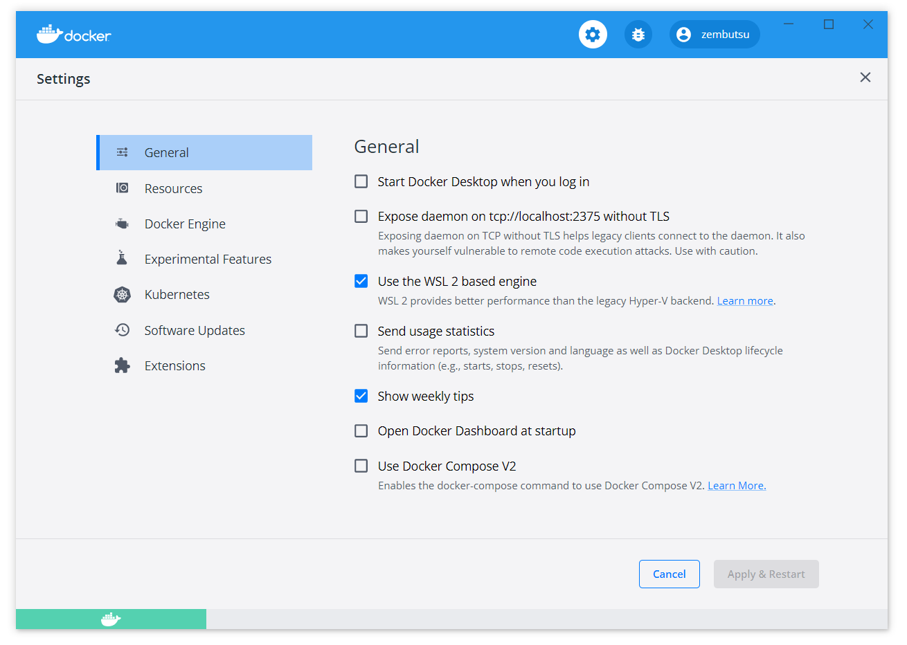

.. -*- coding: utf-8 -*-
.. URL: https://docs.docker.com/desktop/windows/wsl/
   doc version: 19.03
      https://github.com/docker/docker.github.io/blob/master/docker-for-windows/wsl.md
   doc version: 20.10
      https://github.com/docker/docker.github.io/blob/master/desktop/windows/wsl.md
.. check date: 2022/05/14
.. Commits on May 12, 2022 9afb3bc05b928d40d73441d2aa4b800222c17b78
.. -----------------------------------------------------------------------------

.. Docker Desktop WSL 2 backend
.. _docker-desktop-wsl-2-backend:

=======================================
Docker Desktop WSL 2 バックエンド
=======================================

.. 
    Update to the Docker Desktop terms
    Commercial use of Docker Desktop in larger enterprises (more than 250 employees OR more than $10 million USD in annual revenue) now requires a paid subscription. The grace period for those that will require a paid subscription ends on January 31, 2022. Learn more.

.. important:: **Docker Desktop の利用条件変更**

   現在、大企業（従業員が 251 人以上、または、年間収入が 1,000 万米ドル以上 ）における Docker Desktop の商用利用には、有料サブスクリプション契約が必要です。必要な有料サブスクリプションの支払猶予は 2022 年 1 月 31 日に終了しました。 `詳細はこちらです。 <https://www.docker.com/blog/the-grace-period-for-the-docker-subscription-service-agreement-ends-soon-heres-what-you-need-to-know/>`_

.. sidebar:: 目次

   .. contents::
       :depth: 3
       :local:

.. Windows Subsystem for Linux (WSL) 2 introduces a significant architectural change as it is a full Linux kernel built by Microsoft, allowing Linux containers to run natively without emulation. With Docker Desktop running on WSL 2, users can leverage Linux workspaces and avoid having to maintain both Linux and Windows build scripts. In addition, WSL 2 provides improvements to file system sharing, boot time, and allows access to some cool new features for Docker Desktop users.

新しい Docker Desktop  WSL 2 バックエンドは、Docker Desktop  WSL 2 Tech Preview の後を継ぐものです。WSL2 バックエンド・アーキテクチャは Kubernetes 向けのサポートを導入し、更新版 Docker デーモンの提供、VPN と親和性のあるネットワーク機能や追加機能を提供します。WSL 2 は構造上の著しい変更をもたらします。Microsoft によってビルドされた完全な Linux カーネルによって、エミュレーションではなく、ネイティブに Linux コンテナを実行可能になります。WSL 2 上で Docker Desktop を実行しますと、利用者は Linux ワークスペースを活用できるようになり、また、ビルド用スクリプトは Windows 用と Linux 用との両方を準備する必要がなくなります。

.. Docker Desktop uses the dynamic memory allocation feature in WSL 2 to greatly improve the resource consumption. This means, Docker Desktop only uses the required amount of CPU and memory resources it needs, while enabling CPU and memory-intensive tasks such as building a container to run much faster.

また、Docker Desktop は WSL 2 で導入された動的メモリ割り当て機能も活用できるため、リソースの消費を著しく改善します。つまり、Docker Desktop は、コンテナのビルドのような CPU とメモリを大量に必要とするタスクでも、 CPU とメモリを必要量しか使わないため、より速く実行できます。

.. Additionally, with WSL 2, the time required to start a Docker daemon after a cold start is significantly faster. It takes less than 10 seconds to start the Docker daemon when compared to almost a minute in the previous version of Docker Desktop.

さらに、WSL 2 はDocker デーモンのコールド・スタート後は、起動に必要な時間が著しく早くなります。Docker デーモンの起動に、現在の Docker Desktop のバージョンでは数十秒かかるのと比べ、2秒以下です。

.. Prerequisites
.. _wsl-rerequisites:

動作条件
==============================

.. Before you install the Docker Desktop WSL 2 backend, you must complete the following steps:

Docker Desktop  WSL 2 バックエンドをインストールする前に、以下の手順を完了している必要があります。

..  Install Windows 10, version 1903 or higher or Windows 11.
    Enable WSL 2 feature on Windows. For detailed instructions, refer to the Microsoft documentation.
    Download and install the Linux kernel update package.

1. Windows 10, version 1903 以上、または Windows 11 をインストール。
2. Windows 上での WSL2 機能の有効化。詳細手順は `マイクロソフトのドキュメント <https://docs.microsoft.com/ja-jp/windows/wsl/install>`_ を参照ください。
3. `Linux カーネル更新パッケージ <https://docs.microsoft.com/ja-jp/windows/wsl/install-manual#step-4---download-the-linux-kernel-update-package>`_ のダウンロードとインストール

.. Best practices
.. _wsl-best-practices:
ベストプラクティス
====================

..  To get the best out of the file system performance when bind-mounting files, we recommend storing source code and other data that is bind-mounted into Linux containers (i.e., with docker run -v <host-path>:<container-path>) in the Linux file system, rather than the Windows file system. You can also refer to the recommendation from Microsoft.
        Linux containers only receive file change events (“inotify events”) if the original files are stored in the Linux filesystem. For example, some web development workflows rely on inotify events for automatic reloading when files have changed.
        Performance is much higher when files are bind-mounted from the Linux filesystem, rather than remoted from the Windows host. Therefore avoid docker run -v /mnt/c/users:/users (where /mnt/c is mounted from Windows).
        Instead, from a Linux shell use a command like docker run -v ~/my-project:/sources <my-image> where ~ is expanded by the Linux shell to $HOME.
    If you have concerns about the size of the docker-desktop-data VHDX, or need to change it, take a look at the WSL tooling built into Windows.
    If you have concerns about CPU or memory usage, you can configure limits on the memory, CPU, Swap size allocated to the WSL 2 utility VM.
    To avoid any potential conflicts with using WSL 2 on Docker Desktop, you must uninstall any previous versions of Docker Engine and CLI installed directly through Linux distributions before installing Docker Desktop.

* ファイルのバインド マウント時、ファイルシステムの性能を最大限に活用するには、ソースコードや他のデータの保管を、Windows ファイルシステム上ではなく、Linux コンテナ内（例： ``docker run -v <host-path>:<container-path>`` を指定）のファイルシステム内にバインド マウントするのを推奨します。また、 Microsoft による `推奨 <https://docs.microsoft.com/ja-jp/windows/wsl/compare-versions>`_ もご覧ください。

  * Linux コンテナが受け取るファイル変更のイベント（ "inotify event" ）とは、Linux ファイルシステム内に保管されているオリジナルのファイルに関係するものです。たとえば、いくつかのウェブ開発ワークフローでは、ファイル変更時の自動再読み込みが、 inotify イベントに依存しています。
  * リモートの Windows ホスト上よりも、Linux ファイルシステムにファイルをバインド マウントする方が、性能がより高くなります。従って、 ``docker run -v /mnt/c/users:/users`` を避けるべきです（ ``/mnt/c`` は Windows によってマウントされる場所です）。

* docker-desktop-data VHDX の容量に関する懸念や、これを変更したい場合は、 `WSL 2 仮想ハードディスクのサイズを拡張する <https://docs.microsoft.com/ja-jp/windows/wsl/vhd-size>`_ をご覧ください。
* CPU やメモリ使用量に懸念がある場合は、メモリ、CPU 、スワップ容量に制限を設けられます。割り当ては `WSL 2 ユーティリティ仮想マシン <https://docs.microsoft.com/ja-jp/windows/wsl/wsl-config#global-configuration-options-with-wslconfig>`_ で行えます。
* Docker Desktop 上で WSL 2 の使用による潜在的な競合を避けるには、Docker Desktop をインストールする前に、Linux ディストリビューションによってインストールされた :doc:`あらゆる古いバージョンの Docker Engine のアンインストール <ubuntu-uninstall-docker-engine>` と CLI のアンインストールが必要です。

.. Download
.. _wsl-download:

ダウンロード
==============================

.. Download Docker Desktop Stable 2.3.0.2 or a later release.

`Docker Desktop stable 2.3.0.2 <https://desktop.docker.com/win/main/amd64/Docker%20Desktop%20Installer.exe>`_ 以上のリリースをダウンロードします。

.. Install
.. _wls-install:

インストール
==============================

.. Ensure you have completed the steps described in the Prerequisites section before installing the Docker Desktop Stable 2.3.0.2 release.

Docker Desktop Stable 2.3.0.2 リリースをインストールする **前に** 、動作条件のセクションで説明した、 :ref:`事前の手順 <wsl-rerequisites>` を必ず終えてください。

..    Follow the usual installation instructions to install Docker Desktop. If you are running a supported system, Docker Desktop prompts you to enable WSL 2 during installation. Read the information displayed on the screen and enable WSL 2 to continue.

1. 通常の Docker Desktop のインストール手順に従い、インストールを行います。もしサポートしているシステムであれば、 Docker Desktop のインストール中に、 WSL 2 を有効化するかどうか訊ねる画面が出ます。続けるには、画面に表示される文字を読み、WSL 2 を有効化します。

..    Start Docker Desktop from the Windows Start menu.

2. Windows スタート・メニューから Docker Desktop をスタートします。

..    From the Docker menu, select Settings > General.

3. Docker メニューから、 **Settings > General** を選択します。

..    Enable WSL 2

..    Select the Use WSL 2 based engine check box.

4.  **User WSL 2 based engine** （WSL2 対応エンジンを使う） のチェックボックスを選択します。

..    If you have installed Docker Desktop on a system that supports WSL 2, this option will be enabled by default.

WSL 2 をサポートしているシステム上に Docker Desktop をインストールした場合は、デフォルトでこのオプションが有効化されています。

..    Click Apply & Restart.

5.  **Apply & Restart** （適用と再起動）をクリックします。

..    Ensure the distribution runs in WSL 2 mode. WSL can run distributions in both v1 or v2 mode.

6. ディストリビューションが WSL2 モードで動作しているかどうかを確認します。WSL はディストリビューションの v1 と v2 モードのどちらでも動作します。

   ..    To check the WSL mode, run

   WSL モードの確認は、次のように実行します。

   .. code-block:: bash

      wsl.exe -l -v

   ..    To upgrade your existing Linux distro to v2, run:

   v2 にアップグレードするには、次のように実行します。

   .. code-block:: bash

      wsl.exe --set-version (distro name) 2

   ..    To set v2 as the default version for future installations, run:

   以後のインストールで v2 をデフォルトのバージョンにセットするには、次のように実行します。

   .. code-block:: bash

      wsl.exe --set-default-version 2

..    When Docker Desktop restarts, go to Settings > Resources > WSL Integration.

7.　Docker Desktop を再起動したら、 **Settings > Resources > WSL Integration** に移動し、Docker でアクセスしたい WSL 2 ディストリビューションを選択します。

   ..    WSL Integration will be enabled on your default WSL distribution. To change your default WSL distro, run wsl --set-default <distro name>.

   WSL 統合によって、デフォルトの WSL ディストリビューションが有効化されます。このデフォルトの WSL ディストリビューションを変更するには ``wsl --set-default <ディストリビューション名>`` を実行します。

   ..    For example, to set Ubuntu as your default WSL distro, run wsl --set-default ubuntu.

   たとえば、デフォルト WSL ディストリビューションを Ubuntu に設定するには、 ``wsl --set-default ubuntu`` を実行します。

   ..    Optionally, select any additional distributions you would like to enable WSL 2 on.

   オプションの項目から、WSL 2 上で有効化したい追加ディストリビューションを選択できます。

   .. The Docker-WSL integration components running in your distro depend on glibc. This can cause issues when running musl-based distros such as Alpine Linux. Alpine users can use the alpine-pkg-glibc package to deploy glibc alongside musl to run the integration.
   
   .. note::
   
      Docker-WSL 統合機能コンポーネントの実行には、選択したディストリビューションの glibc に依存します。これにより、 Alpine Linux のような musl ベースのディストリビューションの実行時、問題が発生する場合があります。Alpine の利用者は、WSL 統合下で実行するため、 glibc のデプロイと並行し、 `alpine-pkg-glibc <https://github.com/sgerrand/alpine-pkg-glibc>`_ パッケージを利用できます。

   ..    WSL 2 Choose Linux distro

   .. image:: ./images/wsl2-choose-distro.png
      :scale: 60%
      :alt: WSL 2 で Linux ディストリビューションを選択

..    Click Apply & Restart.

8.　変更を有効にするには **Apply & Restart** をクリックします。

.. Develop with Docker and WSL 2
.. _develop-with-docker-and-wsl-2:

Docker と WSL 2 で開発する
========================================

.. The following section describes how to start developing your applications using Docker and WSL 2. We recommend that you have your code in your default Linux distribution for the best development experience using Docker and WSL 2. After you have enabled WSL 2 on Docker Desktop, you can start working with your code inside the Linux distro and ideally with your IDE still in Windows. This workflow can be pretty straightforward if you are using VSCode.

以下のセクションでは、Docker と WSL 2 を用いたアプリケーション開発のはじめかた説明します。私たちの推奨は、皆さんのデフォルト Linux ディストリビューションにコードを入れる方法が、Docker と WSL 2 バックエンドを用いた開発体験にベストです。Docker Desktop で WSL 2 を有効化した後は、Linux ディストリビューションの中でコードが動き始めるので、Windows 上でありながら理想的な IDE（統合開発環境）となるでしょう。 `VSCode <https://code.visualstudio.com/download>`_ を使えば、 このワークフローはより洗練されるでしょう。

..    Open VSCode and install the Remote - WSL extension. This extension allows you to work with a remote server in the Linux distro and your IDE client still on Windows.

1.　VSCode を開き、 `Remote - WSL <https://marketplace.visualstudio.com/items?itemName=ms-vscode-remote.remote-wsl>`_ エクステンションをインストールします。この拡張機能によって、Windows 上にある Linux ディストリビューションをリモート サーバとして動かすことができ、Windows 上の IDE クライアントになります。

..    Now, you can start working in VSCode remotely. To do this, open your terminal and type:

2.　次に、VSCode をリモートで動作するようにします。そのためには、ターミナルを開き、次のように実行します。

.. code-block:: bash

   wsl
   
   code .

..    This opens a new VSCode connected remotely to your default Linux distro which you can check in the bottom corner of the screen.

これにより新しい VSCode のリモート接続先が、スクリーン上で下の端でチェックしている、デフォルトの Linux ディストリビューションになります。

..    Alternatively, you can type the name of your default Linux distro in your Start menu, open it, and then run code .

あるいは、スタートメニューからデフォルトの Linux ディストリビューション名を入力し、開き、 ``code`` を実行します。

..    When you are in VSCode, you can use the terminal in VSCode to pull your code and start working natively from your Windows machine.

3.　VSCode 内であれば、VSCode のターミナルを使って、Windows マシンからコードを取得し、ネイティブに動かせられます。

.. GPU support
.. _win-gpu-support:
GPU サポート
====================

.. Starting with Docker Desktop 3.1.0, Docker Desktop supports WSL 2 GPU Paravirtualization (GPU-PV) on NVIDIA GPUs. To enable WSL 2 GPU Paravirtualization, you need:

Docker Desktop 3.1.0 から、 Docker Desktop は NVIDIA GPU 上で WSL 2 GPU :ruby:`Paravirtualization <準仮想化>` （GPU-PV）をサポートします。WSL 2 GPU Paravirtualization を有効化するには、以下が必要です。

..  A machine with an NVIDIA GPU
    The latest Windows Insider version from the Dev Preview ring
    Beta drivers from NVIDIA supporting WSL 2 GPU Paravirtualization
    Update WSL 2 Linux kernel to the latest version using wsl --update from an elevated command prompt
    Make sure the WSL 2 backend is enabled in Docker Desktop

* NVIDIA GPU 搭載マシン
* Dev Preview ring の最新 Windows インサイダー バージョン
* WSL 2 GPU Paravirtualization をサポートする NVIDIA による `ベータ ドライバ <https://developer.nvidia.com/cuda/wsl>`_
* 管理者のコマンドプロンプトから ``wsl --update`` を実行し、 WSL 2 Linux カーネルを最新版に更新
* Docker Desktop で WSL 2 バックエンドが有効化どうか確認する

.. To validate that everything works as expected, run the following command to run a short benchmark on your GPU:

全てが期待通りに動作するかどうかを確認するには、以下のコマンドを実行し、GPU に対する短いベンチマークを走らせます。

.. code-block:: bash

   $ docker run --rm -it --gpus=all nvcr.io/nvidia/k8s/cuda-sample:nbody nbody -gpu -benchmark
   Run "nbody -benchmark [-numbodies=<numBodies>]" to measure performance.
           -fullscreen       (run n-body simulation in fullscreen mode)
           -fp64             (use double precision floating point values for simulation)
           -hostmem          (stores simulation data in host memory)
           -benchmark        (run benchmark to measure performance)
           -numbodies=<N>    (number of bodies (>= 1) to run in simulation)
           -device=<d>       (where d=0,1,2.... for the CUDA device to use)
           -numdevices=<i>   (where i=(number of CUDA devices > 0) to use for simulation)
           -compare          (compares simulation results running once on the default GPU and once on the CPU)
           -cpu              (run n-body simulation on the CPU)
           -tipsy=<file.bin> (load a tipsy model file for simulation)
   
   > NOTE: The CUDA Samples are not meant for performance measurements. Results may vary when GPU Boost is enabled.
   
   > Windowed mode
   > Simulation data stored in video memory
   > Single precision floating point simulation
   > 1 Devices used for simulation
   MapSMtoCores for SM 7.5 is undefined.  Default to use 64 Cores/SM
   GPU Device 0: "GeForce RTX 2060 with Max-Q Design" with compute capability 7.5
   
   > Compute 7.5 CUDA device: [GeForce RTX 2060 with Max-Q Design]
   30720 bodies, total time for 10 iterations: 69.280 ms
   = 136.219 billion interactions per second
   = 2724.379 single-precision GFLOP/s at 20 flops per interaction

.. Feedback
.. _wsl-feedback:

フィードバック
==============================

.. Your feedback is very important to us. Please let us know your feedback by creating an issue in the Docker Desktop for Windows GitHub repository and adding the WSL 2 label.

皆さんからのフィードバックが私たちとって重要です。皆さんのフィードバックをお伝えいただくには、 `Docker Desktop for Windows GitHub <https://github.com/docker/for-win/issues>`_ リポジトリで、 **WSL 2** ラベルを追加ください。

.. seealso::

   Docker Desktop WSL 2 backend
      https://docs.docker.com/desktop/windows/wsl/
