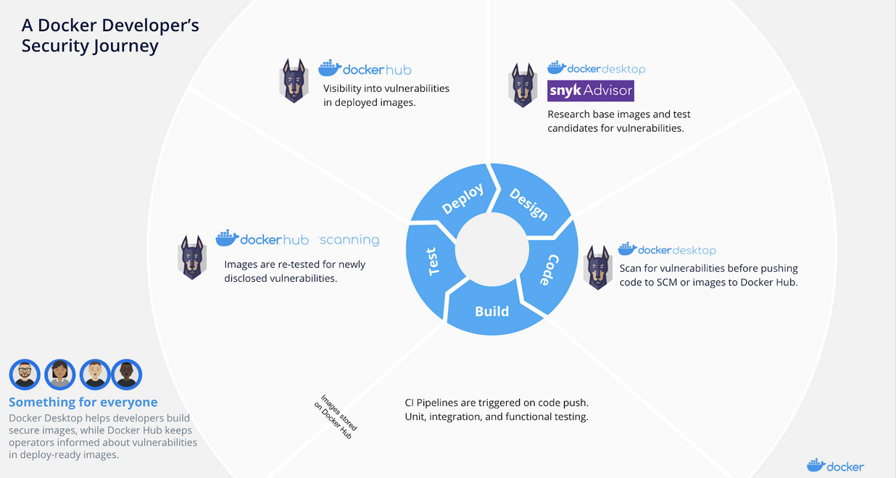
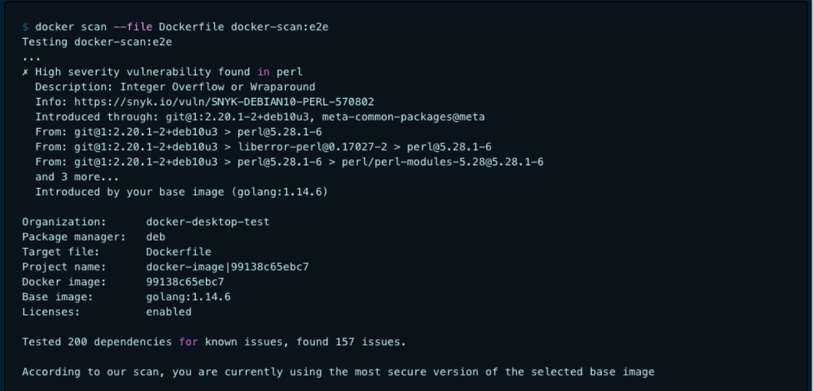
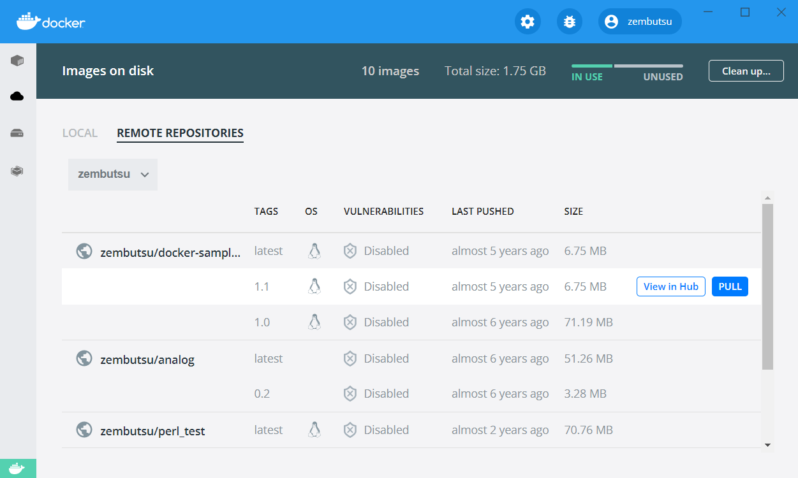
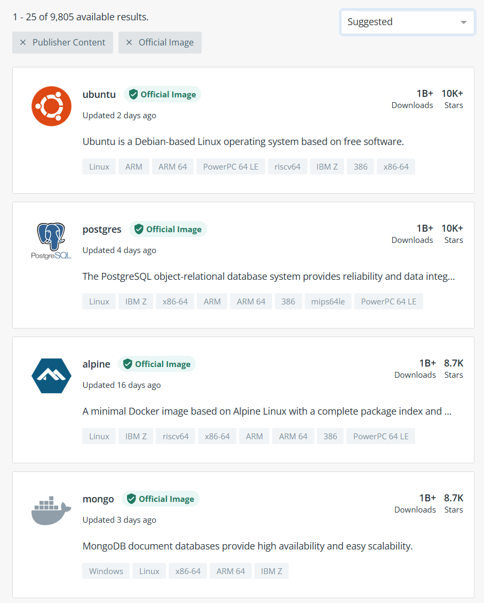

.. -*- coding: utf-8 -*-
.. URL: https://docs.docker.com/develop/scan-images/
   doc version: 20.10
      https://github.com/docker/docker.github.io/blob/master/develop/scan-images/index.md
.. check date: 2022/04/26
.. Commits on Dec 15, 2021 7b0e7b94f4047c746928dbf0571b7e20f24afe3e
.. -----------------------------------------------------------------------------

.. Best practices for scanning images
.. _best-practices-for-scanning-images:

========================================
イメージ検査のベストプラクティス
========================================

.. sidebar:: 目次

   .. contents:: 
       :depth: 2
       :local:

.. Scan your images for free
   Did you know that you can now get 10 free scans per month? Sign in to Docker to start scanning your images for vulnerabilities.

.. info::

   **イメージ検査は無料** 
   
   1ヶ月あたり10件の検査が無料だとご存じですか？  Docker にサインインし、イメージの脆弱性検査を始めましょう。

.. This page contains recommendations and best practices for scanning and building secure images.

このページで扱うのは、検査に対する推奨とベストプラクティス、そして、安全なイメージの構築です。

.. Docker and Snyk have partnered together to bring security natively into the development workflow by providing a simple and streamlined approach for developers to build and deploy secure containers. Container security spans multiple teams - developers, security, and operations. Additionally, there are multiple layers of security that apply to containers:

開発ワークフロー内で当たり前のような（ネイティブな）安全さをもたらすため、Docker と Snyk は提携しました。そのために提供するのは、安全なコンテナを構築・デプロイするために、開発者に対するシンプルで一直線な手法です。コンテナの安全性には、開発、セキュリティ、運用といった、複数のチームに亘ります。さらに、コンテナに対して適用される、複数レイヤーのセキュリティもあります。

..  The container image and the software running inside
    The interaction between a container, the host operating system, and other containers on the same host
    The host operating system
    Container networking and storage

* コンテナ イメージと、中で実行しているソフトウェア
* コンテナ、ホストオペレーティングシステム、同じホスト上にある他のコンテナとの間でのやりとり
* ホストオペレーティングシステム
* コンテナのネットワーク機能とストレージ

.. Including the vulnerability scanning options into the Docker platform extends the existing, familiar process of vulnerability detection, and allows for remediation of vulnerabilities earlier in the development process. The process of simple and continuous checks, for example, by checking images in the background using Snyk Advisor, can lead to fewer vulnerabilities checked into Docker Hub. This can result in a shorter CI cycle and a more reliable deployment into production.

既存の Docker プラットフォームを拡張し、脆弱性検査のオプションを導入すると、脆弱性検出の手順に慣れ、かつ、開発プロセスの初期で脆弱性の修正を可能にします。手順はシンプルで継続的に確認します。たとえば、バックグラウンドで `Snyk Advisor <https://snyk.io/advisor/docker>`_ を使ってイメージをチェックすると、Docker Hub 上にあるいくつかの脆弱性も確認できます。この結果、CI サイクルを短くし、開発から本番環境への信頼性を高めます。

.. Scanning images
.. _scanning-images:
イメージ検査
====================

..    Log4j 2 CVE-2021-44228
    Versions of docker scan earlier than v0.11.0 are not able to detect Log4j 2 CVE-2021-44228. You must update your Docker Desktop installation to version 4.3.1 or higher to fix this issue. For more information, see Scan images for Log4j 2 CVE.

.. important::

   **Log4j 2 CVE-2021-44228**
   
   ``docker scan`` のバージョン ``v0.11.0`` 未満は `Log4j 2 CVE-2021-44228 <https://nvd.nist.gov/vuln/detail/CVE-2021-44228>`_ を検出できません。Docker Desktop を更新するため、バージョン 4.3.1 以上をインストールして、この問題に対応します。詳しい情報は :ref:`Scan images for Log4j 2 CVE <scan-images-for-log4j-2-cve>` をご覧ください。

.. You can trigger scans automatically by pushing an image to Docker Hub. You can achieve this either through the docker scan command in the CLI, or through Docker Hub.

Docker Hub へのイメージ送信をトリガとした、自動的な検査も可能です。そのためには、 CLI で ``docker scan`` コマンドを通してか、 Docker Hub 上を通してかのどちらかで行います。

.. Scan using the CLI
.. _scan-using-the-cli:
CLI を使って検査
--------------------

.. After you’ve built an image and before you push your image to Docker Hub, run the docker scan command. For detailed instructions on how to scan images using the CLI, see docker scan.

イメージを構築したら、 Docker Hub にイメージを送る前に、 ``docker scan`` コマンドを実行します。CLI を使ったイメージ検査の手順詳細は、 :doc:`docker scan </engine/scan>` をご覧ください。

.. Scan using Docker Hub
Docker Hub を使って検査
------------------------------

.. You can trigger scans, view, and inspect vulnerabilities through Docker Hub. For detailed information, see Hub Vulnerability Scanning.

Docker Hub を通した脆弱性検査、表示、調査のトリガを設定できます。詳しい情報は、 :doc:`Hub 脆弱性検査 </docker-hub/vulnerability-scanning>` をご覧ください。

..    Note
    Docker Hub Vulnerability Scanning is available for developers subscribed to a Docker Pro, Team, or a Business tier. For more information about the pricing plans, see Docker Pricing.

.. note::

   Docker Hub 脆弱性検査が利用可能なのは、 Docker Pro、Team、Business を契約している開発者のみです。料金プランに関する詳しい情報は `Docker Pricing <https://www.docker.com/pricing>`_ をご覧ください。

.. View the scan summary in Docker Desktop
Docker Desktop で検査のサマリを表示
----------------------------------------

.. Docker Desktop provides you a snapshot of your vulnerabilities status on the Docker Dashboard. Hover over the image and click View in Hub to view a detailed vulnerability report in Docker Hub.

Docker Desktop では、 Docker ダッシュボード上で脆弱性の状態についてのスナップショットを表示します。イメージの上にマウスカーソルを異動し、 **View in Hub** をクリックすると、 Docker Hub 上で脆弱性報告の詳細を表示します。

.. Best practices
.. _scan-images-best-practices:
ベストプラクティス
====================

.. As a developer, you can take a few simple steps to improve the security of your container. This includes:

開発者であれば、コンテナの安全性を改善するため、いくつかのシンプルなステップがあります。

..  Choosing the right base image from a trusted source and keeping it small
    Using multi-stage builds
    Rebuilding images
    Scanning images during development
    Scanning images during production

1. 提供元が信頼できて、かつ、小さく維持できる、正しいベースイメージの選択
2. マルチステージ ビルドの使用
3. イメージの再構築
4. 開発中のイメージを検査
5. 本番環境でイメージを検査

それでは、これら各ベストプラクティスの詳細をそれぞれみましょう。

.. Now, let’s take a detailed look at each of these best practices:

.. Choose the right base image
.. _choose-the-right-base-image:
正しいベースイメージの選択
------------------------------

.. The first step towards achieving a secure image is to choose the right base image. When choosing an image, ensure it is built from a trusted source and keep it small.

安全なイメージを達成するための第一のステップが、正しいベースイメージの選択です。イメージの選択時、信頼できる提供元によって構築され、かつ、小さく維持できるイメージを確保します。

.. Docker Hub has more than 8.3 million repositories. Some of these images are Official Images, which are published by Docker as a curated set of Docker open source and drop-in solution repositories. Docker also offers images that are published by Verified Publishers. These high-quality images are published and maintained by the organizations partnering with Docker, with Docker verifying the authenticity of the content in their repositories. When you pick your base image, look out for the Official Image and Verified Publisher badges.

Docker Hub には 830 万以上のリポジトリがあります。この中のイメージのいくつかが Docker によって提供されている :doc:`公式イメージ（Official Image） </docker-hub/official_images>` であり、これは、Docker が企画したオープンソースのソリューションを集めたリポジトリです。また、 Docker は :doc:`Verified Publisher（認定パブリッシャー） </docker-hub/publish>` が公開するイメージも提供します。これらの高品質なイメージは、 Docker と提携した組織によってメンテナンスされており、Docker が各リポジトリの信頼性を検証しているものです。ベースイメージを選ぶには、 **Official Image** （公式イメージ）と **Verified Publisher** （認定パブリッシャー）のバッジが付いているものを探してください。

.. When building your own image from a Dockerfile, ensure you choose a minimal base image that matches your requirements. A smaller base image not just offers portability and fast downloads, but also shrinks the size of your image and minimizes the number of vulnerabilities introduced through the dependencies.

Dockerfile から自分のイメージを構築しようとする時は、自分の必要条件に一致する、最小のベースイメージを確保します。より小さなベースイメージはポータビリティと早いダウンロードをもたらすだけでなく、イメージの容量を圧縮し、依存関係を通して発生する脆弱性の数を最小化します。

.. We also recommend that you use two types of base images: the first image for development and unit testing and the second one for testing during the latest stages of development and production. In the later stages of development, your image may not even require some build tools such as compilers, build systems, or any debugging tools. A small image with minimal dependencies can considerably lower the attack surface.

また、私たちが勧めるのは、２種類のベースイメージの使用です。１つめのイメージは開発とユニットテスト用であり、２つめのイメージは構築の最終段階のテストおよび本番用です。後の構築段階では、コンパイラ、構築システム、デバッグ用ツールといった、いくつかの構築用ツールは不要となるでしょう。小さなイメージは依存関係が最小のため、攻撃に晒される危険性が低いと考えられます。

.. Use multi-stage builds
.. _scan-use-multi-stage-builds:
マルチステージ ビルドの使用
------------------------------

.. Multi-stage builds are designed to create an optimized Dockerfile that is easy to read and maintain. With a multi-stage build, you can use multiple images and selectively copy only the artifacts needed from a particular image.

:ruby:`マルチステージ ビルド <multi-stage build>` は、読みやすく維持を簡単が簡単になるよう最適化された Dockerfile を作成するために設計されています。マルチステージ ビルドがあれば、複数のイメージを使えるようになり、対象のイメージから必要となるアーティファクト（成果物）のみを選んでコピーできます。

.. You can use multiple FROM statements in your Dockerfile, and you can use a different base image for each FROM. You can also selectively copy artifacts from one stage to another, leaving behind things you don’t need in the final image. This can result in a concise final image.

Dockerfile 内で複数の ``FROM`` 記述が行え、 ``FROM`` ごとに異なるベースイメージが利用できます。また、あるステージから別のステージへと、アーティファクトを選んでコピーできますので、最終イメージに不要なものを放置できます。

.. This method of creating a tiny image does not only significantly reduce complexity, but also the change of implementing vulnerable artifacts in your image. Therefore, instead of images that are built on images, that again are built on other images, multi-stage builds allow you to ‘cherry pick’ your artifacts without inheriting the vulnerabilities from the base images on which they rely on.

この手法で作成されたあらゆるイメージは、複雑さを著しく減らしますが、イメージ内に脆弱性のあるアーティファクトを含んでしまう可能性も変えます。つまり、出来合いのイメージを使ってイメージを構築するのではなく、マルチステージ ビルドによって、ベースイメージへの依存に由来する脆弱性を継承しないよう、必要なものだけを「えり好み」できます。

.. For detailed information on how to configure multi-stage builds, see multi-stage builds.

マルチステージ ビルドの設定の仕方に関する情報は、 :doc:`マルチステージ ビルド </develop/develop-images/multistage-build>` をご覧ください。

.. Rebuild images
.. _scan-rebuild-images:
イメージの再構築
------------------------------

.. A Docker image is built from a Dockerfile. A Dockerfile contains a set of instructions which allows you to automate the steps you would normally (manually) take to create an image. Additionally, it can include some imported libraries and install custom software. These appear as instructions in the Dockerfile.

Docker イメージは Dockerifle から構築します。Dockerfile の内容には、通常（手動で）イメージを作成する手順を、自動的に行えるようにするための命令が入っています。さらに、いうつかのライブラリの読み込みや、任意のソフトウェアをインストールできます。これらは Dockerfile 内で命令として見えます。

.. Building your image is a snapshot of that image, at that moment in time. When you depend on a base image without a tag, you’ll get a different base image every time you rebuild. Also, when you install packages using a package installer, rebuilding can change the image drastically. For example, a Dockerfile containing the following entries can potentially have a different binary with every rebuild.

イメージの構築とは、その時点におけるイメージのスナップショットです。タグを使わないベースイメージに依存していると、再構築するたびに異なるベースイメージを使う可能性があります。また、パッケージのインストールにパッケージのインストーラを使おうとしても、再構築後のイメージが劇的に変わってしまう可能性があります。例として、以下のようなエントリがある Dockerfile では、再構築するたびに異なるバイナリができる可能性があります。

.. code-block:: dockerfile

   FROM ubuntu:latest
   RUN apt-get -y update && apt-get install -y python

.. We recommend that you rebuild your Docker image regularly to prevent known vulnerabilities that have been addressed. When rebuilding, use the option --no-cache to avoid cache hits and to ensure a fresh download.

私たちが推奨するのは、 Docker イメージに既知の脆弱性が入り込むのを防いでの再構築です。再構築時に ``--no-cache`` オプションを使うと、キャッシュの一致を防止するため、全体を真っ新な状態からダウンロードします。

.. For example:

例：

.. code-block:: dockerfile

   $ docker build --no-cache -t myImage:myTag myPath/

.. Consider the following best practices when rebuilding an image:

イメージの再構築時は、以下のベストプラクティスに従うのを検討します。

..  Each container should have only one responsibility.
    Containers should be immutable, lightweight, and fast.
    Don’t store data in your container. Use a shared data store instead.
    Containers should be easy to destroy and rebuild.
    Use a small base image (such as Linux Alpine). Smaller images are easier to distribute.
    Avoid installing unnecessary packages. This keeps the image clean and safe.
    Avoid cache hits when building.
    Auto-scan your image before deploying to avoid pushing vulnerable containers to production.
    Scan your images daily both during development and production for vulnerabilities Based on that, automate the rebuild of images if necessary.

* 各コンテナは１つの役割のみを持たせるべき
* コンテナは :ruby:`不変 <immutable>` 、:ruby:`軽量 <lightweight>` 、 :ruby:`高速 <fast>` であるべき
* コンテナ内にデータを保管しない。かわりに共有データストアを使う
* コンテナは破棄や再構築が簡単であるべき
* 小さなベースイメージを使う（Linux Alpine のような）。小さなイメージは配布が簡単
* 不要なパッケージのインストールを避ける。これはイメージをクリーンかつ安全に保つ
* 再構築時にキャッシュとの一致を避ける
* 脆弱性のあるコンテナを本番環境に送信するのを防ぐため、デプロイ前にイメージを自動検査する
* 開発と本番環境との両方で、イメージの脆弱性を毎日検査。このベースとなるため、必要に応じてイメージの再構築を自動化

.. For detailed best practices and methods for building efficient images, see Dockerfile best practices.

ベストプラクティスの詳細や効率的なイメージの構築手法については、 :doc:`Dockerfile ベストプラクティス <develop/develop-images/dockerfile_best-practices>` をご覧ください。

.. Scan images during development
.. _scan-images-during-development:
開発中にイメージを検査
------------------------------

.. Creating an image from a Dockerfile and even rebuilding an image can introduce new vulnerabilities in your system. Scanning your Docker images during development should be part of your workflow to catch vulnerabilities earlier in your development. You should scan images at all stages of the development cycle, and ideally consider automating scans. For example, consider configuring automated scans during the build process, before pushing the image to Docker Hub (or any other registry), and finally before pushing it to a production environment.

Dockerfile からイメージを構築すると、イメージの再構築によって、システム内に新しい脆弱性を招く可能性があります。開発課程内の初期に脆弱性を把握するため、開発中は Docker イメージの検査を、ワークフローの一部とすべきです。開発サイクルのどの段階でもイメージ検査が行えますし、理想としては自動検査を検討します。たとえば、 Docker Hub （あるいは他のレジストリ）にイメージを送信する前に、構築処理の間で自動検査をするよう設定を検討します。そして、最終的に検査済みのイメージが本番環境へ送信される前に行われます。

.. Scan images during production
.. _scan-images-during-production:
本番環境でのイメージ検査
------------------------------

.. Actively checking your container can save you a lot of hassle when a new vulnerability is discovered, which otherwise can put your production system at risk.

積極的なコンテナの確認は、新しい脆弱性が発見されたとしても、それ以外は本番環境システムでの危険性に対する悩みとはならないため、イライラさせられるのを抑えられるでしょう。

.. Periodically scanning your Docker image is possible by using the Snyk monitor capabilities for containers. Snyk creates a snapshot of the image’s dependencies for continuous monitoring. Additionally, you should also activate runtime monitoring. Scanning for unused modules and packages inside your runtime gives insight into how to shrink images. Removing unused components prevents unnecessary vulnerabilities from entering both system and application libraries. This also makes an image more easily maintainable.

Docker イメージの定期的な検査には、可能であればコンテナに対応した Snyk monitor を使います。 Snyk はイメージのスナップショットを作成し、依存関係を継続的に監視します。さらに、ランタイムの監視も活発にすべきです。未使用モジュールとランタイム内の検査によって、イメージに対する危険性を減らす気付きが得られるでしょう。使っていないコンポーネントの削除は、システムとアプリケーション ライブラリの両方で、不要な脆弱性を防ぎます。そうすると、イメージのメンテナンスがより簡単にもなります。

.. Conclusion
.. _scan-images-conclusion:
まとめ
==========

.. Building secure images is a continuous process. Consider the recommendations and best practices highlighted in this guide to plan and build efficient, scalable, and secure images.

安全なイメージ構築は、継続的な過程です。効率的、スケーラブル、安全なイメージの計画および構築の為、このガイドで強調した推奨やベストプラクティスを検討しましょう。

.. Let’s recap what we’ve learnt in this guide:

このガイドでの学びを振り返ります。

..  Start with a base image that you trust. Remember the Official image and Verified Publisher badges when you choose your base images.
    Secure your code and its dependencies.
    Select a minimal base image which contains only the required packages.
    Use multi-stage builds to optimize your image.
    Ensure you carefully monitor and manage the tools and dependencies you add to your image.
    Ensure you scan images at multiple stages during your development lifecycle.
    Check your images frequently for vulnerabilities.

* 信頼できるベースイメージから始める。ベースイメージの選択時は、公式イメージと認定パブリッシャーのバッジがついているかどうかを忘れない
* コードとその依存関係を安全にする
* 必要なパッケージのみを含み、ベースイメージが最小となるよう検討すうｒ
* イメージを最適化するため、マルチステージ ビルドを使う
* 安全のため、イメージに追加するツールや依存関係を、注意深く監視や管理する
* 安全のため、開発ライフサイクルの間は、複数のステージでイメージを検査する
* イメージの脆弱性を頻繁に確認する

.. Further reading
.. _scan-images-further-reading:
さらに詳しく
====================

.. You can also take a look at the following articles from Snyk:

Snyk から提供されている以下の記事もご覧いただけます。

..  Container Security Guide
    Docker Vulnerability Scanning Cheat Sheet

* `Container Security Guide <https://snyk.io/learn/container-security/>`_
* `Docker Vulnerability Scanning Cheat Sheet <https://goto.docker.com/rs/929-FJL-178/images/cheat-sheet-docker-desktop-vulnerability-scanning-CLI.pdf>`_

.. seealso::

   Best practices for scanning images
      https://docs.docker.com/develop/scan-images/

