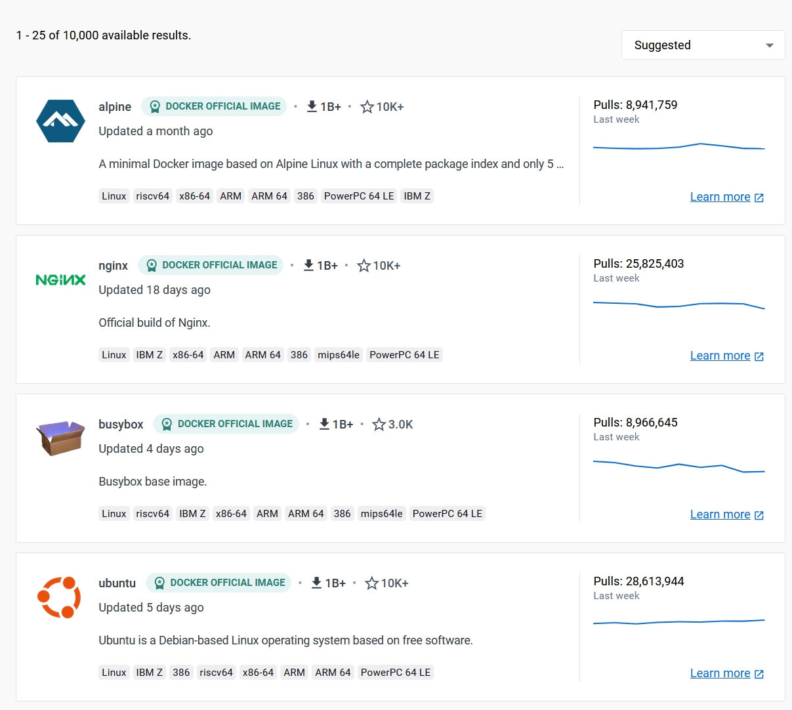

.. -*- coding: utf-8 -*-
.. URL: https://docs.docker.com/develop/security-best-practices/
   doc version: 24.0
      https://github.com/docker/docker.github.io/blob/master/develop/security-best-practices.md
.. check date: 2023/07/23
.. Commits on May 31, 2023 0e376632a4cfa1c641528d238c766845e8196004
.. -----------------------------------------------------------------------------

.. Security best practices
.. _security-best-practices:

========================================
セキュリティのベストプラクティス
========================================

.. sidebar:: 目次

   .. contents:: 
       :depth: 2
       :local:

.. You can take a few steps to improve the security of your container. This includes:

いくつかの手順を経ますと、コンテナのセキュリティを改善できます。手順には以下が含まれます。

..  Choosing the right base image from a trusted source and keeping it small
    Using multi-stage builds
    Rebuilding images
    Check your image for vulnerabilities

1. 信頼できる場所から :ref:`choose-the-right-base-image` をし、小ささを維持
2. :ref:`use-multi-stage-builds`
3. :ref:`rebuild-images`
4. :ref:`check-your-image-for-vulnerabilities`

.. Choose the right base image
.. _choose-the-right-base-image:

正しいベースイメージの選択
==============================

.. The first step towards achieving a secure image is to choose the right base image. When choosing an image, ensure it’s built from a trusted source and keep it small.

安全なイメージを確保するための第一歩は、正しいベースイメージの選択です。イメージを選択するときは、信頼できる場所で構築されたものかを確認し、小ささを維持し続けます。

.. Docker Hub has more than 8.3 million repositories. Some of these images are Official Images, which are published by Docker as a curated set of Docker open source and drop-in solution repositories. Docker also offers images that are published by Verified Publishers. These high-quality images are published and maintained by the organizations partnering with Docker, with Docker verifying the authenticity of the content in their repositories. When you pick your base image, look out for the Official Image and Verified Publisher badges.

Docker Hub には 830 万以上のリポジトリがあります。これらのいくつかは :doc:`公式イメージ（Official Images） </docker-hub/official_images>` と呼ばれ、Docker のオープンソースと手軽に導入できるソリューションのリポジトリが、 Docker によって選抜された集まりとして公開されているものです。また、 Docker は :doc:`認定パブリッシャー（Verified Publishers） </docker-hub/dvp-program>` によって作成されているイメージも提供しています。これらは高品質なイメージとして公開されており、Docker のパートナー組織によってメンテナンスされ、各リポジトリ内容の信頼性を Docker が検証しています。ベースイメージの選択時には、 **Official Image** と **Verified Publisher** バッジを探してください。

.. When building your own image from a Dockerfile, ensure you choose a minimal base image that matches your requirements. A smaller base image not just offers portability and fast downloads, but also shrinks the size of your image and minimizes the number of vulnerabilities introduced through the dependencies.

Dockerfile から自分のイメージを構築するときは、要件に一致する最小のベースイメージを選択します。より小さなベースイメージはポータビリティ（移植性）や素早いダウンロードをもたらさないかもしれませんが、イメージの容量を減らし、依存関係をと通してもたらされる数々の脆弱性を最小化します。

.. You should also consider using two types of base images: the first image for development and unit testing and the second for testing during the latest stages of development and production. In the later stages of development, your image may not require some build tools such as compilers, build systems, or any debugging tools. A small image with minimal dependencies can considerably lower the attack surface.

また、2種類のベースイメージを利用するのを検討した方が良いでしょう。1つ目のイメージは開発やユニットテスト用で、2つ目は開発の最終段階やプロダクション用です。開発の後半段階では、コンパイラ、構築システム、あるいはデバッギング・ツールなどの構築ツールが不要になるでしょう。依存関係が最小の小さなイメージにより、攻撃となりうる対象を大幅に減少できます。

.. Use multi-stage builds
.. _use-multi-stage-builds:

マルチステージ ビルドを使う
==============================

.. Multi-stage builds are designed to create an optimized Dockerfile that is easy to read and maintain. With a multi-stage build, you can use multiple images and selectively copy only the artifacts needed from a particular image.

読みやすく保守しやすいように最適化された Dockerfile を作成するために、:ruby:`マルチステージ ビルド <multi-stage builds>` は設計されています。マルチステージ ビルドがあれば、複数のイメージを使って、ある特定のイメージから必要なアーティファクト（成果物）だけを選択してコピーできます。

.. You can use multiple FROM statements in your Dockerfile, and you can use a different base image for each FROM. You can also selectively copy artifacts from one stage to another, leaving behind things you don’t need in the final image. This can result in a concise final image.

Dockerfile 内で複数の ``FROM`` を記述できるため、 ``FROM`` ごとに異なるベースイメージを利用できます。また、あるステージから別のステージにアーティファクトを選んでコピーできるため、最終イメージでは不要なものを除去できます。この結果、最終イメージは簡素にできます。

.. This method of creating a tiny image doesn’t only significantly reduce complexity, but also the change of implementing vulnerable artifacts in your image. Therefore, instead of images that are built on images, that again are built on other images, multi-stage builds allow you to ‘cherry pick’ your artifacts without inheriting the vulnerabilities from the base images on which they rely on.

この手法で作られた小さなイメージは、複雑さを著しく減らすだけではありません。イメージ内に、脆弱性がある部分を組み込む流れも変わります。つまり、あるイメージから構築されたイメージを元にして、更にイメージを構築するという方法にかわり、マルチステージビルドであればベースイメージ上の脆弱性を継承することなく、必要なアーティファクトを選択して取り込めます。

.. For detailed information on how to configure multi-stage builds, see multi-stage builds.

マルチステージビルドの設定方法についての詳しい情報は :doc:`マルチステージビルド </build/building/multi-stage>` を御覧ください。

.. Rebuild images
.. _rebuild-images:

イメージの再構築
====================

.. A Docker image is built from a Dockerfile. A Dockerfile contains a set of instructions which allows you to automate the steps you would normally (manually) take to create an image. Additionally, it can include some imported libraries and install custom software. These appear as instructions in the Dockerfile.

Docker イメージは Dockerfile から構築します。Dockerfile に含まれるのは命令の集まりであり、これにより、通常の（手動で）イメージを作成する手順を自動化できるようになります。さらに、ライブラリの組み込みや、任意のソフトウェアのインストールが可能になります。これらが Dockerfile 内での命令として表されます。

.. Building your image is a snapshot of that image, at that moment in time. When you depend on a base image without a tag, you’ll get a different base image every time you rebuild. Also, when you install packages using a package installer, rebuilding can change the image drastically. For example, a Dockerfile containing the following entries can potentially have a different binary with every rebuild.

自分用に構築するイメージとは、対象となるイメージの、該当時点におけるスナップショットです。タグを使わないベースイメージに依存する場合は、再構築時に毎回異なるベースイメージを入手します。また、パッケージのインストーラを使ってパッケージをインストールする場合は、再構築によってイメージが大幅に変わる可能性があります。例えば、以下にある内容の Dockerfile では、毎回再構築するたびに異なるバイナリを得る可能性があります。

.. code-block:: dockerfile

   # syntax=docker/dockerfile:1
   FROM ubuntu:latest
   RUN apt-get -y update && apt-get install -y python

.. We recommend that you rebuild your Docker image regularly to prevent known vulnerabilities that have been addressed. When rebuilding, use the option --no-cache to avoid cache hits and to ensure a fresh download.

対応された既知の脆弱性を防ぐため、定期的な Docker イメージの再構築を推奨します。再構築時には、確実に新しいものをダウンロードし、キャッシュの適用を無効化するために ``--no-cache`` オプションを使います。

.. For example:

例：

.. code-block:: dockerfile

   $ docker build --no-cache -t myImage:myTag myPath/

.. Consider the following best practices when rebuilding an image:

イメージの再構築時、以下のベストプラクティスに従うのを考えます。

..  Each container should have only one responsibility.
    Containers should be immutable, lightweight, and fast.
    Don’t store data in your container. Use a shared data store instead.
    Containers should be easy to destroy and rebuild.
    Use a small base image (such as Linux Alpine). Smaller images are easier to distribute.
    Avoid installing unnecessary packages. This keeps the image clean and safe.
    Avoid cache hits when building.
    Auto-scan your image before deploying to avoid pushing vulnerable containers to production.
    Analyze your images daily both during development and production for vulnerabilities. Based on that, automate the rebuild of images if necessary.

* 各コンテナは、1つの役割のみ持たせるべき。
* コンテナはイミュータブル（不変）、軽量、速くあるべき。
* コンテナ内にデータを保管しない。代わりに共有データストアを使う。
* コンテナは簡単に破棄と再構築できるべき。
* （Alpine Linux のような）小さなベースイメージを使う。小さなイメージは配布も簡単。
* 不要なパッケージのインストールを避ける。これにより、イメージをクリーンかつ安全に保つ。
* 構築時はキャッシュのヒットを避ける。
* 脆弱性のあるコンテナをプロダクションに送信するのを避けるため、デプロイ前にイメージの自動スキャンをする。
* 開発中とプロダクションの両方で、日々イメージの脆弱性を分析する。その上で、必要があればイメージ再構築を自動化する。

.. For detailed best practices and methods for building efficient images, see Dockerfile best practices.

効率的なイメージの構築関するベストプラクティスや手法の詳細は :doc:`Dockerfile ベストプラクティス <dockerfile_best-practices>` を御覧ください。

.. Check your image for vulnerabilities
.. _check-your-image-for-vulnerabilities:

イメージの脆弱性を確認するには
========================================

.. In addition to following the best practices outlined on this page when developing images, it’s also important to continuously analyze and evaluate the security posture of your images using vulnerability detection tools.

このページでこれまで取り上げたイメージ構築のベストプラクティスに加え、脆弱性検出ツールを使い、イメージのセキュリティ状況の継続的な分析と評価も重要です。

.. Docker tools come with features helps you stay up to date about vulnerabilities that affect images that you build or use.

Docker ツールには、イメージの構築や使用にあたり、日々脆弱性について更新し続けるために役立つ機能があります。

..  Docker Hub supports an automatic vulnerability scanning feature, which when enabled, automatically scans images when you push them to a Docker Hub repository. Requires a Docker subscription.

* Docker Hub は自動的な :doc:`脆弱性スキャン <docker-hub/vulnerability-scanning>` 機能をサポートしています。これを有効にすると、Docker Hub リポジトリへイメージの送信時に自動的にスキャンします。 `Docker サブスクリプション <https://docs.docker.com/subscription/>`_ が必要です。

..     Docker Hub also supports an early-access advanced image analysis feature, which extends the “core” vulnerability scanning solution with enhanced capabilities and more detailed and actionable insights.

* 早期アクセスの :doc:`高度なイメージ解析（advanced image analysis） </scout/advanced-image-analysis>` 機能もサポートしています。これは「コア」となる脆弱性検査ソリューションを拡張したもので、能力の拡張や、より詳しく実用的な洞察を行います。

..    For the CLI, there’s the docker scout CLI plugin which lets you explore vulnerabilities for images using the terminal.

* CLI 用としては :doc:`docker scout CLI プラグイン </engine/reference/commandline/scout>` があります。これはターミナルを使ってイメージの脆弱性を探せます。

..    Docker Desktop sports a detailed image view for images in your local image store, that visualizes all of the known vulnerabilities affecting an image.

* Docker Desktop はローカルに保存しているイメージの詳細を表示し、既知の脆弱性による影響をうけるイメージ情報を視覚的に全て表示します。

.. All of these security features are powered by the same technology: Docker Scout. These features help you achieve a holistic view of your supply chain security, and to provide actionable suggestions for what you can do to remediate those vulnerabilities.

これらの機能はすべて :doc:`Docker Scout（ドッカー スカウト） </scout/index>` の技術を備えています。これら機能により、セキュリティに関する供給網（サプライチェーン）の全体像を表示するのに役立つでしょう。また、各脆弱性に対応できるようにするため、対処可能な提案も提供します。

.. Conclusion

まとめ
==========

.. Building secure images is a continuous process. Consider the recommendations and best practices highlighted in this guide to plan and build efficient, scalable, and secure images.

安全なイメージの構築とは、継続的なプロセスです。このガイドにおける推奨やベストプラクティスを、計画、効率的な構築、スケーラブル、安全なイメージのために検討ください。

.. To summarize the topics covered in this guide:

このガイドで扱った話題を要約すると：

..  Start with a base image that you trust. Pay attention to the Official image and Verified Publisher badges when you choose your base images.
    Secure your code and its dependencies.
    Select a minimal base image which contains only the required packages.
    Use multi-stage builds to optimize your image.
    Ensure you carefully monitor and manage the tools and dependencies you add to your image.
    Ensure you scan images at multiple stages during your development lifecycle.
    Check your images frequently for vulnerabilities.

* 信頼できるベースイメージから始めます。ベースイメージの選択時、公式イメージ（Official image）と認定パブリッシャー（Verified Publisher）バッジに注目します。
* コードと依存関係を安全に保ちます。
* 最小限必要なパッケージがある最小のベースイメージのみ選択します。
* イメージを最適化するため、マルチステージビルドを使います。
* イメージにツールや依存関係を追加するときは、確実に注意深く観察・管理します。
* イメージに対する脆弱性を定期的に確認します。

.. seealso::

   Security best practices | Docker Documentation
      https://docs.docker.com/develop/security-best-practices/

