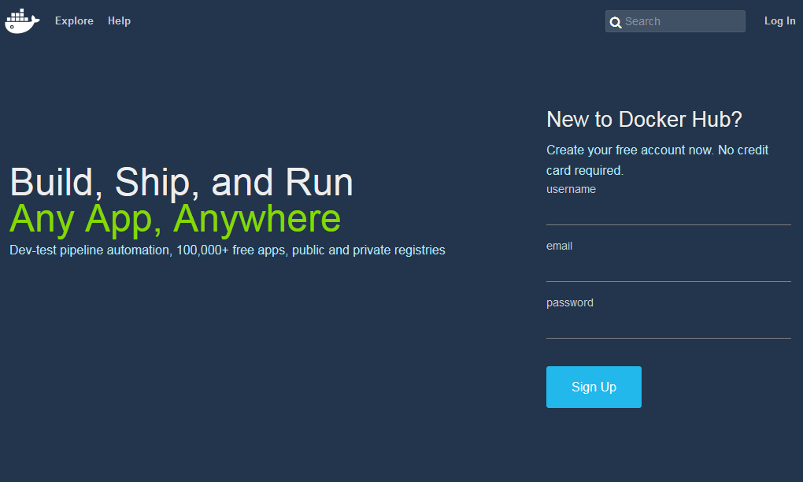

.. -*- coding: utf-8 -*-
.. URL: https://docs.docker.com/docker-hub/accounts/
.. SOURCE: -
   doc version: 1.10
.. check date: 2016/03/11
.. -------------------------------------------------------------------

.. Your Docker Hub account

.. _your-docker-hub-account:

========================================
自分用 Docker Hub アカウント
========================================

.. You can search for Docker images and pull them from Docker Hub without signing in or even having an account. However, in order to push images, leave comments, or to star a repository, you are going to need a Docker Hub account.

`Docker Hub <https://hub.docker.com/>`__ から Docker イメージの ``search`` （検索）や ``pull`` （取得）は、アカウントを持っていなくても可能です。しかし、イメージの ``push`` （送信）やコメントを残したり、リポジトリにスターを付けるには、 `Docker Hub <https://hub.docker.com/>`__ アカウントが必要です。

.. Once you have a personal Docker Hub account, you can also create or join Docker Hub Organizations and Teams.

個人で Docker Hub アカウントを持っていれば、さらに Docker Hub の :doc:`組織やチーム <orgs>` の作成や参加も可能です。

.. Registration for a Docker Hub account

.. _registration-for-a-docker-hub-account:

Docker Hub アカウントの登録
==============================

.. If you’re not already logged in, going to the Docker Hub will show you a sign up page. A valid email address is required to register, to which a verification email will be sent for account activation.

ログインしていなければ、 `Docker Hub <https://hub.docker.com/>`__ に移動し、サインアップ・ページを開きます。登録には有効なメールアドレスが必要です。ここにはアカウントを有効化するための確認メールが送られます。

.. You cannot log in to your Docker Hub account until you verify the email address.

メールアドレスの確認ができなければ、Docker Hub アカウントにログインできません。

.. Confirm your email

.. _confirm-your-email:

.. Once you’ve filled in the registration form, check your email for a welcome message asking for confirmation so we can activate your account.

登録フォームに入力すると、メールが届きます。内容は歓迎メッセージと、アカウントを有効かどうかの確認です。

.. Register via the command line

コマンドラインで登録
--------------------

.. You can also create a Docker Hub account via the command line with the docker login command.

Docker Hub アカウントを作成する別の方法は、コマンドラインで ``docker login`` コマンドを使います。

.. code-block:: bash

   $ docker login

.. This will prompt you for a user name, which will become the public namespace for your public repositories. Docker will prompt you to enter a password and your email address. It will then automatically log you in until you run docker logout.

実行するとユーザ名を訊ねてきます。ユーザ名は自分のパブリック・リポジトリにおける公開名前空間になります。Docker はパスワードとメールアドレスの入力も促します。あとは ``docker logout`` を実行するまで、自動的にログインした状態になります。

.. Login

.. _login:

ログイン
==========

.. After you complete the account creation process, you can log in any time using the web console:

アカウント作成手続きが完了すると、いつてもウェブ・コンソール上でログインできます。

.. Login using the web console

.. Or via the command line with the docker login command:

あるいは、コマンドライン上で ``docker login`` コマンドを実行します。

.. code-block:: bash

   $ docker login

.. Your Docker Hub account is now active and ready to use.

これで Docker Hub アカウントが有効化され、使う準備が整いました。

..    Note: Your authentication credentials will be stored in the .dockercfg authentication file in your home directory.

.. note::

   認証情報は、ホーム・ディレクトリ上の ``.dockercfg`` 認証ファイルに保存されています。

.. Upgrading your account

.. _upgrading-your-account:

アカウントのアップグレード
------------------------------

.. Free Hub accounts include one private registry. If you need more private registries, you can upgrade your account to a paid plan directly from the Hub.

無料の Docker Hub アカウントは、プライベート・レジストリを１つ利用できます。多くのプライベート・リポジトリが必要な場合は、Docker Hub 上の `アカウントのアップグレード（英語） <https://hub.docker.com/account/billing-plans/>`__ から支払いプランを選べます。

.. Password reset process

.. _password-reset-process:

パスワードをリセットする手順
==============================

.. If you can’t access your account for some reason, you can reset your password from the Password Reset page.

何らかの理由により自分のアカウントにアクセスできない場合は、 `パスワードのリセット <https://hub.docker.com/reset-password/>`_ ページからパスワードをリセットできます。

.. seealso:: 

   Your Docker Hub account
      https://docs.docker.com/docker-hub/accounts/
