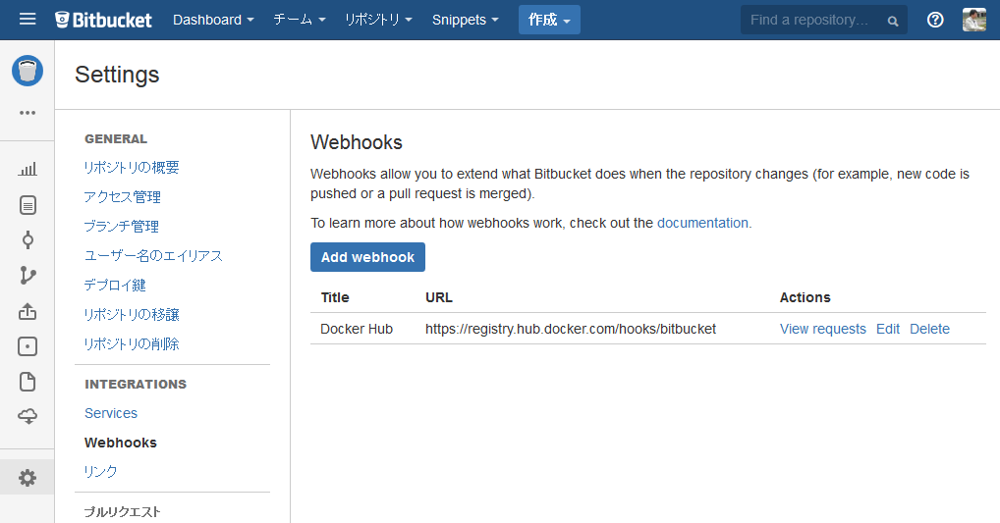

.. -*- coding: utf-8 -*-
.. URL: https://docs.docker.com/docker-hub/bitbucket/
.. SOURCE: -
   doc version: 1.10
.. check date: 2016/03/11
.. -------------------------------------------------------------------

.. Automated Builds with Bitbucket

.. _automated-builds-with-bitbucket:

========================================
Bitbucket で自動構築
========================================

.. If you’ve previously linked your Docker Hub account to your Bitbucket account, you’ll be able to skip to Creating an Automated Build.

既に Docker Hub アカウントと Bitbucket アカウントを連結済みであれば、 :ref:`bitbucket-creating-an-automated-build` までスキップできます。

.. Linking to your Bitbucket account

.. _linking-to-your-bitbucket-account:

Bitbucket アカウントと連携
==============================

.. In order to set up an Automated Build of a repository on Bitbucket, you need to link your Docker Hub account to a Bitbucket account. This will allow the registry to see your Bitbucket repositories.

Bitbucket 上のレポジトリに対する自動構築をセットアップするには、 `Docker Hub <https://hub.docker.com/account/authorized-services/>`_ アカウントを Bitbucket アカウントにリンクする必要があります。これにより、Docker Hub レジストリに対し、自分の Bitbucket レポジトリを参照できるようにします。

.. To add, remove or view your linked account, go to the “Linked Accounts & Services” section of your Hub profile “Settings”.

リンクされたアカウントの情報を見るには、自分の Docker Hub profile にある「Settings」から「Linked Accounts & Services」に移動します。

.. authorized-services

.. image:: ./images/linked-acct.png
   :scale: 60%
   :alt: リンクされたアカウント

.. Then follow the onscreen instructions to authorize and link your Bitbucket account to Docker Hub. Once it is linked, you’ll be able to create a Docker Hub repository from which to create the Automatic Build.

それから、以下の画面の指示に従い、Bitbucket アカウントを Docker Hub に認証・リンク（連携）します。リンク後は、Docker Hub レポジトリで自動構築レポジトリが作られるようになります。

.. Creating an Automated Build

.. _bitbucket-creating-an-automated-build:

自動構築の作成
====================

.. You can create an Automated Build from any of your public or private Bitbucket repositories with a Dockerfile.

`自動構築の作成 <https://hub.docker.com/add/automated-build/bitbucket/orgs/>`_ から、 ``Dockerfile`` を持つパブリックまたはプライベートな Bitbucket レポジトリを作成します。

.. To get started, log into your Docker Hub account and click the “Create ▼” menu item at the top right of the screen. Then select Create Automated Build.

設定をするには、Docker Hub アカウントでログインし、画面右上の「Create ▼」メニュー項目をクリックします。それから `Create Automated Build <https://hub.docker.com/add/automated-build>`_ を選びます。

.. Select the the linked Bitbucket account, and then choose a repository to set up an Automated Build for.

リンクされた Bitbucket アカウントを選ぶと、自動構築対象のセットアップをするレポジトリを選びます。

.. The Bitbucket service hook

.. _bitbucket-service-hook:

Bitbucket サービス・フック
==============================

.. When you create an Automated Build, a POST service hook should get automatically added to your Bitbucket repository.

自動構築レポジトリを作成すると、 ``POST`` サービス・フックが自動的に Bitbucket レポジトリに追加されます。

.. To confirm or modify the service hook log in to Bitbucket, then navigate to the repository, click “Settings” (the gear), then select “Services”. You must have Administrator privilegdes on the repository to view or modify this setting.

Bitbucket のサービス・フック・ログを確認・変更するには、レポジトリに移動し、「Settings」（歯車マーク）をクリックし、「Webhooks」を選びます。この設定を変更したり表示するには、レポジトリに対する管理権限が必要です。

.. The image below shows the correct POST hook pointing to https://registry.hub.docker.com/hooks/bitbucket.

次のイメージは、 ``https://registry.hub.docker.com/hooks/bitbucket`` に対する ``POST`` フック・ポイントを表示しています。

.. bitbucket-hooks

.. seealso::

   Automated Builds with Bitbucket
      https://docs.docker.com/docker-hub/bitbucket/
