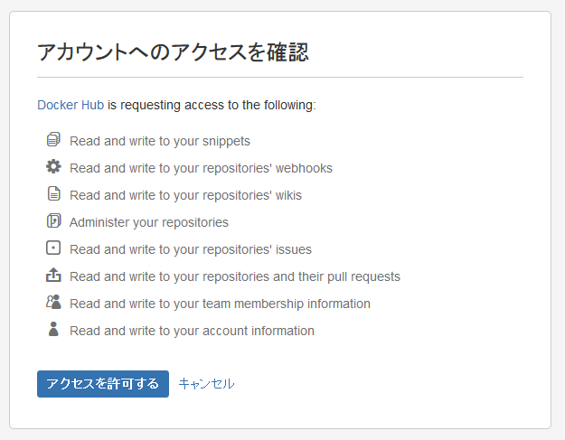
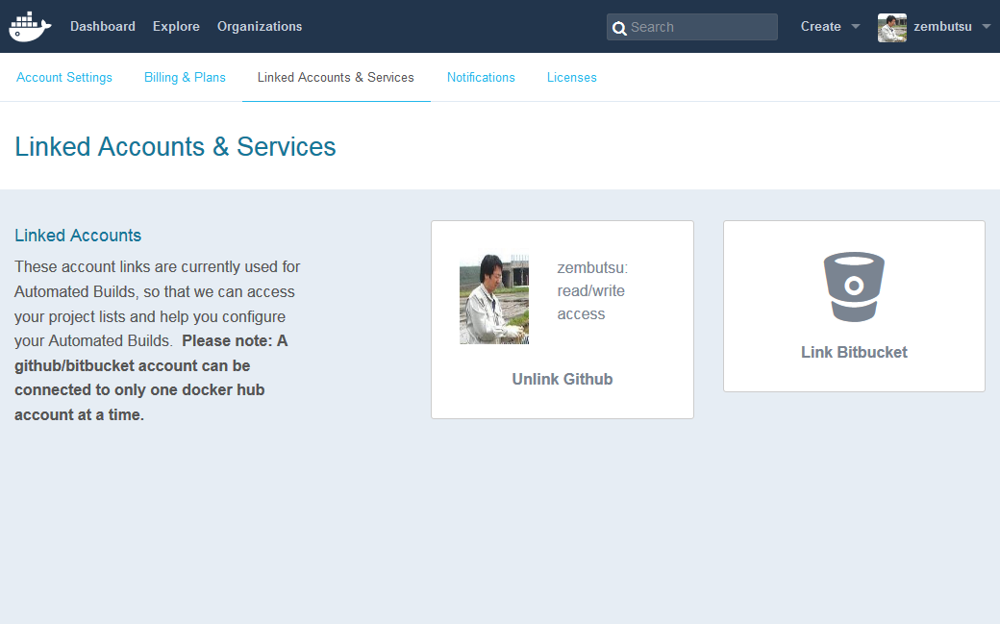
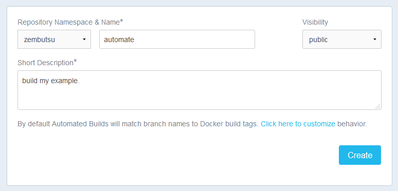
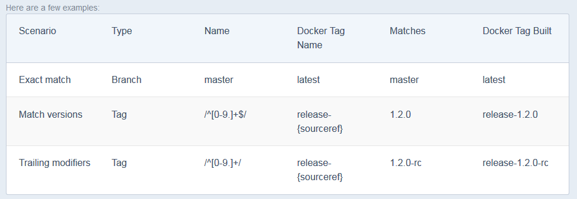
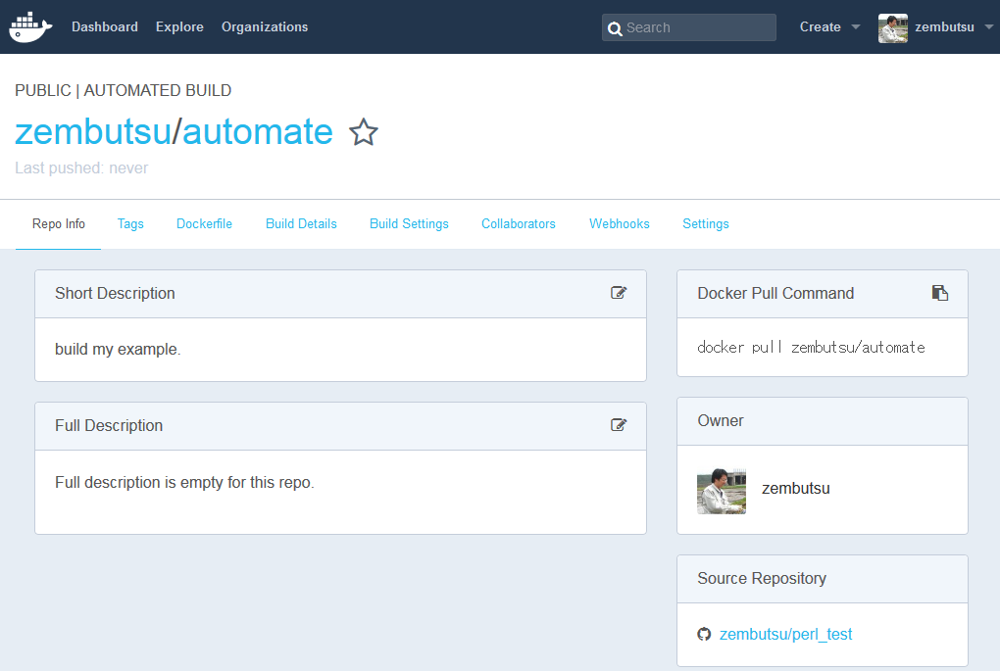
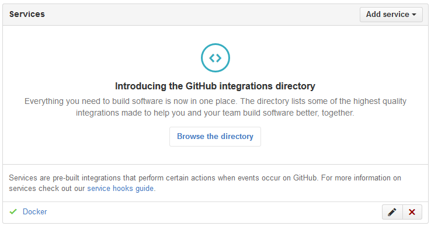
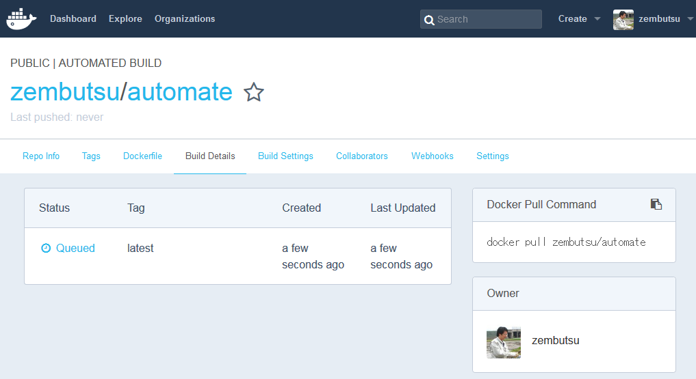
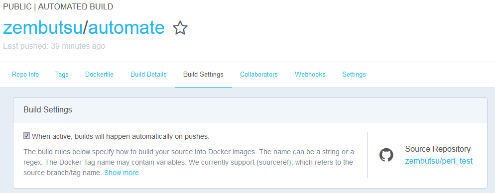
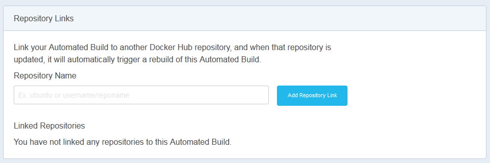

.. -*- coding: utf-8 -*-
.. URL: https://docs.docker.com/docker-hub/builds/
.. SOURCE: -
   doc version: 1.10
.. check date: 2016/03/11
.. -------------------------------------------------------------------

.. Automated Builds on Docker Hub

.. _automated-builds-on-docker-hub:

========================================
Docker Hub の自動構築
========================================

.. You can build your images automatically from a build context stored in a repository. A build context is a Dockerfile and any files at specific location. For an automated build, the build context is a repository containing a Dockerfile. Automated Builds have several advantages:

リポジトリに構築コンテキスト（内容物）を保管しておくと、自動的にイメージを構築できます。 *構築コンテキスト（build context）* とは、特定の場所にある Dockerfile と、あらゆるファイルです。自動構築において、構築コンテキストとは Dockerfile が含まれているリポジトリのことです。自動構築は複数の利点があります。

..    Images built in this way are built exactly as specified.
    The Dockerfile is available to anyone with access to your Docker Hub repository.
    You repository is kept up-to-date with code changes automatically.

* イメージの構築は、指定した通り確実に行われます。
* ``Dockerfile`` は Docker Hub リポジトリの誰もがアクセス可能です。
* コードが変更されると、リポジトリも自動的に更新されます。

.. Automated Builds are supported for both public and private repositories on both GitHub and Bitbucket.

自動構築はパブリック・プライベートの各リポジトリでサポートされており、 `GitHub <http://github.com/>`_ と `Bitbucket <https://bitbucket.org/>`_ 上で利用できます。

.. Prerequisites

.. _builds-prerequisites:

動作条件
==========

.. Use of automated builds requires that you have an account on Docker Hub and on the hosted repository provider (GitHub or Bitbucket). If you have previously linked your Github or Bitbucket account, you must have chosen the Public and Private connection type. To view your current connection settings, from your Docker Hub account choose Profile > Settings > Linked Accounts & Services.

自動構築のためには、 :doc:`Docker Hub のアカウント <accounts>` と、ホステッド・リポジトリ・プロバイダ（GitHub か Bitbucket）が必要です。既に GitHub や Bitbucket アカウントにリンクしているのであれば、パブリックもしくはプライベートかの接続タイプを選ぶ必要があります。現在の接続状態を確認するには、Docker Hub アカウント上で `Profile > Settings > Linked Accounts & Services <https://hub.docker.com/account/authorized-services/>`_ をお選びください。

.. Link to a hosted repository service

ホステッド・リポジトリ・サービスとリンク
==================================================

..    Log into Docker Hub.

1. Docker Hub にログインします。

..    Navigate to Profile > Settings > Linked Accounts & Services.

2. `Profile > Settings > Linked Accounts & Services <https://hub.docker.com/account/authorized-services/>`_ を辿ります。

..    Click the service you want to link.

3. リンク（連携）したいサービスをクリックします。

..    The system prompts you to choose between Public and Private and Limited Access. The Public and Private connection type is required if you want to use the Automated Builds.

システムが Public か Private か Limited Access か訊ねてきます。自動構築をしたい場合は、Public か Private を選ぶ必要があります。

..    Press Select under Public and Private connection type.

4. パブリックかプライベートの接続タイプを選びます。

..    The system prompts you to enter your service credentials (Bitbucket or GitHub) to login. For example, Bitbucket’s prompt looks like this:

システムがログインのためサービス（Bitbucket か GitHub）の委任を要求してきます。次の例は Bitbucket のプロンプト例です。

..    After you grant access to your code repository, the system returns you to Docker Hub and the link is complete.

コード・リポジトリに対する権限が追加された後は、システムは Docker Hub に戻してくれます。これでリンク設定が完了しました。

..    Linked account

.. Create an automated build

.. _create-an-automated-build:

自動構築リポジトリの作成
==============================

.. Automated build repositories rely entirely on the integration with your code repository. You cannot push to these image repositories using the docker push command. You can only change the image by committing to your code repository. If you want to do both, docker push and an automated build, you would create a regular repository for the docker push and an automated build repository.

自動構築リポジトリ（automated build repository）が完全に依存しているのは、コード・リポジトリとの統合です。この自動構築イメージ・リポジトリに対しては ``docker push`` コマンドで送信できません。コード・リポジトリにコミットすることによってのみ、イメージを変更できます。もしも ``docker push`` と自動構築の両方を使いたい場合は、 ``docker push`` 用の通常リポジトリと、自動構築用のリポジトリを作ることになるでしょう。

..    Select Create > Create Automated Build from Docker Hub.

1. Docker Hub で Create > Create Automated Build を選びます。

..    The system prompts you with a list of User/Organizations and code repositories.

システム上に Users/Organizations とコード・リポジトリの一覧が表示されます。

..    Select from the User/Organizations.

2. User/Organizations から選びます。

..    Optionally, type to filter the repository list.

3. オプションで、リポジトリ一覧をフィルタできます。

..    Pick the project to build.

4. 自動構築するプロジェクトを選びます。

..    The system displays the Create Automated Build dialog.

システム上に自動構築用のダイアログが表示されます。

..    Create dialog

..    The dialog assumes some defaults which you can customize. By default, Docker builds images for each branch in your repository. It assumes the Dockerfile lives at the root of your source. When it builds an image, Docker tags it with the branch name.

ダイアログには変更可能なものがデフォルトで入っています。デフォルトでは、Docker はリポジトリのブランチ毎にイメージを構築します。また、ソースのルート・ディレクトリに Dockerfile があると想定していますが、カスタマイズにより変更可能です。イメージを構築する時は、ブランチ名で Docker がタグ付けします。

..    Customize the automated build by pressing the Click here to customize this behavior link.

5. 下の方にある「Click here to customize」リンクをクリックすると、自動構築に関するカスタマイズを行えます。

..    Create dialog

..    Specify which code branches or tags to build from. You can add new configurations by clicking the + (plus sign). The dialog accepts regular expressions.

構築時にどのコード・ブランチがタグを使うか指定できます。設定を追加するには＋（プラス記号）をクリックします。ダイアログでは正規表現が使えます。

..    Create dialog

..    Click Create.

6. 「Create」をクリックします。

..    The system displays the home page for your AUTOMATED BUILD.

システムは「AUTOMATED BUILD」（自動構築）用のホームページを開きます。

..    Home page

..    Within GitHub, a Docker integration appears in your repositories Settings > Webhooks & services page.

GitHub を使っている場合、リポジトリの Settings > Webhooks & Services ページに Docker との統合が表示されます。

..    GitHub

..    A similar page appears in Bitbucket if you use that code repository.Be careful to leave the Docker integration in place. Removing it causes your automated builds to stop.

Bitbucket のコード・リポジトリを使っている場合も、同様にページが表示されます。Docker 統合を外す時は注意してください。統合を削除することにより、自動構築はできなくなります。

.. Understand the build process

.. _understand-the-build-process:

構築プロセスの理解
--------------------

.. The first time you create a new automated build, Docker Hub builds your image. In a few minutes, you should see your new build on the image dashboard. The Build Details page shows a log of your build systems:

新しい自動構築リポジトリを作ると、Docker Hub はイメージを構築します。数分すると、イメージのダッシュボード上に新しいイメージが構築されるのが見えるでしょう。「Build Details」のページで、構築システムのログが確認できます。

.. Pending

.. During the build process, Docker copies the contents of your Dockerfile to Docker Hub. The Docker community (for public repositories) or approved team members/orgs (for private repositories) can then view the Dockerfile on your repository page.

構築プロセス中、Docker は ``Dockerfile`` の内容を Docker Hub にコピーします。Docker コミュニティ（パブリック・リポジトリ用）か、適切なチームメンバ／組織（プライベート・リポジトリ用）かにより、リポジトリ・ページ上の Dockerfile の見え方が異なります。

.. The build process looks for a README.md in the same directory as your Dockerfile. If you have a README.md file in your repository, it is used in the repository as the full description. If you change the full description after a build, is overwritten the next time the Automated Build runs. To make changes, modify the README.md in your Git repository.

構築プロセスは ``Dockerfile`` と同じディレクトリにある ``README.md`` を探します。リポジトリに ``README.md`` があれば、リポジトリ用の full description として使われます。構築後に full description を書き換えても、次に自動実行が処理されると上書きされます。変更したい場合は Git リポジトリにある ``README.md`` を編集してください。

.. You can only trigger one build at a time and no more than one every five minutes. If you already have a build pending, or if you recently submitted a build request, Docker ignores new requests.

トリガにできるのは１つの構築だけであり、５分ごとに１つ処理されます。既に構築が保留中（pending）の場合、あるいは、直近で構築リクエストを送信している場合は、Docker は新しいリクエストを無視します。

.. Use the Build Settings page

.. _use-the-build-settings-page:

Build Settings ページを使う
==============================

.. The Build Settings page allows you to manage your existing automated build configurations and add new ones. By default, when new code is merged into your source repository, it triggers a build of your DockerHub image.

Build Setting ページでは、既存の自動構築設定の管理や、新しい設定を追加できます。デフォルトでは、ソース・リポジトリに新しいコードがマージされたら、DockerHub イメージを構築するトリガになります。

..  Default checkbox

.. Clear the checkbox to turn this behavior off. You can use the other settings on the page to configure and build images.

チェックボックスを外すと、この機能は無効化されます。このページ上でイメージの構築や設定に関する各種の調整ができます。

.. Add and run a new build

.. _add-and-run-a-new-build:

.. At the top of the Build Dialog is a list of configured builds. You can build from a code branch or by build tag.

Build Settings の一番上にダイアログがあります。ここで指定したコードのブランチや構築時のタグを使い構築できます。

.. Build or tag

.. Docker builds everything listed whenever a push is made to the code repository. If you specify a particular branch or tag, you can manually build that image by pressing the Trigger. If you use a regular expression syntax (regex) to define your build branch or tag, Docker does not give you the option to manually build. To add a new build:

Docker はコード・リポジトリに対して push で変更が加えられると、毎回構築を行います特定のブランチやタグを指定すると、イメージの構築を手動で行えます。構築ブランチやタグに正規表現構文（regex）を使うと、Docker は手動構築のオプションが使えなくなります。新しい構築を追加するには、次のようにします。

..    Press the + (plus sign).

1. ＋（プラス記号）をクリックします。

..    Choose the Type.

2. タイプを選びます。

..    You can build by a code branch or by an image tag.

コード・ブランチやイメージのタグで構築できます。

..    Enter the Name of the branch or tag.

3. ブランチやタグ名を入力します。

..    You can enter a specific value or use a regex to select multiple values. To see examples of regex, press the Show More link on the right of the page.

正規表現では複数の値を指定できます。正規表現の記述例を見るには、ダイアログ中にある Show more のリンクをクリックします。

..    Regexhelp

..    Enter a Dockerfile location.

4. Dockerfile の場所を入力します。

..    Specify a Tag Name.

5. タグ名を指定します。

..    Press Save Changes.

6. Save Changes をクリックします。

.. If you make a mistake or want to delete a build, press the - (minus sign) and then Save Changes.

間違えたり構築条件を削除したい場合は、ー（マイナス記号）をクリックしてから、Save Changes をクリックします。

.. Repository links

.. _repository-links:

リポジトリへのリンク
====================

.. Repository links let you link one Automated Build with another. If one Automated Build gets updated, Docker triggers a build of the other. This makes it easy to ensure that related images are kept in sync. You can link more than one image repository. You only need to link one side of two related builds. Linking both sides causes an endless build loop.

リポジトリへのリンク（Repository Links）は、他と連携する自動構築です。ある自動構築リポジトリが更新されると、この他のリポジトリの更新をトリガとして Docker が自動構築します。つまり、関連するイメージと同期し続けます。１つ以上のイメージ・リポジトリが指定できます。必要になるのは、関連する２つのイメージの片方だけです。もし、双方に設定してしまうと、構築が永久ループしてしまいます。

.. To add a link:

リンクの追加は次の通りです。

..    Go to the Build Settings for an automated build repository.

1. 自動構築リポジトリの Build Settings に移動します。

..    In the Repository Links section, enter an image repository name.

2. Repository Links の箇所で、イメージのリポジトリ名を入力します。

..    A remote repository name should be either an official repository name such as ubuntu or a public repository name namespace/repoName.

リモートのリポジトリ名は ``ubuntu`` のような公式リポジトリ名か、 ``namespace/repoName``  のようなパブリック・リポジトリ名である必要があります。

..    Press Add.

3. Add をクリックします。

..    Links

.. Remote Build triggers

.. _remote-build-triggers:

リモート構築トリガ
====================

.. To trigger Automated Builds programmatically, you can set up a remote build trigger in another application such as GitHub or Bitbucket. When you Activate the build trigger for an Automated Build, it supplies you with a Token and a URL.

自動構築をプログラミング的なトリガにするには、GItHub や BitBucket のような他のアプリケーションをリモート構築のトリガとして設定します。自動構築の Build Triggers （構築トリガ）を有効化すると、トークンと URL が表示されます。

.. Build trigger screen

.. image:: ./images/build-trigger.png
   :scale: 60%
   :alt: 構築トリガの画面

.. You can use curl to trigger a build:

``curl`` を構築のトリガとして使えます。

.. code-block:: bash

   $ curl --data build=true -X POST https://registry.hub.docker.com/u/svendowideit/testhook/trigger/be579c
   82-7c0e-11e4-81c4-0242ac110020/
   OK

.. To verify everything is working correctly, check the Last 10 Trigger Logs on the page.

正常に動作するかを確認するには、同じページの Last 10 Trigger Logs （直近のトリガ10個のログ）をご覧ください。

.. seealso:: 

   Automated Builds on Docker Hub
      https://docs.docker.com/docker-hub/builds/
