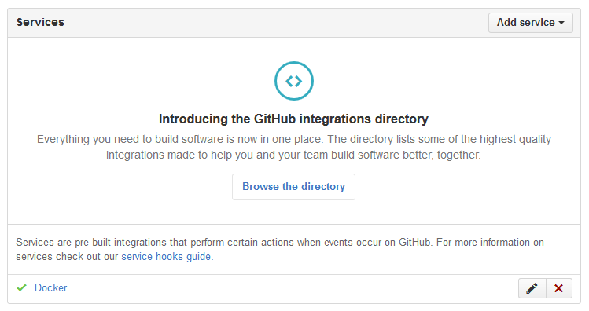

.. -*- coding: utf-8 -*-
.. URL: https://docs.docker.com/docker-hub/github/
.. SOURCE: -
   doc version: 1.10
.. check date: 2016/03/11
.. -------------------------------------------------------------------

.. Automated Builds from GitHub

.. _automated-builds-from-github:

========================================
GitHub で自動構築
========================================

.. If you’ve previously linked your Docker Hub account to your GitHub account, you’ll be able to skip to Creating an Automated Build.

既に Docker Hub アカウントと Github アカウントを連結済みであれば、 :ref:`github-creating-an-automated-build` までスキップできます。

.. Linking your Docker Hub account to a GitHub account

.. _linking-you-docker-hub-account-to-a-github-account:

Docker Hub アカウントを GitHub アカウントにリンク
==================================================

..    Note: Automated Builds currently require read and write access since Docker Hub needs to set up a GitHub service hook. We have no choice here, this is how GitHub manages permissions. We do guarantee nothing else will be touched in your account.

.. note::

   自動構築を使うためには、GitHub サービス・フックに対して `Docker Hub <https://hub.docker.com/>`__ が読み書きできる権限の設定が必要です。ここでは GItHub で権限を管理する方法を紹介しますが、選択の余地がないものです。あなたのアカウントでの操作に対して、私たちは何ら保証しません。

.. In order to set up an Automated Build of a repository on GitHub, you need to link your Docker Hub account to a GitHub account. This will allow the registry to see your GitHub repositories.

Bitbucket 上のリポジトリに対する自動構築をセットアップするには、 `Docker Hub <https://hub.docker.com/account/authorized-services/>`_ アカウントを Bitbucket アカウントにリンクする必要があります。これにより、Docker Hub レジストリに対し、自分の Bitbucket リポジトリを参照できるようにします。

.. To add, remove or view your linked account, go to the “Linked Accounts & Services” section of your Hub profile “Settings”.

リンクされたアカウントの情報を見るには、自分の Docker Hub profile にある「Settings」から「Linked Accounts & Services」に移動します。

.. authorized-services

.. image:: ./images/linked-acct.png
   :scale: 60%
   :alt: リンクされたアカウント

.. When linking to GitHub, you’ll need to select either “Public and Private”, or “Limited Access” linking.

GitHub にリンクするとき、「Public and Private」か「Limited Access」のどちらかを選ぶ必要があります。

.. add-authorized-github-service.png

.. The “Public and Private” option is the easiest to use, as it grants the Docker Hub full access to all of your repositories. GitHub also allows you to grant access to repositories belonging to your GitHub organizations.

「Public and Private」オプションは遣うのが最も簡単です。これは、リポジトリが Docker Hub に対してフルアクセス権を提供するからです。また、GitHub は GitHub organization もリポジトリに対してアクセスを付与できます。

.. By choosing the “Limited Access” linking, your Docker Hub account only gets permission to access your public data and public repositories.

「Limited Access」リンクを選ぶと、Docker Hub アカウントはパブリック・データとパブリック・リポジトリに対してのみ権限を与えます。

.. Follow the onscreen instructions to authorize and link your GitHub account to Docker Hub. Once it is linked, you’ll be able to choose a source repository from which to create the Automatic Build.

以下の画面では、GitHub アカウントを Docker Hub に認証するよう指示しています。リンク後は、任意のソース・リポジトリから自動構築リポジトリを作成できます。

.. You will be able to review and revoke Docker Hub’s access by visiting the GitHub User’s Applications settings.

Docker Hub に対するアクセス設定の表示や無効化をするには、 `GitHub のユーザ・アプリケーション設定 <https://github.com/settings/applications>`_ に移動してください。

..    Note: If you delete the GitHub account linkage that is used for one of your automated build repositories, the previously built images will still be available. If you re-link to that GitHub account later, the automated build can be started using the “Start Build” button on the Hub, or if the webhook on the GitHub repository still exists, it will be triggered by any subsequent commits.

.. note::

   GItHub アカウントとのリンクを削除しても、過去にイメージを構築したことがある自動構築リポジトリは、そのまま利用できます。後ほど GitHub アカウントに再度リンクする場合、自動構築を有効にするには、 Docker Hub 上で「Start Build」オプションを使います。あるいは、GitHub リポジトリの webhook がそのまま残っていれば、以降のコミットがトリガになり（自動構築され）ます。

.. Auto builds and limited linked GitHub accounts.

.. _auto-builds-and-limited-linked-github-accounts:

Limited リンクの GitHub アカウントで自動構築
==================================================

.. If you selected to link your GitHub account with only a “Limited Access” link, then after creating your automated build, you will need to either manually trigger a Docker Hub build using the “Start a Build” button, or add the GitHub webhook manually, as described in GitHub Service Hooks.

GitHubアカウントのリンクで「Limited Access」リンクを選んだ場合は、自動構築リポジトリを作成するとき、Docker Hub 上の「Start Build」ボタンをトリガとするか、GitHub ウェブフックを手動で追加する必要があります。詳細は :ref:`github-service-hooks` をご覧ください。

.. Changing the GitHub user link

.. _changing-the-github-user-link:

GitHub ユーザ・リンクの変更
==============================

.. If you want to remove, or change the level of linking between your GitHub account and the Docker Hub, you need to do this in two places.

GitHub アカウントと Docker Hub アカウント間で、リンク削除やリンクのレベルを変更したい場合は、２ヵ所で作業が必要です。

.. First, remove the “Linked Account” from your Docker Hub “Settings”. Then go to your GitHub account’s Personal settings, and in the “Applications” section, “Revoke access”.

まず Docker Hub の「Settings」から「Linked Account」を削除します。それから GitHub アカウントの Personal settings で、「Applications」セクションから「Revoke access」を実行します。

.. You can now re-link your account at any time.

アカウントに対する再リンクは、いつでも可能です。

.. GitHub organizations

.. _github-organizations:

GitHub organizations
====================

.. GitHub organizations and private repositories forked from organizations will be made available to auto build using the “Docker Hub Registry” application, which needs to be added to the organization - and then will apply to all users.

GitHub organizations と organizations からフォークしたリポジトリは、「Docker Hub Registry」アプリケーションを使うことで、自動構築が有効になります。これは organization に対して追加する必要があり、あわせてユーザに対しても適用されます。

.. To check, or request access, go to your GitHub user’s “Setting” page, select the “Applications” section from the left side bar, then click the “View” button for “Docker Hub Registry”.

確認もしくはリクエストのためには、GitHub ユーザの「Setting」ページに移動し、左のサイドバーから「Application」セクションを選び、「Docker Hub Registry」の「View」ボタンをクリックします。

.. Check User access to GitHub

.. The organization’s administrators may need to go to the Organization’s “Third party access” screen in “Settings” to grant or deny access to the Docker Hub Registry application. This change will apply to all organization members.

organization の管理者は、organization の「Settings」画面にある「Third party access」から、Docker Hub Registry アプリケーションに対する許可を追加または削除します。この設定変更は、organization の全てのメンバに適用されます。

.. Check Docker Hub application access to Organization

.. More detailed access controls to specific users and GitHub repositories can be managed using the GitHub “People and Teams” interfaces.

特定のユーザに対するより詳細なアクセス制限を行うには、GitHub の「People and Teams」インターフェースを通して設定します。

.. Creating an Automated Build

.. _github-creating-an-automated-build:

自動構築リポジトリの作成
==============================

.. You can create an Automated Build from any of your public or private GitHub repositories that have a Dockerfile.

``Dockerfile`` を持つパブリックまたはプライベートの GitHub リポジトリで、 `自動構築リポジトリの作成 <https://hub.docker.com/add/automated-build/github/orgs/>`_ が可能です。

.. Once you’ve selected the source repository, you can then configure:

ソース・リポジトリを選択すると、設定が行えます。

..    The Hub user/org namespace the repository is built to - either your Hub account name, or the name of any Hub organizations your account is in
    The Docker repository name the image is built to
    The description of the repository
    If the visibility of the Docker repository: “Public” or “Private” You can change the accessibility options after the repository has been created. If you add a Private repository to a Hub user namespace, then you can only add other users as collaborators, and those users will be able to view and pull all images in that repository. To configure more granular access permissions, such as using teams of users or allow different users access to different image tags, then you need to add the Private repository to a Hub organization for which your user has Administrator privileges.
    Enable or disable rebuilding the Docker image when a commit is pushed to the GitHub repository.

* リポジトリの Docker Hub ユーザか組織の名前空間は、Docker Hub のアカウント名か、自分のアカウントが所属している Docker Hub グループ名のどちらです。
* イメージを構築する Docker リポジトリ名。
* リポジトリに対する説明。
* Docker リポジトリに対する「Public」または「Private」の可視性。このアクセス権の変更は、リポジトリ作成後でも可能です。プライベート・リポジトリを Docker Hub の名前空間に使うと、自分とコラボレータ（collaborators）のみに見えるようになり、これらのユーザのみリポジトリからイメージの表示や取得が可能になります。チームのユーザや異なったユーザに対して異なったイメージ・タグを許可するなど、より細かなアクセス権限の設定ができます。そのためには、Docker Hub のプライベート・リポジトリの管理権限を持つユーザによって、権限を付与する必要があります。
* GitHub リポジトリにコミットが push されたとき、Docker イメージの再構築を有功化・無効化します。

.. You can also select one or more: - The git branch/tag, - A repository sub-directory to use as the context, - The Docker image tag name

また、１つまたは複数の git ブランチやタグを使い、Docker イメージとタグ名を使い、サブディレクトリのリポジトリのコンテキストに使えます。

.. You can modify the description for the repository by clicking the “Description” section of the repository view. Note that the “Full Description” will be over-written by the README.md file when the next build is triggered.

リポジトリの説明を変更するには、リポジトリ表示画面の「Description」の部分をクリックします。「Full Description」のヵ所は、もし README.md ファイルがあるのであれば、次回の構築処理時に上書きされるので注意してください。

.. GitHub private submodules

.. _github-private-submodules:

GitHub プライベート・サブモジュール
========================================

.. If your GitHub repository contains links to private submodules, you’ll get an error message in your build.

プライベート・サブモジュールを含む GitHub リポジトリとリンクできますが、構築時にエラーメッセージが表示されます。

.. Normally, the Docker Hub sets up a deploy key in your GitHub repository. Unfortunately, GitHub only allows a repository deploy key to access a single repository.

通常、Docker Hub は GitHub リポジトリ上でデプロイ・キーをセットアップします。しかしながら、GitHub は１つのリポジトリに対するデプロイ・キーにしかアクセスできません。

.. To work around this, you can create a dedicated user account in GitHub and attach the automated build’s deploy key that account. This dedicated build account can be limited to read-only access to just the repositories required to build.

これを動くようにするには、GitHub 上に専用のユーザ・アカウントを作成し、そのアカウントに自動構築用のデプロイ・キーを与えます。この専用構築アカウントは、リポジトリの構築に必要な読み込み専用の権限だけに制限すべきです。

.. Step 	Screenshot 	Description
.. 1. 		First, create the new account in GitHub. It should be given read-only access to the main repository and all submodules that are needed.

1. まず、GitHub に新しいアカウントを作成します。このアカウントはメイン・リポジトリに対する読み込み権限を与え、必要があれば全てのサブモジュールに対しても設定します。

.. 2. 		This can be accomplished by adding the account to a read-only team in the organization(s) where the main GitHub repository and all submodule repositories are kept.

2. アカウントを追加したら、メインの GitHub リポジトリや必要なサブモジュール・リポジトリにおいて、organization 上の「Read Only Team」にアカウントを追加します。

.. 3. 		Next, remove the deploy key from the main GitHub repository. This can be done in the GitHub repository's "Deploy keys" Settings section.

3. 次に、メインの GitHub リポジトリからデプロイ・キーを削除します。これは GitHub リポジトリの「Deploy keys」設定のセクションで行います。

.. 4. 		Your automated build's deploy key is in the "Build Details" menu under "Deploy keys".

4. 自動構築用のデプロイ・キーを、「Build Detail」メニューの下にある「Deploy Keys」に入れます。

.. 5. 		In your dedicated GitHub User account, add the deploy key from your Docker Hub Automated Build.

5. 専用の GitHub ユーザカウントで、Docker Hub Automated Build にデプロイ・キーを追加します。

.. GitHub service hooks

.. _github-service-hooks:

GitHub サービス・フック
==============================

.. A GitHub Service hook allows GitHub to notify the Docker Hub when something has been committed to a given git repository.

GitHub サービス・フックは、特定の git リポジトリに対する何らかのコミットが発生すると、GitHub が Docker Hub に通知します。

.. When you create an Automated Build from a GitHub user that has full “Public and Private” linking, a Service Hook should get automatically added to your GitHub repository.

GitHub ユーザからの自動構築リポジトリを作成するとき、「Public and Private」リンクしている サービス・フックであれば、自動的に GItHub リポジトリに追加されます。

.. If your GitHub account link to the Docker Hub is “Limited Access”, then you will need to add the Service Hook manually.

Docker Hub からリンクする GitHub アカウントが「Limited Access」であれば、サービス・フックは手動で追加する必要があります。

.. To add, confirm, or modify the service hook, log in to GitHub, then navigate to the repository, click “Settings” (the gear), then select “Webhooks & Services”. You must have Administrator privilegdes on the repository to view or modify this setting.

サービス・フックの追加・確認・変更は、GitHub にログイン後、リポジトリに移動し、「Settings」（歯車マーク）をクリックし、それから「Webhook & Services」を選びます。この設定を参照・編集するには、リポジトリに対する管理権限が必要です。

.. The image below shows the “Docker” Service Hook.

以下の図が「Docker」サービス・フックです。

.. bitbucket-hooks

.. If you add the “Docker” service manually, make sure the “Active” checkbox is selected and click the “Update service” button to save your changes.

もし「Docker」サービスを手動で追加した場合は、「Active」チェックボックスを選択してから「Update service」ボタンをクリックして、変更を保存します。

.. seealso:: 

   Automated Builds from GitHub
      https://docs.docker.com/docker-hub/github/
