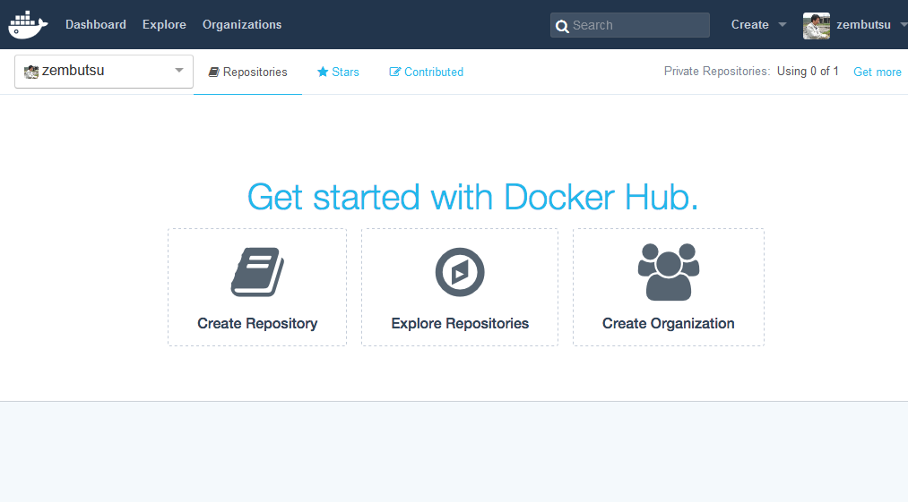

.. -*- coding: utf-8 -*-
.. https://docs.docker.com/docker-hub/
.. doc version: 1.9
.. check date: 2016/01/06

.. About the Docker Hub

.. _about-the-docker-hub:

========================================
Docker Hub 入門
========================================

.. The Docker Hub is a cloud-based registry service for building and shipping application or service containers. It provides a centralized resource for container image discovery, distribution and change management, user and team collaboration, and workflow automation throughout the development pipeline.

`Docker Hub <https://hub.docker.com/>`_ はクラウド上のレジストリ・サービスであり、アプリケーションやサービス・コンテナの構築と配信を行います。コンテナ化されたイメージを見つけたり、配布したり、変更の管理、ユーザやチームのコラボレーション、開発パイプラインを通したワークフローの自動化といった集約されたリソースを提供します。



.. Specifically, Docker Hub provides the following major features and functions:

具体的には、 Docker Hub は以下の主要な特徴や機能を持ちます。

..    Image Repositories: Find, manage, and push and pull images from community, official, and private image libraries.
    Automated Builds: Automatically create new images when you make changes to a source GitHub or Bitbucket repository.
    Webhooks: A feature of Automated Builds, Webhooks let you trigger actions after a successful push to a repository.
    Organizations: Create work groups to manage user access to image repositories.
    GitHub and Bitbucket Integration: Add the Hub and your Docker Images to your current workflows.

* :doc:`イメージ・レポジトリ <repos.rst>` ：イメージを検索・管理・取得・送信します。イメージはコミュニティ、公式、あるいはプライベートの各イメージ・ライブラリにあります。
* :doc:`自動構築（Automated Builds） <builds>` ：GitHub か Bitbucket レポジトリ上のソースコードに変更を加えると、新しいイメージを自動的に構築します。
* :doc:`ウェブ・フック（Webhooks） <webhooks>` ：自動構築機能でレポジトリに送信された後、、Webhook が何らかのアクションを起こします。
* :doc:`組織 <orgs>` ：イメージ・レポジトリにアクセスできるユーザを管理するための、ワーク・グループを作成します。
* GitHub と Bitbucket 統合。Dockre Hub と Docker イメージを、現在のワークフローに追加します。

.. Create a Docker Hub account

.. _create-a-docker-hub-account:

Docker Hub アカウントの作成
==============================

.. To explore Docker Hub, you’ll need to create an account by following the directions in Hub Accounts. You can create an account and use the Hub with one private repo for free. If you need more private repos, you can upgrade from your free account to a paid plan. To learn more, log in to the Hub and go to Billing & Plans, which you access via the Settings menu (gear icon at upper right).

Docker Hub を見て回る前に、 :doc:`accounts` の指示に従いアカウントを作成する必要があります。アカウントを作成すると、Docker Hub 上のプライベート・レポジトリの１つが無料で使えます。更に多くのプライベート・レポジトリが必要であれば、無料プランを支払いプランに変更できます。詳細を知りたい場合は、Docker Hub にログインし、設定メニュー（右上の歯車アイコン）から `Billing & Plans（英語） <https://hub.docker.com/account/billing-plans/>`_ のページをご覧ください。

.. Work with Docker image repositories

.. _work-with-docker-image-repositories:

Docker イメージ・レポジトリの働き
========================================

.. The Docker Hub provides you and your team with a place to build and ship Docker images.

Docker Hub は、あなたとあなたのチームに Docker イメージの構築（build）と配信（ship）する場所を提供します。

.. You can configure Docker Hub repositories in two ways:

Docker Hub レポジトリでは２つの設定ができます。

..    Repositories, which allow you to push images at will from your local Docker daemon to the Hub, and
    Automated Builds, which allow you to configure GitHub or Bitbucket to trigger the Hub to rebuild repositories when changes are made to the repository.

* :doc:`レポジトリ <repos>` は、自分のローカルの Docker デーモンから Docker Hub にイメージを送信できるようにします。そして、
* :doc:`自動構築 <builds>` は、GitHub か Bitbucket に作られたレポジトリに変更が発生したら、Docker Hub 上でレポジトリを再構築します。

.. You can create public repositories which can be accessed by any other Hub user, or you can create private repositories with limited access you control.

Docker Hub 上の誰もがアクセス可能なパブリック・レポジトリの作成だけでなく、アクセスを限定したプライベート・レポジトリも作成可能です。

.. Docker commands and Docker Hub

.. _docker-commands-and-docker-hub:

Docker コマンドと Docker Hub
------------------------------

.. Docker itself provides access to Docker Hub services via the docker search, pull, login, and push commands.

Docker 自身で Docker Hub サーバにアクセスするために、 ```docker search`` 、 ``pull`` 、``login`` 、 ``push`` コマンドを経由します。

..  Explore repositories

.. _explore-repositories:

レポジトリの探索
--------------------

.. There are two ways you can search for public repositories and images available on the Docker Hub. You can “Search” on the Docker Hub website, or you can docker search for all the repositories and images using the Docker commandline tool:

公開レポジトリと Docker Hub で利用可能なイメージを検索するには、２つの方法があります。Docker Hub ウェブサイト上の「search」（検索）を使うか、Docker コマンドライン・ツールで ``docker saerch`` を使い、全てのレポジトリとイメージを検索します。

.. code-block:: bash

   $ docker search ubuntu

.. Both will show you a list of the currently available public repositories on the Docker Hub which match the provided keyword.

どちらも Docker Hub 上の公開レポジトリで利用可能なものから、キーワードに一致するものを一覧表示します。

.. A private repository won’t be listed in the repository search results. To see all the repositories you can access and their status, view your “Dashboard” page on Docker Hub.

プライベート・レポジトリにあるものは、検索結果のレポジトリに表示されません。自分のアクセス権限がある全レポジトリを表示するには、 `Docker Hub <https://hub.docker.com/>`__ の「Dashboard」（ダッシュボード）をご覧ください。

.. You can find more information on working with Docker images in the Docker userguide.

Docker イメージの動作に関する詳細情報は、 :doc:`Docker ユーザガイド </userguide/dockerimages>` をご覧ください。

.. Use Official Repositories

.. _use-oficial-repositories:

公式レポジトリを使う
--------------------

.. The Docker Hub contains a number of Official Repositories. These are public, certified repositories from vendors and contributors to Docker. They contain Docker images from vendors like Canonical, Oracle, and Red Hat that you can use as the basis to building your applications and services.

Docker Hub には多くの `公式レポジトリ <http://hub.docker.com/explore/>`_ がありｍさう。これらはベンダやコントリビュータ（貢献者）によって公開されているものであり、Docker 社によって認証されています。Docker イメージのベンダには  Canonical、Oracle、Red Hat が含まれており、これらを基盤に自分のアプリケーションやサービスを構築できます。

.. With Official Repositories you know you’re using an optimized and up-to-date image that was built by experts to power your applications.

公式レポジトリには、専門家の力によって最適化された最新のイメージが使われており、これを自分のアプリケーションに活用できます。

..    Note: If you would like to contribute an Official Repository for your organization or product, see the documentation on Official Repositories on Docker Hub for more information.

.. note::

   あなたの組織やプロダクトが公式レポジトリに貢献したい場合は、 :doc:`Docker Hub の公式レポジトリ` に関する詳しい情報をご覧ください。

.. Create organization

組織を作る
====================

.. Learn how to create a Docker Hub account and manage your organizations and teams.

Docker Hub アカウント :doc:`作成の方法 <github>` 、組織やチームでの :doc:`管理 <orgs>` を学びます。
