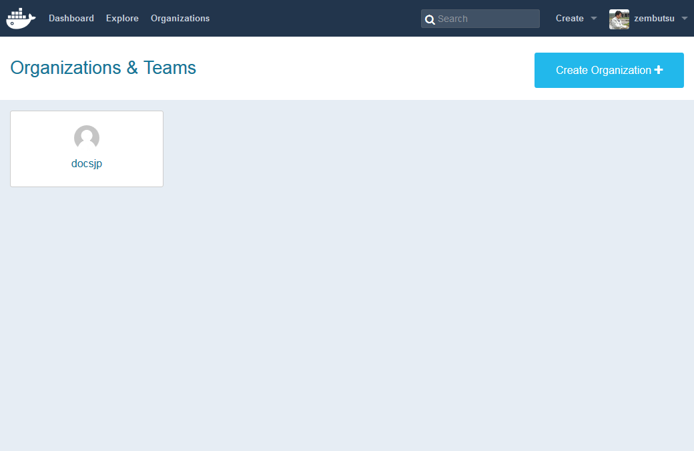
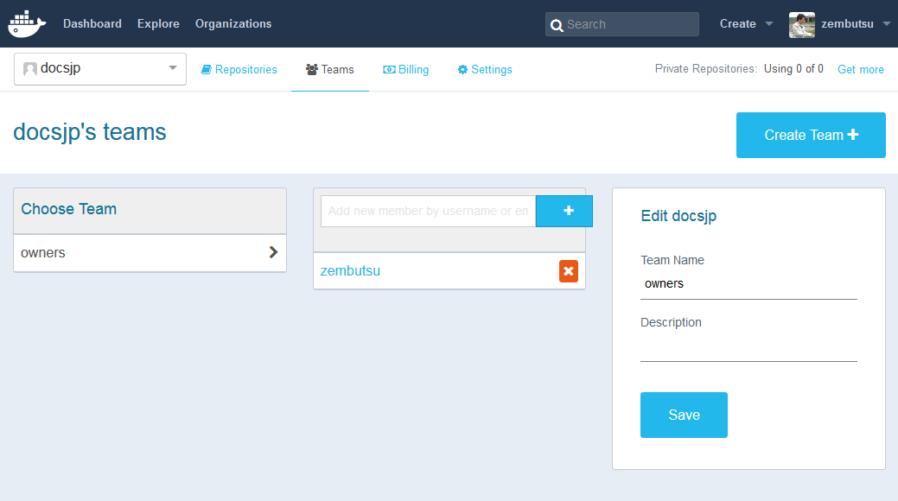
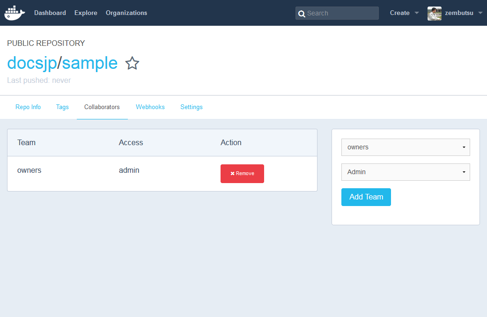

.. -*- coding: utf-8 -*-
.. URL: https://docs.docker.com/docker-hub/orgs/
.. SOURCE: -
   doc version: 1.10
.. check date: 2016/03/11
.. -------------------------------------------------------------------

.. Organizations and teams

.. _organizations-and-teams:

========================================
Organizations と teams (組織とチーム)
========================================

.. Overview

.. _organizations-and-teams-overview:

概要
==========

.. Docker Hub organizations let you create teams so you can give colleagues access to shared image repositories. A Docker Hub organization can contain public and private repositories just like a user account. Access to push or pull for these repositories is allocated by defining teams of users and then assigning team rights to specific repositories. Repository creation is limited to users in the organization owner’s group. This allows you to distribute limited access Docker images, and to select which Docker Hub users can publish new images.

Docker Hub の `organizations <https://hub.docker.com/organizations/>`_  機能は、共有イメージ・リポジトリに仲間がアクセス可能なチームを作成します。Docker Hub の organization には、通常のユーザ・アカウントのように、パブリックかプライベートなリポジトリが含まれます。特定のリポジトリに対してチームの権限を与えられたユーザが、リポジトリに対して送信・取得といったアクセスが可能になります。リポジトリの作成は、organization の所有者グループ（owner group）のみに限定されています。これにより、Docker イメージの配布を限定したままにでき、特定の Docker Hub ユーザが新しいイメージを公開できるように指定できます。

.. Creating and viewing organizations

.. _creating-and-viewing-organizations:

organizations の作成と表示
------------------------------

.. You can see which organizations you belong to and add new organizations by clicking “Organizations” in the top nav bar.

新しい organizations を追加するには、トップ・ナビゲーション・バーの「Organizations」をクリックします。

.. organizations

.. Organization teams

.. _organization-teams:

Organization teams
--------------------

.. Users in the “Owners” team of an organization can create and modify the membership of all teams.

organization の「Owners」チームのユーザが、チーム全体に対するメンバの追加や変更を行えます。

.. Other users can only see teams they belong to.

他のユーザは、チームに所属していれば参照可能となります。

.. teams

.. Repository team permissions

.. _repository-team-permissions:

リポジトリのチーム権限
------------------------------

.. Use teams to manage who can interact with your repositories.

teams（チーム）はリポジトリを操作できるユーザを管理します。

.. You need to be a member of the organization’s “Owners” team to create a new team, Hub repository, or automated build. As an “Owner”, you then delegate the following repository access rights to a team using the “Collaborators” section of the repository view:

新しいチームの作成、Hub リポジトリの作成、自動構築をするには、organization の「Owners」（所有者）チームのメンバである必要があります。「Owner」であれば、対象のリポジトリに対して権限を与えるため、リポジトリの画面で「Collaborators」セクションを選べます。

..    Read access allows a user to view, search, and pull a private repository in the same way as they can a public repository.
    Write access users are able to push to non-automated repositories on the Docker Hub.
    Admin access allows the user to modify the repositories “Description”, “Collaborators” rights, “Public/Private” visibility and “Delete”.

* ``Read`` （読み込み）権限は、ユーザに対してプライベート・リポジトリをパブリック・リポジトリと同じように表示・検索・取得をできるようにします。
* ``Write`` （書き込み）権限は、Docker Hub のリポジトリに対して、手動で送信（push）できるようにします。
* ``Admin`` （管理）権限は、リポジトリに対するユーザの「Description」「Collaborators」権限設定、「Public/Private」の可視性や、「Delete」を行えます。

..    Note: A User who has not yet verified their email address will only have Read access to the repository, regardless of the rights their team membership has given them.

.. note::

   メールアドレスの確認できないユーザは、チームのメンバに所属し適切な権限を割り与えていたとしても、リポジトリに対しては ``Read`` 権限しか与えられません。

.. Organization repository collaborators

.. seealso:: 

   Organizations and teams
      https://docs.docker.com/docker-hub/orgs/
