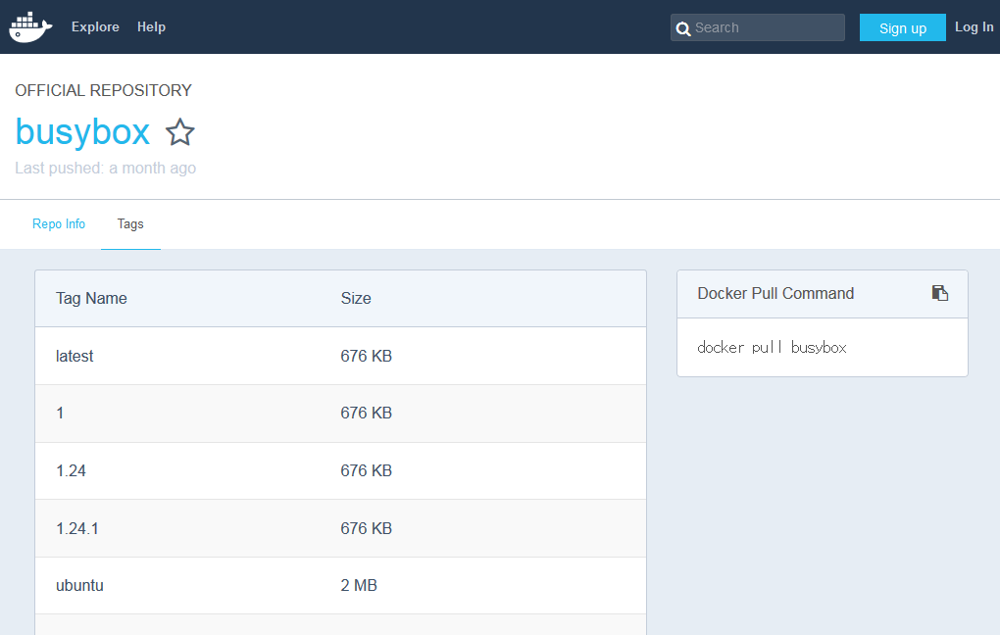

.. -*- coding: utf-8 -*-
.. URL: https://docs.docker.com/docker-hub/repos/
.. SOURCE: -
   doc version: 1.10
.. check date: 2016/03/11
.. -------------------------------------------------------------------

.. title: Repositories on Docker Hub

.. _repositories-on-docker-hub:

========================================
Docker Hub 上のレジストリ
========================================

.. Docker Hub repositories let you share images with co-workers, customers, or the Docker community at large. If you’re building your images internally, either on your own Docker daemon, or using your own Continuous integration services, you can push them to a Docker Hub repository that you add to your Docker Hub user or organization account.

Docker Hub リポジトリは自分のイメージを同僚や顧客と共有するだけでなく、世界中の Docker コミュニティに対して公開します。イメージと内部向けに構築している場合、自分の Docker デーモンか自分たちの継続的インテグレーション・サービスを使い、Docker Hub リポジトリにイメージを送信するでしょう。このとき、Docker Hub のユーザもしくは組織のアカウントで追加できます。

.. Alternatively, if the source code for your Docker image is on GitHub or Bitbucket, you can use an “Automated build” repository, which is built by the Docker Hub services. See the automated builds documentation to read about the extra functionality provided by those services.

あるいは、Docker イメージのソース・コードが GitHub か Bitbucket に置かれているなら、「自動構築（Automated build）」リポジトリが使えます。これは Docker Hub サービスによって自動構築されるものです。これらのサービスが提供する更なる機能については、 :doc:`自動構築のドキュメント <builds>` をご覧ください。

.. repositories

.. image:: ./images/repos.png
   :scale: 60%
   :alt: リポジトリ

.. Searching for images

.. _searching-for-images:

イメージの検索
====================

.. You can search the Docker Hub registry via its search interface or by using the command line interface. Searching can find images by image name, user name, or description:

`Docker Hub <https://hub.docker.com/>`__ レジストリは、検索用インターフェースかコマンドライン・インターフェースを使って検索出来ます。検索は、イメージ名、ユーザ名、説明に対して行えます。

.. code-block:: bash

   $ docker search centos
   NAME                                 DESCRIPTION                                     STARS     OFFICIAL   AUTOMATED
   centos                               The official build of CentOS.                   1034      [OK]       
   ansible/centos7-ansible              Ansible on Centos7                              43                   [OK]
   tutum/centos                         Centos image with SSH access. For the root...   13                   [OK]
   ...

.. There you can see two example results: centos and ansible/centos7-ansible. The second result shows that it comes from the public repository of a user, named ansible/, while the first result, centos, doesn’t explicitly list a repository which means that it comes from the top-level namespace for Official Repositories. The / character separates a user’s repository from the image name.

``centos`` と ``ansible/centos7-ansible`` という、２種類の結果が表示されました。１番目の ``centos`` にはリポジトリ名がありません。つまり、これは :doc:`公式リポジトリ <official_repos>` 向けのトップ・レベル名前空間を意味します。２番目の結果は、 ``ansible/`` という公開リポジトリ名のユーザによるものです。文字 ``/`` によって、ユーザのリポジトリ名とイメージ名を分けています。

.. Once you’ve found the image you want, you can download it with docker pull <imagename>:

欲しいイメージが見つかったら、 ``docker pull <イメージ名>`` でダウンロードできます。

.. code-block:: bash

   $ docker pull centos
   latest: Pulling from centos
   6941bfcbbfca: Pull complete
   41459f052977: Pull complete
   fd44297e2ddb: Already exists
   centos:latest: The image you are pulling has been verified. Important: image verification is a tech preview feature and should not be relied on to provide security.
   Digest: sha256:d601d3b928eb2954653c59e65862aabb31edefa868bd5148a41fa45004c12288
   Status: Downloaded newer image for centos:latest

.. You now have an image from which you can run containers.

イメージを手に入れた後は、コンテナを実行できます。

.. Viewing repository tags

.. _viewing-repository-tags:

リポジトリ・タグの表示
==============================

.. Docker Hub’s repository “Tags” view shows you the available tags and the size of the associated image.

Docker Hub のリポジトリで「Tags」を表示すると、利用可能なタグや関連づけられるイメージの容量が表示されます。

.. Image sizes are the cumulative space taken up by the image and all its parent images. This is also the disk space used by the contents of the Tar file created when you docker save an image.

イメージ容量とは、イメージや親イメージの累積容量です。またこの容量は、イメージを ``docker save`` で中身を tar ファイル化したときの容量もあります。

.. Creating a new repository on Docker Hub

.. _creating-a-new-repository-on-docker-hub:

Docker Hub 上に新しいリポジトリを作成
========================================

.. When you first create a Docker Hub user, you will have a “Get started with Docker Hub.” screen, from which you can click directly into “Create Repository”. You can also use the “Create ▼” menu to “Create Repository”.

Docker Hub ユーザを作成すると、「Get started with Docker Hub」画面が表示されます。ここから「Create Repository」（リポジトリの作成）をクリックします。あるいは「Create ▼」メニューから「Create Repository」を選びます。

.. When creating a new repository, you can choose to put it in your Hub account’s namespace, or that of any organization that you are in the “Owners” team. The Repository Name will need to be unique in that namespace, can be two to 255 characters, and can only contain lowercase letters, numbers or - and _.

新しいリポジトリを作成すると、アカウントの名前空間をそこに使うか、あるいは :doc:`組織 <orgs>` の指定でチームが「所有」するかを選べます。リポジトリ名はユニークな名前空間である必要があり、2文字から255文字までの小文字・数字・ ``-`` ・ ``_`` が利用できます。

.. The “Short Description” of 100 characters will be used in the search results, while the “Full Description” can be used as the Readme for the repository, and can use Markdown to add simple formatting.

「Short Description」（短い説明）の100文字は、検索結果に表示されます。「Full Description」（全ての説明）はリポジトリの Readme に表示されるもので、マークダウンを使って書式を追加できます。

.. After you hit the “Create” button, you then need to docker push images to that Hub based repository.

「Create」ボタンを実行した後、 ``docker push`` コマンドでイメージを Docker Hub リポジトリに送信する必要があります。

.. Pushing a repository image to Docker Hub

.. _pushing-a-repository-image-to-docker-hub:

リポジトリのイメージを Docker Hub に送信
========================================

.. In order to push a repository to the Docker Hub, you need to name your local image using your Docker Hub username, and the repository name that you created in the previous step. You can add multiple images to a repository, by adding a specific :<tag> to it (for example docs/base:testing). If its not specified, the tag defaults to latest. You can name your local images either when you build it, using docker build -t <hub-user>/<repo-name>[:<tag>], by re-tagging an existing local image docker tag <existing-image> <hub-user>/<repo-name>[:<tag>], or by using docker commit <exiting-container> <hub-user>/<repo-name>[:<tag>] to commit changes. See Working with Docker images for a detailed description.

Docker Hub にリポジトリを送信するには、自分のローカル・イメージが Docker Hub のユーザ名を使い、かつ、そのリポジトリ名は前のステップで作成したものである必要があります。これはイメージに対して ``:<タグ>`` を追加することで、リポジトリに複数のイメージを追加できます（例： ``docs/base::testing`` ）。もし指定されなければ、デフォルトのタグは ``latest`` になります。ローカルのイメージに名前を付けるには、 ``docker build -t <Docker Hub ユーザ名>/<リポジトリ名>[:<タグ>]`` の形式になるよう既存のローカル・イメージを ``docker tag <既存イメージ> <docker Hub ユーザ名>/<リポジトリ名>[:<タグ>]`` で再度タグ付けします。あるいは、 ``docker commit <既存のコンテナ名> <Docker Hub ユーザ名>/<リポジトリ名>[:<タグ>]`` でコミットを変更します。詳細については :doc:`Docker イメージの働き </engine/userguide/containers/dockerimages>`  をご覧ください。

.. Now you can push this repository to the registry designated by its name or tag.

これで任意のレジストリに対し、このリポジトリを名前かタグで送信（push）できます。

.. code-block:: bash

   $ docker push <hub-user>/<repo-name>:<tag>

.. The image will then be uploaded and available for use by your team-mates and/or the community.

イメージのアップロードが完了すると、チームメイトが、あるいはコミュニティでも利用可能になります。

.. Stars

.. _repos-stars:

スター
==========

.. Your repositories can be starred and you can star repositories in return. Stars are a way to show that you like a repository. They are also an easy way of bookmarking your favorites.

リポジトリはスターされることができ、あなたがお返しにリポジトリをスターすることもできます。スターはあなたが好きなリポジトリを公開する手法です。また、好きなものをブックマークするのにも簡単な方法です。

.. Comments

.. _repos-comments:

コメント
==========

.. You can interact with other members of the Docker community and maintainers by leaving comments on repositories. If you find any comments that are not appropriate, you can flag them for review.

リポジトリにコメントを残すことで、Docker コミュニティの他のメンバやメンテナと、やりとりできます。適切ではないコメントがあれば、削除用のフラグも付けられます。

.. Collaborators and their role

.. repos-collaborators-and-their-role:

コラボレータとロール
====================

.. A collaborator is someone you want to give access to a private repository. Once designated, they can push and pull to your repositories. They will not be allowed to perform any administrative tasks such as deleting the repository or changing its status from private to public.

コラボレータ（collaborator）とは、プライベート・リポジトリに対するアクセスを与えたい人です。かつてはリポジトリに対して ``push`` や ``pull`` するために設計されました。コラボレータはリポジトリの削除といった管理用のタスクは行えず、プライベートからパブリックにステータスの変更もできません。

..    Note: A collaborator cannot add other collaborators. Only the owner of the repository has administrative access.

.. note::

   コラボレータは他のコラボレータを追加できません。リポジトリの所有者のみが、管理アクセスを持っています。

.. You can also assign more granular collaborator rights (“Read”, “Write”, or “Admin”) on Docker Hub by using organizations and teams. For more information see the organizations documentation.

また、Docker Hub を組織やチームで使う場合は、コラボレータの権限詳細（「Read」「Write」「Admin」のいずれか）を割り当てられます。詳細な情報は、 :doc:`組織に関するドキュメント <orgs>` をご覧ください。

.. Private repositories

プライベート・リポジトリ
==============================

.. Private repositories allow you to have repositories that contain images that you want to keep private, either to your own account or within an organization or team.

プライベート・リポジトリとは、自分のアカウントや組織・チームの中で、プライベートなままにしておきたいイメージを置けるリポジトリです。

.. To work with a private repository on Docker Hub, you will need to add one via the Add Repository button. You get one private repository for free with your Docker Hub user account (not usable for organizations you’re a member of). If you need more accounts you can upgrade your Docker Hub plan.

`Docker Hub <https://hub.docker.com/>`__ 上でプライベート・リポジトリを使うには、 `Add Repository <https://hub.docker.com/add/repository/>`_ ボタンから追加する必要があります。Docker Hub ユーザ・アカウントは１つのプライベート・リポジトリを無料で利用できます（あなたが組織の一員であれば使いづらいでしょう）。さらにアカウントが必要であれば、 `Docker Hub <https://hub.docker.com/account/billing-plans/>`_ プランのアップグレードをご検討ください。

.. Once the private repository is created, you can push and pull images to and from it using Docker.

プライベート・リポジトリが作成されたら、 Docker を使ってイメージの ``push`` と ``pull`` ができるようになります。

..    Note: You need to be signed in and have access to work with a private repository.

.. note::

   プライベート・リポジトリにアクセスして操作するには、Docker Hub にログインしている必要があります。

.. Private repositories are just like public ones. However, it isn’t possible to browse them or search their content on the public registry. They do not get cached the same way as a public repository either.

プライベート・リポジトリはパブリック・リポジトリのように見えます。しかし、パブリック・リポジトリの検索結果には表示されません。同様にパブリック・リポジトリと同じように取得することもできません。

.. It is possible to give access to a private repository to those whom you designate (i.e., collaborators) from its “Settings” page. From there, you can also switch repository status (public to private, or vice-versa). You will need to have an available private repository slot open before you can do such a switch. If you don’t have any available, you can always upgrade your Docker Hub plan.

プライベート・リポジトリにアクセスできるようにするには、「Settings」ページから対象者を指定（例： collaborators）する必要があります。それから、リポジトリの状態を変更します（パブリックをプライベートにしたり、あるいはその逆です）。プライベート・リポジトリに切り替えられるのは、空きスロット分だけです。もし足りない場合は、 `Docker Hub <https://hub.docker.com/account/billing-plans/>`_ プランのアップグレードをご検討ください。

.. Webhooks

.. _repos-webhooks:

ウェブ・フック
====================

.. A webhook is an HTTP call-back triggered by a specific event. You can use a Hub repository webhook to notify people, services, and other applications after a new image is pushed to your repository (this also happens for Automated builds). For example, you can trigger an automated test or deployment to happen as soon as the image is available.

webhook は特定のイベントによって HTTP コールバックを行います（トリガします）。Docker Hub リポジトリの webhook を使って、人々、サービス、他のアプリケーションに対して、自分のリポジトリに新しいイメージが送信されたと知らせることができます（さらに、自動構築も行えます）。例えば、自動テストのトリガとしたり、イメージが利用可能になったらすぐデプロイする使い方です。

.. To get started adding webhooks, go to the desired repository in the Hub, and click “Webhooks” under the “Settings” box. A webhook is called only after a successful push is made. The webhook calls are HTTP POST requests with a JSON payload similar to the example shown below.

webhook を追加するには、Docker Hub 上の任意のリポジトリに移動し、「Setting」ボックスの下にある「Webhooks」をクリックします。webhook が呼び出されるのは、イメージの ``push`` が完了したときです。 webhook コールは JSON 形式の HTTP POST リクエストであり、次のようなものです。

.. Example webhook JSON payload:

   {
     "callback_url": "https://registry.hub.docker.com/u/svendowideit/busybox/hook/2141bc0cdec4hebec411i4c1g40242eg110020/",
     "push_data": {
       "images": [
           "27d47432a69bca5f2700e4dff7de0388ed65f9d3fb1ec645e2bc24c223dc1cc3",
           "51a9c7c1f8bb2fa19bcd09789a34e63f35abb80044bc10196e304f6634cc582c",
           ...
       ],
       "pushed_at": 1.417566822e+09,
       "pusher": "svendowideit"
     },
     "repository": {
       "comment_count": 0,
       "date_created": 1.417566665e+09,
       "description": "",
       "full_description": "webhook triggered from a 'docker push'",
       "is_official": false,
       "is_private": false,
       "is_trusted": false,
       "name": "busybox",
       "namespace": "svendowideit",
       "owner": "svendowideit",
       "repo_name": "svendowideit/busybox",
       "repo_url": "https://registry.hub.docker.com/u/svendowideit/busybox/",
       "star_count": 0,
       "status": "Active"
   }

..    Note: If you want to test your webhook, we recommend using a tool like requestb.in. Also note, the Docker Hub server can’t be filtered by IP address.

.. note::

   自分で webhook をテストしたい場合は、 `requestdb.in <http://requestb.in/>`_ のようなサービスの利用を推奨します。また、Docker Hub サーバは IP アドレスのフィルタができないのでご注意ください。

.. Webhook chains

.. _webhook-chains:

ウェブ・フックの連鎖
------------------------------

.. Webhook chains allow you to chain calls to multiple services. For example, you can use this to trigger a deployment of your container only after it has been successfully tested, then update a separate Changelog once the deployment is complete. After clicking the “Add webhook” button, simply add as many URLs as necessary in your chain.

webhook の連鎖により、複数のサービスにコールを連鎖（chain）できます。例えば、テストが作成するときのみコンテナをデプロイするトリガを行い、デプロイが終わったら別の Changelog を更新します。「Add webhook」ボタンをクリックしたら、単純に連鎖させるために必要な URL を列挙します。

.. The first webhook in a chain will be called after a successful push. Subsequent URLs will be contacted after the callback has been validated.

webhook で１番目の連鎖は、 push が成功した後に実行されます。以降の URL はコールバックが確認されたら処理されます。

.. Validating a callback

.. _validating-a-callback:

コールバックの確認
--------------------

.. In order to validate a callback in a webhook chain, you need to

webhook 連鎖のコールバックを確認するには、次のようにします。

..    Retrieve the callback_url value in the request’s JSON payload.
    Send a POST request to this URL containing a valid JSON body.

1. リクエストする JSON ペイロードに ``callback_url`` 値を入れてから、読み込む
2. 有効な JSON の内容に含まれる URL に対して、POST リクエストが送信

..    Note: A chain request will only be considered complete once the last callback has been validated.

.. note::

  最後のコールバックが正常だった場合のみ、 連鎖リクエストが完了したとみなされます。

.. To help you debug or simply view the results of your webhook(s), view the “History” of the webhook available on its settings page.

webhook のデバッグを簡単にしたり、結果を単に表示したい場合は、設定ページにある webhook の「History」をご覧ください。

.. Callback JSON data

JSON データのコールバック
------------------------------

.. The following parameters are recognized in callback data:

以下のパラメータがコールバック・データとして認められています。

..    state (required): Accepted values are success, failure and error. If the state isn’t success, the webhook chain will be interrupted.
    description: A string containing miscellaneous information that will be available on the Docker Hub. Maximum 255 characters.
    context: A string containing the context of the operation. Can be retrieved from the Docker Hub. Maximum 100 characters.
    target_url: The URL where the results of the operation can be found. Can be retrieved on the Docker Hub.

* ``state`` （必須）： ``success`` 、 ``failure`` 、 ``error`` の値を受信。 ``success`` でなければ、webhook 連鎖は中断。
* ``description`` ：Docker Hub で利用可能な様々な説明を含む文字列。最大255文字。
* ``context`` ：操作に関連するコンテキストを含む文字列。Docker Hub が受信可能。最大100文字。
* ``target_url`` ：オペレーションで得られた結果を送る URL 。Docker Hub が受信可能。

.. Example callback payload:

コールバック・ペイロードの例

.. code-block:: json

   {
     "state": "success",
     "description": "387 tests PASSED",
     "context": "Continuous integration by Acme CI",
     "target_url": "http://ci.acme.com/results/afd339c1c3d27"
   }

.. seealso:: 

   Your Hub repositories
      https://docs.docker.com/docker-hub/repos/
