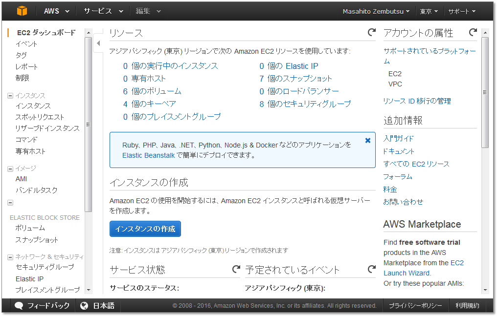
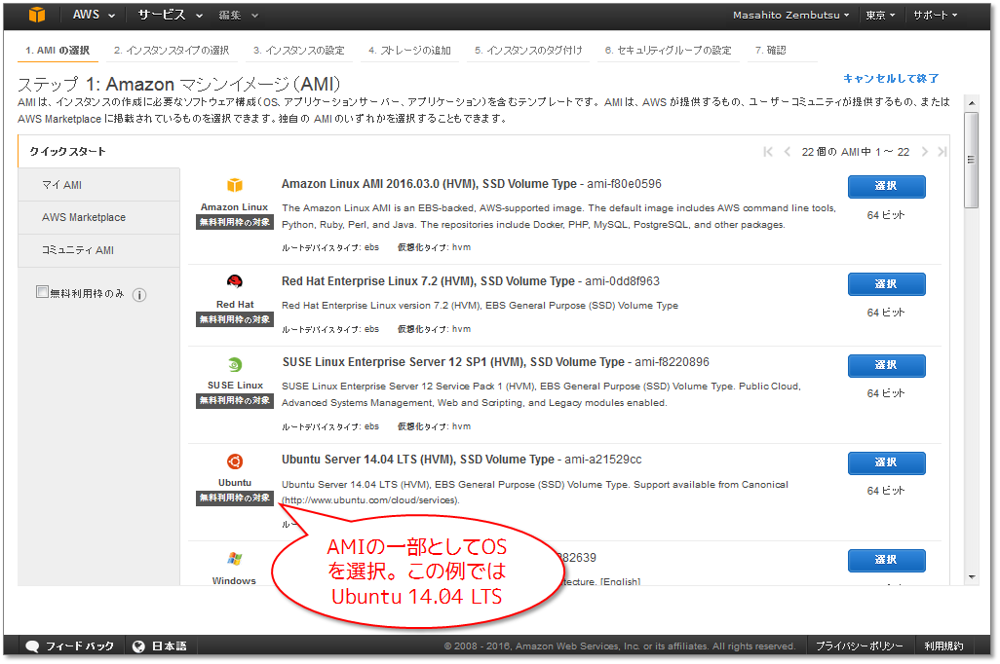
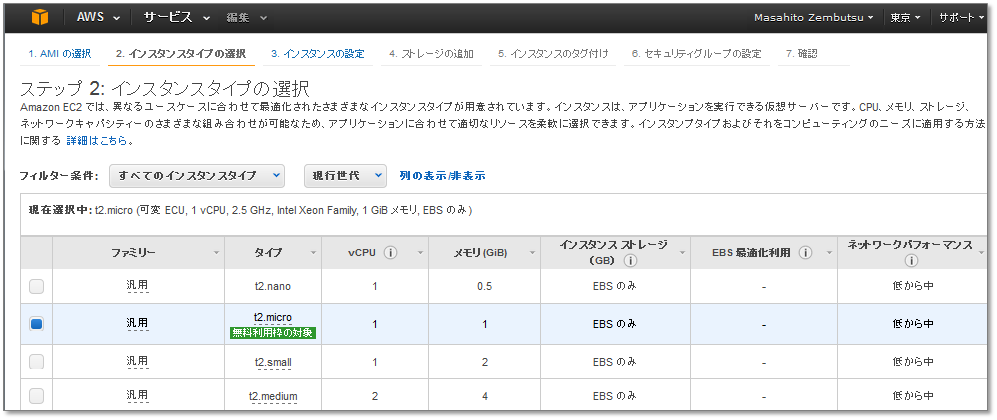
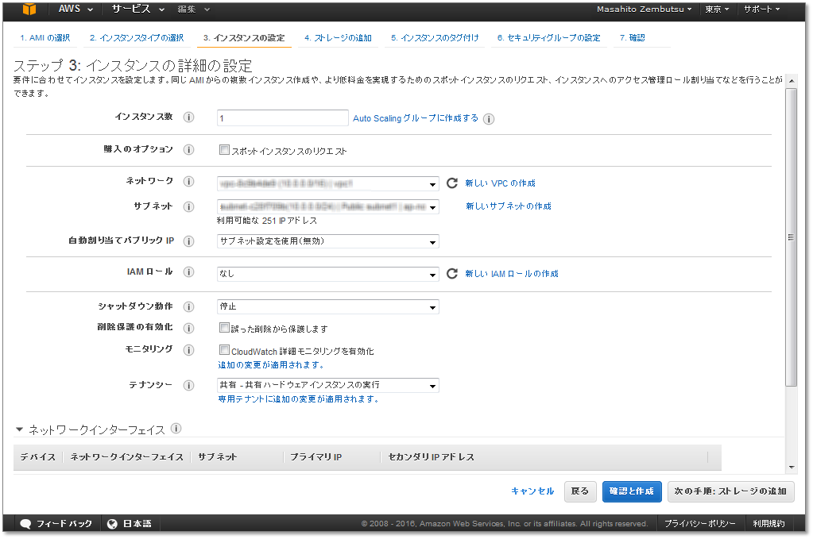

.. -*- coding: utf-8 -*-
.. URL: https://docs.docker.com/engine/installation/cloud/cloud-ex-aws/
.. SOURCE: https://github.com/docker/docker/blob/master/docs/installation/cloud/cloud-ex-aws.md
   doc version: 1.12
      https://github.com/docker/docker/commits/master/docs/installation/cloud/cloud-ex-aws.md
.. check date: 2016/06/13
.. Commits on Feb 11, 2016 4e9e95fe8d9ba177ec77727b6fca558a0ba8f01f
.. -----------------------------------------------------------------------------

.. Example: Manual install on cloud provider

.. _example-aws:

==================================================
例：クラウド・プロバイダに手動インストール
==================================================

.. sidebar:: 目次

   .. contents:: 
       :depth: 3
       :local:

.. You can install Docker Engine directly to servers you have on cloud providers. This example shows how to create an Amazon Web Services (AWS) EC2 instance, and install Docker Engine on it.

クラウド・プロバイダ上にサーバを持っている場合は、そこに Docker Engine を直接インストールできます。以下の例は `Amazon Web Services (AWS)  <https://aws.amazon.com/>`_ EC2 インスタンスを作成し、そこに Docker Engine をインストールします。

.. You can use this same general approach to create Dockerized hosts on other cloud providers.

他のクラウド・プロバイダ上でも、このページと同様の手法で Docker 対応ホストを作成できます。

.. Step 1. Sign up for AWS

.. _step1-sign-up-for-aws:

ステップ１：AWS にサインアップ
==============================

..    If you are not already an AWS user, sign up for AWS to create an account and get root access to EC2 cloud computers. If you have an Amazon account, you can use it as your root user account.

1. AWS ユーザでなければ、 `AWS <https://aws.amazon.com/>`_ にサインアップしてアカウントを作成し、EC2 クラウド・コンピュータに対する管理者権限（root）を準備します。Amazon アカウントを登録したら、そのアカウントの管理者権限を使います。

..    Create an IAM (Identity and Access Management) administrator user, an admin group, and a key pair associated with a region.

2. IAM （Identity and Access Management）管理者ユーザ、管理者グループ、リージョンに関連づけるキーペアを作成します。

..    From the AWS menus, select Services > IAM to get started.

AWS 上のメニューから、 **サービス** > **IAM** を選びます。

..    See the AWS documentation on Setting Up with Amazon EC2. Follow the steps for “Create an IAM User” and “Create a Key Pair”.

AWS のドキュメント `Amazon EC2 でのセットアップ <http://docs.aws.amazon.com/ja_jp/AWSEC2/latest/UserGuide/get-set-up-for-amazon-ec2.html>`_ をご覧ください。この中にある「2. IAM ユーザーを作成する」と「3. キーペアを作成する」の各手順を進めます。

..    If you are just getting started with AWS and EC2, you do not need to create a virtual private cloud (VPC) or specify a subnet. The newer EC2-VPC platform (accounts created after 2013-12-04) comes with a default VPC and subnet in each availability zone. When you launch an instance, it automatically uses the default VPC.

これから AWS や EC2 を始める場合は、VPC (Virtual Private Cloud) 作成やサブネット指定は要りません。新しい EC2-VPC プラットフォーム（2013年12月04日以降に作成）の場合は、アベイラビリティ・ゾーンごとにデフォルトの VPC とサブネットが作成されています。インスタンスを起動すると、自動的にデフォルトの VPC が使われます。

.. Step 2. Configure and start an EC2 instance

.. _step2-configure-and-start-an-ec2-instance:

ステップ２：EC2 インスタンスの設定と起動
========================================

.. Launch an instance to create a virtual machine (VM) with a specified operating system (OS) as follows.

以下の手順では、オペレーティング・システム（OS）を指定して仮想マシン（VM）を作成してから、インスタンスを起動します。

..    Log into AWS with your IAM credentials.

1. IAM ユーザの認証情報で AWS にログインします。

..    On the AWS home page, click EC2 to go to the dashboard, then click Launch Instance.

   AWS ホームページで **EC2** をクリックして、ダッシュボードに移動します。それから **インスタンスの作成** をクリックします。

..    EC2 dashboard

..    AWS EC2 virtual servers are called instances in Amazon parlance. Once you set up an account, IAM user and key pair, you are ready to launch an instance. It is at this point that you select the OS for the VM.

Amazon 用語では、AWS EC2 仮想サーバを *インスタンス（instance）* と呼びます。アカウント、IAM ユーザとキーペアのセットアップを終え、インスタンスの起動準備が整いました。次は仮想マシン上の OS を選択します。

..    Choose an Amazon Machine Image (AMI) with the OS and applications you want. For this example, we select an Ubuntu server.

2. Amazon マシン・イメージ（AMI）で OS とアプリケーションを選びます。今回の例では Ubuntu Server を選びます。

..    Launch Ubuntu

..    Choose an instance type.

3. インスタンス・タイプを選択します。

..    Choose a general purpose instance type

..    Configure the instance.

4. インスタンスの設定をします。

..    You can select the default network and subnet, which are inherently linked to a region and availability zone.

リージョンやアベイラビリティ・ゾーンと実際にリンクするデフォルト・ネットワークとサブネットを選びます。

..    Click Review and Launch.

5. **確認と作成** をクリックします。

..    Select a key pair to use for this instance.

6. このインスタンスで使用するキーペアを選びます。

..    When you choose to launch, you need to select a key pair to use. Save the .pem file to use in the next steps.

作成する前に使用するキーペアを選ぶ必要があります。次のステップで使うための ``.pem`` ファイルを持っている必要があります。

.. The instance is now up-and-running. The menu path to get back to your EC2 instance on AWS is: EC2 (Virtual Servers in Cloud) > EC2 Dashboard > Resources > Running instances.

これでインスタンスが起動し、実行中になりました。AWS の EC2 インスタンスのメニューで確認するには **EC2 (クラウド内の仮想サーバー)** > **EC2 ダッシュボード** > **リソース** > **実行中のインスタンス** を選びます。

.. To get help with your private key file, instance IP address, and how to log into the instance via SSH, click the Connect button at the top of the AWS instance dashboard.

AWS インスタンス・ダッシュボード上の **接続** ボタンをクリックすると、プライベート・キーファイル、インスタンス IP アドレス、SSH でログインするための情報が表示されます。

.. Step 3. Log in from a terminal, configure apt, and get packages

.. _step3-log-in-from-a-terminal:

ステップ３：ターミナルからログインし、aptの設定と、パッケージ取得
======================================================================

..    Log in to the EC2 instance from a command line terminal.

1. コマンドライン上のターミナル（端末）から EC2 インスタンスにログインします。

..    Change directories into the directory containing the SSH key and run this command (or give the path to it as part of the command):

SSH キーを保存しているディレクトリに移動し、次のコマンドを実行します（あるいは、コマンド中でキーのパスを指定します）。

.. code-block:: bash

   $ ssh -i "自分のSSH鍵" ubuntu@xx.xxx.xxx.xxx

..    For our example:

実行例：

.. code-block:: bash

   $ cd ~/Desktop/keys/amazon_ec2
   $ ssh -i "my-key-pair.pem" ubuntu@xx.xxx.xxx.xxx

..    We’ll follow the instructions for installing Docker on Ubuntu at https://docs.docker.com/engine/installation/ubuntulinux/. The next few steps reflect those instructions.

Ubuntu の Docker インストール方法は http://docs.docker.jp/engine/installation/linux/ubuntulinux.html に従います。以下のステップでは、こちらに記載されている手順を繰り返します。

..     Check the kernel version to make sure it’s 3.10 or higher.

2. カーネルのバージョンが 3.10 以上であることを確認します。

.. code-block:: bash

   ubuntu@ip-xxx-xx-x-xxx:~$ uname -r
   3.13.0-48-generic

..    Add the new gpg key.

3. 新しい ``gpg`` キーを追加します。

.. code-block:: bash

   ubuntu@ip-xxx-xx-x-xxx:~$ sudo apt-key adv --keyserver hkp://p80.pool.sks-keyservers.net:80 --recv-keys 58118E89F3A912897C070ADBF76221572C52609D
   Executing: gpg --ignore-time-conflict --no-options --no-default-keyring --homedir /tmp/tmp.jNZLKNnKte --no-auto-check-trustdb --trust-model always --keyring /etc/apt/trusted.gpg --primary-keyring /etc/apt/trusted.gpg --keyserver hkp://p80.pool.sks-keyservers.net:80 --recv-keys 58118E89F3A912897C070ADBF76221572C52609D
   gpg: requesting key 2C52609D from hkp server p80.pool.sks-keyservers.net
   gpg: key 2C52609D: public key "Docker Release Tool (releasedocker) <docker@docker.com>" imported
   gpg: Total number processed: 1
   gpg:               imported: 1  (RSA: 1)

..    Create a docker.list file, and add an entry for our OS, Ubuntu Trusty 14.04 (LTS).

4. ``docker.list`` ファイルを作成し、今回の OS 、Ubuntu Trusty 14.04 (LTS) のエントリを追加します。

.. code-block:: bash

   ubuntu@ip-xxx-xx-x-xxx:~$ sudo vi /etc/apt/sources.list.d/docker.list

..    If we were updating an existing file, we’d delete any existing entries.

既にファイルが存在している場合は、内容を消さずに更新します。

..    Update the apt package index.

5. ``apt`` パッケージのインデックスを更新します。

.. code-block:: bash

   ubuntu@ip-xxx-xx-x-xxx:~$ sudo apt-get update

..    Purge the old repo if it exists.

6. 古いリポジトリが存在している場合はパージします。

..    In our case the repo doesn’t because this is a new VM, but let’s run it anyway just to be sure.

今回の例では新しい仮想マシンを実行したので、このような作業を行う必要はありません。ですが、念のために確認してみましょう。

.. code-block:: bash

   ubuntu@ip-xxx-xx-x-xxx:~$ sudo apt-get purge lxc-docker
   Reading package lists... Done
   Building dependency tree       
   Reading state information... Done
   Package 'lxc-docker' is not installed, so not removed
   0 upgraded, 0 newly installed, 0 to remove and 139 not upgraded.

..    Verify that apt is pulling from the correct repository.

7. 適切なリポジトリから ``apt`` で取得できることを確認します。

.. code-block:: bash

    ubuntu@ip-172-31-0-151:~$ sudo apt-cache policy docker-engine
    docker-engine:
    Installed: (none)
    Candidate: 1.9.1-0~trusty
    Version table:
    1.9.1-0~trusty 0
    500 https://apt.dockerproject.org/repo/ ubuntu-trusty/main amd64 Packages
    1.9.0-0~trusty 0
    500 https://apt.dockerproject.org/repo/ ubuntu-trusty/main amd64 Packages
        . . .

..    From now on when you run apt-get upgrade, apt pulls from the new repository.

``apt-get update`` や ``apt`` を実行すると、新しいリポジトリから取得します。

.. Step 4. Install recommended prerequisites for the OS

.. _step4-install-recommended-prerequisites:

ステップ４：OS 用の推奨環境をインストール
==================================================

.. For Ubuntu Trusty (and some other versions), it’s recommended to install the linux-image-extra kernel package, which allows you use the aufs storage driver, so we’ll do that now.

Ubuntu Trusty （と古いバージョンのいくつか）では ``linux-image-extra`` カーネル・パッケージのインストールが推奨されています。これは ``aufs`` ストレージ・ドライバを使えるようにします。インストールは次のように実行します。

.. code-block:: bash

   ubuntu@ip-xxx-xx-x-xxx:~$ sudo apt-get update
   ubuntu@ip-172-31-0-151:~$ sudo apt-get install linux-image-extra-$(uname -r)

.. Step 5. Install Docker Engine on the remote instance

.. _step5-install-docker-engine:

ステップ５：Docker Engine をリモート・インスタンス上にインストール
======================================================================

..     Update the apt package index.

1.  パッケージのインデックスを更新します。

.. code-block:: bash

   ubuntu@ip-xxx-xx-x-xxx:~$ sudo apt-get update

..    Install Docker Engine.

2. Docker Engine をインストールします。

.. code-block:: bash

   ubuntu@ip-xxx-xx-x-xxx:~$ sudo apt-get install docker-engine
   Reading package lists... Done
   Building dependency tree       
   Reading state information... Done
   The following extra packages will be installed:
   aufs-tools cgroup-lite git git-man liberror-perl
   Suggested packages:
   git-daemon-run git-daemon-sysvinit git-doc git-el git-email git-gui gitk
   gitweb git-arch git-bzr git-cvs git-mediawiki git-svn
   The following NEW packages will be installed:
   aufs-tools cgroup-lite docker-engine git git-man liberror-perl
   0 upgraded, 6 newly installed, 0 to remove and 139 not upgraded.
   Need to get 11.0 MB of archives.
   After this operation, 60.3 MB of additional disk space will be used.
   Do you want to continue? [Y/n] y
   Get:1 http://us-west-1.ec2.archive.ubuntu.com/ubuntu/ trusty/universe aufs-tools amd64 1:3.2+20130722-1.1 [92.3 kB]
   Get:2 http://us-west-1.ec2.archive.ubuntu.com/ubuntu/ trusty/main liberror-perl all 0.17-1.1 [21.1 kB]
   . . .

..    Start the Docker daemon.

3. Docker デーモンを起動します。

.. code-block:: bash

   ubuntu@ip-xxx-xx-x-xxx:~$ sudo service docker start

..    Verify Docker Engine is installed correctly by running docker run hello-world.

4. ``docker run hello-world`` を実行し、Docker Engine が正常にインストールされていることを確認します。

.. code-block:: bash

   ubuntu@ip-xxx-xx-x-xxx:~$ sudo docker run hello-world
   ubuntu@ip-172-31-0-151:~$ sudo docker run hello-world
   Unable to find image 'hello-world:latest' locally
   latest: Pulling from library/hello-world
   b901d36b6f2f: Pull complete
   0a6ba66e537a: Pull complete
   Digest: sha256:8be990ef2aeb16dbcb9271ddfe2610fa6658d13f6dfb8bc72074cc1ca36966a7
   Status: Downloaded newer image for hello-world:latest
   
   Hello from Docker.
   This message shows that your installation appears to be working correctly.
   
   To generate this message, Docker took the following steps:
   1. The Docker client contacted the Docker daemon.
   2. The Docker daemon pulled the "hello-world" image from the Docker Hub.
   3. The Docker daemon created a new container from that image which runs the executable that produces the output you are currently reading.
   4. The Docker daemon streamed that output to the Docker client, which sent it to your terminal.
   
   To try something more ambitious, you can run an Ubuntu container with:
   $ docker run -it ubuntu bash
   
   Share images, automate workflows, and more with a free Docker Hub account:
   https://hub.docker.com
   
   For more examples and ideas, visit:
   https://docs.docker.com/userguide/

.. Where to go next

次はどこへ行きますか
====================

.. Looking for a quicker way to do Docker cloud installs and provision multiple hosts? You can use Docker Machine to provision hosts.

Docker をクラウド上でより簡単に、かつ、複数のホストを自動構築する方法をお探しですか。 :doc:`Docker Machine </machine/overview>` を使えばホストを自動構築できます。

..    Use Docker Machine to provision hosts on cloud providers
..    Docker Machine driver reference
..    Install Docker Engine
..    Docker User Guide

* :doc:`/machine/get-started-cloud/`
* :doc:`/machine/drivers/index`
* :doc:`/engine/installation/index`
* :doc:`/engine/userguide/intro`

.. seealso:: 

   Example: Manual install on cloud provider
      https://docs.docker.com/engine/installation/cloud/cloud-ex-aws/

