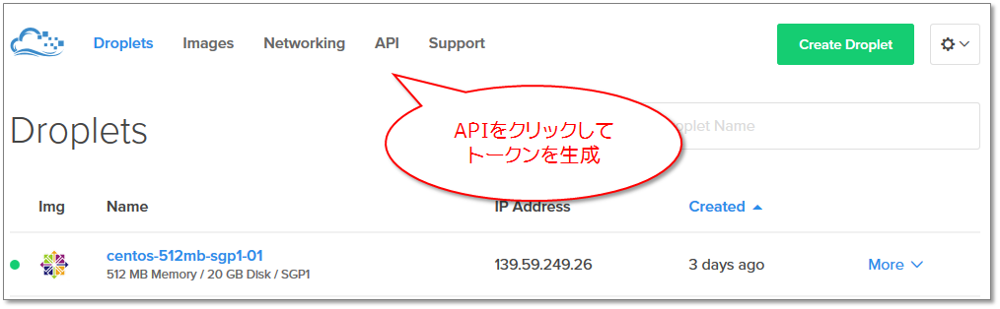
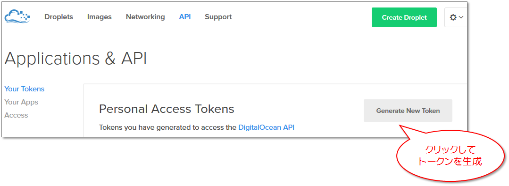
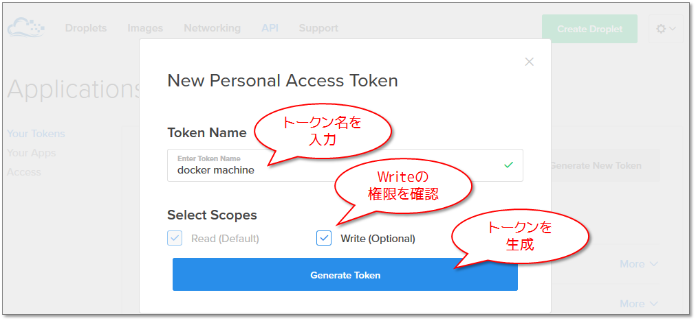
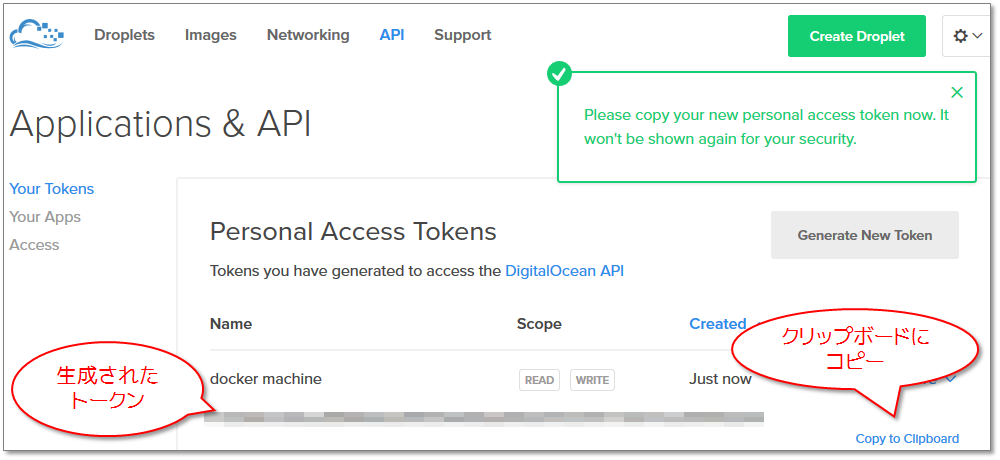
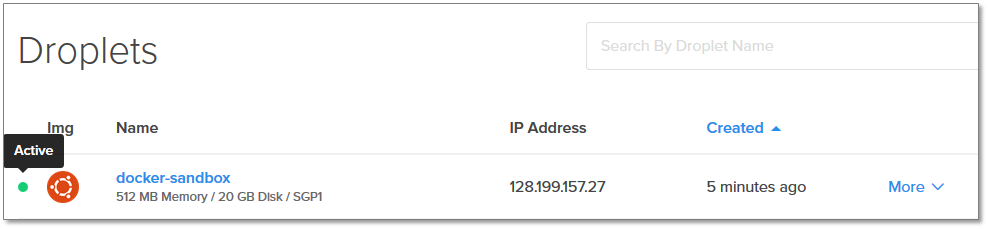
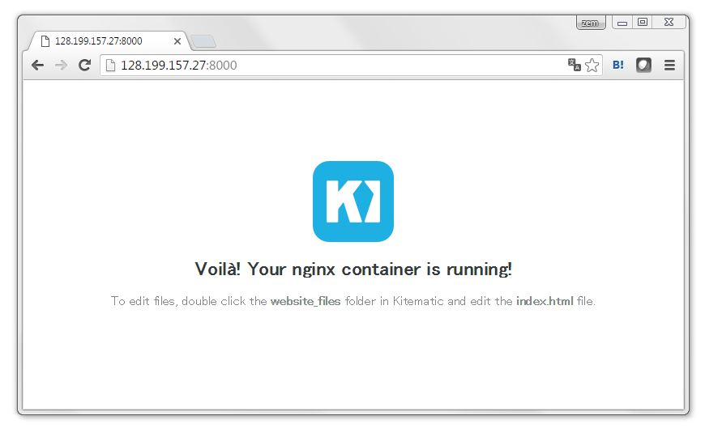

.. -*- coding: utf-8 -*-
.. URL: https://docs.docker.com/engine/installation/cloud/cloud-ex-machine-ocean/
.. SOURCE: https://github.com/docker/docker/blob/master/docs/installation/cloud/cloud-ex-machine-ocean.md
   doc version: 1.12
      https://github.com/docker/docker/commits/master/docs/installation/cloud/cloud-ex-machine-ocean.md
.. check date: 2016/06/13
.. Commits on Feb 11, 2016 4e9e95fe8d9ba177ec77727b6fca558a0ba8f01f
.. -----------------------------------------------------------------------------

.. Example: Use Docker Machine to provision cloud hosts

.. _example-digitalocean:

==================================================
例：Docker Machine でクラウド・ホストを自動構築
==================================================

.. sidebar:: 目次

   .. contents:: 
       :depth: 3
       :local:

.. Docker Machine driver plugins are available for many cloud platforms, so you can use Machine to provision cloud hosts. When you use Docker Machine for provisioning, you create cloud hosts with Docker Engine installed on them.

Docker Machine ドライバ・プラグインは多くのクラウド・プラットフォームに対応しています。Docker Machine を使えばクラウド・ホストをプロビジョン（自動構築）できます。Docker Machine でプロビジョニングすると、Docker Engine がインストールされたクラウド・ホストを作成します。

.. You’ll need to install and run Docker Machine, and create an account with the cloud provider.

必要なのは Docker Machine のインストールと実行、そして、クラウド・プロバイダのアカウントです。

.. Then you provide account verification, security credentials, and configuration options for the providers as flags to docker-machine create. The flags are unique for each cloud-specific driver. For instance, to pass a Digital Ocean access token, you use the --digitalocean-access-token flag.

それから、アカウント認証やセキュリティ証明書を取得し、 ``docker-machine create`` でプロバイダ用のオプションをフラグとして指定します。フラグはクラウド・プロバイダによって違います。例えば Digital Ocean のアクセス・トークンを指定するには ``--digitalocean-access-token`` フラグを使います。

.. As an example, let’s take a look at how to create a Dockerized Digital Ocean Droplet (cloud server).

それでは、例として Docker に対応した `Digital Ocean <https://digitalocean.com/>`_ ドロップレット（クラウド・サーバ）の作成方法を見ていきましょう。

.. Step 1. Create a Digital Ocean account and log in

.. _step1-create-a-digital-ocean-account-and-log-in:

ステップ１：Digital Ocean アカウントの作成とログイン
============================================================

.. If you have not done so already, go to Digital Ocean, create an account, and log in.

`Digital Ocean`_ のアカウントを持っていなければ、サイトに移動してアカウントを作成し、ログインします。

.. Step 2. Generate a personal access token

.. _step2-generate-a-personal-access-token:

ステップ２：パーソナル・アクセス・トークンの生成
==================================================

.. To generate your access token:

アクセス・トークンを生成します。

..     Go to the Digital Ocean administrator console and click API in the header.

1. Digital Ocean 管理コンソールに移動し、ヘッダの **API** をクリックします。

..    Click API in Digital Ocean console

..    Click Generate New Token to get to the token generator.

2. **Generate New Token** （新しいトークンの作成）をクリックし、トークンを生成します。

..    Generate token

..    Give the token a clever name (e.g. “machine”), make sure the Write (Optional) checkbox is checked, and click Generate Token.

3. トークンに適切な名前（例：「machine」）を付け **Write (Optional)** のチェックボックスにチェックを入れ、 **Generate Token** （トークン生成）をクリックします。

..    Name and generate token

..    Grab (copy to clipboard) the generated big long hex string and store it somewhere safe.

4. 生成された HEX （16進数の文字列）を取得（クリップボードにコピー）し、どこか安全な場所に保管します。

..    Copy and save personal access token

..    This is the personal access token you’ll use in the next step to create your cloud server.

ここで作成したパーソナル・アクセス・トークンは、次のステップでクラウド・サーバを作成するために使います。

.. Step 3. Install Docker Machine

.. _step3-install-docker-machine:

ステップ３：Docker Machine のインストール
==================================================

..    If you have not done so already, install Docker Machine on your local host.

..        How to install Docker Machine on Mac OS X
        How to install Docker Machine on Windows
        Install Docker Machine directly (e.g., on Linux)

1. Docker Machine をローカルの環境に入ってなければ、インストールします。

* :doc:`Mac OS X に Docker Machine をインストール </engine/installation/mac>`
* :doc:`Windows に Docker Machine をインストール </engine/installation/windows>`
* :doc:`Docker Machine を直接インストール </machine/install-machine/>` （例：Linux 等）

..    At a command terminal, use docker-machine ls to get a list of Docker Machines and their status.

2. コマンド・ターミナル上で ``docker-machine ls`` を使い Docker Machine の一覧と状態を表示します。

.. code-block:: bash

   $ docker-machine ls
   NAME      ACTIVE   DRIVER       STATE     URL                         SWARM
   default   *        virtualbox   Running   tcp:////xxx.xxx.xx.xxx:xxxx  

..    Run some Docker commands to make sure that Docker Engine is also up-and-running.

3. Docker コマンドを実行して、 Docker Engine が起動・実行中であることを確認します。

..    We’ll run docker run hello-world again, but you could try docker ps, docker run docker/whalesay cowsay boo, or another command to verify that Docker is running.

``docker run hello-world`` を実行でしますが、 ``docker ps``  や ``docker run docker/whalesay cowsay boo`` など他のコマンドでも Docker が動いていることを確認できます。

.. code-block:: bash

   $ docker run hello-world
   
   Hello from Docker.
   This message shows that your installation appears to be working correctly.
   ...

.. Step 4. Use Machine to Create the Droplet

.. _step4-use-machine-to-create-the-droplet:

ステップ４：Machine でドロップレットの作成
==================================================

..    Run docker-machine create with the digitalocean driver and pass your key to the --digitalocean-access-token flag, along with a name for the new cloud server.

1. ``docker-machine create`` で ``digitalocean`` ドライバを指定します。また、
``--digitalocean-access-token`` フラグでトークンの指定と、新しいクラウド・サーバの名前も指定します。

..    For this example, we’ll call our new Droplet “docker-sandbox”.

次の例では「docker-sandbox」という名称の新しいドロップレットを作成します。

.. code-block:: bash

   $ docker-machine create --driver digitalocean --digitalocean-access-token xxxxx docker-sandbox
   Running pre-create checks...
   Creating machine...
   (docker-sandbox) OUT | Creating SSH key...
   (docker-sandbox) OUT | Creating Digital Ocean droplet...
   (docker-sandbox) OUT | Waiting for IP address to be assigned to the Droplet...
   Waiting for machine to be running, this may take a few minutes...
   Machine is running, waiting for SSH to be available...
   Detecting operating system of created instance...
   Detecting the provisioner...
   Provisioning created instance...
   Copying certs to the local machine directory...
   Copying certs to the remote machine...
   Setting Docker configuration on the remote daemon...
   To see how to connect Docker to this machine, run: docker-machine env docker-sandbox

..    When the Droplet is created, Docker generates a unique SSH key and stores it on your local system in ~/.docker/machines. Initially, this is used to provision the host. Later, it’s used under the hood to access the Droplet directly with the docker-machine ssh command. Docker Engine is installed on the cloud server and the daemon is configured to accept remote connections over TCP using TLS for authentication.

ドロップレットの作成時、Docker はユニークな SSH 鍵を生成し、それを自分のローカルシステム上の ``~/.docker/machines`` の中に保存します。まず、これを使ってホストをプロビジョニン（自動作成）します。後から ``docker-machine ssh`` コマンドでドロップレットに直接接続する時にも、水面下で用います。クラウド・サーバ上には Docker Engine がインストールされており、TLS 認証を使った TCP を経由してリモートからの接続を受け付けるよう設定されています。

..    Go to the Digital Ocean console to view the new Droplet.

2. Digital Ocean のコンソールに移動し、新しいドロップレットを確認します。

..    Droplet in Digital Ocean created with Machine

..    At the command terminal, run docker-machine ls.

3. コマンド・ターミナルで ``docker-machine ls`` を実行します。

.. code-block:: bash

   $ docker-machine ls
   NAME             ACTIVE   DRIVER         STATE     URL                         SWARM
   default          *        virtualbox     Running   tcp://192.168.99.100:2376   
   docker-sandbox   -        digitalocean   Running   tcp://45.55.139.48:2376     

..    Notice that the new cloud server is running but is not the active host. Our command shell is still connected to the default machine, which is currently the active host as indicated by the asterisk (*).

新しいクラウド・サーバは実行中ですが、アクティブなホストではないのに注意してください。現時点では、まだ default マシンに対してシェルが接続されている状態です。アクティブ・ホストにはアスタリスク（*）印が付いています。

..    Run docker-machine env docker-sandbox to get the environment commands for the new remote host, then run eval as directed to re-configure the shell to connect to docker-sandbox.

``docker-machine env docker-sandbox`` を実行し、新しいリモート・ホストを参照するための環境変数を取得します。 ``eval`` を使えば直接 ``docker-sandbox`` に接続するようシェル上の設定を変更します。

.. code-block:: bash

   $ docker-machine env docker-sandbox
   export DOCKER_TLS_VERIFY="1"
   export DOCKER_HOST="tcp://45.55.222.72:2376"
   export DOCKER_CERT_PATH="/Users/victoriabialas/.docker/machine/machines/docker-sandbox"
   export DOCKER_MACHINE_NAME="docker-sandbox"
   # Run this command to configure your shell:
   # eval "$(docker-machine env docker-sandbox)"
   
   $ eval "$(docker-machine env docker-sandbox)"

..    Re-run docker-machine ls to verify that our new server is the active machine, as indicated by the asterisk (*) in the ACTIVE column.

5. 再び ``docker-machine ls`` を実行し、新しいサーバの ATCIVE 列にアスタリスク印（*）が付き、アクティブなホストになっていることを確認します。

.. code-block:: bash

   $ docker-machine ls
   NAME             ACTIVE   DRIVER         STATE     URL                         SWARM
   default          -        virtualbox     Running   tcp://192.168.99.100:2376   
   docker-sandbox   *        digitalocean   Running   tcp://45.55.222.72:2376     

..    Run some docker-machine commands to inspect the remote host. For example, docker-machine ip <machine> gets the host IP adddress and docker-machine inspect <machine> lists all the details.

6. ``docker-machine`` コマンドを再び使い、リモートホストの状態を調べます。例えば、 ``docker-machine ip <マシン名>`` はホストの IP アドレスを取得します。 ``docker-machine inspect <マシン名>`` は全ての詳細を表示します。

.. code-block:: bash

   $ docker-machine ip docker-sandbox
   104.131.43.236
   
   $ docker-machine inspect docker-sandbox
   {
       "ConfigVersion": 3,
       "Driver": {
       "IPAddress": "104.131.43.236",
       "MachineName": "docker-sandbox",
      "SSHUser": "root",
       "SSHPort": 22,
       "SSHKeyPath": "/Users/samanthastevens/.docker/machine/machines/docker-sandbox/id_rsa",
       "StorePath": "/Users/samanthastevens/.docker/machine",
       "SwarmMaster": false,
       "SwarmHost": "tcp://0.0.0.0:3376",
       "SwarmDiscovery": "",
       ...

..    Verify Docker Engine is installed correctly by running docker commands.

7. Docker Engine が正常にインストールされたかを確認するため、 ``docker`` コマンドを実行します。

..    Start with something basic like docker run hello-world, or for a more interesting test, run a Dockerized webserver on your new remote machine.

``docker run hello-world`` のような基本的なコマンドを実行します。あるいは、新しいリモート・マシン上に Docker 化したウェブ・サーバの実行という、より面白いテストを行いましょう。

..    In this example, the -p option is used to expose port 80 from the nginx container and make it accessible on port 8000 of the docker-sandbox host.

この例では ``nginx`` コンテナのポート 80 を公開するために ``-p`` オプションを使います。また、 ``docker-sandbox`` ホスト上のポート ``8000`` からアクセス可能なようにします。

.. code-block:: bash

   $ docker run -d -p 8000:80 --name webserver kitematic/hello-world-nginx
   Unable to find image 'kitematic/hello-world-nginx:latest' locally
   latest: Pulling from kitematic/hello-world-nginx
   a285d7f063ea: Pull complete
   2d7baf27389b: Pull complete
    ...
   Digest: sha256:ec0ca6dcb034916784c988b4f2432716e2e92b995ac606e080c7a54b52b87066
   Status: Downloaded newer image for kitematic/hello-world-nginx:latest
   942dfb4a0eaae75bf26c9785ade4ff47ceb2ec2a152be82b9d7960e8b5777e65

..    In a web browser, go to http://<host_ip>:8000 to bring up the webserver home page. You got the <host_ip> from the output of the docker-machine ip <machine> command you ran in a previous step. Use the port you exposed in the docker run command.

ウェブブラウザで ``http://<ホストIP>:8000`` に移動し、ウェブサーバのホームページを表示します。 ``<ホストIP>`` の情報は、先ほどのステップにあった ``docker-machine ip <マシン名>`` で確認できます。どのポートが公開のために使われているかを調べるには ``docker run`` をコマンドを実行します。

..    nginx webserver

.. Understand the defaults and options on the create command

.. _understand-the-defaults-and-options-on-the-create-command:

create コマンドのデフォルト・オプションを理解する
--------------------------------------------------

.. For convenience, docker-machine will use sensible defaults for choosing settings such as the image that the server is based on, but you override the defaults using the respective flags (e.g. --digitalocean-image). This is useful if, for example, you want to create a cloud server with a lot of memory and CPUs (by default docker-machine creates a small server). For a full list of the flags/settings available and their defaults, see the output of docker-machine create -h at the command line. See also Driver options and operating system defaults and information about the create command in the Docker Machine documentation.

利便性を高めるため、 ``docker-machine`` には各サーバを起動するために、イメージ名の指定など実用的なデフォルト・オプションを適用しています。しかし、オプションはそれぞれのフラグ（例： ``--digitalocean`` ）を指定して上書きできます。クラウドサーバに多くのメモリや CPU を使いたい時に便利です（デフォルトの ``docker-machine`` は小さなホストを作成します）。利用可能なフラグや設定の詳細に関しては、Docker Machine ドキュメントの  :doc:`/machine/drivers/os-base` や :doc:`/machine/reference/create` をご覧ください。

.. Step 5. Use Machine to remove the Droplet

.. _step5-use-machine-to-remove-the-droplet:

ステップ５：Machine でドロップレットを削除
==================================================

.. To remove a host and all of its containers and images, first stop the machine, then use docker-machine rm:

ホストやコンテナおよびイメージを削除するには、まずマシンを停止し、それから ``docker-machine rm`` を使います。

.. code-block:: bash

   $ docker-machine stop docker-sandbox
   $ docker-machine rm docker-sandbox
   Do you really want to remove "docker-sandbox"? (y/n): y
   Successfully removed docker-sandbox
   
   $ docker-machine ls
   NAME      ACTIVE   DRIVER       STATE     URL                         SWARM
   default   *        virtualbox   Running   tcp:////xxx.xxx.xx.xxx:xxxx

.. If you monitor the Digital Ocean console while you run these commands, you will see it update first to reflect that the Droplet was stopped, and then removed.

Docker Ocean コンソールを開いていると、コマンドを実行したら状況が反映されます。 Droplete が停止した後に削除されるのが見えるでしょう。

.. If you create a host with Docker Machine, but remove it through the cloud provider console, Machine will lose track of the server status. So please use the docker-machine rm command for hosts you create with docker-machine --create.

Docker Machine でホストを作成しても、クラウド・プロバイダのコンソールを通しても削除できます。ただし、Docker Machine は状態を追跡できなくなります。そのため、 ``docker-machine --create`` コマンドでホストを作成した場合は、 ``docker-machine rm`` コマンドを実行してホストを削除します。

.. Where to go next

次はどこへ行きますか
====================

..    Docker Machine driver reference
..    Docker Machine Overview
..    Use Docker Machine to provision hosts on cloud providers
..    Install Docker Engine
..    Docker User Guide

* :doc:`/machine/drivers/index`
* :doc:`/machine/overview`
* :doc:`/machine/get-started-cloud/`
* :doc:`/engine/installation/index`
* :doc:`/engine/userguide/intro`

.. seealso:: 

   Example: Use Docker Machine to provision cloud hosts
      https://docs.docker.com/engine/installation/cloud/cloud-ex-machine-ocean/

