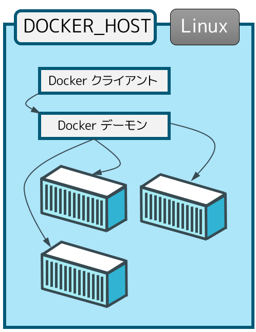
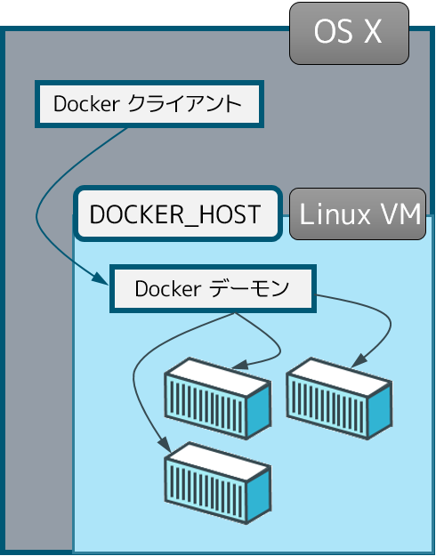
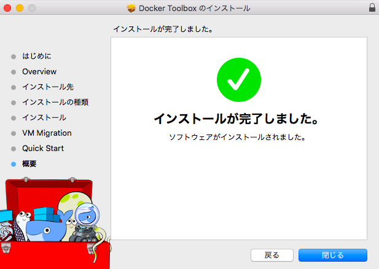
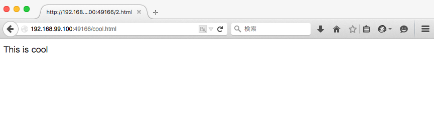

.. -*- coding: utf-8 -*-
.. URL: https://docs.docker.com/engine/installation/mac/
.. SOURCE: https://github.com/docker/docker/blob/master/docs/installation/mac.md
   doc version: 1.12
      https://github.com/docker/docker/commits/master/docs/installation/mac.md
.. check date: 2016/06/13
.. Commits on Mar 18, 2016 3c6aa163a3fd04c344a2072ab379f0778734b269
.. -----------------------------------------------------------------------------

.. Mac OS X

==============================
Mac OS X
==============================

.. sidebar:: 目次

   .. contents:: 
       :depth: 3
       :local:

..    Note: This release of Docker deprecates the Boot2Docker command line in favor of Docker Machine. Use the Docker Toolbox to install Docker Machine as well as the other Docker tools.

.. note::

   今回の Docker のリリース（1.9）から、Boot2Docker コマンドライン・ツールに換わり、Docker Toolbox （ツールボックス）が採用されています。Docker Toolbox を使い、Docker Machine のような Docker ツールをインストールします。

.. You install Docker using Docker Toolbox. Docker Toolbox includes the following Docker tools:

Docker を Docker Toolbox を使いインストールします。Docker Toolbox には次の Docker ツールが含まれます。

..    Docker Machine for running the docker-machine binary
    Docker Engine for running the docker binary
    Docker Compose for running the docker-compose binary
    Kitematic, the Docker GUI
    a shell preconfigured for a Docker command-line environment
    Oracle VM VirtualBox

* Docker Machine を動かす ``docker-machine`` バイナリ
* Docker エンジンを動かす ``docker`` バイナリ
* Docker Compose を動かす ``docker-compose`` バイナリ
* Docker GUI の Kitematic （カイトマティック）
* Oracle VM VirtualBox（バーチャルボックス）

.. Because the Docker daemon uses Linux-specific kernel features, you can’t run Docker natively in OS X. Instead, you must use docker-machine to create and attach to a virtual machine (VM). This machine is a Linux VM that hosts Docker for you on your Mac.

Docker デーモンは Linux 固有の kernel 機能を使う為、OS X 上で Docker をネイティブに実行できません。そのかわり ``docker-machine`` を使い、仮想マシン（VM）の作成と接続が可能です。このマシンは Linuxの仮想マシンであり、自分の Mac 上の Docker ホストとなります。

.. Requirements

動作条件
--------------------

.. Your Mac must be running OS X 10.8 “Mountain Lion” or newer to install the Docker Toolbox.

Docker Toolbox を Mac にインストールするには、 OS X 10.8 "Mountain Lion" 以上が必要です。

.. Learn the key concepts before installing

インストール前に重要な概念を学ぶ
----------------------------------------

.. In a Docker installation on Linux, your physical machine is both the localhost and the Docker host. In networking, localhost means your computer. The Docker host is the computer on which the containers run.

Linux 上への Docker のインストールにおいて、自分の物理マシンとはローカルホストと Docker ホストの両方を意味します。ネットワークでは、ローカルホストは自分のコンピュータを意味します。Docker ホストはコンテナを実行するためのコンピュータです。

.. On a typical Linux installation, the Docker client, the Docker daemon, and any containers run directly on your localhost. This means you can address ports on a Docker container using standard localhost addressing such as localhost:8000 or 0.0.0.0:8376.

典型的な Linux インストールは、自分のローカルホスト上で直接 Docker クライアント、Docker デーモン、そして、あらゆるコンテナを動かします。つまり、Docker コンテナは ``localhost:8000`` や ``0.0.0.0:8376`` のような一般的なポートを割り当てて使います。

.. In an OS X installation, the docker daemon is running inside a Linux VM called default. The default is a lightweight Linux VM made specifically to run the Docker daemon on Mac OS X. The VM runs completely from RAM, is a small ~24MB download, and boots in approximately 5s.

OS X でのインストールは、 ``default`` という名前の Linux 仮想マシン内で ``docker`` デーモンを実行します。 ``default`` とは軽量な Linux 仮想マシンであり、とりわけ Mac OS X 上で Docker デーモンを実行するために作られました。仮想マシンは RAM から実行され、24MB 程度をダウンロードし、起動まで約５秒です。

.. In OS X, the Docker host address is the address of the Linux VM. When you start the VM with docker-machine it is assigned an IP address. When you start a container, the ports on a container map to ports on the VM. To see this in practice, work through the exercises on this page.

OS X では、Docker ホストのアドレスは Linux VM のアドレスです。仮想マシンを ``docker-machine`` で開始すると、IP アドレスが割り当てられます。コンテナを起動すると、コンテナ上のポートは仮想マシン上のポートに割り当てられます。このページの練習を通して、この仕組みに慣れましょう。

.. Installation

インストール
--------------------

.. If you have VirtualBox running, you must shut it down before running the installer.

VirtualBox を実行中の場合、インストーラを実行する前に停止する必要があります。

..    Go to the Docker Toolbox page.

1. `Docker Toolbox <https://www.docker.com/toolbox>`_ のページに移動します。

..    Click the installer link to download.

2. インストーラのリンクをクリックします。

..    Install Docker Toolbox by double-clicking the package or by right-clicking and choosing “Open” from the pop-up menu.

3. Docker Toolbox をインストールするために、パッケージをダブルクリックするか、右クリックして出てくるポップアップ・メニューから「開く」を選びます。

..    The installer launches the “Install Docker Toolbox” dialog.

インストーラは「Docker Toolbox のインストール」ダイアログを開きます。

.. image:: ./images/mac-welcome-page.png
   :alt: Docker Toolbox のインストール

..    Press “Continue” to install the toolbox.

4. 「続ける」を押して Toolbox をインストールします。

..    The installer presents you with options to customize the standard installation.

インストーラは標準インストールに対するカスタマイズ用オプションを提供しています。

.. image:: ./images/mac-page-2.png
   :alt: カスタマイズ画面

..    By default, the standard Docker Toolbox installation:
        installs binaries for the Docker tools in /usr/local/bin
        makes these binaries available to all users
        installs VirtualBox; or updates any existing installation

デフォルトは、標準 Docker Toolbox の標準インストールです。

* Docker ツールのバイナリを ``/usr/local/bin`` にインストールします。
* バイナリを全てのユーザが使えるようにします。
* VirtualBox をインストールします。あるいは、インストール済みであればバージョンアップを行います。

..    Change these defaults by pressing “Customize” or “Change Install Location.”

変更したい場合は「カスタマイズ」や「インストール先を変更」します。

..    Press “Install” to perform the standard installation.

5. 「インストール」を押すと、標準インストールが始まります。

..    The system prompts you for your password.

システム・プロンプトがパスワード入力を促します。

.. image:: ./images/mac-password-prompt.png
   :alt: パスワード・プロンプト画面

..    Provide your password to continue with the installation.

6. インストールを続けるには、パスワードを入力します。

..  When it completes, the installer provides you with some information you can use to complete some common tasks.

完了すると、インストーラは一般的な作業に関する表示を行います。

..    Press “Close” to exit.

7. 「閉じる」をクリックすると終了します。

.. Running a Docker Container

Docker コンテナの実行
==============================

.. To run a Docker container, you:

Docker コンテナを実行するには、次のようにします。

..    create a new (or start an existing) Docker virtual machine
    switch your environment to your new VM
    use the docker client to create, load, and manage containers

* 新しい Docker 仮想マシンを作成（あるいは、既存のものを開始）
* 環境を新しい仮想マシンに切り替え
* ``docker`` クライアントを使ってコンテナの作成・読み込み・管理

.. Once you create a machine, you can reuse it as often as you like. Like any VirtualBox VM, it maintains its configuration between uses.

マシンを作成してしまえば、好きなときに再利用できます。VirtualBox の仮想マシンのように、用途に応じた設定で使い分けます。

.. There are two ways to use the installed tools, from the Docker Quickstart Terminal or from your shell.

インストールしたツールを使うには２つの方法があります。Docker Quickstart Terminal （クイックスタート・ターミナル）を使うか、 :ref:`シェル <mac-from-your-shell>` で操作します。

.. From the Docker Quickstart Terminal

Docker Quickstart Terminal から使う
----------------------------------------

..    Open the “Applications” folder or the “Launchpad”.

1. 「アプリケーション」フォルダから「Launchpad」を開きます。

..     Find the Docker Quickstart Terminal and double-click to launch it.

2. Docker Quickstart Terminal を探し、クリックして起動します。

..    The application:
        opens a terminal window
        creates a default VM if it doesn’t exists, and starts the VM after
        points the terminal environment to this VM

アプリケーションは次の動作をします：

* ターミナル用のウインドウを開く
* ``default`` 仮想マシンが無ければ作成し、仮想マシンを起動
* ターミナルの環境がこの仮想マシンを示す

..    Once the launch completes, the Docker Quickstart Terminal reports:

起動が完了すると、Docker Quickstart Terminal は次のように表示します。

.. image:: ./images/mac-success.png
   :alt: すべて完了です。

..    Now, you can run docker commands.

これで ``docker`` コマンドが実行できます。

..    Verify your setup succeeded by running the hello-world container.

3. セットアップの成功を確認するため、 ``hello-world`` コンテナを実行します。

.. code-block:: bash

   $ docker run hello-world
   Unable to find image 'hello-world:latest' locally
   511136ea3c5a: Pull complete
   31cbccb51277: Pull complete
   e45a5af57b00: Pull complete
   hello-world:latest: The image you are pulling has been verified.
   Important: image verification is a tech preview feature and should not be
   relied on to provide security.
   Status: Downloaded newer image for hello-world:latest
   Hello from Docker.
   This message shows that your installation appears to be working correctly.

..    To generate this message, Docker took the following steps:

このメッセージ表示にあたり、Docker は次のステップを踏んでいます。

..    1. The Docker client contacted the Docker daemon.

1. Docker クライアントは Docker デーモンに接続します。

..    2. The Docker daemon pulled the "hello-world" image from the Docker Hub. (Assuming it was not already locally available.)

2. Docker デーモンは「hello-world」イメージを Docker Hub から取得します（まだローカルにイメージがないのを想定しています）。

..    3. The Docker daemon created a new container from that image which runs the executable that produces the output you are currently reading.

3. そのイメージを使い、Docker デーモンは新しいコンテナを作成します。コンテナを実行すると、先ほど見たような出力をします。

..    4. The Docker daemon streamed that output to the Docker client, which sent it  to your terminal.

4. Docker デーモンは Docker クライアントに出力を流し込み、自分のターミナル上に送ります。

..    To try something more ambitious, you can run an Ubuntu container with:

では、期待を持ちながら Ubuntu コンテナを実行しましょう。

.. code-block:: bash

   $ docker run -it ubuntu bash

.. For more examples and ideas, visit:http://docs.docker.com/userguide/

更なる例や考え方については、 :doc:`ユーザガイド </engine/userguide/index>` をご覧ください。

.. A more typical way to interact with the Docker tools is from your regular shell command line.

もう１つの典型的な Docker ツールを使う方法が、通常のシェル・コマンドラインからです。

.. _mac-from-your-shell:

.. From your shell

シェルから使う
--------------------

.. This section assumes you are running a Bash shell. You may be running a different shell such as C Shell but the commands are the same.

このセクションでは、Bash シェルの実行を想定しています。C シェルのような別のシェルでも、コマンドは同じです。

..    Create a new Docker VM.

1. 新しい Docker 仮想マシンを作成します。

.. code-block:: bash

   $ docker-machine create --driver virtualbox default
   Creating VirtualBox VM...
   Creating SSH key...
   Starting VirtualBox VM...
   Starting VM...
   To see how to connect Docker to this machine, run: docker-machine env default

..    This creates a new default VM in VirtualBox.

ここでは VirtualBox に新しい ``default`` 仮想マシンを作成します。

..    The command also creates a machine configuration in the ~/.docker/machine/machines/default directory. You only need to run the create command once. Then, you can use docker-machine to start, stop, query, and otherwise manage the VM from the command line.

また、このコマンドはマシンの設定を ``~/.docker/machine/machines/default`` ディレクトリに作成します。必要なのは、実行時に ``create`` コマンドを一度実行するだけです。あとは、 ``docker-machine`` を使って開始、停止、問い合わせできます。それだけでなく、コマンドライン上から仮想マシンを管理します。

..    List your available machines.

2. 利用可能なマシン一覧を表示します。

.. code-block:: bash

   $ docker-machine ls
   NAME                ACTIVE   DRIVER       STATE     URL                         SWARM
   default             *        virtualbox   Running   tcp://192.168.99.101:2376

..    If you have previously installed the deprecated Boot2Docker application or run the Docker Quickstart Terminal, you may have a dev VM as well. When you created default VM, the docker-machine command provided instructions for learning how to connect the VM.

廃止予定の Boot2Docker アプリケーションをインストールしているか、あるいは Docker Quickstart Terminal を実行している場合は ``dev`` 仮想マシンが同様に表示されます。 ``default`` 仮想マシンを作成したら、 ``docker-machine`` コマンドを通して仮想マシンへの接続方法を確認します。

..    Get the environment commands for your new VM.

3. 新しい仮想マシンに対応する環境変数を取得します。

.. code-block:: bash

   $ docker-machine env default
   export DOCKER_TLS_VERIFY="1"
   export DOCKER_HOST="tcp://192.168.99.101:2376"
   export DOCKER_CERT_PATH="/Users/mary/.docker/machine/machines/default"
   export DOCKER_MACHINE_NAME="default"
   # Run this command to configure your shell:
   # eval "$(docker-machine env default)"

..    Connect your shell to the default machine.

4. シェルから ``default`` マシンに接続します。

.. code-block:: bash

   $ eval "$(docker-machine env default)"

..    Run the hello-world container to verify your setup.

5. ``hello-world`` コンテナを実行し、セットアップが正常かどうか確認します。

.. code-block:: bash

   $ docker run hello-world

.. Learn about your Toolbox installation

Toolbox のインストールを学ぶ
==============================

.. Toolbox installs the Docker Engine binary, the Docker binary on your system. When you use the Docker Quickstart Terminal or create a default VM manually, Docker Machine updates the ~/.docker/machine/machines/default folder to your system. This folder contains the configuration for the VM.

Toolbox は Docker エンジンのバイナリをシステム上にインストールします。Docker Quickstart Terminal を使うか、 ``default`` 仮想マシンを（Docker Machine で）手動で作成すると、Docker Machine はシステム上の ``~/.docker/machine/machines/default`` ディレクトリを更新します。このディレクトリに、仮想マシンに関する設定が置かれます。

.. You can create multiple VMs on your system with Docker Machine. Therefore, you may end up with multiple VM folders if you have more than one VM. To remove a VM, use the docker-machine rm <machine-name> command.

Docker Machine を使い、システム上に複数の仮想マシンを作成できます。つまり、いくつも仮想マシンを作成すると、複数の仮想マシン用のディレクトリが作られます。仮想マシンを削除するには、 ``docker-machine rm <マシン名>`` コマンドを使います。

.. Migrate from Boot2Docker

Boot2Docker からの移行
==============================

.. If you were using Boot2Docker previously, you have a pre-existing Docker boot2docker-vm VM on your local system. To allow Docker Machine to manage this older VM, you can migrate it.

これまで Boot2Docker を使っていた場合は、既に Dockerの ``boot2docker-vm`` 仮想マシンがローカルシステム上に存在しています。Docker Machine で古い仮想マシンを管理する場合は、移行が必要です。

..    Open a terminal or the Docker CLI on your system.
..    Type the following command.

1. ターミナルか、システム上の Docker CLI を開きます。
2. 次のコマンドを実行します。

.. code-block:: bash

    $ docker-machine create -d virtualbox --virtualbox-import-boot2docker-vm boot2docker-vm docker-vm

..    Use the docker-machine command to interact with the migrated VM.

3. ``docker-machine`` コマンドを使い、対話式に仮想マシンを移行します。

.. The docker-machine subcommands are slightly different than the boot2docker subcommands. The table below lists the equivalent docker-machine subcommand and what it does:

``docker-machine`` サブコマンドは、``boot2docker`` サブコマンドと若干の違いがあります。次の表は ``docker-machine`` サブコマンドとの互換性を比較したものです。

.. list-table::
   :widths: 25 25 50
   :header-rows: 1

   * - ``boot2docker``
     - ``docker-machine``
     - ``docker-machine`` の説明
   * - init
     - create
     - 新しい docker ホストの作成
   * - up
     - start
     - 停止しているマシンの起動
   * - ssh
     - ssh
     - コマンドの実行やマシンとの双方向 ssh セッション
   * - save
     - ー
     - 利用不可
   * - down
     - stop
     - 実行中のマシンの停止
   * - poweroff
     - stop
     - 実行中のマシンの停止
   * - reset
     - restart
     - 実行中のマシンの再起動
   * - config
     - inspect
     - マシン設定詳細の表示
   * - status
     - ls
     - マシン一覧と状態の表示
   * - info
     - inspect
     - マシンの詳細を表示
   * - ip
     - ip
     - マシンの IP アドレスを表示
   * - shellinit
     - env
     - シェルがマシンと対話するために必要なコマンドの表示
   * - delete
     - rm
     - マシンの削除
   * - download
     - ー
     - 利用不可
   * - upgrade
     - uppgrade
     - マシン上の Docker クライアントを最新安定版に更新

.. Example of Docker on Mac OS X

Mac OS X の Docker 実行例
==============================

.. Work through this section to try some practical container tasks on a VM. At this point, you should have a VM running and be connected to it through your shell. To verify this, run the following commands:

このセクションを通して、仮想マシン上に実践的なコンテナ・タスクに挑戦しましょう。この時点では、仮想マシンが実行中であり、シェル上から接続している状態でしょう。確認するには、次のコマンドを実行します。

.. code-block:: bash

   $ docker-machine ls
   NAME                ACTIVE   DRIVER       STATE     URL                         SWARM
   default             *        virtualbox   Running   tcp://192.168.99.100:2376

.. The ACTIVE machine, in this case default, is the one your environment is pointing to.

``ACTIVE`` なマシン、この例では ``default`` に対する環境変数が指定されています。

.. Access container ports

コンテナのポートに接続
------------------------------

..    Start an NGINX container on the DOCKER_HOST.

1. DOCKER_HOST 上で NGINX コンテナを開始します。

.. code-block:: bash

   $ docker run -d -P --name web nginx

..    Normally, the docker run commands starts a container, runs it, and then exits. The -d flag keeps the container running in the background after the docker run command completes. The -P flag publishes exposed ports from the container to your local host; this lets you access them from your Mac.

通常の ``docker run`` コマンドは、コンテナを起動し、実行して、終了します。 ``-d`` フラグは ``docker run`` コマンドを実行したあとも、バックグラウンドでコンテナを実行し続けます。 ``-P`` フラグはコンテナ内の露出用ポートをローカルのホスト上に公開します。つまり、自分の Mac からアクセスできるようにします。

..    Display your running container with docker ps command

2. 実行中のコンテナを ``docker ps`` コマンドで表示します。

.. code-block:: bash

   CONTAINER ID        IMAGE               COMMAND                CREATED             STATUS              PORTS                                           NAMES
   5fb65ff765e9        nginx:latest        "nginx -g 'daemon of   3 minutes ago       Up 3 minutes        0.0.0.0:49156->443/tcp, 0.0.0.0:49157->80/tcp   web

..    At this point, you can see nginx is running as a daemon.

今まさに ``nginx`` がデーモンとして実行中なのが分かります。

..    View just the container’s ports.

3. コンテナのポートを表示します。

.. code-block:: bash

   $ docker port web
   443/tcp -> 0.0.0.0:49156
   80/tcp -> 0.0.0.0:49157

..     This tells you that the web container’s port 80 is mapped to port 49157 on your Docker host.

この表示の意味は、 ``web`` コンテナのポート ``80`` 番を Docker ホスト側のポート ``49157`` に割り当てています。

..    Enter the http://localhost:49157 address (localhost is 0.0.0.0) in your browser:

4. ブラウザで ``http://localhost:49157`` アドレス（ ``localhost`` は ``0.0.0.0`` ）を開きます。

.. image:: ./images/bad_host.png
   :alt: エラー画面

.. This didn’t work. The reason it doesn’t work is your DOCKER_HOST address is not the localhost address (0.0.0.0) but is instead the address of your Docker VM.

これは動作しません。理由は、 ``DOCKER_HOST`` のアドレスはローカルホストのアドレス（0.0.0.0）ではないためです。そのかわり Docker 仮想マシンのアドレスを使います。

..    Get the address of the default VM.

5. ``default`` VM のアドレスを取得します。

.. code-block:: bash

   $ docker-machine ip default
   192.168.59.103

..     Enter the http://192.168.59.103:49157 address in your browser:

6. ブラウザのアドレスに ``http://192.168.59.103:49157`` を入力します。

.. image:: ./images/good_host.png
   :alt: 正しいアドレス

..    Success!

成功です！

..    To stop and then remove your running nginx container, do the following:

7. 実行している ``nginx`` コンテナを停止・削除するには、次のように実行します。

.. code-block:: bash

   $ docker stop web
   $ docker rm web

.. Mount a volume on the container

コンテナにボリュームをマウント
------------------------------

.. When you start a container it automatically shares your /Users/username directory with the VM. You can use this share point to mount directories onto your container. The next exercise demonstrates how to do this.

コンテナを実行すると、自動的に ``/Users/ユーザ名`` ディレクトリを仮想マシンと共有します。この共有ポイントを使い、コンテナの中にディレクトリとしてマウントできます。以下の例では、実際に動くのを確認します。

..    Change to your user $HOME directory.

1. ``$HOME`` ディレクトリに移動します。

.. code-block:: bash

   $ cd $HOME

..     Make a new site directory.

2. 新しく ``site`` ディレクトリを作成します。

.. code-block:: bash

   $ mkdir site

..    Change into the site directory.

3. ``site`` ディレクトリに移動します。

.. code-block:: bash

   $ cd site

..    Create a new index.html file.

4. 新しく ``index.html`` ファイルを作成します。

.. code-block:: bash

   $ echo "my new site" > index.html

..    Start a new nginx container and replace the html folder with your site directory.

5. 新しく ``nginx`` コンテナを開始し、 ``html`` ディレクトリを ``site`` ディレクトリに置き換えます。

.. code-block:: bash

   $ docker run -d -P -v $HOME/site:/usr/share/nginx/html \
     --name mysite nginx

..     Get the mysite container’s port.

6. ``mysite`` コンテナのポートを取得します。

.. code-block:: bash

   $ docker port mysite
   80/tcp -> 0.0.0.0:49166
   443/tcp -> 0.0.0.0:49165

..    Open the site in a browser:

7. サイトをブラウザで開きます。

.. image:: ./images/newsite_view.png

..    Try adding a page to your $HOME/site in real time.

8. ``$HOME/site``  ディレクトリに新しいページをリアルタイムに追加します。

.. code-block:: bash

   $ echo "This is cool" > cool.html

..    Open the new page in the browser.

9. 新しいページをブラウザで開きます。

..    Stop and then remove your running mysite container.

10. 実行している ``mysite`` コンテナを停止・削除します。

.. code-block:: bash

   $ docker stop mysite
   $ docker rm mysite

Docker Toolbox のアップグレード
========================================

.. To upgrade Docker Toolbox, download an re-run the Docker Toolbox installer.

Docker Toolbox をアップグレードするには、 `Docker Toolbox インストーラ <https://docker.com/toolbox/>`_ をダウンロードし、再度実行します。

.. Uninstall Docker Toolbox

Docker Toolbox のアンインストール
========================================

.. To uninstall, do the following:

アンインストールは次のように行います。

..    List your machines.

1. マシン一覧を表示ます。

.. code-block:: bash

   $ docker-machine ls
   NAME                ACTIVE   DRIVER       STATE     URL                         SWARM
   dev                 *        virtualbox   Running   tcp://192.168.99.100:2376
   my-docker-machine            virtualbox   Stopped
   default                      virtualbox   Stopped

..   Remove each machine.

2. 各マシンを削除します。

.. code-block:: bash

   $ docker-machine rm dev
   Successfully removed dev

..    Removing a machine deletes its VM from VirtualBox and from the ~/.docker/machine/machines directory.

マシンの削除とは、VirtualBox から自身の仮想マシンを削除し、 ``~/.docker/machine/machines`` からも削除します。

..    Remove the Docker Quickstart Terminal and Kitematic from your “Applications” folder.

3. Docker Quickstart Terminal と Kitematic を「アプリケーション」フォルダから削除します。

..    Remove the docker, docker-compose, and docker-machine commands from the /usr/local/bin folder.

4. ``/usr/local/bin`` ディレクトリから ``docker``、``docker-compose`` 、``docker-machine`` を削除します。

.. code-block:: bash

   $ rm /usr/local/bin/docker

..    Delete the ~/.docker folder from your system.

5. システム上の ``~/.docker`` ディレクトリを削除します。

.. Learning more

更に詳しく
====================

.. Use docker-machine help to list the full command line reference for Docker Machine. For more information about using SSH or SCP to access a VM, see the Docker Machine documentation.

``docker-machine help`` を実行すると、Docker Machine の全てのコマンド一覧を表示します。SSH や SCP で仮想マシンにアクセスするなど詳細な情報は、 :doc:`Docker Machine ドキュメント </machine/index>` をご覧ください。

.. You can continue with the Docker User Guide. If you are interested in using the Kitematic GUI, see the Kitematic user guide.

:doc:`Docker ユーザガイド </engine/userguide/index>` を読み続けられます。 Kitematic GUI の使用に興味があれば、 :doc:`Kitematic ユーザガイド </kitematic/userguide/index>` をご覧ください。

.. seealso:: 

   Installation on Mac OS X
      https://docs.docker.com/engine/installation/mac/
