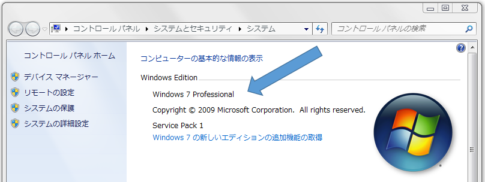
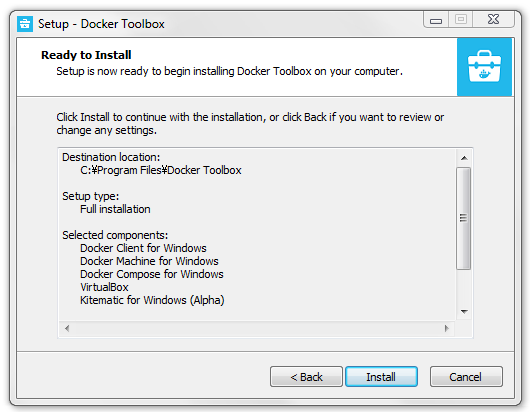
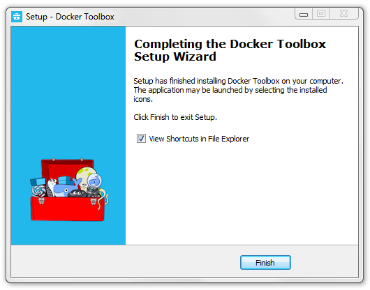

.. -*- coding: utf-8 -*-
.. https://docs.docker.com/engine/installation/windows/
.. SOURCE: https://github.com/docker/docker/blob/master/docs/installation/windows.md
   doc version: 1.12
      https://github.com/docker/docker/commits/master/docs/installation/windows.md
.. check date: 2016/06/13
.. Commits on Jun 2, 2016 c1be45fa38e82054dcad606d71446a662524f2d5
.. -----------------------------------------------------------------------------

.. Windows

==============================
Windows
==============================

.. sidebar:: 目次

   .. contents:: 
       :depth: 3
       :local:

..    Note: This release of Docker deprecates the Boot2Docker command line in favor of Docker Machine. Use the Docker Toolbox to install Docker Machine as well as the other Docker tools.

.. note::

   今回の Docker のリリース（1.9）から、Boot2Docker コマンドライン・ツールに換わり、Docker Toolbox （ツールボックス）が採用されています。Docker Toolbox を使い、Docker Machine のような Docker ツールをインストールします。

.. You install Docker using Docker Toolbox. Docker Toolbox includes the following Docker tools:

Docker を Docker Toolbox を使いインストールします。Docker Toolbox には次の Docker ツールが含まれます。

..    Docker Machine for running the docker-machine binary
    Docker Engine for running the docker binary
    Docker Compose for running the docker-compose binary
    Kitematic, the Docker GUI
    a shell preconfigured for a Docker command-line environment
    Oracle VM VirtualBox

* Docker Machine を動かす ``docker-machine`` バイナリ
* Docker エンジンを動かす ``docker`` バイナリ
* Docker Compose を動かす ``docker-compose`` バイナリ
* Docker GUI の Kitematic （カイトマティック）
* Oracle VM VirtualBox（バーチャルボックス）

.. Because the Docker daemon uses Linux-specific kernel features, you can’t run Docker natively in OS X. Instead, you must use docker-machine to create and attach to a virtual machine (VM). This machine is a Linux VM that hosts Docker for you on your Mac.

Docker デーモンは Linux 固有の kernel 機能を使う為、Windows 上で Docker をネイティブに実行できません。そのかわり ``docker-machine`` を使い、仮想マシン（VM）の作成と接続が可能です。このマシンは Linuxの仮想マシンであり、自分の Windows 上の Docker ホストとなります。

.. The Docker VM is lightweight Linux virtual machine made specifically to run the Docker daemon on Windows. The VirtualBox VM runs completely from RAM, is a small ~24MB download, and boots in approximately 5s.

Docker 仮想マシンとは、Docker デーモンを Windows 上で動かすための軽量な Linux 仮想マシンです。VirtualBox は仮想マシンを RAM から実行し、24MB 程度をダウンロードし、起動まで約５秒です。

.. Requirements

動作条件
====================

.. Your machine must be running Windows 7 or newer to run Docker. To find out what version of Windows you have:

.. To run Docker, your machine must have a 64-bit operating system running Windows 7 or higher. Additionally, you must make sure that virtualization is enabled on your machine. To verify your machine meets these requirements, do the following:

Docker を実行するには、Windows 7 以上が動作する 64 ビットのオペレーティング・システム必要です。さらに、マシン上の仮想化が有効になっているかを確認してください。Windows のバージョンは次のようにして確認します。

.. Right click the Windows Start Menu and choose System.

1. Windows のスタートメニューを右クリックし、「システム」を選びます（あるいは、コントロールパネルからシステムを開きます）。

.. If you are using an unsupported version of Windows, you should consider upgrading your operating system in order to try out Docker.

サポートされていない Windows のバージョンだった場合、Docker を試すには OS のアップグレードをご検討ください。

.. Make sure your CPU supports virtualization technology and virtualization support is enabled in BIOS and recognized by Windows.

2. CPU が `仮装化技術 <https://ja.wikipedia.org/wiki/X86%E4%BB%AE%E6%83%B3%E5%8C%96>`_ をサポートしていること、BIOS の設定で仮想化をサポートしていること、Windows によって認識されていることを確認します。

.. For Windows 8, 8.1 or 10

Windows 8, 8.1, 10 の場合
------------------------------

.. Choose Start > Task Manager. On Windows 10, click more details. Navigate to the Performance tab. Under CPU you should see the following:

「スタート」から「タスクマネージャ」を選びます。Windows 10 の場合はクリックして詳細が出ます。「パフォーマンス」タブを探し、「CPU」の仮想化の項目が有効になっているのを確認します。

..    If virtualization is not enabled on your system, follow the manufacturer’s instructions for enabling it.

仮想化がシステム上で有効でなければ、PC メーカーの指示（マニュアル等）に従って有効化してください。

.. For Windows 7

Windows 7 の場合
--------------------

..     Run the Microsoft® Hardware-Assisted Virtualization Detection Tool and follow the on-screen instructions.

`Microsoft® のハードウェア支援による仮想化の検出ツール <https://www.microsoft.com/en-us/download/details.aspx?id=592>`_ を実行し、画面の指示に従います。

3. Verify your Windows OS is 64-bit (x64)

3. Windows の OS が 64 ビット（x64）であることを確認します。

.. How you do this verification depends on your Windows version. For details, see the Windows article How to determine whether a computer is running a 32-bit version or 64-bit version of the Windows operating system.

どのように確認するかは使っている Windows のバージョンに依存します。詳細については、 `コンピューターは、32 ビット版または 64 ビット バージョンの Windows オペレーティング システムを実行しているかどうかを確認する方法 <https://support.microsoft.com/ja-jp/kb/827218>`_ をご覧ください。

..    Note: If you have Docker hosts running and you don’t wish to do a Docker Toolbox installation, you can install the docker.exe using the unofficial Windows package manager Chocolatey. For information on how to do this, see Docker package on Chocolatey.

.. note::

   Docker が動くホストを持っており、Docker Toolbox のインストールをしたくない場合は、非公式 Windows パッケージ・マネージャの Chocolatey を使い ``docker.exe`` をインストールできます。詳細な情報は `Chocolatey にある Docker パッケージ <https://www.microsoft.com/en-us/download/details.aspx?id=592>`_ をご覧ください。

.. Learn the key concepts before installing

インストール前に重要な概念を学ぶ
----------------------------------------

.. In a Docker installation on Linux, your physical machine is both the localhost and the Docker host. In networking, localhost means your computer. The Docker host is the computer on which the containers run.

Linux 上への Docker のインストールにおいて、自分の物理マシンとはローカルホストと Docker ホストの両方を意味します。ネットワークでは、ローカルホストは自分のコンピュータを意味します。Docker ホストはコンテナを実行するためのコンピュータです。

.. On a typical Linux installation, the Docker client, the Docker daemon, and any containers run directly on your localhost. This means you can address ports on a Docker container using standard localhost addressing such as localhost:8000 or 0.0.0.0:8376.

典型的な Linux インストールは、自分のローカルホスト上で直接 Docker クライアント、Docker デーモン、そして、あらゆるコンテナを動かします。つまり、Docker コンテナは ``localhost:8000`` や ``0.0.0.0:8376`` のような一般的なポートを割り当てて使います。

.. image:: ./images/linux_docker_host.png
   :scale: 60%
   :alt: Linux アーキテクチャ図

.. In a Windows installation, the docker daemon is running inside a Linux virtual machine. You use the Windows Docker client to talk to the Docker host VM. Your Docker containers run inside this host.

Windows のインストールでは、Linux 仮想マシンの中に ``docker`` デーモンを動かします。Windows の Docker クライアントを使い、Docker ホストの仮想マシンと通信します。このホストの中でコンテナは実行されます。

.. image:: ./images/win_docker_host.png
   :scale: 60%
   :alt: Windows のアーキテクチャ図

.. In Windows, the Docker host address is the address of the Linux VM. When you start the VM with docker-machine it is assigned an IP address. When you start a container, the ports on a container map to ports on the VM. To see this in practice, work through the exercises on this page.

Windows では、Docker ホストのアドレスは Linux VM のアドレスです。仮想マシンを ``docker-machine`` で開始すると、IP アドレスが割り当てられます。コンテナを起動すると、コンテナ上のポートは仮想マシン上のポートに割り当てられます。このページの練習を通して、この仕組みに慣れましょう。

.. Installation

インストール
--------------------

.. If you have VirtualBox running, you must shut it down before running the installer.

VirtualBox を実行中の場合、インストーラを実行する前に停止する必要があります。

..    Go to the Docker Toolbox page.

1. `Docker Toolbox <https://www.docker.com/toolbox>`_ のページに移動します。

..    Click the installer link to download.

2. インストーラのリンクをクリックします。

..    install Docker Toolbox by double-clicking the installer.

3. インストーラをダブルクリックして、Docker Toolbox をインストールします。

..    The installer launches the “Setup -  Docker Toolbox” dialog.

インストーラは「Setup - Docker Toolbox」ダイアログを開きます。

.. image:: ./images/win-welcome.png
   :alt: Docker Toolbox のインストール

..    Press “Next” to install the toolbox.

4. 「Next」を押して Toolbox をインストールします。

.. The installer presents you with options to customize the standard installation. By default, the standard Docker Toolbox installation

インストーラは標準インストールに対するカスタマイズ用オプションを提供しています。デフォルトは、Docker Toolbox の標準インストールです。

..    installs executables for the Docker tools in C:\Program Files\Docker Toolbox
    install VirtualBox; or updates any existing installation
    adds a Docker Inc. folder to your program shortcuts
    updates your PATH environment variable
    adds desktop icons for the Docker Quickstart Terminal and Kitematic

* Docker ツールのバイナリを ``C:\Program Files\Docker Toolbox`` にインストールします。
* VirtualBox をインストールします。あるいは、インストール済みであればバージョンアップを行います。
* プログラムのショートカットに Docker Inc. フォルダを追加します。
* 環境変数 ``PATH`` を更新します。
* Docker Quickstart Terminal と Kitematic のアイコンをデスクトップに追加します。

.. This installation assumes the defaults are acceptable.

ここでのインストールは、デフォルト設定を想定しています。

..    Press “Next” until you reach the “Ready to Install” page.

5. 「Next」を「Ready to Install」ページが出るまで押します。

..    The system prompts you for your password.

システム・プロンプトがパスワード入力を促します。

.. Press “Install” to continue with the installation.

6. 「Install」を押して、インストールを継続します。

.. When it completes, the installer provides you with some information you can use to complete some common tasks.

完了すると、インストーラは一般的な作業に関する表示を行います。

..    Press “Finish” to exit.

7. 「Finish」をクリックすると終了します。

.. Running a Docker Container

Docker コンテナの実行
==============================

.. To run a Docker container, you:

Docker コンテナを実行するには、次のようにします。

..    create a new (or start an existing) Docker virtual machine
    switch your environment to your new VM
    use the docker client to create, load, and manage containers

* 新しい Docker 仮想マシンを作成（あるいは、既存のものを開始）
* 環境を新しい仮想マシンに切り替え
* ``docker`` クライアントを使ってコンテナの作成・読み込み・管理

.. Once you create a machine, you can reuse it as often as you like. Like any VirtualBox VM, it maintains its configuration between uses.

マシンを作成してしまえば、好きなときに再利用できます。VirtualBox の仮想マシンのように、用途に応じた設定で使い分けます。

.. There are two ways to use the installed tools, from the Docker Quickstart Terminal or from your shell.

インストールしたツールを使うには２つの方法があります。Docker Quickstart Terminal （クイックスタート・ターミナル）を使うか、 :ref:`シェル <win-from-your-shell>` で操作します。

.. From the Docker Quickstart Terminal

Docker Quickstart Terminal から使う
----------------------------------------

..    Find the Docker Quickstart Terminal icon on your Desktop and double-click to launch it.

1. デスクトップの「Docker Quickstart Terminal」アイコンをさがし、ダブルクリックで開きます。

..    The application:
        opens a terminal window
        creates a default VM if it doesn’t exists, and starts the VM after
        points the terminal environment to this VM

アプリケーションは次の動作をします：

* ターミナル用のウインドウを開く
* ``default`` 仮想マシンが無ければ作成し、仮想マシンを起動
* ターミナルの環境がこの仮想マシンを示す

..    Verify your setup succeeded by running the hello-world container.

2. セットアップの成功を確認するため、 ``hello-world`` コンテナを実行します。

.. code-block:: bash

   $ docker run hello-world
   Unable to find image 'hello-world:latest' locally
   511136ea3c5a: Pull complete
   31cbccb51277: Pull complete
   e45a5af57b00: Pull complete
   hello-world:latest: The image you are pulling has been verified.
   Important: image verification is a tech preview feature and should not be
   relied on to provide security.
   Status: Downloaded newer image for hello-world:latest
   Hello from Docker.
   This message shows that your installation appears to be working correctly.

..    To generate this message, Docker took the following steps:

このメッセージ表示にあたり、Docker は次のステップを踏んでいます。

..    1. The Docker client contacted the Docker daemon.

1. Docker クライアントは Docker デーモンに接続します。

..    2. The Docker daemon pulled the "hello-world" image from the Docker Hub. (Assuming it was not already locally available.)

2. Docker デーモンは「hello-world」イメージを Docker Hub から取得します（まだローカルにイメージがないのを想定しています）。

..    3. The Docker daemon created a new container from that image which runs the executable that produces the output you are currently reading.

3. そのイメージを使い、Docker デーモンは新しいコンテナを作成します。コンテナを実行すると、先ほど見たような出力をします。

..    4. The Docker daemon streamed that output to the Docker client, which sent it  to your terminal.

4. Docker デーモンは Docker クライアントに出力を流し込み、自分のターミナル上に送ります。

..    To try something more ambitious, you can run an Ubuntu container with:

では、期待を持ちながら Ubuntu コンテナを実行しましょう。

.. code-block:: bash

   $ docker run -it ubuntu bash

.. For more examples and ideas, visit:http://docs.docker.com/userguide/

更なる例や考え方については、 :doc:`ユーザガイド </engine/userguide/index>` をご覧ください。

.. A more typical way to interact with the Docker tools is from your regular shell command line.

.. _win-from-your-shell:

.. From your shell

Windows コマンドプロンプト(cmd.exe)でDockerを使う
------------------------------------------------------------

.. Launch a Windows Command Prompt (cmd.exe).

1. コマンドプロンプト(cmd.exe)を起動します。

.. The docker-machine command requires ssh.exe in your PATH environment variable. This .exe is in the MsysGit bin folder.

``docker-machine`` コマンドは環境変数 ``PATH`` の中にある ``ssh.exe`` を必要とします。この ``.exe`` は MsysGit の ``bin`` フォルダにあります。

.. Add this to the %PATH% environment variable by running:

2. 環境変数 ``%PATH%`` に追加するコマンドを実行します。

.. code-block:: bash

   set PATH=%PATH%;"c:\Program Files (x86)\Git\bin"

..    Create a new Docker VM.

3. 新しい Docker 仮想マシンを作成します。

.. code-block:: bash

   $ docker-machine create --driver virtualbox my-default
   Creating VirtualBox VM...
   Creating SSH key...
   Starting VirtualBox VM...
   Starting VM...
   To see how to connect Docker to this machine, run: docker-machine env my-default

..    This creates a new default VM in VirtualBox.

ここでは VirtualBox に新しい ``default`` 仮想マシンを作成します。

..    The command also creates a machine configuration in the C:\USERS\USERNAME\.docker\machine\machines directory. You only need to run the create command once. Then, you can use docker-machine to start, stop, query, and otherwise manage the VM from the command line.

また、このコマンドはマシンの設定を ``C:\USERS\USERNAME\.docker\machine\machines `` ディレクトリに作成します。必要なのは、実行時に ``create`` コマンドを一度実行するだけです。あとは、 ``docker-machine`` を使って開始、停止、問い合わせできます。それだけでなく、コマンドライン上から仮想マシンを管理します。

..    List your available machines.

4. 利用可能なマシン一覧を表示します。

.. code-block:: bash

   C:\Users\mary> docker-machine ls
   NAME                ACTIVE   DRIVER       STATE     URL                         SWARM
   my-default        *        virtualbox   Running   tcp://192.168.99.101:2376

..    If you have previously installed the deprecated Boot2Docker application or run the Docker Quickstart Terminal, you may have a dev VM as well. 

廃止予定の Boot2Docker アプリケーションをインストールしているか、あるいは Docker Quickstart Terminal を実行している場合は ``dev`` 仮想マシンが同様に表示されます。

..    Get the environment commands for your new VM.

5. 新しい仮想マシンに対応する環境変数を取得します。

.. code-block:: bash

   C:\Users\mary> docker-machine env --shell cmd my-default

..    Connect your shell to the my-default machine.

6. シェルから ``my-default`` マシンに接続します。

.. code-block:: bash

   C:\Users\mary> eval "$(docker-machine env my-default)"

..    Run the hello-world container to verify your setup.

7. ``hello-world`` コンテナを実行し、セットアップが正常かどうか確認します。

.. code-block:: bash

   C:\Users\mary> docker run hello-world

.. Using Docker from PowerShell

PowerShell で Docker を使う
------------------------------

.. Launch a Windows PowerShell window.xe).

1. Windows の PowerShell ウインドウを開きます。

.. Add ssh.exe to your PATH:

2. 環境変数 PATH に ``ssh.exe`` を追加します。

.. code-block:: bash

   PS C:\Users\mary> $Env:Path = "${Env:Path};c:\Program Files (x86)\Git\bin"

..    Create a new Docker VM.

3. 新しい Docker 仮想マシンを作成します。

.. code-block:: bash

   PS C:\Users\mary> docker-machine create --driver virtualbox my-default

..    List your available machines.

4. 利用可能なマシン一覧を表示します。

.. code-block:: bash

   C:\Users\mary> docker-machine ls
   NAME                ACTIVE   DRIVER       STATE     URL                         SWARM
   my-default        *        virtualbox   Running   tcp://192.168.99.101:2376

..    If you have previously installed the deprecated Boot2Docker application or run the Docker Quickstart Terminal, you may have a dev VM as well. 

廃止予定の Boot2Docker アプリケーションをインストールしているか、あるいは Docker Quickstart Terminal を実行している場合は ``dev`` 仮想マシンが同様に表示されます。

..    Get the environment commands for your new VM.

5. 新しい仮想マシンに対応する環境変数を取得します。

.. code-block:: bash

   C:\Users\mary> docker-machine env --shell cmd my-default

..    Connect your shell to the my-default machine.

6. シェルから ``my-default`` マシンに接続します。

.. code-block:: bash

   C:\Users\mary> eval "$(docker-machine env my-default)"

..    Run the hello-world container to verify your setup.

7. ``hello-world`` コンテナを実行し、セットアップが正常かどうか確認します。

   C:\Users\mary> docker run hello-world

.. Learn about your Toolbox installation

Toolbox のインストールを学ぶ
==============================

.. Toolbox installs the Docker Engine binary in the C:\Program Files\Docker Toolbox directory. When you use the Docker Quickstart Terminal or create a default VM manually, Docker Machine updates the C:\USERS\USERNAME\.docker\machine\machines\default folder to your system. This folder contains the configuration for the VM.

Toolbox は Docker エンジンのバイナリを ``C:\Program Files\Docker Toolbox`` にインストールします。Docker Quickstart Terminal を使うか、 ``default`` 仮想マシンを（Docker Machine で）手動で作成すると、Docker Machine はシステム上の ``C:\USERS\USERNAME\.docker\machine\machines\default`` ディレクトリを更新します。このディレクトリに、仮想マシンに関する設定が置かれます。

.. You can create multiple VMs on your system with Docker Machine. Therefore, you may end up with multiple VM folders if you have more than one VM. To remove a VM, use the docker-machine rm <machine-name> command.

Docker Machine を使い、システム上に複数の仮想マシンを作成できます。つまり、いくつも仮想マシンを作成すると、複数の仮想マシン用のディレクトリが作られます。仮想マシンを削除するには、 ``docker-machine rm <マシン名>`` コマンドを使います。

.. Migrate from Boot2Docker

Boot2Docker からの移行
==============================

.. If you were using Boot2Docker previously, you have a pre-existing Docker boot2docker-vm VM on your local system. To allow Docker Machine to manage this older VM, you can migrate it.

これまで Boot2Docker を使っていた場合は、既に Dockerの ``boot2docker-vm`` 仮想マシンがローカルシステム上に存在しています。Docker Machine で古い仮想マシンを管理する場合は、移行が必要です。

..    Open a terminal or the Docker CLI on your system.
..    Type the following command.

1. ターミナルか、システム上の Docker CLI を開きます。
2. 次のコマンドを実行します。

.. code-block:: bash

    $ docker-machine create -d virtualbox --virtualbox-import-boot2docker-vm boot2docker-vm docker-vm

..    Use the docker-machine command to interact with the migrated VM.

3. ``docker-machine`` コマンドを使い、対話式に仮想マシンを移行します。

.. The docker-machine subcommands are slightly different than the boot2docker subcommands. The table below lists the equivalent docker-machine subcommand and what it does:

``docker-machine`` サブコマンドは、``boot2docker`` サブコマンドと若干の違いがあります。次の表は ``docker-machine`` サブコマンドとの互換性を比較したものです。

.. list-table::
   :widths: 25 25 50
   :header-rows: 1

   * - ``boot2docker``
     - ``docker-machine``
     - ``docker-machine`` の説明
   * - init
     - create
     - 新しい docker ホストの作成
   * - up
     - start
     - 停止しているマシンの起動
   * - ssh
     - ssh
     - コマンドの実行やマシンとの双方向 ssh セッション
   * - save
     - ー
     - 利用不可
   * - down
     - stop
     - 実行中のマシンの停止
   * - poweroff
     - stop
     - 実行中のマシンの停止
   * - reset
     - restart
     - 実行中のマシンの再起動
   * - config
     - inspect
     - マシン設定詳細の表示
   * - status
     - ls
     - マシン一覧と状態の表示
   * - info
     - inspect
     - マシンの詳細を表示
   * - ip
     - ip
     - マシンの IP アドレスを表示
   * - shellinit
     - env
     - シェルがマシンと対話するために必要なコマンドの表示
   * - delete
     - rm
     - マシンの削除
   * - download
     - ー
     - 利用不可
   * - upgrade
     - uppgrade
     - マシン上の Docker クライアントを最新安定版に更新

.. Upgrade Docker Toolbox

Docker Toolbox のアップグレード
========================================

.. To upgrade Docker Toolbox, download an re-run the Docker Toolbox installer.

Docker Toolbox をアップグレードするには、 `Docker Toolbox インストーラ <https://docker.com/toolbox/>`_ をダウンロードし、再度実行します。

.. Container port redirection

コンテナのポートをリダイレクト
==============================

.. If you are curious, the username for the Docker default VM is docker and the password is tcuser. The latest version of docker-machine sets up a host only network adaptor which provides access to the container’s ports.

もし興味があればですが、Docker デフォルト仮想マシンのユーザ名は ``docker`` であり、パスワードは ``tcuser`` です。最新バージョンの ``docker-machine`` はホスト・オンリー・ネットワークアダプタをセットアップます。これはコンテナのポートにアクセスするためです。

.. If you run a container with a published port:

コンテナの公開ポートに接続したい場合、次のように実行します。

.. code-block:: bash

   $ docker run --rm -i -t -p 80:80 nginx

.. Then you should be able to access that nginx server using the IP address reported to you using:

それから、アクセスするには nginx サーバが使っている IP アドレスを確認します。

.. code-block:: bash

   $ docker-machine ip

.. Typically, the IP is 192.168.59.103, but it could get changed by VirtualBox’s DHCP implementation.

おそらく IP アドレスは 192.168.59.103 のようなものですが、VirtualBox の DHCP 実装により変わります。

.. Login with PUTTY instead of using the CMD

CMD の代わりに PuTTY でログイン
========================================

.. Docker Machine generates and uses the public/private key pair in your %USERPROFILE%\.ssh directory so to log in you need to use the private key from this same directory. The private key needs to be converted into the format PuTTY uses. You can do this with puttygen:

Docker Machine は自分の ``%USERPROFILE%\.ssh`` ディレクトリに公開鍵と秘密鍵のペアを作成します。そのため、ログインのためには同じディレクトリにある秘密鍵を使う必要があります。秘密鍵を PuTTY が使う形式に変換する必要があります。 `puttygen <http://www.chiark.greenend.org.uk/~sgtatham/putty/download.html>`_ で変換できます。

..     Open puttygen.exe and load (“File”->“Load” menu) the private key from (you may need to change to the All Files (*.*) filter)

1. ``puttygen.exe`` を開き、（「File」->「Load」メニューから）秘密鍵を読み込みます（フィルタを ``All Files (*.*)`` に変更の必要があるかもしれません ）。

.. code-block:: bash

   %USERPROFILE%\.docker\machine\machines\<name_of_your_machine>\id_rsa

..    Click “Save Private Key”.

2. 「Save Private Key」をクリックします。

..    Use the saved file to login with PuTTY using docker@127.0.0.1:2022.

3. 保存したファイルを使い、 PuTTY で ``docker@127.0.0.1:2022``  にログインします。

.. Uninstallation

アンインストール
====================

.. You can uninstall Docker Toolbox using Window’s standard process for removing programs. This process does not remove the docker-install.exe file. You must delete that file yourself.

Docker Toolbox は Windows の標準手順でプログラムのダウンロードができます。この手順で ``docker-install.exe`` ファイルは削除できません。自分自身で削除する必要があります。

.. Learning more

更に詳しく
====================

.. You can continue with the Docker User Guide. If you are interested in using the Kitematic GUI, see the Kitematic user guide.

:doc:`Docker ユーザガイド </engine/userguide/index>` を読み続けられます。 Kitematic GUI の使用に興味があれば、 :doc:`Kitematic ユーザガイド </kitematic/userguide/index>` をご覧ください。

.. seealso:: 

   Installation on Windows
      https://docs.docker.com/engine/installation/windows/
