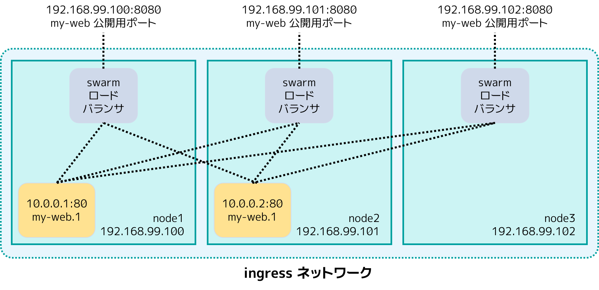
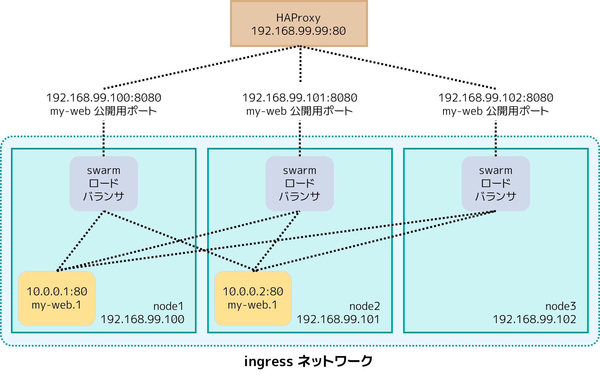

.. -*- coding: utf-8 -*-
.. URL: https://docs.docker.com/engine/swarm/ingress/
.. SOURCE: https://github.com/docker/docker.github.io/blob/master/engine/swarm/ingress.md
   doc version: 20.10
.. check date: 2022/04/29
.. Commits on Aug 7, 2021 3b71231970606bb45fd6f37a8c99522583e7f5a8

.. Commits on Apr 30, 2018 aaca9b83b579b6de1761e41d7c580d118eec203c
.. -----------------------------------------------------------------------------

.. Use swarm mode routing mesh

.. _use-swarm-mode-routing-mesh:

==================================================
swarm モード・ルーティング・メッシュを使う
==================================================

.. sidebar:: 目次

   .. contents:: 
       :depth: 3
       :local:

.. Docker Engine swarm mode makes it easy to publish ports for services to make them available to resources outside the swarm. All nodes participate in an ingress routing mesh. The routing mesh enables each node in the swarm to accept connections on published ports for any service running in the swarm, even if there’s no task running on the node. The routing mesh routes all incoming requests to published ports on available nodes to an active container.

Docker Engine swarm モードは、swarm の外にあるリソースからサービスが利用できるように、ポートを簡単に公開できるようにします。全ての参加ノードは ingress **ルーティング・メッシュ**  （routing mesh）内です。ルーティング・メッシュは swarm 内の各ノードが、 swarm 上で実行しているあらゆるサービスの公開ポートを受け付けます。受付は、たとえ自分のノード上でタスクを実行していなくてもです。ルーティング・メッシュは利用可能なノード上で、公開ポートに対する全てのリクエストを受信し、アクティブなコンテナにルーティングします。

.. To use the ingress network in the swarm, you need to have the following ports open between the swarm nodes before you enable swarm mode:

swarm 内で ingress ネットワークを使うには、swarm ノードを有効化する前に、 swarm ノード間で以下のポートを利用可能にする必要があります。

..  Port 7946 TCP/UDP for container network discovery.
    Port 4789 UDP for the container ingress network.

* コンテナのネットワーク・ディスカバリ用に TCP/UDP ポート ``7946``
* コンテナ ingress ネットワーク用に UDP ポート ``4689``

.. You must also open the published port between the swarm nodes and any external resources, such as an external load balancer, that require access to the port.

また、swarm ノードとあらゆる外部リソース間で公開ポートをオープンにする必要もあります。例えば、外部のロードバランサなどが、ポートに対してアクセスできる必要があります。

.. You can also bypass the routing mesh for a given service.

また、サービスは :ref:`bypass-the-routing-mesh` しても提供できます。

.. Publish a port for a service

.. _ingress-publish-a-port-for-a-service:

サービス用にポートを公開
==============================

.. Use the --publish flag to publish a port when you create a service. target is used to specify the port inside the container, and published is used to specify the port to bind on the routing mesh. If you leave off the published port, a random high-numbered port is bound for each service task. You need to inspect the task to determine the port.

サービスの作成時にポートを公開するには、 ``--publish`` フラグを使います。コンテナ内のポート指定は ``target`` を使い、かつ、ルーティング・メッシュ上にバインドするポート指定に ``published`` を使います。もしも ``published`` ポートの指定がなければ、各サービス・タスクのためにランダムな高い番号のポートが割り当てられます。その場合、ポートを割り出すにはタスクの調査（inspect）が必要になります。

.. code-block:: bash

   $ docker service create \
     --name <サービス名> \
     --publish published=<公開ポート>,target=<コンテナ側ポート> \
     <イメージ>

..  Note: The older form of this syntax is a colon-separated string, where the published port is first and the target port is second, such as -p 8080:80. The new syntax is preferred because it is easier to read and allows more flexibility.

.. note::

   旧形式の構文は、 ``-p 8080:80`` のように、まず公開用のポートがあり、次にターゲット用ポートがあり、間をコロン文字列で区切るものでした。新しい構文では読みやすさと柔軟性を持たせるのに適しています。

.. The <PUBLISHED-PORT> is the port where the swarm makes the service available. If you omit it, a random high-numbered port is bound. The <CONTAINER-PORT> is the port where the container listens. This parameter is required.

.. For example, the following command publishes port 80 in the nginx container to port 8080 for any node in the swarm:

   .. code-block:: bash

   $ docker service create \
     --name my-web \
     --publish published=8080,target=80 \
     --replicas 2 \
     nginx

.. When you access port 8080 on any node, Docker routes your request to an active container. On the swarm nodes themselves, port 8080 may not actually be bound, but the routing mesh knows how to route the traffic and prevents any port conflicts from happening.

ノード上のポート 8080 にアクセスすると、Docker はアクティブなコンテナに対してリクエストを転送（ルーティング）します。対象の swarm node 自身がポート 8080 の実際の到達先でなくても、ルーティング・メッシュがトラフィックをどこに転送するかを知っており、あらゆるポートで衝突は発生しません。

.. The routing mesh listens on the published port for any IP address assigned to the node. For externally routable IP addresses, the port is available from outside the host. For all other IP addresses the access is only available from within the host.

ルーティング・メッシュがリッスンするのは、ノードに対して割り当てられた、あらゆる IP アドレスに対する公開ポートです。外部にルーティングできる IP アドレスであれば、ホスト外からポートを利用できます。その他すべての IP アドレスでアクセスできるのは、そのホストで利用可能な IP アドレスのみです。

.. service ingress image

.. You can publish a port for an existing service using the following command:

.. code-block:: bash

   $ docker service update \
     --publish-add published=<公開ポート>,target=<コンテナ・ポート> \
     <サービス>

.. You can use docker service inspect to view the service’s published port. For instance:

サービスの公開ポートは ``docker service inspect`` で調べられます。例：

.. code-block:: bash

   $ docker service inspect --format="{{json .Endpoint.Spec.Ports}}" my-web
   
   [{"Protocol":"tcp","TargetPort":80,"PublishedPort":8080}]

.. The output shows the <CONTAINER-PORT> (labeled TargetPort) from the containers and the <PUBLISHED-PORT> (labeled PublishedPort) where nodes listen for requests for the service.

出力では ``<コンテナ・ポート>`` （ ``TargetPort`` のラベル）はコンテナからのポートで、 ``<公開ポート>`` （ ``PublishedPort`` のラベル）はサービスに対するリクエストをリッスンしているノード上のポートです。

.. Publish a port for TCP only or UDP only

.. _publish-a-port-for-tcp-only-or-udp-only:

TCP のみか UDP のみのポート公開
----------------------------------------

.. By default, when you publish a port, it is a TCP port. You can specifically publish a UDP port instead of or in addition to a TCP port. When you publish both TCP and UDP ports, If you omit the protocol specifier, the port is published as a TCP port. If you use the longer syntax (recommended), set the protocol key to either tcp or udp.

デフォルトでは、ポートを公開すると、それは TCP ポートです。TCP ポートの代わりに、あるいは TCP ポートに加えて UDP ポートを公開を指定できます。TCP と UDP ポートの両方を公開するつもりでも、プロトコルの指定を省略すると、ポートは TCP として公開されてしまいます。長い構文（ 推奨）を使う場合、 ``protocol`` キーで ``tcp`` か ``udp`` を指定します。

.. TCP only

TCP のみ
^^^^^^^^^^

.. Long syntax:

長い構文：

.. code-block:: bash

   $ docker service create --name dns-cache \
     --publish published=53,target=53 \
     dns-cache

.. Short syntax:

短い構文：

.. code-block:: bash

   $ docker service create --name dns-cache \
     -p 53:53 \
     dns-cache

.. TCP and UDP

TCP と UDP
^^^^^^^^^^

.. Long syntax:

長い構文：

.. code-block:: bash

   $ docker service create --name dns-cache \
     --publish published=53,target=53 \
     --publish published=53,target=53,protocol=udp \
     dns-cache

.. Short syntax:

短い構文：

.. code-block:: bash

   $ docker service create --name dns-cache \
     -p 53:53 \
     -p 53:53/udp \
     dns-cache

.. UDP only

UDP のみ
^^^^^^^^^^

.. Long syntax:

長い構文：

.. code-block:: bash

   $ docker service create --name dns-cache \
     --publish published=53,target=53,protocol=udp \
     dns-cache

.. Short syntax:

短い構文：

.. code-block:: bash

   $ docker service create --name dns-cache \
     -p 53:53/udp \
     dns-cache

.. Bypass the routing mesh

.. _bypass-the-routing-mesh:

ルーティング・メッシュの迂回（バイパス）
========================================

.. You can bypass the routing mesh, so that when you access the bound port on a given node, you are always accessing the instance of the service running on that node. This is referred to as host mode. There are a few things to keep in mind.

ルーティング・メッシュは迂回できますので、特定のノード上でバインド（固定）しているポートにアクセスするときは、対象のノード上でサービスを実行しているインスタンスに対し常にアクセスします。これは ``host`` モードとも呼ばれます。いくつかの注意点がありますので、ご注意ください。

..    If you access a node which is not running a service task, the service does not listen on that port. It is possible that nothing is listening, or that a completely different application is listening.

* サービス・タスクが動作していないノードに対してアクセスしても、サービスは対象となるポートをリッスンしていません。これは、何もリッスンしていないか、全く異なるアプリケーションがリッスンしている可能性があります。

..    If you expect to run multiple service tasks on each node (such as when you have 5 nodes but run 10 replicas), you cannot specify a static target port. Either allow Docker to assign a random high-numbered port (by leaving off the published), or ensure that only a single instance of the service runs on a given node, by using a global service rather than a replicated one, or by using placement constraints.

* 各ノード上で複数のサービス・タスクを動かすつもりの場合（5ノードがあり、10 レプリカを実行するような場合）は、対象となるポート固定を指定できません。（ ``publiched`` を省略した場合は ）Docker がランダムな高い番号のポートを割り当てるか、あるいは、対象ノード上で実行しているサービスの1つのインスタンスに対してのみアクセスするか、こののどちらかです。その場合、レプリカに対するアクセスできる場所を制限（constraint）するよりは、グローバル・サービスを使う方が良いでしょう。

.. To bypass the routing mesh, you must use the long --publish service and set mode to host. If you omit the mode key or set it to ingress, the routing mesh is used. The following command creates a global service using host mode and bypassing the routing mesh.

ルーティング・メッシュを迂回するには、長い ``--publish`` サービスを使い、 ``mode`` を ``host`` に指定する必要があります。もしも ``mode`` キーを省略するか、キーを ``ingress`` に指定する場合は、ルーティング・メッシュを使います。以下のコマンドは ``host`` モードを使ってグローバル・サービスを作成し、ルーティング・メッシュを迂回します。

.. code-block:: bash

   $ docker service create --name dns-cache \
     --publish published=53,target=53,protocol=udp,mode=host \
     --mode global \
     dns-cache

.. Configure an external load balancer

.. _configure-an-external-load-balancer:

外部ロードバランサの設定
==============================

.. You can configure an external load balancer for swarm services, either in combination with the routing mesh or without using the routing mesh at all.

swarm サービスに対し、外部のロードバランサを設定できます。このとき、ルーティング・メッシュを組み合わせることも、全くルーティング・メッシュを使わないことも可能です。

.. Using the routing mesh

ルーティング・メッシュを使う
------------------------------

.. You can configure an external load balancer to route requests to a swarm service. For example, you could configure HAProxy to balance requests to an nginx service published to port 8080.

外部のロードバランサから、swarm サービスに対してリクエストを転送する設定が可能です。たとえば、 `HAProxy <https://www.haproxy.org/>`_ を使い、リクエストを nginx サービスが公開しているポート 8080 に振り分けるよう調整できます。

.. ingress with external load balancer image

.. In this case, port 8080 must be open between the load balancer and the nodes in the swarm. The swarm nodes can reside on a private network that is accessible to the proxy server, but that is not publicly accessible.

この場合、ポート 8080 はロードバランサと swarm 上のノード間でオープンになっている必要があります。swarm ノードはプライベート・ネットワーク上にあり、プロキシ・サーバにはアクセス可能ですが、パブリックにはアクセスできません。

.. You can configure the load balancer to balance requests between every node in the swarm even if there are no tasks scheduled on the node. For example, you could have the following HAProxy configuration in /etc/haproxy/haproxy.cfg:

swarm 上の各ノードが、たとえノード上でタスクを全くスケジュールしていなくても、ロードバランサでリクエストを分散するように設定できます。たとえば、 ``/etc/haproxy/haproxy.cfg`` で以下のように HAProxy を設定できます。

::

   global
           log /dev/log    local0
           log /dev/log    local1 notice
   ...snip...
   
   # HAProxy がポート 80 をリッスンする設定
   frontend http_front
      bind *:80
      stats uri /haproxy?stats
      default_backend http_back
   
   # HAProxy が swarm ノード上のポート 8080 に転送する設定
   backend http_back
      balance roundrobin
      server node1 192.168.99.100:8080 check
      server node2 192.168.99.101:8080 check
      server node3 192.168.99.102:8080 check

.. When you access the HAProxy load balancer on port 80, it forwards requests to nodes in the swarm. The swarm routing mesh routes the request to an active task. If, for any reason the swarm scheduler dispatches tasks to different nodes, you don’t need to reconfigure the load balancer.

HAProxy ロードバランサのポート 80 にアクセスすると、リクエストは swarm 上のノードに転送されます。swarm ルーティング・メッシュはリクエストをアクティブなタスクに転送します。もし何らかの理由により swarm スケジューラが別のノードにタスクを移動したとしても、ロードバランサ側で設定を変える必要はありません。

.. You can configure any type of load balancer to route requests to swarm nodes. To learn more about HAProxy, see the HAProxy documentation.

swarm ノードに対するリクエストを転送するため、あらゆる種類のロードバランサを設定できます。 HAProxy について詳しく学ぶには、 `HAProxy ドキュメント <https://cbonte.github.io/haproxy-dconv/>`_ をご覧ください。

.. Without the routing mesh

ルーティング・メッシュを使わない設定
========================================

.. To use an external load balancer without the routing mesh, set --endpoint-mode to dnsrr instead of the default value of vip. In this case, there is not a single virtual IP. Instead, Docker sets up DNS entries for the service such that a DNS query for the service name returns a list of IP addresses, and the client connects directly to one of these. You are responsible for providing the list of IP addresses and ports to your load balancer. See Configure service discovery.

ルーティング・メッシュを使わずに外部のロードバランサを使うように設定するには、 ``--endpoint-mode`` を使い、 ``vip``  のデフォルト値の代わりに ``dnsrr`` を指定します。この場合、単一のバーチャル IP を扱いません。そのかわりに、 Docker はサービスに対する DNS エントリを準備し、サービス名の DNS クエリに対して IP アドレスのリストを返し、かつ、クライアントが直接その IP アドレスにアクセスできるようにします。あなたが責任をもってロードバランサに指定する必要があるのは、IP アドレスとポートのリストです。 :ref:`configure-service-discovery` をご覧ください。

.. Learn more

詳しく学ぶ
====================

..    Deploy services to a swarm

:doc:`services`

.. seealso:: 

   Use swarm mode routing mesh
      https://docs.docker.com/engine/swarm/ingress/
