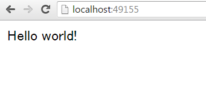

.. -*- coding: utf-8 -*-
.. URL: https://docs.docker.com/engine/userguide/containers/usingdocker/
.. SOURCE: https://github.com/docker/docker/blob/master/docs/userguide/containers/usingdocker.md
   doc version: 1.12
      https://github.com/docker/docker/commits/master/docs/userguide/containers/usingdocker.md
.. check date: 2016/06/13
.. Commits on Jan 27, 2016 e310d070f498a2ac494c6d3fde0ec5d6e4479e14
.. ----------------------------------------------------------------------------

.. _usingdocker:

.. Run a simple application

.. _run-a-simple-application:

=======================================
シンプルなアプリケーションの実行
=======================================

.. sidebar:: 目次

   .. contents::
       :depth: 3
       :local:

.. In the “Hello world in a container“ you launched your first containers using the docker run command. You ran an interactive container that ran in the foreground. You also ran a detached container that ran in the background. In the process you learned about several Docker commands:

「 :doc:`dockerizing` 」では、``docker run`` コマンドを使い、初めてのコンテナを起動しました。そして、フォアグラウンドで *双方向なコンテナ (interactive container)* を実行しました。また、バックグラウンドで *デタッチド・コンテナ (detached container)* を実行しました。この過程で複数の Docker コマンドを学びました。

..
    docker ps - Lists containers.
    docker logs - Shows us the standard output of a container.
    docker stop - Stops running containers.

* ``docker ps`` - コンテナの一覧を表示。
* ``docker logs`` - コンテナの標準出力を表示。
* ``docker stop`` - 実行中のコンテナを停止。

.. Learn about the Docker client

.. _learn-about-the-docker-client:

Docker クライアントについて学ぶ
===============================

.. If you didn’t realize it yet, you’ve been using the Docker client each time you typed docker in your Bash terminal. The client is a simple command line client also known as a command-line interface (CLI). Each action you can take with the client is a command and each command can take a series of flags and arguments.

気が付いていないかも知れませんが、Bash ターミナル上で毎回 ``docker`` と入力し、既に Docker クライアントを利用していました。クライアントとはシンプルなコマンドライン・クライアントであり、コマンドライン・インターフェース（CLI）とも呼びます。クライアントを使った各種の動作にはコマンド（命令）を使います。各コマンドには一連のフラグや引数を持ちます。

.. code-block:: bash

   # 使い方:  [sudo] docker [サブコマンド] [フラグ] [引数] ..
   # 例:
   $ docker run -i -t ubuntu /bin/bash

.. You can see this in action by using the docker version command to return version information on the currently installed Docker client and daemon.

実際に動作するかどうかは ``docker version`` コマンドを使います。現在インストールしている Docker クライアントとデーモンのバージョン情報を確認できます。

.. code-block:: bash

   $ docker version

.. This command will not only provide you the version of Docker client and daemon you are using, but also the version of Go (the programming language powering Docker).

このコマンドは使用している Docker クライアントとデーモンのバージョンを表示するだけではありません。Go 言語（Docker を動かすプログラミング言語）のバージョンも表示します。

.. code-block:: bash

   Client:
     Version:      1.8.1
     API version:  1.20
     Go version:   go1.4.2
     Git commit:   d12ea79
     Built:        Thu Aug 13 02:35:49 UTC 2015
     OS/Arch:      linux/amd64

   Server:
     Version:      1.8.1
     API version:  1.20
     Go version:   go1.4.2
     Git commit:   d12ea79
     Built:        Thu Aug 13 02:35:49 UTC 2015
     OS/Arch:      linux/amd64

.. Get Docker command help

.. _get-docker-command-help:

Docker コマンドの使い方を表示
=============================

.. You can display the help for specific Docker commands. The help details the options and their usage. To see a list of all the possible commands, use the following:

特定の Docker コマンドに対する使い方も表示できます。help は使い方の詳細を表示します。利用可能なコマンドの一覧を表示するには、次のように実行します：

.. code-block:: bash

   $ docker --help

.. To see usage for a specific command, specify the command with the --help flag:

一般的な使い方は、コマンドラインで ``--help`` フラグを指定します。

.. code-block:: bash

   $ docker attach --help

   Usage: docker attach [OPTIONS] CONTAINER

   Attach to a running container

     --help=false        Print usage
     --no-stdin=false    Do not attach stdin
     --sig-proxy=true    Proxy all received signals to the process

.. Note: For further details and examples of each command, see the command reference in this guide.

.. note::

   各コマンドの更なる詳細や例については、当ガイドの :doc:`コマンド・リファレンス </engine/reference/commandline/cli>` をご覧ください。

.. Running a web application in Docker

.. _running-a-web-application-in-docker:

Docker でウェブ・アプリケーションを実行
=======================================

.. So now you’ve learned a bit more about the docker client you can move onto the important stuff: running more containers. So far none of the containers you’ve run did anything particularly useful, so you can change that by running an example web application in Docker.

ここまでは ``docker`` クライアントについて少しだけ学びました。次は多くのコンテナの実行という、より重要なことを学びます。これまで実行したコンテナのほとんどは、いずれも何かに役に立つ処理を行いませんでした。今度は、Docker を使ったウェブ・アプリケーションの実行に移ります。

.. For our web application we’re going to run a Python Flask application. Start with a docker run command.

ウェブ・アプリケーションとして、Python の Flask アプリケーションを実行します。``docker run`` コマンドで開始します。

.. code-block:: bash

   $ docker run -d -P training/webapp python app.py

.. Review what the command did. You’ve specified two flags: -d and -P. You’ve already seen the -d flag which tells Docker to run the container in the background. The -P flag is new and tells Docker to map any required network ports inside our container to our host. This lets us view our web application.

コマンドの実行内容を精査します。``-d`` と ``-P`` という２つのフラグを指定しました。``-d`` フラグは既出であり、コンテナをバックグラウンドで実行するよう Docker に命令します。``-P`` は新しいフラグで、コンテナ内部のネットワークで必要なポートを、ホスト側にマップする（割り当てる）よう Docker に命令します。これにより、ウェブ・アプリケーションを参照できます。

.. You’ve specified an image: training/webapp. This image is a pre-built image you’ve created that contains a simple Python Flask web application.

ここではイメージ ``training/webapp`` を指定しました。このイメージは事前に構築しておいたイメージであり、シンプルな Python Flask ウェブ・アプリケーションが入っています。

.. Lastly, you’ve specified a command for our container to run: python app.py. This launches our web application.

最後にコンテナに対して ``python app.py`` を実行するコマンドを指定しました。これでウェブ・アプリケーションが起動します。

.. Note: You can see more detail on the docker run command in the command reference and the Docker Run Reference.

.. note::

   ``docker run`` コマンドについて、より詳細を知りたい場合は :doc:`コマンド・リファレンス </engine/reference/commandline/run>` と :doc:`Docker Run リファレンス </engine/reference/run>` をご覧ください。

.. Viewing our web application container

.. viewing-our-web-application-container:

ウェブ・アプリケーションのコンテナを表示
========================================

.. Now you can see your running container using the docker ps command.

さて、``docker ps`` コマンドを使い、実行中のコンテナを表示できます。

.. code-block:: bash

   $ docker ps -l
   CONTAINER ID  IMAGE                   COMMAND       CREATED        STATUS        PORTS                    NAMES
   bc533791f3f5  training/webapp:latest  python app.py 5 seconds ago  Up 2 seconds  0.0.0.0:49155->5000/tcp  nostalgic_morse

.. You can see you’ve specified a new flag, -l, for the docker ps command. This tells the docker ps command to return the details of the last container started.

``docker ps`` コマンドに新しいフラグ ``-l`` を指定しています。これは、最後に開始したコンテナの詳細を返すよう、``docker ps`` コマンドに命令します。

..    Note: By default, the docker ps command only shows information about running containers. If you want to see stopped containers too use the -a flag.

.. note::

   標準では、``docker ps`` コマンドは実行中のコンテナ情報のみ表示します。停止したコンテナの情報も表示したい場合は、``-a`` フラグを使います。

.. We can see the same details we saw when we first Dockerized a container with one important addition in the PORTS column.

:doc:`初めて Docker 化したコンテナ <dockerizing>` で見てきた詳細に加え、 ``PORTS`` 列に重要な情報が追加されています。

.. code-block:: bash

   PORTS
   0.0.0.0:49155->5000/tcp

.. When we passed the -P flag to the docker run command Docker mapped any ports exposed in our image to our host.

``docker run`` コマンドに ``-P`` フラグを渡したら、Docker はイメージからホスト側に対して、必要なポートを露出 (expose) します。

.. Note: We’ll learn more about how to expose ports in Docker images when we learn how to build images.

.. note::

   Docker イメージで露出ポートを指定する方法は、 :doc:`イメージの構築方法 <dockerimages>` で学びます。

.. In this case Docker has exposed port 5000 (the default Python Flask port) on port 49155.

今回の場合、Docker はコンテナのポート 5000 （Python Flask の標準ポート）をホスト上のポート 49115 上に公開しました。

.. Network port bindings are very configurable in Docker. In our last example the -P flag is a shortcut for -p 5000 that maps port 5000 inside the container to a high port (from ephemeral port range which typically ranges from 32768 to 61000) on the local Docker host. We can also bind Docker containers to specific ports using the -p flag, for example:

Docker は、ネットワーク・ポートの割り当て設定を変更可能です。今回の例では、``-P`` フラグは ``-p 5000`` を指定するショートカットにあたります。これは、コンテナの中のポート 5000 を、ローカルの Docker ホスト上のハイポート（典型的な 32768 ～ 61000 の範囲にある一時利用ポート）に割り当てます。あるいは、``-p`` フラグを使うことで、Docker コンテナに割り当てるポートの指定も可能です。例：

.. code-block:: bash

   $ docker run -d -p 80:5000 training/webapp python app.py

.. This would map port 5000 inside our container to port 80 on our local host. You might be asking about now: why wouldn’t we just want to always use 1:1 port mappings in Docker containers rather than mapping to high ports? Well 1:1 mappings have the constraint of only being able to map one of each port on your local host.

これはローカルホスト上のポート 80 を、コンテナ内のポート 5000 に割り当てます。もしかすると、次の疑問を持つでしょう。Docker コンテナをハイポートにマッピングするのではなく、常に 1:1 のポート割り当てを使わないのかと。ですが、ローカルホスト上の各ポートに 1:1 で割り当て可能なポートは１つだけだからです。

.. Suppose you want to test two Python applications: both bound to port 5000 inside their own containers. Without Docker’s port mapping you could only access one at a time on the Docker host.

例えば、２つの Python アプリケーションを実行したいとします。いずれもコンテナの中でポート 5000 を使うものです。この場合 Docker のホスト上で、ポート 5000 にアクセスできるコンテナは常に１つだけです。

.. So you can now browse to port 49155 in a web browser to see the application.

それではウェブ・ブラウザからポート 49155 を表示してみます。

.. Our Python application is live!

Python アプリケーションが動いています！

.. Note: If you have been using a virtual machine on OS X, Windows or Linux, you’ll need to get the IP of the virtual host instead of using localhost. You can do this by running the docker-machine ip your_vm_name from your command line or terminal application, for example:

.. note::

   Mac OS X や Windows または Linux 上の仮想マシンを使っている場合は、ローカルホスト上で仮想マシンが使っている IP アドレスを確認する必要があります。コマンドラインや端末アプリケーションを使い ``docker-machine ip 仮想マシン名`` を実行します。例：

   .. code-block:: bash

      $ docker-machine ip my-docker-vm
      192.168.99.100

   この例では、ブラウザで ``http://192.168.99.100:49155`` を開きます。

.. A network port shortcut

.. _a-network-port-shortcut:

network port でショートカット
=======================================

.. Using the docker ps command to return the mapped port is a bit clumsy so Docker has a useful shortcut we can use: docker port. To use docker port we specify the ID or name of our container and then the port for which we need the corresponding public-facing port.

割り当てたポートを確認するのに ``docker ps`` コマンドを使うのは少々面倒です。そこで、 Docker の ``docker port`` という便利なソートカットを使いしょう。``docker port`` でコンテナ ID や名前を指定したら、公開ポートに割り当てられているポート番号が分かります。

.. code-block:: bash

   $ docker port nostalgic_morse 5000
   0.0.0.0:49155

.. In this case you’ve looked up what port is mapped externally to port 5000 inside the container.

この例では、コンテナ内のポート 5000 が、外部の何番ポートに割り当てられたか分かります。

.. Viewing the web application's log

.. _viewing-the-web-applications-log:

ウェブ・アプリケーションのログ表示
=======================================

.. You can also find out a bit more about what’s happening with our application and use another of the commands you’ve learned, docker logs.

アプリケーションで何が起こっているのか、より詳しく見てみましょう。これまで学んだ ``docker logs`` コマンドを使います。

.. code-block:: bash

   $ docker logs -f nostalgic_morse
   * Running on http://0.0.0.0:5000/
   10.0.2.2 - - [23/May/2014 20:16:31] "GET / HTTP/1.1" 200 -
   10.0.2.2 - - [23/May/2014 20:16:31] "GET /favicon.ico HTTP/1.1" 404 -

.. This time though you’ve added a new flag, -f. This causes the docker logs command to act like the tail -f command and watch the container’s standard out. We can see here the logs from Flask showing the application running on port 5000 and the access log entries for it.

今回は新しい ``-f`` フラグを使いました。これは ``docker logs`` コマンドに対して ``tail -f`` コマンドのように動作するもので、コンテナの標準出力を見ます。ここではポート 5000 で動作している Flask アプリケーションに対する接続ログを表示します。

.. Looking at our web application container's processes

.. _looking-at-our-web-application-containers-processes:

アプリケーション・コンテナのプロセスを表示
=================================================

.. In addition to the container’s logs we can also examine the processes running inside it using the docker top command.

コンテナのログに加え、``docker top`` コマンドを使えば、内部で実行しているプロセスを確認できます。

.. code-block:: bash

   $ docker top nostalgic_morse
   PID                 USER                COMMAND
   854                 root                python app.py

.. Here we can see our python app.py command is the only process running inside the container.

ここでは ``python app.py`` コマンドだけが、コンテナ内のプロセスとして動作していることが分かります。

.. Inspecting our web application container

.. _inspecting-our-web-application-container:

ウェブ・アプリケーション・コンテナの調査
==================================================

.. Lastly, we can take a low-level dive into our Docker container using the docker inspect command. It returns a JSON document containing useful configuration and status information for the specified container.

最後に、Docker コンテナに低レベルでアクセスするには、``docker inspect`` コマンドを使います。指定したコンテナに対する便利な構成情報やステータス情報を、JSON 形式で得られます。

.. code-block:: bash

   $ docker inspect nostalgic_morse

.. You can see a sample of that JSON output.

実行後、次のような JSON 出力例を表示します。

.. code-block:: json

   [{
       "ID": "bc533791f3f500b280a9626688bc79e342e3ea0d528efe3a86a51ecb28ea20",
       "Created": "2014-05-26T05:52:40.808952951Z",
       "Path": "python",
       "Args": [
          "app.py"
       ],
       "Config": {
          "Hostname": "bc533791f3f5",
          "Domainname": "",
          "User": "",
   . . .

.. We can also narrow down the information we want to return by requesting a specific element, for example to return the container’s IP address we would:

あるいは、必要となる特定の情報のみ表示するように、情報を絞り込めます。次の例では、コンテナの IP アドレスのみ表示します。

.. code-block:: bash

   $ docker inspect -f '{{range .NetworkSettings.Networks}}{{.IPAddress}}{{end}}' nostalgic_morse
   172.17.0.5

.. Stopping our web application container

.. _stopping-our-web-application-container:

ウェブ・アプリケーション・コンテナの停止
==================================================

.. Okay you’ve seen web application working. Now you can stop it using the docker stop command and the name of our container: nostalgic_morse.

ここまではウェブ・アプリケーションが動作するのを確認しました。次は ``docker stop`` コマンドを使い、``nostalgic_morse`` という名前のコンテナを指定します。

.. code-block:: bash

   $ docker stop nostalgic_morse
   nostalgic_morse

.. We can now use the docker ps command to check if the container has been stopped.

``docker ps`` コマンドを使い、コンテナの停止を確認します。

.. code-block:: bash

   $ docker ps -l

.. Restarting our web application container

.. _restarting-out-web-application-container:

ウェブ・アプリケーション・コンテナの再起動
==================================================

.. Oops! Just after you stopped the container you get a call to say another developer needs the container back. From here you have two choices: you can create a new container or restart the old one. Look at starting your previous container back up.

おっと！ コンテナの停止後に、他の開発者がコンテナを元に戻して欲しいと言ってきました。ここでは２つの選択肢があります。新しいコンテナを起動するか、あるいは古いものを再起動するかです。先ほどのコンテナを元に戻してみましょう。

.. code-block:: bash

   $ docker start nostalgic_morse
   nostalgic_morse

.. Now quickly run docker ps -l again to see the running container is back up or browse to the container’s URL to see if the application responds.

ここで素早く ``docker ps -l`` を再度実行したら、実行していたコンテナが復帰し、コンテナの URL をブラウザで開けば、アプリケーションが応答します。

..    Note: Also available is the docker restart command that runs a stop and then start on the container.

.. note::

   ``docker restart`` コマンドも利用可能です。こちらはコンテナの停止と起動を行います。

.. Removing our web application container

.. _removing-our-web-application-container:

ウェブ・アプリケーション・コンテナの削除
==================================================

.. Your colleague has let you know that they’ve now finished with the container and won’t need it again. Now, you can remove it using the docker rm command.

同僚は作業を終え、コンテナがもう不要との連絡がありました。これで、``docker rm`` コマンドを使い削除できます。

.. code-block:: bash

   $ docker rm nostalgic_morse
   Error: Impossible to remove a running container, please stop it first or use -f
   2014/05/24 08:12:56 Error: failed to remove one or more containers

.. What happened? We can’t actually remove a running container. This protects you from accidentally removing a running container you might need. You can try this again by stopping the container first.

何が起こったのでしょうか？ 実行中かもしれないコンテナを間違って削除しないように、保護されているからです。先にコンテナを停止してから、再び実行します。

.. code-block:: bash

   $ docker stop nostalgic_morse
   nostalgic_morse
   $ docker rm nostalgic_morse
   nostalgic_morse

.. And now our container is stopped and deleted.

今度はコンテナを停止し、削除しました。

..    Note: Always remember that removing a container is final!

.. note::

   常に、最後にコンテナを削除するのを忘れないでください。

.. Next steps

次のステップ
====================

.. Until now you’ve only used images that you’ve downloaded from Docker Hub. Next, you can get introduced to building and sharing our own images.

ここまでは Docker Hub からダウンロードしたイメージのみを使ってきました。次は、自分でイメージを構築し、共有する方法を紹介します。

.. Go to Working with Docker images.

:doc:`Docker イメージの操作 <dockerimages>` に移動します。

.. seealso::

   Run a simple application
      https://docs.docker.com/engine/userguide/containers/usingdocker/

