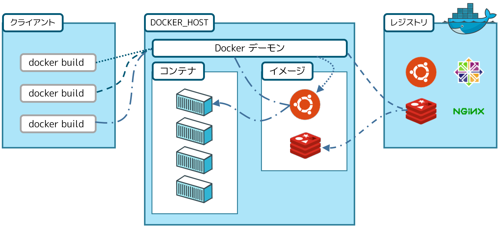

.. -*- coding: utf-8 -*-
.. URL: https://docs.docker.com/engine/understanding-docker/
.. SOURCE: https://github.com/docker/docker/blob/master/docs/understanding-docker.md
   doc version: 1.12
      https://github.com/docker/docker/commits/master/docs/understanding-docker.md
.. check date: 2016/06/13
.. Commits on Jun 9, 2016 8bd33b430b950ca5355f950d4b79a04ba0363c3c
.. -----------------------------------------------------------------------------

.. sidebar:: 目次

   .. contents:: 
       :depth: 2
       :local:

.. Docker Overview

.. _docker-overview:

=======================================
Docker 概要
=======================================

.. Docker is an open platform for developing, shipping, and running applications. Docker is designed to deliver your applications faster. With Docker you can separate your applications from your infrastructure and treat your infrastructure like a managed application. Docker helps you ship code faster, test faster, deploy faster, and shorten the cycle between writing code and running code.

Docker はアプリケーションを開発（developing）・移動（shipping）・実行（running）するための、オープンなプラットフォームです。Docker は皆さんのアプリケーションをより速く運ぶために設計されています。Docker を使うことで、アプリケーションをインフラから分離し、アプリケーションを管理するようにインフラを扱えるようにします。Dockerはコードの移動をより速く、テストを速く、デプロイを速くし、コードの記述とコードの実行におけるサイクルを短くします。

.. Docker does this by combining kernel containerization features with workflows and tooling that help you manage and deploy your applications

Docker はこれを実現するために、カーネルのコンテナ化機能（containerization；コンテナライゼーション）がもたらすワークフローと手法（ツール）を組みあわせます。それゆえ、アプリケーション管理とデプロイの手助けになるでしょう。

.. What is the Docker platform?

.. _what-is-the-docker-platform:

Docker プラットフォームとは何ですか？
========================================

.. At its core, Docker provides a way to run almost any application securely isolated in a container. The isolation and security allow you to run many containers simultaneously on your host. The lightweight nature of containers, which run without the extra load of a hypervisor, means you can get more out of your hardware.

中心となるのは、あらゆるアプリケーションをコンテナ内で安全に分離（isolated）して実行する手法を、Docker が提供することです。分離とセキュリティにより、ホスト上で擬似的に多くのコンテナを実行できます。コンテナは軽量な性質のため、実行するのにハイパーバイザーのような外部装置を必要としません。つまり、ハードウェアに依存しないのです。

.. Surrounding the container is tooling and a platform which can help you in several ways:

コンテナを取りまく手法（ツール）とプラットフォームは、様々な場所で役立つでしょう。

..    getting your applications (and supporting components) into Docker containers
    distributing and shipping those containers to your teams for further development and testing
    deploying those applications to your production environment, whether it is in a local data center or the Cloud.

* アプリケーション（と、必要なコンポーネントを）を Docker コンテナの中に入れる
* 更なる開発やテストのために、これらのコンテナをチームに配布・移動する
* プロダクション環境にアプリケーションをデプロイ

.. What is Docker Engine?

.. _what-is-docker-engine:

Docker Engine とは何ですか？
==============================

.. Docker Engine is a client-server application with these major components:

Docker Engine は３つの主なコンポーネント（構成要素）を持つクライアント・サーバ型アプリケーションです。

..  A server which is a type of long-running program called a daemon process.
    A REST API which specifies interfaces that programs can use to talk to the daemon and instruct it what to do.
    A command line interface (CLI) client.

* サーバはデーモン・プロセスと呼ばれる長期間実行するプログラムの種類
* インターフェースを規定する REST API は、プログラムがデーモンと通信に使うものであり、何をするか指示
* コマンドライン・インターフェース（CLI）クライアント

.. Docker Engine Components Flow

.. image:: /engine/article-img/engine-components-flow.png
   :scale: 60%
   :alt: Docker Engine コンポーネント図

.. The CLI imakes use of the Docker REST API to control or interact with the Docker daemon through scripting or direct CLI commands. Many other Docker applications make use of the underlying API and CLI.

CLI は Docker REST API のスクリプトもしくは直接 CLI コマンドを使い、Docker デーモンを制御または対話します。多くの他の Docker アプリケーションは、根底となる API と CLI を利用します。

.. The daemon creates and manages Docker objects. Docker objects include images, containers, networks, data volumes, and so forth.

デーモンは Docker オブジェクトを作成・管理します。Docker オブジェクトには、イメージ、コンテナ、ネットワーク、データ・ボリュームなどを含みます。

..    Note: Docker is licensed under the open source Apache 2.0 license.

.. note::

   Docker のライセンスは、オープンソース Apache 2.0 ライセンスの下で供与されています。

.. What can I use Docker for?

.. _what-can-i-use-docker-for:

何のために Docker を使うのですか？
========================================

.. Faster delivery of your applications

アプリケーションの速いデリバリ
------------------------------

.. Docker is perfect for helping you with the development lifecycle. Docker allows your developers to develop on local containers that contain your applications and services. It can then integrate into a continuous integration and deployment workflow.

Docker は 開発のライフサイクルの手助けに最適です。Docker は開発者がローカルのコンテナで開発できるようにし、そこにアプリケーションとサービスを入れられます。そして、継続的インテグレーションや、デプロイのワークフローと統合できます。

.. For example, your developers write code locally and share their development stack via Docker with their colleagues. When they are ready, they push their code and the stack they are developing onto a test environment and execute any required tests. From the testing environment, you can then push the Docker images into production and deploy your code.

例えば、開発者がローカルでコードを書き、Docker 上の開発スタックを同僚と共有します。準備が整えば、コードとスタックを開発環境からテスト環境に移動し、開発環境のスタックをテスト環境に移動し、必要なテストを実行します。テスト環境のあとで、Docker イメージをプロダクション環境に送信し、コードをデプロイできるのです。

.. Deploying and scaling more easily

デプロイとスケールをより簡単に
----------------------------------------

.. Docker’s container-based platform allows for highly portable workloads. Docker containers can run on a developer’s local host, on physical or virtual machines in a data center, or in the Cloud.

Docker のコンテナを基盤としたプラットフォームは、ワークロードの高い可用性をもたらします。Docker コンテナは開発者のローカルホスト上で実行できるだけでなく、データセンタの物理環境や仮想マシン上や、クラウド上でも実行できます。

.. Docker’s portability and lightweight nature also make dynamically managing workloads easy. You can use Docker to quickly scale up or tear down applications and services. Docker’s speed means that scaling can be near real time.

また、Docker のポータビリティと軽量な性質によって、動的なワークロードの管理を簡単にします。Docker を使えば、アプリケーションやサービスのスケールアップやティアダウンを簡単に行います。Docker のスピードが意味するのは、スケールをほぼリアルタイムに近く行えることです。

.. Achieving higher density and running more workloads

高密度と更なるワークロードの実行を実現
----------------------------------------

.. Docker is lightweight and fast. It provides a viable, cost-effective alternative to hypervisor-based virtual machines. This is especially useful in high density environments: for example, building your own Cloud or Platform-as-a-Service. But it is also useful for small and medium deployments where you want to get more out of the resources you have.

Docker は軽量かつ高速です。これはハイパーバイザーをベースとした仮想化マシンよりも、費用対効果を高くします。これが特に使いやすいのは高密度の環境でしょう。例えば、自分たちのクラウドや PaaS（プラットフォーム・アズ・ア・サービス）においてです。しかし、自分たちが持っているリソースを、より活用したいとする中小規模のデプロイにも便利です。

.. What is Docker’s architecture?

Docker のアーキテクチャとは？
==============================

.. Docker uses a client-server architecture. The Docker client talks to the Docker daemon, which does the heavy lifting of building, running, and distributing your Docker containers. Both the Docker client and the daemon can run on the same system, or you can connect a Docker client to a remote Docker daemon. The Docker client and daemon communicate via sockets or through a RESTful API.

Docker はクライアント・サーバ型のアーキテクチャです。Docker *クライアント* が Docker コンテナの構築・実行・配布といった力仕事をするには、 Docker *デーモン* と通信します。 Docker クライアントとデーモンは、どちらも同じシステム上でも実行できます。あるいは、Docker クライアントはリモートの Docker デーモンに接続するのも可能です。Docker クライアントとデーモンは、お互いにソケットもしくは RESTful API を経由して通信します。

.. The Docker daemon

Docker デーモン
--------------------

.. As shown in the diagram above, the Docker daemon runs on a host machine. The user does not directly interact with the daemon, but instead through the Docker client.

上図で見たように、Docker デーモンはホストマシン上で動きます。ユーザは直接デーモンと通信せず、Docker クライアントを通して行います。

.. The Docker client

Docker クライアント
--------------------

.. The Docker client, in the form of the docker binary, is the primary user interface to Docker. It accepts commands from the user and communicates back and forth with a Docker daemon.

Docker クライアントは ``docker`` バイナリの形式です。これは主にユーザが Docker との通信に使います。ユーザからのコマンドを受け付けたら、その先にある Docker デーモンが通信を返します。

.. Inside Docker

Docker の内部
--------------------

.. To understand Docker’s internals, you need to know about three components:

Docker 内部を理解するには、３つのコンポーネントを知る必要があります。

* Docker イメージ（image）
* Docker レジストリ（registry）
* Docker コンテナ（container）

.. Docker images

Docker イメージ
^^^^^^^^^^^^^^^^^^^^

.. A Docker image is a read-only template. For example, an image could contain an Ubuntu operating system with Apache and your web application installed. Images are used to create Docker containers. Docker provides a simple way to build new images or update existing images, or you can download Docker images that other people have already created. Docker images are the build component of Docker.

Docker イメージとは、読み込み専用（read-only）のテンプレートです。例えば、あるイメージは Ubuntu オペレーティング・システム上に、Apache とウェブ・アプリケーションをインストールするでしょう。イメージは Docker コンテナの作成時に使います。Docker は新しいイメージの構築や、既存イメージを更新します。あるいは、他の人が既に作成した Docker イメージをダウンロードすることも可能です。Docker イメージとは Docker における **構築（build）** コンポーネントです。

.. Docker registries

Docker レジストリ
^^^^^^^^^^^^^^^^^^^^

.. Docker registries hold images. These are public or private stores from which you upload or download images. The public Docker registry is provided with the Docker Hub. It serves a huge collection of existing images for your use. These can be images you create yourself or you can use images that others have previously created. Docker registries are the distribution component of Docker.

Docker レジストリはイメージを保管します。パブリックもしくはプライベートに保管するイメージの、アップロードやダウンロードが可能です。パブリックな Docker レジストリとして `Docker Hub <http://hub.docker.com/>`__ が提供されています。そこでは利用可能なイメージがたくさん提供されています。イメージを自分自身で作れるだけでなく、他人が作成したイメージも利用できます。Docker レジストリとは Docker における **配布（distribution）** コンポーネントです。

.. Docker containers

Docker コンテナ
^^^^^^^^^^^^^^^^^^^

.. Docker containers are similar to a directory. A Docker container holds everything that is needed for an application to run. Each container is created from a Docker image. Docker containers can be run, started, stopped, moved, and deleted. Each container is an isolated and secure application platform. Docker containers are the run component of Docker.

Docker コンテナはディレクトリと似ています。Docker コンテナはアプリケーションの実行に必要な全てを含みます。各コンテナは Docker イメージによって作られます。Docker コンテナは実行・開始・停止・移動・削除できます。各コンテナは分離されており、安全なアプリケーションのプラットフォームです。Docker コンテナとは Docker における **実行（run）** コンポーネントです。

.. So how does Docker work?

では、どのようにして Docker は動作しますか？
==================================================

.. So far, we’ve learned that:

これまでに、次のことを学びました。

..    You can build Docker images that hold your applications.
    You can create Docker containers from those Docker images to run your applications.
    You can share those Docker images via Docker Hub or your own registry.

1. アプリケーションを保持する Docker イメージを構築できます。
2. これら Docker イメージでアプリケーションを実行する Docker コンテナを作成できます。
3. これら Docker イメージを `Docker Hub <https://hub.docker.com/>`__ や自分のレジストリで共有できます。

.. Let’s look at how these elements combine together to make Docker work.

それでは、Docker が動作するために、それぞれの要素をどのように連携させているのか理解しましょう。

.. How does a Docker image work?

Docker イメージの役割は？
----------------------------------------

.. We’ve already seen that Docker images are read-only templates from which Docker containers are launched. Each image consists of a series of layers. Docker makes use of union file systems to combine these layers into a single image. Union file systems allow files and directories of separate file systems, known as branches, to be transparently overlaid, forming a single coherent file system.

これまで分かったのは、Docker イメージとは読み込み専用のテンプレートであり、これを使って Docker コンテナを起動します。各イメージはレイヤの積み重ねで構成されています。Docker は `ユニオン・ファイルシステム（UnionFS） <https://ja.wikipedia.org/wiki/UnionFS>`_ を使い、これらのレイヤを単一のイメージに連結します。ユニオン・ファイルシステムは、ブランチとしても知られています。これは透過的な重ね合わせ（overlaid）と、互いに密着した（coherent）ファイルシステムを形成します。

.. One of the reasons Docker is so lightweight is because of these layers. When you change a Docker image—for example, update an application to a new version— a new layer gets built. Thus, rather than replacing the whole image or entirely rebuilding, as you may do with a virtual machine, only that layer is added or updated. Now you don’t need to distribute a whole new image, just the update, making distributing Docker images faster and simpler.

Docker が軽量な理由の１つが、これらのレイヤによるものです。Docker イメージに変更を加えたとしましょう。例えば、アプリケーションを新しいバージョンに更新すると仮定します。この更新時に新しいレイヤを構築します。つまり、仮想マシン上で何らかの作業をした結果、イメージの入れ替えや完全な再構築ではなく、単純にレイヤを追加するか更新するだけなのです。この新しいイメージの、配布に関する心配は不要です。新しい Docker イメージを速く簡単に配布するには、単に更新されたレイヤを配布するだけです。

.. Every image starts from a base image, for example ubuntu, a base Ubuntu image, or fedora, a base Fedora image. You can also use images of your own as the basis for a new image, for example if you have a base Apache image you could use this as the base of all your web application images.

各イメージはベース・イメージ（base image）から作られます。例えば、 ``ubuntu``  は ベース Ubuntu イメージですし、 ``fedora`` は ベース Fedora イメージです。また、自分自身で新しいイメージの元も作れます。例えば、自分でベース Apache イメージを作れば、これを自分用のウェブ・アプリケーション・イメージのベース（基礎）として使えます。

..     Note: Docker usually gets these base images from Docker Hub.

.. note::

   Docker は常にこれらのベース・イメージを `Docker Hub <https://hub.docker.com/>`__ から取得します。

.. Docker images are then built from these base images using a simple, descriptive set of steps we call instructions. Each instruction creates a new layer in our image. Instructions include actions like:

これらのベース・イメージからシンプルに構築できるようにするため、Docker イメージには *命令 (instructions)* と呼ぶ構築手順を簡単に記述した集まりがあります。それぞれの命令ごとに、イメージ上に新しいレイヤを作成します。命令は次のような動作をします。

..     Run a command.
    Add a file or directory.
    Create an environment variable.
    What process to run when launching a container from this image.

* コマンドの実行
* ファイルやディレクトリの追加
* 環境変数の作成
* 対象イメージを使ってコンテナを起動する時、どのプロセスを実行するか

.. These instructions are stored in a file called a Dockerfile. Docker reads this Dockerfile when you request a build of an image, executes the instructions, and returns a final image.

これらの命令を ``Dockerfile`` と呼ぶファイルに保管します。Docker にイメージの構築を要求したら、Docker はこの ``Dockerfile`` を読み込み、命令を実行し、最終的なイメージを返します。

.. How does a Docker registry work?

どのように Docker レジストリは動作しますか？
--------------------------------------------------

.. The Docker registry is the store for your Docker images. Once you build a Docker image you can push it to a public registry such as the one provided by Docker Hub or to your own registry running behind your firewall.

Docker レジストリは Docker イメージを保管します。Docker イメージを構築後、 `Docker Hub <https://hub.docker.com/>`__ のような公開レジストリに *送信(push)* します。あるいはファイアウォール背後にある自分のレジストリにも送信できます。

.. Using the Docker client, you can search for already published images and then pull them down to your Docker host to build containers from them.

Docker クライアントを使い、公開済みのイメージを検索できます。そして、自分の Docker ホスト上にイメージを取得(pull)、つまりダウンロードし、これを使ってコンテナを構築できます。

.. Docker Hub provides both public and private storage for images. Public storage is searchable and can be downloaded by anyone. Private storage is excluded from search results and only you and your users can pull images down and use them to build containers. You can sign up for a storage plan here.

`Docker Hub <https://hub.docker.com/>`__ はイメージを保管するために、パブリックとプライベートなストレージの利用をサポートしています。パブリック・ストレージとは誰でも検索可能でダウンロードできるものです。プライベート・ストレージとは検索結果から除外され、自分もしくは許可されたユーザだけがイメージを取得し、コンテナを構築できるようにします。 `ストレージの料金プランと契約はこちらから <https://www.docker.com/pricing>`_  できます。

.. How does a container work?

どのようにコンテナは動作しますか？
----------------------------------------

.. A container consists of an operating system, user-added files, and meta-data. As we’ve seen, each container is built from an image. That image tells Docker what the container holds, what process to run when the container is launched, and a variety of other configuration data. The Docker image is read-only. When Docker runs a container from an image, it adds a read-write layer on top of the image (using a union file system as we saw earlier) in which your application can then run.

コンテナに含まれているのは、オペレーティング・システム、ユーザが追加したファイル、メタデータです。これまで見てきたように、各コンテナはイメージから構築します。そのイメージは、 Docker に対してどのコンテナの中に何があるか、コンテナ起動時に何のプロセスを実行するか、その他のデータに関する設定確認をします。Docker イメージは読み込み専用です。Docker がイメージからコンテナを実行する時、読み書き可能なレイヤを既存イメージ上に追加し（先ほど見た通り、ユニオン・ファイルシステムを使います）、アプリケーションを実行できるようにします。

.. What happens when you run a container?

コンテナを実行すると何が起きますか？
----------------------------------------

.. Either by using the docker binary or via the API, the Docker client tells the Docker daemon to run a container.

``docker`` バイナリまたは API を経由して、Docker クライアントは Docker デーモンにコンテナ実行を命令します。

.. code-block:: bash

   $ docker run -i -t ubuntu /bin/bash

.. Let’s break down this command. The Docker client is launched using the docker binary with the run option telling it to launch a new container. The bare minimum the Docker client needs to tell the Docker daemon to run the container is:

このコマンドを分解（ブレイクダウン）してみましょう。Docker クライアントは ``docker`` バイナリを使って実行され、 ``run`` オプションは新しいコンテナの起動を命令します。Docker クライアントが Docker デーモンに対してコンテナを起動する時、最低限必要なのは以下の項目です。

..    What Docker image to build the container from, here ubuntu, a base Ubuntu image;
..    The command you want to run inside the container when it is launched, here /bin/bash, to start the Bash shell inside the new container.

* コンテナを何の Docker イメージで構築するのか。ここでは ``ubuntu`` というベース Ubuntu イメージを使用
* コンテナを起動したら、その中で何のコマンドを実行したいのか、ここでは ``/bin/bash`` を指定し、新しいコンテナの中で Bash シェルを開始

.. So what happens under the hood when we run this command?

それでは、このコマンドの水面下では何が起こっているのでしょうか。

.. In order, Docker does the following:

Docker の処理内容を、順番に見ていきます。

..    Pulls the ubuntu image: Docker checks for the presence of the ubuntu image and, if it doesn’t exist locally on the host, then Docker downloads it from Docker Hub. If the image already exists, then Docker uses it for the new container.
    Creates a new container: Once Docker has the image, it uses it to create a container.
    Allocates a filesystem and mounts a read-write layer: The container is created in the file system and a read-write layer is added to the image.
    Allocates a network / bridge interface: Creates a network interface that allows the Docker container to talk to the local host.
    Sets up an IP address: Finds and attaches an available IP address from a pool.
    Executes a process that you specify: Runs your application, and;
    Captures and provides application output: Connects and logs standard input, outputs and errors for you to see how your application is running.

* **ubuntu イメージの取得** ：Docker は ``ubuntu`` イメージの存在を確認し、もしローカルホスト上に存在しなければ、 `Docker Hub <https://hub.docker.com/>`__ からダウンロードする。
* **新しいコンテナを作成** ：Docker がイメージを入手したあと、それを使ってコンテナを作成する。
* **ファイルシステムを割り当て、読み書き可能なレイヤをマウント** ：コンテナを新しいファイルシステム上に作成し、読み込み可能な（イメージの）レイヤをイメージに追加する。
* **ネットワークとブリッジインターフェースの割り当て** ：Docker コンテナがローカルホストと通信できるようにするため、ネットワーク・インターフェースを作成する。
* **IP アドレスを設定** ：プールされている範囲内で利用可能な IP アドレスを探して（コンテナに）追加する。
* **指定したプロセスを実行** ：アプリケーションを実行し、そして、
* **アプリケーションの出力を収集・表示** ：コンテナに接続し、アプリケーションを実行したことによる標準入力・標準出力・エラーを記録・表示する。

.. You now have a running container! From here you can manage your container, interact with your application and then, when finished, stop and remove your container.

これでコンテナが動きました！ 以降は自分でコンテナを管理し、アプリケーションと双方向でやりとりをし、利用し終えたらコンテナを停止・削除できます。

.. The underlying technology

基礎技術
==========

.. Docker is written in Go and makes use of several kernel features to deliver the functionality we’ve seen.

Docker は Go 言語で書かれており、これまで見てきた機能は、カーネルが持つ複数の機能を利用しています。

.. Namespaces

名前空間（namespaces）
------------------------------

.. Docker takes advantage of a technology called namespaces to provide the isolated workspace we call the container. When you run a container, Docker creates a set of namespaces for that container.

Docker は名前空間（ネームスペース）と呼ばれる技術を利用し、*コンテナ （container）* と呼ぶワークスペース（作業空間）の分離をもたらします。Docker はコンテナごとに *名前空間* の集まりを作成します。

.. This provides a layer of isolation: each aspect of a container runs in its own namespace and does not have access outside it.

これはレイヤの分離をもたらします。つまり、コンテナを実行すると、それぞれが自身の名前空間を持ち、そこから外にはアクセスできないように見えます。

.. Some of the namespaces that Docker uses on Linux are:

Docker が使う Linux 上の名前空間は、次の通りです。

..    The pid namespace: Used for process isolation (PID: Process ID).
    The net namespace: Used for managing network interfaces (NET: Networking).
    The ipc namespace: Used for managing access to IPC resources (IPC: InterProcess Communication).
    The mnt namespace: Used for managing mount-points (MNT: Mount).
    The uts namespace: Used for isolating kernel and version identifiers. (UTS: Unix 

* **pid 名前区間** ：プロセスの分離に使います（PID：プロセス ID）
* **net 名前区間** ：ネットワーク・インターフェースの管理に使います（NET：ネットワーキング）
* **ipc 名前区間** ：IPC リソースに対するアクセス管理に使います（IPC：InterProcess Communication、内部プロセスの通信）
* **mnt 名前区間** ：マウント・ポイントの管理に使います（MNT：マウント）
* **uts 名前区間** ：カーネルとバージョン認識の隔離に使います（UTS：Unix  Timesharing System、Unix タイムシェアリング・システム）

.. Control groups

コントロール・グループ (Control groups)
----------------------------------------

.. Docker on Linux also makes use of another technology called cgroups or control groups. A key to running applications in isolation is to have them only use the resources you want. This ensures containers are good multi-tenant citizens on a host. Control groups allow Docker to share available hardware resources to containers and, if required, set up limits and constraints. For example, limiting the memory available to a specific container.

Linux 上の Docker は、 ``cgroup``  やコントロール・グループと呼ばれる技術を使います。アプリケーション実行の鍵となるのは、自身が必要なリソースのみを分離します。この機能があるため、ホスト上で複数の利用者がいても、コンテナを使えます。また、コントロール・グループにより、Docker はコンテナに対して利用可能なハードウェア・リソースを共有し、必要があればコンテナが必要なリソース上限を設定できます。例えば、特定のコンテナに対する利用可能なメモリに制限を加えます。

.. Union file systems

ユニオン・ファイル・システム
------------------------------

.. Union file systems, or UnionFS, are file systems that operate by creating layers, making them very lightweight and fast. Docker uses union file systems to provide the building blocks for containers. Docker can make use of several union file system variants including: AUFS, btrfs, vfs, and DeviceMapper.

ユニオン・ファイル・システム、あるいは UnionFS はファイルシステムです。これは作成したレイヤを操作しますので、非常に軽量かつ高速です。Docker はコンテナ毎にブロックを構築するため、ユニオン・ファイル・システムを使います。Docker は AUFS、btrfs、vfs、DeviceMapper を含む複数のユニオン・ファイル・システムの派生を利用できます。

.. Container format

コンテナの形式（フォーマット）
------------------------------

.. Docker combines these components into a wrapper we call a container format. The default container format is called libcontainer. In the future, Docker may support other container formats, for example, by integrating with BSD Jails or Solaris Zones.

Docker はこれらのコンポーネントを連結し、包み込んでいます。これをコンテナ形式（フォーマット）と呼びます。デフォルトのコンテナ形式は ``libcontainer`` と呼ばれています。いずれ、Docker は他のコンテナ形式、例えば BSD Jail や Solaris Zone との統合をサポートするかも知れません。

.. Next steps

次のステップ
====================

.. Installing Docker

Docker インストール
--------------------

.. Visit the installation section.

:doc:`インストールの章 </engine/installation/index>` をご覧ください。

.. The Docker user guide

Docker ユーザガイド
------------------------------

.. Learn Docker in depth.

:doc:`より深く学びましょう。 </engine/userguide/index>` 

.. seealso:: 
   Understand the architecture
      https://docs.docker.com/engine/understanding-docker/

