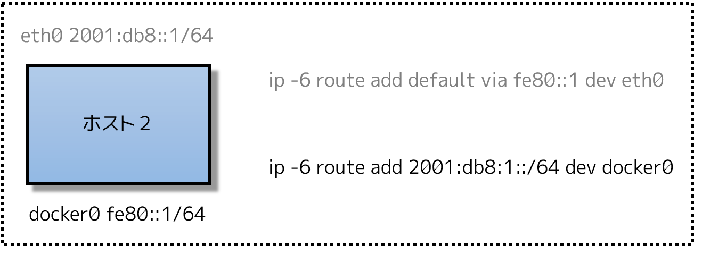
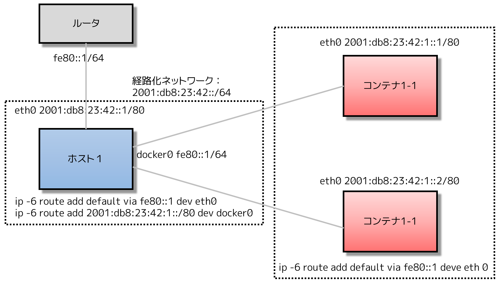
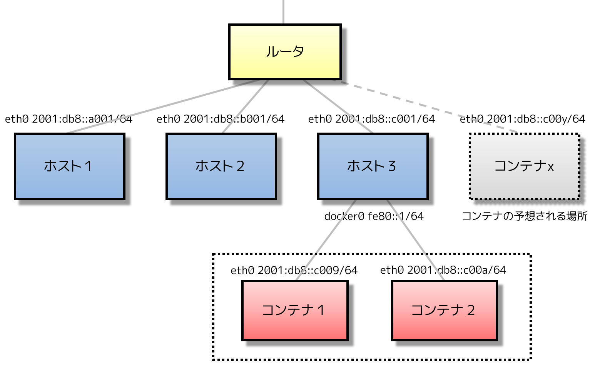
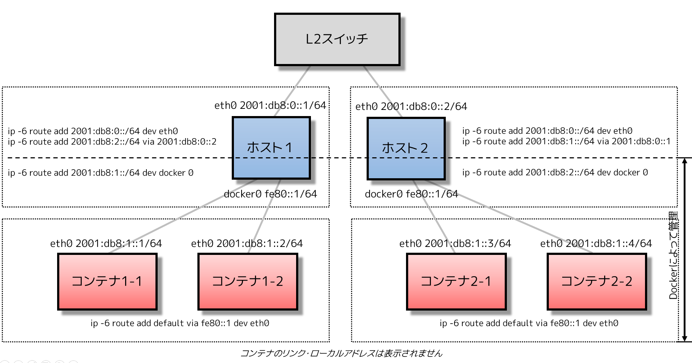
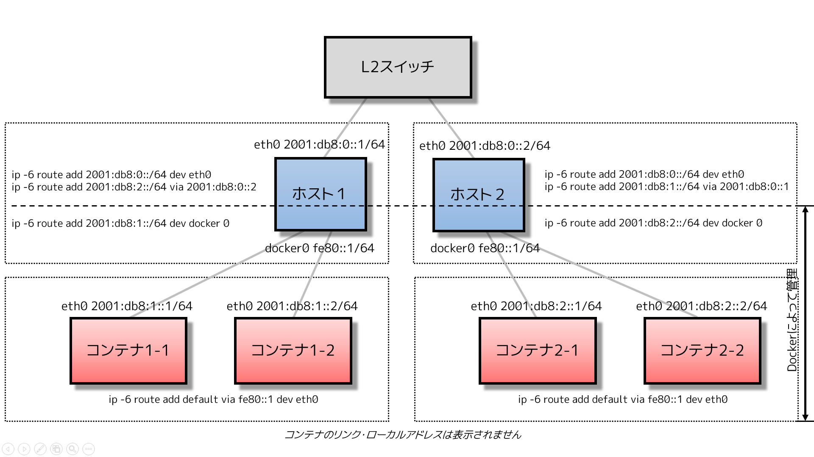

.. -*- coding: utf-8 -*-
.. URL: https://docs.docker.com/engine/userguide/networking/default_network/ipv6/
.. SOURCE: https://github.com/docker/docker/blob/master/docs/userguide/networking/default_network/ipv6.md
   doc version: 1.12
      https://github.com/docker/docker/commits/master/docs/userguide/networking/default_network/ipv6.md
.. check date: 2016/06/14
.. Commits on Apr 29, 2016 24ec73f754da16e37726a3f1c6a59de508e255fc
.. ---------------------------------------------------------------------------

.. IPv6 with Docker

.. _ipv6-with-docker:

========================================
Docker と IPv6
========================================

.. sidebar:: 目次

   .. contents:: 
       :depth: 3
       :local:

.. The information in this section explains IPv6 with the Docker default bridge. This is a bridge network named bridge created automatically when you install Docker.

このセクションでは Docker のデフォルト・ブリッジ上の IPv6 を説明します。``bridge`` という名称の ``bridge`` ネットワークは、Docker インストール時に自動的に作成されるものです。

.. As we are running out of IPv4 addresses the IETF has standardized an IPv4 successor, Internet Protocol Version 6 , in RFC 2460. Both protocols, IPv4 and IPv6, reside on layer 3 of the OSI model.

`IPv4 アドレス枯渇問題 <https://ja.wikipedia.org/wiki/IP%E3%82%A2%E3%83%89%E3%83%AC%E3%82%B9%E6%9E%AF%E6%B8%87%E5%95%8F%E9%A1%8C>`_ により、IFTF は IPv4 の後継規格 `IPv6（インターネット・プロトコル・バージョン６） <https://ja.wikipedia.org/wiki/IPv6>`_ を `RFC 2460 <https://www.ietf.org/rfc/rfc2460.txt>`_ で策定しました。IPv4 および IPv6 の両プロトコルは、 `OSI 参照モデル <https://ja.wikipedia.org/wiki/OSI%E5%8F%82%E7%85%A7%E3%83%A2%E3%83%87%E3%83%AB>`_ のレイヤ３にあたります。

.. How IPv6 works on Docker

.. _how-ipv6-works-on-docker:

Docker の IPv6 機能
====================

.. By default, the Docker server configures the container network for IPv4 only. You can enable IPv4/IPv6 dualstack support by running the Docker daemon with the --ipv6 flag. Docker will set up the bridge docker0 with the IPv6 link-local address fe80::1.

デフォルトでは、 Docker サーバはコンテナ・ネットワークを IPv4 のみ設定します。Docker デーモンに ``--ipv6`` フラグを指定して実行したら、IPv4/IPv6 デュアルスタック・サポートが有効になります。Docker は ``bridge0`` の IPv6 `リンク・ローカルアドレス <http://en.wikipedia.org/wiki/Link-local_address>`_ に ``fe80::1`` をセットアップします。

.. By default, containers that are created will only get a link-local IPv6 address. To assign globally routable IPv6 addresses to your containers you have to specify an IPv6 subnet to pick the addresses from. Set the IPv6 subnet via the --fixed-cidr-v6 parameter when starting Docker daemon:

デフォルトでは、コンテナはリンク・ローカル IPv6 アドレスのみ割り当てられます。グローバルにルーティング可能な IPv6 アドレスを割り当てるには、コンテナに対して割り当てる特定の IPv6 サブネットを指定します。IPv6 サブネットを設定するには、 ``--fixed-cidr-v6`` パラメータを Docker デーモンの起動時に指定します。

.. code-block:: bash

   dockerd --ipv6 --fixed-cidr-v6="2001:db8:1::/64"

.. The subnet for Docker containers should at least have a size of /80. This way an IPv6 address can end with the container’s MAC address and you prevent NDP neighbor cache invalidation issues in the Docker layer.

Docker コンテナ用のサブネットは、少なくとも ``/80`` を持っている必要があります。この方法により、IPv6 アドレスはコンテナの MAC アドレスで終わることができ、NDP ネイバー・キャッシュの無効化問題を Docker のレイヤで発生しないようにします。

.. With the --fixed-cidr-v6 parameter set Docker will add a new route to the routing table. Further IPv6 routing will be enabled (you may prevent this by starting Docker daemon with --ip-forward=false):

``--fixed-cidr-v6`` パラメータを Docker に設定したら、新しい経路のルーティング・テーブルを作成します。更に IPv6 ルーティング・テーブルも有効化します（有効化したくない場合は、 dockerd 起動時に ``--ip-forward=false`` を指定します）。

.. code-block:: bash

   $ ip -6 route add 2001:db8:1::/64 dev docker0
   $ sysctl net.ipv6.conf.default.forwarding=1
   $ sysctl net.ipv6.conf.all.forwarding=1

.. All traffic to the subnet 2001:db8:1::/64 will now be routed via the docker0 interface.

サブネット ``2001:db8:1::/64`` に対する全てのトラフィックは、 ``docker0`` インターフェースを通る経路になります。

.. Be aware that IPv6 forwarding may interfere with your existing IPv6 configuration: If you are using Router Advertisements to get IPv6 settings for your host’s interfaces you should set accept_ra to 2. Otherwise IPv6 enabled forwarding will result in rejecting Router Advertisements. E.g., if you want to configure eth0 via Router Advertisements you should set:

IPv6 転送（IPv6 forwarding）は既存の IPv6 設定に干渉する場合があり、注意が必要です。ホスト・インターフェースが IPv6 設定を取得するために、ルータ・アドバタイズメント（Router Advertisement）を使っているのであれば、 ``accept_ra`` を ``2`` に設定すべきです。そうしなければ、IPv6 転送を有効化した結果、ルータ・アドバタイズメントを拒否します。例えば、 ``eth0`` を経由してルータ・アドバタイズメントを使いたい場合は、次のように設定すべきです。

.. code-block:: bash

   $ sysctl net.ipv6.conf.eth0.accept_ra=2

.. Every new container will get an IPv6 address from the defined subnet. Further a default route will be added on eth0 in the container via the address specified by the daemon option --default-gateway-v6 if present, otherwise via fe80::1:

それぞれの新しいコンテナは、定義されたサブネットから IPv6 アドレスを取得します。更に、デフォルト経路（default route）がコンテナ内の ``eth0`` に追加されます。これはデーモンのオプションで ``--default-gateway-v6`` を指定しました。指定がなければ、 ``fe80::1`` 経由になります。

.. code-block:: bash

   docker run -it ubuntu bash -c "ip -6 addr show dev eth0; ip -6 route show"
   
   15: eth0: <BROADCAST,UP,LOWER_UP> mtu 1500
      inet6 2001:db8:1:0:0:242:ac11:3/64 scope global
         valid_lft forever preferred_lft forever
      inet6 fe80::42:acff:fe11:3/64 scope link
         valid_lft forever preferred_lft forever
   
   2001:db8:1::/64 dev eth0  proto kernel  metric 256
   fe80::/64 dev eth0  proto kernel  metric 256
   default via fe80::1 dev eth0  metric 1024

.. In this example the Docker container is assigned a link-local address with the network suffix /64 (here: fe80::42:acff:fe11:3/64) and a globally routable IPv6 address (here: 2001:db8:1:0:0:242:ac11:3/64). The container will create connections to addresses outside of the 2001:db8:1::/64 network via the link-local gateway at fe80::1 on eth0.

この例では、Docker コンテナはネットワーク・サフィックス ``/64`` で割り当てられた（ここでは ``fe80::42:acff:fe11:3/64`` ）リンク・ローカル・アドレスと、グローバルな経路を持つ IPv6 アドレス（ここでは、 ``2001:db8:1:0:0:242:ac11:3/64`` ）を持ちます。コンテナは、リンク・ローカル・ゲートウェイに ``eth0`` の ``fe80::1`` を使い、``2001:db8:1::/6`` ネットワークの外と通信します。

.. Often servers or virtual machines get a /64 IPv6 subnet assigned (e.g. 2001:db8:23:42::/64). In this case you can split it up further and provide Docker a /80 subnet while using a separate /80 subnet for other applications on the host:

サーバや仮想マシンは ``/64`` IPv4 サブネットを割り当てられます（例： ``2001:db8:23:42::/64`` ）。今回の例では、ホスト上の他のアプリケーションとの分離に ``/80`` サブネットが使いますが、 Docker の設定でサブネットを ``/80`` 以上にも分割できます。

.. In this setup the subnet 2001:db8:23:42::/80 with a range from 2001:db8:23:42:0:0:0:0 to 2001:db8:23:42:0:ffff:ffff:ffff is attached to eth0, with the host listening at 2001:db8:23:42::1. The subnet 2001:db8:23:42:1::/80 with an address range from 2001:db8:23:42:1:0:0:0 to 2001:db8:23:42:1:ffff:ffff:ffff is attached to docker0 and will be used by containers.

このセットアップでは、サブネット ``2001:db8:23:42::/80`` は ``2001:db8:23:42:0:0:0:0`` から ``2001:db8:23:42:0:ffff:ffff:ffff`` までの範囲を ``eth0`` に割り当て、ホスト側は ``2001:db8:23:42::1`` をリスニングします。サブネット ``2001:db8:23:42:1::/80`` は IP アドレスの範囲 ``2001:db8:23:42:1:0:0:0`` から ``2001:db8:23:42:1:ffff:ffff:ffff`` までを ``docker0`` に割り当て、これがコンテナによって使われます。

.. Using NDP proxying

.. _using-ndp-proxying:

NDP プロキシの使用
--------------------

.. If your Docker host is only part of an IPv6 subnet but has not got an IPv6 subnet assigned you can use NDP proxying to connect your containers via IPv6 to the internet. For example your host has the IPv6 address 2001:db8::c001, is part of the subnet 2001:db8::/64 and your IaaS provider allows you to configure the IPv6 addresses 2001:db8::c000 to 2001:db8::c00f:

Docker ホストが IPv6 サブネットの範囲にありながら IPv6 サブネットを持たない場合、コンテナが IPv6 を経由してインターネットに接続するには、 NDP プロキシ機能（NDP proxying） を使えます。例えば、ホストの IPv6 が ``2001:db8::c001`` であり、これはサブネット ``2001:db8::/64`` の一部です。IaaS プロバイダが ``2001:db8::c000`` から ``2001:db8::c00f:`` までの IPv6 設定を許可している場合、次のように表示されます。

.. code-block:: bash

   $ ip -6 addr show
   1: lo: <LOOPBACK,UP,LOWER_UP> mtu 65536
       inet6 ::1/128 scope host
          valid_lft forever preferred_lft forever
   2: eth0: <BROADCAST,MULTICAST,UP,LOWER_UP> mtu 1500 qlen 1000
       inet6 2001:db8::c001/64 scope global
          valid_lft forever preferred_lft forever
       inet6 fe80::601:3fff:fea1:9c01/64 scope link
          valid_lft forever preferred_lft forever

.. Let’s split up the configurable address range into two subnets 2001:db8::c000/125 and 2001:db8::c008/125. The first one can be used by the host itself, the latter by Docker:

それでは、このアドレス範囲を２つのサブネット ``2001:db8::c000/125`` と ``2001:db8::c008/125`` に分割しましょう。１つめのサブネットはホスト自身によって使われるもので、もう１つは Docker が使います。

.. code-block:: bash

   dockerd --ipv6 --fixed-cidr-v6 2001:db8::c008/125

.. You notice the Docker subnet is within the subnet managed by your router that is connected to eth0. This means all devices (containers) with the addresses from the Docker subnet are expected to be found within the router subnet. Therefore the router thinks it can talk to these containers directly.

Docker サブネットには、 ``eth0`` に接続するルータが管理しているサブネットが含まれているのに気を付けてください。つまり、Docker サブネットで公開される全てのデバイス（コンテナ）のアドレスは、ルータ側のサブネットから見つけることができます。つまり、ルータはこれらのコンテナと直接通信できると考えられます。

.. As soon as the router wants to send an IPv6 packet to the first container it will transmit a neighbor solicitation request, asking, who has 2001:db8::c009? But it will get no answer because no one on this subnet has this address. The container with this address is hidden behind the Docker host. The Docker host has to listen to neighbor solicitation requests for the container address and send a response that itself is the device that is responsible for the address. This is done by a Kernel feature called NDP Proxy. You can enable it by executing

ルータは IPv6 パケットを１つめのコンテナに送ろうとしたら、すぐにネイバー・ソリシテーション・リクエスト（neighbor solicitation request）を送信し、誰が ``2001:db8:;c009`` を持っているか訊ねます。サブネット上にアドレスが存在しなければ、誰も応答しません。コンテナはこのアドレスを Docker ホストの後ろに隠します。Docker ホストはコンテナアドレス用のネイバー・ソリシテーション・リクエストを受信したら、自分自身のデバイスがアドレスに対する責任を持っていると応答します。この処理がカーネルの ``NDP Proxy``  と呼ばれる機能です。有効化するには、次のコマンドを実行します。

.. code-block:: bash

   $ sysctl net.ipv6.conf.eth0.proxy_ndp=1

.. Now you can add the container’s IPv6 address to the NDP proxy table:

これでコンテナの IPv6 アドレスを NDP プロキシ・テーブルに追加できます。

.. code-block:: bash

   $ ip -6 neigh add proxy 2001:db8::c009 dev eth0

.. This command tells the Kernel to answer to incoming neighbor solicitation requests regarding the IPv6 address 2001:db8::c009 on the device eth0. As a consequence of this all traffic to this IPv6 address will go into the Docker host and it will forward it according to its routing table via the docker0 device to the container network:

このコマンドはカーネルに対してネイバー・ソリシテーション・リクエストが届いているかどうか訊ねます。リクエストとは、デバイス ``eth-`` 上の IPv6 アドレス ``2001:db8::c009`` に対してのものです。この結果、全ての IPv6 アドレスに対するトラフィックは、Docker ホストを経由するようになります。そして、Docker ホストはコンテナのネットワークに対し、 ``docker0`` デバイスを経由し、このルーティング・テーブルに従うようにします。

.. code-block:: bash

   $ ip -6 route show
   2001:db8::c008/125 dev docker0  metric 1
   2001:db8::/64 dev eth0  proto kernel  metric 256

.. You have to execute the ip -6 neigh add proxy ... command for every IPv6 address in your Docker subnet. Unfortunately there is no functionality for adding a whole subnet by executing one command. An alternative approach would be to use an NDP proxy daemon such as ndppd.

``ip -6 neigh add proxy ...`` コマンドは、 Docker サブネットの各 IPv6 アドレスごとに実行してきました。残念ながら、サブネットの誰がこのコマンドを実行したか把握する機能はありません。別の方法としては、 `ndppd <https://github.com/DanielAdolfsson/ndppd>`_  のように NDP プロキシ・デーモンを使う方法があります。

.. Docker IPv6 cluster

.. _docker-ipv6-cluster:

Docker IPv6 クラスタ
====================

.. Switched network environment

.. _switched-network-environment:

ネットワーク環境の切り替え
------------------------------

.. Using routable IPv6 addresses allows you to realize communication between containers on different hosts. Let’s have a look at a simple Docker IPv6 cluster example:

到達可能な IPv6 アドレスを使い、異なったホスト上のコンテナ間での通信を可能にします。簡単な Docker IPv6 クラスタの例を見ていきましょう。

.. The Docker hosts are in the 2001:db8:0::/64 subnet. Host1 is configured to provide addresses from the 2001:db8:1::/64 subnet to its containers. It has three routes configured:

Docker ホストは ``2001:db8:0::/64`` サブネットを持ちます。ホスト１はコンテナに対して ``2001:db8:1::/64`` サブネットを自身が持つコンテナに対して提供します。そのために３つの経路設定をします。

..    Route all traffic to 2001:db8:0::/64 via eth0
    Route all traffic to 2001:db8:1::/64 via docker0
    Route all traffic to 2001:db8:2::/64 via Host2 with IP 2001:db8::2

* ``2001:db8:0::/64`` に対する全てのトラフィックは ``eth0`` を経由する。
* ``2001:db8:1::/64`` に対する全てのトラフィックは ``docker0`` を経由する。
* ``2001:db8:2::/64`` に対する全てのトラフィックはホスト２の IP アドレスを経由する。

.. Host1 also acts as a router on OSI layer 3. When one of the network clients tries to contact a target that is specified in Host1’s routing table Host1 will forward the traffic accordingly. It acts as a router for all networks it knows: 2001:db8::/64, 2001:db8:1::/64 and 2001:db8:2::/64.

また、ホスト１は OSI レイヤ３のルータとしても動作します。あるネットワーク・クライアントがターゲットに接続しようとする時、ホスト１のルーティング・テーブルを指定し、ホスト１がトラフィックを指定先に転送します。これはネットワーク ``2001:db8::/64`` 、 ``2001:db8:1::/64`` 、 ``2001:db8:2::/64`` 上におけるルータとしても機能します。

.. On Host2 we have nearly the same configuration. Host2’s containers will get IPv6 addresses from 2001:db8:2::/64. Host2 has three routes configured:

ホスト２でも似たような設定を行います。ホスト２のコンテナは ``2001:db8:2::/64`` から IP アドレスを取得します。ホスト２には３つの経路設定があります。

..    Route all traffic to 2001:db8:0::/64 via eth0
    Route all traffic to 2001:db8:2::/64 via docker0
    Route all traffic to 2001:db8:1::/64 via Host1 with IP 2001:db8:0::1

* ``2001:db8:0::/64`` に対する全てのトラフィックは ``eth0`` を経由する。
* ``2001:db8:2::/64`` に対する全てのトラフィックは ``docker0`` を経由する。
* ``2001:db8:1::/64`` に対する全てのトラフィックはホスト１の IP アドレスを経由する。

.. The difference to Host1 is that the network 2001:db8:2::/64 is directly attached to the host via its docker0 interface whereas it reaches 2001:db8:1::/64 via Host1’s IPv6 address 2001:db8::1.

ホスト１との違いは、ホスト１の IPv6 アドレス ``2001:db8::1`` には ``2001:db8:1::/64`` を経由するのと異なり、ホスト２のネットワーク ``2001:db8:2::/64`` は直接ホスト上の ``docker0`` インターフェースに接続します。

.. This way every container is able to contact every other container. The containers Container1-* share the same subnet and contact each other directly. The traffic between Container1-* and Container2-* will be routed via Host1 and Host2 because those containers do not share the same subnet.

この方法は全てのコンテナが他のコンテナに対して接続できるようにします。 ``コンテナ1-*`` は同じサブネットを共有し、お互いに直接接続します。 ``コンテナ1-*`` と ``コンテナ2-*`` 間のトラフィックは、ホスト１とホスト２を経由します。これはこれらのコンテナが同じサブネットを共有していないためです。

.. In a switched environment every host has to know all routes to every subnet. You always have to update the hosts’ routing tables once you add or remove a host to the cluster.

ホストごとの環境の切り替え機能（switched environment）により、全てのサブネットに関する経路が判明しています。常に必要となるのは、クラスタに対するルーティング・テーブルの追加と削除のみです。

.. Every configuration in the diagram that is shown below the dashed line is handled by Docker: The docker0 bridge IP address configuration, the route to the Docker subnet on the host, the container IP addresses and the routes on the containers. The configuration above the line is up to the user and can be adapted to the individual environment.

図中の各種設定のうち、点線以下は Docker が管理します。 ``docker0``  ブリッジの IP アドレス設定は、コンテナの IP アドレスを持つ Docker のサブネットに対する経路です。線から上の設定は、ユーザが個々の環境に合わせて書き換えられます。

.. Routed network environment

.. _routed-network-environment:

ネットワーク経路の環境
------------------------------

.. In a routed network environment you replace the layer 2 switch with a layer 3 router. Now the hosts just have to know their default gateway (the router) and the route to their own containers (managed by Docker). The router holds all routing information about the Docker subnets. When you add or remove a host to this environment you just have to update the routing table in the router - not on every host.

ネットワーク環境の経路は、レイヤ２スイッチとレイヤ３ルータの関係に置き換えられます。ホストはデフォルト・ゲートウェイ（ルータ）を知っており、（Docker によって管理されている）個々のコンテナに対する経路を処理します。ルータは Docker サブネットに関する全ての経路情報も保持しています。この環境でホストの追加や削除時は、各ホストではなく、ルータ上のルーティング・テーブルを更新しなくてはいけません。

.. In this scenario containers of the same host can communicate directly with each other. The traffic between containers on different hosts will be routed via their hosts and the router. For example packet from Container1-1 to Container2-1 will be routed through Host1, Router and Host2 until it arrives at Container2-1.

このシナリオでは、同じホスト上のコンテナは直接通信可能です。異なったホスト上にあるコンテナ間のトラフィックは、ホストとルータを経由して経路付けられます。例えば、 ``コンテナ1-1`` から ``コンテナ2-1`` に対するパケットは ``ホスト１`` 、 ``ルータ`` 、そして ``ホスト２`` を経由して ``コンテナ2-1`` に到達します。

.. To keep the IPv6 addresses short in this example a /48 network is assigned to every host. The hosts use a /64 subnet of this for its own services and one for Docker. When adding a third host you would add a route for the subnet 2001:db8:3::/48 in the router and configure Docker on Host3 with --fixed-cidr-v6=2001:db8:3:1::/64.

IPv6 アドレスを短いまま維持するため、ここでは例として各ホストに ``/48`` ネットワークを割り当てます。ホストは自身のサービスで ``/64`` のサブネットを１つ使っており、もう片方は Docker です。３つめのホストを追加する時は、 ``2001:db8:3::/48`` サブネットに対する経路をルータで行い、ホスト３上の Docker で ``--fixed-cidr-v6=2001:db8:3:1::/64`` を設定します。

.. Remember the subnet for Docker containers should at least have a size of /80. This way an IPv6 address can end with the container’s MAC address and you prevent NDP neighbor cache invalidation issues in the Docker layer. So if you have a /64 for your whole environment use /78 subnets for the hosts and /80 for the containers. This way you can use 4096 hosts with 16 /80 subnets each.

Docker コンテナのサブネットは、少なくとも ``/80`` 以上の大きさが必要なのを覚えておいてください。これは IPv6 アドレスがコンテナの MAC アドレスで終わるようにするためで、Docker レイヤにおけるNDP ネイバー・キャッシュ無効化問題を防止します。もし環境に ``/64`` があれば、 ``/78`` はホストのサブネット用に、 ``/80``  がコンテナ用に使われます。これにより、 16 の ``/80`` サブネットは、それぞれ 4096 のホストを使えます。

.. Every configuration in the diagram that is visualized below the dashed line is handled by Docker: The docker0 bridge IP address configuration, the route to the Docker subnet on the host, the container IP addresses and the routes on the containers. The configuration above the line is up to the user and can be adapted to the individual environment.

図における各種の設定のうち、点線以下は Docker によって管理されます。 ``docker0``  ブリッジの IP アドレス設定は、コンテナの IP アドレスを持つ Docker のサブネットに対する経路です。線から上の設定は、ユーザが個々の環境に合わせて書き換え可能です。

.. seealso:: 

   IPv6 with Docker
      https://docs.docker.com/engine/userguide/networking/default_network/ipv6/
