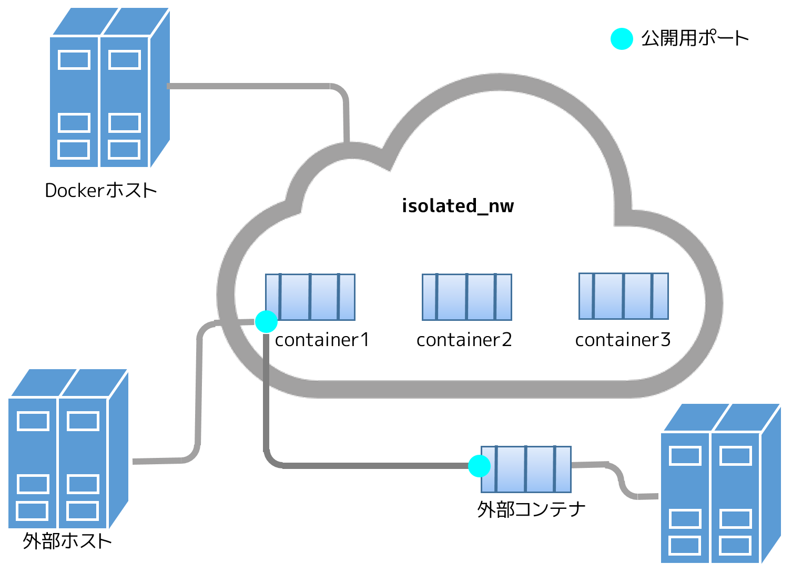
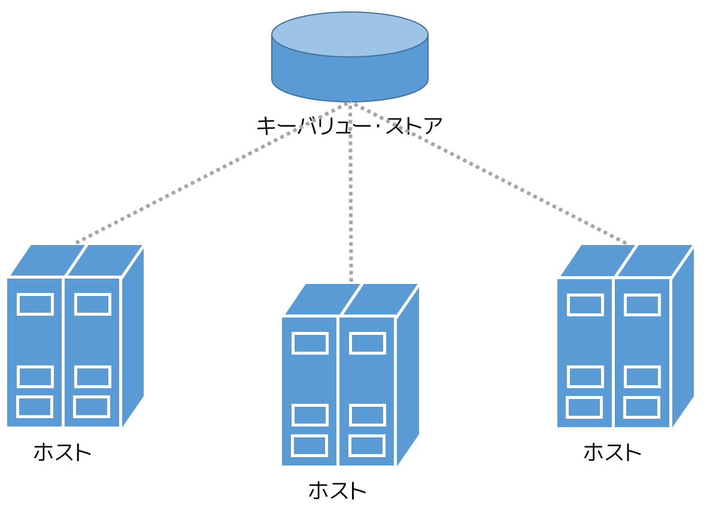
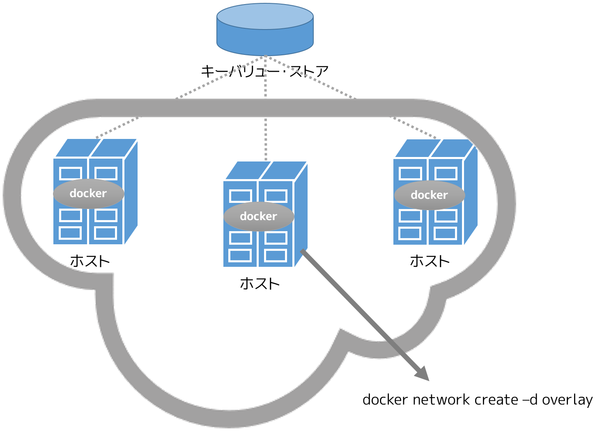
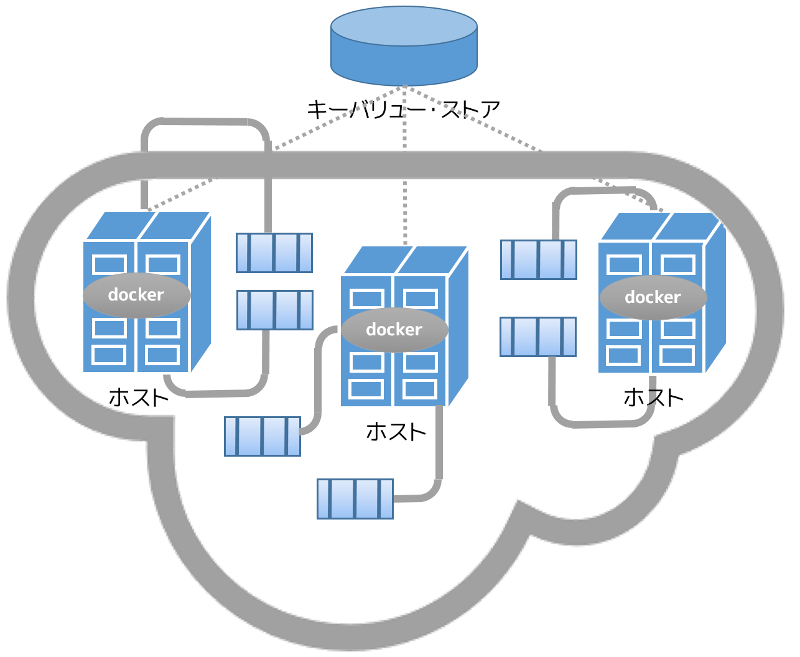

.. -*- coding: utf-8 -*-
.. URL: https://docs.docker.com/engine/userguide/networking/dockernetworks/
.. SOURCE: https://github.com/docker/docker/blob/master/docs/userguide/networking/dockernetworks.md
   doc version: 1.12
      https://github.com/docker/docker/commits/master/docs/userguide/networking/dockernetworks.md
.. check date: 2016/06/14
.. Commits on May 22, 2016 55b172401851a6338a325ef7930d50ace9efb067
.. ---------------------------------------------------------------------------

.. Understand Docker container networks

.. _understand-docker-container-networks:

========================================
Docker コンテナ・ネットワークの理解
========================================

.. sidebar:: 目次

   .. contents:: 
       :depth: 3
       :local:

.. To build web applications that act in concert but do so securely, use the Docker networks feature. Networks, by definition, provide complete isolation for containers. So, it is important to have control over the networks your applications run on. Docker container networks give you that control.

ウェブ・アプリケーションの構築は、安全についての考慮が必要であり、そのために Docker ネットワーク機能を使います。ネットワークとは、定義上、コンテナのために完全な分離(isolation)を提供するものです。そして、アプリケーションの実行にあたり、ネットワーク管理は重要であることを意味します。Docker コンテナ・ネットワークは、これらを管理するものです。

.. This section provides an overview of the default networking behavior that Docker Engine delivers natively. It describes the type of networks created by default and how to create your own, user--defined networks. It also describes the resources required to create networks on a single host or across a cluster of hosts.

このセクションでは、Docker Engine ドライバ固有の標準ネットワーク機能について、その概要を扱います。ここでは標準のネットワーク・タイプについてと、どのようにして自分自身でユーザ定義ネットワークを使うのかを説明します。また、単一ホストまたはクラスタ上をまたがるホスト間で、ネットワークを作成するために必要なリソースについても説明します。

.. Default Networks

デフォルト・ネットワーク
==============================

.. When you install Docker, it creates three networks automatically. You can list these networks using the docker network ls command:

Docker のインストールは、自動的に３つのネットワークを作成します。ネットワーク一覧を表示するには ``docker network ls`` コマンドを使います。

.. code-block:: bash

   $ docker network ls
   NETWORK ID          NAME                DRIVER
   7fca4eb8c647        bridge              bridge
   9f904ee27bf5        none                null
   cf03ee007fb4        host                host

.. Historically, these three networks are part of Docker’s implementation. When you run a container you can use the --net flag to specify which network you want to run a container on. These three networks are still available to you.

これまで、３つのネットワークが Docker の一部として実装されました。コンテナを実行するネットワークは ``--net`` フラグで指定できます。それでも、これらの３つのネットワークは今も利用可能です。

.. The bridge network represents the docker0 network present in all Docker installations. Unless you specify otherwise with the docker run --net=<NETWORK> option, the Docker daemon connects containers to this network by default. You can see this bridge as part of a host’s network stack by using the ifconfig command on the host.

Docker をインストールした全ての環境には、 ``docker0`` と表示されるブリッジ（ ``bridge`` ）ネットワークが現れます。オプションで ``docker run --net=<ネットワーク名>`` を指定しない限り、Docker デーモンはデフォルトでこのネットワークにコンテナを接続します。ホスト上で ``ifconfig`` コマンドを使えば、ホストネットワーク上のスタックの一部として、このブリッジを見ることができます。

.. code-block:: bash

   ubuntu@ip-172-31-36-118:~$ ifconfig
   docker0   Link encap:Ethernet  HWaddr 02:42:47:bc:3a:eb  
             inet addr:172.17.0.1  Bcast:0.0.0.0  Mask:255.255.0.0
             inet6 addr: fe80::42:47ff:febc:3aeb/64 Scope:Link
             UP BROADCAST RUNNING MULTICAST  MTU:9001  Metric:1
             RX packets:17 errors:0 dropped:0 overruns:0 frame:0
             TX packets:8 errors:0 dropped:0 overruns:0 carrier:0
             collisions:0 txqueuelen:0
             RX bytes:1100 (1.1 KB)  TX bytes:648 (648.0 B)

.. The none network adds a container to a container-specific network stack. That container lacks a network interface. Attaching to such a container and looking at its stack you see this:

コンテナにネットワーク層を追加したい場合は、 ``none`` ネットワークを指定します。そのコンテナはネットワーク・インターフェースが欠如します。コンテナに接続（アタッチ）すると、次のようなネットワーク情報を表示します。

.. code-block:: bash

   ubuntu@ip-172-31-36-118:~$ docker attach nonenetcontainer
   
   / # cat /etc/hosts
   127.0.0.1	localhost
   ::1	localhost ip6-localhost ip6-loopback
   fe00::0	ip6-localnet
   ff00::0	ip6-mcastprefix
   ff02::1	ip6-allnodes
   ff02::2	ip6-allrouters
   / # ifconfig
   lo        Link encap:Local Loopback  
             inet addr:127.0.0.1  Mask:255.0.0.0
             inet6 addr: ::1/128 Scope:Host
             UP LOOPBACK RUNNING  MTU:65536  Metric:1
             RX packets:0 errors:0 dropped:0 overruns:0 frame:0
             TX packets:0 errors:0 dropped:0 overruns:0 carrier:0
             collisions:0 txqueuelen:0
             RX bytes:0 (0.0 B)  TX bytes:0 (0.0 B)
   
   / #   

.. Note: You can detach from the container and leave it running with CTRL-p CTRL-q.

.. note::

   コンテナから離れても実行したままにするには、 ``CTRL-p CTRL-q`` を押します。

.. The host network adds a container on the hosts network stack. You’ll find the network configuration inside the container is identical to the host.

今度はホスト側の（ ``host`` ）ネットワーク・スタックにコンテナに接続します。コンテナ内のネットワーク設定が、ホスト上と同じに見えるでしょう。

.. With the exception of the bridge network, you really don’t need to interact with these default networks. While you can list and inspect them, you cannot remove them. They are required by your Docker installation. However, you can add your own user-defined networks and these you can remove when you no longer need them. Before you learn more about creating your own networks, it is worth looking at the default network a bit.

``bridge`` ネットワークの使用時をのぞけば、これらデフォルト・ネットワークと実際に通信する必要はありません。このように一覧を表示したり調べたりできますが、削除できません。これらは Docker の導入に必要だからです。一方、ユーザ定義ネットワークであれば自分で追加、あるいは必要なければを削除できます。自分でネットワークを作る前に、デフォルトのネットワークについて少しだけ見ておきましょう。

.. The default bridge network in detail

デフォルトのブリッジ・ネットワーク詳細
----------------------------------------

.. The default bridge network is present on all Docker hosts. The docker network inspect

Docker ホスト上の全てのデフォルト・ネットワーク・ブリッジを表示するには、docker network inspect を使います。

.. code-block:: bash

   $ docker network inspect bridge
   [
      {
          "Name": "bridge",
          "Id": "f7ab26d71dbd6f557852c7156ae0574bbf62c42f539b50c8ebde0f728a253b6f",
          "Scope": "local",
          "Driver": "bridge",
          "IPAM": {
              "Driver": "default",
              "Config": [
                  {
                      "Subnet": "172.17.0.1/16",
                      "Gateway": "172.17.0.1"
                  }
              ]
          },
          "Containers": {},
          "Options": {
              "com.docker.network.bridge.default_bridge": "true",
              "com.docker.network.bridge.enable_icc": "true",
              "com.docker.network.bridge.enable_ip_masquerade": "true",
              "com.docker.network.bridge.host_binding_ipv4": "0.0.0.0",
              "com.docker.network.bridge.name": "docker0",
              "com.docker.network.driver.mtu": "9001"
          }
      }
   ]

.. The Engine automatically creates a Subnet and Gateway to the network. The docker run command automatically adds new containers to this network.

Docker Engine は自動的にネットワークの ``Subnet`` と ``Gateway`` を作成します。 ``docker run`` コマンドは新しいコンテナに対して、自動的にこのネットワークを割り当てます。

.. code-block:: bash

   $ docker run -itd --name=container1 busybox
   3386a527aa08b37ea9232cbcace2d2458d49f44bb05a6b775fba7ddd40d8f92c
   
   $ docker run -itd --name=container2 busybox
   94447ca479852d29aeddca75c28f7104df3c3196d7b6d83061879e339946805c

.. Inspecting the bridge network again after starting two containers shows both newly launched containers in the network. Their ids show up in the "Containers" section of `docker network inspect`:

２つのコンテナを実行してから、再びこのブリッジ・ネットワークを参照し、直近のコンテナのネットワークがどのようになっているか見てみましょう。 ``docker network inspect`` で ``Containers`` のセクションでコンテナ ID を表示します。

.. code-block:: bash

   $ docker network inspect bridge
   {[
       {
           "Name": "bridge",
           "Id": "f7ab26d71dbd6f557852c7156ae0574bbf62c42f539b50c8ebde0f728a253b6f",
           "Scope": "local",
           "Driver": "bridge",
           "IPAM": {
               "Driver": "default",
               "Config": [
                   {
                       "Subnet": "172.17.0.1/16",
                       "Gateway": "172.17.0.1"
                   }
               ]
           },
           "Containers": {
               "3386a527aa08b37ea9232cbcace2d2458d49f44bb05a6b775fba7ddd40d8f92c": {
                   "EndpointID": "647c12443e91faf0fd508b6edfe59c30b642abb60dfab890b4bdccee38750bc1",
                   "MacAddress": "02:42:ac:11:00:02",
                   "IPv4Address": "172.17.0.2/16",
                   "IPv6Address": ""
               },
               "94447ca479852d29aeddca75c28f7104df3c3196d7b6d83061879e339946805c": {
                   "EndpointID": "b047d090f446ac49747d3c37d63e4307be745876db7f0ceef7b311cbba615f48",
                   "MacAddress": "02:42:ac:11:00:03",
                   "IPv4Address": "172.17.0.3/16",
                   "IPv6Address": ""
               }
           },
           "Options": {
               "com.docker.network.bridge.default_bridge": "true",
               "com.docker.network.bridge.enable_icc": "true",
               "com.docker.network.bridge.enable_ip_masquerade": "true",
               "com.docker.network.bridge.host_binding_ipv4": "0.0.0.0",
               "com.docker.network.bridge.name": "docker0",
               "com.docker.network.driver.mtu": "9001"
           }
       }
   ]

.. The docker network inspect command above shows all the connected containers and their network resources on a given network. Containers in this default network are able to communicate with each other using IP addresses. Docker does not support automatic service discovery on the default bridge network. If you want to communicate with container names in this default bridge network, you must connect the containers via the legacy docker run --link option.

上の ``docker network inspect`` コマンドは、接続しているコンテナと特定のネットワーク上にある各々のネットワークを全て表示します。デフォルト・ネットワークのコンテナは、IP アドレスを使って相互に通信できます。デフォルトのネットワーク・ブリッジ上では、Docker は自動的なサービス・ディスカバリをサポートしていません。このデフォルト・ブリッジ・ネットワーク上でコンテナ名を使って通信をしたい場合、コンテナ間の接続にはレガシー（訳者注：古い）の  ``docker run --link`` オプションを使う必要があります。

.. You can attach to a running container and investigate its configuration:

実行しているコンテナに接続（ ``attach`` ）すると、設定を調査できます。

.. code-block:: bash

   $ docker attach container1
   
   / # ifconfig
   ifconfig
   eth0      Link encap:Ethernet  HWaddr 02:42:AC:11:00:02  
             inet addr:172.17.0.2  Bcast:0.0.0.0  Mask:255.255.0.0
             inet6 addr: fe80::42:acff:fe11:2/64 Scope:Link
             UP BROADCAST RUNNING MULTICAST  MTU:9001  Metric:1
             RX packets:16 errors:0 dropped:0 overruns:0 frame:0
             TX packets:8 errors:0 dropped:0 overruns:0 carrier:0
             collisions:0 txqueuelen:0
             RX bytes:1296 (1.2 KiB)  TX bytes:648 (648.0 B)
   
   lo        Link encap:Local Loopback  
             inet addr:127.0.0.1  Mask:255.0.0.0
             inet6 addr: ::1/128 Scope:Host
             UP LOOPBACK RUNNING  MTU:65536  Metric:1
             RX packets:0 errors:0 dropped:0 overruns:0 frame:0
             TX packets:0 errors:0 dropped:0 overruns:0 carrier:0
             collisions:0 txqueuelen:0
             RX bytes:0 (0.0 B)  TX bytes:0 (0.0 B)

.. Then use ping for about 3 seconds to test the connectivity of the containers on this bridge network

この ``bridge`` ネットワークにおけるコンテナの接続性をテストするため、３秒間 ``ping`` を実行します。

.. code-block:: bash

   / # ping -w3 172.17.0.3
   PING 172.17.0.3 (172.17.0.3): 56 data bytes
   64 bytes from 172.17.0.3: seq=0 ttl=64 time=0.096 ms
   64 bytes from 172.17.0.3: seq=1 ttl=64 time=0.080 ms
   64 bytes from 172.17.0.3: seq=2 ttl=64 time=0.074 ms
   
   --- 172.17.0.3 ping statistics ---
   3 packets transmitted, 3 packets received, 0% packet loss
   round-trip min/avg/max = 0.074/0.083/0.096 ms

.. Finally, use the cat command to check the container1 network configuration:

最後に ``cat`` コマンドを使い、 ``container1`` のネットワーク設定を確認します。

.. code-block:: bash

   / # cat /etc/hosts
   172.17.0.2	3386a527aa08
   127.0.0.1	localhost
   ::1	localhost ip6-localhost ip6-loopback
   fe00::0	ip6-localnet
   ff00::0	ip6-mcastprefix
   ff02::1	ip6-allnodes
   ff02::2	ip6-allrouters

.. To detach from a container1 and leave it running use CTRL-p CTRL-q.Then, attach to container2 and repeat these three command

``container1`` からデタッチするには、 ``CTRL-p CTRL-q`` を使って離れます。それから  ``container2`` にアタッチし、３つのコマンドを繰り返します。

.. code-block:: bash

   $ docker attach container2
   
   / # ifconfig
   eth0      Link encap:Ethernet  HWaddr 02:42:AC:11:00:03  
             inet addr:172.17.0.3  Bcast:0.0.0.0  Mask:255.255.0.0
             inet6 addr: fe80::42:acff:fe11:3/64 Scope:Link
             UP BROADCAST RUNNING MULTICAST  MTU:9001  Metric:1
             RX packets:15 errors:0 dropped:0 overruns:0 frame:0
             TX packets:13 errors:0 dropped:0 overruns:0 carrier:0
             collisions:0 txqueuelen:0
             RX bytes:1166 (1.1 KiB)  TX bytes:1026 (1.0 KiB)
   
   lo        Link encap:Local Loopback  
             inet addr:127.0.0.1  Mask:255.0.0.0
             inet6 addr: ::1/128 Scope:Host
             UP LOOPBACK RUNNING  MTU:65536  Metric:1
             RX packets:0 errors:0 dropped:0 overruns:0 frame:0
             TX packets:0 errors:0 dropped:0 overruns:0 carrier:0
             collisions:0 txqueuelen:0
             RX bytes:0 (0.0 B)  TX bytes:0 (0.0 B)
   
   / # ping -w3 172.17.0.2
   PING 172.17.0.2 (172.17.0.2): 56 data bytes
   64 bytes from 172.17.0.2: seq=0 ttl=64 time=0.067 ms
   64 bytes from 172.17.0.2: seq=1 ttl=64 time=0.075 ms
   64 bytes from 172.17.0.2: seq=2 ttl=64 time=0.072 ms
   
   --- 172.17.0.2 ping statistics ---
   3 packets transmitted, 3 packets received, 0% packet loss
   round-trip min/avg/max = 0.067/0.071/0.075 ms
   / # cat /etc/hosts
   172.17.0.3	94447ca47985
   127.0.0.1	localhost
   ::1	localhost ip6-localhost ip6-loopback
   fe00::0	ip6-localnet
   ff00::0	ip6-mcastprefix
   ff02::1	ip6-allnodes
   ff02::2	ip6-allrouters

.. The default docker0 bridge network supports the use of port mapping and docker run --link to allow communications between containers in the docker0 network. These techniques are cumbersome to set up and prone to error. While they are still available to you as techniques, it is better to avoid them and define your own bridge networks instead.

デフォルトの ``docker0`` ブリッジ・ネットワークは、ポート・マッピング（割り当て）機能の使用と、 ``docker run --link`` によって ``docker0`` ネットワーク上にあるコンテナ間の通信を可能とします。これらの技術はセットアップが面倒であり、間違いしがちです。この技術はまだ利用可能ですが、これらを使わず、その代わりに自分自身でブリッジ・ネットワークを定義するのが望ましいです。

.. User-defined networks

ユーザ定義ネットワーク
==============================

.. You can create your own user-defined networks that better isolate containers. Docker provides some default network drivers for use creating these networks. You can create a new bridge network or overlay network. You can also create a network plugin or remote network written to your own specifications.

コンテナのより優れた分離のために、自分でユーザ定義ネットワーク(user-defined network)を作成できます。Docker はこれらネットワークを作成するための、複数の **ネットワーク・ドライバ** を標準提供しています。新しい **ブリッジ・ネットワーク** や **オーバレイ・ネットワーク** を作成できます。また、自分で **ネットワーク・プラグイン** を書き、 **リモート・ネットワーク** を定義できます。

.. You can create multiple networks. You can add containers to more than one network. Containers can only communicate within networks but not across networks. A container attached to two networks can communicate with member containers in either network. When a container is connected to multiple networks, its external connectivity is provided via the first non-internal network, in lexical order.

ネットワークは複数作成できます。コンテナを１つ以上のネットワークに追加できます。コンテナの通信はネットワーク内だけでなく、ネットワーク間を横断できます。コンテナが２つのネットワークにアタッチする時、どちらのネットワークに対しても通信可能です。コンテナが複数のネットワークに接続時、外部への通信は単語順で１つめの非内部ネットワークを経由します。

.. The next few sections describe each of Docker’s built-in network drivers in greater detail.

以降のセクションでは、各 Docker 内蔵ネットワーク・ドライバに関するより詳細を扱います。

.. A bridge network

ブリッジ・ネットワーク
------------------------------

.. The easiest user-defined network to create is a bridge network. This network is similar to the historical, default docker0 network. There are some added features and some old features that aren’t available.

最も簡単なユーザ定義ネットワークは、 ``bridge`` ネットワークの作成です。このネットワークは過去の ``docker0`` ネットワークと似ています。いくつかの新機能が追加されていますが、古い機能のいくつかは利用できません。

.. code-block:: bash

   $ docker network create --driver bridge isolated_nw
   1196a4c5af43a21ae38ef34515b6af19236a3fc48122cf585e3f3054d509679b
   
   $ docker network inspect isolated_nw
   [
       {
           "Name": "isolated_nw",
           "Id": "1196a4c5af43a21ae38ef34515b6af19236a3fc48122cf585e3f3054d509679b",
           "Scope": "local",
           "Driver": "bridge",
           "IPAM": {
               "Driver": "default",
               "Config": [
                   {
                       "Subnet": "172.21.0.0/16",
                       "Gateway": "172.21.0.1/16"
                   }
               ]
           },
           "Containers": {},
           "Options": {}
       }
   ]
   
   $ docker network ls
   NETWORK ID          NAME                DRIVER
   9f904ee27bf5        none                null
   cf03ee007fb4        host                host
   7fca4eb8c647        bridge              bridge
   c5ee82f76de3        isolated_nw         bridge

.. After you create the network, you can launch containers on it using the docker run --net=<NETWORK> option.

ネットワークを作成したら、コンテナ起動時に ``docker run --net=<ネットワーク名>`` オプションを指定して接続できます。

.. code-block:: bash

   $ docker run --net=isolated_nw -itd --name=container3 busybox
   885b7b4f792bae534416c95caa35ba272f201fa181e18e59beba0c80d7d77c1d
   
   $ docker network inspect isolated_nw
   [
       {
           "Name": "isolated_nw",
           "Id": "1196a4c5af43a21ae38ef34515b6af19236a3fc48122cf585e3f3054d509679b",
           "Scope": "local",
           "Driver": "bridge",
           "IPAM": {
               "Driver": "default",
               "Config": [
                   {}
               ]
           },
           "Containers": {
               "885b7b4f792bae534416c95caa35ba272f201fa181e18e59beba0c80d7d77c1d": {
                   "EndpointID": "514e1b419074397ea92bcfaa6698d17feb62db49d1320a27393b853ec65319c3",
                   "MacAddress": "02:42:ac:15:00:02",
                   "IPv4Address": "172.21.0.2/16",
                   "IPv6Address": ""
               }
           },
           "Options": {}
       }
   ]

.. The containers you launch into this network must reside on the same Docker host. Each container in the network can immediately communicate with other containers in the network. Though, the network itself isolates the containers from external networks.

このネットワーク内で起動したコンテナは、Docker ホスト上の他のコンテナとは独立しています。ネットワーク内の各コンテナは速やかに通信が可能です。しかし、コンテナ自身が含まれるネットワークは外部のネットワークから独立しています。

.. image:: ./images/bridge_network.png
   :scale: 60%

.. Within a user-defined bridge network, linking is not supported. You can expose and publish container ports on containers in this network. This is useful if you want to make a portion of the bridge network available to an outside network.

ユーザ定義ブリッジ・ネットワークの内部では、リンク機能はサポートされません。ですが、このネットワーク上にあるコンテナのポートは公開可能です。 ``bridge`` ネットワークの一部を外のネットワークから使う時に便利でしょう。

.. A bridge network is useful in cases where you want to run a relatively small network on a single host. You can, however, create significantly larger networks by creating an overlay network.

ブリッジ・ネットワークは、単一ホスト上で比較的小さなネットワークの実行時に便利です。それだけではありません。 ``overlay`` ネットワークを使うと更に大きなネットワークを作成できます

.. An overlay network

.. _an-overlay-network:

オーバレイ・ネットワーク
------------------------------

.. Docker’s overlay network driver supports multi-host networking natively out-of-the-box. This support is accomplished with the help of libnetwork, a built-in VXLAN-based overlay network driver, and Docker’s libkv library.

Docker の ``overlay`` （オーバレイ）ネットワーク・ドライバは、複数ホストのネットワーキングにネイティブに対応する革新的なものです。この機能のサポートは ``libnetwork``  、 VXLAN を基盤とした内部オーバレイ・ネットワーク・ドライバ、そして Docker の ``libkv`` ライブラリによる成果です。

.. The overlay network requires a valid key-value store service. Currently, Docker’s libkv supports Consul, Etcd, and ZooKeeper (Distributed store). Before creating a network you must install and configure your chosen key-value store service. The Docker hosts that you intend to network and the service must be able to communicate.

``overlay`` ネットワークはキーバリュー・ストア・サービスが必要です。現時点で Docker の ``libkv`` がサポートしているのは、Consul、Etcd、Zookeeper（分散ストア）です。ネットワークを作成する前に、キーバリュー・ストア・サービスを選び、設定する必要があります。そして、Docker ホスト側では、ネットワークとサービスが通信できるようにします。

.. Each host in the network must run a Docker Engine instance. The easiest way to provision the hosts are with Docker Machine.

ネットワークの各ホストは、それぞれで Docker エンジンを動かす必要があります。最も簡単なのは Docker Machine を使ってホストをプロビジョンする方法です。

.. image:: ./images/engine-on-net.png
   :scale: 60%

.. You should open the following ports between each of your hosts.

ホスト間で以下のポートをオープンにすべきです。

.. list-table::
   :widths: 25 25 50
   :header-rows: 1

   * - プロトコル
     - Port
     - 説明
   * - udp
     - 4789
     - データ用 (VXLAN)
   * - tcp/udp
     - 7946
     - 管理用

.. Your key-value store service may require additional ports. Check your vendor’s documentation and open any required ports.

使用するキーバリュー・ストアによっては、追加ポートが必要になる場合があります。各ベンダーのドキュメントを確認し、必要なポートを開いてください。

.. Once you have several machines provisioned, you can use Docker Swarm to quickly form them into a swarm which includes a discovery service as well.

Docker Machine でプロビジョンしたら、Docker Swarm を使うための Swarm とディスカバリ・サービスも同様に迅速に入れられます。

.. To create an overlay network, you configure options on the daemon on each Docker Engine for use with overlay network. There are two options to set:

オーバレイ・ネットワークを作成するには、各々の Docker Engine 上の ``daemon`` のオプションで、 ``overlay`` ネットワークを設定します。そこには２つの設定オプションがあります：

.. list-table::
   :widths: 50 50
   :header-rows: 1

   * - オプション
     - 説明
   * - ``--cluster-store=プロバイダ://URL``
     - キーバリュー・サービスの場所を指定
   * - ``--cluster-advertise=HOST_IP|HOST_IFACE:PORT``
     - クラスタ用に使うホストのインターフェース用 IP アドレス
   * - ``--cluster-store-opt=KVSのオプション``
     - TLS 証明書やディスカバリ間隔の調整のようなオプション。

.. Create an overlay network on one of the machines in the Swarm.

``overlay`` ネットワークを Swarm のマシン上に作成します。

.. code-block:: bash

   $ docker network create --driver overlay my-multi-host-network

.. This results in a single network spanning multiple hosts. An overlay network provides complete isolation for the containers.

この結果、複数のホストを横断する１つのネットワークができます。 ``overlay`` ネットワークはコンテナに対して、完全なる独立機能を提供します。

.. Then, on each host, launch containers making sure to specify the network name.

以後、各ホスト上でコンテナ起動時にこのネットワーク名を指定します。

.. code-block:: bash

   $ docker run -itd --net=my-multi-host-network busybox

接続したあと、ネットワーク内の各コンテナ全てにアクセス可能となります。この時、コンテナがどこのホスト上で起動しているか気にする必要はありません。

.. If you would like to try this for yourself, see the Getting started for overlay.

自分で試したい場合は、こちらの :doc:`overlay 導入ガイド </engine/userguide/networking/get-started-overlay>` をご覧ください。

.. Custom network plugin

カスタム・ネットワーク・プラグイン
----------------------------------------

.. If you like, you can write your own network driver plugin. A network driver plugin makes use of Docker’s plugin infrastructure. In this infrastructure, a plugin is a process running on the same Docker host as the Docker daemon.

必要があれば、自分自身でネットワーク・ドライバ・プラグインを書けます。ネットワーク・ドライバ・プラグインは Docker のプラグイン基盤を使います。この基盤を使い、Docker ``デーモン`` が動作する同じ Docker ホストでプラグインをプロセスとして実行します。

.. Network plugins follow the same restrictions and installation rules as other plugins. All plugins make use of the plugin API. They have a lifecycle that encompasses installation, starting, stopping and activation.

ネットワーク・プラグインは、他のプラグインと同様、いくつかの制約やインストール時のルールがあります。全てのプラグインはプラグイン API を利用します。これらはインストール、開始、停止、有効化といったライフサイクル全般に及びます。

.. Once you have created and installed a custom network driver, you use it like the built-in network drivers. For example:

カスタム・ネットワーク・ドライバを作成してインストールした後は、内部ネットワーク・ドライバと同じように扱えます。例：

.. code-block:: bash

   $ docker network create --driver weave mynet

.. You can inspect it, add containers too and from it, and so forth. Of course, different plugins may make use of different technologies or frameworks. Custom networks can include features not present in Docker’s default networks. For more information on writing plugins, see Extending Docker and Writing a network driver plugin.

必要があれば自分で内部を確認できますし、更なるコンテナを追加など、いろいろ可能ます。もちろん、プラグインごとに異なった技術やフレームワークを使うこともあるでしょう。カスタム・ネットワークは Docker の標準ネットワークが持たない機能を実装できます。プラグインの書き方に関する詳細情報は、 :doc:`Docker 拡張 </engine/extend/index>` または :doc:`ネットワーク・ドライバ・プラグインの書き方 </engine/extend/plugins_network>` をお読みください。

.. Docker embedded DNS server

.. _docker-embedded-dns-server:

Docker 内蔵 DNS サーバ
------------------------------

.. Docker daemon runs an embedded DNS server to provide automatic service discovery for containers connected to user defined networks. Name resolution requests from the containers are handled first by the embedded DNS server. If the embedded DNS server is unable to resolve the request it will be forwarded to any external DNS servers configured for the container. To facilitate this when the container is created, only the embedded DNS server reachable at 127.0.0.11 will be listed in the container’s resolv.conf file. More information on embedded DNS server on user-defined networks can be found in the embedded DNS server in user-defined networks

Docker デーモンは内蔵 DNS サーバを動かし、ユーザ定義ネットワーク上でコンテナがサービス・ディスカバリを自動的に行えるようにします。コンテナから名前解決のリクエストがあれば、内部 DNS サーバを第一に使います。リクエストがあっても内部 DNS サーバが名前解決できなければ、外部の DNS サーバにコンテナからのリクエストを転送します。割り当てできるのはコンテナの作成時だけです。内部 DNS サーバが到達可能なのは ``127.0.0.11`` のみであり、コンテナの ``resolv.conf`` に書かれます。ユーザ定義ネットワーク上の内部 DNS サーバに関しては :doc:`configure-dns` をご覧ください。

.. links

リンク機能
====================

.. Before the Docker network feature, you could use the Docker link feature to allow containers to discover each other. With the introduction of Docker networks, containers can be discovered by its name automatically. But you can still create links but they behave differently when used in the default docker0 bridge network compared to user-defined networks. For more information, please refer to Legacy Links for link feature in default bridge network and the linking containers in user-defined networks for links functionality in user-defined networks.

Docker ネットワーク機能より以前は、Docker リンク機能を使いコンテナの相互発見や、特定のコンテナから別のコンテナに安全に情報を送信できました。Docker ネットワークを導入したら、自動的にコンテナを名前で発見できます。しかし、デフォルトの ``docker0`` ブリッジ・ネットワークとユーザ定義ネットワークには違いがあるため、まだリンク機能を使うこともできます。より詳しい情報については、 :doc:`古いリンク機能 <default_network/dockerlinks>` のデフォルト ``bridge`` ネットワークのリンク機能をご覧ください。ユーザ定義ネットワークでリンク機能を使うには :ref:`linking-containers-in-user-defined-networks` をご覧ください。

.. While links are still supported in this limited capacity, you should avoid them in preference of Docker networks. The link feature is expected to be deprecated and removed in a future release.

.. このようにリンク機能は制限された状態ですが、サポートされています。リンクを避けて、Docker ネットワークを優先すべきでしょう。将来のバージョンでは、リンク機能を廃止および削除の予定です。

.. Related information

関連情報
==========

.. 
    Work with network commands
    Get started with multi-host networking
    Managing Data in Containers
    Docker Machine overview
    Docker Swarm overview
    Investigate the LibNetwork project

* :doc:`ネットワークコマンドの使い方 </engine/userguide/networking/work-with-networks>`
* :doc:`マルチネットワークを始める </engine/userguide/networking/get-started-overlay>`
* :doc:`コンテナのデータ管理 </engine/userguide/containers/dockervolumes>`
* :doc:`Docker Machine 概要 </machine/index>`
* :doc:`Docker Swarm 概要 </swarm/index>`
* `LibNetwork プロジェクトの詳細 <https://github.com/docker/libnetwork>`_

.. seealso:: 

   Understand Docker container networks
      https://docs.docker.com/engine/userguide/networking/dockernetworks/

