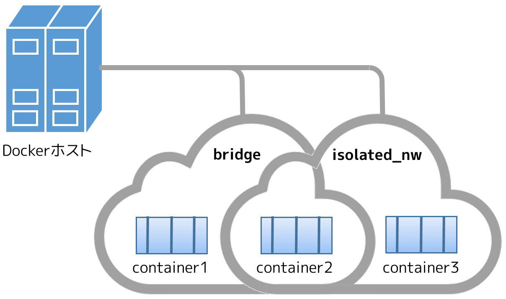

.. -*- coding: utf-8 -*-
.. URL: https://docs.docker.com/engine/userguide/networking/work-with-networks/
.. SOURCE: https://github.com/docker/docker/blob/master/docs/userguide/networking/work-with-networks.md
   doc version: 1.12
      https://github.com/docker/docker/commits/master/docs/userguide/networking/work-with-networks.md
.. check date: 2016/06/14
.. Commits on Jun 6, 2016 feabf71dc1cd5757093c5887b463a6cbcdd83cc2
.. ---------------------------------------------------------------------------

.. Work with network commands

========================================
network コマンドを使う
========================================

.. sidebar:: 目次

   .. contents:: 
       :depth: 3
       :local:

.. This article provides examples of the network subcommands you can use to interact with Docker networks and the containers in them. The commands are available through the Docker Engine CLI. These commands are:

この記事ではネットワーク・サブコマンドの例を扱います。このサブコマンドはDocket ネットワークを相互に扱い、コンテナをネットワークに配置します。コマンドは Docker エンジン CLI を通して利用可能です。コマンドとは以下の通りです。

* ``docker network create``
* ``docker network connect``
* ``docker network ls``
* ``docker network rm``
* ``docker network disconnect``
* ``docker network inspect``

.. While not required, it is a good idea to read Understanding Docker network before trying the examples in this section. The examples for the rely on a bridge network so that you can try them immediately. If you would prefer to experiment with an overlay network see the Getting started with multi-host networks instead.

このセクションの例に取り組む前に、 :doc:`Docker ネットワークの理解 <dockernetworks>` を読むのは必要ではなくとも良い考えです。なお、この例では ``bridge`` ネットワークを使用するため、すぐに試せます。 ``overlay`` ネットワークを試したいのであれば、 :doc:`マルチホスト・ネットワーキングを始める <get-started-overlay>` をご覧ください。

.. Create networks

.. _create-networks:

ネットワークの作成
====================

.. Docker Engine creates a bridge network automatically when you install Engine. This network corresponds to the docker0 bridge that Engine has traditionally relied on. In addition to this network, you can create your own bridge or overlay network.

Docker Engine をインストールしたら、Docker Engine は自動的に ``bridge`` ネットワークを作成します。このネットワークとは、Docker Engine が従来使ってきた ``docker0`` ブリッジに相当します。このデフォルトのネットワークだけでなく、自分で ``bridge`` （ブリッジ）ネットワークや ``overlay`` （オーバレイ）ネットワークを作成可能です。

.. A bridge network resides on a single host running an instance of Docker Engine. An overlay network can span multiple hosts running their own engines. If you run docker network create and supply only a network name, it creates a bridge network for you.

``bridge`` ネットワークは Docker エンジンの実行ホスト環境上に存在します。 ``overlay`` ネットワークは、複数のホスト上で動くエンジンを横断します。 ``docker network create`` を実行する時、ネットワーク名だけ指定したら、自動的にブリッジ・ネットワークを作成します。

.. code-block:: bash

   $ docker network create simple-network
   69568e6336d8c96bbf57869030919f7c69524f71183b44d80948bd3927c87f6a
   $ docker network inspect simple-network
   [
       {
           "Name": "simple-network",
           "Id": "69568e6336d8c96bbf57869030919f7c69524f71183b44d80948bd3927c87f6a",
           "Scope": "local",
           "Driver": "bridge",
           "IPAM": {
               "Driver": "default",
               "Config": [
                   {
                       "Subnet": "172.22.0.0/16",
                       "Gateway": "172.22.0.1/16"
                   }
               ]
           },
           "Containers": {},
           "Options": {}
       }
   ]

.. Unlike bridge networks, overlay networks require some pre-existing conditions before you can create one. These conditions are:

``overlay`` ネットワークの場合は、ブリッジ・ネットワークとは異なります。作成前にいくつかの事前準備が必要です。事前準備は次の項目です。

..    Access to a key-value store. Engine supports Consul, Etcd, and ZooKeeper (Distributed store) key-value stores.
    A cluster of hosts with connectivity to the key-value store.
    A properly configured Engine daemon on each host in the swarm.

* キーバリュー・ストアへのアクセス。エンジンがサポートするキーバリュー・ストアは Consul、Etcd、ZooKeeper（分散ストア）です。
* ホストのクラスタが、キーバリュー・ストアへ接続できること。
* 各ホスト上のエンジン ``daemon`` に、 Swarm クラスタとしての適切な設定をすること。

.. The docked options that support the overlay network are:

``overlay`` ネットワークがサポートする ``dockerd`` のオプションは、次の通りです。

* ``--cluster-store``
* ``--cluster-store-opt``
* ``--cluster-advertise``

.. It is also a good idea, though not required, that you install Docker Swarm to manage the cluster. Swarm provides sophisticated discovery and server management that can assist your implementation.

また、必要がなくてもクラスタ管理用に Docker Swarm をインストールするのも良い考えでしょう。Swarm はクラスタの設定を手助けするために、洗練されたディスカバリとサーバ管理機能を持っています。

.. When you create a network, Engine creates a non-overlapping subnetwork for the network by default. You can override this default and specify a subnetwork directly using the --subnet option. On a bridge network you can only create a single subnet. An overlay network supports multiple subnets.

ネットワーク作成時、Docker Engine はデフォルトでサブネットが重複しないネットワークを作成します。このデフォルトの挙動は変更できます。特定のサブネットワークを直接指定するには ``--subnet`` オプションを使います。 ``bridge`` ネットワーク上では１つだけサブネットを作成できます。 ``overlay`` ネットワークでは、複数のサブネットをサポートしています。

.. Note : It is highly recommended to use the --subnet option while creating a network. If the --subnet is not specified, the docker daemon automatically chooses and assigns a subnet for the network and it could overlap with another subnet in your infrastructure that is not managed by docker. Such overlaps can cause connectivity issues or failures when containers are connected to that network.

.. note::

   ネットワークの作成時は ``--subnet`` オプションの指定を強く推奨します。 ``--subnet`` を指定しなければ、docker デーモンはネットワークに対してサブネットを自動的に割り当てます。その時、Docker が管理していない基盤上の別サブネットと重複する可能性があります。このような重複により、コンテナがネットワークに接続するときに問題や障害を引き起こします。

.. In addition to the --subnet option, you also specify the --gateway --ip-range and --aux-address options.

``--subnet`` オプションの他にも、 ``--gateway`` ``--ip-range`` ``--aux-address`` オプションが指定可能です。

.. code-block:: bash

   $ docker network create -d overlay \
     --subnet=192.168.0.0/16 \
     --subnet=192.170.0.0/16 \
     --gateway=192.168.0.100 \
     --gateway=192.170.0.100 \
     --ip-range=192.168.1.0/24 \
     --aux-address a=192.168.1.5 --aux-address b=192.168.1.6 \
     --aux-address a=192.170.1.5 --aux-address b=192.170.1.6 \
     my-multihost-network

.. Be sure that your subnetworks do not overlap. If they do, the network create fails and Engine returns an error.

サブネットワークが重複しないように注意してください。重複したらネットワーク作成が失敗し、Docker Engine はエラーを返します。

.. When creating a custom network, the default network driver (i.e. bridge) has additional options that can be passed. The following are those options and the equivalent docker daemon flags used for docker0 bridge:

カスタム・ネットワークの作成時、デフォルトのネットワーク・ドライバ（例： ``bridge`` ）は追加オプションを指定できます。dokcer0 ブリッジにおいては、Docker デーモンのフラグで指定するのと同等の以下の設定が利用できます。

.. list-table::
   :header-rows: 1

   * - オプション
     - 同等
     - 説明
   * - ``com.docker.network.bridge.name``
     - －
     - Linux ブリッジ作成時に使うブリッジ名
   * - ``com.docker.network.bridge.enable_ip_masquerade``
     - ``--ip-masq``
     - IP マスカレードを有効化
   * - ``com.docker.network.bridge.enable_icc``
     - ``--icc``
     - Docker 内部におけるコンテナの接続性を有効化・無効化
   * - ``com.docker.network.bridge.host_binding_ipv4``
     - ``--ip``
     - コンテナのポートをバインドする（割り当てる）デフォルトの IP
   * - ``com.docker.network.mtu``
     - ``--mtu``
     - コンテナのネットワーク MTU を設定

.. The following arguments can be passed to docker network create for any network driver.

``docker network create`` 実行時、以下の引数をあらゆるネットワーク・ドライバで指定できます。

.. list-table::
   :header-rows: 1

   * - 引数
     - 同等
     - 説明
   * - ``--internal``
     - －
     - ネットワークから外部へのアクセスを制限
   * - ``--ipv6``
     - ``--ipv6``
     - IPv6 ネットワーク機能の有効化

.. For example, now let’s use -o or --opt options to specify an IP address binding when publishing ports:

例えば、 ``-o`` または ``--opt`` オプションを使い、ポートを公開用に割り当てる IP アドレスを指定しましょう。

.. code-block:: bash

   $ docker network create -o "com.docker.network.bridge.host_binding_ipv4"="172.23.0.1" my-network
   b1a086897963e6a2e7fc6868962e55e746bee8ad0c97b54a5831054b5f62672a
   $ docker network inspect my-network
   [
       {
           "Name": "my-network",
           "Id": "b1a086897963e6a2e7fc6868962e55e746bee8ad0c97b54a5831054b5f62672a",
           "Scope": "local",
           "Driver": "bridge",
           "IPAM": {
               "Driver": "default",
               "Options": {},
               "Config": [
                   {
                       "Subnet": "172.23.0.0/16",
                       "Gateway": "172.23.0.1/16"
                   }
               ]
           },
           "Containers": {},
           "Options": {
               "com.docker.network.bridge.host_binding_ipv4": "172.23.0.1"
           }
       }
   ]
   $ docker run -d -P --name redis --net my-network redis
   bafb0c808c53104b2c90346f284bda33a69beadcab4fc83ab8f2c5a4410cd129
   $ docker ps
   CONTAINER ID        IMAGE               COMMAND                  CREATED             STATUS              PORTS                        NAMES
   bafb0c808c53        redis               "/entrypoint.sh redis"   4 seconds ago       Up 3 seconds        172.23.0.1:32770->6379/tcp   redis

.. Connect containers

.. _connect-containers-network:

コンテナに接続
====================

.. You can connect containers dynamically to one or more networks. These networks can be backed the same or different network drivers. Once connected, the containers can communicate using another container’s IP address or name.

コンテナは１つまたは複数のネットワークに対して、動的に接続できます。これらのネットワークは、同じネットワーク・ドライバの場合もあれば、異なるバックエンドの場合もあります。接続後は、コンテナから他のコンテナに IP アドレスまたはコンテナ名で通信できるようになります。

.. For overlay networks or custom plugins that support multi-host connectivity, containers connected to the same multi-host network but launched from different hosts can also communicate in this way.

``overlay`` ネットワークやカスタム・プラグインの場合は、複数のホストへの接続性をサポートしており、コンテナは同一ホストで作成されたマルチホスト・ネットワークだけでなく、異なったホスト上で作成された環境とも同様に通信可能です。

.. Create two containers for this example:

ここでは例として、２つのコンテナを作成します。

.. code-block:: bash

   $ docker run -itd --name=container1 busybox
   18c062ef45ac0c026ee48a83afa39d25635ee5f02b58de4abc8f467bcaa28731
   
   $ docker run -itd --name=container2 busybox
   498eaaaf328e1018042c04b2de04036fc04719a6e39a097a4f4866043a2c2152

.. Then create a isolated, bridge network to test with.

それから、分離用の ``bridge`` ネットワークを作成します。

.. code-block:: bash

   $ docker network create -d bridge --subnet 172.25.0.0/16 isolated_nw
   06a62f1c73c4e3107c0f555b7a5f163309827bfbbf999840166065a8f35455a8

.. Connect container2 to the network and then inspect the network to verify the connection:

このネットワークに ``container2`` を追加し、ネットワークへの接続性を調査（ ``inspect`` ）します。

.. code-block:: bash

   $ docker network connect isolated_nw container2
   $ docker network inspect isolated_nw
   [[
       {
           "Name": "isolated_nw",
           "Id": "06a62f1c73c4e3107c0f555b7a5f163309827bfbbf999840166065a8f35455a8",
           "Scope": "local",
           "Driver": "bridge",
           "IPAM": {
               "Driver": "default",
               "Config": [
                   {
                       "Subnet": "172.21.0.0/16",
                       "Gateway": "172.21.0.1/16"
                   }
               ]
           },
           "Containers": {
               "90e1f3ec71caf82ae776a827e0712a68a110a3f175954e5bd4222fd142ac9428": {
                   "Name": "container2",
                   "EndpointID": "11cedac1810e864d6b1589d92da12af66203879ab89f4ccd8c8fdaa9b1c48b1d",
                   "MacAddress": "02:42:ac:19:00:02",
                   "IPv4Address": "172.25.0.2/16",
                   "IPv6Address": ""
               }
           },
           "Options": {}
       }
   ]

.. You can see that the Engine automatically assigns an IP address to container2. Given we specified a --subnet when creating the network, Engine picked an address from that same subnet. Now, start a third container and connect it to the network on launch using the docker run command’s --net option:

Docker Engineが自動的に ``container2`` に IP アドレスを割り当てているのが分かります。もしもネットワーク作成時に ``--subnet`` を指定していたならば、Docker Engine は指定されたサブネットから IP アドレスを取得します。次に３つめのコンテナを起動します。このネットワークにコンテナを接続するには、 ``docker run`` コマンドで ``--net`` オプションを使います。
 
.. code-block:: bash

   $ docker run --net=isolated_nw --ip=172.25.3.3 -itd --name=container3 busybox
   467a7863c3f0277ef8e661b38427737f28099b61fa55622d6c30fb288d88c551

.. As you can see you were able to specify the ip address for your container. As long as the network to which the container is connecting was created with a user specified subnet, you will be able to select the IPv4 and/or IPv6 address(es) for your container when executing docker run and docker network connect commands by respectively passing the `--ip` and `--ip6` flags for IPv4 and IPv6. The selected IP address is part of the container networking configuration and will be preserved across container reload. The feature is only available on user defined networks, because they guarantee their subnets configuration does not change across daemon reload.

見ての通り、コンテナに対して IP アドレスを指定できました。``docker run`` コマンドでコンテナ作成時に、ユーザが接続先のサブネットを指定したら、任意の IPv4 アドレスと同時、あるいは別に IPv6 アドレスも指定できます。IPv4 の指定には ``-ip`` フラグを、あるいは IPv6 の指定には ``--ipv6`` フラグを使います。また 、``docker network connect`` コマンドでも追加できます。IP アドレスの指定は、コンテナのネットワーク設定の一部です。そのため、コンテナを再起動しても IP アドレスは維持されるでしょう。将来的にはユーザ定義ネットワーク上でのみ利用可能になります。ユーザ定義ネットワーク以外では、デーモンを再起動時にサブネット設定情報の維持を保証しないためです。

.. Now, inspect the network resources used by container3.

次は、 ``container3`` に対するネットワークのリソースを調査します。

.. code-block:: bash

   $ docker inspect --format='{{json .NetworkSettings.Networks}}'  container3
   {"isolated_nw":{"IPAMConfig":{"IPv4Address":"172.25.3.3"},"NetworkID":"1196a4c5af43a21ae38ef34515b6af19236a3fc48122cf585e3f3054d509679b",
   "EndpointID":"dffc7ec2915af58cc827d995e6ebdc897342be0420123277103c40ae35579103","Gateway":"172.25.0.1","IPAddress":"172.25.3.3","IPPrefixLen":16,"IPv6Gateway":"","GlobalIPv6Address":"","GlobalIPv6PrefixLen":0,"MacAddress":"02:42:ac:19:03:03"}}

.. Repeat this command for container2. If you have Python installed, you can pretty print the output.

このコマンドを ``container2`` にも繰り返します。Python をインストール済みであれば、次のように表示を分かりやすくできるでしょう。

.. code-block:: bash

   $ docker inspect --format='{{json .NetworkSettings.Networks}}'  container2 | python -m json.tool
   {
       "bridge": {
           "NetworkID":"7ea29fc1412292a2d7bba362f9253545fecdfa8ce9a6e37dd10ba8bee7129812",
           "EndpointID": "0099f9efb5a3727f6a554f176b1e96fca34cae773da68b3b6a26d046c12cb365",
           "Gateway": "172.17.0.1",
           "GlobalIPv6Address": "",
           "GlobalIPv6PrefixLen": 0,
           "IPAMConfig": null,
           "IPAddress": "172.17.0.3",
           "IPPrefixLen": 16,
           "IPv6Gateway": "",
           "MacAddress": "02:42:ac:11:00:03"
       },
       "isolated_nw": {
           "NetworkID":"1196a4c5af43a21ae38ef34515b6af19236a3fc48122cf585e3f3054d509679b",
           "EndpointID": "11cedac1810e864d6b1589d92da12af66203879ab89f4ccd8c8fdaa9b1c48b1d",
           "Gateway": "172.25.0.1",
           "GlobalIPv6Address": "",
           "GlobalIPv6PrefixLen": 0,
           "IPAMConfig": null,
           "IPAddress": "172.25.0.2",
           "IPPrefixLen": 16,
           "IPv6Gateway": "",
           "MacAddress": "02:42:ac:19:00:02"
       }
   }

.. You should find container2 belongs to two networks. The bridge network which it joined by default when you launched it and the isolated_nw which you later connected it to.

``container2`` は２つのネットワークに所属しているのが分かります。 ``bridge`` ネットワークは起動時にデフォルトで参加したネットワークであり、 ``isolated_nw`` ネットワークは後から自分で接続したものです。

.. In the case of container3, you connected it through docker run to the isolated_nw so that container is not connected to bridge.

``container3`` の場合は、 ``docker run`` で ``isolated_nw`` に接続しました、そのため、このコンテナは ``bridge`` に接続していません。

.. Use the docker attach command to connect to the running container2 and examine its networking stack:

``docker attach`` コマンドで実行中の ``container2`` に接続し、ネットワーク・スタックを確認しましょう。

.. code-block:: bash

   $ docker attach container2

.. If you look at the container’s network stack you should see two Ethernet interfaces, one for the default bridge network and one for the isolated_nw network.

コンテナのネットワーク・スタックを確認したら、２つのイーサネット・インターフェースが見えます。１つはデフォルトの bridge ネットワークであり、もう１つは ``isolated_nw`` ネットワークです。

.. code-block:: bash

   / # ifconfig
   eth0      Link encap:Ethernet  HWaddr 02:42:AC:11:00:03  
             inet addr:172.17.0.3  Bcast:0.0.0.0  Mask:255.255.0.0
             inet6 addr: fe80::42:acff:fe11:3/64 Scope:Link
             UP BROADCAST RUNNING MULTICAST  MTU:9001  Metric:1
             RX packets:8 errors:0 dropped:0 overruns:0 frame:0
             TX packets:8 errors:0 dropped:0 overruns:0 carrier:0
             collisions:0 txqueuelen:0
             RX bytes:648 (648.0 B)  TX bytes:648 (648.0 B)
   
   eth1      Link encap:Ethernet  HWaddr 02:42:AC:15:00:02  
             inet addr:172.25.0.2  Bcast:0.0.0.0  Mask:255.255.0.0
             inet6 addr: fe80::42:acff:fe19:2/64 Scope:Link
             UP BROADCAST RUNNING MULTICAST  MTU:1500  Metric:1
             RX packets:8 errors:0 dropped:0 overruns:0 frame:0
             TX packets:8 errors:0 dropped:0 overruns:0 carrier:0
             collisions:0 txqueuelen:0
             RX bytes:648 (648.0 B)  TX bytes:648 (648.0 B)
   
   lo        Link encap:Local Loopback  
             inet addr:127.0.0.1  Mask:255.0.0.0
             inet6 addr: ::1/128 Scope:Host
             UP LOOPBACK RUNNING  MTU:65536  Metric:1
             RX packets:0 errors:0 dropped:0 overruns:0 frame:0
             TX packets:0 errors:0 dropped:0 overruns:0 carrier:0
             collisions:0 txqueuelen:0
             RX bytes:0 (0.0 B)  TX bytes:0 (0.0 B)

.. On the `isolated_nw` which was user defined, the Docker embedded DNS server enables name resolution for other containers in the network.  Inside of `container2` it is possible to ping `container3` by name.

``isolated_nw`` はユーザが定義したネットワークであり、Docker 内部 DNS サーバがネットワーク上の他コンテナに対する適切な名前解決をします。 ``container2`` の内部では、 ``container3`` に対して名前で ping できるでしょう。

.. code-block:: bash

   / # ping -w 4 container3
   PING container3 (172.25.3.3): 56 data bytes
   64 bytes from 172.25.3.3: seq=0 ttl=64 time=0.070 ms
   64 bytes from 172.25.3.3: seq=1 ttl=64 time=0.080 ms
   64 bytes from 172.25.3.3: seq=2 ttl=64 time=0.080 ms
   64 bytes from 172.25.3.3: seq=3 ttl=64 time=0.097 ms
   
   --- container3 ping statistics ---
   4 packets transmitted, 4 packets received, 0% packet loss
   round-trip min/avg/max = 0.070/0.081/0.097 ms

.. This isn’t the case for the default bridge network. Both container2 and container1 are connected to the default bridge network. Docker does not support automatic service discovery on this network. For this reason, pinging container1 by name fails as you would expect based on the /etc/hosts file:

ただし、デフォルトの ``bridge`` ネットワークを使う場合は、この名前解決機能を利用できません。 ``container2`` と ``container1`` は、どちらもデフォルトのブリッジ・ネットワークに接続しています。このデフォルトのネットワーク上では、Docker は自動サービス・ディスカバリをサポートしません。そのため、 ``container1`` に対して名前で ping をしても、 ``/etc/hosts`` ファイルに記述しない限り失敗するでしょう。

.. code-block:: bash

   / # ping -w 4 container1
   ping: bad address 'container1'

.. A ping using the container1 IP address does succeed though:

``container1`` の IP アドレスであれば、次のように処理できます。

.. code-block:: bash

   / # ping -w 4 172.17.0.2
   PING 172.17.0.2 (172.17.0.2): 56 data bytes
   64 bytes from 172.17.0.2: seq=0 ttl=64 time=0.095 ms
   64 bytes from 172.17.0.2: seq=1 ttl=64 time=0.075 ms
   64 bytes from 172.17.0.2: seq=2 ttl=64 time=0.072 ms
   64 bytes from 172.17.0.2: seq=3 ttl=64 time=0.101 ms
   
   --- 172.17.0.2 ping statistics ---
   4 packets transmitted, 4 packets received, 0% packet loss
   round-trip min/avg/max = 0.072/0.085/0.101 ms

.. If you wanted you could connect container1 to container2 with the docker run --link command and that would enable the two containers to interact by name as well as IP.

``container1`` と ``container2`` を接続したい場合は、 ``docker run --link`` コマンドを使います。すると、２つのコンテナは  IP アドレスだけでなく、名前でも相互に通信可能となります。

.. Detach from a container2 and leave it running using CTRL-p CTRL-q.

``container2`` からデタッチして離れるには、 ``CTRL-p CTRL-q`` を実行します。

.. In this example, container2 is attached to both networks and so can talk to container1 and container3. But container3 and container1 are not in the same network and cannot communicate. Test, this now by attaching to container3 and attempting to ping container1 by IP address.

この例では、 ``container2`` は両方のネットワークに接続しているため、 ``container1`` と ``container3`` の両方と通信できます。しかし、 ``container3`` と ``container1`` は同じネットワーク上に存在していないため、お互いに通信できません。確認のため、 ``container3`` にアタッチし、 ``container1`` の IP アドレスに対して ping を試みましょう。

.. code-block:: bash

   $ docker attach container3
   / # ping 172.17.0.2
   PING 172.17.0.2 (172.17.0.2): 56 data bytes
   ^C
   --- 172.17.0.2 ping statistics ---
   10 packets transmitted, 0 packets received, 100% packet loss

.. You can connect both running and non-running containers to a network. However, docker network inspect only displays information on running containers.

コンテナをネットワークに接続するには、実行中でも停止中でも可能です。しかし、 ``docker network inspect`` が表示するのは、実行中のコンテナのみです。

.. Linking containers in user-defined networks

.. _linking-containers-in-user-defined-networks:

ユーザ定義ネットワークでコンテナをリンク
----------------------------------------

.. In the above example, container_2 was able to resolve container_3’s name automatically in the user defined network isolated_nw, but the name resolution did not succeed automatically in the default bridge network. This is expected in order to maintain backward compatibility with legacy link.

先の例では、ユーザ定義ネットワーク ``isolated_nw`` において、 ``container2`` は自動的に ``container3`` の名前解決が可能でした。しかし、デフォルトの ``bridge`` ネットワークでは自動的に名前解決が行われません。そのため、後方互換性のある :doc:`レガシーのリンク機能 <default_network/dockerlinks>` を使い続ける必要が求められます。

.. The legacy link provided 4 major functionalities to the default bridge network.

``レガシーのリンク`` は、デフォルト ``bridge`` ネットワーク上で４つの主な機能を提供します。

..    name resolution
    name alias for the linked container using --link=CONTAINER-NAME:ALIAS
    secured container connectivity (in isolation via --icc=false)
    environment variable injection

* 名前解決
* ``--link=コンテナ名:エイリアス`` の形式で、リンクしたコンテナの別名を指定
* コンテナの接続性を安全にする（ ``--icc=false`` で分離する ）
* 環境変数の挿入

.. Comparing the above 4 functionalities with the non-default user-defined networks such as isolated_nw in this example, without any additional config, docker network provides

上の４つの機能を、例で使ったデフォルトではない ``isolated_nw`` のようなユーザ定義ネットワークと比較します。 ``docker network`` では追加設定を行わないものとします。

..    automatic name resolution using DNS
    automatic secured isolated environment for the containers in a network
    ability to dynamically attach and detach to multiple networks
    supports the --link option to provide name alias for the linked container

* DNS を使い自動的に名前解決
* ネットワーク内のコンテナに対して、安全に隔離された環境を自動的に
* 複数のネットワークを動的に装着・取り外しできる能力
* リンクしているコンテナに対しては ``--link`` オプションでエイリアス名を指定

.. Continuing with the above example, create another container container_4 in i solated_nw with --link to provide additional name resolution using alias for other containers in the same network.

先ほどの例で説明を続けます。 ``isolated_nw`` に別のコンテナ ``container4``  を作成しましょう。この時、 ``--link`` オプションを付ければ、同一ネットワーク上の他コンテナが名前解決に使える別名（エイリアス）を指定できます。

.. code-block:: bash

   $ docker run --net=isolated_nw -itd --name=container4 --link container5:c5 busybox
   01b5df970834b77a9eadbaff39051f237957bd35c4c56f11193e0594cfd5117c

.. With the help of --link container4 will be able to reach container5 using the aliased name c5 as well.

``--link`` の助けにより、 ``container4`` が ``container5`` に接続するために、 ``c5`` という別名でも接続できます。

.. Please note that while creating container4, we linked to a container named container5 which is not created yet. That is one of the differences in behavior between the legacy link in default bridge network and the new link functionality in user defined networks. The legacy link is static in nature and it hard-binds the container with the alias and it doesn't tolerate linked container restarts. While the new link functionality in user defined networks are dynamic in nature and supports linked container restarts including tolerating ip-address changes on the linked container.

``container4`` の作成時、リンクしようとする ``container5`` という名前のコンテナは、まだ作成していないに注意してください。これが、デフォルト ``bridge`` における  ``レガシーのリンク`` 機能と、ユーザ定義ネットワークにおける新しい ``リンク`` 機能とで異なる挙動の１つです。 ``レガシーのリンク`` は静的（固定）です。コンテナに対するエイリアス名は固定であり、リンク対象のコンテナを再起動は許容されません。一方のユーザ定義ネットワークにおける新しい ``リンク`` 機能であれば、動的な性質を持っています。リンク対象のコンテナ再起動は許容されますし、IP アドレスの変更もできます。

.. Now let us launch another container named container5 linking container4 to c4.

それでは ``container4`` を c4 としてリンクする ``container5`` という名前の別コンテナを起動しましょう。

.. code-block:: bash

   $ docker run --net=isolated_nw -itd --name=container5 --link container4:c4 busybox
   72eccf2208336f31e9e33ba327734125af00d1e1d2657878e2ee8154fbb23c7a

.. As expected, container4 will be able to reach container5 by both its container name and its alias c5 and container5 will be able to reach container4 by its container name and its alias c4.

予想通り、 ``container4`` は ``container5`` に対して接続できるのは、コンテナ名とエイリアス c5 の両方です。そして、 ``container5`` は ``container4`` に対しても、コンテナ名とエイリアスである c4 で接続できます。

.. code-block:: bash

   $ docker attach container4
   / # ping -w 4 c5
   PING c5 (172.25.0.5): 56 data bytes
   64 bytes from 172.25.0.5: seq=0 ttl=64 time=0.070 ms
   64 bytes from 172.25.0.5: seq=1 ttl=64 time=0.080 ms
   64 bytes from 172.25.0.5: seq=2 ttl=64 time=0.080 ms
   64 bytes from 172.25.0.5: seq=3 ttl=64 time=0.097 ms
   
   --- c5 ping statistics ---
   4 packets transmitted, 4 packets received, 0% packet loss
   round-trip min/avg/max = 0.070/0.081/0.097 ms
   
   / # ping -w 4 container5
   PING container5 (172.25.0.5): 56 data bytes
   64 bytes from 172.25.0.5: seq=0 ttl=64 time=0.070 ms
   64 bytes from 172.25.0.5: seq=1 ttl=64 time=0.080 ms
   64 bytes from 172.25.0.5: seq=2 ttl=64 time=0.080 ms
   64 bytes from 172.25.0.5: seq=3 ttl=64 time=0.097 ms
   
   --- container5 ping statistics ---
   4 packets transmitted, 4 packets received, 0% packet loss
   round-trip min/avg/max = 0.070/0.081/0.097 ms

.. code-block:: bash

   $ docker attach container5
   / # ping -w 4 c4
   PING c4 (172.25.0.4): 56 data bytes
   64 bytes from 172.25.0.4: seq=0 ttl=64 time=0.065 ms
   64 bytes from 172.25.0.4: seq=1 ttl=64 time=0.070 ms
   64 bytes from 172.25.0.4: seq=2 ttl=64 time=0.067 ms
   64 bytes from 172.25.0.4: seq=3 ttl=64 time=0.082 ms
   
   --- c4 ping statistics ---
   4 packets transmitted, 4 packets received, 0% packet loss
   round-trip min/avg/max = 0.065/0.070/0.082 ms
   
   / # ping -w 4 container4
   PING container4 (172.25.0.4): 56 data bytes
   64 bytes from 172.25.0.4: seq=0 ttl=64 time=0.065 ms
   64 bytes from 172.25.0.4: seq=1 ttl=64 time=0.070 ms
   64 bytes from 172.25.0.4: seq=2 ttl=64 time=0.067 ms
   64 bytes from 172.25.0.4: seq=3 ttl=64 time=0.082 ms
   
   --- container4 ping statistics ---
   4 packets transmitted, 4 packets received, 0% packet loss
   round-trip min/avg/max = 0.065/0.070/0.082 ms

.. Similar to the legacy link functionality the new link alias is localized to a container and the aliased name has no meaning outside of the container using the --link.

レガシーのリンク機能と新しいリンクのエイリアスは、コンテナに対してエイリアス名で接続するという意味では似ています。しかし、レガシーのリンクはコンテナに ``--link`` を指定した範囲でしか機能しません。

.. Also, it is important to note that if a container belongs to multiple networks, the linked alias is scoped within a given network. Hence the containers can be linked to different aliases in different networks.

加えて、重要な注意点があります。コンテナが複数のネットワークに所属している場合、リンクのエイリアス（別名）が有効な範囲は、所属するネットワーク全体に適用されます。そのため、別のネットワークでは異なるエイリアスとしてリンクされる場合があります。

.. Extending the example, let us create another network named local_alias

先ほどの例を進めます。 ``local_alias`` という別のネットワークを作成しましょう。

.. code-block:: bash

   $ docker network create -d bridge --subnet 172.26.0.0/24 local_alias
   76b7dc932e037589e6553f59f76008e5b76fa069638cd39776b890607f567aaa

.. let us connect container4 and container5 to the new network local_alias

``container4`` と ``container5`` を新しい ``local_aliases`` ネットワークに接続します。

.. code-block:: bash

   $ docker network connect --link container5:foo local_alias container4
   $ docker network connect --link container4:bar local_alias conta

.. code-block:: bash

   $ docker attach container4
   
   / # ping -w 4 foo
   PING foo (172.26.0.3): 56 data bytes
   64 bytes from 172.26.0.3: seq=0 ttl=64 time=0.070 ms
   64 bytes from 172.26.0.3: seq=1 ttl=64 time=0.080 ms
   64 bytes from 172.26.0.3: seq=2 ttl=64 time=0.080 ms
   64 bytes from 172.26.0.3: seq=3 ttl=64 time=0.097 ms
   
   --- foo ping statistics ---
   4 packets transmitted, 4 packets received, 0% packet loss
   round-trip min/avg/max = 0.070/0.081/0.097 ms
   
   / # ping -w 4 c5
   PING c5 (172.25.0.5): 56 data bytes
   64 bytes from 172.25.0.5: seq=0 ttl=64 time=0.070 ms
   64 bytes from 172.25.0.5: seq=1 ttl=64 time=0.080 ms
   64 bytes from 172.25.0.5: seq=2 ttl=64 time=0.080 ms
   64 bytes from 172.25.0.5: seq=3 ttl=64 time=0.097 ms
   
   --- c5 ping statistics ---
   4 packets transmitted, 4 packets received, 0% packet loss
   round-trip min/avg/max = 0.070/0.081/0.097 ms

.. Note that the ping succeeds for both the aliases but on different networks. Let us conclude this section by disconnecting container5 from the isolated_nw and observe the results

異なったネットワーク上でも ping が成功するのに注目してください。このセクションの結論を導くために、 ``container5`` を ``isolated_nw`` から切り離し、その結果を観察しましょう。

.. code-block:: bash

   $ docker network disconnect isolated_nw container5
   
   $ docker attach container4
   
   / # ping -w 4 c5
   ping: bad address 'c5'
   
   / # ping -w 4 foo
   PING foo (172.26.0.3): 56 data bytes
   64 bytes from 172.26.0.3: seq=0 ttl=64 time=0.070 ms
   64 bytes from 172.26.0.3: seq=1 ttl=64 time=0.080 ms
   64 bytes from 172.26.0.3: seq=2 ttl=64 time=0.080 ms
   64 bytes from 172.26.0.3: seq=3 ttl=64 time=0.097 ms
   
   --- foo ping statistics ---
   4 packets transmitted, 4 packets received, 0% packet loss
   round-trip min/avg/max = 0.070/0.081/0.097 ms

.. In conclusion, the new link functionality in user defined networks provides all the benefits of legacy links while avoiding most of the well-known issues with legacy links.

結論として、ユーザ定義ネットワークにおける新しいリンク機能は、 従来のリンク機能が抱えていた問題を解決しているため、あらゆる面で ``レガシーのリンク`` より優位と言えます。

.. One notable missing functionality compared to legacy links is the injection of environment variables. Though very useful, environment variable injection is static in nature and must be injected when the container is started. One cannot inject environment variables into a running container without significant effort and hence it is not compatible with docker network which provides a dynamic way to connect/ disconnect containers to/from a network.

``レガシーのリンク`` 機能と比較する場合、失われた機能の１つとして環境変数の挿入を注目すべきです。環境変数の挿入は非常に便利なものです。しかし、静的な性質であり、コンテナが開始する時に必ず挿入する必要がありました。環境変数を挿入できなかったのは、 ``docker network`` との互換性を保つためです。これはネットワークにコンテナを動的に接続／切断する手法であり、環境変数の挿入は、実行中のコンテナに対して影響を与えてしまうからです。

.. Network-scoped alias

.. _network-scoped-alias:

ネットワーク範囲のエイリアス
----------------------------------------

.. While links provide private name resolution that is localized within a container, the network-scoped alias provides a way for a container to be discovered by an alternate name by any other container within the scope of a particular network. Unlike the link alias, which is defined by the consumer of a service, the network-scoped alias is defined by the container that is offering the service to the network.

``リンク`` 機能はコンテナ内におけるプライベートな名前解決を提供します。ネットワーク範囲のエイリアス（network-scoped alias）とは、特定のネットワークの範囲内でコンテナのエイリアス名を有効にします。

.. Continuing with the above example, create another container in isolated_nw with a network alias.

先ほどの例を続けます。 ``isolated_nw`` でネットワーク・エイリアスを有効にした別のコンテナを起動します。

.. code-block:: bash

   $ docker run --net=isolated_nw -itd --name=container6 --net-alias app busybox
   8ebe6767c1e0361f27433090060b33200aac054a68476c3be87ef4005eb1df17

.. code-block:: bash

   $ docker attach container4
   / # ping -w 4 app
   PING app (172.25.0.6): 56 data bytes
   64 bytes from 172.25.0.6: seq=0 ttl=64 time=0.070 ms
   64 bytes from 172.25.0.6: seq=1 ttl=64 time=0.080 ms
   64 bytes from 172.25.0.6: seq=2 ttl=64 time=0.080 ms
   64 bytes from 172.25.0.6: seq=3 ttl=64 time=0.097 ms
   
   --- app ping statistics ---
   4 packets transmitted, 4 packets received, 0% packet loss
   round-trip min/avg/max = 0.070/0.081/0.097 ms
   
   / # ping -w 4 container6
   PING container5 (172.25.0.6): 56 data bytes
   64 bytes from 172.25.0.6: seq=0 ttl=64 time=0.070 ms
   64 bytes from 172.25.0.6: seq=1 ttl=64 time=0.080 ms
   64 bytes from 172.25.0.6: seq=2 ttl=64 time=0.080 ms
   64 bytes from 172.25.0.6: seq=3 ttl=64 time=0.097 ms
   
   --- container6 ping statistics ---
   4 packets transmitted, 4 packets received, 0% packet loss
   round-trip min/avg/max = 0.070/0.081/0.097 ms

``container6`` を ``local_alias`` ネットワークに接続しますが、異なったネットワーク範囲エイリアスを指定します。

.. code-block:: bash

   $ docker network connect --alias scoped-app local_alias container6

この例における ``container6`` は、 ``isolated_nw`` では ``app`` とエイリアス名が指定されており、 ``local_alias`` では ``scoped-app`` とエイリアス名が指定されています。

.. Let’s try to reach these aliases from container4 (which is connected to both these networks) and container5 (which is connected only to isolated_nw).

``container4`` （両方のネットワークに接続）と ``container5`` （ ``isolated_nw`` のみ接続 ）から接続できるか確認しましょう。

.. code-block:: bash

   $ docker attach container4
   
   / # ping -w 4 scoped-app
   PING foo (172.26.0.5): 56 data bytes
   64 bytes from 172.26.0.5: seq=0 ttl=64 time=0.070 ms
   64 bytes from 172.26.0.5: seq=1 ttl=64 time=0.080 ms
   64 bytes from 172.26.0.5: seq=2 ttl=64 time=0.080 ms
   64 bytes from 172.26.0.5: seq=3 ttl=64 time=0.097 ms
   
   --- foo ping statistics ---
   4 packets transmitted, 4 packets received, 0% packet loss
   round-trip min/avg/max = 0.070/0.081/0.097 ms
   
   $ docker attach container5
   
   / # ping -w 4 scoped-app
   ping: bad address 'scoped-app'

.. As you can see, the alias is scoped to the network it is defined on and hence only those containers that are connected to that network can access the alias.

ご覧の通り、ネットワーク範囲のエイリアスとは、ネットワークをエイリアスとしてアクセス可能に定義した範囲内のコンテナのみです。

.. In addition to the above features, multiple containers can share the same network-scoped alias within the same network. For example, let’s launch container7 in isolated_nw with the same alias as container6

この機能に加え、同一ネットワーク内であれば、複数のコンテナが同じネットワーク範囲としてのエイリアス名を共有できます。例えば ``isolated_nw`` に ``container7`` を ``container6`` と同じエイリアスで起動しましょう。

.. code-block:: bash

   $ docker run --net=isolated_nw -itd --name=container7 --net-alias app busybox
   3138c678c123b8799f4c7cc6a0cecc595acbdfa8bf81f621834103cd4f504554

.. When multiple containers share the same alias, name resolution to that alias will happen to one of the containers (typically the first container that is aliased). When the container that backs the alias goes down or disconnected from the network, the next container that backs the alias will be resolved.

複数のコンテナが同じエイリアス名を共有する時、エイリアスの名前解決はコンテナのいずれかで行います（通常は初めてエイリアス指定をしたコンテナです）。コンテナが停止してエイリアスが無効になるか、ネットワークから切断すれば、次のコンテナが名前解決のエイリアスに使われます。

.. Let us ping the alias app from container4 and bring down container6 to verify that container7 is resolving the app alias.

``container4`` から ``app`` エイリアスに ping をした後、 ``container6`` を停止します。その後、 ``app`` に対する名前解決が ``container7`` になるのを確認しましょう。

.. code-block:: bash

   $ docker attach container4
   / # ping -w 4 app
   PING app (172.25.0.6): 56 data bytes
   64 bytes from 172.25.0.6: seq=0 ttl=64 time=0.070 ms
   64 bytes from 172.25.0.6: seq=1 ttl=64 time=0.080 ms
   64 bytes from 172.25.0.6: seq=2 ttl=64 time=0.080 ms
   64 bytes from 172.25.0.6: seq=3 ttl=64 time=0.097 ms
   
   --- app ping statistics ---
   4 packets transmitted, 4 packets received, 0% packet loss
   round-trip min/avg/max = 0.070/0.081/0.097 ms
   
   $ docker stop container6
   
   $ docker attach container4
   / # ping -w 4 app
   PING app (172.25.0.7): 56 data bytes
   64 bytes from 172.25.0.7: seq=0 ttl=64 time=0.095 ms
   64 bytes from 172.25.0.7: seq=1 ttl=64 time=0.075 ms
   64 bytes from 172.25.0.7: seq=2 ttl=64 time=0.072 ms
   64 bytes from 172.25.0.7: seq=3 ttl=64 time=0.101 ms
   
   --- app ping statistics ---
   4 packets transmitted, 4 packets received, 0% packet loss
   round-trip min/avg/max = 0.072/0.085/0.101 ms

.. Disconnecting containers

.. _disconnecting-containers:

コンテナの切断
====================

.. You can disconnect a container from a network using the docker network disconnect command.

コンテナをネットワークから切断するには ``docker network disconnect`` コマンドを使います。

.. code-block:: bash

   $ docker network disconnect isolated_nw container2
   
   $ docker inspect --format='{{json .NetworkSettings.Networks}}'  container2 | python -m json.tool
   {
       "bridge": {
           "EndpointID": "9e4575f7f61c0f9d69317b7a4b92eefc133347836dd83ef65deffa16b9985dc0",
           "Gateway": "172.17.0.1",
           "GlobalIPv6Address": "",
           "GlobalIPv6PrefixLen": 0,
           "IPAddress": "172.17.0.3",
           "IPPrefixLen": 16,
           "IPv6Gateway": "",
           "MacAddress": "02:42:ac:11:00:03"
       }
   }
   
   
   $ docker network inspect isolated_nw
   [
       {
           "Name": "isolated_nw",
           "Id": "06a62f1c73c4e3107c0f555b7a5f163309827bfbbf999840166065a8f35455a8",
           "Scope": "local",
           "Driver": "bridge",
           "IPAM": {
               "Driver": "default",
               "Config": [
                   {
                       "Subnet": "172.21.0.0/16",
                       "Gateway": "172.21.0.1/16"
                   }
               ]
           },
           "Containers": {
               "467a7863c3f0277ef8e661b38427737f28099b61fa55622d6c30fb288d88c551": {
                   "Name": "container3",
                   "EndpointID": "dffc7ec2915af58cc827d995e6ebdc897342be0420123277103c40ae35579103",
                   "MacAddress": "02:42:ac:19:03:03",
                   "IPv4Address": "172.25.3.3/16",
                   "IPv6Address": ""
               }
           },
           "Options": {}
       }
   ]

.. Once a container is disconnected from a network, it cannot communicate with other containers connected to that network. In this example, container2 can no longer talk to container3 on the isolated_nw network.

コンテナがネットワークから切断したら、対象ネットワーク上で接続していたコンテナと通信できなくなります。この例では、 ``container2`` は ``isolated_nw`` ネットワーク上の ``container3`` とは通信できなくなります。

.. code-block:: bash

   $ docker attach container2
   
   / # ifconfig
   eth0      Link encap:Ethernet  HWaddr 02:42:AC:11:00:03  
             inet addr:172.17.0.3  Bcast:0.0.0.0  Mask:255.255.0.0
             inet6 addr: fe80::42:acff:fe11:3/64 Scope:Link
             UP BROADCAST RUNNING MULTICAST  MTU:9001  Metric:1
             RX packets:8 errors:0 dropped:0 overruns:0 frame:0
             TX packets:8 errors:0 dropped:0 overruns:0 carrier:0
             collisions:0 txqueuelen:0
             RX bytes:648 (648.0 B)  TX bytes:648 (648.0 B)
   
   lo        Link encap:Local Loopback  
             inet addr:127.0.0.1  Mask:255.0.0.0
             inet6 addr: ::1/128 Scope:Host
             UP LOOPBACK RUNNING  MTU:65536  Metric:1
             RX packets:0 errors:0 dropped:0 overruns:0 frame:0
             TX packets:0 errors:0 dropped:0 overruns:0 carrier:0
             collisions:0 txqueuelen:0
             RX bytes:0 (0.0 B)  TX bytes:0 (0.0 B)
   
   / # ping container3
   PING container3 (172.25.3.3): 56 data bytes
   ^C
   --- container3 ping statistics ---
   2 packets transmitted, 0 packets received, 100% packet loss

.. The container2 still has full connectivity to the bridge network

``container2`` は、ブリッジ・ネットワークに対する接続性をまだ維持しています。

.. code-block:: bash

   / # ping container1
   PING container1 (172.17.0.2): 56 data bytes
   64 bytes from 172.17.0.2: seq=0 ttl=64 time=0.119 ms
   64 bytes from 172.17.0.2: seq=1 ttl=64 time=0.174 ms
   ^C
   --- container1 ping statistics ---
   2 packets transmitted, 2 packets received, 0% packet loss
   round-trip min/avg/max = 0.119/0.146/0.174 ms
   / #

.. There are certain scenarios such as ungraceful docker daemon restarts in multi-host network, where the daemon is unable to cleanup stale connectivity endpoints. Such stale endpoints may cause an error container already connected to network when a new container is connected to that network with the same name as the stale endpoint. In order to cleanup these stale endpoints, first remove the container and force disconnect (docker network disconnect -f) the endpoint from the network. Once the endpoint is cleaned up, the container can be connected to the network.

複数ホストのネットワークにおいて、不意に docker デーモンの再起動が発生するシナリオを考えます。デーモンは接続していたエンドポイントとの接続性を解消していないものとします。エンドポイントでは、新しいコンテナがかつてと同じ名前で接続しようとしても ``container already connected to network`` （コンテナは既にネットワークに接続している）とエラーが出るかもしれません。エンドポイントの認識が古いのを解消するには、まず最初にコンテナを削除し、エンドポイントのネットワークから強制的に切断します（ ``docker network disconnect -f`` ）。エンドポイントがクリーンアップされれば、コンテナはネットワークに接続できるようになります。

.. code-block:: bash

   $ docker run -d --name redis_db --net multihost redis
   ERROR: Cannot start container bc0b19c089978f7845633027aa3435624ca3d12dd4f4f764b61eac4c0610f32e: container already connected to network multihost
   
   $ docker rm -f redis_db
   $ docker network disconnect -f multihost redis_db
   
   $ docker run -d --name redis_db --net multihost redis
   7d986da974aeea5e9f7aca7e510bdb216d58682faa83a9040c2f2adc0544795a

.. Remove a network

.. _remove-a-network:

ネットワークの削除
====================

.. When all the containers in a network are stopped or disconnected, you can remove a network.

ネットワーク上の全てのコンテナが停止するか切断したら、ネットワークを削除できます。

.. code-block:: bash

   $ docker network disconnect isolated_nw container3

.. code-block:: bash

   docker network inspect isolated_nw
   [
       {
           "Name": "isolated_nw",
           "Id": "06a62f1c73c4e3107c0f555b7a5f163309827bfbbf999840166065a8f35455a8",
           "Scope": "local",
           "Driver": "bridge",
           "IPAM": {
               "Driver": "default",
               "Config": [
                   {
                       "Subnet": "172.21.0.0/16",
                       "Gateway": "172.21.0.1/16"
                   }
               ]
           },
           "Containers": {},
           "Options": {}
       }
   ]
   
   $ docker network rm isolated_nw

.. List all your networks to verify the isolated_nw was removed:

全てのネットワーク情報を確認したら、 ``isolated_nw`` が削除されています。

.. code-block:: bash

   $ docker network ls
   NETWORK ID          NAME                DRIVER
   72314fa53006        host                host                
   f7ab26d71dbd        bridge              bridge              
   0f32e83e61ac        none                null  

.. Related information

関連情報
==========

* :doc:`network create </engine/reference/commandline/network_create>`
* :doc:`network inspect </engine/reference/commandline/network_inspect>`
* :doc:`network connect </engine/reference/commandline/network_connect>`
* :doc:`network disconnect </engine/reference/commandline/network_disconnect>`
* :doc:`network ls </engine/reference/commandline/network_ls>`
* :doc:`network rm </engine/reference/commandline/network_rm>`

.. seealso:: 

   Work with network commands
      https://docs.docker.com/engine/userguide/networking/work-with-networks/
