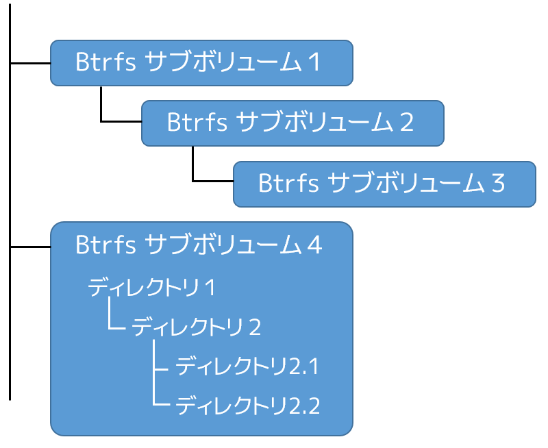
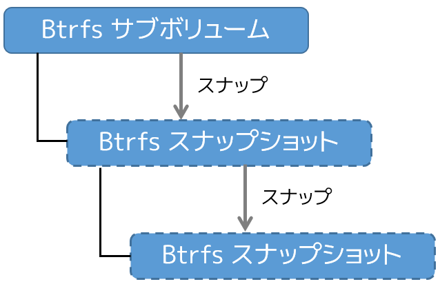
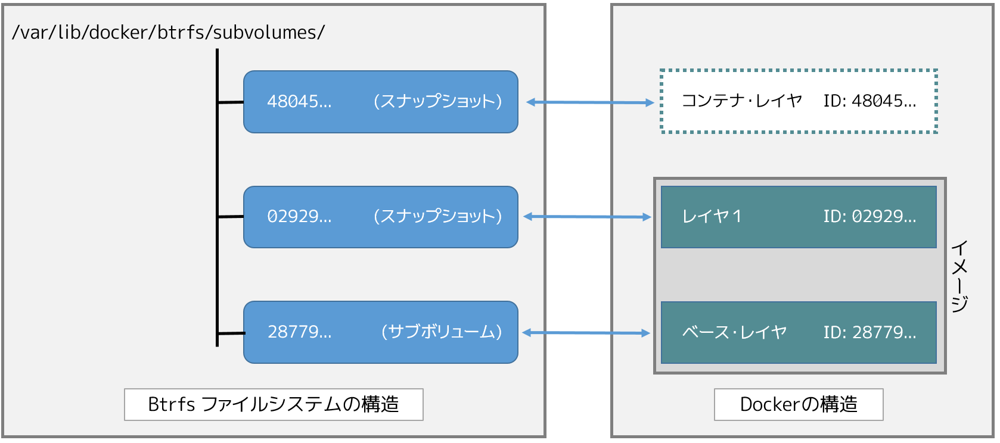

.. -*- coding: utf-8 -*-
.. URL: https://docs.docker.com/engine/userguide/storagedriver/btrfs-driver/
.. SOURCE: https://github.com/docker/docker/blob/master/docs/userguide/storagedriver/btrfs-driver.md
   doc version: 1.12
      https://github.com/docker/docker/commits/master/docs/userguide/storagedriver/btrfs-driver.md
.. check date: 2016/06/14
.. Commits on Mar 17, 2016 ca64269165fb30765d7ea0b0b231674df8da157b
.. ---------------------------------------------------------------------------

.. Docker and Btrfs in practice

.. _docker-and-btrfs-in-practice:

========================================
Btrfs ストレージ・ドライバの使用
========================================

.. sidebar:: 目次

   .. contents:: 
       :depth: 3
       :local:

.. Btrfs is a next generation copy-on-write filesystem that supports many advanced storage technologies that make it a good fit for Docker. Btrfs is included in the mainline Linux kernel and it’s on-disk-format is now considered stable. However, many of its features are still under heavy development and users should consider it a fast-moving target.

Btrfs （ビーツリー・エフエス）は次世代のコピー・オン・ライト対応ファイルシステムです。多くの高度なストレージ技術をサポートしており、Docker に適しています。Btrfs は Linux カーネルのメインラインに含まれており、オンディスク・フォーマットは安定していると考えられています。しかしながら、その機能の大部分はまだ開発中です。そのため、ユーザとしては Btrfs を動きの速い「モノ」と考えるべきでしょう。

.. Docker’s btrfs storage driver leverages many Btrfs features for image and container management. Among these features are thin provisioning, copy-on-write, and snapshotting.

Docker の ``btrfs`` ストレージ・ドライバは、イメージとコンテナを管理するために、多くの Btrfs 機能を活用します。機能とは、シン・プロビジョニング、コピー・オン・ライト、スナップショットに関するものです。

.. This article refers to Docker’s Btrfs storage driver as btrfs and the overall Btrfs Filesystem as Btrfs.

このセクションでは、Docker の Btrfs ストレージ・ドライバを ``btrfs`` と表記します。また、Btrfs ファイルシステム全体を Btrfs として表記します。

..    Note: The Commercially Supported Docker Engine (CS-Engine) does not currently support the btrfs storage driver.

.. note::

   `商用サポート版 Docker Engine（CS-Engine） <https://www.docker.com/compatibility-maintenance>`_ は、現時点では ``btrfs`` ストレージ・ドライバをサポートしていません。

.. The future of Btrfs

.. _the-future-of-btrfs:

Btrfs の未来
====================

.. Btrfs has been long hailed as the future of Linux filesystems. With full support in the mainline Linux kernel, a stable on-disk-format, and active development with a focus on stability, this is now becoming more of a reality.

Btrfs は将来の Linux ファイルシステムとして、長く賞賛されています。Linux カーネルの主流として完全にサポートされ、安定したオン・ディスク・フォーマットと、安定性に焦点をあてた活発な開発が、より現実性を高めています。

.. As far as Docker on the Linux platform goes, many people see the btrfs storage driver as a potential long-term replacement for the devicemapper storage driver. However, at the time of writing, the devicemapper storage driver should be considered safer, more stable, and more production ready. You should only consider the btrfs driver for production deployments if you understand it well and have existing experience with Btrfs.

Linux プラットフォームで Docker を使う限り、多くの皆さんには ``devicemapper`` ストレージ・ドライバを長期的に置き換えるものとして、 ``btrfs`` ストレージドライバがあるように見えてしまうでしょう。しかし、これを書いている時点では、 ``devicemapper`` ストレージ・ドライバの方が安全で、より安定しており、より *プロダクションに対応している* と考えるべきです。 ``btrfs`` ドライバを理解し、Btrfs の経験がある場合のみ、プロダクションの開発に ``btrfs`` ドライバを検討すべきでしょう。

.. Image layering and sharing with Btrfs

.. _image-layering-and-sharing-with-btrfs:

Btrfs でイメージのレイヤ化と共有
========================================

.. Docker leverages Btrfs subvolumes and snapshots for managing the on-disk components of image and container layers. Btrfs subvolumes look and feel like a normal Unix filesystem. As such, they can have their own internal directory structure that hooks into the wider Unix filesystem.

ディスク上のイメージの構成物とコンテナ・レイヤを管理するため、Docker は Btrfs の *サブボリューム* と *スナップショット* を活用します。Btrfs サブボリュームの見た目は、通常の Unix ファイルシステムと同じです。各々が内部にディレクトリ構造を持つのは、幅広い Unix ファイルシステムで見られるものです。

.. Subvolumes are natively copy-on-write and have space allocated to them on-demand from an underlying storage pool. They can also be nested and snapped. The diagram blow shows 4 subvolumes. ‘Subvolume 2’ and ‘Subvolume 3’ are nested, whereas ‘Subvolume 4’ shows its own internal directory tree.

サブボリュームはコピー・オン・ライトにネイティブに対応しており、必要があれば基礎をなすストレージ・プールから領域を割り当てます。また、領域はネスト（入れ子）にすることができ、スナップ化できます。次の図は４つのボリュームを表します。「サブボリューム４」は内部にディレクトリ・ツリーを持っているのに対し、「サブボリューム２」と「サブボリューム３」はネストされたものです。

.. Snapshots are a point-in-time read-write copy of an entire subvolume. They exist directly below the subvolume they were created from. You can create snapshots of snapshots as shown in the diagram below.

スナップショットとは、ある時点におけるサブボリューム全体の読み書きをコピーします。既存のディレクトリの下にサブボリュームを作成します。下図のように、スナップショットのスナップショットも作成できます。

.. Btfs allocates space to subvolumes and snapshots on demand from an underlying pool of storage. The unit of allocation is referred to as a chunk and chunks are normally ~1GB in size.

サブボリュームとスナップショットの必要に応じ、Btrfs は基盤をなすストレージ・プールから領域を割り当てます。割り当ての単位は *chunk* と *chunks* から参照され、通常は 1GB 以下の大きさです。

.. Snapshots are first-class citizens in a Btrfs filesystem. This means that they look, feel, and operate just like regular subvolumes. The technology required to create them is built directly into the Btrfs filesystem thanks to its native copy-on-write design. This means that Btrfs snapshots are space efficient with little or no performance overhead. The diagram below shows a subvolume and it’s snapshot sharing the same data.

スナップショットは Btrfs ファイルシステム上の優秀な機能です。つまり、通常のサブボリュームと同じ見た目と、感触、操作が可能です。ネイティブなコピー・オン・ライトの設計のおかげで、Btrfs ファイルシステム内のディレクトリにサブボリュームを構築する時、この技術が必要になります。つまり、Btrfs スナップショットは性能のオーバーヘッドが少ない、あるいは無いため、効率的に領域を使います。次の図はスナップショットが同じデータを共有しているサブボリュームです。

.. image:: ./images/btrfs-pool.png
   :scale: 60%
   :alt: btrfs プール

.. Docker’s btrfs storage driver stores every image layer and container in its own Btrfs subvolume or snapshot. The base layer of an image is stored as a subvolume whereas child image layers and containers are stored as snapshots. This is shown in the diagram below.

Docker の ``btrfs`` ストレージ・ドライバは、各イメージ・レイヤとコンテナを、自身の Btrfs サブボリュームかスナップショットに保管します。イメージのベース・レイヤはサブボリュームとして保管します。それに対して子イメージ・レイヤとコンテナは、スナップショットに保管します。これを説明したのが次の図です。

.. The high level process for creating images and containers on Docker hosts running the btrfs driver is as follows:

Docker ホストが ``btrfs`` ドライバを使い、イメージとコンテナの作成という高レベルの処理手順は、次のように行います。

..    The image’s base layer is stored in a Btrfs subvolume under /var/lib/docker/btrfs/subvolumes.

1. イメージのベース・レイヤは ``/var/lib/docker/btrfs/subvolumes`` 以下の Btrfs サブボリュームに保管します。

..    The image ID is used as the subvolume name. E.g., a base layer with image ID “f9a9f253f6105141e0f8e091a6bcdb19e3f27af949842db93acba9048ed2410b” will be stored in /var/lib/docker/btrfs/subvolumes/f9a9f253f6105141e0f8e091a6bcdb19e3f27af949842db93acba9048ed2410b

.. イメージ ID はサブボリューム名として使用されます。例えば、ベース・レイヤのイメージ ID が「f9a9f253f6105141e0f8e091a6bcdb19e3f27af949842db93acba9048ed2410b」であれば、これが保管されるのは ``/var/lib/docker/btrfs/subvolumes/f9a9f253f6105141e0f8e091a6bcdb19e3f27af949842db93acba9048ed2410b`` です。

..    Subsequent image layers are stored as a Btrfs snapshot of the parent layer’s subvolume or snapshot.

2. 以降のイメージ・レイヤは、親レイヤのサブボリュームの Btrfs スナップショットとして保存されるか、（単体の）スナップショットになります。

..    The diagram below shows a three-layer image. The base layer is a subvolume. Layer 1 is a snapshot of the base layer’s subvolume. Layer 2 is a snapshot of Layer 1’s snapshot.

以下の図は３つのイメージ・レイヤを表しています。ベース・レイヤはサブボリュームです。レイヤ１はベース・レイヤに対するサブボリュームのスナップショットです。レイヤ２はレイヤ１のスナップショットです。

.. image:: ./images/btrfs-constructs.png
   :scale: 60%
   :alt: ディスク構造上のイメージ

.. As of Docker 1.10, image layer IDs no longer correspond to directory names under /var/lib/docker/.

Docker 1.10 からは、イメージ・レイヤ ID は ``/var/lib/docker`` 以下のディレクトリ名と一致しません。

.. Image and container on-disk constructs

.. _image-and-container-on-disk-constructs:

ディスク構造上のイメージとコンテナ
========================================

.. Image layers and containers are visible in the Docker host’s filesystem at /var/lib/docker/btrfs/subvolumes/. However, as previously stated, directory names no longer correspond to image layer IDs. That said, directories for containers are present even for containers with a stopped status. This is because the btrfs storage driver mounts a default, top-level subvolume at /var/lib/docker/subvolumes. All other subvolumes and snapshots exist below that as Btrfs filesystem objects and not as individual mounts.

イメージ・レイヤとコンテナは、 Docker ホスト上のファイルシステム ``/var/lib/docker/btrfs/subvolumes/`` にあります。しかしながら、以前とは異なり、ディレクトリ名はイメージ ID の名前を表しません。コンテナ用のディレクトリは、コンテナが停止した状態でも表示されます。ストレージ・ドライバがデフォルトでマウントするのは、 ``/var/lib/docker/subvolumes`` のサブボリュームをトップレベルとする場所です。その他全てのサブボリュームとボリューム名は、 Btrfs ファイルシステムのオブジェクトとして個々にマウントするのではなく、この下に存在しています。

.. Because Btrfs works at the filesystem level and not the block level, each image and container layer can be browsed in the filesystem using normal Unix commands. The example below shows a truncated output of an ls -l command against the image’s top layer:

Btrfs はファイルシステム・レベルで動作するものであり、ブロック・レベルではありません。各イメージとコンテナのレイヤは、通常の Unix コマンドを使って参照できます。次の例は、イメージの最上位レイヤに対して ``ls -l`` コマンドを実行した結果を省略したものです。

.. code-block:: bash

   $ ls -l /var/lib/docker/btrfs/subvolumes/0a17decee4139b0de68478f149cc16346f5e711c5ae3bb969895f22dd6723751/
   total 0
   drwxr-xr-x 1 root root 1372 Oct  9 08:39 bin
   drwxr-xr-x 1 root root    0 Apr 10  2014 boot
   drwxr-xr-x 1 root root  882 Oct  9 08:38 dev
   drwxr-xr-x 1 root root 2040 Oct 12 17:27 etc
   drwxr-xr-x 1 root root    0 Apr 10  2014 home
   ...表示結果を省略...

.. Container reads and writes with Btrfs

.. _container-reads-and-writes-with-btrfs:

Btrfs でコンテナを読み書き
==============================

.. A container is a space-efficient snapshot of an image. Metadata in the snapshot points to the actual data blocks in the storage pool. This is the same as with a subvolume. Therefore, reads performed against a snapshot are essentially the same as reads performed against a subvolume. As a result, no performance overhead is incurred from the Btrfs driver.

コンテナはイメージ領域を効率的に扱うスナップショットです。スナップショットの中のメタデータが示す実際のデータ・ブロックは、ストレージ・プールの中にあります。これはサブボリュームの扱いと同じです。そのため、スナップショットの読み込み性能は、サブボリュームの読み込み性能と本質的に同じです。その結果、Btrfs ドライバ使用による性能のオーバヘッドはありません。

.. Writing a new file to a container invokes an allocate-on-demand operation to allocate new data block to the container’s snapshot. The file is then written to this new space. The allocate-on-demand operation is native to all writes with Btrfs and is the same as writing new data to a subvolume. As a result, writing new files to a container’s snapshot operate at native Btrfs speeds.

新しいファイルをコンテナに書き込む時、コンテナのスナップショットに新しいデータブロックを割り当てる処理が、必要に応じて発生します。それから、ファイルを新しい領域に書き込みます。必要に応じて書き込む処理は Btrfs によってネイティブに書き込まれ、新しいデータをサブボリュームに書き込むのと同じです。その結果、コンテナのスナップショットに新しいファイルを書き込む処理は、ネイティブな Btrfs の速度になります。

.. Updating an existing file in a container causes a copy-on-write operation (technically redirect-on-write). The driver leaves the original data and allocates new space to the snapshot. The updated data is written to this new space. Then, the driver updates the filesystem metadata in the snapshot to point to this new data. The original data is preserved in-place for subvolumes and snapshots further up the tree. This behavior is native to copy-on-write filesystems like Btrfs and incurs very little overhead.

コンテナ内にある既存のファイルを更新したら、コピー・オン・ライト処理（技術的には、書き込みのための転送、という意味です）が発生します。ドライバはオリジナルのデータをそのままに、スナップショットに新しい領域を割り当てます。更新されたデータは新しい領域に書き込みます。それから、ドライバはファイルシステムのメタデータを更新し、スナップショットが新しいデータを示すようにします。元々あったデータはサブボリュームとスナップショットのための更なるツリーの活用場所として維持されます。この動作はコピー・オン・ライトのファイルシステムがネイティブな Btrfs 向けであり、非常に小さなオーバヘットとなります。

.. With Btfs, writing and updating lots of small files can result in slow performance. More on this later.

Btrfs を使う場合、大量の小さなファイルの書き込みと更新は、パフォーマンスの低下を招きます。詳細は後ほど扱います。

.. Configuring Docker with Btrfs

.. _configuring-docker-with-btrfs:

Docker で Btrfs を設定
==============================

.. The btrfs storage driver only operates on a Docker host where /var/lib/docker is mounted as a Btrfs filesystem. The following procedure shows how to configure Btrfs on Ubuntu 14.04 LTS.

``btrfs`` ストレージ・ドライバは、Docker ホストで Btrfs ファイルシステムとしてマウントしている ``/var/lib/docker`` のみ処理します。以下の手順で、 Ubuntu 14.04 LTS 上で Btrfs を設定する方法を紹介します。
.. Prerequisites

動作条件
----------

.. If you have already used the Docker daemon on your Docker host and have images you want to keep, push them to Docker Hub or your private Docker Trusted Registry before attempting this procedure.

既に Docker ホスト上で Docker デーモンを使っている場合は、イメージをどこかに保存する必要があります。そのため、処理を進める前に、それらのイメージを Docker Hub やプライベート Docker Trusted Registry に送信しておきます。

.. Stop the Docker daemon. Then, ensure that you have a spare block device at /dev/xvdb. The device identifier may be different in your environment and you should substitute your own values throughout the procedure.

まず Docker デーモンを停止します。そして ``/dev/xvdb`` に予備のブロック・デバイスがあることを確認します。このデバイスは個々の環境によって違うかもしれませんが、処理にあたっては各環境によって違う場合があります。

.. The procedure also assumes your kernel has the appropriate Btrfs modules loaded. To verify this, use the following command:

またこの手順では、カーネルが適切な Btrfs モジュールを読み込まれているものと想定しています。これらを確認したら、以下のコマンドを実行します。

.. code-block:: bash

    $ cat /proc/filesystems | grep btrfs`

.. Configure Btrfs on Ubuntu 14.04 LTS

Ubuntu 14.04 LTS で Btrfs を設定
----------------------------------------

.. Assuming your system meets the prerequisites, do the following:

システムが動作条件を満たしていると仮定し、次の手順を進めます。

..    Install the “btrfs-tools” package.

1. 「btrfs-tools」パッケージをインストールします。

.. code-block:: bash

   $ sudo apt-get install btrfs-tools
   Reading package lists... Done
   Building dependency tree
   <出力を省略>

..    Create the Btrfs storage pool.

2. Btrfs ストレージ・プールを作成します。

..    Btrfs storage pools are created with the mkfs.btrfs command. Passing multiple devices to the mkfs.btrfs command creates a pool across all of those devices. Here you create a pool with a single device at /dev/xvdb.

Btrfs ストレージ・プールは ``mkfs.btrfs`` コマンドで作成します。複数のデバイスにわたるプールを作成するには、それぞれのデバイスで ``mkfs.btrfs`` コマンドを実行します。ここでは、作成したプールは単一デバイス上の ``/dev/xvdb`` と想定しています。

.. code-block:: bash

   $ sudo mkfs.btrfs -f /dev/xvdb
   WARNING! - Btrfs v3.12 IS EXPERIMENTAL
   WARNING! - see http://btrfs.wiki.kernel.org before using
   
   
   Turning ON incompat feature 'extref': increased hardlink limit per file to 65536
   fs created label (null) on /dev/xvdb
       nodesize 16384 leafsize 16384 sectorsize 4096 size 4.00GiB
   Btrfs v3.12

..    Be sure to substitute /dev/xvdb with the appropriate device(s) on your system.

``/dev/xvdb`` には、各システム上の適切なデバイスを割り当ててください。

..        Warning: Take note of the warning about Btrfs being experimental. As noted earlier, Btrfs is not currently recommended for production deployments unless you already have extensive experience.

.. warning::

   Btrfs は実験的な実装なのでご注意ください。先ほど説明した通り、Btrfs の利用経験がなければ、現時点ではプロダクションへのデプロイには推奨されていません。

..    If it does not already exist, create a directory for the Docker host’s local storage area at /var/lib/docker.

3. Docker ホスト上に、ローカル・ストレージ領域が ``/var/lib/docker`` になければ、ディレクトリを作成します。

.. code-block:: bash

   $ sudo mkdir /var/lib/docker

..    Configure the system to automatically mount the Btrfs filesystem each time the system boots.

4. システムのブート時に、毎回自動的に Btrfs ファイルシステムをマウントするよう設定します。

..    a. Obtain the Btrfs filesystem’s UUID.

a. Btrfs ファイルシステムの UUID を取得します。

.. code-block:: bash

   $ sudo blkid /dev/xvdb
   /dev/xvdb: UUID="a0ed851e-158b-4120-8416-c9b072c8cf47" UUID_SUB="c3927a64-4454-4eef-95c2-a7d44ac0cf27" TYPE="btrfs"

..    b. Create a /etc/fstab entry to automatically mount /var/lib/docker each time the system boots.

b. ``/etc/fstab`` エントリに、システムのブート時に毎回自動的に ``/var/lib/docker`` をマウントする記述を追加します。

.. code-block:: bash

   /dev/xvdb /var/lib/docker btrfs defaults 0 0
   UUID="a0ed851e-158b-4120-8416-c9b072c8cf47" /var/lib/docker btrfs defaults 0 0

..    Mount the new filesystem and verify the operation.

5. 新しいファイルシステムをマウントし、操作可能か確認します。

.. code-block:: bash

   $ sudo mount -a
   $ mount
   /dev/xvda1 on / type ext4 (rw,discard)
   <出力を省略>
   /dev/xvdb on /var/lib/docker type btrfs (rw)

..    The last line in the output above shows the /dev/xvdb mounted at /var/lib/docker as Btrfs.

最後の行の出力から、 ``/dev/xvdb`` は Btrfs として ``/var/lib/docker`` をマウントしているのが分かります。

.. Now that you have a Btrfs filesystem mounted at /var/lib/docker, the daemon should automatically load with the btrfs storage driver.

これで Btrfs ファイルシステムが ``/var/lib/docker`` をマウントしたので、デーモンは ``btrfs`` ストレージ・ドライバを自動的に読み込めるようにします。

..    Start the Docker daemon.

1. Docker デーモンを起動します。

.. code-block:: bash

   $ sudo service docker start
   docker start/running, process 2315

..    The procedure for starting the Docker daemon may differ depending on the Linux distribution you are using.

この Docker デーモンの起動手順は、使用している Linux ディストリビューションによっては異なる場合があります。

..    You can start the Docker daemon with the btrfs storage driver by passing the --storage-driver=btrfs flag to the docker daemon command or you can add the DOCKER_OPTS line to the Docker config file.

``btrfs`` ストレージ・ドライバを使って Docker デーモンを起動するには、 ``docker daemon`` コマンドで ``--storage-driver=btrfs`` フラグを渡すか、 Docker 設定ファイルの ``DOCKER_OPT`` 行でフラグを追加します。

..     Verify the storage driver with the docker info command.

2. ``docker info`` コマンドでストレージ・ドライバを確認します。

.. code-block:: bash

   $ sudo docker info
   Containers: 0
   Images: 0
   Storage Driver: btrfs
   [...]

.. Your Docker host is now configured to use the btrfs storage driver.

これで、Docker ホストは ``btrfs`` ストレージ・ドライバを使う新しい設定で動いています。

.. Btrfs and Docker performance

.. _btrs-and-docker-performance:

Btrfs と Docker の性能
==============================

.. There are several factors that influence Docker’s performance under the btrfs storage driver.

``btrfs`` ストレージ・ドライバ配下では、Docker の性能に影響を与える様々な要素があります。

..    Page caching. Btrfs does not support page cache sharing. This means that n containers accessing the same file require n copies to be cached. As a result, the btrfs driver may not be the best choice for PaaS and other high density container use cases.

* **ページ・キャッシュ** ：btrfs はページ・キャッシュ共有をサポートしていません。つまり、ｎ個のコンテナがキャッシュするために、ｎ個のコピーを必要とします。そのため、 ``btrfs`` ドライバは、PaaS や、その他にも密度を求められる用途には適していません。

..    Small writes. Containers performing lots of small writes (including Docker hosts that start and stop many containers) can lead to poor use of Btrfs chunks. This can ultimately lead to out-of-space conditions on your Docker host and stop it working. This is currently a major drawback to using current versions of Btrfs.

* **小さな書き込み** ：コンテナに対する小さな書き込み（Docker ホストが多くのコンテナを起動・停止している場合）が大量であれは、Btrfs の塊（chunk）を粗く消費します。これにより、停止するまで Docker ホスト上で多くの容量を消費します。これが現時点の Btrfs バージョンにおける主な障害です。

..    If you use the btrfs storage driver, closely monitor the free space on your Btrfs filesystem using the btrfs filesys show command. Do not trust the output of normal Unix commands such as df; always use the Btrfs native commands.

もし ``btrfs`` ストレージ・ドライバを使うのであれば、 ``btrfs filesystem show`` コマンドで Btrfs ファイルシステム上の空き容量を頻繁に監視してください。 ``df`` のような通常の Unix コマンドを信頼しないでください。つまり、常に Btrfs のネイティブ・コマンドを使ってください。

..    Sequential writes. Btrfs writes data to disk via journaling technique. This can impact sequential writes, where performance can be up to half.

* **シーケンシャルな書き込み** ：Btrfs はジャーナリングの技術を使ってデータをディスクに書き込みます。この影響により、シーケンシャル（連続した）書き込みでは、性能が半減します。

..    Fragmentation. Fragmentation is a natural byproduct of copy-on-write filesystems like Btrfs. Many small random writes can compound this issue. It can manifest as CPU spikes on Docker hosts using SSD media and head thrashing on Docker hosts using spinning media. Both of these result in poor performance.

* **断片化** ：断片化（fragmentation）とは、Btrfs のようなフィルシステム上でコピー・オン・ライトを行うと生じる自然な副産物です。たくさんの小さなランダムな書き込みが、断片化を引き起こします。SSD メディアを使う Docker ホスト上では CPU のスパイク（突発的な利用）が顕著ですし、回転メディア（HDD）で Docker ホストを動かす場合も、メディアをむち打つものです。いずれの場合も、パフォーマンス低下の影響を招きます。

..    Recent versions of Btrfs allow you to specify autodefrag as a mount option. This mode attempts to detect random writes and defragment them. You should perform your own tests before enabling this option on your Docker hosts. Some tests have shown this option has a negative performance impact on Docker hosts performing lots of small writes (including systems that start and stop many containers).

Btrfs の最近のバージョンは、 ``autodefrag`` をマウント用のオプションに指定できます。このモードによって、断片化せずにランダムに書き込みをします。ただ、Docker ホスト上でこのオプションを有効化する前に、自分自身で性能評価をすべきです。いくつかのテストは Docker ホスト上に多数の小さなファイルを作成しますので、良くない性能に影響与える場合があります（あるいは、システムで沢山のコンテナを停止・起動した場合も）。

..    Solid State Devices (SSD). Btrfs has native optimizations for SSD media. To enable these, mount with the -o ssd mount option. These optimizations include enhanced SSD write performance by avoiding things like seek optimizations that have no use on SSD media.

* **SSD（ソリッド・ステート・ドライブ）** ：Btrfs は SSD メディアをネイティブに最適化します。最適化を有効化するには、マウントオプションで ``-o ssh`` を指定します。 SSD はメディアを使わずシーク最適化が不要なため、これら最適化により SSD の性能を拡張します。

..    Btfs also supports the TRIM/Discard primitives. However, mounting with the -o discard mount option can cause performance issues. Therefore, it is recommended you perform your own tests before using this option.

また、Btrfs は TRIM/Discard プリミティブもサポートします。しかし、 ``-o discard`` マウント・オプションでマウントすると、性能の問題を引き起こします。そのため、このオプションを使う前に、自分自身で性能評価をするのを推奨します。

..    Use Data Volumes. Data volumes provide the best and most predictable performance. This is because they bypass the storage driver and do not incur any of the potential overheads introduced by thin provisioning and copy-on-write. For this reason, you may want to place heavy write workloads on data volumes.

* **データ・ボリュームの使用** ：データ・ボリュームは最上かつ最も予測可能な性能を提供します。これは、ストレージ・ドライバを迂回し、シン・プロビジョニングやコピー・オン・ライト処理を行わないためです。そのため、データ・ボリューム上で重たい書き込みを行うのに適しています。

.. Related Information

関連情報
==========

..    Understand images, containers, and storage drivers
    Select a storage driver
    AUFS storage driver in practice
    Device Mapper storage driver in practice

* :doc:`imagesandcontainers`
* :doc:`selectadriver`
* :doc:`aufs-driver`
* :doc:`device-mapper-driver`

.. seealso:: 

   Docker and Btrfs in practice
      https://docs.docker.com/engine/userguide/storagedriver/btrfs-driver/