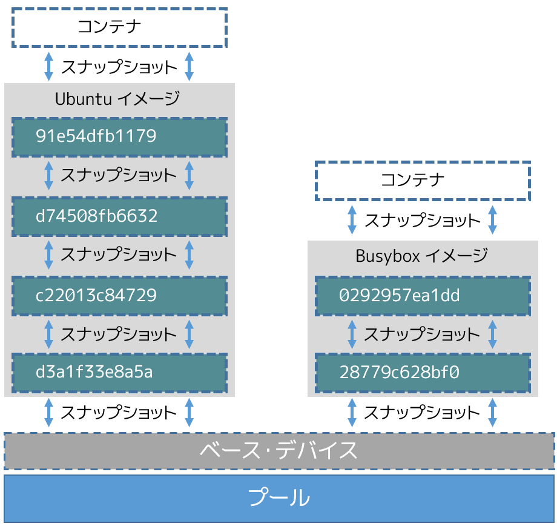
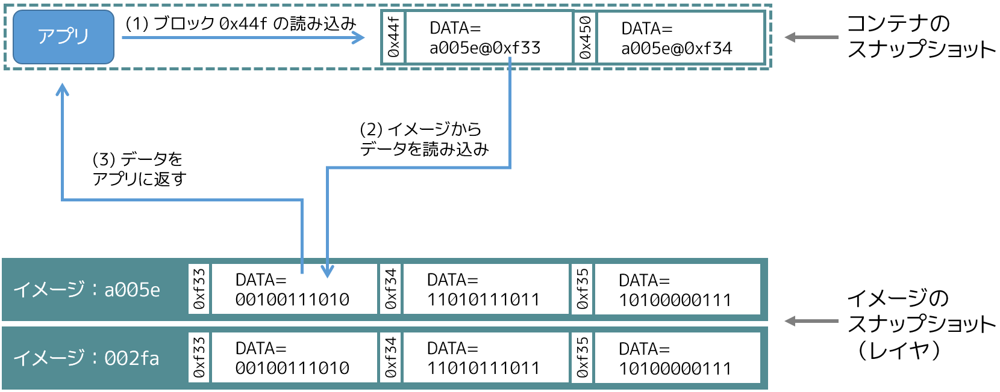

.. -*- coding: utf-8 -*-
.. URL: https://docs.docker.com/engine/userguide/storagedriver/device-mapper-driver/
.. SOURCE: https://github.com/docker/docker/blob/master/docs/userguide/storagedriver/device-mapper-driver.md
   doc version: 1.12
      https://github.com/docker/docker/commits/master/docs/userguide/storagedriver/device-mapper-driver.md
.. check date: 2016/06/14
.. Commits on Jun 4, 2016 0cddc783cff152a383a109f70a9f7bc943dbb5ba
.. ---------------------------------------------------------------------------

.. Docker and the Device Mapper storage driver

.. _docker-and-device-mapper-storage-driver:

========================================
Device Mapper ストレージ・ドライバの使用
========================================

.. sidebar:: 目次

   .. contents:: 
       :depth: 3
       :local:

.. Device Mapper is a kernel-based framework that underpins many advanced volume management technologies on Linux. Docker’s devicemapper storage driver leverages the thin provisioning and snapshotting capabilities of this framework for image and container management. This article refers to the Device Mapper storage driver as devicemapper, and the kernel framework as Device Mapper.

Device Mapper は、Linux 上で多くの高度なボリューム管理技術を支えるカーネル・ベースのフレームワークです。Docker の ``devicemapper`` ストレージ・ドライバは、シン・プロビジョニングとスナップショット機能のために、イメージとコンテナ管理にこのフレームワークを活用します。このセクションでは、Device Mapper ストレージ・ドライバを ``devicemapper`` と表記します。、カーネルのフレームワークを ``Device Mapper`` として言及します。

..     Note: The Commercially Supported Docker Engine (CS-Engine) running on RHEL and CentOS Linux requires that you use the devicemapper storage driver.

.. note::

   ``devicemapper`` ストレージ・ドライバを使うには、 `RHEL か CentOS Linux 上で商用サポート版 Docker Engine (CS-Engine) を実行 <https://www.docker.com/compatibility-maintenance>`_ する必要があります。

.. An alternative to AUFS

.. _an-alternative-to-aufs:

AUFS の代替
====================

.. Docker originally ran on Ubuntu and Debian Linux and used AUFS for its storage backend. As Docker became popular, many of the companies that wanted to use it were using Red Hat Enterprise Linux (RHEL). Unfortunately, because the upstream mainline Linux kernel did not include AUFS, RHEL did not use AUFS either.

当初の Docker は、Ubuntu と Debian Linux 上で AUFS をストレージのバックエンドに使っていました。Docker が有名になるにつれ、多くの会社が Red Hat Enterprise Linux 上で使いたいと考え始めました。残念ながら、AUFS は Linux カーネル上流のメインラインではないため、RHEL は AUFS を扱いませんでした。

.. To correct this Red Hat developers investigated getting AUFS into the mainline kernel. Ultimately, though, they decided a better idea was to develop a new storage backend. Moreover, they would base this new storage backend on existing Device Mapper technology.

この状況を変えるべく、Red Hat 社の開発者らが AUFS をカーネルのメインラインに入れられるよう取り組みました。しかしながら、新しいストレージ・バックエンドを開発する方が良い考えであると決断したのです。さらに、ストレージのバックエンドには、既に存在していた ``Device Mapper`` 技術を基盤としました。

.. Red Hat collaborated with Docker Inc. to contribute this new driver. As a result of this collaboration, Docker’s Engine was re-engineered to make the storage backend pluggable. So it was that the devicemapper became the second storage driver Docker supported.

Red Hat 社は Docker 社と協同で新しいドライバの開発に取り組みました。この協調の結果、ストレージ・バックエンドの取り付け・取り外しが可能な（pluggable）Docker エンジンを再設計しました。そして、 ``devicemapper`` は Docker がサポートする２つめのストレージ・ドライバとなったのです。

.. Device Mapper has been included in the mainline Linux kernel since version 2.6.9. It is a core part of RHEL family of Linux distributions. This means that the devicemapper storage driver is based on stable code that has a lot of real-world production deployments and strong community support.

Device Mapper は Linux カーネルのバージョン 2.6.9 以降、メインラインに組み込まれました。これは、RHEL ファミリーの Linux ディストリビューションの中心部です。つまり、 ``devicemapper`` ストレージ・ドライバは安定したコードを基盤としており、現実世界における多くのプロダクションへのデプロイをもたらします。また、強力なコミュニティのサポートも得られます。

.. Image layering and sharing

.. _devicemapper-image-layering-and-sharing:

イメージのレイヤ化と共有
==============================

.. The devicemapper driver stores every image and container on its own virtual device. These devices are thin-provisioned copy-on-write snapshot devices. Device Mapper technology works at the block level rather than the file level. This means that devicemapper storage driver’s thin provisioning and copy-on-write operations work with blocks rather than entire files.

``devicemapper`` ドライバは、全てのイメージとコンテナを自身の仮想デバイスに保管します。これらのデバイスとは、シン・プロビジョニングされ、コピー・オン・ライト可能であり、スナップショットのデバイスです。Device Mapper 技術はファイル・レベルというよりも、ブロック・レベルで動作します。つまり、 ``devicemapper`` ストレージ・ドライバのシン・プロビジョニング（thin-provisioning）とコピー・オン・ライト（copy-on-write）処理は、ファイルではなくブロックに対して行います。

..    Note: Snapshots are also referred to as thin devices or virtual devices. They all mean the same thing in the context of the devicemapper storage driver.

.. note::

   また、スナップショットは *シン・デバイス（thin device）* や *仮想デバイス（virtual device）* としても参照されます。つまり、 ``devicemapper`` ストレージ・ドライバにおいては、どれも同じものを意味します。

.. With devicemapper the high level process for creating images is as follows:

``devicemapper`` でイメージを作る高度な手順は、以下の通りです。

..    The devicemapper storage driver creates a thin pool.

1. ``devicemapper`` ストレージ・ドライバはシン・プール（thin pool）を作成します。

..    The pool is created from block devices or loop mounted sparse files (more on this later).

ブロック・デバイスかループ用にマウントした薄いファイル（sparse files）上に、このプールを作成します。

..    Next it creates a base device.

2. 次に *ベース・デバイス（base device）* を作成します。

..    A base device is a thin device with a filesystem. You can see which filesystem is in use by running the docker info command and checking the Backing filesystem value.

ベース・デバイスとは、ファイルシステムのシン・デバイス（thin device）です。どのファイルシステムが使われているかを調べるには、 ``docker info`` コマンドを実行し、 ``Backing filesystem`` 値を確認します。

..    Each new image (and image layer) is a snapshot of this base device.

3. それぞれの新しいイメージ（とイメージ・レイヤ）は、このベース・デバイスのスナップショットです。

..    These are thin provisioned copy-on-write snapshots. This means that they are initially empty and only consume space from the pool when data is written to them.

これらがシン・プロビジョニングされたコピー・オン・ライトなスナップショットです。つまり、これらは初期状態では空っぽですが、データが書き込まれる時だけ容量を使います。

.. With devicemapper, container layers are snapshots of the image they are created from. Just as with images, container snapshots are thin provisioned copy-on-write snapshots. The container snapshot stores all updates to the container. The devicemapper allocates space to them on-demand from the pool as and when data is written to the container.

``devicemapper`` では、ここで作成されたイメージのスナップショットが、コンテナ・レイヤになります。イメージと同様に、コンテナのスナップショットも、シン・プロビジョニングされたコピー・オン・ライトなスナップショットです。コンテナのスナップショットに、コンテナ上での全ての変更が保管されます。 ``devicemapper`` は、コンテナに対してデータを書き込む時、このプールから必要に応じて領域を割り当てます。

.. The high level diagram below shows a thin pool with a base device and two images.

以下のハイレベルな図は、ベース・デバイスのシン・プールと２つのイメージを表します。

.. image:: ./images/base-device.png
   :scale: 60%
   :alt: ベース・デバイス

.. If you look closely at the diagram you’ll see that it’s snapshots all the way down. Each image layer is a snapshot of the layer below it. The lowest layer of each image is a snapshot of the base device that exists in the pool. This base device is a Device Mapper artifact and not a Docker image layer.

細かく図を見ていきますと、スナップショットは全体的に下向きなのが分かるでしょう。各イメージ・レイヤは下にあるレイヤのスナップショットです。各イメージの最も下にあるレイヤは、プール上に存在するベース・デバイスのスナップショットです。このベース・デバイスとは ``Device Mapper`` のアーティファクト（artifact；成果物の意味）であり、Docker イメージ・レイヤではありません。

.. A container is a snapshot of the image it is created from. The diagram below shows two containers - one based on the Ubuntu image and the other based on the Busybox image.

コンテナとは、ここから作成したイメージのスナップショットです。下図は２つのコンテナです。一方は Ubuntu イメージをベースにし、もう一方は Busybox イメージをベースにしています。

.. Reads with the devicemapper

.. _reads-with-the-devicemapper:

devicemapper からの読み込み
==============================

.. Let’s look at how reads and writes occur using the devicemapper storage driver. The diagram below shows the high level process for reading a single block (0x44f) in an example container.

``devicemapper`` ストレージ・ドライバが、どのように読み書きしているか見ていきましょう。下図は、サンプル・コンテナが単一のブロック（ ``0x44f`` ）を読み込むという、ハイレベルな手順です。

..    An application makes a read request for block 0x44f in the container.

1. アプリケーションがコンテナ内のブロック ``0x44f`` に対して読み込みを要求します。

..    Because the container is a thin snapshot of an image it does not have the data. Instead, it has a pointer (PTR) to where the data is stored in the image snapshot lower down in the image stack.

コンテナは、イメージの薄い（thin）スナップショットであり、データを持っていません。そのかわりに、下層のイメージ層（スタック）にあるイメージのスナップショット上の、どこにデータが保管されているかを示すポインタ（PTR）を持っています。

..    The storage driver follows the pointer to block 0xf33 in the snapshot relating to image layer a005....

2. ストレージ・ドライバは、スナップショットのブロック ``0xf33`` と関連するイメージ・レイヤ ``a005...`` のポインタを探します。

..    The devicemapper copies the contents of block 0xf33 from the image snapshot to memory in the container.

3. ``devicemapper`` はブロック ``0xf33`` の内容を、イメージのスナップショットからコンテナのメモリ上にコピーします。

..    The storage driver returns the data to the requesting application.

4. ストレージ・ドライバはアプリケーションがリクエストしたデータを返します。

.. Write examples

書き込み例
==========

.. With the devicemapper driver, writing new data to a container is accomplish..ed by an allocate-on-demand operation. Updating existing data uses a copy-on-write operation. Because Device Mapper is a block-based technology these operations occur at the block level.

``devicemapper`` ドライバで新しいデータをコンテナに書き込むには、*オンデマンドの割り当て（allocate-on-demand）* を行います。コピー・オン・ライト処理により、既存のデータを更新します。Device Mapper はブロック・ベースの技術のため、これらの処理をブロック・レベルで行います。

.. For example, when making a small change to a large file in a container, the devicemapper storage driver does not copy the entire file. It only copies the blocks to be modified. Each block is 64KB.

例えば、コンテナ内の大きなファイルに小さな変更を加える時、 ``devicemapper`` ストレージ・ドライバはファイル全体コピーをコピーしません。コピーするのは、変更するブロックのみです。各ブロックは 64KB です。

.. Writing new data

.. _devicemapper-writing-new-data:

新しいデータの書き込み
------------------------------

.. To write 56KB of new data to a container:

コンテナに 56KB の新しいデータを書き込みます。

..    An application makes a request to write 56KB of new data to the container.

1. アプリケーションはコンテナに 56KB の新しいデータの書き込みを要求します。

..    The allocate-on-demand operation allocates a single new 64KB block to the containers snapshot.

2. オンデマンドの割り当て処理により、コンテナのスナップショットに対して、新しい 64KB のブロックが１つ割り当てられます。

..    If the write operation is larger than 64KB, multiple new blocks are allocated to the container snapshot.

書き込み対象が 64KB よりも大きければ、複数の新しいブロックがコンテナに対して割り当てられます。

..    The data is written to the newly allocated block.

3. 新しく割り当てられたブロックにデータを書き込みます。

.. Overwriting existing data

.. _devicemapper-overwriting-existing-data:

既存のデータを上書き
------------------------------

.. To modify existing data for the first time:

既存のデータに対して初めて変更を加える場合、

..    An application makes a request to modify some data in the container.

1. アプリケーションはコンテナ上にあるデータの変更を要求します。

..    A copy-on-write operation locates the blocks that need updating.

2. 更新が必要なブロックに対して、コピー・オン・ライト処理が行われます。

..    The operation allocates new empty blocks to the container snapshot and copies the data into those blocks.

3. 処理によって新しい空のブロックがコンテナのスナップショットに割り当てられ、そのブロックにデータがコピーされます。

..    The modified data is written into the newly allocated blocks.

4. 新しく割り当てられたブロックの中に、変更したデータを書き込みます。

.. The application in the container is unaware of any of these allocate-on-demand and copy-on-write operations. However, they may add latency to the application’s read and write operations.

コンテナ内のアプリケーションは、必要に応じた割り当てやコピー・オン・ライト処理を意識しません。しかしながら、アプリケーションの読み書き処理において、待ち時間を増やすでしょう。

.. Configure Docker with devicemapper

.. _configuring-docker-with-devicemapper:

Docker で devicemapper を使う設定
========================================

.. The devicemapper is the default Docker storage driver on some Linux distributions. This includes RHEL and most of its forks. Currently, the following distributions support the driver:

複数のディストリビューションにおいて、``devicemapper`` は標準の Docker ストレージ・ドライバです。ディストリビューションには RHEL や派生したものが含まれます。現時点では、以下のディストリビューションがドライバをサポートしています。

* RHEL/CentOS/Fedora
* Ubuntu 12.04
* Ubuntu 14.04
* Debian

.. Docker hosts running the devicemapper storage driver default to a configuration mode known as loop-lvm. This mode uses sparse files to build the thin pool used by image and container snapshots. The mode is designed to work out-of-the-box with no additional configuration. However, production deployments should not run under loop-lvm mode.

Docker ホストは ``devicemapper`` ストレージ・ドライバを、デフォルトでは ``loop-lvm`` モードで設定します。このモードは、イメージとコンテナのスナップショットが使うシン・プール（thin pool）を構築するために、スパース・ファイル（sparse file；まばらなファイル）を使う指定です。このモードは、設定に変更を加えることなく、革新的な動きをするように設計されています。しかしながら、プロダクションへのデプロイでは、 ``loop-lvm`` モードの下で実行すべきではありません。

.. You can detect the mode by viewing the docker info command:

どのようなモードで動作しているか確認するには ``docker info`` コマンドを使います。

.. code-block:: bash

   $ sudo docker info
   Containers: 0
   Images: 0
   Storage Driver: devicemapper
    Pool Name: docker-202:2-25220302-pool
    Pool Blocksize: 65.54 kB
    Backing Filesystem: xfs
    [...]
    Data loop file: /var/lib/docker/devicemapper/devicemapper/data
    Metadata loop file: /var/lib/docker/devicemapper/devicemapper/metadata
    Library Version: 1.02.93-RHEL7 (2015-01-28)
    [...]
 
.. The output above shows a Docker host running with the devicemapper storage driver operating in loop-lvm mode. This is indicated by the fact that the Data loop file and a Metadata loop file are on files under /var/lib/docker/devicemapper/devicemapper. These are loopback mounted sparse files.

この実行結果から、Docker ホストは ``devicemapper`` ストレージ・ドライバの処理に ``loop-lvm`` モードを使っているのが分かります。実際には、 ``データ・ループ・ファイル (data loop file)`` と ``メタデータ・ループ・ファイル (Metadata loop file)`` のファイルが ``/var/lib/docker/devicemapper/devicemapper`` 配下にあるのを意味します。これらがループバックにマウントされているパース・ファイルです。

.. Configure direct-lvm mode for production

.. _configure-direct-lvm-mode-for-production:

プロダクション用に direct-lvm モードを設定
--------------------------------------------------

.. The preferred configuration for production deployments is direct-lvm. This mode uses block devices to create the thin pool. The following procedure shows you how to configure a Docker host to use the devicemapper storage driver in a direct-lvm configuration.

プロダクションへのデプロイに適した設定は ``direct-lvm`` モードです。このモードはシン・プールの作成にブロック・デバイスを使います。以下の手順は、Docker ホストが ``devicemapper`` ストレージ・ドライバを ``direct-lvm`` 設定で使えるようにします。

..    Caution: If you have already run the Docker daemon on your Docker host and have images you want to keep, push them Docker Hub or your private Docker Trusted Registry before attempting this procedure.

.. caution::

   既に Docker ホスト上で Docker デーモンを使っている場合は、イメージをどこかに保存する必要があります。そのため、処理を進める前に、それらのイメージを Docker Hub やプライベート Docker Trusted Registry に送信しておきます。

.. The procedure below will create a logical volume and configured as a thin pool to use as backing for the storage pool. It assumes that you have a spare block device at /dev/xvdf with enough free space to complete the task. The device identifier and volume sizes may be be different in your environment and you should substitute your own values throughout the procedure. The procedure also assumes that the Docker daemon is in the stopped state.

以下の手順は論理データ・ボリュームと、ストレージ・プールの基礎として設定されたシン・プールを使います。ここでは別のブロック・デバイス ``/dev/xvdf`` を持っており、処理するための十分な空き容量があると想定しています。デバイスの識別子とボリューム・サイズは皆さんの環境とは異なるかもしれません。手順を進める時は、自分の環境にあわせて適切に置き換えてください。また、手順は Docker デーモンが停止した状態から始めるのを想定しています。

.. Log in to the Docker host you want to configure and stop the Docker daemon.

1. 設定対象の Docker ホストにログインし、Docker デーモンを停止します。

.. Install the LVM2 package. The LVM2 package includes the userspace toolset that provides logical volume management facilities on linux.

2. LVM2 パッケージをインストールします。LVM2 パッケージにはユーザー向けのツールが含まれており、簡単に Linux 上で論理ボリュームを管理するものです。

.. Create a physical volume replacing /dev/xvdf with your block device.

3. 物理ボリュームにブロック・デバイス ``/dev/xvdf`` を作成します。

.. code-block:: bash

   $ pvcreate /dev/xvdf

.. Create a ‘docker’ volume group.

4. ``docker`` ボリューム・グループを作成します。

.. code-block:: bash

   $ vgcreate docker /dev/xvdf

..    Create a thin pool named thinpool.

5. ``thinpool`` という名前のシン・プール（thin pool）を作成します。

..    In this example, the data logical is 95% of the ‘docker’ volume group size. Leaving this free space allows for auto expanding of either the data or metadata if space runs low as a temporary stopgap.

この例では、 ``docker`` ボリューム・グループの論理データ（data logical）は 95% の大きさとします。残りの容量は、データもしくはメタデータによって空き容量が少なくなった時の一時的な退避用に使います。

.. code-block:: bash

   $ lvcreate --wipesignatures y -n thinpool docker -l 95%VG
   $ lvcreate --wipesignatures y -n thinpoolmeta docker -l 1%VG

..    Convert the pool to a thin pool.

6. プールをシン・プールに変換します。

.. code-block:: bash

   $ lvconvert -y --zero n -c 512K --thinpool docker/thinpool --poolmetadata docker/thinpoolmeta

..    Configure autoextension of thin pools via an lvm profile.

7. ``lvm`` プロフィールを経由してシン・プールを自動拡張するよう設定します。

.. code-block:: bash

   $ vi /etc/lvm/profile/docker-thinpool.profile

..    Specify ‘thin_pool_autoextend_threshold’ value.

8.  ``thin_pool_autoextend_threshold`` 値を指定します。

..    The value should be the percentage of space used before lvm attempts to autoextend the available space (100 = disabled).

ここで指定する値は、先ほどの ``lvm`` 領域がどの程度まで到達したら、領域をどこまで自動拡張するかをパーセントで指定します（100 = 無効化です）。

.. code-block:: bash

   thin_pool_autoextend_threshold = 80

..    Modify the thin_pool_autoextend_percent for when thin pool autoextension occurs.

9. シン・プールの自動拡張が発生するタイミングを指定します。

..    The value’s setting is the perentage of space to increase the thin pool (100 = disabled)

シン・プールの領域を増やす空き容量のタイミングをパーセントで指定します（100 = 無効化です）。

.. code-block:: bash

   thin_pool_autoextend_percent = 20

..    Check your work, your docker-thinpool.profile file should appear similar to the following:

10. 確認をします。 ``docker-thinpool.profile`` は次のように表示されます。

..    An example /etc/lvm/profile/docker-thinpool.profile file:

``/etc/lvm/profile/docker-thinpool.profile`` ファイルの例：

::

   activation {
       thin_pool_autoextend_threshold=80
       thin_pool_autoextend_percent=20
   }

..    Apply your new lvm profile

11. 新しい lvm プロフィールを適用します。

.. code-block:: bash

   $ lvchange --metadataprofile docker-thinpool docker/thinpool

..    Verify the lv is monitored.

12. ``lv`` （論理ボリューム）をモニタしているのを確認します。

.. code-block:: bash

   $ lvs -o+seg_monitor

..    If Engine was previously started, clear your graph driver directory.

13. Docker Engine を起動していた場合は、グラフ・ドライバを直接削除します。

..    Clearing your graph driver removes any images and containers in your Docker installation.

Docker インストール時のイメージとコンテナからグラフ・ドライバを削除します。

.. code-block:: bash

   $ rm -rf /var/lib/docker/*

..    Configure the Engine daemon with specific devicemapper options.

14. Engine デーモンが devicemapper オプションを使うように設定します。

..    There are two ways to do this. You can set options on the commmand line if you start the daemon there:

設定には２つの方法があります。デーモンの起動時にオプションを指定するには、次のようにします。

.. code-block:: bash

   --storage-driver=devicemapper --storage-opt=dm.thinpooldev=/dev/mapper/docker-thinpool --storage-opt dm.use_deferred_removal=true

..    You can also set them for startup in the daemon.json configuration, for example:

あるいは ``daemon.json`` 設定ファイルで起動時に指定も可能です。例：

::

    {
            "storage-driver": "devicemapper",
            "storage-opts": [
                    "dm.thinpooldev=/dev/mapper/docker-thinpool",
                    "dm.use_deferred_removal=true"
            ]
    }

.. If using systemd and modifying the daemon configuration via unit or drop-in file, reload systemd to scan for changes.

15. systemd を使っているのであれば、unit あるいはドロップイン・ファイルを経由してデーモン設定を変更するため、変更を読み取るため systemd を再読み込みします。

.. code-block:: bash

   $ systemctl daemon-reload

..    Start the Engine daemon.

16. Docker Engine デーモンを起動します。

.. code-block:: bash

   $ systemctl start docker

.. After you start the Engine daemon, ensure you monitor your thin pool and volume group free space. While the volume group will auto-extend, it can still fill up. To monitor logical volumes, use lvs without options or lvs -a to see tha data and metadata sizes. To monitor volume group free space, use the vgs command.

Docker Engine デーモンを起動したら、シン・プールとボリューム・グループの空き容量を確認します。ボリューム・グループは自動拡張しますので、容量を使い尽くす可能性があります。論理ボリュームを監視するには、オプションを指定せず ``lvs`` を使うか、 ``lvs -a`` でデータとメタデータの大きさを確認します。ボリューム・グループの空き容量を確認するには ``vgs`` コマンドを使います。

.. Logs can show the auto-extension of the thin pool when it hits the threshold, to view the logs use:

先ほど設定したシン・プールの閾値を越えたかどうかを確認するには、次のようにログを表示します。

.. code-block:: bash

   journalctl -fu dm-event.service

.. If you run into repeated problems with thin pool, you can use the dm.min_free_space option to tune the Engine behavior. This value ensures that operations fail with a warning when the free space is at or near the minimum. For information, see the storage driver options in the Engine daemon reference.

シン・プールで問題を繰り返す場合は、 ``dm.min_free_spaces`` オプションで Engine の挙動を調整できます。この値は最小値に近づいた時、警告を出して操作させなくします。詳しい情報は :ref:`storage-driver-options` をご覧ください。

.. Examine devicemapper structures on the host

.. _examine-devicemapper-structure-on-the-host:

ホスト上の devicemapper 構造の例
----------------------------------------

.. You can use the lsblk command to see the device files created above and the pool that the devicemapper storage driver creates on top of them.

``lsblk`` コマンドを使えば、先ほど作成したデバイス・ファイルと、その上に ``devicemapper`` ストレージ・ドライバによって作られた ``pool`` （プール）を確認できます。

.. code-block:: bash

   $ sudo lsblk
   NAME                       MAJ:MIN RM  SIZE RO TYPE MOUNTPOINT
   xvda                       202:0    0    8G  0 disk
   └─xvda1                    202:1    0    8G  0 part /
   xvdf                       202:80   0   10G  0 disk
   ├─vg--docker-data          253:0    0   90G  0 lvm
   │ └─docker-202:1-1032-pool 253:2    0   10G  0 dm
   └─vg--docker-metadata      253:1    0    4G  0 lvm
     └─docker-202:1-1032-pool 253:2    0   10G  0 dm
  
.. The diagram below shows the image from prior examples updated with the detail from the lsblk command above.

下図は、先ほどの例で扱ったイメージの更新を、 ``lsblk`` コマンドの詳細とあわせて表しています。

.. image:: ./images/devicemapper-pool.png
   :scale: 60%
   :alt: ディスク構造上のイメージ

.. In the diagram, the pool is named Docker-202:1-1032-pool and spans the data and metadata devices created earlier. The devicemapper constructs the pool name as follows:

この図では、プールは ``Docker-202:1-1032-pool`` と名付けられ、先ほど作成した ``data`` と ``metadata`` デバイスにわたっています。この ``devicemapper`` のプール名は、次のような形式です。

.. code-block:: bash

   Docker-MAJ:MIN-INO-pool

.. MAJ, MIN and INO refer to the major and minor device numbers and inode.

``MAJ`` 、 ``NIN`` 、 ``INO`` は、デバイスのメジャー番号、マイナー番号、i ノード番号です。

.. Because Device Mapper operates at the block level it is more difficult to see diffs between image layers and containers. However, there are two key directories. The /var/lib/docker/devicemapper/mnt directory contains the mount points for images and containers. The /var/lib/docker/devicemapper/metadata directory contains one file for every image and container snapshot. The files contain metadata about each snapshot in JSON format.

Device Mapper はブロック・レベルで処理を行うため、イメージ・レイヤとコンテナ間の差分を見るのは、少し大変です。しかしながら、２つの鍵となるディレクトリがあります。 ``/var/lib/docker/devicemapper/mnt`` ディレクトリには、イメージとコンテナのマウント・ポイントがあります。 ``/var/lib/docker/devicemapper/metadata`` ディレクトリには、それぞれのイメージとコンテナのスナップショットを格納する１つのファイルがあります。このファイルには、各スナップショットのメタデータが JSON 形式で含みます。

.. Increase capacity on a running device

.. _increase-capacity-on-a-running-device:

実行中デバイスの容量を増やす
==============================

.. You can increase the capacity of the pool on a running thin-pool device. This is useful if the data's logical volume is full and the volume group is at full capacity.

実行中のシン・プール・デバイスのプール容量を増加できます。データの論理ボリュームが一杯になる時やボリューム・グループの容量が一杯になる時に便利です。

.. For a loop-lvm configuration

.. _for-a-loop-lvm-configuration:

loop-lvm 用の設定
--------------------

.. In this scenario, the thin pool is configured to use loop-lvm mode. To show the specifics of the existing configuration use docker info:

このシナリオでは、シン・プールは ``loop-lvm`` モードの設定とします。 ``docker info`` を使うと現在の設定詳細を表示します。

.. code-block:: bash

   $ sudo docker info
   Containers: 0
    Running: 0
    Paused: 0
    Stopped: 0
   Images: 2
   Server Version: 1.11.0-rc2
   Storage Driver: devicemapper
    Pool Name: docker-8:1-123141-pool
    Pool Blocksize: 65.54 kB
    Base Device Size: 10.74 GB
    Backing Filesystem: ext4
    Data file: /dev/loop0
    Metadata file: /dev/loop1
    Data Space Used: 1.202 GB
    Data Space Total: 107.4 GB
    Data Space Available: 4.506 GB
    Metadata Space Used: 1.729 MB
    Metadata Space Total: 2.147 GB
    Metadata Space Available: 2.146 GB
    Udev Sync Supported: true
    Deferred Removal Enabled: false
    Deferred Deletion Enabled: false
    Deferred Deleted Device Count: 0
    Data loop file: /var/lib/docker/devicemapper/devicemapper/data
    WARNING: Usage of loopback devices is strongly discouraged for production use. Either use `--storage-opt dm.thinpooldev` or use `--storage-opt dm.no_warn_on_loop_devices=true` to suppress this warning.
    Metadata loop file: /var/lib/docker/devicemapper/devicemapper/metadata
    Library Version: 1.02.90 (2014-09-01)
   Logging Driver: json-file
   [...]

.. The Data Space values show that the pool is 100GB total. This example extends the pool to 200GB.

``Data Space`` （データ領域）の値は合計 100GB です。この例ではプールを 200GB に拡張します。

..    List the sizes of the devices.

1. デバイスの容量一覧を表示します。

.. code-block:: bash

   $ sudo ls -lh /var/lib/docker/devicemapper/devicemapper/
   total 1175492
   -rw------- 1 root root 100G Mar 30 05:22 data
   -rw------- 1 root root 2.0G Mar 31 11:17 metadata

..    Truncate data file to the size of the metadata file (approximage 200GB).

2. ``data`` ファイルを ``metadata`` ファイルの容量（約 200GB）に切り出します（truncate）。

.. code-block:: bash

   $ sudo truncate -s 214748364800 /var/lib/docker/devicemapper/devicemapper/data

..    Verify the file size changed.

3. 変更を確認します。

.. code-block:: bash

   $ sudo ls -lh /var/lib/docker/devicemapper/devicemapper/
   total 1.2G
   -rw------- 1 root root 200G Apr 14 08:47 data
   -rw------- 1 root root 2.0G Apr 19 13:27 metadata

..    Reload data loop device

4. ループ・デバイスをのデータを再読み込みします。

.. code-block:: bash

   $ sudo blockdev --getsize64 /dev/loop0
   107374182400
   $ sudo losetup -c /dev/loop0
   $ sudo blockdev --getsize64 /dev/loop0
   214748364800

..    Reload devicemapper thin pool.

5. devicemapper シン・プールを再読み込みします。

..    a. Get the pool name first.

a. まずプール名を取得します。

.. code-block:: bash

   $ sudo dmsetup status | grep pool
   docker-8:1-123141-pool: 0 209715200 thin-pool 91
   422/524288 18338/1638400 - rw discard_passdown queue_if_no_space -

..    The name is the string before the colon.

名前はコロンの前の文字列です。

..    b. Dump the device mapper table first.

b. そして、デバイス・マッパー・テーブルをダンプします。

.. code-block:: bash

   $ sudo dmsetup table docker-8:1-123141-pool
   0 209715200 thin-pool 7:1 7:0 128 32768 1 skip_block_zeroing

..    c. Calculate the real total sectors of the thin pool now.

c. シン・プールの現在の実合計セクタを計算します。

..    Change the second number of the table info (i.e. the number of sectors) to reflect the new number of 512 byte sectors in the disk. For example, as the new loop size is 200GB, change the second number to 419430400.

テーブル情報の２つめの数値（例： セクタ数）を変更するため、ディスク内で新しい 512 バイトのセクタを反映します。例えば、新しいプール容量が 200GB であれば、２つめの数値は 419430400 に変わります。

..    d. Reload the thin pool with the new sector number

d. 新しいセクタ番号でシン・プールを再読み込みします。

.. code-block:: bash

   $ sudo dmsetup suspend docker-8:1-123141-pool \
       && sudo dmsetup reload docker-8:1-123141-pool --table '0 419430400 thin-pool 7:1 7:0 128 32768 1 skip_block_zeroing' \
       && sudo dmsetup resume docker-8:1-123141-pool

.. The device_tool

.. _the-device-tool:

device_tool
^^^^^^^^^^^^^^^^^^^^

.. The Docker's projects contrib directory contains not part of the core distribution. These tools that are often useful but can also be out-of-date. In this directory, is the device_tool.go which you can also resize the loop-lvm thin pool.

Docker プロジェクトの ``contrib`` ディレクトリにあるのは、ディストリビューションのコア（中心）ではありません。これらのツールは多くの場面で役立ちますが、古いものがあるかもしれません。ディレクトリ内にある `device_tool.go <https://github.com/docker/docker/tree/master/contrib/docker-device-tool>`_ で loop-lvm シン・プールの容量変更も可能です。

.. To use the tool, compile it first. Then, do the following to resize the pool:

ツールを使うためには、まずコンパイルします。それからプール容量を次のように変更します：

.. code-block:: bash

   $ ./device_tool resize 200GB

.. For a direct-lvm mode configuration

.. _for-a-direct-lvm-mode-configuration:

direct-lvm モード用の設定
------------------------------

.. In this example, you extend the capacity of a running device that uses the direct-lvm configuration. This example assumes you are using the /dev/sdh1 disk partition.

この例では ``direct-lvm`` 設定を使って実行中デバイスの容量を拡張します。例では ``/dev/sdh1`` ディスク・パーティションを使っているものと想定します。

..    Extend the volume group (VG) vg-docker.

1. ボリューム・グループ（VG） ``vg-docker`` を拡張します。

.. code-block:: bash

   $ sudo vgextend vg-docker /dev/sdh1
   Volume group "vg-docker" successfully extended

..    Your volume group may use a different name.

皆さんは別のボリューム名を使っているかもしれません。

..    Extend the data logical volume(LV) vg-docker/data

2. ``data`` 論理ボリューム（LV） ``vg-docker/data`` を拡張します。

.. code-block:: bash

   $ sudo lvextend  -l+100%FREE -n vg-docker/data
   Extending logical volume data to 200 GiB
   Logical volume data successfully resized

..    Reload devicemapper thin pool.

3. devicemapper シン・プールを再読み込みします。

..    a. Get the pool name.

a. プール名を取得します。

.. code-block:: bash

   $ sudo dmsetup status | grep pool
   docker-253:17-1835016-pool: 0 96460800 thin-pool 51593 6270/1048576 701943/753600 - rw no_discard_passdown queue_if_no_space

..    The name is the string before the colon.

名前はコロン前の文字列です。

..    b. Dump the device mapper table.

b. デバイス・マッパー・テーブルをダンプします。

.. code-block:: bash

   $ sudo dmsetup table docker-253:17-1835016-pool
   0 96460800 thin-pool 252:0 252:1 128 32768 1 skip_block_zeroing

..    c. Calculate the real total sectors of the thin pool now. we can use blockdev to get the real size of data lv.

c. シン・プールの現在の実合計セクタを計算します。 ``blockdev`` を使って data 論理ボリュームの実サイズを取得できます。

..    Change the second number of the table info (i.e. the number of sectors) to reflect the new number of 512 byte sectors in the disk. For example, as the new data lv size is 264132100096 bytes, change the second number to 515883008.

テーブル情報の２つめの数値（例： ディスク終了セクタ）を変更するため、ディスク内で新しい 512 バイトのセクタを反映します。例えば、新しい data 論理ボリューム容量が 264132100096 バイト であれば、２つめの数値は 515883008 に変わります。

.. code-block:: bash

    $ sudo blockdev --getsize64 /dev/vg-docker/data
    264132100096

..    d. Then reload the thin pool with the new sector number.

d. それから新しいセクタ番号でシン・プールを再読み込みします。

.. code-block:: bash

   $ sudo dmsetup suspend docker-253:17-1835016-pool \
       && sudo dmsetup reload docker-253:17-1835016-pool --table  '0 515883008 thin-pool 252:0 252:1 128 32768 1 skip_block_zeroing' \
       && sudo dmsetup resume docker-253:17-1835016-pool

.. Device Mapper and Docker performance

.. _device-mapper-and-docker-performance:

Device Mapper と Docker 性能
==============================

.. It is important to understand the impact that allocate-on-demand and copy-on-write operations can have on overall container performance.

オンデマンドの割り当て（allocate-on-demand）とコピー・オン・ライト（copy-on-write）処理が、コンテナ全体の性能に対して影響があるのを理解するのは重要です。

.. Allocate-on-demand performance impact

.. _allocate-on-demand-performance-impact:

オンデマンドの割り当てが性能に与える影響
----------------------------------------

.. The devicemapper storage driver allocates new blocks to a container via an allocate-on-demand operation. This means that each time an app writes to somewhere new inside a container, one or more empty blocks has to be located from the pool and mapped into the container.

``devicemapper`` ストレージ・ドライバは、オンデマンドの割り当て処理時、コンテナに対して新しいブロックを割り当てます。この処理が意味するのは、コンテナの中でアプリケーションが何か書き込みをするごとに、プールから１つまたは複数の空ブロックを探し、コンテナの中に割り当てます。

.. All blocks are 64KB. A write that uses less than 64KB still results in a single 64KB block being allocated. Writing more than 64KB of data uses multiple 64KB blocks. This can impact container performance, especially in containers that perform lots of small writes. However, once a block is allocated to a container subsequent reads and writes can operate directly on that block.

全てのブロックは 64KB です。64KB より小さな書き込みの場合でも、64KB のブロックが１つ割り当てられます。これがコンテナの性能に影響を与えます。特にコンテナ内で多数の小さなファイルを書き込む場合に影響があるでしょう。しかしながら、一度ブロックがコンテナに対して割り当てられたら、以降の読み込みは対象のブロックを直接処理できます。

.. Copy-on-write performance impact

.. _copy-on-write-performance-impact:

コピー・オン・ライトが性能に与える影響
----------------------------------------

.. Each time a container updates existing data for the first time, the devicemapper storage driver has to perform a copy-on-write operation. This copies the data from the image snapshot to the container’s snapshot. This process can have a noticeable impact on container performance.

コンテナ内のデータを初めて更新する度に、毎回 ``devicemapper`` ストレージ・ドライバがコピー・オン・ライト処理を行います。このコピーとは、イメージのスナップショット上のデータを、コンテナのスナップショットにコピーするものです。この処理が、コンテナの性能に対して留意すべき影響を与えます。

.. All copy-on-write operations have a 64KB granularity. As a results, updating 32KB of a 1GB file causes the driver to copy a single 64KB block into the container’s snapshot. This has obvious performance advantages over file-level copy-on-write operations which would require copying the entire 1GB file into the container layer.

コピー・オン・ライト処理は 64KB 単位で行います。そのため、1GB のファイルのうち 32KB を更新する場合は、コンテナのスナップショット内にある 64KB のブロックをコピーします。これはファイル・レベルのコピー・オン・ライト処理に比べて、著しい性能向上をもたらします。ファイル・レベルであれば、コンテナ・レイヤに含まれる 1GB のファイル全体をコピーする必要があるからです。

.. In practice, however, containers that perform lots of small block writes (<64KB) can perform worse with devicemapper than with AUFS.

しかしながら、現実的には、コンテナが多くの小さなブロック（64KB以下）に書き込みをするのであれば、 ``devicemapper`` は AUFS を使うよりも性能が劣ります。

.. Other device mapper performance considerations

.. _other-device-mapper-performance-consideration:

Device Mapper の性能に対するその他の考慮
----------------------------------------

.. There are several other things that impact the performance of the devicemapper storage driver..

``devicemapper`` ストレージ・ドライバの性能に対して、他にもいくつかの影響を与える要素があります。

..    The mode. The default mode for Docker running the devicemapper storage driver is loop-lvm. This mode uses sparse files and suffers from poor performance. It is not recommended for production. The recommended mode for production environments is direct-lvm where the storage driver writes directly to raw block devices.

* **動作モード** ：Docker が ``devicemapper`` ストレージ・ドライバを使用する時、デフォルトのモードは ``loop-lvm`` です。このモードはスパース・ファイル（space files；薄いファイル）を使うため、性能を損ないます。そのため、``loop-lvm`` は   **プロダクションへのデプロイに推奨されていません** 。プロダクション環境で推奨されるモードは ``direct-lvm`` です。これはストレージ・ドライバが直接 raw ブロック・デバイスに書き込みます。

..    High speed storage. For best performance you should place the Data file and Metadata file on high speed storage such as SSD. This can be direct attached storage or from a SAN or NAS array.

* **高速なストレージ** ：ベストな性能を出すためには、 ``データ・ファイル`` と ``メタデータ・ファイル`` を、 SSD のような高速なストレージ上に配置すべきです。あるいは、 SAN や NAS アレイといった、ダイレクト・アタッチ・ストレージでも同様でしょう。

..    Memory usage. devicemapper is not the most memory efficient Docker storage driver. Launching n copies of the same container loads n copies of its files into memory. This can have a memory impact on your Docker host. As a result, the devicemapper storage driver may not be the best choice for PaaS and other high density use cases.

* **メモリ使用量** ： Docker ストレージ・ドライバの中で、メモリ使用効率が最も悪いのが ``devicemapper`` です。同じコンテナのコピーをｎ個起動する時、ｎ個のファイルをメモリ上にコピーします。これは、Docker ホスト上のメモリに対して影響があります。そのため、 PaaS や他の高密度な用途には、``devicemapper`` ストレージ・ドライバがベストな選択肢とは言えません。

.. One final point, data volumes provide the best and most predictable performance. This is because they bypass the storage driver and do not incur any of the potential overheads introduced by thin provisioning and copy-on-write. For this reason, you may want to place heavy write workloads on data volumes.

最後に１点、データ・ボリュームは最上かつ最も予測可能な性能を提供します。これは、ストレージ・ドライバを迂回し、シン・プロビジョニングやコピー・オン・ライト処理を行わないためです。そのため、データ・ボリューム上で重たい書き込みを行うのに適しています。

.. Related Information

関連情報
==========

..    Understand images, containers, and storage drivers
    Select a storage driver
    AUFS storage driver in practice
    Btrfs storage driver in practice

* :doc:`imagesandcontainers`
* :doc:`selectadriver`
* :doc:`aufs-driver`
* :doc:`btrfs-driver`
* :ref:`storage-driver-options`

.. seealso:: 

   Docker and the Device Mapper storage driver
      https://docs.docker.com/engine/userguide/storagedriver/device-mapper-driver/