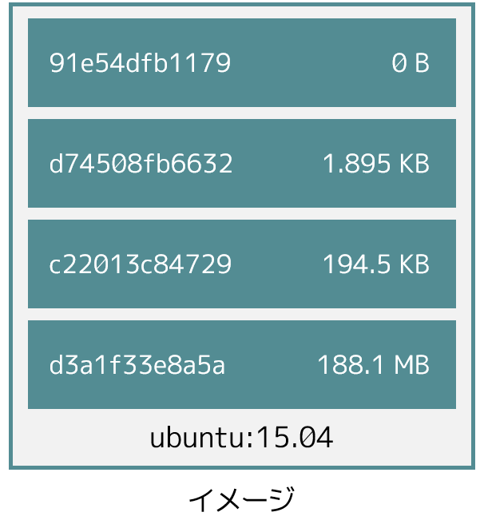
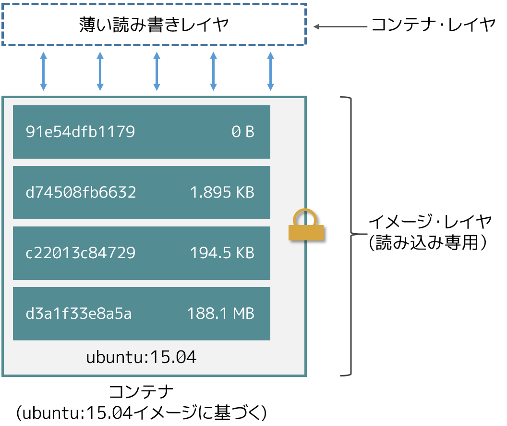
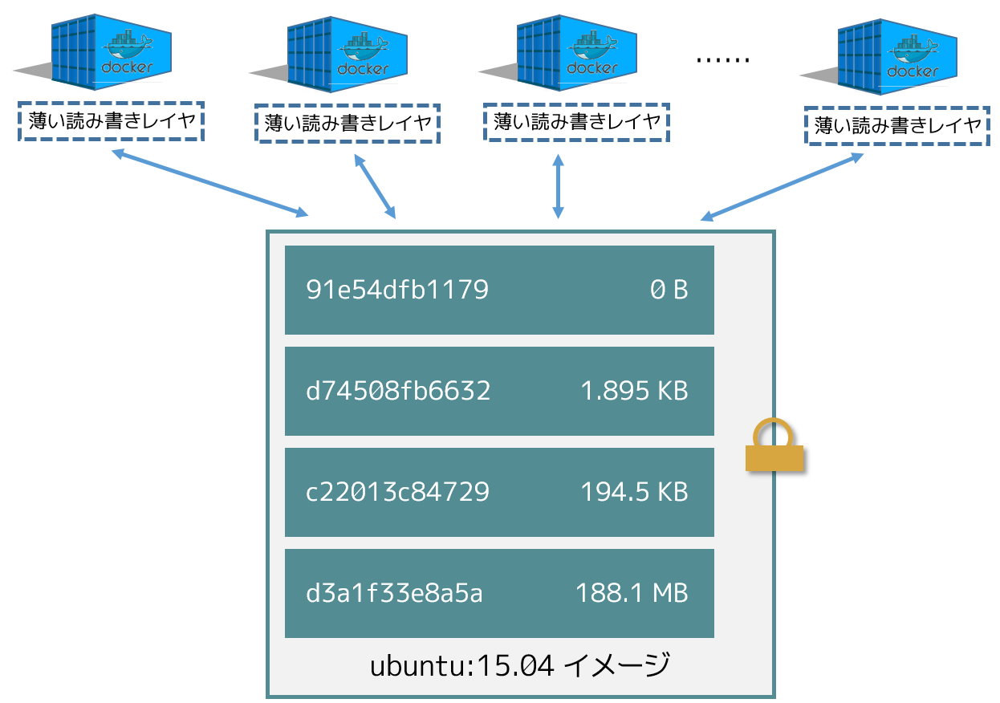
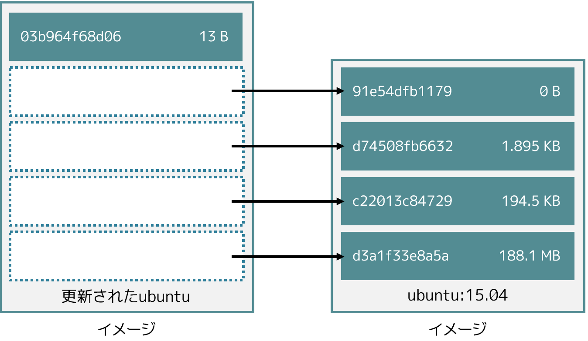
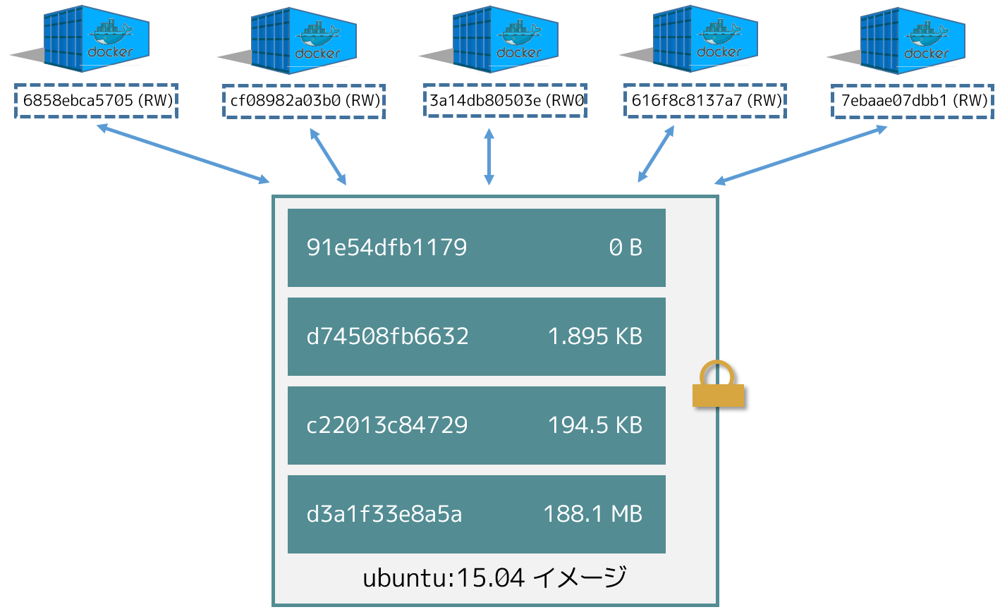
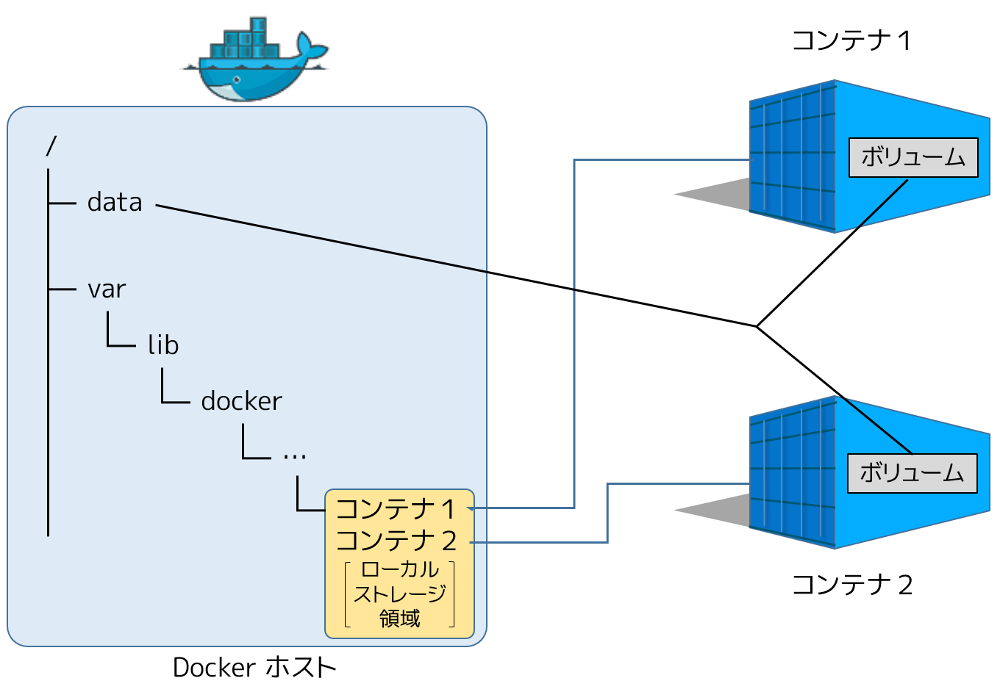

.. -*- coding: utf-8 -*-
.. URL: https://docs.docker.com/engine/userguide/storagedriver/imagesandcontainers/
.. SOURCE: https://github.com/docker/docker/blob/master/docs/userguide/storagedriver/imagesandcontainers.md
   doc version: 1.12
      https://github.com/docker/docker/commits/master/docs/userguide/storagedriver/imagesandcontainers.md
.. check date: 2016/04/16
.. Commits on May 14, 2016 d0ab1c360f5af7b92ab3f414e42ad817e0bd3059
.. ---------------------------------------------------------------------------

.. Understand images, containers, and storage driver

.. _understand-images-containers-and-storage-driver:

==================================================
イメージ、コンテナ、ストレージ・ドライバの理解
==================================================

.. sidebar:: 目次

   .. contents:: 
       :depth: 3
       :local:

.. To use storage drivers effectively, you must understand how Docker builds and stores images. Then, you need an understanding of how these images are used in containers. Finally, you’ll need a short introduction to the technologies that enable both images and container operations.

.. To use storage drivers effectively, you must understand how Docker builds and stores images. Then, you need an understanding of how these images are used by containers. Finally, you’ll need a short introduction to the technologies that enable both images and container operations.

ストレージ・ドライバを効率的に使うには、Docker がどのようにイメージを構築・保管するかの理解が欠かせません。そして、これらのイメージがコンテナでどのように使われているかの理解が必要です。最後に、イメージとコンテナの両方を操作するための技術に対する、簡単な紹介をします。

.. Images and layers

イメージとレイヤ
====================

.. Docker images are a series of read-only layers that are stacked on top of each other to form a single unified view. The first image in the stack is called a base image and all the other layers are stacked on top of this layer. The diagram below shows the Ubuntu 15:04 image comprising 4 stacked image layers.

Docker イメージは読み込み専用（read-only）レイヤのセットです。それぞれのレイヤが層（スタック）として積み重なり、１つに統合された形に見えます。この１番めの層を *ベース・イメージ (base image)* と呼び、他の全てのレイヤは、このベース・イメージのレイヤ上に積み重なります。次の図は、 Ubuntu 15.04 イメージが４つのイメージ・レイヤを組みあわせて構成されているのが分かります。

.. The Docker storage driver is responsible for stacking these layers and providing a single unified view.

Docker ストレージ・ドライバは、これらレイヤを積み重ねて単一に見えるようにする役割があります。

.. When you make a change inside a container by, for example, adding a new file to the Ubuntu 15.04 image, you add a new layer on top of the underlying image stack. This change creates a new image layer containing the newly added file. Each image layer has its own universal unique identifier (UUID) and each successive image layer builds on top of the image layer below it.

コンテナ内部に変更を加えた時を考えます。例えば、Ubuntu 15.04 イメージ上に新しくファイルを追加したら、下にあるイメージ層の上に、新しいレイヤを追加します。この変更は、新しく追加したファイルを含む新しいレイヤを作成します。各イメージ・レイヤは自身の UUID（universal unique identifier）を持っており、下の方にあるイメージの上に、連続したイメージ・レイヤを構築します。

.. Containers (in the storage context) are a combination of a Docker image with a thin writable layer added to the top known as the container layer. The diagram below shows a container running the Ubuntu 15.04 image.

コンテナ（ストレージの内容を含みます）は Docker イメージと薄い書き込み可能なレイヤとを連結したものです。この書き込み可能なレイヤは一番上にあり、 *コンテナ・レイヤ（container layer）* と呼ばれます。以下の図は ubuntu 15.04 イメージの実行状態です。

.. Content addressable storage

.. _content-addressable-storage:

連想ストレージ
----------------------------------------

.. Docker 1.10 introduced a new content addressable storage model. This is a completely new way to address image and layer data on disk. Previously, image and layer data was referenced and stored using a randomly generated UUID. In the new model this is replaced by a secure content hash.

Docker 1.10 は、新しい連想（コンテント・アドレッサブル；content adressable）ストレージ・モデルを導入しました。これはイメージとレイヤをディスクで扱うための、全く新しい手法です。従来のイメージとレイヤのデータは、ランダムに生成した UUID を使って保管・参照していました。新しいモデルでは、これを安全な *コンテント・ハッシュ（content hash）* に置き換えます。

.. The new model improves security, provides a built-in way to avoid ID collisions, and guarantees data integrity after pull, push, load, and save operations. It also enables better sharing of layers by allowing many images to freely share their layers even if they didn’t come from the same build.

新しいモデルはセキュリティを改善します。ID の重複を防ぐ機能を持っており、pull ・ push ・ load ・ save 操作を実施後のデータ保証を完全なものとします。また、同時に構築していなくても、多くイメージが各レイヤを自由に共有可能にもなりました。

.. The diagram below shows an updated version of the previous diagram, highlighting the changes implemented by Docker 1.10.

次の図は、従来バージョンの図を更新したものです。Docker 1.10 で実装された変更をハイライトしています。

.. image:: ./images/container-layers-cas.png
   :scale: 60%
   :alt: コンテナ・レイヤとイメージ

.. As can be seen, all image layer IDs are cryptographic hashes, whereas the container ID is still a randomly generated UUID.

こちらにある通り、まだコンテナ ID がランダムな UUID であるのに対して、全てのイメージ・レイヤの ID は暗号化ハッシュです。

.. There are several things to note regarding the new model. These include:

新しいモデルに関しては、いくつかの注意点があります。

..    Migration of existing images
    Image and layer filesystem structures

1. 既存イメージの移行
2. イメージとレイヤのファイルシステム構造

.. Existing images, those created and pulled by earlier versions of Docker, need to be migrated before they can be used with the new model. This migration involves calculating new secure checksums and is performed automatically the first time you start an updated Docker daemon. After the migration is complete, all images and tags will have brand new secure IDs.

既存イメージとは、以前のバージョンの Docker で作成、あるいは取得したものです。これらは新しいモデルで使う前に、変換が必要です。以降時には、新しい安全なチェックサムを計算します。この計算は更新した Docker デーモンを初回起動時、自動的に行われます。移行が終わったら、全てのイメージとタグが新しい安全な ID に更新されます。

.. Although the migration is automatic and transparent, it is computationally intensive. This means it can take time if you have lots of image data. During this time your Docker daemon will not respond to other requests.

移行は自動的かつ透過的に行われますが、多くの計算を必要とします。つまり、イメージ・データが大量にあれば、時間がかかることを意味します。移行している間、Docker デーモンは他のリクエストに応答しません。

.. A migration tool exists that allows you to migrate existing images to the new format before upgrading your Docker daemon. This means that upgraded Docker daemons do not need to perform the migration in-band, and therefore avoids any associated downtime. It also provides a way to manually migrate existing images so that they can be distributed to other Docker daemons in your environment that are already running the latest versions of Docker.

新しいイメージへの移行を、Docker デーモンをアップグレードする前に行えるツールがあります。つまり、移行に時間をかけないので、停止時間の発生を避けられます。また、既存のイメージを手動で移行できますので、最新バージョンの Docker が既に動いている環境への移行も可能です。

.. The migration tool is provided by Docker, Inc., and runs as a container. You can download it from https://github.com/docker/v1.10-migrator/releases.

Docker 社が提供している移行ツールは、コンテナとして実行できます。 https://github.com/docker/v1.10-migrator/releases からダウンロードできます。

.. While running the “migrator” image you need to expose your Docker host’s data directory to the container. If you are using the default Docker data path, the command to run the container will look like this

「migrator」イメージの実行中は、Docker ホストのデータ・ディレクトリをコンテナに対して公開する必要があります。Docker データを置く場所がデフォルトであれば、コマンドラインでコンテナを実行するには、次のようにします。

.. code-block:: bash

   $ sudo docker run --rm -v /var/lib/docker:/var/lib/docker docker/v1.10-migrator

.. If you use the devicemapper storage driver, you will need to include the --privileged option so that the container has access to your storage devices.

``devicemapper`` ストレージ・ドライバを使っている場合は、 ``--privileged`` オプションを使ってコンテナがストレージ・デバイスにアクセスできるようにする必要があります。

.. Migration example

.. _migration-example:

移行例
----------

.. The following example shows the migration tool in use on a Docker host running version 1.9.1 of the Docker daemon and the AUFS storage driver. The Docker host is running on a t2.micro AWS EC2 instance with 1 vCPU, 1GB RAM, and a single 8GB general purpose SSD EBS volume. The Docker data directory (/var/lib/docker) was consuming 2GB of space.

以下の例は、 Docker デーモンのホスト・バージョンが 1.9.1 で、 AUFS ストレージ・ドライバを使っている環境を移行します。Docker ホストは *t2.micro** AWS EC2 インスタンス上で動いており、1 vCPU 、1GB メモリ、8GB の SSD EBS ボリュームを持っています。Docker のデータ・ディレクトリ（ ``/var/lib/docker`` ）は 2GB の容量を使っています。

.. code-block:: bash

   $ docker images
   REPOSITORY          TAG                 IMAGE ID            CREATED             SIZE
   jenkins             latest              285c9f0f9d3d        17 hours ago        708.5 MB
   mysql               latest              d39c3fa09ced        8 days ago          360.3 MB
   mongo               latest              a74137af4532        13 days ago         317.4 MB
   postgres            latest              9aae83d4127f        13 days ago         270.7 MB
   redis               latest              8bccd73928d9        2 weeks ago         151.3 MB
   centos              latest              c8a648134623        4 weeks ago         196.6 MB
   ubuntu              15.04               c8be1ac8145a        7 weeks ago         131.3 MB
   
   $ sudo du -hs /var/lib/docker
   2.0G    /var/lib/docker
   
   $ time docker run --rm -v /var/lib/docker:/var/lib/docker docker/v1.10-migrator
   Unable to find image 'docker/v1.10-migrator:latest' locally
   latest: Pulling from docker/v1.10-migrator
   ed1f33c5883d: Pull complete
   b3ca410aa2c1: Pull complete
   2b9c6ed9099e: Pull complete
   dce7e318b173: Pull complete
   Digest: sha256:bd2b245d5d22dd94ec4a8417a9b81bb5e90b171031c6e216484db3fe300c2097
   Status: Downloaded newer image for docker/v1.10-migrator:latest
   time="2016-01-27T12:31:06Z" level=debug msg="Assembling tar data for 01e70da302a553ba13485ad020a0d77dbb47575a31c4f48221137bb08f45878d from /var/lib/docker/aufs/diff/01e70da302a553ba13485ad020a0d77dbb47575a31c4f48221137bb08f45878d"
   time="2016-01-27T12:31:06Z" level=debug msg="Assembling tar data for 07ac220aeeef9febf1ac16a9d1a4eff7ef3c8cbf5ed0be6b6f4c35952ed7920d from /var/lib/docker/aufs/diff/07ac220aeeef9febf1ac16a9d1a4eff7ef3c8cbf5ed0be6b6f4c35952ed7920d"
   <snip>
   time="2016-01-27T12:32:00Z" level=debug msg="layer dbacfa057b30b1feaf15937c28bd8ca0d6c634fc311ccc35bd8d56d017595d5b took 10.80 seconds"
   
   real    0m59.583s
   user    0m0.046s
   sys     0m0.008s

.. The Unix time command prepends the docker run command to produce timings for the operation. As can be seen, the overall time taken to migrate 7 images comprising 2GB of disk space took approximately 1 minute. However, this included the time taken to pull the docker/v1.10-migrator image (approximately 3.5 seconds). The same operation on an m4.10xlarge EC2 instance with 40 vCPUs, 160GB RAM and an 8GB provisioned IOPS EBS volume resulted in the following improved timings:

Unix の ``time`` コマンドを ``docker run`` コマンドより前に付け、処理時間を計測します。表示されているように、2GB の容量を消費している７つのディスク・イメージの移行に、おおよそ１分かかっています。しかし、これには ``docker/v1.10-migrator`` イメージの取得（約3.5秒）も含みます。同じ処理を m4.10xlarge EC2 インスタンス、40 VCPU 、160GB のメモリ、8GB の provisioned IOPS EBS ボリュームであれば、次のような結果になります。

.. code-block:: bash

   real    0m9.871s
   user    0m0.094s
   sys     0m0.021s

.. This shows that the migration operation is affected by the hardware spec of the machine performing the migration.

以上の結果から、処理時間は移行をするマシンのハードウェア性能に影響を受けることが分かります。

.. Container and layers

.. _container-and-layers:

コンテナとレイヤ
====================

.. The major difference between a container and an image is this writable layer. All writes to the container that add new or modifying existing data are stored in this writable layer. When the container is deleted the writeable layer is also deleted. The image remains unchanged.

.. コンテナとイメージとの主な違いは、書き込み可能なレイヤ（writable layer）です。全てのコンテナに対する書き込み、つまり、新しいファイルの追加や既存のデータに対する変更は、この書き込み可能なレイヤに保管されます。コンテナが書き込み可能なレイヤを削除すると、コンテナも削除されます。イメージは変更されないままです。

.. Because each container has its own thin writable container layer and all data is stored in this container layer, this means that multiple containers can share access to the same underlying image and yet have their own data state. The diagram below shows multiple containers sharing the same Ubuntu 15.04 image.

それぞれのコンテナは、自分自身で書き込み可能なレイヤを持ちますので、全てのデータは対象のコンテナレイヤに保管します。つまり、複数のコンテナが根底にあるイメージを共有アクセスすることができ、それぞれのコンテナ自身がデータをも管理できるのを意味します。次の図は複数のコンテナが同じ Ubuntu 15.04 イメージを共有しています。

.. A storage driver is responsible for enabling and managing both the image layers and the writeable container layer. How a storage driver accomplishes these behaviors can vary. Two key technologies behind Docker image and container management are stackable image layers and copy-on-write (CoW).

ストレージ・ドライバは、イメージ・レイヤと書き込み可能なコンテナ・レイヤの両方を有効化・管理する責任があります。ストレージ・ドライバは様々な方法で処理をします。Docker イメージとコンテナ管理という２つの重要な技術の裏側にあるのは、積み上げ可能なイメージ・レイヤとコピー・オン・ライト（CoW）です。

.. The copy-on-write strategy

.. _the-copy-on-write-strategy:

コピー・オン・ライト方式
==============================

.. Sharing is a good way to optimize resources. People do this instinctively in daily life. For example, twins Jane and Joseph taking an Algebra class at different times from different teachers can share the same exercise book by passing it between each other. Now, suppose Jane gets an assignment to complete the homework on page 11 in the book. At that point, Jane copy page 11, complete the homework, and hand in her copy. The original exercise book is unchanged and only Jane has a copy of the changed page 11.

共有とはリソース最適化のための良い手法です。人々はこれを日常生活通で無意識に行っています。例えば双子の Jane と Joseph が代数学のクラスを受ける時、回数や先生が違っても、同じ教科書を相互に共有できます。ある日、Jane が本のページ11にある宿題を片付けようとしています。その時  Jane はページ11をコピーし、宿題を終えたら、そのコピーを提出します。Jane はページ 11 のコピーに対する変更を加えただけであり、オリジナルの教科書には手を加えていません。

.. Copy-on-write is a similar strategy of sharing and copying. In this strategy, system processes that need the same data share the same instance of that data rather than having their own copy. At some point, if one process needs to modify or write to the data, only then does the operating system make a copy of the data for that process to use. Only the process that needs to write has access to the data copy. All the other processes continue to use the original data.

コピー・オン・ライト（copy-on-write、cow）とは、共有とコピーのストラテジ（訳者注：方針、戦略の意味、ここでは方式と訳します）に似ています。このストラテジは、システム・プロセスが自分自身でデータのコピーを持つより、同一インスタンス上にあるデータ共有を必要とします。書き込む必要があるプロセスのみが、データのコピーにアクセスできます。その他のプロセスは、オリジナルのデータを使い続けられます。

.. Docker uses a copy-on-write technology with both images and containers. This CoW strategy optimizes both image disk space usage and the performance of container start times. The next sections look at how copy-on-write is leveraged with images and containers through sharing and copying.

Docker はコピー・オン・ライト技術をイメージとコンテナの両方に使います。この CoW 方式はイメージのディスク使用量とコンテナ実行時のパフォーマンスの両方を最適化します。次のセクションでは、イメージとコンテナの共有とコピーにおいて、コピー・オン・ライトがどのように動作してるのかを見てきます。

.. Sharing promotes smaller images

.. _sharing-promotes-smaller-images:

共有を促進する小さなイメージ
------------------------------

.. This section looks at image layers and copy-on-write technology. All image and container layers exist inside the Docker host’s local storage area and are managed by the storage driver. On Linux-based Docker hosts this is usually located under /var/lib/docker/.

このセクションではイメージ・レイヤとコピー・オン・ライト技術（copy-on-write）を見ていきます。全てのイメージとコンテナ・レイヤは Docker ホスト上の *ローカル・ストレージ領域* に存在し、ストレージ・ドライバによって管理されます。Linux をベースとする Docker ホストでは、通常は ``/var/lib/docker/`` 以下です。

.. The Docker client reports on image layers when instructed to pull and push images with docker pull and docker push. The command below pulls the ubuntu:15.04 Docker image from Docker Hub.

イメージ取得・送信する ``docker pull`` と ``docker push`` 命令の実行時、Docker クライアントはイメージ・レイヤについて報告します。以下のコマンドは、 Docker Hub から ``ubuntu:15.04`` Docker イメージを取得（pull）しています。

.. code-block:: bash

   $ docker pull ubuntu:15.04
   15.04: Pulling from library/ubuntu
   1ba8ac955b97: Pull complete
   f157c4e5ede7: Pull complete
   0b7e98f84c4c: Pull complete
   a3ed95caeb02: Pull complete
   Digest: sha256:5e279a9df07990286cce22e1b0f5b0490629ca6d187698746ae5e28e604a640e
   Status: Downloaded newer image for ubuntu:15.04

.. From the output, you’ll see that the command actually pulls 4 image layers. Each of the above lines lists an image layer and its UUID or cryptographic hash. The combination of these four layers makes up the ubuntu:15.04 Docker image.

この出力から、このコマンドが実際には４つのイメージ・レイヤを取得したのが分かります。上記のそれぞれの行が、イメージとその UUID か暗号化ハッシュです。これら４つのレイヤの組みあわせにより、 ``ubuntu:15.04`` Docker イメージを作り上げています。

.. Each of these layers is stored in its own directory inside the Docker host’s local storage are.

これらの各レイヤは、Docker ホスト上のローカル・ストレージ領域に保管します。

.. Versions of Docker prior to 1.10 stored each layer in a directory with the same name as the image layer ID. However, this is not the case for images pulled with Docker version 1.10 and later. For example, the command below shows an image being pulled from Docker Hub, followed by a directory listing on a host running version 1.9.1 of the Docker Engine.

Docker バージョン 1.10 未満までは、各レイヤをイメージ・レイヤ ID と同じ名前のディレクトリに格納していました。しかし、Docker バージョン 1.10 移行では、イメージを取得してもこのようになりません。例えば、Docker Engine バージョン 1.9.1 が動いているホスト上で、 Docker Hub からイメージをダウンロードするコマンドを実行した結果です。

.. code-block:: bash

   $  docker pull ubuntu:15.04
   15.04: Pulling from library/ubuntu
   47984b517ca9: Pull complete
   df6e891a3ea9: Pull complete
   e65155041eed: Pull complete
   c8be1ac8145a: Pull complete
   Digest: sha256:5e279a9df07990286cce22e1b0f5b0490629ca6d187698746ae5e28e604a640e
   Status: Downloaded newer image for ubuntu:15.04
   
   $ ls /var/lib/docker/aufs/layers
   47984b517ca9ca0312aced5c9698753ffa964c2015f2a5f18e5efa9848cf30e2
   c8be1ac8145a6e59a55667f573883749ad66eaeef92b4df17e5ea1260e2d7356
   df6e891a3ea9cdce2a388a2cf1b1711629557454fd120abd5be6d32329a0e0ac
   e65155041eed7ec58dea78d90286048055ca75d41ea893c7246e794389ecf203

.. The image layers are stored in the Docker host’s local storage area. Typically, the local storage area is in the host’s /var/lib/docker directory. Depending on which storage driver the local storage area may be in a different location. You can list the layers in the local storage area. The following example shows the storage as it appears under the AUFS storage driver:
.. (1.9 までの文章、削除予定; @zembutsu)
.. イメージ・レイヤは Docker ホスト上のローカル・ストレージ領域に保管されます。典型的なローカル・ストレージ領域の場所は、ホスト上の ``/var/lib/docker``  ディレクトリです。ストレージ・ドライバの種類により、ローカル・ストレージ領域の場所は変わる場合があります。以下の例では、 AUFS ストレージ・ドライバが使うディレクトリを表示しています。

.. Notice how the four directories match up with the layer IDs of the downloaded image. Now compare this with the same operations performed on a host running version 1.10 of the Docker Engine.

４つのディレクトリが、イメージをダウンロードしたレイヤの ID と一致しているのが分かるでしょう。これと同じ処理を Docker Engine バージョン 1.10 上で行いましょう。

.. code-block:: bash

   $ docker pull ubuntu:15.04
   15.04: Pulling from library/ubuntu
   1ba8ac955b97: Pull complete
   f157c4e5ede7: Pull complete
   0b7e98f84c4c: Pull complete
   a3ed95caeb02: Pull complete
   Digest: sha256:5e279a9df07990286cce22e1b0f5b0490629ca6d187698746ae5e28e604a640e
   Status: Downloaded newer image for ubuntu:15.04
   
   $ ls /var/lib/docker/aufs/layers/
   1d6674ff835b10f76e354806e16b950f91a191d3b471236609ab13a930275e24
   5dbb0cbe0148cf447b9464a358c1587be586058d9a4c9ce079320265e2bb94e7
   bef7199f2ed8e86fa4ada1309cfad3089e0542fec8894690529e4c04a7ca2d73
   ebf814eccfe98f2704660ca1d844e4348db3b5ccc637eb905d4818fbfb00a06a

.. See how the four directories do not match up with the image layer IDs pulled in the previous step.

先ほどの結果とは異なり、４つのディレクトリは取得したイメージ・レイヤ ID と対応しません。

.. Despite the differences between image management before and after version 1.10, all versions of Docker still allow images to share layers. For example, If you pull an image that shares some of the same image layers as an image that has already been pulled, the Docker daemon recognizes this, and only pulls the layers it doesn’t already have stored locally. After the second pull, the two images will share any common image layers.

このように、バージョン 1.10 前後ではイメージの管理に違いがあります。しかし全ての Docker バージョンにおいて、イメージはレイヤを共有できます。例えば、イメージを ``pull`` （取得）する時、既に取得済みの同じイメージ・レイヤがあれば、Docker は状況を認識してイメージを共有します。そして、ローカルに存在しないイメージのみ取得します。２つめ以降の pull は、共通イメージ・レイヤにある２つのイメージを共有しています。

.. If you pull another image that shares some of the same image layers as the ubuntu:15.04 image, the Docker daemon recognize this, and only pull the layers it hasn’t already stored. After the second pull, the two images will share any common image layers.
.. (1.9向け文章のため削除予定 @zembutsu)
.. もし、別のイメージを ``pull`` （取得）するとき、そのイメージが ``ubuntu:15.04`` イメージと同じイメージ・レイヤが共通している場合、Docker デーモンはこの状況を認識し、まだ手許に取得していないイメージのみをダウンロードします。それから、２つめのイメージを取得すると、この２つのイメージは、共通のイメージ・レイヤとして共有されるようになります。

.. You can illustrate this now for yourself. Starting the ubuntu:15.04 image that you just pulled, make a change to it, and build a new image based on the change. One way to do this is using a Dockerfile and the docker build command.

これで、自分で実例を示して理解できるでしょう。 ``ubuntu:15.04`` イメージを使うため、まずは取得（pull）し、変更を加え、その変更に基づく新しいイメージを構築します。この作業を行う方法の１つが、 Dockerfile と ``docker build`` コマンドを使う方法です。

.. In an empty directory, create a simple Dockerfile that starts with the ubuntu:15.04 image.

1. 空のディレクトリに、 ``Dockerfile`` を作成します。 ubuntu:15.04 イメージの指定から記述します。

.. code-block:: bash

   FROM ubuntu:15.04

.. Add a new file called “newfile” in the image’s /tmp directory with the text “Hello world” in it.

2. 「newfile」 という名称の新規ファイルを、イメージの ``/tmp``  ディレクトリに作成します。ファイル内には「Hello world」の文字も入れます。

.. When you are done, the Dockerfile contains two lines:

作業が終われば、 ``Dockerfile`` は次の２行になっています。

.. code-block:: bash

   FROM ubuntu:15.04
   
   RUN echo "Hello world" > /tmp/newfile

..    Save and close the file.

3. ファイルを保存して閉じます。

..    From a terminal in the same folder as your Dockerfile, run the following command:

4. ターミナルから、作成した ``Dockerfile`` と同じディレクトリ上に移動し、以下のコマンドを実行します。

.. code-block:: bash

   $ docker build -t changed-ubuntu .
   Sending build context to Docker daemon 2.048 kB
   Step 1 : FROM ubuntu:15.04
    ---> 3f7bcee56709
   Step 2 : RUN echo "Hello world" > /tmp/newfile
    ---> Running in d14acd6fad4e
    ---> 94e6b7d2c720
   Removing intermediate container d14acd6fad4e
   Successfully built 94e6b7d2c720

..        Note: The period (.) at the end of the above command is important. It tells the docker build command to use the current working directory as its build context.

.. note::

   上記のコマンドの末尾にあるピリオド（.）は重要です。これは ``docker build`` コマンドに対して、現在の作業用ディレクトリを構築時のコンテクスト（内容物）に含めると伝えるものです。

..    The output above shows a new image with image ID 94e6b7d2c720.

この結果から、新しいイメージのイメージ ID が ``94e6b7d2c720`` だと分かります。

..     Run the docker images command to verify the new changed-ubuntu image is
.. in the Docker host’s local storage area.

5. ``docker images`` コマンドを実行します。

6. Docker ホスト上のローカル・ストレージ領域に、新しい ``changed-ubuntu`` イメージが作成されているかどうかを確認します。

.. code-block:: bash

   REPOSITORY       TAG      IMAGE ID       CREATED           SIZE
   changed-ubuntu   latest   03b964f68d06   33 seconds ago    131.4 MB
   ubuntu           15.04    013f3d01d247   6 weeks ago       131.3 MB

..    Run the docker history command to see which image layers were used to create the new changed-ubuntu image.

7. ``docker history`` コマンドを実行します。

8. 新しい ``changed-ubuntu`` イメージが何のイメージによって作成されたか分かります。

.. code-block:: bash

   $ docker history changed-ubuntu
   IMAGE               CREATED              CREATED BY                                      SIZE        COMMENT
   94e6b7d2c720        2 minutes ago       /bin/sh -c echo "Hello world" > /tmp/newfile    12 B 
   3f7bcee56709        6 weeks ago         /bin/sh -c #(nop) CMD ["/bin/bash"]             0 B  
   <missing>           6 weeks ago         /bin/sh -c sed -i 's/^#\s*\(deb.*universe\)$/   1.879 kB
   <missing>           6 weeks ago         /bin/sh -c echo '#!/bin/sh' > /usr/sbin/polic   701 B
   <missing>           6 weeks ago         /bin/sh -c #(nop) ADD file:8e4943cd86e9b2ca13   131.3 MB

..   The docker history output shows the new 94e6b7d2c720 image layer at the top. You know that this is the new image layer added because it was created by the echo "Hello world" > /tmp/newfile command in your Dockerfile. The 4 image layers below it are the exact same image layers that make up the ubuntu:15.04 image.

``docker history`` の出力から、新しい ``94e6b7d2c720`` イメージ・レイヤが一番上にあることが分かります。 ``03b964f68d06`` レイヤとは、先ほどの ``Dockerfile`` で ``echo "Hello world" > /tmp/newfile`` コマンドでファイルを追加したものだと分かります。そして、４つのイメージ・レイヤは、先ほど ``ubuntu:15.04`` イメージを構築する時に使ったレイヤと一致していることが分かります。

..   Note: Under the content addressable storage model introduced with Docker 1.10, image history data is no longer stored in a config file with each image layer. It is now stored as a string of text in a single config file that relates to the overall image. This can result in some image layers showing as “missing” in the output of the docker history command. This is normal behaviour and can be ignored.
..    You may hear images like these referred to as flat images.

.. note::

   Docker 1.10 で導入された連想ストレージ・モデル（content addressable storage model）下では、イメージの履歴データは各イメージ・レイヤの設定ファイル上に保存されません。これからは、イメージ全体に関連する、単一の設定ファイル上の文字列に保管されます。これにより、 ``docker history`` コマンドを実行したら、いくつかのイメージ・レイヤは「missing」（行方不明）と表示されるでしょう。しかしこれは通常の動作であり、無視して構いません。
   
   これらのイメージを *フラット・イメージ (flat images)* として読んでいるのを耳にしているかも知れません。

.. Notice the new changed-ubuntu image does not have its own copies of every layer. As can be seen in the diagram below, the new image is sharing it’s four underlying layers with the ubuntu:15.04 image.

新しい ``changed-ubuntu`` イメージは各レイヤのコピーを自分自身で持っていないことに注意してください。下図にあるように、``ubuntu:15.04`` イメージの下にある４つのレイヤを、新しいイメージでも共有しているのです。

.. The docker history command also shows the size of each image layer. As you can see, the 94e6b7d2c720 layer is only consuming 12 Bytes of disk space. This means that the changed-ubuntu image we just created is only consuming an additional 12 Bytes of disk space on the Docker host - all layers below the 94e6b7d2c720 layer already exist on the Docker host and are shared by other images.

また、``docker history`` コマンドは各イメージ・レイヤのサイズも表示します。 ``94e6b7d2c720`` は 12 バイトのディスク容量です。つまり、 ``changed-ubuntu`` は Docker ホスト上の 12 バイトのディスク容量しか消費しません。これは、 ``94e6b7d2c720`` よりも下層のレイヤにあたるものが Docker ホスト上に存在しており、これらは ``changed-ubuntu`` イメージとして共有されているからです。

.. This sharing of image layers is what makes Docker images and containers so space efficient.

このイメージ・レイヤの共有により、Docker イメージとコンテナの領域を効率的に扱えます。

.. Copying makes containers efficient

.. _copying-maked-containers-efficient:

コンテナを効率的にコピー
------------------------------

.. You learned earlier that a container a Docker image with a thin writable, container layer added. The diagram below shows the layers of a container based on the ubuntu:15.04 image:

先ほど学んだように、Docker イメージのコンテナとは、書き込み可能なコンテナ・レイヤを追加したものです。以下の図は ``ubuntu:15.04`` をコンテナのベース・レイヤと下層レイヤを表示しています。

.. image:: ./images/container-layers-cas.png
   :scale: 60%
   :alt: コンテナ・レイヤとイメージ

.. All writes made to a container are stored in the thin writable container layer. The other layers are read-only (RO) image layers and can’t be changed. This means that multiple containers can safely share a single underlying image. The diagram below shows multiple containers sharing a single copy of the ubuntu:15.04 image. Each container has its own thin RW layer, but they all share a single instance of the ubuntu:15.04 image:

コンテナに対する全ての書き込みは、書き込み可能なコンテナ・レイヤに保管されます。他のレイヤは読み込み専用（read-only、RO）のイメージ・レイヤであり、変更できません。つまり、複数のコンテナが下層にある１つのイメージを安全に共有できます。以下の図は、複数のコンテナが ``ubuntu:15.04`` イメージのコピーを共有しています。各コンテナは自分自身で読み書き可能なレイヤを持っていますが、どれもが ubuntu:15.04 イメージという単一のインスタンス（イメージ）を共有しています。

.. When an existing file in a container is modified, Docker uses the storage driver to perform a copy-on-write operation. The specifics of operation depends on the storage driver. For the AUFS and OverlayFS storage drivers, the copy-on-write operation is pretty much as follows:

コンテナの中で書き込み作業が発生したら、Docker はストレージ・ドライバでコピー・オン・ライト処理を実行します。この処理はストレージ・ドライバに依存します。AUFS と OverlayFS ストレージ・ドライバは、コピー・オン・ライト処理を、おおよそ次のように行います。

..    Search through the layers for the file to update. The process starts at the top, newest layer and works down to the base layer one-at-a-time.
    Perform a “copy-up” operation on the first copy of the file that is found. A “copy up” copies the file up to the container’s own thin writable layer.
    Modify the copy of the file in container’s thin writable layer.

* レイヤ上のファイルが更新されていないか確認します。まずこの手順が新しいレイヤに対して行われ、以降は１つ１つのベースになったレイヤをたどります。
* ファイルに対して初めての処理が始まると「コピー開始」（copy-up）をします。「コピー開始」とは、コンテナ自身が持つ薄い書き込み可能なレイヤから、ファイルをコピーすることです。
* コンテナの薄い書き込み可能なレイヤに *ファイル* を *コピー* してから、（そのファイルに）変更を加えます。

.. BTFS, ZFS, and other drivers handle the copy-on-write differently. You can read more about the methods of these drivers later in their detailed descriptions.

BTRFS、ZFS 、その他のドライバは、コピー・オン・ライトを異なった方法で処理します。これらのドライバの手法については、後述するそれぞれの詳細説明をご覧ください。

.. Containers that write a lot of data will consume more space than containers that do not. This is because most write operations consume new space in the containers thin writable top layer. If your container needs to write a lot of data, you can use a data volume.

たくさんのデータが書き込まれたコンテナは、何もしないコンテナに比べて多くのディスク容量を消費します。これは書き込み操作の発生によって、コンテナの薄い書き込み可能なレイヤ上に、更に新しい領域を消費するためです。もしコンテナが多くのデータを使う必要があるのであれば、データ・ボリュームを使うこともできます。

.. A copy-up operation can incur a noticeable performance overhead. This overhead is different depending on which storage driver is in use. However, large files, lots of layers, and deep directory trees can make the impact more noticeable. Fortunately, the operation only occurs the first time any particular file is modified. Subsequent modifications to the same file do not cause a copy-up operation and can operate directly on the file’s existing copy already present in container layer.

コピー開始処理は、顕著な性能のオーバーヘッド（処理時間の増加）を招きます。このオーバーヘッドは、利用するストレージ・ドライバによって異なります。しかし、大きなファイル、多くのレイヤ、深いディレクトリ・ツリーが顕著な影響を与えます。幸いにも、これらの処理が行われるのは、何らかのファイルに対する変更が初めて行われた時だけです。同じファイルに対する変更が再度行われても、コピー開始処理は行われず、コンテナ・レイヤ上に既にコピーしてあるファイルに対してのみ変更を加えます。

.. Let’s see what happens if we spin up 5 containers based on our changed-ubuntu image we built earlier:

先ほど構築した ``changed-ubuntu`` イメージの元となる５つのコンテナに対し、何が起こっているのか見ていきましょう。

..    From a terminal on your Docker host, run the following docker run command 5 times.

1. Docker ホスト上のターミナルで、 次のように ``docker run`` コマンドを５回実行します。

.. code-block:: bash

   $ docker run -dit changed-ubuntu bash
   75bab0d54f3cf193cfdc3a86483466363f442fba30859f7dcd1b816b6ede82d4
   $ docker run -dit changed-ubuntu bash
   9280e777d109e2eb4b13ab211553516124a3d4d4280a0edfc7abf75c59024d47
   $ docker run -dit changed-ubuntu bash
   a651680bd6c2ef64902e154eeb8a064b85c9abf08ac46f922ad8dfc11bb5cd8a
   $ docker run -dit changed-ubuntu bash
   8eb24b3b2d246f225b24f2fca39625aaad71689c392a7b552b78baf264647373
   $ docker run -dit changed-ubuntu bash
   0ad25d06bdf6fca0dedc38301b2aff7478b3e1ce3d1acd676573bba57cb1cfef

.. This launches 5 containers based on the changed-ubuntu image. As each container is created, Docker adds a writable layer and assigns it a random UUID. This is the value returned from the docker run command.

これは ``changed-ubuntu`` イメージを元に、５つのコンテナを起動します。コンテナを作成したことで、Docker は書き込みレイヤを追加し、そこにランダムな UUID を割り当てます。この値は、 ``docker run`` コマンドを実行して返ってきたものです。

..    Run the docker ps command to verify the 5 containers are running.

2. ``docker ps`` コマンドを実行し、５つのコンテナが実行中なのを確認します。

.. code-block:: bash

   $ docker ps
   CONTAINER ID    IMAGE             COMMAND    CREATED              STATUS              PORTS    NAMES
   0ad25d06bdf6    changed-ubuntu    "bash"     About a minute ago   Up About a minute            stoic_ptolemy
   8eb24b3b2d24    changed-ubuntu    "bash"     About a minute ago   Up About a minute            pensive_bartik
   a651680bd6c2    changed-ubuntu    "bash"     2 minutes ago        Up 2 minutes                 hopeful_turing
   9280e777d109    changed-ubuntu    "bash"     2 minutes ago        Up 2 minutes                 backstabbing_mahavira
   75bab0d54f3c    changed-ubuntu    "bash"     2 minutes ago        Up 2 minutes                 boring_pasteur

..    The output above shows 5 running containers, all sharing the changed-ubuntu image. Each CONTAINER ID is derived from the UUID when creating each container.

上記の結果から、 ``changed-ubuntu`` イメージを全て共有する５つのコンテナが実行中だと分かります。それぞれの ``コンテナ ID`` は各コンテナ作成時の UUID から与えられています。

..    List the contents of the local storage area.

3. ローカル・ストレージ領域のコンテナ一覧を表示します。

.. code-block:: bash

   $ sudo ls containers
   0ad25d06bdf6fca0dedc38301b2aff7478b3e1ce3d1acd676573bba57cb1cfef  9280e777d109e2eb4b13ab211553516124a3d4d4280a0edfc7abf75c59024d47
   75bab0d54f3cf193cfdc3a86483466363f442fba30859f7dcd1b816b6ede82d4  a651680bd6c2ef64902e154eeb8a064b85c9abf08ac46f922ad8dfc11bb5cd8a
   8eb24b3b2d246f225b24f2fca39625aaad71689c392a7b552b78baf264647373

（訳者注：上記コマンドは、 ``/var/lib/docker`` ディレクトリで実行してください。）

.. Docker’s copy-on-write strategy not only reduces the amount of space consumed by containers, it also reduces the time required to start a container. At start time, Docker only has to create the thin writable layer for each container. The diagram below shows these 5 containers sharing a single read-only (RO) copy of the changed-ubuntu image.

Docker のコピー・オン・ライト方式により、コンテナによるディスク容量の消費を減らすだけではなく、コンテナ起動時の時間も短縮します。起動時に、Docker はコンテナごとに薄い書き込み可能なレイヤを作成します。次の図は ``changed-ubuntu`` イメージの読み込み専用のコピーを、５つのコンテナで共有しています。

.. If Docker had to make an entire copy of the underlying image stack each time it started a new container, container start times and disk space used would be significantly increased.

もし新しいコンテナを開始する度に元になるイメージ・レイヤ全体をコピーするのであれば、コンテナの起動時間とディスク使用量が著しく増えてしまうでしょう。

.. Data volumes and the storage driver

.. _data-volumes-and-the-storage-driver:

データ・ボリュームとストレージ・ドライバ
========================================

.. When a container is deleted, any data written to the container that is not stored in a data volume is deleted along with the container. A data volume is directory or file that is mounted directly into a container.
.. コンテナの削除し、コンテナに対して書き込まれたあらゆるデータを削除します。しかし、 *データ・ボリューム* の保管内容は、コンテナと一緒に削除されません。データ・ボリュームは、コンテナ内に直接マウントするファイルかディスク容量です。

.. When a container is deleted, any data written to the container that is not stored in a data volume is deleted along with the container.

コンテナを削除したら、コンテナに対して書き込まれたあらゆるデータが削除されます。しかし、 *データ・ボリューム (data volume)* の保存内容は、コンテナと一緒に削除しません。

.. Data volumes are not controlled by the storage driver. Reads and writes to data volumes bypass the storage driver and operate at native host speeds. You can mount any number of data volumes into a container. Multiple containers can also share one or more data volumes.
.. データ・ボリュームはストレージ・ドライバによって管理されません。データ・ボリュームに対する読み書きは、ストレージ・ドライバを迂回し、ネイティブなホストの速度で操作できます。コンテナ内に複数のデータ・ボリュームをマウントできます。複数のコンテナが１つまたは複数のデータ・ボリュームをマウントできます。

.. A data volume is a directory or file in the Docker host’s filesystem that is mounted directly into a container. Data volumes are not controlled by the storage driver. Reads and writes to data volumes bypass the storage driver and operate at native host speeds. You can mount any number of data volumes into a container. Multiple containers can also share one or more data volumes.

データ・ボリュームとは、コンテナが直接マウントするディレクトリまたはファイルであり、Docker ホストのファイルシステム上に存在します。データ・ボリュームはストレージ・ドライバが管理しません。データ・ボリュームに対する読み書きはストレージ・ドライバをバイパス（迂回）し、ホスト上の本来の速度で処理されます。コンテナ内に複数のデータ・ボリュームをマウントできます。１つまたは複数のデータ・ボリュームを、複数のコンテナで共有もできます。

.. The diagram below shows a single Docker host running two containers. Each container exists inside of its own address space within the Docker host’s local storage area (/var/lib/docker/...). There is also a single shared data volume located at /data on the Docker host. This is mounted directly into both containers.

以下の図は、１つの Docker ホストから２つのコンテナを実行しているものです。Docker ホストのローカル・ストレージ領域（ ``/var/lib/docker/...`` ）の中に、それぞれのコンテナに対して割り当てられた領域が存在しています。また、Docker ホスト上の ``/data`` に位置する共有データ・ボリュームもあります。このディレクトリは両方のコンテナからマウントされます。

.. The data volume resides outside of the local storage area on the Docker host further reinforcing its independence from the storage driver’s control. When a container is deleted, any data stored in shared data volumes persists on the Docker host.

データ・ボリュームは Docker ホスト上のローカル・ストレージ領域の外に存在しており、ストレージ・ドライバの管理から独立して離れています。コンテナを削除したとしても、Docker ホスト上の共有データ・ボリュームに保管されたデータに対して、何ら影響はありません。

.. For detailed information about data volumes Managing data in containers.

データ・ボリュームに関する更に詳しい情報は、 :doc:`コンテナでデータを管理する </engine/userguide/containers/dockervolumes>` をご覧ください。

.. Related information

関連情報
==========

.. _volume-related-information:

..    Select a storage driver
    AUFS storage driver in practice
    Btrfs storage driver in practice
    Device Mapper storage driver in practice

* :doc:`selectadriver`
* :doc:`aufs-driver`
* :doc:`btrfs-driver`
* :doc:`device-mapper-driver`

.. seealso:: 

   Understand images, containers, and storage drivers
      https://docs.docker.com/engine/userguide/storagedriver/imagesandcontainers/
