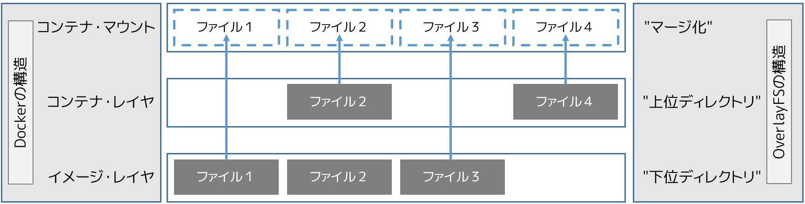

.. -*- coding: utf-8 -*-
.. URL: https://docs.docker.com/engine/userguide/storagedriver/overlayfs-driver/
.. SOURCE: https://github.com/docker/docker/blob/master/docs/userguide/storagedriver/overlayfs-driver.md
   doc version: 1.12
      https://github.com/docker/docker/commits/master/docs/userguide/storagedriver/overlayfs-driver.md
.. check date: 2016/06/1
.. Commits on Apr 29, 2016 24ec73f754da16e37726a3f1c6a59de508e255fc
.. ---------------------------------------------------------------------------

.. Docker and OverlayFS in practice

.. _docker-and-overlayfs-in-practice:

========================================
OverlayFS ストレージの使用
========================================

.. sidebar:: 目次

   .. contents:: 
       :depth: 3
       :local:

.. OverlayFS is a modern union filesystem that is similar to AUFS. In comparison to AUFS, OverlayFS:

OverlayFS は最近の *ユニオン・ファイルシステム* であり、 AUFS に似ています。AUFS と OverlayFS を比較します。

..    has a simpler design
    has been in the mainline Linux kernel since version 3.18
    is potentially faster

* よりシンプルな設計
* Linux カーネルのバージョン 3.18 からメインラインに取り込まれている
* より速い可能性

.. As a result, OverlayFS is rapidly gaining popularity in the Docker community and is seen by many as a natural successor to AUFS. As promising as OverlayFS is, it is still relatively young. Therefore caution should be taken before using it in production Docker environments.

この結果、OverlayFS は Docker コミュニティで急に有名になり、多くの人から AUFS の後継者と自然に思われています。OverlayFS は有望ですが、比較的まだ若いストレージ・ドライバです。そのため、プロダクションの Docker 環境で利用する前に、十分に注意を払うべきでしょう。

.. Docker’s overlay storage driver leverages several OverlayFS features to build and manage the on-disk structures of images and containers.

Docker の ``overlay`` ストレージ・ドライバは、ディスク上でイメージとコンテナを構築・管理するため、複数の OverlayFS 機能を活用します。

..    Note: Since it was merged into the mainline kernel, the OverlayFS kernel module was renamed from “overlayfs” to “overlay”. As a result you may see the two terms used interchangeably in some documentation. However, this document uses “OverlayFS” to refer to the overall filesystem, and overlay to refer to Docker’s storage-driver.

.. note:: 

   カーネルのメインラインに取り込まれるにあたり、 OverlayFS *カーネル・モジュール* の名前が「overlayfs」から「overlay」に名称変更されました。そのため、同じドキュメントでも２つの用語が用いられるかもしれません。ですが、このドキュメントでは「OverlayFS」はファイル全体を指すものとし、 ``overlay`` は Docker のストレージ・ドライバを指すために遣います。

.. Image layering and sharing with OverlayFS

.. _image-layering-and-sharing-with-overlayfs:

OverlayFS でイメージのレイヤ化と共有
========================================

.. OverlayFS takes two directories on a single Linux host, layers one on top of the other, and provides a single unified view. These directories are often referred to as layers and the technology used to layer them is known as a union mount. The OverlayFS terminology is “lowerdir” for the bottom layer and “upperdir” for the top layer. The unified view is exposed through its own directory called “merged”.

OverlayFS は１つの Linux ホスト上で２つのディレクトリを扱います。他のレイヤよりも一番上にあるレイヤにより、１つに統一して見えます。これらのディレクトリは *レイヤ* としてたびたび参照され、レイヤに対しては *ユニオン・マウント（union mount）* と呼ばれる技術が使われています。OverlayFS 技術では「下位ディレクトリ」が下の方のレイヤであり、「上位ディレクトリ」が上のレイヤになります。統一して表示される場所そのものを、「マージされた」（marged）ディレクトリと呼びます。

.. The diagram below shows how a Docker image and a Docker container are layered. The image layer is the “lowerdir” and the container layer is the “upperdir”. The unified view is exposed through a directory called “merged” which is effectively the containers mount point. The diagram shows how Docker constructs map to OverlayFS constructs.

下図は Docker イメージと Docker コンテナがレイヤ化されたものです。イメージ・レイヤは「下位ディレクトリ」であり、コンテナ・レイヤは「上位ディレクトリ」です。統一した表示は「マージされた」ディレクトリであり、これがコンテナに対する事実上のマウント・ポイントです。下図では Docker の構造が OverlayFS 構造にどのように割り当てられているか分かります。

.. Notice how the image layer and container layer can contain the same files. When this happens, the files in the container layer (“upperdir”) are dominant and obscure the existence of the same files in the image layer (“lowerdir”). The container mount (“merged”) presents the unified view.

イメージ・レイヤとコンテナ・レイヤに、同じファイルを含められることに注意してください。この時に発生するのは、コンテナ・レイヤ（上位ディレクトリ）に含まれるファイルが優位になり、イメージ・レイヤ（下位ディレクトリ）にある同じファイルを存在しないものとみなします。コンテナ・マウント（マージ化）が、統一した表示をもたらします。

.. OverlayFS only works with two layers. This means that multi-layered images cannot be implemented as multiple OverlayFS layers. Instead, each image layer is implemented as its own directory under /var/lib/docker/overlay. Hard links are then used as a space-efficient way to reference data shared with lower layers. As of Docker 1.10, image layer IDs no longer correspond to directory names in /var/lib/docker/

OverlayFS は２つのレイヤだけ扱います。つまり、複数にレイヤ化されたイメージは、複数の OverlayFS レイヤとしては使われません。そのかわり、各イメージ・レイヤは ``/var/lib/docker/overlay`` ディレクトリ以下で自身が使われます。下位のレイヤと共有するデータを効率的に参照する手法として、ハードリンクが使われます。Docker 1.10 からは、イメージ・レイヤ ID は ``/var/lib/docker/`` 内のディレクトリ名と一致しなくなりました。

.. To create a container, the overlay driver combines the directory representing the image’s top layer plus a new directory for the container. The image’s top layer is the “lowerdir” in the overlay and read-only. The new directory for the container is the “upperdir” and is writable.

コンテナを作成したら、 ``overlay`` ドライバはコンテナのために新しいディレクトリをイメージの最上位レイヤの上に追加し、これらを組みあわせてディレクトリを表示します。イメージの最上位レイヤは、overlay では「下位ディレクトリ」であり、読み込み専用です。コンテナ用の新しいディレクトリは「上位ディレクトリ」であり、書き込み可能です。

.. Example: Image and container on-disk constructs

例：イメージとコンテナのディスク上の構造
========================================

.. The following docker images -a command shows a Docker host with a single image. As can be seen, the image consists of four layers.

以下の ``docker images -a`` コマンドは、Docker ホスト上の１つのイメージを表示しています。表示されているように、イメージは４つのレイヤで構成されています。

.. The following docker pull command shows a Docker host with downloading a Docker image comprising four layers.

以下の ``docker pull`` コマンドが表しているのは、４つのレイヤに圧縮された Docker イメージを Docker ホスト上にダウンロードしています。

.. code-block:: bash

   $ sudo docker pull ubuntu
   Using default tag: latest
   latest: Pulling from library/ubuntu
   8387d9ff0016: Pull complete
   3b52deaaf0ed: Pull complete
   4bd501fad6de: Pull complete
   a3ed95caeb02: Pull complete
   Digest: sha256:457b05828bdb5dcc044d93d042863fba3f2158ae249a6db5ae3934307c757c54
   Status: Downloaded newer image for ubuntu:latest

.. Each image layer has it’s own directory under /var/lib/docker/overlay/. This is where the contents of each image layer are stored.

``/var/lib/docker/overlay`` 以下のディレクトリに、各イメージ・レイヤを置くディレクトリがあります。ここが、各イメージ・レイヤの内容を保管する場所です。

.. The output of the command below shows the four directories that store the contents of each image layer just pulled. However, as can be seen, the image layer IDs do not match the directory names in /var/lib/docker/overlay. This is normal behavior in Docker 1.10 and later.

以下のコマンドの出力は、取得した各イメージ・レイヤの内容が保管されている４つのディレクトリを表しています。しかしながら、これまで見てきたように、イメージ・レイヤ ID は ``/var/lib/docker/overlay`` にあるディレクトリ名と一致しません。これは Docker 1.10 以降の通常の挙動です。

.. code-block:: bash

   $ ls -l /var/lib/docker/overlay/
   total 24
   drwx------ 3 root root 4096 Oct 28 11:02 1d073211c498fd5022699b46a936b4e4bdacb04f637ad64d3475f558783f5c3e
   drwx------ 3 root root 4096 Oct 28 11:02 5a4526e952f0aa24f3fcc1b6971f7744eb5465d572a48d47c492cb6bbf9cbcda
   drwx------ 5 root root 4096 Oct 28 11:06 99fcaefe76ef1aa4077b90a413af57fd17d19dce4e50d7964a273aae67055235
   drwx------ 3 root root 4096 Oct 28 11:01 c63fb41c2213f511f12f294dd729b9903a64d88f098c20d2350905ac1fdbcbba

.. The image layer directories contain the files unique to that layer as well as hard links to the data that is shared with lower layers. This allows for efficient use of disk space.

イメージ・レイヤのディレクトリに含まれるファイルはレイヤに対してユニークなものです。つまり、下層レイヤと共有するデータのハード・リンクと同等です。これにより、ディスク容量を効率的に使えます。

.. Containers also exist on-disk in the Docker host’s filesystem under /var/lib/docker/overlay/. If you inspect the directory relating to a running container using the ls -l command, you find the following file and directories.

また、コンテナは Docker ホストのファイルシステム上の ``/var/lib/docker/overlay/`` 以下に存在します。実行中のコンテナに関するディレクトリを直接 ``ls -l`` コマンドで調べたら、次のようなファイルとディレクトリが見えるでしょう。

.. code-block:: bash

   $ ls -l /var/lib/docker/overlay/<実行中コンテナのディレクトリ>
   total 16
   -rw-r--r-- 1 root root   64 Oct 28 11:06 lower-id
   drwxr-xr-x 1 root root 4096 Oct 28 11:06 merged
   drwxr-xr-x 4 root root 4096 Oct 28 11:06 upper
   drwx------ 3 root root 4096 Oct 28 11:06 work

.. These four filesystem objects are all artifacts of OverlayFS. The “lower-id” file contains the ID of the top layer of the image the container is based on. This is used by OverlayFS as the “lowerdir”.

これら４つのファイルシステム・オブジェクトは全て OverlayFS が作ったものです。「lower-id」ファイルに含まれるのは、コンテナが元にしたイメージが持つ最上位レイヤの ID です。これは OverlayFS で「lowerdir」（仮想ディレクトリ）として使われます。

.. code-block:: bash

   $ cat /var/lib/docker/overlay/73de7176c223a6c82fd46c48c5f152f2c8a7e49ecb795a7197c3bb795c4d879e/lower-id
   1d073211c498fd5022699b46a936b4e4bdacb04f637ad64d3475f558783f5c3e

.. The “upper” directory is the containers read-write layer. Any changes made to the container are written to this directory.

「upper」（上位）ディレクトリは、コンテナの読み書き可能なレイヤです。コンテナに対するあらゆる変更は、このディレクトリに対して書き込まれます。

.. The “merged” directory is effectively the containers mount point. This is where the unified view of the image (“lowerdir”) and container (“upperdir”) is exposed. Any changes written to the container are immediately reflected in this directory.

「marged」（統合）ディレクトリは効率的なコンテナのマウント・ポイントです。これは、イメージ（「lowerdier」）とコンテナ（「upperdir」）を統合して表示する場所です。あらゆるコンテナに対する書き込みは、直ちにこのディレクトリに反映されます。

.. The “work” directory is required for OverlayFS to function. It is used for things such as copy_up operations.

「work」（作業）ディレクトリは OverlayFS が機能するために必要です。 *コピーアップ（copy_up）* 処理などで使われます。

.. You can verify all of these constructs from the output of the mount command. (Ellipses and line breaks are used in the output below to enhance readability.)

これら全ての構造を確認するには、 ``mount`` コマンドの出力結果から確認できます（以下の出力は読みやすくするため、省略と改行を施しています）。

.. code-block:: bash

   $ mount | grep overlay
   overlay on /var/lib/docker/overlay/73de7176c223.../merged
   type overlay (rw,relatime,lowerdir=/var/lib/docker/overlay/1d073211c498.../root,
   upperdir=/var/lib/docker/overlay/73de7176c223.../upper,
   workdir=/var/lib/docker/overlay/73de7176c223.../work)

.. The output reflects the overlay is mounted as read-write (“rw”).

出力結果から、overlay は読み書き可能（「rw」）としてマウントされているのが分かります。

.. Container reads and writes with overlay

.. _container-reads-and-writes-with-overlay:

overlay でコンテナの読み書き
==============================

.. Consider three scenarios where a container opens a file for read access with overlay.

コンテナのファイルを overlay 経由で読み込む、３つのシナリオを考えます。

..    The file does not exist in the container layer. If a container opens a file for read access and the file does not already exist in the container (“upperdir”) it is read from the image (“lowerdir”). This should incur very little performance overhead.

* **ファイルがコンテナ・レイヤに存在しない場合** 。コンテナがファイルを読み込むためにアクセスする時、ファイルがコンテナ（「upperdir」）に存在しなければ、ファイルをイメージ（「lowerdir」）から読み込みます。これにより、非常に小さな性能のオーバヘッドを生じるかもしれません。

..    The file only exists in the container layer. If a container opens a file for read access and the file exists in the container (“upperdir”) and not in the image (“lowerdir”), it is read directly from the container.

* **ファイルがコンテナ・レイヤのみに存在する場合** 。コンテナがファイルを読み込むためにアクセスする時、ファイルがコンテナ（「upperdir」）に存在してイメージ（「lowerdir」）に存在しなければ、コンテナから直接読み込みます。

..    The file exists in the container layer and the image layer. If a container opens a file for read access and the file exists in the image layer and the container layer, the file’s version in the container layer is read. This is because files in the container layer (“upperdir”) obscure files with the same name in the image layer (“lowerdir”).

* **ファイルがコンテナ・レイヤとイメージ・レイヤに存在する場合** 。コンテナがファイルを読み込むためにアクセスする時、イメージ・レイヤにもコンテナ・レイヤにもファイルが存在する場合は、コンテナ・レイヤにある方のファイルが読み込まれます。これはコンテナ・レイヤ（「upperdir」）のファイルがイメージ・レイヤ（「lowerdir」）にある同名のファイルを隠蔽するからです。

.. Consider some scenarios where files in a container are modified.

同様に、コンテナに対するファイルを編集するシナリオを考えましょう。

..    Writing to a file for the first time. The first time a container writes to an existing file, that file does not exist in the container (“upperdir”). The overlay driver performs a copy_up operation to copy the file from the image (“lowerdir”) to the container (“upperdir”). The container then writes the changes to the new copy of the file in the container layer.

* **ファイルに対して初めて書き込む場合** 。コンテナ上に存在するファイルに初めて書き込む時は、ファイルがコンテナ（「upperdir」）に存在しません。 ``overlay`` ドライバはコピーアップ処理を行い、イメージ（「lowerdir」）にあるファイルをコンテナ（「upperdir」）にコピーします。コンテナは、以降の書き込みに対する変更は、コンテナ・レイヤ上に新しくコピーしたファイルに対して行います。

..    However, OverlayFS works at the file level not the block level. This means that all OverlayFS copy-up operations copy entire files, even if the file is very large and only a small part of it is being modified. This can have a noticeable impact on container write performance. However, two things are worth noting:

しかしながら、OverlayFS はファイル・レベルでの処理であり、ブロック・レベルではありません。つまり、全ての OverlayFS のコピーアップ処理はファイル全体をコピーします。これは、非常に大きなファイルのごく一部分だけを編集する場合でも、全体をコピーします。そのため、コンテナの書き込み性能に対して大きな注意を払う必要があります。

..        The copy_up operation only occurs the first time any given file is written to. Subsequent writes to the same file will operate against the copy of the file already copied up to the container.

..        OverlayFS only works with two layers. This means that performance should be better than AUFS which can suffer noticeable latencies when searching for files in images with many layers.

ですが、次の２つの場合は心配不要です。
 * コピーアップ処理が発生するのは、書き込もうとするファイルを初めて処理する時のみです。以降の書き込み処理は、既にコンテナ上にコピー済みのファイルに対して行われます。
 * OverlayFS が動作するのは２つのレイヤのみです。つまり、性能は AUFS より良くなります。AUFS では、多くのイメージ・レイヤがある場合、そこからファイルを探すのに待ち時間が発生の考慮が必要だからです。

..    Deleting files and directories. When files are deleted within a container a whiteout file is created in the containers “upperdir”. The version of the file in the image layer (“lowerdir”) is not deleted. However, the whiteout file in the container obscures it.

* **ファイルとディレクトリを削除する場合** 。コンテナ内のファイル削除では、 *ホワイトアウト・ファイル（whiteout file）* がコンテナ内のディレクトリ（「upperdir」）に作成されます。イメージ・レイヤ（「lowerdir」）にあるバージョンのファイルは削除されません。しかし、コンテナ内のホワイトアウト・ファイルが見えなくします。

..    Deleting a directory in a container results in opaque directory being created in the “upperdir”. This has the same effect as a whiteout file and effectively masks the existence of the directory in the image’s “lowerdir”.

コンテナ内のディレクトリを削除したら、「upperdir」で作成されたディレクトリを隠蔽します。これはホワイトアウト・ファイルと同様の効果であり、「lowerdir」イメージのディレクトリを効率的にマスクするものです。

.. Configure Docker with the overlay storage driver

.. _configure-docker-with-the-overlay-storage-driver:

Docker で overlay ストレージ・ドライバを使う設定
==================================================

.. To configure Docker to use the overlay storage driver your Docker host must be running version 3.18 of the Linux kernel (preferably newer) with the overlay kernel module loaded. OverlayFS can operate on top of most supported Linux filesystems. However, ext4 is currently recommended for use in production environments.

Docker が overlay ストレージ・ドライバを使うには、Docker ホスト上の Linux カーネルのバージョンが 3.18 （より新しいバージョンが望ましい）であり、overlay カーネル・モジュールを読み込み実行する必要があります。OverlayFS は大部分の Linux ファイルシステムで処理できます。しかし、プロダクション環境での利用にあたっては、現時点では ext4 のみが推奨されています。

.. The following procedure shows you how to configure your Docker host to use OverlayFS. The procedure assumes that the Docker daemon is in a stopped state.

以下の手順では Docker ホスト上で OverlayFS を使うための設定方法を紹介します。手順では、Docker デーモンが停止している状態を想定しています。

..    Caution: If you have already run the Docker daemon on your Docker host and have images you want to keep, push them Docker Hub or your private Docker Trusted Registry before attempting this procedure.

.. caution::

  既に Docker ホスト上で Docker デーモンを使っている場合は、イメージを維持する必要がありますので、処理を進める前に、それらのイメージを Docker Hub やプライベート Docker Trusted Registry に送信しておきます。

..    If it is running, stop the Docker daemon.

1. Docker デーモンが実行中であれば、停止します。

..    Verify your kernel version and that the overlay kernel module is loaded.

2. カーネルのバージョンと overlay カーネル・モジュールが読み込まれているかを確認します。

.. code-block:: bash

   $ uname -r
   3.19.0-21-generic
   
   
   $ lsmod | grep overlay
   overlay

..    Start the Docker daemon with the overlay storage driver.

3. Docker デーモンを ``overlay`` ストレージ・ドライバを使って起動します。

.. code-block:: bash

   $ dockerd --storage-driver=overlay &
   [1] 29403
   root@ip-10-0-0-174:/home/ubuntu# INFO[0000] Listening for HTTP on unix (/var/run/docker.sock)
   INFO[0000] Option DefaultDriver: bridge
   INFO[0000] Option DefaultNetwork: bridge
   <出力を省略>

..    Alternatively, you can force the Docker daemon to automatically start with the overlay driver by editing the Docker config file and adding the --storage-driver=overlay flag to the DOCKER_OPTS line. Once this option is set you can start the daemon using normal startup scripts without having to manually pass in the --storage-driver flag.

あるいは、Docker デーモンが自動起動時に必ず ``overlay`` ドライバを使うようにします。Docker の設定ファイルを開き、 ``DOCKER_OPTS`` 行に ``--storage-driver=overlay`` フラグを追加します。このオプションを設定しておけば、Docker デーモンを津風に起動するだけで自動的に適用されます。手動で ``--storage-driver`` フラグを指定する必要がありません。

..    Verify that the daemon is using the overlay storage driver

4. デーモンが ``overlay`` ストレージ・ドライバを使用するのを確認します。

.. code-block:: bash

   $ docker info
   Containers: 0
   Images: 0
   Storage Driver: overlay
    Backing Filesystem: extfs
   <出力を省略>

..    Notice that the Backing filesystem in the output above is showing as extfs. Multiple backing filesystems are supported but extfs (ext4) is recommended for production use cases.

この出力では、背後のファイルシステムが ``extfs`` なのに注意してください。複数のファイルシステムをサポートしていますが、プロダクションでの使用が推奨されているのは ``extfs`` (ext4) のみです。

.. Your Docker host is now using the overlay storage driver. If you run the mount command, you’ll find Docker has automatically created the overlay mount with the required “lowerdir”, “upperdir”, “merged” and “workdir” constructs.

これで Docker ホストは ``overlay`` ストレージ・ドライバを使えるようになりました。``mount`` コマンドを実行したら、Docker が自動的に ``overlay`` マウントを作成し、そこに必要となる構成物「lowerdir」「upperdir」「merged」「workdir」も作っています。

.. OverlayFS and Docker Performance

.. _overlayfs-and-docker-performance:

OverlayFS と Docker の性能
==============================

.. As a general rule, the overlay driver should be fast. Almost certainly faster than aufs and devicemapper. In certain circumstances it may also be faster than btrfs. That said, there are a few things to be aware of relative to the performance of Docker using the overlay storage driver.

一般的に ``overlay`` ドライバは速いでしょう。 ``aufs`` と ``devicemapper`` と比べれば、ほとんどの場合に速いはずです。特定の環境においては ``btrfs`` より速いかもしれません。ここでは、Docker が ``overlay`` ストレージ・ドライバを使う時、性能に関して注意すべきことを言及します。

..    Page Caching. OverlayFS supports page cache sharing. This means multiple containers accessing the same file can share a single page cache entry (or entries). This makes the overlay driver efficient with memory and a good option for PaaS and other high density use cases.

* **ページ・キャッシュ** 。OverlayFS はページキャッシュ共有をサポートします。つまり、複数のコンテナが同じファイルにアクセスする時、１つのページキャッシュ・エントリ（あるいはエントリ群）を共有します。これにより、 ``overlay`` ドライバはメモリを効率的に使うことができ、PaaS や高密度の使い方に適すでしょう。

..    copy_up. As with AUFS, OverlayFS has to perform copy-up operations any time a container writes to a file for the first time. This can insert latency into the write operation — especially if the file being copied up is large. However, once the file has been copied up, all subsequent writes to that file occur without the need for further copy-up operations.

* **コピーアップ** 。AUFS と同様に、OverlayFS ではコンテナ上のファイルに書き込みするとき、初めての場合はコピーアップ処理をします。これは書き込み処理に対して待ち時間を発生させます。特に大きなファイルをコピーアップする場合です。しかし、コピーアップが処理されるのは一度だけであり、以降のファイルに対する書き込みの全てにおいて更なるコピーアップ処理は発生しません。

..    The OverlayFS copy_up operation should be faster than the same operation with AUFS. This is because AUFS supports more layers than OverlayFS and it is possible to incur far larger latencies if searching through many AUFS layers.

OverlayFS のコピーアップ処理は AUFS の同じ処理よりも高速でしょう。これは AUFS が OverlayFS より多くのレイヤをサポートしているためであり、多くの AUFS レイヤからファイルを探すのには、時間を必要とする場合があるためです。

..    RPMs and Yum. OverlayFS only implements a subset of the POSIX standards. This can result in certain OverlayFS operations breaking POSIX standards. One such operation is the copy-up operation. Therefore, using yum inside of a container on a Docker host using the overlay storage driver is unlikely to work without implementing workarounds.

* **RPM と Yum** 。OverlayFS は POSIX 標準のサブセットのみ実装しています。そのため、いくつかの OverlayFS 処理は POSIX 標準を使っていません。そのような処理の１つがコピーアップ処理です。そのため、 Docker ホストが ``overlay`` ストレージ・ドライバを使っている場合、コンテナの中で ``yum`` を使っても動作せず、回避策もありません。

..    Inode limits. Use of the overlay storage driver can cause excessive inode consumption. This is especially so as the number of images and containers on the Docker host grows. A Docker host with a large number of images and lots of started and stopped containers can quickly run out of inodes.

* **iノード消費** 。 ``overlay`` ストレージ・ドライバの使用は、過度の i ノード消費を引き起こします。これは特に Docker ホストが成長し、多くのイメージとコンテナを持つ場合に起こるでしょう。Docker ホストが多くの inode を持っていても、コンテナの開始と停止を多く行えば、すぐに i ノードを使い尽くします。

.. Unfortunately you can only specify the number of inodes in a filesystem at the time of creation. For this reason, you may wish to consider putting /var/lib/docker on a separate device with its own filesystem or manually specifying the number of inodes when creating the filesystem.

残念ながら、i ノード数を指定できるのはファイルシステムの作成時のみです。そのため、 ``/var/lib/docker`` を異なったデバイスにすることを検討した方が良いかもしれません。そのデバイスが自身でファイルシステムを持っており、ファイルシステム作成時に手動で i ノード数を指定する方法があります。

.. The following generic performance best practices also apply to OverlayFS.

一般的な性能に関するベスト・プラクティスは、OverlayFS にも適用できます。

..    Solid State Devices (SSD). For best performance it is always a good idea to use fast storage media such as solid state devices (SSD).

* **SSD** 。ベストな性能のために、SSD（ソリッド・ステート・デバイス）のような高速なストレージ・メディアを使うのは常に良い考えです。

..    Use Data Volumes. Data volumes provide the best and most predictable performance. This is because they bypass the storage driver and do not incur any of the potential overheads introduced by thin provisioning and copy-on-write. For this reason, you should place heavy write workloads on data volumes.

* **データ・ボリュームの使用** 。データ・ボリュームは最上かつ最も予測可能な性能を提供します。これは、ストレージ・ドライバを迂回し、シン・プロビジョニングやコピー・オン・ライト処理を行わないためです。そのため、データ・ボリューム上で重たい書き込みを行う場合に使うべきでしょう。

.. seealso:: 

   Docker and OverlayFS in practice
      https://docs.docker.com/engine/userguide/storagedriver/overlayfs-driver/
