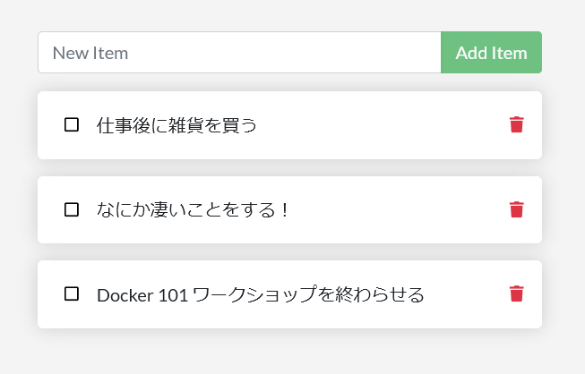
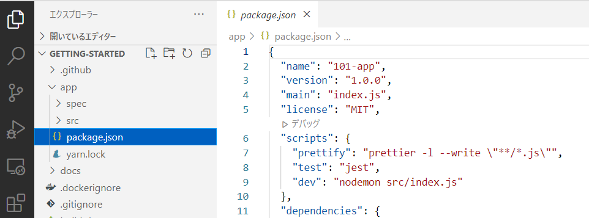

.. -*- coding: utf-8 -*-
.. URL: https://docs.docker.com/get-started/02_our_app/
   doc version: 20.10
      https://github.com/docker/docker.github.io/blob/master/get-started/02_our_app.md
.. check date: 2022/09/20
.. Commits on Jul 28, 2022 820366d4bfe722cc6f47847066214a48b56d66c5
.. -----------------------------------------------------------------------------

.. Sample application
.. _sample-application:

========================================
サンプル・アプリケーション
========================================

.. sidebar:: 目次

   .. contents:: 
       :depth: 2
       :local:

.. For the rest of this tutorial, we will be working with a simple todo list manager that is running in Node.js. If you’re not familiar with Node.js, don’t worry. No real JavaScript experience is needed.

以降のチュートリアルでは、Node.js で動作するシンプルな Todo リスト・マネージャを扱います。Node.js に慣れていなくても、心配無用です。実際の JavaScript 経験を必要としません。

.. At this point, your development team is quite small and you’re simply building an app to prove out your MVP (minimum viable product). You want to show how it works and what it’s capable of doing without needing to think about how it will work for a large team, multiple developers, etc.

この段階では、あなたの開発チームは非常に小さく、MVP（ :ruby:`実用最小限の製品 <Minimum Viable Product>` ）を検証するためのアプリを構築したばかりです。このアプリが機能する所を見せたいので、この時点では、大きなチームや複数の開発者等が、どのようにして動作させるかを考慮する必要はありません。

.. Get the app
.. _get-the-app:

アプリの入手
====================

.. Before we can run the application, we need to get the application source code onto our machine. For real projects, you will typically clone the repo. But, for this tutorial, we have created a ZIP file containing the application.

アプリケーションを実行する前に、マシン上にアプリケーションのソースコードを入手する必要があります。実際のプロジェクトでは、リポジトリのクローンが一般的でしょう。ですが、このチュートリアルでは、アプリケーションを含む ZIP ファイルを作成しました。

..    Download the App contents from the getting-started repository. You can either pull the entire project or download it as a zip and extract the app folder out to get started with.

..    Download the App contents. You can either pull the entire project or download it as a zip and extract the app folder out to get started with.
    Once extracted, use your favorite code editor to open the project. If you’re in need of an editor, you can use Visual Studio Code. You should see the package.json and two subdirectories (src and spec).

1. アプリの中身を `getting-started リポジトリ <https://github.com/docker/getting-started/tree/master>`_ からダウンロードします。 プロジェクト全体を pull するか、あるいは、 `リポジトリの zip ファイルをダウンロード <https://github.com/docker/getting-started/archive/refs/heads/master.zip>`_ してアプリ用フォルダに展開してから始めましょう。
2. 展開後は、好きなコードエディタでプロジェクトを開きます。エディタが必要であれば、 `Visual Studio Code <https://code.visualstudio.com/>`_ が使えます。開くと、 ``package.json`` と2つのサブディレクトリ（ ``src`` と ``spec`` ）が見えるでしょう。

.. Build the app’s container image
.. _build-the-apps-container-image:

アプリのコンテナ イメージを :ruby:`構築 <build>`
==================================================

.. In order to build the application, we need to use a Dockerfile. A Dockerfile is simply a text-based script of instructions that is used to create a container image. If you’ve created Dockerfiles before, you might see a few flaws in the Dockerfile below. But, don’t worry. We’ll go over them.

アプリケーションを :ruby:`構築 <build>` するには、 ``Dockerfile`` を使う必要があります。 Dockerfile とは、コンテナ イメージの作成で使う命令が、分かりやすい文字列で構成されるスクリプトです。これまでに Dockerfile の作成経験があれば、以下手順にある Dockerfile には問題があると気づくかもしれません。ですが、今は心配しないでください。後ほど説明します。

..    Create a file named Dockerfile in the same folder as the file package.json with the following contents.

1. ``package.json`` と同じフォルダ内に ``Dockerfile`` という名前のファイルを作成し、内容は以下のようにします
   
   .. code-block:: bash
   
      # syntax=docker/dockerfile:1
      FROM node:18-alpine
      WORKDIR /app
      COPY ..
      RUN yarn install --production
      CMD ["node", "src/index.js"]
      EXPOSE 3000

.. Please check that the file Dockerfile has no file extension like .txt. Some editors may append this file extension automatically and this would result in an error in the next step.

``Dockerfile`` には ``.txt`` のようなファイル拡張子が無いのをご確認ください。エディタによってはファイル拡張子を自動的に付けるため、次の手順でエラーになる場合があります。

.. If you haven’t already done so, open a terminal and go to the app directory with the Dockerfile. Now build the container image using the docker build command.

2. まだ終わっていなければ、ターミナルを開き、 ``app`` ディレクトリで ``Dockerfile`` を開きます。それから ``docker build`` コマンドを使ってコンテナ イメージを :ruby:`構築 <build>` します。

.. code-block:: bash

   $ docker build -t getting-started .

..    This command used the Dockerfile to build a new container image. You might have noticed that a lot of “layers” were downloaded. This is because we instructed the builder that we wanted to start from the node:12-alpine image. But, since we didn’t have that on our machine, that image needed to be downloaded.

このコマンドは、先ほどの Dockerfile を使い、新しいコンテナ イメージを :ruby:`構築 <build>` します。実行すると、多くの「 :ruby:`レイヤー <layer>` 」がダウンロードされるのが分かるでしょう。これは ``nonde:12-alpine`` イメージから起動したいと  :ruby:`構築用プログラム <builder>` に対して命令したからです。ですが、マシン上にはイメージがないため、ダウンロードする必要があります。

..    After the image was downloaded, we copied in our application and used yarn to install our application’s dependencies. The CMD directive specifies the default command to run when starting a container from this image.

イメージをダウンロードしたら、アプリケーションをコピーし、 ``yarn`` を使ってアプリケーションの :ruby:`依存関係 <dependency>` をインストールします。 ``CMD`` 命令は、このイメージでコンテナを起動する時に、デフォルトで実行するコマンドを指定します。

..    Finally, the -t flag tags our image. Think of this simply as a human-readable name for the final image. Since we named the image getting-started, we can refer to that image when we run a container.

最後に ``-t`` フラグでイメージに :ruby:`タグ <tag>` を付けます。タグとは、最後のイメージに対し、人間が読める名前を単に付けるためと考えてください。このイメージには `getting-started`` と名前を単に付けましたので、コンテナの実行時に、このイメージ名を示せます。

..    The . at the end of the docker build command tells Docker that it should look for the Dockerfile in the current directory.

``docker build`` コマンドの最後にある ``.`` は、Docker に対して、現在のディレクトリ内にある ``Dockerfile`` を探すべきと命令します。

.. Start an app container
.. _start-an-app-container:

アプリ コンテナの起動
==============================

.. Now that we have an image, let’s run the application. To do so, we will use the docker run command (remember that from earlier?).

これでイメージが手に入りましたので、アプリケーションを実行しましょう。そのためには、 ``docker run`` コマンドを使います（Part 1 を覚えていますか？）。

..    Start your container using the docker run command and specify the name of the image we just created:

1. コンテナを起動するには、 ``docker run`` コマンドを使い、先ほど作成したイメージ名を指定します。

   .. code-block:: bash
   
      $  docker run -dp 3000:3000 getting-started

..    Remember the -d and -p flags? We’re running the new container in “detached” mode (in the background) and creating a mapping between the host’s port 3000 to the container’s port 3000. Without the port mapping, we wouldn’t be able to access the application.

この ``-d`` と ``-p`` フラグを覚えていますか？ ここでは「 :ruby:`デタッチド <detouched>` モード」（バックグランドで）新しいコンテナを実行し、ホスト側のポート 3000 をコンテナのポート 3000 間で関連付け（ :ruby:`マッピング <mapping>` ）をします。ポートの関連付け（ :ruby:`ポート マッピング <port mapping>` ）をしなければ、アプリケーションに接続できません。

..    After a few seconds, open your web browser to http://localhost:3000. You should see our app.

2. 数秒後、自分のウェブ ブラウザで http://localhost:3000  を開きます。そうすると、私たちのアプリが見えるでしょう。

   .. image:: ./images/todo-list-empty.png
      :scale: 60%
      :alt: まだ何も入っていない ToDo List

..    Go ahead and add an item or two and see that it works as you expect. You can mark items as complete and remove items. Your frontend is successfully storing items in the backend. Pretty quick and easy, huh?

3. あとは１つ２つとアイテムを追加すると、期待通りに動作するでしょう。完了したアイテムに印を付けると、アイテムを削除できます。このように、フロントエンドはバックエンドへのアイテム保存に成功しています。とても素早く簡単ですよね？

.. At this point, you should have a running todo list manager with a few items, all built by you. Now, let’s make a few changes and learn about managing our containers.

この時点で、実行中の todo リスト マネージャには複数のアイテムが入っていて、これらは全て自分が構築したものです。それでは、変更を加えつつ、コンテナ管理の仕方を学びましょう。

.. If you take a quick look at the Docker Dashboard, you should see your two containers running now (this tutorial and your freshly launched app container).

ここで Docker ダッシュボードを軽く見てみると、２つのコンテナが実行中だと分かるでしょう（このチュートリアルと、作成したばかりのアプリ用コンテナです）。

   .. image:: ./images/dashboard-two-containers.png
      :scale: 60%
      :alt: Docker ダッシュボードにはチュートリアルとアプリ用コンテナが実行中

.. Recap
.. _part2-recap:

まとめ
==========

.. In this short section, we learned the very basics about building a container image and created a Dockerfile to do so. Once we built an image, we started the container and saw the running app.

この短いセクションでは、基本中の基本として、コンテナ イメージの構築と、 Dockerfile の作成とイメージの構築を学びました。イメージを構築するだけでコンテナを実行でき、実行中のアプリを表示しています。

.. Next, we’re going to make a modification to our app and learn how to update our running application with a new image. Along the way, we’ll learn a few other useful commands.

次はアプリに変更を加え、実行中のアプリケーションを新しいイメージに更新する方法を学びます。その途中で、いくつかの便利なコマンドも学びます。

.. seealso::

   Sample application
      https://docs.docker.com/get-started/02_our_app/

