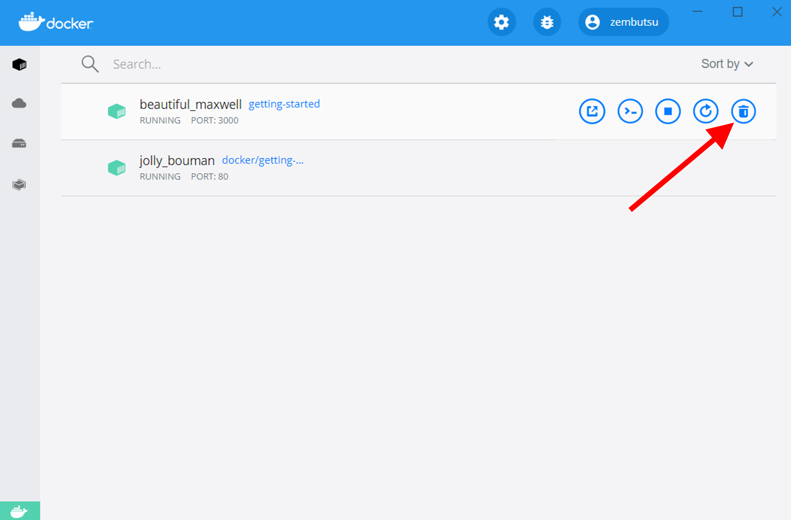
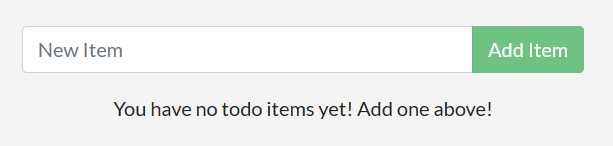

.. -*- coding: utf-8 -*-
.. URL: https://docs.docker.com/get-started/03_updating_app/
   doc version: 20.10
      https://github.com/docker/docker.github.io/blob/master/get-started/03_updating_app.md
.. check date: 2022/09/20
.. Commits on Jan 11, 2022 5eb68faf22a12ff8144d5ee5c062024c4f543b1a
.. -----------------------------------------------------------------------------

.. Update the application
.. _update-the-application:

========================================
アプリケーションの更新
========================================

.. sidebar:: 目次

   .. contents:: 
       :depth: 2
       :local:

.. As a small feature request, we’ve been asked by the product team to change the “empty text” when we don’t have any todo list items. They would like to change it to the following:

プロダクション チームから、小さな機能リクエストがありました。todo リストにアイテムが何も無い場合に表示する、「アイテムが入っていない文字」の変更です。次のように変更して欲しいという依頼です。

..    You have no todo items yet! Add one above!

::

   You have no todo items yet! Add one above!

.. Pretty simple, right? Let’s make the change.

とてもシンプルですよね？ それでは変更しましょう。

.. Update the source code
.. _update-the-source-code:

ソースコードの変更
====================

..    In the src/static/js/app.js file, update line 56 to use the new empty text.

1. ``src/static/js/app.js`` ファイル内の 56 行目で、何もない時に表示する新しいメッセージを変更します。

   .. code-block:: diff
   
      -                
No items yet! Add one above!

      +                
You have no todo items yet! Add one above!

..    Let’s build our updated version of the image, using the same command we used before.

2. イメージの更新したバージョンを作成するため、先ほどと同じコマンドを使います。

   .. code-block:: bash
   
      $ docker build -t getting-started .

.. Let’s start a new container using the updated code.

3. 更新したコードを使う新しいコンテナを起動しましょう。

   .. code-block:: bash
   
      $ docker run -dp 3000:3000 getting-started

.. Uh oh! You probably saw an error like this (the IDs will be different):

**あれれ？** たぶん次のようなエラーが出ているでしょう（ID は違います）。

.. code-block:: bash

   docker: Error response from daemon: driver failed programming external connectivity on endpoint laughing_burnell 
   (bb242b2ca4d67eba76e79474fb36bb5125708ebdabd7f45c8eaf16caaabde9dd): Bind for 0.0.0.0:3000 failed: port is already allocated.

.. So, what happened? We aren’t able to start the new container because our old container is still running. It is because the container is using the host’s port 3000 and only one process on the machine (containers included) can listen to a specific port. To fix this, we need to remove the old container.

何が起こったのでしょうか？ 新しいコンテナを起動できないのは、まだ古いコンテナを実行中だからです。コンテナはホスト側のポート 3000 を使用中で、マシン上の１つのプロセス（コンテナも含みます）しか、特定のポートをリッスンできないからです。これの対応には、古いコンテナの削除が必要です。

.. Replace the old container
.. _replace-the-old-container:

古いコンテナを置き換える
==============================

.. To remove a container, it first needs to be stopped. Once it has stopped, it can be removed. We have two ways that we can remove the old container. Feel free to choose the path that you’re most comfortable with.

コンテナを削除するには、まずコンテナの停止が必要です。停止した後に削除できます。古いコンテナの削除には２つの方法があります。どちらでも、やりやすい方法を自由に選んでください。

.. Remove a container using the CLI
.. _remove-a-container-using-the-cli:

CLI でコンテナを削除
--------------------

..    Get the ID of the container by using the docker ps command.

1. ``docker ps`` コマンドを使い、コンテナの ID を調べます。

.. code-block:: bash

   $ docker ps

.. Use the docker stop command to stop the container.

2. ``docker stop`` コマンドでコンテナを停止します。

   .. code-block:: bash
   
      # <the-container-id> は docker ps の ID に置き換え
      $ docker stop <the-container-id>

.. Once the container has stopped, you can remove it by using the docker rm command.

3. コンテナが停止したら、 ``docker rm`` コマンドで削除できます。

   .. code-block:: bash
   
      $ docker rm <the-container-id>

..    Note
    You can stop and remove a container in a single command by adding the “force” flag to the docker rm command. For example: docker rm -f <the-container-id>

.. note::

   ``docker rm`` コマンドに「 :ruby:`強制 <force>` 」フラグを付ければ、１回のコマンドでコンテナの削除と停止ができます。例： ``docker rm -f <the-container-id>``

.. Remove a container using the Docker Dashboard
.. _remove-a-container-using-the-docker-dashboard:

Docker ダッシュボードでコンテナを削除
----------------------------------------

.. If you open the Docker dashboard, you can remove a container with two clicks! It’s certainly much easier than having to look up the container ID and remove it.

Docker ダッシュボードを開けば、２クリックでコンテナを削除できます！ コンテナ ID を調べて削除するよりも、遙かに簡単です。

..    With the dashboard opened, hover over the app container and you’ll see a collection of action buttons appear on the right.

1. ダッシュボードを開き、アプリ用コンテナの上を（マウスのポインタで）示すと、右側に :ruby:`機能ボタン <action button>` の集まりが見えます。

..    Click on the trash can icon to delete the container.

2. ごみ箱のアイコンをクリックし、コンテナを削除します。

..    Confirm the removal and you’re done!

3. 削除を確認すると、これで終わりです。

.. Start the updated app container
.. _start-the-updated-app-container:

更新したアプリ用コンテナを起動
------------------------------

..    Now, start your updated app.

1. 今度は、更新したアプリを起動します。

   .. code-block:: bash
   
      $ docker run -dp 3000:3000 getting-started

..    Refresh your browser on http://localhost:3000 and you should see your updated help text!

2. ブラウザで http://localhost:3000 を再読み込みすると、説明の文字が更新されているでしょう！

.. Updated application with updated empty text

.. Recap
.. _part3-recap:

まとめ
==========

.. While we were able to build an update, there were two things you might have noticed:

構築と更新をしましたが、注意点が２つあります。

..  All of the existing items in our todo list are gone! That’s not a very good app! We’ll talk about that shortly.
    There were a lot of steps involved for such a small change. In an upcoming section, we’ll talk about how to see code updates without needing to rebuild and start a new container every time we make a change.

* todo リストに追加していたアイテムは、全て消えました！ あまり良くないアプリですね！ 近いうちに説明します。
* 小さな変更のように、実際には多くの改良ステップがあります。以降のセクションでは、再構築を必要としないコードの編集方法や、変更する度に新しくコンテナを起動する方法を説明します。

.. Before talking about persistence, we’ll quickly see how to share these images with others.

:ruby:`一貫性 <persistence>` を説明する前に、他人とイメージを共有する方法を見ていきます。

.. seealso::

   Update the application
      https://docs.docker.com/get-started/03_updating_app/

