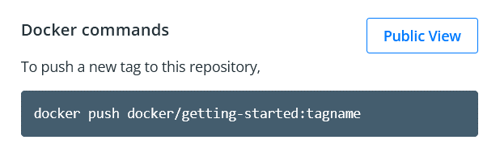

.. -*- coding: utf-8 -*-
.. URL: https://docs.docker.com/get-started/04_sharing_app/
   doc version: 24.0
      https://github.com/docker/docker.github.io/blob/master/get-started/04_sharing_app.md
.. check date: 2023/07/17
.. Commits on Jun 15, 2023 6aa908c3b807b281072432ae095c2d45be3e3ce5
.. -----------------------------------------------------------------------------

.. Share the application
.. _share-the-application:

========================================
アプリケーションの共有
========================================

.. sidebar:: 目次

   .. contents:: 
       :depth: 2
       :local:

.. Now that you’ve built an image, you can share it. To share Docker images, you have to use a Docker registry. The default registry is Docker Hub and is where all of the images you’ve used have come from.

構築したイメージは共有できます。 Docker イメージを共有するには、 Docker :ruby:`レジストリ <registry>` を使う必要があります。デフォルトのレジストリは Docker Hub です。そこには、これまでに使った全てのイメージがあります。

..    Docker ID
    A Docker ID allows you to access Docker Hub which is the world’s largest library and community for container images. Create a Docker ID for free if you don’t have one.

.. note:: **Docker ID**

   Docker Hub はコンテナ イメージの世界最大のライブラリかつコミュニティであり、 Docker ID でアクセスできます。まだ持っていなければ、無料で `Docker ID <https://hub.docker.com/signup>`_ を作りましょう。

.. Create a repo
.. _create-a-repo:

リポジトリ作成
====================

.. To push an image, we first need to create a repository on Docker Hub.

イメージを :ruby:`送信 <push>` するには、まず Docker Hub にリポジトリを作成する必要があります。

..    Sign up or Sign in to Docker Hub.

1. `Docker Hub <https://hub.docker.com/>`_ に `サインアップ <https://www.docker.com/pricing?utm_source=docker&utm_medium=webreferral&utm_campaign=docs_driven_upgrade>`_ 又はサインインします。

..    Click the Create Repository button.

2. **Create Repository** （リポジトリ作成）ボタンをクリックします。

..    For the repo name, use getting-started. Make sure the Visibility is Public.

3. リポジトリ名には ``getting-started`` を使います。Visibility は ``Public`` （公開）を確認します。

   ..        Private repositories
        Did you know that Docker offers private repositories which allows you to restrict content to specific users or teams? Check out the details on the Docker pricing page.

   .. note::
   
      **プライベート リポジトリ**
   
      特定のユーザやチームに対してのみ内容を制限するために、Docker は :ruby:`プライベート リポジトリ <private repository>` を提供しています。御存じですか？ 詳細は `Docker pricing <https://www.docker.com/pricing?utm_source=docker&utm_medium=webreferral&utm_campaign=docs_driven_upgrade>`_ のページを御覧ください。

..    Click the Create button!

4. **Create** （作成）ボタンをクリックします。

.. If you look at the image below an example Docker command can be seen. This command will push to this repo.

下の図を見たら、 Docker コマンド例があります。このコマンドは、このリポジトリを送信します。

.. Push the image
.. _push-the-image:

イメージを :ruby:`送信 <push>`
========================================

.. hint::

   （訳者注）この日本語訳では、イメージの「push」を「送信」として訳しています（コマンドを示す以外）。本来の push は「何かを押し出す」「何かを遠ざける」という意味です。ですが、そのまま訳したり"プッシュ"とカタカナ表記したりしても、抽象的な表現は日本語での理解が困難なため、 Docker の機能を表す「送信」と訳しています。

.. In the command line, try running the push command you see on Docker Hub. Note that your command will be using your namespace, not “docker”.

1. コマンドラインから、先ほど Docker Hub で見た push （送信）コマンドを実行します。注意点として、入力するコマンドでは自分の名前空間（Docker ユーザ ID）を指定する必要があります。「docker」ではありません。

   .. code-block:: bash
   
      $ docker push docker/getting-started
      The push refers to repository [docker.io/docker/getting-started]
      An image does not exist locally with the tag: docker/getting-started

   .. Why did it fail? The push command was looking for an image named docker/getting-started, but didn’t find one. If you run docker image ls, you won’t see one either.

   失敗しましたか？ push コマンドは docker/getting-started という名前のイメージを探しますが、見つからないからです。 ``docker image ls`` を実行しても、該当するイメージは見つからないでしょう。

   .. To fix this, you need to “tag” your existing image you’ve built to give it another name.

   修正するには、現在の構築済みイメージに付いている「 :ruby:`タグ <tag>` 」に、別の名前を付ける必要があります。

.. Login to the Docker Hub using the command docker login -u YOUR-USER-NAME.

2. コマンド ``docker login -u 自分のユーザ名`` で Docker Hub へログインします。

.. Use the docker tag command to give the getting-started image a new name. Be sure to swap out YOUR-USER-NAME with your Docker ID.

3. ``docker tag`` コマンドを使い、 ``getting-started`` イメージに新しい名前を追加します。注意点として、 ``YOUR-USER-NAME`` は自分の Docker ID に置き換えます。

   .. code-block:: bash
   
      $ docker tag getting-started YOUR-USER-NAME/getting-started

   .. To learn more about the docker tag command, see docker tag.
   
   ``docker tag`` コマンドについて学ぶには :doc:`docker tag </engine/reference/commandline/tag>` を御覧ください。

.. Now try your push command again. If you’re copying the value from Docker Hub, you can drop the tagname portion, as you didn’t add a tag to the image name. If you don’t specify a tag, Docker will use a tag called latest.

4. これでもう一度 push コマンドを試します。Docker  Hub から値をコピーしている場合でも、先ほどイメージにタグを付けていたように、 ``tagname`` の文字を省略できます。タグを指定しなければ、 Docker は ``latest`` （最新）と呼ばれるタグを使います。

   .. code-block:: bash
   
      $ docker push YOUR-USER-NAME/getting-started

.. Run the image on a new instance
.. _run-the-image-on-a-new-instance:

新しいイメージを実行
========================================

.. Now that your image has been built and pushed into a registry, try running your app on a brand new instance that has never seen this container image. To do this, you will use Play with Docker.

現在、イメージは構築が終わり、レジストリに送信しました。まだコンテナイメージを扱っていない、真っさらなインスタンス（訳者注：Play widh Docker 環境上の仮想マシン）を使ってアプリを実行しましょう！ ここでは、 Play with Docker を使います。

.. note::

   .. Play with Docker uses the amd64 platform. If you are using an ARM based Mac with Apple Silicon, you will need to rebuild the image to be compatible with Play with Docker and push the new image to your repository.

   Play with Docker は amd64 プラットフォームを用いています。もしも Apple Silicon を使う ARM ベースの Mac を使う場合、 Play with Docker と互換性を持つイメージを再構築し、新しいイメージをリポジトリに送信する必要があります。

   .. To build an image for the amd64 platform, use the --platform flag.
   
   amd64 プラットフォーム用のイメージを再構築するには、 ``--platform`` フラグを使います。

   .. code-block:: bash
   
      $ docker build --platform linux/amd64 -t YOUR-USER-NAME/getting-started .

   .. Docker buildx also supports building multi-platform images. To learn more, see Multi-platform images.

   Docker buildx もマルチプラットフォームのイメージ構築をサポートしています。詳しく知るには :doc:`マルチプラットフォーム イメージ</build/building/multi-platform>` を御覧ください。

..    Open your browser to Play with Docker.

1. ブラウザで `Play with Docker <https://labs.play-with-docker.com/>`_ を開きます。

..    Click Login and then select docker from the drop-down list.

2. **Login** をクリックし、ドロップダウン リストから **docker** を選びます。

..    Connect with your Docker Hub account.

3. 自分の Docker Hub アカウントで接続します。

..    Once you’re logged in, click on the ADD NEW INSTANCE option on the left side bar. If you don’t see it, make your browser a little wider. After a few seconds, a terminal window opens in your browser.

4. ログインしたら、左サイドバー上にある **ADD NEW INSTANCE** （新しいインスタンスの追加）をクリックします。もしも表示さなければ、ブラウザの表示幅を少し広くしてください。数秒しますと、ブラウザ内にターミナル画面が開きます。

   .. image:: ./images/pwd-add-new-instance.png
      :alt: Play with Docker と新しいインスタンス

..    In the terminal, start your freshly pushed app.

5. ターミナル内で、先ほど送信したアプリを起動します。

   .. code-block:: bash
   
      $ docker run -dp 0.0.0.0:3000:3000 YOUR-USER-NAME/getting-started

   .. You should see the image get pulled down and eventually start up.

   画面ではイメージを取得して、最終的には起動するのが見えるでしょう！

.. You may have noticed that this command binds the port mapping to a different IP address. Previous docker run commands published ports to 127.0.0.1:3000 on the host. This time, you’re using 0.0.0.0.
   Binding to 127.0.0.1 only exposes a container’s ports to the loopback interface. Binding to 0.0.0.0, however, exposes the container’s port on all interfaces of the host, making it available to the outside world.
   For more information about how port mapping works, see Networking.

.. tip::

   このコマンドでは、ポートを割り当てて（ポートマッピング）バインドする IP アドレスが異なるのに気づくでしょう。これまでの ``docker run`` コマンドではホスト上の ``127.0.0.1:3000`` に対してポートを公開していました。ここでは ``0.0.0.0`` を使っています。
   ``127.0.0.1`` へのバインドとは、ループバック インターフェースに対してのみコンテナのポートを公開します。一方で ``0.0.0.0`` のバインドとは、ホスト上すべてのインターフェース上でコンテナのポートを公開しますので、これにより外の世界で利用可能になります。
   ポート割り当て動作の仕組みに関する詳しい情報は :ref:`ネットワーク機能 <network-published-ports>` を御覧ください。

.. Select on the 3000 badge when it comes up and you should see the app with your modifications. If the 3000 badge doesn’t show up, you can select on the Open Port button and type in 3000.

6. 起動したら 3000 バッジをクリックしたら、変更を加えたアプリが表示されるでしょう。 もし 3000 バッジが表示されなければ、「 **Open Port** 」（ポートを開く）ボタンをクリックし、 3000 と入力します。

.. Next steps
.. _part_4-next-steps:

次のステップ
====================

.. In this section, you learned how to share your images by pushing them to a registry. You then went to a brand new instance and were able to run the freshly pushed image. This is quite common in CI pipelines, where the pipeline will create the image and push it to a registry and then the production environment can use the latest version of the image.

このセクションでは、イメージを共有するために、レジストリにイメージを送信する方法を学びました。それから真っさらなインスタンスに移動し、送信したばかりのイメージを実行できました。これが正に CI パイプラインと共通する部分です。パイプラインとはイメージを作成し、レジストリに送信し、プロダクション環境でイメージの最新版を利用できる場所です。

.. Now you can circle back around to what you noticed at the end of the last section. As a reminder, you noticed that when you restarted the app, you lost all of your todo list items. That’s obviously not a great user experience, so next you’ll learn how you can persist the data across restarts.

ここまで理解したところで、先ほどのセクションの最後で述べた部分に立ち戻りましょう。振り返れば、アプリの再起動時、todo リストのアイテムが全て消えました。これは明らかに良くないユーザ体験ですので、次は再起動してもデータが :ruby:`保持 <persist>` できる方法を学びましょう。

.. seealso::

   Share the application
      https://docs.docker.com/get-started/04_sharing_app/

