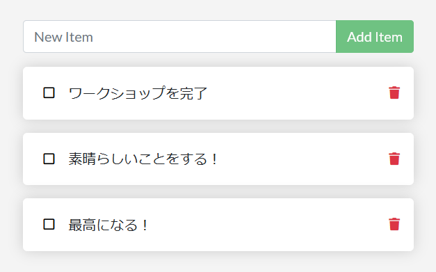

.. -*- coding: utf-8 -*-
.. URL: https://docs.docker.com/get-started/05_persisting_data/
   doc version: 20.10
      https://github.com/docker/docker.github.io/blob/master/get-started/05_persisting_data.md
.. check date: 2022/04/16
.. Commits on Sep 3, 2021 ac1df4d6a9d3175b4cf42c21cb98eedd60822657
.. -----------------------------------------------------------------------------

.. Persist the DB
.. _persist-the-db:

========================================
DB の保持
========================================

.. sidebar:: 目次

   .. contents:: 
       :depth: 2
       :local:

.. In case you didn’t notice, our todo list is being wiped clean every single time we launch the container. Why is this? Let’s dive into how the container is working.

気を付けないと、todo リストはコンテナを起動するたび、きれいに消去されます。どうしてでしょうか？ コンテナがどのように動作しているのか、深掘りしましょう。

.. The container’s filesystem
.. _the-containers-filesystem:
コンテナのファイルシステム
==============================

.. When a container runs, it uses the various layers from an image for its filesystem. Each container also gets its own “scratch space” to create/update/remove files. Any changes won’t be seen in another container, even if they are using the same image.

コンテナの実行時、イメージの様々なレイヤーを、コンテナのファイルシステムに使います。また、各コンテナでは、ファイルを作成、更新、削除するための「 :ruby:`スクラッチ領域 <scratch space>` 」もコンテナ自身が持ちます。たとえ同じイメージを使っていたとしても、（コンテナのファイルシステムに対する）あらゆる変更は、他のコンテナからは見えません。

.. See this in practice
.. _see-this-in-practice:
実行して確認
------------------------------

.. To see this in action, we’re going to start two containers and create a file in each. What you’ll see is that the files created in one container aren’t available in another.

この処理を見るために、２つのコンテナを起動し、それぞれにファイルを作成します。一方のコンテナで作成されたファイルは、もう一方のコンテナからは見えないと分かるでしょう。

..    Start an ubuntu container that will create a file named /data.txt with a random number between 1 and 10000.

1. ``ubuntu`` コンテナを起動し、そこに ``/data.txt`` という名前のファイルを作成し、1から10000までのランダムな数を入れます。

   .. code-block:: bash
   
   $ docker run -d ubuntu bash -c "shuf -i 1-10000 -n 1 -o /data.txt && tail -f /dev/null"

   .. In case you’re curious about the command, we’re starting a bash shell and invoking two commands (why we have the &&). The first portion picks a single random number and writes it to /data.txt. The second command is simply watching a file to keep the container running.

   このコマンドに興味があれば説明します。これは bash シェルを開始し、２つのコマンド（これが ``&&`` を使った理由）を実行しました。前半部分はランダムな数を選び、それをファイル ``./data.txt`` に書き出します。後半部分はコンテナを実行し続けるため、単にファイルを見ているだけです。

.. Validate that we can see the output by execing into the container. To do so, open the Dashboard and click the first action of the container that is running the ubuntu image.

2. コンテナ内に ``exec`` すると、出力を確認できます。そのためには、ダッシュボードを開き、実行している ``ubuntu`` イメージのコンテナにある、１番目のアクション（ CLI と表示）をクリックします。

   .. image:: ./images/dashboard-open-cli-ubuntu.png
      :scale: 60%
      :alt: Todo List Manager のスクリーンショット

   .. You will see a terminal that is running a shell in the ubuntu container. Run the following command to see the content of the /data.txt file. Close this terminal afterwards again.

   そうすると、ターミナルが開き、ubuntu コンテナ内で実行中のシェルが見えます。 ``/data.txt`` ファイルの内容を見るには、以下のコマンドを実行します。その後、このターミナルは以後使いませんので、閉じます。

   .. code-block:: bash
   
      $ cat /data.txt

   .. If you prefer the command line you can use the docker exec command to do the same. You need to get the container’s ID (use docker ps to get it) and get the content with the following command.

   ``docker eec`` コマンドを使う方が好きでしたら、同じようにできます。そのためにはコンテナ ID の確認が必要です。それから、以下のコマンドでファイル内容を表示します。

   .. code-block:: bash
   
      $ docker exec <container-id> cat /data.txt

   .. You should see a random number!

   ランダムな数が見えるでしょう！

.. Now, let’s start another ubuntu container (the same image) and we’ll see we don’t have the same file.

3. 次に、他の ``ubuntu`` コンテナ（同じイメージ）を起動しても、同じファイルは見えないでしょう。

.. code-block:: bash

   $ docker run -it ubuntu ls /

   .. And look! There’s no data.txt file there! That’s because it was written to the scratch space for only the first container.

   見てください！ そこに ``data.txt`` はありません！ その理由とは、書き出したのは、１つめのコンテナのスクラッチ領域だけだからです。

.. Go ahead and remove the first container using the docker rm -f <container-id> command.

4. 次に進むため、 ``docker rm -f <コンテナID>`` コマンドを使って、１つめのコンテナを削除します。

.. Container volumes
.. _container-volumes:
コンテナの :ruby:`ボリューム <volume>`
========================================

.. With the previous experiment, we saw that each container starts from the image definition each time it starts. While containers can create, update, and delete files, those changes are lost when the container is removed and all changes are isolated to that container. With volumes, we can change all of this.

これまで試したように、各コンテナは、イメージの定義からコンテナが起動するのが分かりました。コンテナはファイルの作成、更新、削除ができますが、コンテナを削除すると、それらの変更は消失します。また、コンテナに対する全ての変更とは、 :ruby:`隔離された <isolated>` 対象のコンテナに対してのみです。ですが、 :ruby:`ボリューム <volume>` を使えば、これら全てを変えられます。

.. Volumes provide the ability to connect specific filesystem paths of the container back to the host machine. If a directory in the container is mounted, changes in that directory are also seen on the host machine. If we mount that same directory across container restarts, we’d see the same files.

:doc:`ボリューム </storage/volumes>` は、コンテナ内で指定したファイルシステムのパスを、ホストマシン上へと接続できる機能を備えています。コンテナ内にディレクトリをマウントすると、ディレクトリに対する変更は、ホストマシン上からも見えます。コンテナを再起動する場合にも、同じディレクトリをマウントしていれば、再起動後も同じファイルが見えます。

.. There are two main types of volumes. We will eventually use both, but we will start with named volumes.

ボリュームは主に２種類あります。ゆくゆくは両方を使いますが、まずは **名前付きボリューム （named volume）** から始めましょう。

.. Persist the todo data
.. _persist-the-todo-data:
todo データの保持
====================

.. By default, the todo app stores its data in a SQLite Database at /etc/todos/todo.db in the container’s filesystem. If you’re not familiar with SQLite, no worries! It’s simply a relational database in which all of the data is stored in a single file. While this isn’t the best for large-scale applications, it works for small demos. We’ll talk about switching this to a different database engine later.

デフォルトでは、todo アプリが自身のデータを保存するのは、コンテナ用ファイルシステム内で ``/etc/todo/todo.db`` にある `SQLite Databese <https://www.sqlite.org/index.html>`_ の中です。SQLite に不慣れでも、心配は要りません！ これはシンプルなリレーショナル データベースで、１つのファイル内に全てのデータを保存します。大きくスケールするアプリケーションには最良ではありませんが、小さなデモには効果的です。これを他のデータベースエンジンに切り替える方法は、後ほどお伝えします。

.. With the database being a single file, if we can persist that file on the host and make it available to the next container, it should be able to pick up where the last one left off. By creating a volume and attaching (often called “mounting”) it to the directory the data is stored in, we can persist the data. As our container writes to the todo.db file, it will be persisted to the host in the volume.

データベースがたった１つのファイルのため、ホスト上のファイルを次のコンテナで利用できるようにするだけで、データベースを保持できるため、最後に中断したところから続けられるでしょう。ボリュームを作成し、データを保管するディレクトリに :ruby:`取り付ける <attach>` と（よく :ruby:`マウントする <mounting>` と言います）、データを :ruby:`保持 <persist>` できます。つまり、私たちのコンテナが書き出す ``todo.db`` ファイルは、ホスト上のボリュームに置いておけば、保持できます。

.. As mentioned, we are going to use a named volume. Think of a named volume as simply a bucket of data. Docker maintains the physical location on the disk and you only need to remember the name of the volume. Every time you use the volume, Docker will make sure the correct data is provided.

先述の通り、ここでは **名前付きボリューム（named volume）** を使おうとしています。名前付きボリュームとは、単なるデータの :ruby:`入れ物 <bucket>` と考えてください。Docker がディスク上で物理的な場所を確保するので、必要なのはボリュームの名前を覚えておくだけです。ボリュームを使うたびに、Docker は正しいデータの提供を確認します。

..    Create a volume by using the docker volume create command.

1. ``docker volume create`` コマンドを使ってボリュームを作成します。

.. code-block:: bash

   $ docker volume create todo-db

.. Stop and remove the todo app container once again in the Dashboard (or with docker rm -f <id>), as it is still running without using the persistent volume.

2. ダッシュボードで（あるいは ``docker rm -f <id>`` ）、もう一度 todo アプリのコンテナを停止および削除します。このコンテナでは、まだ :ruby:`存続するボリューム <persistent volume>` を使っていないからです。

.. Start the todo app container, but add the -v flag to specify a volume mount. We will use the named volume and mount it to /etc/todos, which will capture all files created at the path.

3. todo アプリのコンテナを起動しますが、ボリュームのマウントを指定する ``-v`` フラグを追加します。ここでは名前付きボリュームを使い、 ``/etc/todos`` にマウントします。そうすると、このパスに作成された全てのファイルを保存します。

.. code-block:: bash

   $ docker run -dp 3000:3000 -v todo-db:/etc/todos getting-started

.. Once the container starts up, open the app and add a few items to your todo list.

4. コンテナが起動したら、アプリを開き、todo リストに新しいアイテムを追加します。

..    Stop and remove the container for the todo app. Use the Dashboard or docker ps to get the ID and then docker rm -f <id> to remove it.

5. todo アプリ用のコンテナを停止・削除します。コンテナの ID をダッシュボードか ``docker ps`` コマンドで調べ、 ``docker rm -f <id>`` で削除します。

..    Start a new container using the same command from above.

6. 先ほどと同じコマンドを使い、新しいコンテナを起動します。

..    Open the app. You should see your items still in your list!

7. アプリを開きます。そうすると、まだリストにアイテムが残っているのが見えるでしょう！

..    Go ahead and remove the container when you’re done checking out your list.

8. リストの挙動を確認できれば、次へ進むためにコンテナを削除します。

.. Hooray! You’ve now learned how to persist data!

できました！ これでデータを保持する方法を学びました。

..    Note
    While named volumes and bind mounts (which we’ll talk about in a minute) are the two main types of volumes supported by a default Docker engine installation, there are many volume driver plugins available to support NFS, SFTP, NetApp, and more! This will be especially important once you start running containers on multiple hosts in a clustered environment with Swarm, Kubernetes, etc.

.. note::

   :ruby:`名前付きボリューム <named volume>` と :ruby:`バインド マウント <bind mount>` （この後すぐ説明します）は、 Docker engine のインストールが、デフォルトでサポートしている２つの主なタイプです。他にも NFS、SFTP、NetApp 等々のサポートといった、多くのボリューム ドライバ プラグインがあります。これは Swarm や Kubernetes 等のクラスタ環境で、複数のホスト上にコンテナを実行しようとするのであれば、とても重要になります。

.. Dive into the volume
.. _dive-into-the-volume:
ボリュームを深掘り
====================

.. A lot of people frequently ask “Where is Docker actually storing my data when I use a named volume?” If you want to know, you can use the docker volume inspect command.

多くの人々が頻繁に「名前付きボリュームを使うと、私のデータを Docker が"実際に"保存するのはどこですか？」と尋ねます。知りたければ ``docker volume inspect`` コマンドが使えます。

... code-block:: bash

   $ docker volume inspect todo-db
   [
       {
           "CreatedAt": "2019-09-26T02:18:36Z",
           "Driver": "local",
           "Labels": {},
           "Mountpoint": "/var/lib/docker/volumes/todo-db/_data",
           "Name": "todo-db",
           "Options": {},
           "Scope": "local"
       }
   ]

.. The Mountpoint is the actual location on the disk where the data is stored. Note that on most machines, you will need to have root access to access this directory from the host. But, that’s where it is!

この ``MountPoint`` こそが、ディスク上でデータを保管している本当の場所です。ほとんどのマシンでは、このディレクトにホスト上からアクセスするには root 権限が必要でしょう。ですが、そこにデータがあるのです！

..    Accessing volume data directly on Docker Desktop
    While running in Docker Desktop, the Docker commands are actually running inside a small VM on your machine. If you wanted to look at the actual contents of the Mountpoint directory, you would need to first get inside of the VM.

.. note::

   **Docker Desktop 上で直接ボリュームのデータにアクセスするには**
   
   Docker Desktop を実行中に、Docker コマンドが実際に動くのは、マシン上の小さな仮想マシン内です。マウントポイントのディレクトリ内で、実際の内容を見たい場合は、何よりもまず仮想マシン内に入る必要があります。

.. Recap
.. _part5-recap:
まとめ
==========

.. At this point, we have a functioning application that can survive restarts! We can show it off to our investors and hope they can catch our vision!

ここまで、アプリケーションを再起動しても（テータを）保持できる機能を確認しました！ これでアプリケーションを投資家に披露できますので、私たちのビジョンを把握してもらえるよう望みます。

.. However, we saw earlier that rebuilding images for every change takes quite a bit of time. There’s got to be a better way to make changes, right? With bind mounts (which we hinted at earlier), there is a better way! Let’s take a look at that now!

ところで一方、初期の頃から変更を加えるたびに、何度も何度も毎回イメージの再構築をしています。これを改善したいと思いますよね？ バインド マウントの使用（先ほど簡単に触れました）こそが良い方法です。詳しく見ていきましょう！

.. seealso::

   Part 5: Persist the DB
      https://docs.docker.com/get-started/05_persisting_data/

