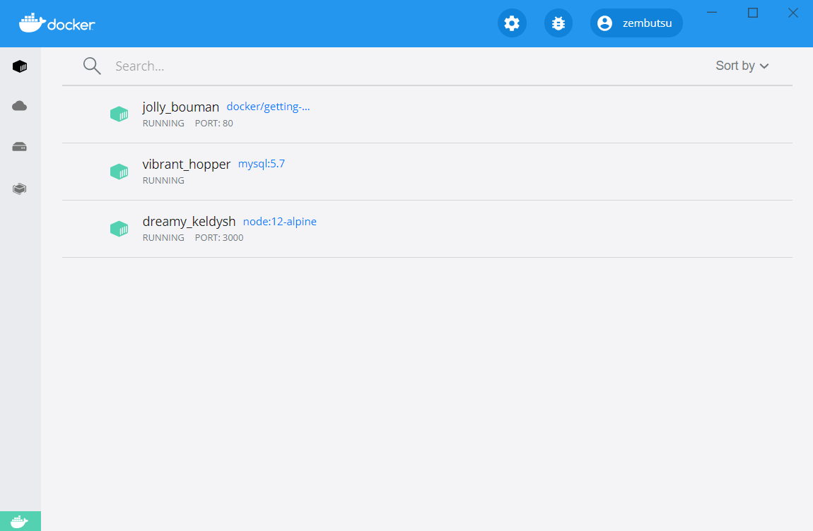

.. -*- coding: utf-8 -*-
.. URL: https://docs.docker.com/get-started/07_multi_container/
   doc version: 20.10
      https://github.com/docker/docker.github.io/blob/master/get-started/07_multi_container.md
.. check date: 2022/09/20
.. Commits on May 12, 2022 9a1cb6561c89559d7b85f6714d0ddc4d4cc27e15
.. -----------------------------------------------------------------------------

.. Multi container apps
.. _multi-container-apps:

========================================
複数コンテナのアプリ
========================================

.. sidebar:: 目次

   .. contents:: 
       :depth: 2
       :local:

.. Up to this point, we have been working with single container apps. But, we now want to add MySQL to the application stack. The following question often arises - “Where will MySQL run? Install it in the same container or run it separately?” In general, each container should do one thing and do it well. A few reasons:

これまでは１つのコンテナでアプリを動かしていました。しかし、これからはアプリケーション群に MySQL を追加しようとしています。そうすると、たいてい次の疑問が沸き上がります。「どこで MySQL を実行するの？ 同じコンテナにインストールするのかな、それとも別々に実行するの？」 通常、 **１つ１つのコンテナが、１つのことをしっかりと実行すべきです** 。いくつかの理由があります。

..    There’s a good chance you’d have to scale APIs and front-ends differently than databases
    Separate containers let you version and update versions in isolation
    While you may use a container for the database locally, you may want to use a managed service for the database in production. You don’t want to ship your database engine with your app then.
    Running multiple processes will require a process manager (the container only starts one process), which adds complexity to container startup/shutdown

* データベースとは別に、 API とフロントエンドをスケールする良い機会
* コンテナを分けると、現在のバージョンと更新したバージョンを分離できる
* 今はローカルにあるデータベースをコンテナが使っているが、プロダクションではデータベースのマネージド サービスを利用したくなるかもしれない
* 複数プロセスの実行にはプロセスマネージャが必要であり（コンテナは１つのプロセスのみ起動するため）、コンテナの起動や停止が複雑になる

.. And there are more reasons. So, we will update our application to work like this:

ほかにも、いくつかの理由があります。それでは、下図のように動作するようアプリケーションを更新します。

.. image:: ./images/multi-app-architecture.png
   :scale: 60%
   :alt: Todo アプリは MySQL コンテナに接続

.. Container networking
.. _container-networking:

コンテナのネットワーク機能
==============================

.. Remember that containers, by default, run in isolation and don’t know anything about other processes or containers on the same machine. So, how do we allow one container to talk to another? The answer is networking. Now, you don’t have to be a network engineer (hooray!). Simply remember this rule...

コンテナについて思い出しましょう。デフォルトでは、 :ruby:`孤立した状態 <in isolation>` で実行するため、同じマシン上の他のプロセスやコンテナを一切知りません。それでは、どのようにして他のコンテナと通信できるのでしょうか？ 答えは **ネットワーク機能（ networking ）** です。これであなたがネットワークエンジニアになる必要はありません（やったね！）。単純にこのルールを忘れないでください……。

..    Note
    If two containers are on the same network, they can talk to each other. If they aren’t, they can’t.

.. note::

   ２つのコンテナが同じネットワーク上にあれば、お互いに通信できます。そうでなければ、どちらも通信できません。

.. Start MySQL
.. _start-mysql:

MySQL の起動
====================

.. There are two ways to put a container on a network: 1) Assign it at start or 2) connect an existing container. For now, we will create the network first and attach the MySQL container at startup.

コンテナをネットワークに加えるには、２つの方法があります。１つは、起動する前に割り当てるか、もう１つは、既存のコンテナに接続します。さしあたり、まずはネットワークを作成し、それから MySQL コンテナの起動時に接続します。

..    Create the network.

1. ネットワークを作成します。

   .. code-block:: bash
   
      $ docker network create todo-app

.. Start a MySQL container and attach it to the network. We’re also going to define a few environment variables that the database will use to initialize the database (see the “Environment Variables” section in the MySQL Docker Hub listing).

2. MySQL コンテナを起動し、先ほどのネットワークに接続します。あわせて複数の環境変数を定義します。これは、データベースの初期化に使います（ `MySQL Docker Hub <https://hub.docker.com/_/mysql/>`_ にある「Environment Variables」セクションをご覧ください）。

   .. code-block:: bash
   
      $ docker run -d \
          --network todo-app --network-alias mysql \
          -v todo-mysql-data:/var/lib/mysql \
          -e MYSQL_ROOT_PASSWORD=secret \
          -e MYSQL_DATABASE=todos \
          mysql:5.7

   .. If you are using an ARM based chip, e.g. Macbook M1 Chips / Apple Silicon, then use this command.

   Macbook M1 チップ / Apple Silicon のような ARM ベースのチップを使う場合は、こちらのコマンドを使います。

   .. code-block:: bash
   
      $ docker run -d \
          --network todo-app --network-alias mysql \
          --platform "linux/amd64" \
          -v todo-mysql-data:/var/lib/mysql \
          -e MYSQL_ROOT_PASSWORD=secret \
          -e MYSQL_DATABASE=todos \
          mysql:5.7

   .. If you are using Windows then use this command in PowerShell.
   
   Windows を使う場合は、 PowerShell でこちらのコマンドを使います。

   .. code-block:: bash
   
      PS> docker run -d `
          --network todo-app --network-alias mysql `
          -v todo-mysql-data:/var/lib/mysql `
          -e MYSQL_ROOT_PASSWORD=secret `
          -e MYSQL_DATABASE=todos `
          mysql:5.7

   .. You’ll also see we specified the --network-alias flag. We’ll come back to that in just a moment.

   また、 ``--network-alias`` フラグも指定したのが見えるでしょう。こちらについては、後で触れます。

   ..    Tip
    You’ll notice we’re using a volume named todo-mysql-data here and mounting it at /var/lib/mysql, which is where MySQL stores its data. However, we never ran a docker volume create command. Docker recognizes we want to use a named volume and creates one automatically for us.

   .. tip::
   
      ここでは ``todo-mysql-data`` という名前のボリュームを使い、 MySQL が自身のデータを保管する ``/var/lib/mysql`` をマウントしているのに気づくでしょう。しかしまだ、 ``docker volume create`` コマンドを実行していません。名前付きボリュームを使いたい時は、 Docker が認識し、自動的にボリュームを作成します。

.. To confirm we have the database up and running, connect to the database and verify it connects.

3. データベースが起動して実行中なのを確認するには、データベースに接続し、つながっているかを確認します。

   .. code-block:: bash
   
      $ docker exec -it <mysql-container-id> mysql -u root -p

   .. When the password prompt comes up, type in secret. In the MySQL shell, list the databases and verify you see the todos database.

   パスワードのプロンプトが表示されたら、 **secret** と入力します。 MySQL のシェル内では、データベース一覧を表示すると、 ``todo`` データベースの存在が確認できます。

   .. code-block:: bash
   
      mysql> SHOW DATABASES;

   .. You should see output that looks like this:

   このような出力が見えるでしょう。
   
   .. code-block:: bash
   
      +--------------------+
      | Database           |
      +--------------------+
      | information_schema |
      | mysql              |
      | performance_schema |
      | sys                |
      | todos              |
      +--------------------+
      5 rows in set (0.00 sec)

   .. Exit the MySQL shell to return to the shell on our machine.

   MySQL シェルを終了し、マシン上のシェルに戻ります。

   .. code-block:: bash
   
      $ exit

   .. Hooray! We have our todos database and it’s ready for us to use!

   やった！ ``todo`` データベースが手に入りましたので、使う準備が調いました！

.. Connect to MySQL
.. _connet-to-mysql:

MySQL に接続
====================

.. Now that we know MySQL is up and running, let’s use it! But, the question is... how? If we run another container on the same network, how do we find the container (remember each container has its own IP address)?

 MySQL の起動と実行方法が分かりましたので、次は使いましょう！ ですが、問題があります……どうやって使うのでしょうか？ 同じネットワーク上で他のコンテナを実行したとして、どのようにして MySQL のコンテナを見つけられるのでしょうか？（各コンテナは自身の IP アドレスを持つのを思い出してください）

.. To figure it out, we’re going to make use of the nicolaka/netshoot container, which ships with a lot of tools that are useful for troubleshooting or debugging networking issues.

答えを探すために、 `nicolaka/netshoot <https://github.com/nicolaka/netshoot>`_ コンテナを使います。これには、ネットワーク機能の問題に対するトラブルシューティング（問題解決）やデバッグ（修正）に便利なツールがたくさん入っています。

..    Start a new container using the nicolaka/netshoot image. Make sure to connect it to the same network.

1. nicolaka/netshoot イメージを使う新しいコンテナを起動します。必ず同じネットワークに接続します。

   .. code-block:: bash
   
      $ docker run -it --network todo-app nicolaka/netshoot

.. Inside the container, we’re going to use the dig command, which is a useful DNS tool. We’re going to look up the IP address for the hostname mysql.

2. コンテナの中で、便利な DNS ツールの ``dig`` コマンドを使います。ホスト名 ``mysql`` の IP アドレスを調べましょう。

   .. code-block:: bash
   
      $ dig mysql

   .. And you’ll get an output like this...

   そうすると、次のような出力があります。

   .. code-block:: bash

      ; <<>> DiG 9.14.1 <<>> mysql
      ;; global options: +cmd
      ;; Got answer:
      ;; ->>HEADER<<- opcode: QUERY, status: NOERROR, id: 32162
      ;; flags: qr rd ra; QUERY: 1, ANSWER: 1, AUTHORITY: 0, ADDITIONAL: 0
      
      ;; QUESTION SECTION:
      ;mysql.				IN	A
      
      ;; ANSWER SECTION:
      mysql.			600	IN	A	172.23.0.2
      
      ;; Query time: 0 msec
      ;; SERVER: 127.0.0.11#53(127.0.0.11)
      ;; WHEN: Tue Oct 01 23:47:24 UTC 2019
      ;; MSG SIZE  rcvd: 44

   .. In the “ANSWER SECTION”, you will see an A record for mysql that resolves to 172.23.0.2 (your IP address will most likely have a different value). While mysql isn’t normally a valid hostname, Docker was able to resolve it to the IP address of the container that had that network alias (remember the --network-alias flag we used earlier?).

   「ANSWER SECTION」に、 ``mysql`` の ``A`` レコードがあり、 ``172.23.0.2`` （おそらく似たような値が表示されているでしょう）に解決されているのが分かります。 ``mysql`` は通常のホスト名としては有効ではありませんが、 Docker はコンテナの IP アドレスをネットワーク エイリアス（先ほど ``--network-alias`` フラグを使ったのを覚えていますか？）で調べられます。

   .. What this means is... our app only simply needs to connect to a host named mysql and it’ll talk to the database! It doesn’t get much simpler than that!

   これが意味するのは……アプリはシンプルにホスト名 ``mysql`` へ接続できればよいので、これでデータベースと通信できます！ これ以上にシンプルなことはありません！

.. Run your app with MySQL
.. run-your-app-with-mysql:

MySQL とアプリを動かす
==============================

.. The todo app supports the setting of a few environment variables to specify MySQL connection settings. They are:

todo アプリでは、 MySQL へ接続する設定を指定するため、いくつかの環境変数の設定をサポートしています。

.. 
    MYSQL_HOST - the hostname for the running MySQL server
    MYSQL_USER - the username to use for the connection
    MYSQL_PASSWORD - the password to use for the connection
    MYSQL_DB - the database to use once connected

* ``MYSQL_HOST`` - MySQL サーバを実行中のホスト名
* ``MYSQL_USER`` - 接続に使うユーザ名
* ``MYSQL_PASSWORD`` - 接続に使うパスワード
* ``MYSQL_DB`` - 接続先として使うデータベース

..
    Setting Connection Settings via Env Vars
    While using env vars to set connection settings is generally ok for development, it is HIGHLY DISCOURAGED when running applications in production. Diogo Monica, the former lead of security at Docker, wrote a fantastic blog post explaining why.
    A more secure mechanism is to use the secret support provided by your container orchestration framework. In most cases, these secrets are mounted as files in the running container. You’ll see many apps (including the MySQL image and the todo app) also support env vars with a _FILE suffix to point to a file containing the variable.
    As an example, setting the MYSQL_PASSWORD_FILE var will cause the app to use the contents of the referenced file as the connection password. Docker doesn’t do anything to support these env vars. Your app will need to know to look for the variable and get the file contents.

.. note::

   **環境変数を通した接続設定**
   
   環境変数を使った接続設定は、開発環境であれば通常は問題ありませんが、本番環境でアプリケーションの実行時は **極めて推奨されません** 。Docker の正式セキュリティ :ruby:`リード <lead>` の Diogo Monica は、何故なのかを `素晴らしいブログ投稿を書き <https://diogomonica.com/2017/03/27/why-you-shouldnt-use-env-variables-for-secret-data/>`_ 説明しています。
   
   多くのセキュリティ機構は、コンテナ オーケストレーション フレームワークによって :ruby:`シークレット <secret>` のサポートを提供しています。ほとんどの場合、これらシークレットは、実行中のコンテナ内にファイルとしてマウントされます。多くのアプリケーションは（ MySQL イメージと todo アプリも含みます）、変数を含むファイルを示すため、 ``_FILE`` が末尾に付く環境変数もサポートしています。
   
   たとえば、 ``MYSQL_PASSWORD_FILE`` で設定した値は、アプリが接続用のパスワードとして、参照するファイルの内容を使いたいとします。ですが、Docker はこれらの環境変数を何らサポートしません。アプリ自身が変数を調べ、ファイル内容を取得する必要があります。

.. With all of that explained, let’s start our dev-ready container!

説明を全て終えたところで、開発に対応したコンテナを起動しましょう！

..    Note: for MySQL versions 8.0 and higher, make sure to include the following commands in mysql. 

1. **注意** : MySQL 8.0 以上では、 ``mysql`` の中で以下のコマンドを実行する必要があります。

   .. code-block:: bash

     mysql> ALTER USER 'root' IDENTIFIED WITH mysql_native_password BY 'secret';
     mysql> flush privileges;

.. We’ll specify each of the environment variables above, as well as connect the container to our app network.

2. 先ほど環境変数をそれぞれ指定したのと同様に、コンテナをアプリのネットワークに接続します。

   .. code-block:: bash

      $ docker run -dp 3000:3000 \
        -w /app -v "$(pwd):/app" \
        --network todo-app \
        -e MYSQL_HOST=mysql \
        -e MYSQL_USER=root \
        -e MYSQL_PASSWORD=secret \
        -e MYSQL_DB=todos \
        node:12-alpine \
        sh -c "yarn install && yarn run dev"

   .. If you are using Windows then use this command in PowerShell.

   Windows を使っている場合は、PowerShell でこちらのコマンドを使います。

   .. code-block:: bash

      PS> docker run -dp 3000:3000 `
        -w /app -v "$(pwd):/app" `
        --network todo-app `
        -e MYSQL_HOST=mysql `
        -e MYSQL_USER=root `
        -e MYSQL_PASSWORD=secret `
        -e MYSQL_DB=todos `
        node:12-alpine `
        sh -c "yarn install && yarn run dev"

.. If we look at the logs for the container (docker logs <container-id>), we should see a message indicating it’s using the mysql database.

3. コンテナのログを確認すると（ ``docker logs <container-id>`` ）、mysql データベースの使用を示すメッセージが表示されるでしょう。

   .. code-block:: bash

      $ nodemon src/index.js
      [nodemon] 1.19.2
      [nodemon] to restart at any time, enter `rs`
      [nodemon] watching dir(s): *.*
      [nodemon] starting `node src/index.js`
      Connected to mysql db at host mysql
      Listening on port 3000

.. Open the app in your browser and add a few items to your todo list.

4. ブラウザでアプリを開き、todo リストにいくつかのアイテムを追加します。

.. Connect to the mysql database and prove that the items are being written to the database. Remember, the password is secret.

5. mysql データベースに接続し、アイテムがデータベースに書き込まれているのを確認します。思い出してください、パスワードは **secret** です。

   .. code-block:: bash
      $ docker exec -it <mysql-container-id> mysql -p todos

   .. And in the mysql shell, run the following:
   mysql シェルから、以下のように実行します。
   
   .. code-block:: bash

      mysql> select * from todo_items;
      +--------------------------------------+--------------------+-----------+
      | id                                   | name               | completed |
      +--------------------------------------+--------------------+-----------+
      | c906ff08-60e6-44e6-8f49-ed56a0853e85 | Do amazing things! |         0 |
      | 2912a79e-8486-4bc3-a4c5-460793a575ab | Be awesome!        |         0 |
      +--------------------------------------+--------------------+-----------+

   .. Obviously, your table will look different because it has your items. But, you should see them stored there!
   おそらく、アイテムが異なるため、表の見た目は違うでしょう。ですが、そこに保管されているのが見えます！

.. If you take a quick look at the Docker Dashboard, you’ll see that we have two app containers running. But, there’s no real indication that they are grouped together in a single app. We’ll see how to make that better shortly!

Docker ダッシュボードをさっと見ると、２つのアプリ用コンテナが動いているのが見えます。ですが、１つのアプリとして一緒のグループだとは分かりません。近いうちに改善する方法を見ていきます！

.. Recap
.. _part7-recap:

まとめ
==========

.. At this point, we have an application that now stores its data in an external database running in a separate container. We learned a little bit about container networking and saw how service discovery can be performed using DNS.

これで、別のコンテナで実行中の外部データベースに、アプリケーションは新しいデータを保管できるようになりました。コンテナのネットワーク機能を少々学び、それから、DNS を使った処理で、サービス ディスカバリをどのようにして行うのかを見てきました。

.. But, there’s a good chance you are starting to feel a little overwhelmed with everything you need to do to start up this application. We have to create a network, start containers, specify all of the environment variables, expose ports, and more! That’s a lot to remember and it’s certainly making things harder to pass along to someone else.

しかし、このアプリケーションを起動するための全てに対し、少々の圧倒を感じ始めているのではないでしょうか。行ったのは、ネットワークを作成し、コンテナを起動し、全ての環境変数を指定し、ポートを公開する等々です！ 覚えることが多すぎますし、誰かに正確に伝えるのは大変です。

.. In the next section, we’ll talk about Docker Compose. With Docker Compose, we can share our application stacks in a much easier way and let others spin them up with a single (and simple) command!

次のセクションでは、 Docker Compose について説明します。 Docker Compose があれば、より簡単な方法でアプリケーション スタックを共有でき、他の人もコマンドを１つ（かつシンプルに）実行するだけで、アプリを速攻で立ち上げられます！

.. seealso::

   Part 7: Multi container app
      https://docs.docker.com/get-started/07_multi_container/

