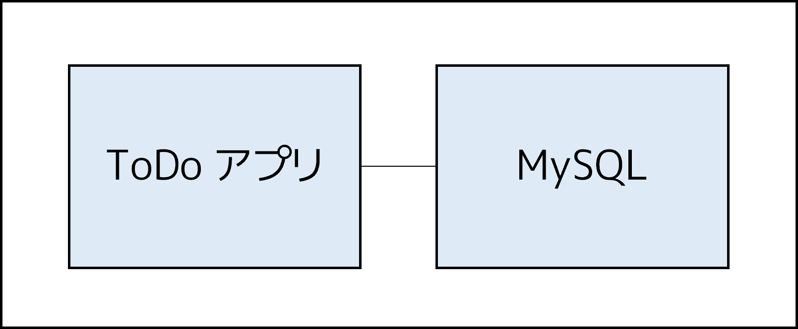

.. -*- coding: utf-8 -*-
.. URL: https://docs.docker.com/get-started/07_multi_container/
   doc version: 24.0
      https://github.com/docker/docker.github.io/blob/master/get-started/07_multi_container.md
.. check date: 2023/07/17
.. Commits on Jun 7, 2023 aee91fdaba9516d06db5b6b580e98f70a9a11c55
.. -----------------------------------------------------------------------------

.. Multi container apps
.. _multi-container-apps:

========================================
複数コンテナのアプリ
========================================

.. sidebar:: 目次

   .. contents:: 
       :depth: 2
       :local:

.. Up to this point, you’ve been working with single container apps. But, now you will add MySQL to the application stack. The following question often arises - “Where will MySQL run? Install it in the same container or run it separately?” In general, each container should do one thing and do it well. The following are a few reasons to run the container separately:

これまでは１つのコンテナでアプリを動かしていました。しかし、これからはアプリケーション スタックに MySQL を追加しようとしています。そうすると、たいてい次の疑問が沸き上がります。「どこで MySQL を実行するのですか？ 同じコンテナにインストールするのかな、それとも別々に実行するの？」と。通常、１つ１つのコンテナが、１つのことをしっかりと実行すべきです 。以下はコンテナを分けて実行する理由です。

..    There’s a good chance you’d have to scale APIs and front-ends differently than databases
    Separate containers let you version and update versions in isolation
    While you may use a container for the database locally, you may want to use a managed service for the database in production. You don’t want to ship your database engine with your app then.
    Running multiple processes will require a process manager (the container only starts one process), which adds complexity to container startup/shutdown

* データベースとは別に、 API とフロントエンドをスケールする良い機会
* コンテナを分けると、現在のバージョンと更新したバージョンを分離できる
* 今はローカルにあるデータベースをコンテナが使っているが、プロダクションではデータベースのマネージド サービスを利用したくなるかもしれない
* 複数のプロセスを実行するにはプロセスマネージャが必要であり（コンテナは１つのプロセスのみ起動するため）、コンテナの起動や停止が複雑になる

.. And there are more reasons. So, we will update our application to work like this:

ほかにも、いくつかの理由があります。それでは、下図のように動作するようアプリケーションを更新します。

.. Container networking
.. _container-networking:

コンテナのネットワーク機能
==============================

.. Remember that containers, by default, run in isolation and don’t know anything about other processes or containers on the same machine. So, how do you allow one container to talk to another? The answer is networking. If you place the two containers on the same network, they can talk to each other.

コンテナについて思い出しましょう。デフォルトでは、 :ruby:`孤立した状態 <in isolation>` で実行するため、同じマシン上の他のプロセスやコンテナを一切知りません。それでは、どのようにして他のコンテナと通信できるのでしょうか？ 答えは ネットワーク機能（ networking ）であり、お互いに通信可能になります。

.. Start MySQL
.. _start-mysql:

MySQL の起動
====================

.. There are two ways to put a container on a network:

コンテナをネットワークに加えるには2つの方法があります。

..  Assign the network when starting the container.
    Connect an already running container to a network.

* コンテナの起動時にネットワークを割り当てる
* 既に実行しているコンテナをネットワークに接続する

.. In the following steps, you’ll create the network first and then attach the MySQL container at startup.

以下の手順では、まずネットワークを作成し、それから MySQL コンテナの起動時に接続（アタッチ）します。

..    Create the network.

1. ネットワークを作成します。

   .. code-block:: bash
   
      $ docker network create todo-app

.. Start a MySQL container and attach it to the network. You’re also going to define a few environment variables that the database will use to initialize the database. To learn more about the MySQL environment variables, see the “Environment Variables” section in the MySQL Docker Hub listing.

2. MySQL コンテナを起動し、先ほどのネットワークに接続します。あわせて複数の環境変数を定義します。これは、データベースの初期化に使います。MySQL の環境変数について学ぶには、 `MySQL Docker Hub <https://hub.docker.com/_/mysql/>`_ にある「Environment Variables」セクションをご覧ください。

   **Mac / Linux**

      .. code-block:: bash
   
         $ docker run -d \
              --network todo-app --network-alias mysql \
              -v todo-mysql-data:/var/lib/mysql \
              -e MYSQL_ROOT_PASSWORD=secret \
              -e MYSQL_DATABASE=todos \
              mysql:8.0

   **Windows**

      Windows では PowerShell 上でコマンドを実行します。
      
      .. code-block:: bash
      

         $ docker run -d `
              --network todo-app --network-alias mysql `
              -v todo-mysql-data:/var/lib/mysql `
              -e MYSQL_ROOT_PASSWORD=secret `
              -e MYSQL_DATABASE=todos `
              mysql:8.0

   .. In the command above, you’ll see the --network-alias flag. In a later section, you’ll learn more about this flag.
   
   先ほどのコマンドでは、 ``--network-alias`` フラグも指定したのが見えるでしょう。こちらについては、後で触れます。

   .. tip::
   
      ここでは ``todo-mysql-data`` という名前のボリュームを使い、 MySQL が自身のデータを保管する ``/var/lib/mysql`` をマウントしているのに気づくでしょう。しかしまだ、 ``docker volume create`` コマンドを実行していません。名前付きボリュームを使おうとすると、 Docker が認識し、自動的にボリュームを作成します。

.. To confirm you have the database up and running, connect to the database and verify that it connects.

3. データベースが起動して実行中なのを確認するには、データベースに接続し、つながっているかを確認します。

   .. code-block:: bash
   
      $ docker exec -it <mysql-container-id> mysql -u root -p

   .. When the password prompt comes up, type in secret. In the MySQL shell, list the databases and verify you see the todos database.

   パスワードのプロンプトが表示されたら、 **secret** と入力します。 MySQL のシェル内では、データベース一覧を表示すると、 ``todo`` データベースの存在が確認できます。

   .. code-block:: bash
   
      mysql> SHOW DATABASES;

   .. You should see output that looks like this:

   このような出力が見えるでしょう。
   
   .. code-block:: bash
   
      +--------------------+
      | Database           |
      +--------------------+
      | information_schema |
      | mysql              |
      | performance_schema |
      | sys                |
      | todos              |
      +--------------------+
      5 rows in set (0.00 sec)

   .. Exit the MySQL shell to return to the shell on our machine.

4. MySQL シェルを終了し、マシン上のシェルに戻ります。

   .. code-block:: bash
   
      mysql> exit

.. You now have a todos database and it’s ready for you to use.

``todo`` データベースが手に入りましたので、いつでも使う準備が調いました。

.. Connect to MySQL
.. _connet-to-mysql:

MySQL に接続
====================

.. Now that you know MySQL is up and running, you can use it. But, how do you use it? If you run another container on the same network, how do you find the container? Remember that each container has its own IP address.

MySQL の起動と実行方法が分かりましたので、次は使います。しかし、どのように使うのでしょうか？ 同じネットワーク上に他のコンテナを実行したとして、どのようにして MySQL のコンテナを見つけられるのでしょうか？ 各コンテナは自身の IP アドレスを持つのを思い出してください。

.. To answer the questions above and better understand container networking, you’re going to make use of the nicolaka/netshoot container, which ships with a lot of tools that are useful for troubleshooting or debugging networking issues.

この疑問に答え、コンテナのネットワーク機能について良く理解するため、 `nicolaka/netshoot <https://github.com/nicolaka/netshoot>`_ コンテナを使います。これにはネットワーク機能の問題に対するトラブルシューティング（問題解決）やデバッグ（修正）に役立つツールがたくさん入っています。

..    Start a new container using the nicolaka/netshoot image. Make sure to connect it to the same network.

1. nicolaka/netshoot イメージを使う新しいコンテナを起動します。必ず同じネットワークに接続します。

   .. code-block:: bash
   
      $ docker run -it --network todo-app nicolaka/netshoot

.. Inside the container, you’re going to use the dig command, which is a useful DNS tool. You’re going to look up the IP address for the hostname mysql.

2. コンテナの中で、便利な DNS ツールの ``dig`` コマンドを使います。ホスト名 ``mysql`` の IP アドレスを調べましょう。

   .. code-block:: bash
   
      $ dig mysql

   .. You should get output like the following.

   次のような出力になります。

   .. code-block:: bash

      ; <<>> DiG 9.18.8 <<>> mysql
      ;; global options: +cmd
      ;; Got answer:
      ;; ->>HEADER<<- opcode: QUERY, status: NOERROR, id: 32162
      ;; flags: qr rd ra; QUERY: 1, ANSWER: 1, AUTHORITY: 0, ADDITIONAL: 0
      
      ;; QUESTION SECTION:
      ;mysql.				IN	A
      
      ;; ANSWER SECTION:
      mysql.			600	IN	A	172.23.0.2
      
      ;; Query time: 0 msec
      ;; SERVER: 127.0.0.11#53(127.0.0.11)
      ;; WHEN: Tue Oct 01 23:47:24 UTC 2019
      ;; MSG SIZE  rcvd: 44

   .. In the “ANSWER SECTION”, you will see an A record for mysql that resolves to 172.23.0.2 (your IP address will most likely have a different value). While mysql isn’t normally a valid hostname, Docker was able to resolve it to the IP address of the container that had that network alias. Remember, you used the --network-alias earlier.

   「ANSWER SECTION」に、 ``mysql`` の ``A`` レコードがあり、 ``172.23.0.2`` （おそらく似たような値が表示されているでしょう）に解決されているのが分かります。 ``mysql`` は通常のホスト名としては有効ではありませんが、 Docker はコンテナの IP アドレスをネットワーク エイリアスで調べられます。先ほど ``--network-alias`` フラグを使ったのを思い出してください。

   .. What this means is that your app only simply needs to connect to a host named mysql and it’ll talk to the database.

   これが意味するのは、アプリはシンプルにホスト名 ``mysql`` へ接続できればよいので、これでデータベースと通信できます。

.. Run your app with MySQL
.. run-your-app-with-mysql:

MySQL とアプリを動かす
==============================

.. The todo app supports the setting of a few environment variables to specify MySQL connection settings. They are:

MySQL への接続する設定を指定するため、todo アプリは環境変数の設定をサポートしています。

.. 
    MYSQL_HOST - the hostname for the running MySQL server
    MYSQL_USER - the username to use for the connection
    MYSQL_PASSWORD - the password to use for the connection
    MYSQL_DB - the database to use once connected

* ``MYSQL_HOST`` - MySQL サーバを実行中のホスト名
* ``MYSQL_USER`` - 接続に使うユーザ名
* ``MYSQL_PASSWORD`` - 接続に使うパスワード
* ``MYSQL_DB`` - 接続先として使うデータベース

..
    While using env vars to set connection settings is generally ok for development, it is HIGHLY DISCOURAGED when running applications in production. Diogo Monica, the former lead of security at Docker, wrote a fantastic blog post explaining why.
    A more secure mechanism is to use the secret support provided by your container orchestration framework. In most cases, these secrets are mounted as files in the running container. You’ll see many apps (including the MySQL image and the todo app) also support env vars with a _FILE suffix to point to a file containing the variable.
    As an example, setting the MYSQL_PASSWORD_FILE var will cause the app to use the contents of the referenced file as the connection password. Docker doesn’t do anything to support these env vars. Your app will need to know to look for the variable and get the file contents.

.. note::

   環境変数を使った接続設定は、開発環境であれば通常は問題ありませんが、本番環境でアプリケーションの実行時は **極めて推奨されません** 。Docker の正式セキュリティ :ruby:`リード <lead>` の Diogo Monica は、何故なのかを `素晴らしいブログ投稿を書き <https://diogomonica.com/2017/03/27/why-you-shouldnt-use-env-variables-for-secret-data/>`_ 説明しています。
   
   多くのセキュリティ機構は、コンテナ オーケストレーション フレームワークによって :ruby:`シークレット <secret>` のサポートを提供しています。ほとんどの場合、これらシークレットは、実行中のコンテナ内にファイルとしてマウントされます。多くのアプリケーションは（ MySQL イメージと todo アプリも含みます）、変数を含むファイルを示すため、 ``_FILE`` が末尾に付く環境変数もサポートしています。
   
   たとえば、 ``MYSQL_PASSWORD_FILE`` で設定した値は、アプリが接続用のパスワードとして、参照するファイルの内容を使いたいとします。ですが、Docker はこれらの環境変数を何らサポートしません。アプリ自身が変数を調べ、ファイル内容を取得する必要があります。

.. You can now start your dev-ready container.

それでは開発に対応したコンテナを起動します。

.. Specify each of the environment variables above, as well as connect the container to your app network. Make sure that you are in the getting-started/app directory when you run this command.

1. 先ほどの環境変数に加え、コンテナをアプリのネットワークに接続する指定をします。次のコマンドを実行する時は、 ``getting-started/app`` ディレクトリにいるのを確認します。

   **Mac / Linux**
   
      .. code-block:: bash
   
         $ docker run -dp 127.0.0.1:3000:3000 \
            -w /app -v "$(pwd):/app" \
            --network todo-app \
            -e MYSQL_HOST=mysql \
            -e MYSQL_USER=root \
            -e MYSQL_PASSWORD=secret \
            -e MYSQL_DB=todos \
            node:18-alpine \
            sh -c "yarn install && yarn run dev"

   **Windows**

      Windows では PowerShell 上コマンドを実行します。

      .. code-block:: bash

         $ docker run -dp 127.0.0.1:3000:3000 `
            -w /app -v "$(pwd):/app" `
            --network todo-app `
            -e MYSQL_HOST=mysql `
            -e MYSQL_USER=root `
            -e MYSQL_PASSWORD=secret `
            -e MYSQL_DB=todos `
            node:18-alpine `
            sh -c "yarn install && yarn run dev"

.. If you look at the logs for the container (docker logs -f <container-id>), you should see a message similar to the following, which indicates it’s using the mysql database.

2. コンテナのログを確認すると（ ``docker logs <container-id>`` ）、次のような mysql データベースの使用を示すメッセージが表示されるでしょう。

   .. code-block:: bash

      $ nodemon src/index.js
      [nodemon] 2.0.20
      [nodemon] to restart at any time, enter `rs`
      [nodemon] watching dir(s): *.*
      [nodemon] starting `node src/index.js`
      Connected to mysql db at host mysql
      Listening on port 3000

.. Open the app in your browser and add a few items to your todo list.

3. ブラウザでアプリを開き、todo リストにいくつかのアイテムを追加します。

.. Connect to the mysql database and prove that the items are being written to the database. Remember, the password is secret.

4. mysql データベースに接続し、アイテムがデータベースに書き込まれているのを確認します。思い出してください、パスワードは ``secret`` です。

   .. code-block:: bash

      $ docker exec -it <mysql-container-id> mysql -p todos

   .. And in the mysql shell, run the following:
   mysql シェルから、以下のように実行します。
   
   .. code-block:: bash

      mysql> select * from todo_items;
      +--------------------------------------+--------------------+-----------+
      | id                                   | name               | completed |
      +--------------------------------------+--------------------+-----------+
      | c906ff08-60e6-44e6-8f49-ed56a0853e85 | Do amazing things! |         0 |
      | 2912a79e-8486-4bc3-a4c5-460793a575ab | Be awesome!        |         0 |
      +--------------------------------------+--------------------+-----------+

   .. Your table will look different because it has your items. But, you should see them stored there.

   おそらく、アイテムが異なるため、表の見た目は違うでしょう。ですが、そこに保管されているのが見えます。

.. Next steps
.. _part7-next-steps:

次のステップ
====================

.. At this point, you have an application that now stores its data in an external database running in a separate container. You learned a little bit about container networking and service discovery using DNS.

これで、別のコンテナで実行中の外部データベースに、アプリケーションは新しいデータを保管できるようになりました。コンテナのネットワーク機能と DNS を使ったサービス ディスカバリを少々学びました。

.. But, there’s a good chance you are starting to feel a little overwhelmed with everything you need to do to start up this application. We have to create a network, start containers, specify all of the environment variables, expose ports, and more! That’s a lot to remember and it’s certainly making things harder to pass along to someone else.

しかし、このアプリケーションを起動するための全てに対し、少々の圧倒を感じ始めているのではないでしょうか。行ったのは、ネットワークを作成し、コンテナを起動し、全ての環境変数を指定し、ポートを公開する等々です！ 覚えることが多すぎますし、誰かに正確に伝えるのは大変です。

.. In the next section, you’ll learn about Docker Compose. With Docker Compose, you can share your application stacks in a much easier way and let others spin them up with a single, simple command.

次のセクションでは、 Docker Compose について説明します。 Docker Compose があれば、より簡単な方法でアプリケーション スタックを共有でき、他の人もコマンドを１つ、かつシンプルに実行するだけで、アプリを速攻で立ち上げられます。

* :doc:`Docker Compose を使う <08_using_compose>`

.. seealso::

   Part 7: Multi container app
      https://docs.docker.com/get-started/07_multi_container/

