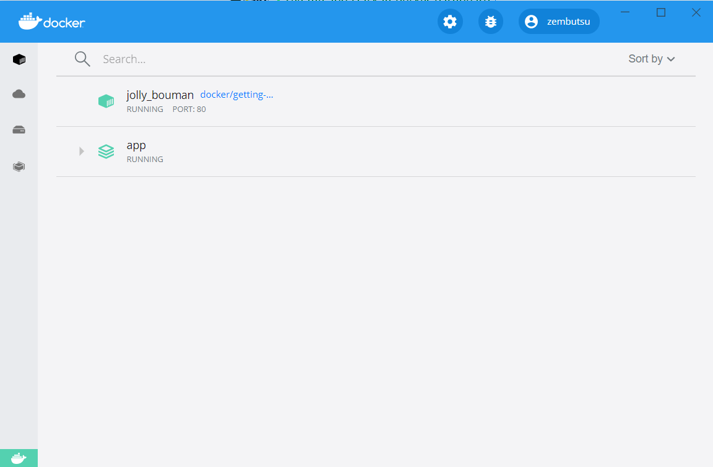
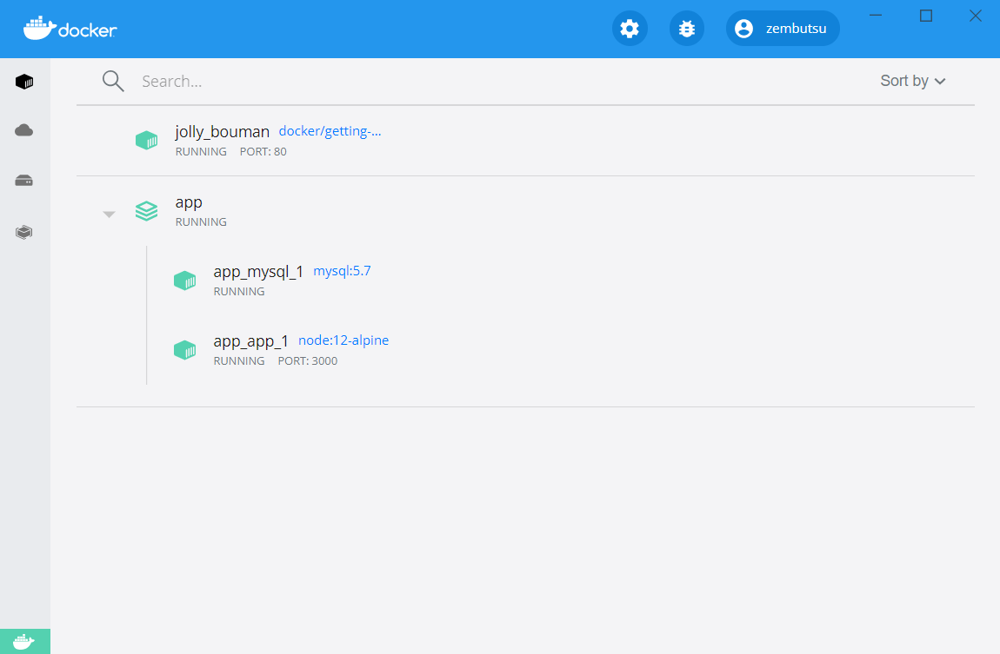

.. -*- coding: utf-8 -*-
.. URL: https://docs.docker.com/get-started/08_using_compose/
   doc version: 20.10
      https://github.com/docker/docker.github.io/blob/master/get-started/08_using_compose.md
.. check date: 2022/09/20
.. Commits on Jun 28, 2022 fd9fe19061121287e75faebf973a3e1546f71190
.. -----------------------------------------------------------------------------

.. Use Docker Compose
.. _use-docker-compose:

========================================
Docker Compose を使う
========================================

.. sidebar:: 目次

   .. contents:: 
       :depth: 2
       :local:

.. Docker Compose is a tool that was developed to help define and share multi-container applications. With Compose, we can create a YAML file to define the services and with a single command, can spin everything up or tear it all down.

:doc:`Docker Compose </compose/index>` とは、複数コンテナのアプリケーションを定義・共有するために役立つように、開発されたツールです。Compose があれば、サービスを定義する YAML ファイルを作成し、コマンドを１つ実行するだけで、瞬時にすべて立ち上げたり、すべて解体できます。

.. The big advantage of using Compose is you can define your application stack in a file, keep it at the root of your project repo (it’s now version controlled), and easily enable someone else to contribute to your project. Someone would only need to clone your repo and start the compose app. In fact, you might see quite a few projects on GitHub/GitLab doing exactly this now.

Compose を使う「大きな」利点は、アプリケーション スタックをファイルに定義し、プロジェクト用リポジトリの一番上に置けるため（これでバージョン管理できます）、プロジェクトに貢献しようとしている誰もが簡単に利用できます。誰もが必要なのは、リポジトリをクローンし、それから :ruby:構成された <compose>` アプリを起動するだけです。実際、 GitHub や GitLab 上のプロジェクトで既に見かけているもしれません。

.. So, how do we get started?

それでは、どのようにして使い始めるのでしょうか？

.. Install Docker Compose
.. _install-docker-compose:

Docker Compose のインストール
==============================

.. If you installed Docker Desktop/Toolbox for either Windows or Mac, you already have Docker Compose! Play-with-Docker instances already have Docker Compose installed as well. If you are on a Linux machine, you will need to install Docker Compose.

Window や Mac で、 Docker Desktop または Toolbox をインストール済みであれば、Docker Compose が入っています！ Play-wih-Docker インスタンスも、同様に Docker Compose がインストール済みです。Linux マシンを使う場合は、 :doc:`Docker Compose のインストール </compose/install/index>` が必要です。

.. After installation, you should be able to run the following and see version information.

インストール後は、以下のように実行できるようになり、バージョン情報が表示されます。

.. code-block:: bash

   $ docker-compose version

.. Create the Compose file
.. _create-the-compose-file:

Compose ファイルの作成
==============================

..    At the root of the app project, create a file named docker-compose.yml.

1. アプリプロジェクトのルートで、 ``docker-compose.yml`` という名前のファイルを作成します。

..    In the compose file, we’ll start off by defining the schema version. In most cases, it’s best to use the latest supported version. You can look at the Compose file reference for the current schema versions and the compatibility matrix.

2. この compose ファイル内では、 :ruby:`スキーマ バージョン <schema version>` の定義から書き始めます。ほとんどの場合、サポートされている最新バージョンを使うのが一番良いでしょう。現時点のスキーマ バージョンと互換表については :doc:`Compose ファイル リファレンス </compose/compose-file>` をご覧ください。

   .. code-block:: yaml

      version: "3.7"

..     Next, we’ll define the list of services (or containers) we want to run as part of our application.

3. 次に、アプリケーションの一部として実行したいサービス（またはコンテナ）一覧を定義します。

   .. code-block:: yaml

      version: "3.7"
      
      services:

.. And now, we’ll start migrating a service at a time into the compose file.

それでは、 compose ファイルへ、サービスを一気に移行しましょう。

.. Define the app service
.. _define-the-app-service:

アプリのサービス定義
====================

.. To remember, this was the command we were using to define our app container.

覚えていますか、以下はアプリ用コンテナの定義に使ったコマンドです。

.. code-block:: bash

   $ docker run -dp 3000:3000 \
     -w /app -v "$(pwd):/app" \
     --network todo-app \
     -e MYSQL_HOST=mysql \
     -e MYSQL_USER=root \
     -e MYSQL_PASSWORD=secret \
     -e MYSQL_DB=todos \
     node:18-alpine \
     sh -c "yarn install && yarn run dev"

PowerShell の場合は、こちらのコマンドを使っていました。

.. code-block:: bash

   PS> docker run -dp 3000:3000 `
     -w /app -v "$(pwd):/app" `
     --network todo-app `
     -e MYSQL_HOST=mysql `
     -e MYSQL_USER=root `
     -e MYSQL_PASSWORD=secret `
     -e MYSQL_DB=todos `
     node:18-alpine `
     sh -c "yarn install && yarn run dev"

.. First, let’s define the service entry and the image for the container. We can pick any name for the service. The name will automatically become a network alias, which will be useful when defining our MySQL service.

1. はじめに、サービスのエントリとコンテナ用のイメージを定義しましょう。サービスには様々な名前を選べます。この名前が、自動的にネットワーク エイリアスとなり、MySQL サービスの定義時に役立ちます。

   .. code-block:: yaml

      version: "3.7"
      
      services:
        app:
          image: node:18-alpine

.. Typically, you will see the command close to the image definition, although there is no requirement on ordering. So, let’s go ahead and move that into our file.

2. 通常、 ``image`` 定義の近くに ``command`` がありますが、順番は無関係です。それでは、ファイルを先へと進めましょう。

   .. code-block:: yaml

      version: "3.7"
      
      services:
        app:
          image: node:18-alpine
          command: sh -c "yarn install && yarn run dev"

.. Let’s migrate the -p 3000:3000 part of the command by defining the ports for the service. We will use the short syntax here, but there is also a more verbose long syntax available as well.

3. コマンドの ``-p 3000:3000`` を移行するには、サービス用の ``ports`` を定義しましょう。ここでは :ref:`短い構文 <compose-file-v3-ports-short>` を使いますが、より細かな :ref:`長い構文 <compose-file-v3-ports-long>` も同様に使えます。

   .. code-block:: bash

      version: "3.7"
      
      services:
        app:
          image: node:18-alpine
          command: sh -c "yarn install && yarn run dev"
          ports:
            - 3000:3000

.. Next, we’ll migrate both the working directory (-w /app) and the volume mapping (-v "$(pwd):/app") by using the working_dir and volumes definitions. Volumes also has a short and long syntax.

4. 次に、作業ディレクトリ（ ``-w /app`` ）とボリュームの :ruby:`割り当て <mapping>` （ ``-v "$(pwd):/app"`` ）の両方を移行するため、 ``working_dir`` と ``volumes`` 定義を使います。ボリュームも :ref:`短い構文 <compose-file-v3-volumes-short-syntax>` と :ref:`長い構文 <compose-file-v3-volumes-long-syntax>` があります。

   .. One advantage of Docker Compose volume definitions is we can use relative paths from the current directory.

   Docker Compose でボリューム定義を使う利点の１つは、現在のディレクトリからの相対パスが使える点です。

.. code-block:: yaml

      version: "3.7"
      
      services:
        app:
          image: node:18-alpine
          command: sh -c "yarn install && yarn run dev"
          ports:
            - 3000:3000
          working_dir: /app
          volumes:
            - ./:/app

.. Finally, we need to migrate the environment variable definitions using the environment key.

5. 最後は、 ``environment`` キーを使って環境変数の定義を移行する必要があります。

.. code-block:: yaml

      version: "3.7"
      
      services:
        app:
          image: node:18-alpine
          command: sh -c "yarn install && yarn run dev"
          ports:
            - 3000:3000
          working_dir: /app
          volumes:
            - ./:/app
          environment:
            MYSQL_HOST: mysql
            MYSQL_USER: root
            MYSQL_PASSWORD: secret
            MYSQL_DB: todos

.. Define the MySQL service
.. _define-the-mysql-service:

MySQL サービスの定義
====================

.. Now, it’s time to define the MySQL service. The command that we used for that container was the following:

それでは、 MySQL サービスを定義しましょう。先ほどコンテナを使うために実行したコマンドが、こちらです。

.. code-block:: bash

   $ docker run -d \
     --network todo-app --network-alias mysql \
     -v todo-mysql-data:/var/lib/mysql \
     -e MYSQL_ROOT_PASSWORD=secret \
     -e MYSQL_DATABASE=todos \
     mysql:5.7

.. If you are using PowerShell then use this command:

PowerShell の場合は、以下のコマンドを使います。

.. code-block:: bash

   PS> docker run -d `
     --network todo-app --network-alias mysql `
     -v todo-mysql-data:/var/lib/mysql `
     -e MYSQL_ROOT_PASSWORD=secret `
     -e MYSQL_DATABASE=todos `
     mysql:5.7

.. We will first define the new service and name it mysql so it automatically gets the network alias. We’ll go ahead and specify the image to use as well.

1. まず新しいサービスと、その名前を ``mysql`` と定義すると、ネットワーク エイリアスも自動的に得られます。次に進み、使用するイメージも同様に定義します。

   .. code-block:: bash

      version: "3.7"
      
      services:
        app:
          # The app service definition
        mysql:
          image: mysql:5.7

.. Next, we’ll define the volume mapping. When we ran the container with docker run, the named volume was created automatically. However, that doesn’t happen when running with Compose. We need to define the volume in the top-level volumes: section and then specify the mountpoint in the service config. By simply providing only the volume name, the default options are used. There are many more options available though.

2. 次に、ボリューム :ruby:`割り当て <mapping>` を定義します。 ``docker run`` でコンテナを実行した時は、 :ruby:`名前付きボリューム <named volume>` が自動的に作成されました。ですが、 Compose の実行時には、そのようになりません。トップレベルの ``volume:`` セクションでボリュームを定義する必要があり、さらに、サービス設定でもマウントポイントの指定が必要です。単にボリューム名だけを指定すると、デフォルトのオプションが使われます。他にもさらに :ruby:`多くの利用可能なオプション <compose-file-v3-volume-configuration-reference>` があります。

   .. code-block:: yalm

      version: "3.7"
      
      services:
        app:
          # The app service definition
        mysql:
          image: mysql:5.7
          volumes:
            - todo-mysql-data:/var/lib/mysql
      
      volumes:
        todo-mysql-data:

.. Finally, we only need to specify the environment variables.

3. さいごに、環境変数のみを指定する必要があります。

   .. code-block:: bash

      version: "3.7"
      
      services:
        app:
          # The app service definition
        mysql:
          image: mysql:5.7
          volumes:
            - todo-mysql-data:/var/lib/mysql
          environment:
            MYSQL_ROOT_PASSWORD: secret
            MYSQL_DATABASE: todos
      
      volumes:
        todo-mysql-data:

.. At this point, our complete docker-compose.yml should look like this:

これで、 ``docker-compose.yml`` の全体は、このようになっているでしょう。

.. code-block:: yaml

   version: "3.7"
   
   services:
     app:
       image: node:18-alpine
       command: sh -c "yarn install && yarn run dev"
       ports:
         - 3000:3000
       working_dir: /app
       volumes:
         - ./:/app
       environment:
         MYSQL_HOST: mysql
         MYSQL_USER: root
         MYSQL_PASSWORD: secret
         MYSQL_DB: todos
   
     mysql:
       image: mysql:5.7
       volumes:
         - todo-mysql-data:/var/lib/mysql
       environment:
         MYSQL_ROOT_PASSWORD: secret
         MYSQL_DATABASE: todos
   
   volumes:
     todo-mysql-data:

.. Run the application stack
.. _run-the-application-stack:

アプリケーション スタックの実行
========================================

.. Now that we have our docker-compose.yml file, we can start it up!

ようやく ``docker-compose.yml`` ファイルの準備ができましたので、これで起動できます！

..    Make sure no other copies of the app/db are running first (docker ps and docker rm -f <ids>).

1. まず、app や db のコピーが確実に停止しているのを確認します（ ``docker ps`` を実行してから、 ``docker rm -f <ids>`` を実行 ）。

..    Start up the application stack using the docker-compose up command. We’ll add the -d flag to run everything in the background.

2. アプリケーション スタックを起動するため、 ``docker-compose up`` コマンドを使います。バックグランドですべてを実行するため、 ``-d`` フラグを追加します。

   .. code-block:: bash

      $ docker-compose up -d

   .. When we run this, we should see output like this:

   実行すると、次のような出力が見えます。

   .. code-block:: bash

      Creating network "app_default" with the default driver
      Creating volume "app_todo-mysql-data" with default driver
      Creating app_app_1   ... done
      Creating app_mysql_1 ... done

   .. You’ll notice that the volume was created as well as a network! By default, Docker Compose automatically creates a network specifically for the application stack (which is why we didn’t define one in the compose file).

   ボリュームと同時にネットワークも作成されたのが分かるでしょう！ デフォルトでは、 Docker Compose はアプリケーション スタックに指定したネットワークを自動的に作成します（そのため、 compose ファイル内にネットワークを定義しませんでした）。

.. Let’s look at the logs using the docker-compose logs -f command. You’ll see the logs from each of the services interleaved into a single stream. This is incredibly useful when you want to watch for timing-related issues. The -f flag “follows” the log, so will give you live output as it’s generated.

3. ログを調べるため、 ``docker-compose logs -f`` コマンドを使います。１つの流れの中に、各サービスのログが相互に見えるでしょう。これは、タイミングに関連する問題を監視したい場合に、とても役立ちます。 ``-f`` フラグはログを「 :ruby:`フォロー <follow>` 」（追跡）しますので、生成されたログはリアルタイムに表示され続けます。

   .. If you have run the command already, you’ll see output that looks like this:

   コマンドが実行済みであれば、このような出力になっているでしょう。

   .. code-block:: bash

      mysql_1  | 2019-10-03T03:07:16.083639Z 0 [Note] mysqld: ready for connections.
      mysql_1  | Version: '5.7.27'  socket: '/var/run/mysqld/mysqld.sock'  port: 3306  MySQL Community Server (GPL)
      app_1    | Connected to mysql db at host mysql
      app_1    | Listening on port 3000

   .. The service name is displayed at the beginning of the line (often colored) to help distinguish messages. If you want to view the logs for a specific service, you can add the service name to the end of the logs command (for example, docker-compose logs -f app).

   サービス名が行の始めに（たいてい色が付いて）表示されているため、メッセージの識別に役立ちます。特定のサービスに対するログを表示したい場合は、ログコマンドの最後にサービス名を追加できます（例： ``docker-compose logs -f app`` ）。

   ..    Tip: Waiting for the DB before starting the app
       When the app is starting up, it actually sits and waits for MySQL to be up and ready before trying to connect to it. Docker doesn’t have any built-in support to wait for another container to be fully up, running, and ready before starting another container. For Node-based projects, you can use the wait-port dependency. Similar projects exist for other languages/frameworks.

   .. tips::
   
      **アプリが開始するまで DB は待機**
      
      アプリの起動時、MySQL が起動して接続する準備が調うまで、実際には待機します。Docker には、あるコンテナが起動する前に、他のコンテナが完全に起動し、実行中であり、待機中になるまで待つような機能を内蔵していません。Node ベースのプロジェクトでは、依存関係に `wait-port <https://github.com/dwmkerr/wait-port>`_ が使えます。他の言語やフレームワークでも似たようなプロジェクトがあります。

.. At this point, you should be able to open your app and see it running. And hey! We’re down to a single command!

4. これでアプリが開けるようになり、実行中だと分かります。そして、どうでしょう！ たった１つのコマンドでできました！

.. See the app stack in Docker Dashboard
.. _see-the-app-stack-in-docker-dashboard:

Docker ダッシュボードでアプリのスタックを表示
==================================================

.. If we look at the Docker Dashboard, we’ll see that there is a group named app. This is the “project name” from Docker Compose and used to group the containers together. By default, the project name is simply the name of the directory that the docker-compose.yml was located in.

Docker ダッシュボードを見ると、 **app** という名前のグループが見えます。これは Docker Compose による「プロジェクト名」で、同じグループのコンテナに対して使われます。デフォルトでは、プロジェクト名はシンプルに ``docker-compose.yaml`` が置かれているディレクトリ名です。

.. If you twirl down the app, you will see the two containers we defined in the compose file. The names are also a little more descriptive, as they follow the pattern of <service-name>-<replica-number>. So, it’s very easy to quickly see what container is our app and which container is the mysql database.

app の▶マークをクリックして展開すると、compose ファイルで定義した２つのコンテナが見えます。コンテナ名も説明的になり、 ``<サービス名>-<レプリカ数>`` のパターンに従います。そのため、どのコンテナがアプリで、どのコンテナが mysql データベースなのかを、素早く見つけるのが簡単になります。

.. Tear it all down
.. _tear-it-all-down:

全てを削除
==========

.. When you’re ready to tear it all down, simply run docker-compose down or hit the trash can on the Docker Dashboard for the entire app. The containers will stop and the network will be removed.

すべてを解体（終了および削除）する準備が調えば、シンプルに ``docker-compose down`` を実行するか、Docker ダッシュボード上でアプリ全体のゴミ箱をクリックします。コンテナは停止され、ネットワークも削除されます。

..    Warning
    Removing Volumes
    By default, named volumes in your compose file are NOT removed when running docker-compose down. If you want to remove the volumes, you will need to add the --volumes flag.
    The Docker Dashboard does not remove volumes when you delete the app stack.

.. warning::

   **ボリュームの削除**
   
   デフォルトでは、compose ファイルの名前付きボリュームは ``docker-compose down`` の実行では削除「されません」。ボリュームも削除したい場合は、 ``--volumes`` フラグも追加する必要があります。
   
   Docker ダッシュボードではアプリのスタックを削除しても、ボリュームは削除「されません」。

.. Once torn down, you can switch to another project, run docker-compose up and be ready to contribute to that project! It really doesn’t get much simpler than that!

解体が終われば、他のプロジェクトに切り替えができ、 ``docker-compose up`` を実行すると、そのプロジェクトに貢献する準備が調います！ これ以上、本当にシンプルなことはありません！

.. Recap
.. _part8-recap:

まとめ
==========

.. In this section, we learned about Docker Compose and how it helps us dramatically simplify the defining and sharing of multi-service applications. We created a Compose file by translating the commands we were using into the appropriate compose format.

このセクションでは、 Docker Compose について学びました。 Docker Compose があれば、複数のサービスがあるアプリケーションの定義と共有が、劇的に簡単にするのに役立ちます。また、実行していたコマンドを適切な compose 形式へ変換し、 Compose ファイルを作成しました。

.. At this point, we’re starting to wrap up the tutorial. However, there are a few best practices about image building we want to cover, as there is a big issue with the Dockerfile we’ve been using. So, let’s take a look!

これで、チュートリアルの仕上げに入りましょう。その前に、イメージの構築に関するいくつかのベストプラクティスについて扱いたいと思います。これまで使っていた Dockerfile には大きな問題があるためです。それでは見てみましょう！

.. seealso::

   Use Docker Compose
      https://docs.docker.com/get-started/08_using_compose/

