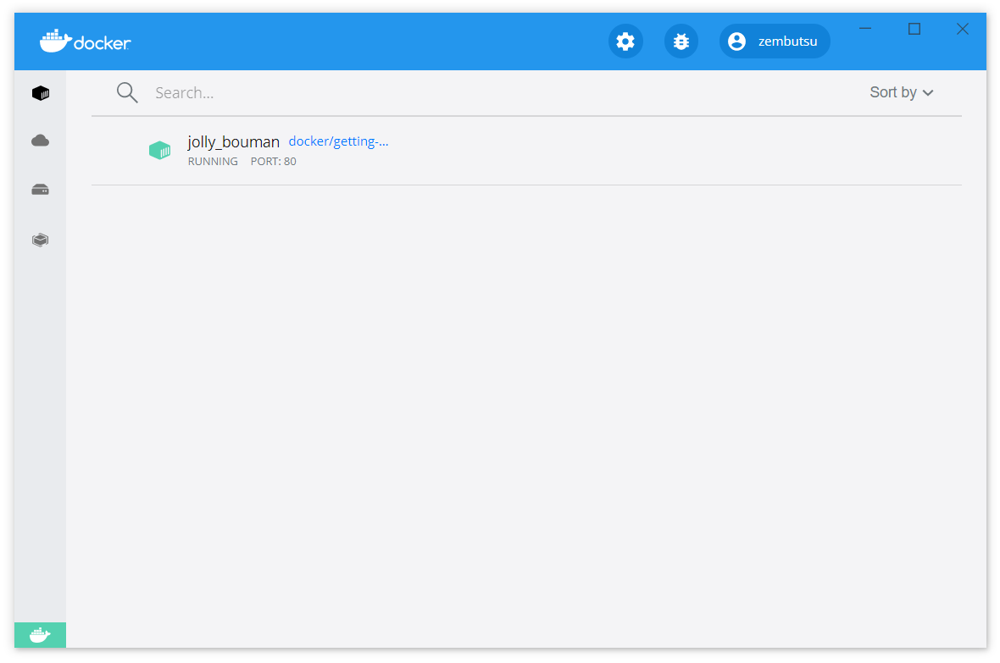

.. -*- coding: utf-8 -*-
.. URL: https://docs.docker.com/get-started/
   doc version: 20.10
      https://github.com/docker/docker.github.io/blob/master/get-started/index.md
.. check date: 2022/04/09
.. Commits on Jan 18, 2022 fd943a6ab937adc65007fe654fcc9d8e58efd8fe
.. -----------------------------------------------------------------------------

.. Get Started, Part 1: Orientation and Setup

========================================
Part 1：概要説明とセットアップ
========================================

.. 
    Update to the Docker Desktop terms
    Commercial use of Docker Desktop in larger enterprises (more than 250 employees OR more than $10 million USD in annual revenue) now requires a paid subscription. The grace period for those that will require a paid subscription ends on January 31, 2022. Learn more.

.. important:: **Docker Desktop の利用条件変更**

   現在、大企業（従業員が 251 人以上、または、年間収入が 1,000 万米ドル以上 ）における Docker Desktop の商用利用には、有料サブスクリプション契約が必要です。必要な有料サブスクリプションの支払猶予は 2022 年 1 月 31 日に終了しました。 `詳細はこちらです。 <https://www.docker.com/blog/the-grace-period-for-the-docker-subscription-service-agreement-ends-soon-heres-what-you-need-to-know/>`_

.. sidebar:: 目次

   .. contents:: 
       :depth: 2
       :local:

.. Welcome! We are excited that you want to learn Docker.

ようこそ！ 皆さんが Docker を学ぼうとしており、私たちは嬉しく思います。

.. This page contains step-by-step instructions on how to get started with Docker. In this tutorial, you’ll learn how to:

このページでは段階的な手順に従って、Docker の始め方を学びます。このチュートリアルで、以下の内容を学べます。

..
    Build and run an image as a container
    Share images using Docker Hub
    Deploy Docker applications using multiple containers with a database
    Running applications using Docker Compose

* コンテナとして、イメージの構築と実行
* Docker Hub を使ったイメージ共有
* データベースがある複数のコンテナを使う Docker アプリケーションをデプロイ
* Docker Compose を使ってアプリケーションを実行

.. In addition, you’ll also learn about the best practices for building images, including instructions on how to scan your images for security vulnerabilities.

さらに、イメージ構築のベストプラクティスも学べます。これには、イメージのセキュリティ脆弱性を調べる（スキャンする）手順も含みます。

.. If you are looking for information on how to containerize an application using your favorite language, see Language-specific getting started guides.

好きな言語を使用しているアプリケーションを、コンテナ化する方法の情報を探している場合は、 :doc:`言語ごとの導入ガイド </language/overview>` をご覧ください。

.. We also recommend the video walkthrough from Dockercon 2020.

また、 Dockercon 2020 の映像を見るのも推奨します。

.. image:: ./images/get-started.png
   :scale: 60%
   :target: https://www.youtube.com/watch?v=iqqDU2crIEQ&t=30s

.. Download and install Docker
.. _download-and-install-docker:
Docker のダウンロードとインストール
========================================

.. This tutorial assumes you have a current version of Docker installed on your machine. If you do not have Docker installed, choose your preferred operating system below to download Docker:

このチュートリアルでは、みなさんのマシン上に Docker の現行バージョンをインストールしている状態を想定しています。もしも Docker をインストールしていなければ、以下から適切なオペレーティングシステムを選び、 Docker をダウンロードしてください。

* `Intel 製チップの Mac <https://desktop.docker.com/mac/main/amd64/Docker.dmg?utm_source=docker&utm_medium=webreferral&utm_campaign=docs-driven-download-mac-amd64>`_ 
* `Apple 製チップの Mac <https://desktop.docker.com/mac/main/arm64/Docker.dmg?utm_source=docker&utm_medium=webreferral&utm_campaign=docs-driven-download-mac-arm64>`_ 
* `Windows <https://desktop.docker.com/win/main/amd64/Docker%20Desktop%20Installer.exe?utm_source=docker&utm_medium=webreferral&utm_campaign=docs-driven-download-win-amd64>`_ 
* :doc:`Linux </engine/install>`

.. For Docker Desktop installation instructions, see Install Docker Desktop on Mac and Install Docker Desktop on Windows.

Docker Desktop のインストール手順は、 :doc:`Mac に Docker Desktop をインストール </desktop/mac/install>` と :doc:`Windows に Docker Desktop をインストール </desktop/windows/install>` をご覧ください。

.. Start the tutorial
.. _start-the-tutorial:
チュートリアルの開始
====================

.. If you’ve already run the command to get started with the tutorial, congratulations! If not, open a command prompt or bash window, and run the command:

もう既にチュートリアルでコマンドを実行していたら、おめでとう！ そうでなければ、コマンドプロンプトか bash ウインドウを開き、コマンドを実行しましょう。

.. code-block:: bash

   $ docker run -d -p 80:80 docker/getting-started

.. You’ll notice a few flags being used. Here’s some more info on them:

いくつかのフラグが使われているのに気づくでしょう。それらの詳しい情報は、こちらです。

.. 
    -d - run the container in detached mode (in the background)
    -p 80:80 - map port 80 of the host to port 80 in the container
    docker/getting-started - the image to use

* ``-d`` - コンテナを :ruby:`デタッチド・モード <detached mode>` （バックグランドの処理）で :ruby:`実行 <run>`
* ``-p 80:80`` - コンテナ内のポート 80 に対し、ホスト上のポート 80 を割り当てる（ :ruby:`マップ <map>` する）
* ``docker/getting-started`` - 使用するイメージ

.. Tip
   You can combine single character flags to shorten the full command. As an example, the command above could be written as:

.. tip::

   コマンド全体を短くするために、1文字のフラグは連結できます。例として、先ほどのコマンドは、このように書き換えられます。
   
   .. code-block:: bash
   
      $ docker run -dp 80:80 docker/getting-started

.. The Docker Dashboard
.. _the-docker-dashboard:
Docker ダッシュボード
==============================

.. Before going too far, we want to highlight the Docker Dashboard, which gives you a quick view of the containers running on your machine. The Docker Dashboard is available for Mac and Windows. It gives you quick access to container logs, lets you get a shell inside the container, and lets you easily manage container lifecycle (stop, remove, etc.).

遠くへと進む前に、 Docker ダッシュボードに焦点をあて、マシン上でのコンテナ実行について素早く目を通したいと思います。Docker ダッシュボードは Mac と Windows で利用できます。これを使えばコンテナのログに素早くアクセスでき、コンテナ内でシェルが操作でき、コンテナのライフサイクル（停止、削除、等）の管理が簡単になります。

.. To access the dashboard, follow the instructions in the Docker Desktop manual. If you open the dashboard now, you will see this tutorial running! The container name (jolly_bouman below) is a randomly created name. So, you’ll most likely have a different name.

ダッシュボードにアクセスするには、 :doc:`Docker デスクトップのマニュアル </desktop/dashboard>` にある手順に従ってください。ダッシュボードを開いたら、このチュートリアルで実行しているように見えるでしょう。コンテナ名（ ``jolly_bouman`` ）はランダムに作成されます。そのため、以下の画像とは名前が異なるでしょう。

.. What is a container?
.. _what-is-a-container:
コンテナとは何？
====================

.. Now that you’ve run a container, what is a container? Simply put, a container is a sandboxed process on your machine that is isolated from all other processes on the host machine. That isolation leverages kernel namespaces and cgroups, features that have been in Linux for a long time. Docker has worked to make these capabilities approachable and easy to use. To summarize, a container:

それでは、コンテナを実行するのですが、コンテナとは何でしょうか？ 簡単に言えば、コンテナとはマシン上でサンドボックス化したプロセスであり、ホストマシン上にある他すべてのプロセスから :ruby:`隔離 <isolate>` されています。この隔離とは `カーネルの名前空間と cgroup <https://medium.com/@saschagrunert/demystifying-containers-part-i-kernel-space-2c53d6979504>`_ の活用であり、長らく Linux に存在する機能です。Docker はこれらの :ruby:`能力 <capability>` を、分かりやすく簡単に使えるようにします。まとめると、コンテナとは：

..    is a runnable instance of an image. You can create, start, stop, move, or delete a container using the DockerAPI or CLI.
    can be run on local machines, virtual machines or deployed to the cloud.
    is portable (can be run on any OS)
    Containers are isolated from each other and run their own software, binaries, and configurations.

* 実行可能なイメージの :ruby:`実体 <instance>` 。Docker API や CLI を使ってコンテナの作成、開始、停止、移動、削除ができます。
* ローカルマシン上や、仮想マシン上えも実行でき、クラウドにもデプロイできます。
* :ruby:`可搬性 <portability>` があります（多くの OS で実行可能です）。
* コンテナはお互いに隔離され、それぞれが自身のソフトウェア、バイナリ、設定を使って実行します。

.. note:: **ゼロからコンテナを作成するには**

   コンテナをゼロから構築する方法を知りたければ、 Aqua Security の Liz Rice による素晴らしいトークがあります。彼女は go でゼロからコンテナを作成します。トークではネットワーク機能や、ファイルシステム用のイメージの使い方、その他の高度なトピックを扱いません。ですが、コンテナの作り方について、非常に素晴らしく深く掘り下げています。

   .. image:: ./images/get-started2.png
      :scale: 60%
      :target: https://www.youtube.com/watch?v=8fi7uSYlOdc&t=1s

.. What is a container image?
.. _what-is-a-container-image:
コンテナ・イメージとは何でしょうか？
========================================

.. When running a container, it uses an isolated filesystem. This custom filesystem is provided by a container image. Since the image contains the container’s filesystem, it must contain everything needed to run an application - all dependencies, configuration, scripts, binaries, etc. The image also contains other configuration for the container, such as environment variables, a default command to run, and other metadata.

コンテナの実行時、コンテナは隔離されたファイルシステムを使います。この特別なファイルシステムは **コンテナ・イメージ** によって提供されます。イメージにはコンテナのファイルシステムも含みますので、アプリケーションを実行するために必要な全てを含む必要があります。たとえば、全ての依存関係、設定、スクリプト、バイナリ等です。また、このイメージには環境変数、デフォルトで実行するコマンド、メタデータのような、他の設定も含みます。

.. We’ll dive deeper into images later on, covering topics such as layering, best practices, and more.

イメージに関する深掘りは、後のレイヤ化、ベストプラクティス等のトピックで扱います。

..    Info
    If you’re familiar with chroot, think of a container as an extended version of chroot. The filesystem is simply coming from the image. But, a container adds additional isolation not available when simply using chroot.

.. info::

   ``chroot`` を熟知していれば、コンテナとは ``chroot`` の拡張バージョンと考えてみましょう。ファイルシステムとは、単にイメージから由来します。ですが、コンテナの場合は、単純に chroot の使用ではできない付加的な隔離を追加します。

.. CLI references
CLI リファレンス
====================

.. Refer to the following topics for further documentation on all CLI commands used in this article:

この節で扱う全ての CLI コマンドに関する詳しいドキュメントは、以下のトピックをご覧ください。

* :doc:`docker verion </engine/reference/commandline/version>`
* :doc:`docker run </engine/reference/commandline/run>`
* :doc:`docker image </engine/reference/commandline/image>`
* :doc:`docker container </engine/reference/commandline/container>`

.. seealso::

   Orientation and setup
      https://docs.docker.com/get-started/

