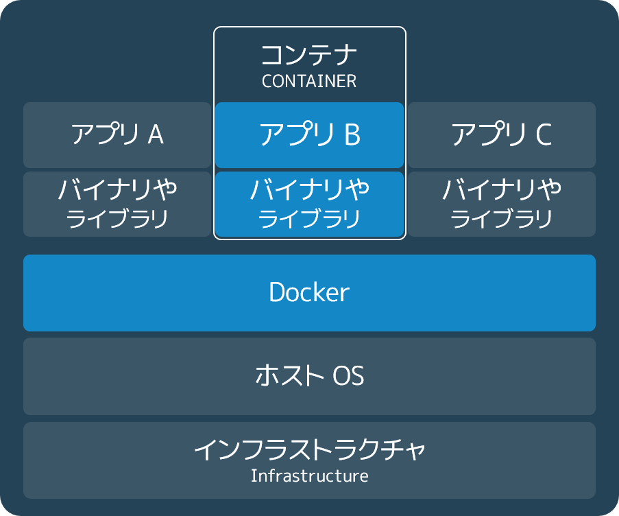

.. -*- coding: utf-8 -*-
.. URL: https://docs.docker.com/get-started/
   doc version: 17.06
      https://github.com/docker/docker.github.io/blob/master/get-started/index.md
.. check date: 2017/09/02
.. Commits on Aug 27, 2017 4445f27581bd2d190ecd69b6ca31b8dc04b2b9e3
.. -----------------------------------------------------------------------------

.. Get Started, Part 1: Orientation and Setup

========================================
Part 1：概要説明とセットアップ
========================================

.. sidebar:: 目次

   .. contents:: 
       :depth: 2
       :local:

.. Welcome! We are excited you want to learn how to use Docker.

ようこそ！ 皆さんが Docker の使い方を学ぼうとしており、私たちは嬉しく思います。

.. In this six-part tutorial, you will:

このチュートリアルは６つのパートで構成されています。

..    Get set up and oriented, on this page.
    Build and run your first app
    Turn your app into a scaling service
    Span your service across multiple machines
    Add a visitor counter that persists data
    Deploy your swarm to production

1. セットアップと概要説明、このページです。
2. :doc:`初めてのアプリを構築・実行 <part2>` 
3. :doc:`アプリをスケールするサービスに変える <part3>` 
4. :doc:`複数のマシンにまたがってサービスを展開 <part4>` 
5. :doc:`来訪者カウンタで残しておくデータの追加 <part5>` 
6. :doc:`swarm をプロダクションにデプロイ <part6>` 

.. The application itself is very simple so that you are not too distracted by what the code is doing. After all, the value of Docker is in how it can build, ship, and run applications; it’s totally agnostic as to what your application actually does.

アプリケーションそのものは非常にシンプルです。そのため、プログラムが行っていることが分からなくなるようなことはありません。何といっても  Docker の真価は、アプリケーションをどのように構築（build）・移動（ship）・実行（run）するかというところにあります。皆さんのアプリケーションが実際に何をするのかには関係がないのです。

.. Prerequisites

必要条件
==========

.. While we’ll define concepts along the way, it is good for you to understand what Docker is and why you would use Docker before we begin.

これから用語の定義を示していきます。あらかじめ `Docker とは何か？（英語） <https://www.docker.com/what-docker>`_ や `なぜ Docker を使うのか（英語） <https://www.docker.com/use-cases>`_ を読んでおけば理解に役立つでしょう。

.. We also need to assume you are familiar with a few concepts before we continue:

また以下の用語については理解できているものとして話を進めていきます。

..    IP Addresses and Ports
    Virtual Machines
    Editing configuration files
    Basic familiarity with the ideas of code dependencies and building
    Machine resource usage terms, like CPU percentages, RAM use in bytes, etc.

* IP アドレスとポート
* 仮想マシン
* 設定ファイルの編集
* コード実行に関する依存関係と構築に関する考えについて、基本の熟知
* CPU 使用率、メモリをバイトで扱うなど、マシン・リソースの使用に関する用語

.. A brief explanation of containers

.. _a-brief-explanation-of-containers:

コンテナの概要を説明
====================

.. An image is a lightweight, stand-alone, executable package that includes everything needed to run a piece of software, including the code, a runtime, libraries, environment variables, and config files.

**イメージ（image）** とは実行可能なパッケージであり、軽量で、単独で動作（stand-alone）します。パッケージにはコード、ランタイム、ライブラリ、環境変数、設定ファイルなど、ソフトウェアの実行に必要な部品すべてを含みます。

.. A container is a runtime instance of an image—what the image becomes in memory when actually executed. It runs completely isolated from the host environment by default, only accessing host files and ports if configured to do so.

**コンテナ（container）** とはイメージのランタイム・インスタンス（runtime instance；実行状態にあるモノ）です。そのイメージがメモリ上に置かれ実行されている状態のものです。デフォルトにおいてコンテナはホスト環境からは独立していますが、設定を行えばはホストのファイルやポートにアクセスできます。

.. Containers run apps natively on the host machine’s kernel. They have better performance characteristics than virtual machines that only get virtual access to host resources through a hypervisor. Containers can get native access, each one running in a discrete process, taking no more memory than any other executable.

ホストマシンのカーネル上で、コンテナはアプリケーションをネイティブに（訳者注；何らかのプログラムを通さず、直接の意味）実行します。仮想マシンでは、ホスト上のリソースにハイパーバイザを通してしかアクセスできません。そのためコンテナには仮想マシン以上の性能特性があります。コンテナはネイティブにアクセス可能であり、個々のコンテナは分離されたプロセス内で動作します。したがって通常の実行モジュールに比べてもメモリ消費が少なくて済ます。

.. Containers vs. virtual machines

.. _containers-vs-virtual-machines:

コンテナと仮想マシン
====================

.. Consider this diagram comparing virtual machines to containers:

以下の図を用いて、仮想マシンとコンテナの違いを見ていきます。

.. Virtual Machine diagram

仮想マシン概念
--------------------

.. Virtual machine stack example

.. figure:: ./images/vm.png
   :scale: 50 %
   :alt: 仮想マシンスタックの例

.. Virtual machines run guest operating systems—note the OS layer in each box. This is resource intensive, and the resulting disk image and application state is an entanglement of OS settings, system-installed dependencies, OS security patches, and other easy-to-lose, hard-to-replicate ephemera.

仮想マシンではゲスト・オペレーティング・システムが稼動します。図における枠内の OS 層にあたります。仮想マシンはリソース負荷が高くなります。生成されるディスク・イメージやアプリケーションの状態は、さまざまな要素が複雑に入り組んでしまいます。OS の設定、インストールパッケージ、セキュリティパッチなどです。いずれも一時的なものにすぎず、どうなったかすぐ分からなくなるし、再構成するのも難しいものです。

.. Container diagram

コンテナ概念
--------------------

.. Container stack example

.. Containers can share a single kernel, and the only information that needs to be in a container image is the executable and its package dependencies, which never need to be installed on the host system. These processes run like native processes, and you can manage them individually by running commands like docker ps—just like you would run ps on Linux to see active processes. Finally, because they contain all their dependencies, there is no configuration entanglement; a containerized app “runs anywhere.”

コンテナは１つのカーネルを共有できます。また、コンテナ・イメージに必要なのは、実行可能なものとパッケージの依存性に関する情報のみです。これらはホストシステム上へインストールする必要が一切ありません。そして、これらのプロセスはネイティブなプロセスのように実行可能であり、 ``docker ps`` のようなコマンドを使い、個々に管理可能です。 この ``ps`` は Linux 上でアクティブなプロセスを表示します。つまり、このように全ての依存関係を含むため、設定の複雑化もありません。すなわち、コンテナ化（containerized）したアプリは "どこでも動く"（run anywhere）のです。

.. Setup

セットアップ
--------------------

.. Before we get started, make sure your system has the latest version of Docker installed.

チュートリアルを進める前に、皆さんのシステム上に Docker 最新版がインストールされているのを確認してください。

.. Install Docker

* :doc:`/engine/installation/index`

..    Note: version 1.13 or higher is required

.. note::

   Docker バージョン 1.13 以上が必要です。

.. You should be able to run docker run hello-world and see a response like this:

``docker run hello-world`` を実行したら、次のように表示されます。

.. code-block:: bash

   $ docker run hello-world
   
   Hello from Docker!
   This message shows that your installation appears to be working correctly.
   
   To generate this message, Docker took the following steps:
   ...(省略)...

.. Now would also be a good time to make sure you are using version 1.13 or higher. Run docker --version to check it out.

また、バージョン 1.13 以上を使っているかどうかを確認する良い機会です。

.. code-block:: bash

   $ docker --version
   Docker version 17.05.0-ce-rc1, build 2878a85

.. If you see messages like the ones above, you are ready to begin your journey.

このようなメッセージが表示されれば、旅に出る準備が整いました。

.. Conclusion

まとめ
==========

.. The unit of scale being an individual, portable executable has vast implications. It means CI/CD can push updates to any part of a distributed application, system dependencies are not an issue, and resource density is increased. Orchestration of scaling behavior is a matter of spinning up new executables, not new VM hosts.

スケールの単位は１から始まりポータブルに実行可能なため、広大に拡がります。つまり、あらゆる分散アプリケーションにおいて、システムの依存関係による問題を起こさずに CI/CD による push 更新が可能であり、リソースの集約度が高まります。スケールするオーケストレーションの挙動とは、新しい実行ファイルを展開するのみであり、新しい仮想ホストではありません。

.. We’ll be learning about all of these things, but first let’s learn to walk.

これらの全てを学ぶ前に、今は前に進みましょう。

* :doc:`パート２に進む <part2>`

.. seealso::

   Get Started, Part 1: Orientation and Setup | Docker Documentation
      https://docs.docker.com/get-started/

