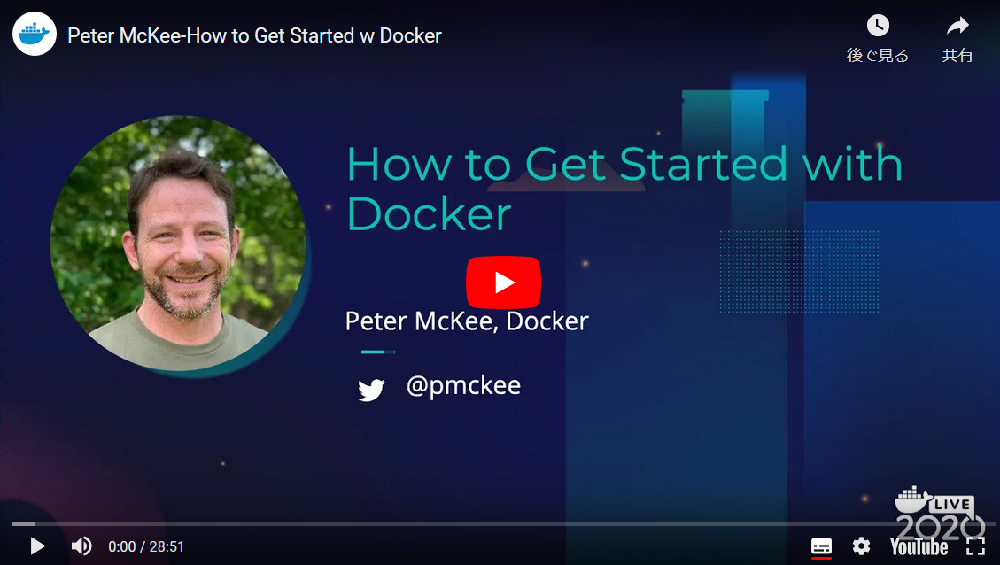

.. -*- coding: utf-8 -*-
.. URL: https://docs.docker.com/get-started/
   doc version: 19.03
      https://github.com/docker/docker.github.io/blob/master/get-started/index.md
.. check date: 2020/06/16
.. Commits on Jun 4, 2020 cf3c9ab3e970e2be6fb09360994200e46d02b603
.. -----------------------------------------------------------------------------

.. Get Started, Part 1: Orientation and Setup

========================================
Part 1：概要説明とセットアップ
========================================

.. sidebar:: 目次

   .. contents:: 
       :depth: 2
       :local:

.. Welcome! We are excited you want to learn how to use Docker.

ようこそ！ 皆さんが Docker の使い方を学ぼうとしており、私たちは嬉しく思います。

.. This page contains step-by-step instructions on how to get started with Docker. We also recommend the video walkthrough from Dockercon 2020.

このページでは段階的な手順に従って、Docker の始め方を学びます。また、 Dockercon 2020 の映像を見るのも推奨します。

.. The Docker Quickstart training module teaches you how to:

このクイックスタート・トレーニングでは、次の方法を伝授します：
このチュートリアルは６つのパートで構成されています。

..  Set up your Docker environment (on this page)
    Build and run your image
    Share images on Docker Hub

1. セットアップと概要説明、このページです。
2. :doc:`イメージの構築と実行 <part2>` 
3. :doc:`イメージを Docker Hub で共有 <part3>` 

.. Docker concepts

.. _docker-concepts:

Docker の概念
====================

.. Docker is a platform for developers and sysadmins to build, run, and share applications with containers. The use of containers to deploy applications is called containerization. Containers are not new, but their use for easily deploying applications is.

Docker とは開発者やシステム管理者が、コンテナでアプリケーションを **構築（build）、実行（run）、共有（share）**するためのプラットフォームです。アプリケーションをデプロイするために、コンテナを利用する事をコンテナ化（ `containerization` ）と呼びます。コンテナは新しくありませんが、コンテナを使えばアプリケーションのデプロイがより簡単になります。

.. Containerization is increasingly popular because containers are:

ますますコンテナ化の人気が高まるのは、コンテナには以下の特長があるためです。

..  Flexible: Even the most complex applications can be containerized.
    Lightweight: Containers leverage and share the host kernel, making them much more efficient in terms of system resources than virtual machines.
    Portable: You can build locally, deploy to the cloud, and run anywhere.
    Loosely coupled: Containers are highly self sufficient and encapsulated, allowing you to replace or upgrade one without disrupting others.
    Scalable: You can increase and automatically distribute container replicas across a datacenter.
    Secure: Containers apply aggressive constraints and isolations to processes without any configuration required on the part of the user.

* **柔軟（Flexible）** ：最も複雑なアプリケーションですらコンテナ化できます。
* **軽量（Lightweight）** ：ホスト・カーネルをコンテナは活用・共有するので、システムリソースに関しては仮想マシンよりも効率的に扱えます。
* **可搬性（Portable）** ：ローカルで構築し、クラウドにデプロイし、どこでも実行できます。
* **疎結合（Loosely coupled）** ：コンテナは、コンテナ自身のことは自分で完結し、カプセル化しています。そのため、他の何らかの中断をしなくても、置き換えやアップグレードが可能です。
* **拡張性（Scalable）** ：データセンタ内の至るところで、複製したコンテナの追加と自動分散が可能です。
* **安全（Secure）** ：利用者による設定がなくても、コンテナは積極的な制限と分離（isolate）をプロセスに適用します。

.. Images and containers

.. _images-and-containers:

イメージとコンテナ
------------------------------

.. Fundamentally, a container is nothing but a running process, with some added encapsulation features applied to it in order to keep it isolated from the host and from other containers. One of the most important aspects of container isolation is that each container interacts with its own private filesystem; this filesystem is provided by a Docker image. An image includes everything needed to run an application - the code or binary, runtimes, dependencies, and any other filesystem objects required.

基本的に、コンテナは何もしませんが、プロセスが走っています。このプロセスは、ホストと他のコンテナから隔離（isolate）し続けるために、複数のカプセル化する機能をプロセスに対して追加しています。コンテナ隔離（isolation）の最も重要な特長とは、各コンテナが自分自身のプライベート・ファイルシステムとやりとりできる点です。すなわち、このファイスシステムは Docker **イメージ**  によって提供されます。イメージに含まれるのは、アプリケーションの実行に必要な全てです。たとえば、コード、バイナリ、ランタイム、依存関係、その他の必要なあらゆるファイルシステム・オブジェクトです。

.. Containers and virtual machines

.. _containers-and-virtual-machines:

コンテナと仮想マシン
------------------------------

.. A container runs natively on Linux and shares the kernel of the host machine with other containers. It runs a discrete process, taking no more memory than any other executable, making it lightweight.

コンテナは Linux 上でネイティブに実行し、ホストマシン上のカーネルを他のコンテナと共有します。コンテナは離れたプロセスを実行しますが、実行するもの以外でメモリを必要としないため、軽量になります。

.. figure:: ./images/container.png
   :scale: 50 %
   :alt: コンテナスタックの例

.. By contrast, a virtual machine (VM) runs a full-blown “guest” operating system with virtual access to host resources through a hypervisor. In general, VMs incur a lot of overhead beyond what is being consumed by your application logic.

一方で、 **仮想マシン**  （VM）はハイパーバイザを通してホスト・リソースに仮想的にアクセスし、完全な "ゲスト" オペレーティングシステム実行します。一般的に、アプリケーションのロジックで何を消費するかによりますが、それよりも多くのオーバヘッドを仮想マシンでは受けます。

.. figure:: ./images/vm.png
   :scale: 50 %
   :alt: 仮想マシンスタックの例

.. Set up your Docker environment

.. _set-up-your-docker-environment:

Docker 環境をセットアップ
==============================

.. Download and install Docker Desktop

.. _download-and-install-docker-desktop:

Docker デスクトップのダウンロードとインストール
--------------------------------------------------

.. Docker Desktop is an easy-to-install application for your Mac or Windows environment that enables you to start coding and containerizing in minutes. Docker Desktop includes everything you need to build, run, and share containerized applications right from your machine.

Docker Desktop は Mac や Windows 環境に簡単にインストールできるアプリケーションです。これにより、ものの数分でコーディングやコンテナ化を始められます。Docker Desktop にはコンテナ化したアプリケーションを、マシン上で直ちに構築、実行、共有するために必要な全てを含みます。

.. Follow the instructions appropriate for your operating system to download and install Docker Desktop:

オペレーティングシステムに適切な手順に従い、Docker Desktop のダウンロードとインストールを行います。

..  Docker Desktop for Mac
    Docker Desktop for Windows

* :doc:`Docker Desktop for Mac </docker-for-mac/install>`
* :doc:`Docker Desktop for Windows </docker-for-windows/install>`

.. Test Docker version

.. _test-docker-version:

Docker バージョンのテスト
------------------------------

.. After you’ve successfully installed Docker Desktop, open a terminal and run docker --version to check the version of Docker installed on your machine.

Docker Desktop のインストールに精巧したら、ターミナルを開き、 ``docker --version`` を実行し、マシン上にインストールした Docker のバージョンを確認します。

.. code-block:: bash

   $ docker --version
   Docker version 19.03.5, build 633a0ea

.. Test Docker installation

.. _test_docker-installation:

Docker インストールのテスト
------------------------------

..    Test that your installation works by running the hello-world Docker image:

1. `hello-world <https://hub.docker.com/_/hello-world/>`_ Docker イメージを実行し、インストールが正常に行われたかどうかを確認します。

.. code-block:: bash

   $ docker run hello-world
   
   Unable to find image 'hello-world:latest' locally
   latest: Pulling from library/hello-world
   ca4f61b1923c: Pull complete
   Digest: sha256:ca0eeb6fb05351dfc8759c20733c91def84cb8007aa89a5bf606bc8b315b9fc7
   Status: Downloaded newer image for hello-world:latest
   
   Hello from Docker!
   This message shows that your installation appears to be working correctly.
   ...

..    Run docker image ls to list the hello-world image that you downloaded to your machine.

2. ``docker image ls`` を実行し、マシン上にダウンロードした ``hello-world`` イメージが一覧にあるかどうか確認します。

..    List the hello-world container (spawned by the image) which exits after displaying its message. If it is still running, you do not need the --all option:

3. メッセージを表示して終了した ``hello-world`` コンテナ（イメージから生成）が一覧にあるかどうかを確認します。もしまだ実行中であれば、 ``--all`` オプションは不要です。

.. code-block:: bash

   $ docker ps --all
   
   CONTAINER ID     IMAGE           COMMAND      CREATED            STATUS
   54f4984ed6a8     hello-world     "/hello"     20 seconds ago     Exited (0) 19 seconds ago

.. Conclusion

まとめ
==========

.. At this point, you’ve installed Docker Desktop on your development machine, and ran a quick test to ensure you are set up to build and run your first containerized application.

この段階では、皆さんの開発マシン上に Docker Desktop をインストールし、初めてのコンテナ化アプリケーションを構築・実行し、セットアップが問題なかったどうかを簡単にテストしました。

* :doc:`パート２に進む <part2>`

.. seealso::

   Orientation and setup
      https://docs.docker.com/get-started/

