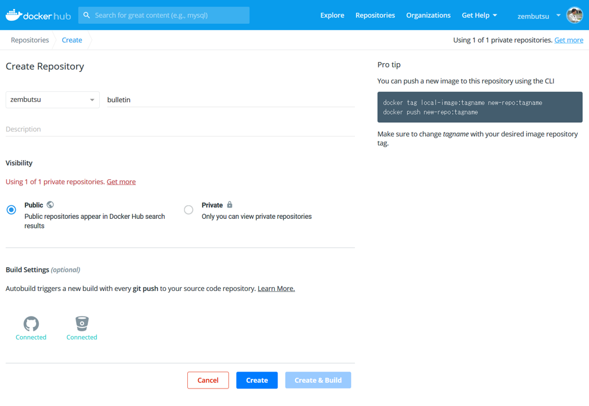

.. -*- coding: utf-8 -*-
.. URL: https://docs.docker.com/get-started/part3/
   doc version: 19.03
      https://github.com/docker/docker.github.io/blob/master/get-started/part3.md
.. check date: 2020/06/16
.. Commits on May 22, 2020 ba08845b64d6b9f4387148ab878b1e7dafaaf50f
.. -----------------------------------------------------------------------------

.. Share images on Docker Hub

.. _share-images-on-docker-hub:

========================================
Docker Hub 上でイメージを共有
========================================

.. sidebar:: 目次

   .. contents:: 
       :depth: 2
       :local:

.. Prerequisites

.. _part3-prerequisites:

必要条件
==========

.. Work through the steps to build an image and run it as a containerized application in Part 2.

* :doc:`Part 2 <part2>` の概要とセットアップを一通り読んでください。

.. _part3-introduction:

はじめに
==========

.. At this point, you’ve built a containerized application described in Part 2 on your local development machine.

この時点で、自分のローカル開発マシン上で、 :doc:`Part 2 <part2>` で記述したコンテナ化アプリケーションの構築が完了しています。

.. The final step in developing a containerized application is to share your images on a registry like Docker Hub, so they can be easily downloaded and run on any destination machine.

コンテナ化アプリケーション開発の最後のステップとして、 `Docker Hub <https://hub.docker.com/>`_  のようなレジストリ（registry）上でイメージを共有します。これにより、あらゆるマシン上で簡単にダウンロードでき、実行可能になります。

.. Set up your Docker Hub account

.. _set-up-your-docker-hub-account:

Docker Hub アカウントのセットアップ
========================================

.. If you don’t have a Docker ID, follow these steps to create one. A Docker ID allows you to share images on Docker Hub.

Docker ID を持っていなければ、以下のステップで Docker ID を作成します。Docker ID があれば Docker Hub 上でイメージを共有できます。

..    Visit the Docker Hub sign up page.

1. `Docker Hub サインアップ <https://hub.docker.com/signup>`_ ページを表示します。

..    Fill out the form and submit to create your Docker ID.

2. フォームに入力し、送信すると、Docker を作成します。

..    Verify your email address to complete the registration process.

3. 登録手続きを完了するため、電子メールアドレスを確認します。

..    Click on the Docker icon in your toolbar or system tray, and click Sign in / Create Docker ID.

4. ツールバーもしくはシステムトレイ上の Docker アイコンをクリックし、 **Sign in / Create Docker ID**  （サインイン / Docker ID の作成）をクリックします。

..    Fill in your new Docker ID and password. After you have successfully authenticated, your Docker ID appears in the Docker Desktop menu in place of the ‘Sign in’ option you just used.

5. 新しい Docker ID とパスワードを入力します。認証に成功すると、Docker Desktop メニューの 'Sign in' とあった場所に、 自分の Docker ID を表示します。

..    You can also sign into Docker Hub from the command line by typing docker login.

また、コマンドラインから Docker  Hub にサインインするには ``docker login`` を入力します。

.. Create a Docker Hub repository and push your image

.. _create-a-docker-hub-repository-and-push-your-image:

Docker Hub リポジトリを作成し、イメージを送信
==================================================

..    Before creating a repository, ensure you’ve set up your Docker Hub account and have connected it to your Docker Desktop.

.. note::

   リポジトリを作成する前に、Docker Hub アカウントのセットアップ完了と、Docker Desktop からの接続が完了していることを確認します。

.. Now let’s create your first repository, and push your bulletin board image to Docker Hub.

それでは、初めてのリポジトリを作成し、掲示板イメージを Docker Hub へアップロードしましょう。

..    Click on the Docker icon in your menu bar, and navigate to Repositories > Create. You’ll be redirected to the Create Repository page on Docker Hub.

1. メニューバーの Docker アイコンをクリックし、 **Repositories > Create**  （リポジトリ・作成）を選びます。そうすると、 Docker Hub 上の **Create Repository**  （リポジトリ作成）のページに転送されます。

..    Type the repository name as bulletinboard and click Create at the bottom of the page. Do not fill any other details for now.

2. レポジトリ名（repository name）を ``bulletinboard``  と入力し、ページの下にある **Create** （作成）ボタンをクリックします。現時点では他の項目は入力しないでください。

..    make a repo

..    You are now ready to share your image on Docker Hub, however, there’s one thing you must do first: images must be namespaced correctly to share on Docker Hub. Specifically, you must name images like <Your Docker ID>/<Repository Name>:<tag>.

3. これで Docker Hub 上でイメージを共有する準備が整いました。しかし、もう1つ何よりも重要な作業があります。それは、イメージを Docker Hub 上で共有するため、 *適切な名前空間* にすることです。イメージ名に対しては、 ``<自分の Docker ID>/<リポジトリ名>:<タグ>`` のように明示する必要があります。

..    Make sure you’re in the node-bulletin-board/bulletin-board-app directory in a terminal or PowerShell then and run:

ターミナルあるいは PowerShell で ``node-bulletin-board/bulletin-board-app`` ディレクトリ内にいることを確認し、次のコマンドを実行します。

.. code-block:: bash

   docker tag bulletinboard:1.0 <自分の Docker ID>/bulletinboard:1.0

..    Finally, push your image to Docker Hub:

4. 最後に、イメージを Docker Hub に送信（push）します。

.. code-block:: bash

   docker push <自分の Docker ID>/bulletinboard:1.0

..    Visit your repository in Docker Hub, and you’ll see your new image there. Remember, Docker Hub repositories are public by default.

`Docker Hub <https://hub.docker.com/repositories>`__ の自分のリポジトリ上で、新しいイメージが置かれたのを確認します。Docker Hub のリポジトリは、デフォルトでパブリック（誰でも利用できる一般公開状態）ですので、覚えておいてください。

..        Having trouble pushing? Remember, you must be signed into Docker Hub through Docker Desktop or the command line, and you must also name your images correctly, as per the above steps. If the push seemed to work, but you don’t see it in Docker Hub, refresh your browser after a couple of minutes and check again.

.. note::

   **push 時に問題が起きましたか？** 覚えていますでしょうか。Docker Desktop やコマンドラインを通して Docker Hub にサインインする必要があります。また、先ほどのステップで見たとおり、イメージに対して正しい名前を付ける必要もあります。もし push が成功したように見えても Docker Hub で見えなければ、数分後にブラウザを再読み込みし、再び確認してください。

.. Conclusion

.. _part3-conclusion:

まとめ
==========

.. Now that your image is available on Docker Hub, you’ll be able to run it anywhere. If you try to use it on a new machine that doesn’t have it yet, Docker will automatically try and download it from Docker Hub. By moving images around in this way, you no longer need to install any dependencies except Docker on the machines you want to run your software on. The dependencies of containerized applications are completely encapsulated and isolated within your images, which you can share using Docker Hub as described above.

これであなたの Docker イメージは Docker Hub で利用可能になり、どこでも実行できるようになりました。もしも新しいマシンで使おうとする場合、そこにイメージが無かったとしても、Docker は Docker Hub から自動的にダウンロードを試みます。以上の方法でイメージを移動できますので、ソフトウェアを実行したいマシン上では、Docker 以外全ての依存関係が不要です。コンテナ化アプリケーションの依存関係は、イメージの中に完全にカプセル化され、隔離されています。そして、このイメージは先ほど見た通り Docker Hub を使って共有できます。

.. Another thing to keep in mind: at the moment, you’ve only pushed your image to Docker Hub; what about your Dockerfile? A crucial best practice is to keep these in version control, perhaps alongside your source code for your application. You can add a link or note in your Docker Hub repository description indicating where these files can be found, preserving the record not only of how your image was built, but how it’s meant to be run as a full application.

もう１つ覚えておいてください。今のところイメージを Docker Hub に送信したにすぎません。つまり、 Dockerfile はどうしたらよいでしょうか。ベストプラクティスに不可欠なのは、バージョン管理をすることであり、可能であればアプリケーションの依存関係のソースコードと共に行うことです。Docker Hub リポジトリ音説明には、どこでそれら Dockerifle を見つけられるかのリンクやメモを追加できます。記録できるのはイメージのビルドの仕方だけでなく、アプリケーションの依存関係の完全に実行する方法についても可能です。

.. Where to go next

.. _part3-where-to-go-next:

次に進む場所
====================

.. We recommend that you take a look at the topics in Develop with Docker to learn how to develop your own applications using Docker.

私たちが推奨するのは、Docker を使って自分自身のアプリケーションの開発のしかたを学ぶため、:doc:`</develop/index>` にあるトピックを調べましょう。

.. seealso::

   Share images on Docker Hub
      https://docs.docker.com/get-started/part3/

